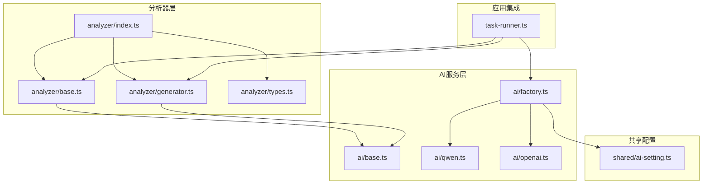
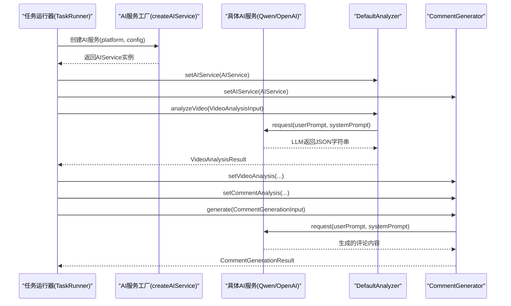
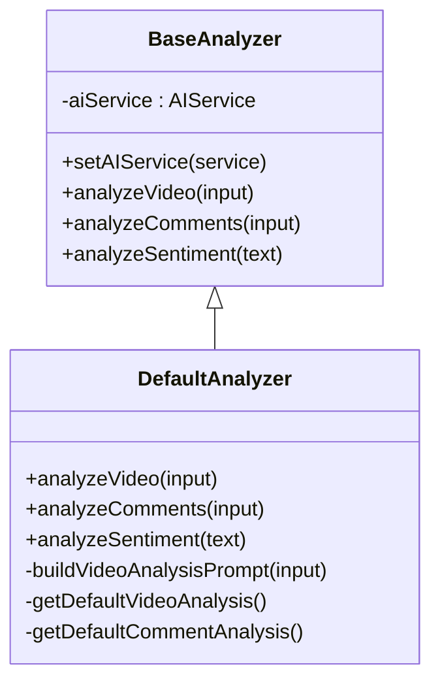
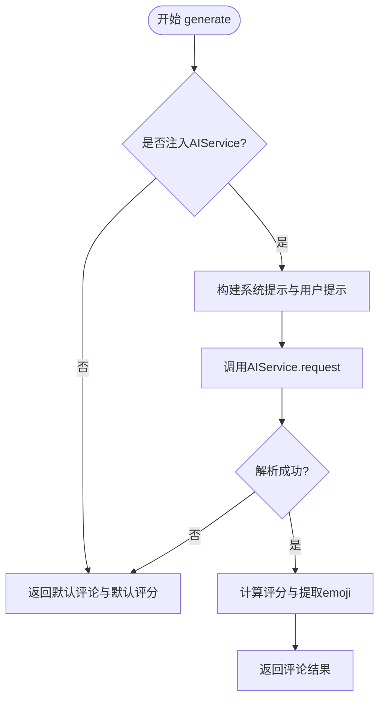
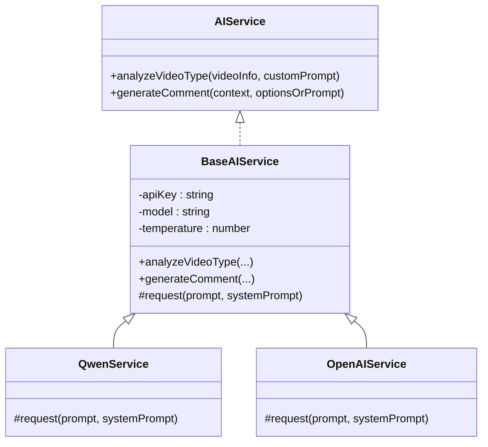
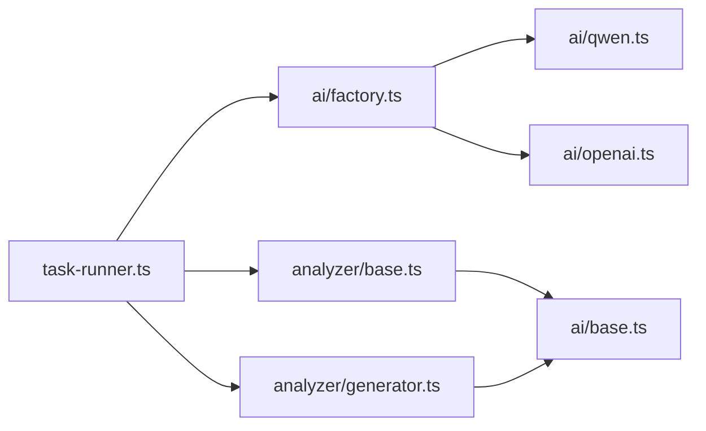

# AI分析器API

<cite>
**本文引用的文件**
- [analyzer/index.ts](file://src/main/integration/ai/analyzer/index.ts)
- [analyzer/base.ts](file://src/main/integration/ai/analyzer/base.ts)
- [analyzer/generator.ts](file://src/main/integration/ai/analyzer/generator.ts)
- [analyzer/types.ts](file://src/main/integration/ai/analyzer/types.ts)
- [ai/base.ts](file://src/main/integration/ai/base.ts)
- [ai/factory.ts](file://src/main/integration/ai/factory.ts)
- [ai/qwen.ts](file://src/main/integration/ai/qwen.ts)
- [ai/openai.ts](file://src/main/integration/ai/openai.ts)
- [shared/ai-setting.ts](file://src/shared/ai-setting.ts)
- [task-runner.ts](file://src/main/service/task-runner.ts)
</cite>

## 目录
1. [简介](#简介)
2. [项目结构](#项目结构)
3. [核心组件](#核心组件)
4. [架构总览](#架构总览)
5. [详细组件分析](#详细组件分析)
6. [依赖关系分析](#依赖关系分析)
7. [性能与配置](#性能与配置)
8. [故障排查指南](#故障排查指南)
9. [结论](#结论)
10. [附录](#附录)

## 简介
本文件为AI分析器系统的API参考文档，聚焦于视频内容分析、标签生成、情感分析与内容质量评估能力。文档覆盖以下要点：
- Analyzer接口定义与实现：BaseAnalyzer抽象类与DefaultAnalyzer默认实现；Generator分析器（评论生成）的实现与扩展。
- 视频分析、评论分析、情感分析的输入输出规范与JSON结构约束。
- 分析器配置参数、调用流程、错误回退策略与性能指标建议。
- 分析器选择策略、批量生成与结果缓存的使用指南。

## 项目结构
AI分析器位于主进程集成层的“integration/ai/analyzer”目录下，配合通用AI服务层（AIService）与平台适配器共同工作。核心文件组织如下：
- analyzer/index.ts：导出类型、基类与具体实现，作为对外统一入口。
- analyzer/base.ts：定义BaseAnalyzer抽象类与DefaultAnalyzer默认实现。
- analyzer/generator.ts：定义评论生成器CommentGenerator及其批量生成函数。
- analyzer/types.ts：定义所有分析与生成的输入输出数据模型。
- ai/base.ts：定义AIService接口与BaseAIService抽象实现，提供通用请求封装与评论生成模板。
- ai/factory.ts：AI服务工厂，按平台创建具体AI服务实例。
- ai/qwen.ts、ai/openai.ts：具体AI服务实现（以DashScope与OpenAI为例）。
- shared/ai-setting.ts：AI平台枚举、默认配置与可用模型映射。
- task-runner.ts：任务运行器中对AI分析器的集成与缓存使用示例。

图表来源
- [analyzer/index.ts:1-4](file://src/main/integration/ai/analyzer/index.ts#L1-L4)
- [analyzer/base.ts:1-183](file://src/main/integration/ai/analyzer/base.ts#L1-L183)
- [analyzer/generator.ts:1-180](file://src/main/integration/ai/analyzer/generator.ts#L1-L180)
- [analyzer/types.ts:1-73](file://src/main/integration/ai/analyzer/types.ts#L1-L73)
- [ai/base.ts:1-131](file://src/main/integration/ai/base.ts#L1-L131)
- [ai/factory.ts:1-27](file://src/main/integration/ai/factory.ts#L1-L27)
- [ai/qwen.ts:1-45](file://src/main/integration/ai/qwen.ts#L1-L45)
- [ai/openai.ts:1-45](file://src/main/integration/ai/openai.ts#L1-L45)
- [shared/ai-setting.ts:1-29](file://src/shared/ai-setting.ts#L1-L29)
- [task-runner.ts:1-200](file://src/main/service/task-runner.ts#L1-L200)

章节来源
- [analyzer/index.ts:1-4](file://src/main/integration/ai/analyzer/index.ts#L1-L4)
- [analyzer/base.ts:1-183](file://src/main/integration/ai/analyzer/base.ts#L1-L183)
- [analyzer/generator.ts:1-180](file://src/main/integration/ai/analyzer/generator.ts#L1-L180)
- [analyzer/types.ts:1-73](file://src/main/integration/ai/analyzer/types.ts#L1-L73)
- [ai/base.ts:1-131](file://src/main/integration/ai/base.ts#L1-L131)
- [ai/factory.ts:1-27](file://src/main/integration/ai/factory.ts#L1-L27)
- [ai/qwen.ts:1-45](file://src/main/integration/ai/qwen.ts#L1-L45)
- [ai/openai.ts:1-45](file://src/main/integration/ai/openai.ts#L1-L45)
- [shared/ai-setting.ts:1-29](file://src/shared/ai-setting.ts#L1-L29)
- [task-runner.ts:1-200](file://src/main/service/task-runner.ts#L1-L200)

## 核心组件
- BaseAnalyzer抽象类：定义视频分析、评论分析、情感分析三类抽象方法，并提供设置AI服务的能力。
- DefaultAnalyzer默认实现：基于AIService构建系统提示与用户提示，调用LLM返回JSON，解析后输出标准化结果；在无服务或解析失败时返回安全默认值。
- CommentGenerator评论生成器：接收视频分析与评论分析结果，结合用户输入与风格偏好生成评论；提供批量生成函数。
- AIService/AIServiceImpl：定义统一的AI服务接口与通用实现，负责构造系统提示与用户提示、调用底层模型、截断与错误回退。
- 工厂与平台：通过工厂按平台创建具体AI服务实例，支持多平台切换。

章节来源
- [analyzer/base.ts:10-22](file://src/main/integration/ai/analyzer/base.ts#L10-L22)
- [analyzer/base.ts:24-182](file://src/main/integration/ai/analyzer/base.ts#L24-L182)
- [analyzer/generator.ts:9-53](file://src/main/integration/ai/analyzer/generator.ts#L9-L53)
- [analyzer/generator.ts:169-180](file://src/main/integration/ai/analyzer/generator.ts#L169-L180)
- [ai/base.ts:23-26](file://src/main/integration/ai/base.ts#L23-L26)
- [ai/base.ts:28-131](file://src/main/integration/ai/base.ts#L28-L131)
- [ai/factory.ts:16-25](file://src/main/integration/ai/factory.ts#L16-L25)

## 架构总览
AI分析器采用分层设计：
- 应用层（TaskRunner）从存储读取AI配置，创建AIService实例，注入到分析器与生成器。
- 分析器层（BaseAnalyzer/DefaultAnalyzer）负责视频与评论的结构化分析。
- 生成器层（CommentGenerator）在已有分析结果基础上生成高质量评论。
- 服务层（AIService/BaseAIService/Qwen/OpenAI）封装HTTP请求、超时控制与错误回退。

图表来源
- [task-runner.ts:106-113](file://src/main/service/task-runner.ts#L106-L113)
- [ai/factory.ts:16-25](file://src/main/integration/ai/factory.ts#L16-L25)
- [ai/base.ts:39-131](file://src/main/integration/ai/base.ts#L39-L131)
- [analyzer/base.ts:24-182](file://src/main/integration/ai/analyzer/base.ts#L24-L182)
- [analyzer/generator.ts:26-53](file://src/main/integration/ai/analyzer/generator.ts#L26-L53)

## 详细组件分析

### Analyzer接口与DefaultAnalyzer实现
- 接口职责
  - analyzeVideo：对视频元信息、标签、互动数据等进行分析，输出分类、主题、受众、互动水平、评论情绪倾向、推荐评论风格、避词、趋势短语与置信度。
  - analyzeComments：对评论列表进行统计分析，输出热门话题、情感分布、热门风格、流行表达、受众性格、建议语气与可借鉴评论示例。
  - analyzeSentiment：对文本进行情感倾向分析，输出整体情感、情感得分与情感关键词。
- 默认实现策略
  - 若未注入AIService，返回安全默认值（如默认分类、默认评论风格、中性情感等）。
  - 构建系统提示与用户提示，调用AIService.request，解析LLM返回的JSON字符串，映射为标准化结果对象。
  - 解析失败或无响应时，回退到默认值，保证稳定性。

图表来源
- [analyzer/base.ts:10-22](file://src/main/integration/ai/analyzer/base.ts#L10-L22)
- [analyzer/base.ts:24-182](file://src/main/integration/ai/analyzer/base.ts#L24-L182)

章节来源
- [analyzer/base.ts:10-22](file://src/main/integration/ai/analyzer/base.ts#L10-L22)
- [analyzer/base.ts:24-182](file://src/main/integration/ai/analyzer/base.ts#L24-L182)

### 评论生成器（CommentGenerator）
- 组件职责
  - 接收视频分析与评论分析结果，结合用户输入（上下文、示例、要求、风格、最大长度等）生成评论。
  - 提供批量生成函数，内部使用Promise.all并发生成多个评论。
  - 计算生成内容的综合评分（长度、是否含问号、是否含中文、是否含emoji、是否包含避词），并提取建议emoji。
- 关键流程
  - 构建系统提示：根据风格指令与长度限制生成约束。
  - 构建用户提示：整合视频分析、评论分析、参考评论与用户要求。
  - 调用AIService.request生成内容，解析并计算评分与emoji。
  - 失败或无响应时返回默认评论与默认评分。

图表来源
- [analyzer/generator.ts:26-53](file://src/main/integration/ai/analyzer/generator.ts#L26-L53)
- [analyzer/generator.ts:55-108](file://src/main/integration/ai/analyzer/generator.ts#L55-L108)
- [analyzer/generator.ts:129-166](file://src/main/integration/ai/analyzer/generator.ts#L129-L166)

章节来源
- [analyzer/generator.ts:9-53](file://src/main/integration/ai/analyzer/generator.ts#L9-L53)
- [analyzer/generator.ts:55-108](file://src/main/integration/ai/analyzer/generator.ts#L55-L108)
- [analyzer/generator.ts:129-166](file://src/main/integration/ai/analyzer/generator.ts#L129-L166)
- [analyzer/generator.ts:169-180](file://src/main/integration/ai/analyzer/generator.ts#L169-L180)

### 数据模型与API规范
- 视频分析输入（VideoAnalysisInput）
  - 字段：标题、描述、作者（名称、粉丝数、是否认证）、标签数组、互动计数（点赞、收藏、分享）、参考评论示例。
- 视频分析结果（VideoAnalysisResult）
  - 字段：分类、主题、目标受众、互动水平（高/中/低）、评论情绪倾向（正/中/负）、推荐评论风格数组、避词数组、趋势短语数组（可选）、分析置信度。
- 评论分析输入（CommentAnalysisInput）
  - 字段：评论数组（内容、点赞数、可选情感）、视频上下文。
- 评论分析结果（CommentAnalysisResult）
  - 字段：热门话题数组、情感分布（正/中/负概率）、热门评论风格、流行表达、受众性格、建议互动语气、可借鉴评论示例。
- 情感分析结果（SentimentAnalysisResult）
  - 字段：整体情感（正/中/负）、情感得分（0-1）、情感关键词数组。
- 评论生成输入（CommentGenerationInput）
  - 扩展自视频分析结果：视频上下文、用户要求、参考评论、最大长度、风格（幽默/严肃/提问/赞美/混合）、是否包含emoji。
- 评论生成结果（CommentGenerationResult）
  - 字段：内容、评分（0-1）、建议emoji数组（可选）、避词数组（可选）、推理说明（可选）。

章节来源
- [analyzer/types.ts:1-73](file://src/main/integration/ai/analyzer/types.ts#L1-L73)

### AI服务层与工厂
- AIService接口
  - analyzeVideoType：判断是否需要关注视频并给出理由。
  - generateComment：生成评论，支持上下文对象或字符串、风格与长度限制、自定义提示。
- BaseAIService通用实现
  - 统一构造系统提示与用户提示，调用子类request方法，处理JSON解析与错误回退。
- 具体服务实现
  - QwenService：对接DashScope Chat Completions。
  - OpenAIService：对接OpenAI Chat Completions。
- 工厂createAIService
  - 根据平台映射创建对应服务实例，支持温度参数配置。

图表来源
- [ai/base.ts:23-131](file://src/main/integration/ai/base.ts#L23-L131)
- [ai/qwen.ts:3-45](file://src/main/integration/ai/qwen.ts#L3-L45)
- [ai/openai.ts:3-45](file://src/main/integration/ai/openai.ts#L3-L45)

章节来源
- [ai/base.ts:23-131](file://src/main/integration/ai/base.ts#L23-L131)
- [ai/qwen.ts:3-45](file://src/main/integration/ai/qwen.ts#L3-L45)
- [ai/openai.ts:3-45](file://src/main/integration/ai/openai.ts#L3-L45)
- [ai/factory.ts:16-25](file://src/main/integration/ai/factory.ts#L16-L25)

## 依赖关系分析
- 组件耦合
  - DefaultAnalyzer与CommentGenerator均依赖AIService接口，通过setAIService注入，降低与具体平台实现的耦合。
  - 工厂createAIService屏蔽平台差异，便于切换与扩展。
- 外部依赖
  - HTTP请求：QwenService与OpenAIService分别调用DashScope与OpenAI的Chat Completions接口。
  - 超时控制：AbortController用于30秒超时保护。
- 潜在环路
  - 分析器与生成器仅单向依赖AIService，无循环依赖风险。

图表来源
- [ai/factory.ts:16-25](file://src/main/integration/ai/factory.ts#L16-L25)
- [ai/qwen.ts:3-45](file://src/main/integration/ai/qwen.ts#L3-L45)
- [ai/openai.ts:3-45](file://src/main/integration/ai/openai.ts#L3-L45)
- [analyzer/base.ts:10-22](file://src/main/integration/ai/analyzer/base.ts#L10-L22)
- [analyzer/generator.ts:9-16](file://src/main/integration/ai/analyzer/generator.ts#L9-L16)
- [task-runner.ts:106-113](file://src/main/service/task-runner.ts#L106-L113)

章节来源
- [ai/factory.ts:16-25](file://src/main/integration/ai/factory.ts#L16-L25)
- [analyzer/base.ts:10-22](file://src/main/integration/ai/analyzer/base.ts#L10-L22)
- [analyzer/generator.ts:9-16](file://src/main/integration/ai/analyzer/generator.ts#L9-L16)
- [task-runner.ts:106-113](file://src/main/service/task-runner.ts#L106-L113)

## 性能与配置
- 配置参数
  - 平台：volcengine、bailian、openai、deepseek。
  - API Key：按平台配置。
  - 模型：各平台可用模型集合（见平台模型映射）。
  - 温度：控制随机性，默认0.8或0.9。
- 性能指标建议
  - 响应时间：建议监控LLM请求耗时与解析耗时，设置合理超时（当前实现为30秒）。
  - 成功率：统计解析失败率与默认回退比例，评估提示工程有效性。
  - 评分一致性：对生成评论的评分阈值进行A/B测试，平衡多样性与合规性。
- 批量处理
  - 使用批量生成函数并发生成多条评论，提升吞吐。
- 结果缓存
  - 任务运行器维护视频缓存，减少重复抓取；分析器结果可按业务场景缓存，避免重复调用LLM。

章节来源
- [shared/ai-setting.ts:1-29](file://src/shared/ai-setting.ts#L1-L29)
- [ai/qwen.ts:4-44](file://src/main/integration/ai/qwen.ts#L4-L44)
- [ai/openai.ts:4-44](file://src/main/integration/ai/openai.ts#L4-L44)
- [analyzer/generator.ts:169-180](file://src/main/integration/ai/analyzer/generator.ts#L169-L180)
- [task-runner.ts:34-104](file://src/main/service/task-runner.ts#L34-L104)

## 故障排查指南
- 无AIService或未注入
  - 现象：分析与生成返回默认值。
  - 处理：检查AI设置与工厂创建逻辑，确保正确注入。
- LLM返回非JSON或为空
  - 现象：解析失败，回退默认值。
  - 处理：检查系统提示与用户提示构造，确保输出格式约束明确。
- HTTP请求失败或超时
  - 现象：日志打印错误，返回空结果。
  - 处理：检查网络、API Key、模型名与超时设置；必要时增加重试与降级策略。
- 生成内容过长或违规
  - 现象：评分偏低或被过滤。
  - 处理：调整最大长度、风格与避词策略；在生成前进行预检。

章节来源
- [analyzer/base.ts:24-66](file://src/main/integration/ai/analyzer/base.ts#L24-L66)
- [analyzer/base.ts:117-147](file://src/main/integration/ai/analyzer/base.ts#L117-L147)
- [analyzer/generator.ts:26-53](file://src/main/integration/ai/analyzer/generator.ts#L26-L53)
- [ai/qwen.ts:32-44](file://src/main/integration/ai/qwen.ts#L32-L44)
- [ai/openai.ts:32-44](file://src/main/integration/ai/openai.ts#L32-L44)

## 结论
本API体系通过清晰的抽象与分层设计，实现了视频分析、评论分析与评论生成的端到端能力。DefaultAnalyzer与CommentGenerator在无服务或异常情况下具备稳健的回退机制；工厂与平台实现解耦，便于扩展与迁移。建议在生产环境中结合缓存、批量处理与评分阈值策略，持续优化性能与质量。

## 附录
- 分析器选择策略
  - 根据平台与模型能力选择合适的服务实现；在多平台间对比响应时间与准确性，动态切换。
- 批量处理
  - 使用批量生成函数并发生成多条评论，注意控制并发度与资源占用。
- 结果缓存
  - 在任务运行器中复用视频缓存；对分析与生成结果按业务需求进行短期缓存，减少重复调用。

章节来源
- [ai/factory.ts:16-25](file://src/main/integration/ai/factory.ts#L16-L25)
- [analyzer/generator.ts:169-180](file://src/main/integration/ai/analyzer/generator.ts#L169-L180)
- [task-runner.ts:34-104](file://src/main/service/task-runner.ts#L34-L104)