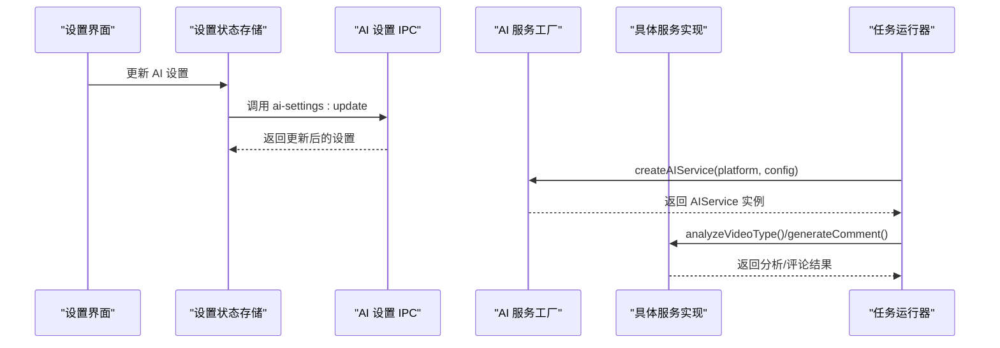
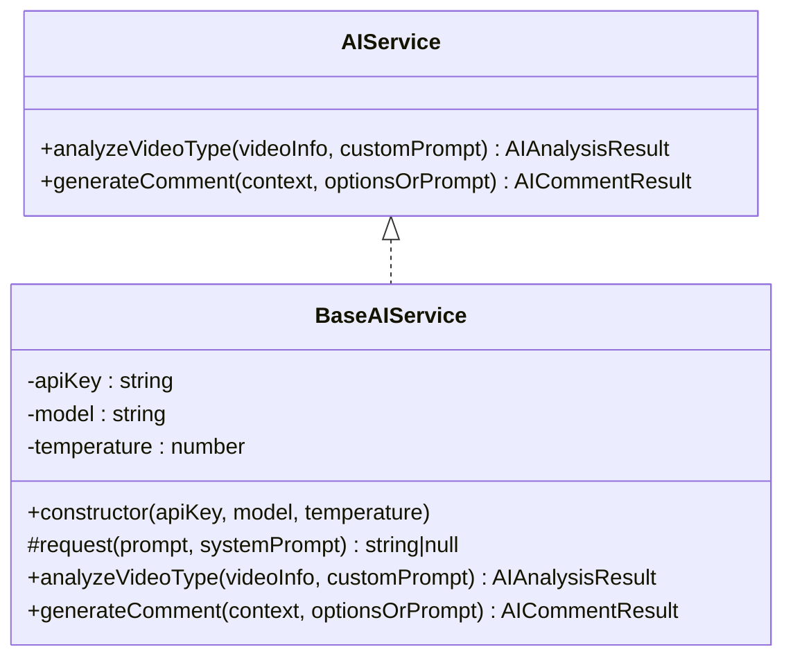
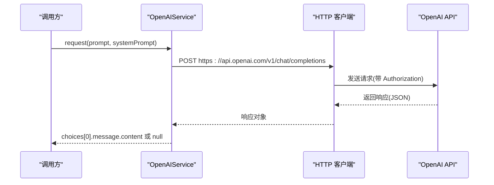
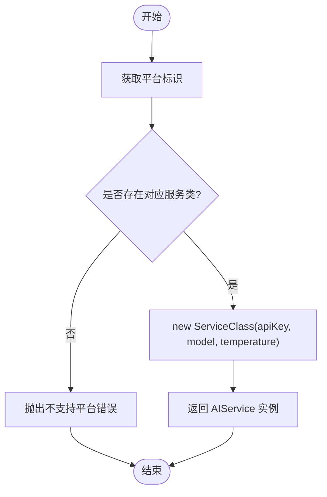
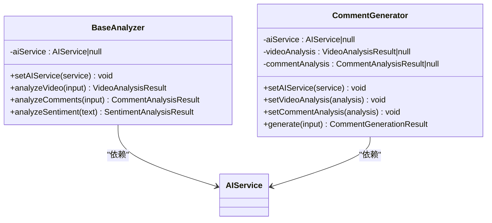
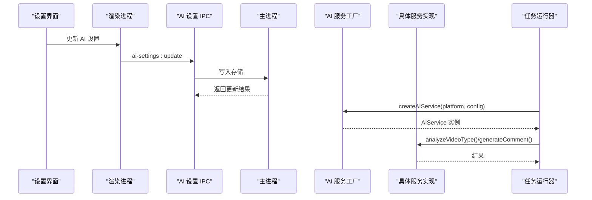
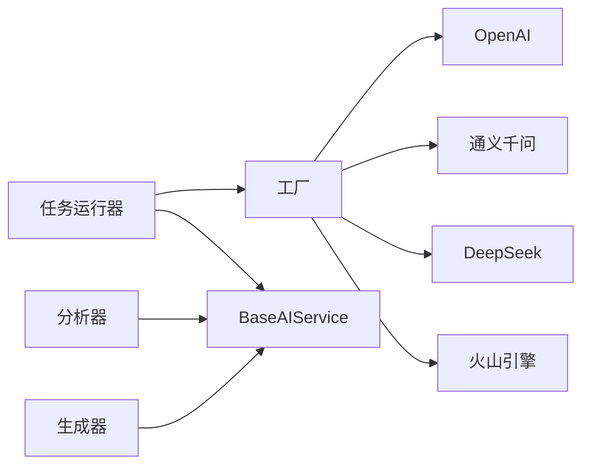

# AI服务API参考

<cite>
**本文档引用的文件**
- [src/main/integration/ai/factory.ts](file://src/main/integration/ai/factory.ts)
- [src/main/integration/ai/base.ts](file://src/main/integration/ai/base.ts)
- [src/main/integration/ai/openai.ts](file://src/main/integration/ai/openai.ts)
- [src/main/integration/ai/qwen.ts](file://src/main/integration/ai/qwen.ts)
- [src/main/integration/ai/deepseek.ts](file://src/main/integration/ai/deepseek.ts)
- [src/main/integration/ai/ark.ts](file://src/main/integration/ai/ark.ts)
- [src/main/integration/ai/analyzer/index.ts](file://src/main/integration/ai/analyzer/index.ts)
- [src/main/integration/ai/analyzer/types.ts](file://src/main/integration/ai/analyzer/types.ts)
- [src/main/integration/ai/analyzer/base.ts](file://src/main/integration/ai/analyzer/base.ts)
- [src/main/integration/ai/analyzer/generator.ts](file://src/main/integration/ai/analyzer/generator.ts)
- [src/shared/ai-setting.ts](file://src/shared/ai-setting.ts)
- [src/preload/index.ts](file://src/preload/index.ts)
- [src/renderer/src/stores/settings.ts](file://src/renderer/src/stores/settings.ts)
- [src/main/ipc/ai-setting.ts](file://src/main/ipc/ai-setting.ts)
- [src/main/service/task-runner.ts](file://src/main/service/task-runner.ts)
</cite>

## 目录
1. [简介](#简介)
2. [项目结构](#项目结构)
3. [核心组件](#核心组件)
4. [架构总览](#架构总览)
5. [详细组件分析](#详细组件分析)
6. [依赖关系分析](#依赖关系分析)
7. [性能考虑](#性能考虑)
8. [故障排除指南](#故障排除指南)
9. [结论](#结论)
10. [附录](#附录)

## 简介
本文件为 AutoOps AI 服务集成的 API 参考文档，覆盖以下内容：
- AI 服务提供方接口规范：OpenAI、通义千问、DeepSeek、Reka（火山引擎）的 API 调用方式与差异
- AI 分析器接口定义：输入输出格式、配置参数与使用示例
- AI 服务工厂的创建与管理机制、服务选择策略与错误处理
- API 密钥配置、请求频率限制、成本控制与性能优化建议

## 项目结构
AI 服务相关代码主要位于主进程的 integration/ai 目录，包含服务抽象层、具体服务实现、分析器与工厂；同时通过 IPC 提供设置读取与更新能力。

```mermaid
graph TB
subgraph "主进程"
F["工厂<br/>factory.ts"]
B["基础接口<br/>base.ts"]
O["OpenAI 实现<br/>openai.ts"]
Q["通义千问 实现<br/>qwen.ts"]
D["DeepSeek 实现<br/>deepseek.ts"]
A["火山引擎 实现<br/>ark.ts"]
ZI["分析器索引<br/>analyzer/index.ts"]
ZT["分析器类型<br/>analyzer/types.ts"]
ZB["默认分析器<br/>analyzer/base.ts"]
ZG["评论生成器<br/>analyzer/generator.ts"]
end
subgraph "共享设置"
S["AI 设置类型<br/>ai-setting.ts"]
end
subgraph "渲染进程"
P["预加载桥接<br/>preload/index.ts"]
ST["设置状态存储<br/>renderer/src/stores/settings.ts"]
end
subgraph "IPC"
IPC["AI 设置 IPC<br/>main/ipc/ai-setting.ts"]
end
subgraph "业务集成"
TR["任务运行器<br/>main/service/task-runner.ts"]
end
F --> O
F --> Q
F --> D
F --> A
B --> O
B --> Q
B --> D
B --> A
ZI --> ZT
ZI --> ZB
ZI --> ZG
S --> F
S --> IPC
P --> IPC
ST --> P
TR --> F
TR --> B
TR --> ZB
TR --> ZG
```

**图表来源**
- [src/main/integration/ai/factory.ts:1-27](file://src/main/integration/ai/factory.ts#L1-L27)
- [src/main/integration/ai/base.ts:1-131](file://src/main/integration/ai/base.ts#L1-L131)
- [src/main/integration/ai/openai.ts:1-45](file://src/main/integration/ai/openai.ts#L1-L45)
- [src/main/integration/ai/qwen.ts:1-45](file://src/main/integration/ai/qwen.ts#L1-L45)
- [src/main/integration/ai/deepseek.ts:1-45](file://src/main/integration/ai/deepseek.ts#L1-L45)
- [src/main/integration/ai/ark.ts:1-45](file://src/main/integration/ai/ark.ts#L1-L45)
- [src/main/integration/ai/analyzer/index.ts:1-4](file://src/main/integration/ai/analyzer/index.ts#L1-L4)
- [src/main/integration/ai/analyzer/types.ts:1-73](file://src/main/integration/ai/analyzer/types.ts#L1-L73)
- [src/main/integration/ai/analyzer/base.ts:1-183](file://src/main/integration/ai/analyzer/base.ts#L1-L183)
- [src/main/integration/ai/analyzer/generator.ts:1-180](file://src/main/integration/ai/analyzer/generator.ts#L1-L180)
- [src/shared/ai-setting.ts:1-29](file://src/shared/ai-setting.ts#L1-L29)
- [src/preload/index.ts:1-187](file://src/preload/index.ts#L1-L187)
- [src/renderer/src/stores/settings.ts:1-46](file://src/renderer/src/stores/settings.ts#L1-L46)
- [src/main/ipc/ai-setting.ts:1-27](file://src/main/ipc/ai-setting.ts#L1-L27)
- [src/main/service/task-runner.ts:1-760](file://src/main/service/task-runner.ts#L1-L760)

**章节来源**
- [src/main/integration/ai/factory.ts:1-27](file://src/main/integration/ai/factory.ts#L1-L27)
- [src/shared/ai-setting.ts:1-29](file://src/shared/ai-setting.ts#L1-L29)

## 核心组件
- AI 服务接口与抽象
  - 接口定义：分析视频类型、生成评论
  - 抽象类：统一的请求封装、系统提示词构建、结果解析与错误兜底
- 具体服务实现
  - OpenAI、通义千问、DeepSeek、火山引擎（Reka 对应的火山引擎）
- AI 分析器
  - 视频分析、评论分析、情感分析
  - 评论生成器：基于分析结果与用户偏好生成评论
- 工厂与设置
  - 工厂按平台创建服务实例
  - 设置类型与默认值、模型列表、IPC 读写

**章节来源**
- [src/main/integration/ai/base.ts:23-131](file://src/main/integration/ai/base.ts#L23-L131)
- [src/main/integration/ai/analyzer/base.ts:10-22](file://src/main/integration/ai/analyzer/base.ts#L10-L22)
- [src/main/integration/ai/analyzer/generator.ts:9-53](file://src/main/integration/ai/analyzer/generator.ts#L9-L53)
- [src/main/integration/ai/factory.ts:9-25](file://src/main/integration/ai/factory.ts#L9-L25)
- [src/shared/ai-setting.ts:3-29](file://src/shared/ai-setting.ts#L3-L29)

## 架构总览
AI 服务在任务运行时由工厂根据设置动态创建，任务运行器在需要时调用分析器与评论生成器，最终通过具体服务实现访问各平台 API。



**图表来源**
- [src/renderer/src/stores/settings.ts:24-34](file://src/renderer/src/stores/settings.ts#L24-L34)
- [src/main/ipc/ai-setting.ts:11-16](file://src/main/ipc/ai-setting.ts#L11-L16)
- [src/main/integration/ai/factory.ts:16-25](file://src/main/integration/ai/factory.ts#L16-L25)
- [src/main/integration/ai/base.ts:41-130](file://src/main/integration/ai/base.ts#L41-L130)
- [src/main/service/task-runner.ts:96-103](file://src/main/service/task-runner.ts#L96-L103)

## 详细组件分析

### AI 服务接口与抽象
- 接口定义
  - analyzeVideoType(videoInfo: string, customPrompt: string): Promise<AIAnalysisResult>
  - generateComment(context: AICommentContext | string, optionsOrPrompt: AICommentOptions | string): Promise<AICommentResult>
- 抽象类 BaseAIService
  - 统一构造函数：apiKey、model、temperature
  - 抽象方法 request(prompt: string, systemPrompt: string): Promise<string | null>
  - analyzeVideoType：构建系统提示词与用户提示词，解析 JSON 结果，失败时返回兜底
  - generateComment：兼容旧版调用，构建系统提示词与用户提示词（含热门评论参考），截断超长评论，失败兜底



**图表来源**
- [src/main/integration/ai/base.ts:23-131](file://src/main/integration/ai/base.ts#L23-L131)

**章节来源**
- [src/main/integration/ai/base.ts:23-131](file://src/main/integration/ai/base.ts#L23-L131)

### OpenAI 服务实现
- 请求地址：/v1/chat/completions
- 请求头：Authorization: Bearer {apiKey}, Content-Type: application/json
- 请求体：model, messages([{role:"system", content}, {role:"user", content}]), temperature, max_tokens
- 超时控制：AbortController + 30 秒超时
- 错误处理：非 2xx 或异常均返回 null 并记录日志



**图表来源**
- [src/main/integration/ai/openai.ts:4-44](file://src/main/integration/ai/openai.ts#L4-L44)

**章节来源**
- [src/main/integration/ai/openai.ts:1-45](file://src/main/integration/ai/openai.ts#L1-L45)

### 通义千问服务实现
- 请求地址：/compatible-mode/v1/chat/completions
- 请求头与请求体字段同 OpenAI 实现
- 超时控制与错误处理一致

**章节来源**
- [src/main/integration/ai/qwen.ts:1-45](file://src/main/integration/ai/qwen.ts#L1-L45)

### DeepSeek 服务实现
- 请求地址：/chat/completions
- 请求头与请求体字段同 OpenAI 实现
- 超时控制与错误处理一致

**章节来源**
- [src/main/integration/ai/deepseek.ts:1-45](file://src/main/integration/ai/deepseek.ts#L1-L45)

### 火山引擎（Reka）服务实现
- 请求地址：/api/v3/chat/completions
- 请求头与请求体字段同 OpenAI 实现
- 超时控制与错误处理一致

**章节来源**
- [src/main/integration/ai/ark.ts:1-45](file://src/main/integration/ai/ark.ts#L1-L45)

### AI 服务工厂
- 支持平台映射：volcengine -> ArkService, bailian -> QwenService, openai -> OpenAIService, deepseek -> DeepSeekService
- 创建函数：createAIService(platform, config) -> AIService
- 错误处理：不支持平台抛出异常



**图表来源**
- [src/main/integration/ai/factory.ts:9-25](file://src/main/integration/ai/factory.ts#L9-L25)

**章节来源**
- [src/main/integration/ai/factory.ts:1-27](file://src/main/integration/ai/factory.ts#L1-L27)

### AI 分析器与评论生成器
- 分析器基类 BaseAnalyzer
  - setAIService：注入 AIService
  - analyzeVideo：构建系统提示词与用户提示词，解析 JSON，失败返回默认值
  - analyzeComments：构建评论列表提示词，解析 JSON，失败返回默认值
  - analyzeSentiment：情感分析，解析 JSON，失败返回默认值
- 评论生成器 CommentGenerator
  - setAIService/setVideoAnalysis/setCommentAnalysis：注入依赖
  - generate：构建系统提示词与用户提示词，计算评分与表情包提取，失败返回默认值
  - generateMultipleComments：批量生成



**图表来源**
- [src/main/integration/ai/analyzer/base.ts:10-22](file://src/main/integration/ai/analyzer/base.ts#L10-L22)
- [src/main/integration/ai/analyzer/generator.ts:9-24](file://src/main/integration/ai/analyzer/generator.ts#L9-L24)

**章节来源**
- [src/main/integration/ai/analyzer/base.ts:1-183](file://src/main/integration/ai/analyzer/base.ts#L1-L183)
- [src/main/integration/ai/analyzer/generator.ts:1-180](file://src/main/integration/ai/analyzer/generator.ts#L1-L180)

### 输入输出与配置参数
- AI 设置类型与默认值
  - 平台枚举：volcengine | bailian | openai | deepseek
  - 默认平台：deepseek
  - 默认模型：deepseek-chat
  - 默认温度：0.9
  - 平台可用模型：各平台模型列表
- 视频分析输入/输出
  - 输入：标题、描述、作者信息、标签、互动数据、示例评论
  - 输出：分类、主题、目标受众、互动等级、评论情感、推荐评论风格、避免关键词、置信度等
- 评论分析输入/输出
  - 输入：评论列表（内容、点赞数、情感）
  - 输出：热门话题、情感分布、热门表达、受众性格、建议语气、可借鉴评论
- 情感分析输出
  - 整体情感、情感得分、关键词
- 评论生成输入/输出
  - 输入：视频上下文、用户需求、示例评论、最大长度、风格、是否包含表情
  - 输出：评论内容、评分、建议表情、避免词汇、理由

**章节来源**
- [src/shared/ai-setting.ts:1-29](file://src/shared/ai-setting.ts#L1-L29)
- [src/main/integration/ai/analyzer/types.ts:1-73](file://src/main/integration/ai/analyzer/types.ts#L1-L73)

### 使用示例与工作流
- 设置与测试
  - 渲染进程通过 window.api['ai-settings'] 读取/更新/重置设置
  - 测试接口占位，返回“未实现”提示
- 任务运行中的调用
  - 任务运行器根据设置创建 AIService
  - 在规则匹配与评论阶段调用 analyzeVideoType 与 generateComment
  - 分析器与生成器在无服务时返回默认值，保证稳定性



**图表来源**
- [src/renderer/src/stores/settings.ts:24-34](file://src/renderer/src/stores/settings.ts#L24-L34)
- [src/main/ipc/ai-setting.ts:11-16](file://src/main/ipc/ai-setting.ts#L11-L16)
- [src/main/integration/ai/factory.ts:16-25](file://src/main/integration/ai/factory.ts#L16-L25)
- [src/main/service/task-runner.ts:96-103](file://src/main/service/task-runner.ts#L96-L103)

**章节来源**
- [src/renderer/src/stores/settings.ts:1-46](file://src/renderer/src/stores/settings.ts#L1-L46)
- [src/main/ipc/ai-setting.ts:1-27](file://src/main/ipc/ai-setting.ts#L1-L27)
- [src/main/service/task-runner.ts:96-103](file://src/main/service/task-runner.ts#L96-L103)

## 依赖关系分析
- 组件耦合
  - 工厂与具体服务：低耦合，通过抽象接口隔离
  - 任务运行器依赖工厂与抽象接口，不直接依赖具体服务
  - 分析器与生成器依赖 AIService，可通过注入切换实现
- 外部依赖
  - fetch + AbortController 进行 HTTP 请求与超时控制
  - 存储与 IPC 用于设置持久化与跨进程通信



**图表来源**
- [src/main/integration/ai/factory.ts:9-25](file://src/main/integration/ai/factory.ts#L9-L25)
- [src/main/integration/ai/base.ts:28-37](file://src/main/integration/ai/base.ts#L28-L37)
- [src/main/service/task-runner.ts:96-103](file://src/main/service/task-runner.ts#L96-L103)

**章节来源**
- [src/main/integration/ai/factory.ts:1-27](file://src/main/integration/ai/factory.ts#L1-L27)
- [src/main/integration/ai/base.ts:1-131](file://src/main/integration/ai/base.ts#L1-L131)
- [src/main/service/task-runner.ts:1-760](file://src/main/service/task-runner.ts#L1-L760)

## 性能考虑
- 超时与中断
  - 所有服务实现均使用 AbortController 控制 30 秒超时，避免长时间阻塞
- 结果解析与兜底
  - 分析与评论生成均包含 JSON 解析与异常兜底，确保稳定性
- 生成策略
  - 评论长度截断、风格指令与表情包提取提升质量与多样性
- 成本控制建议
  - 合理设置 temperature 与 max_tokens
  - 优先使用平台默认模型，必要时切换至更经济的模型
  - 在任务运行中按需启用 AI 功能，减少不必要的请求
- 请求频率限制
  - 当前实现未内置速率限制，建议在上层业务逻辑中增加节流/队列控制
- 网络与错误
  - 非 2xx 与异常均返回 null，调用方可据此降级或重试

[本节为通用指导，无需特定文件来源]

## 故障排除指南
- 平台不支持
  - 现象：创建服务时报错“不支持的AI平台”
  - 处理：确认平台枚举值正确，或扩展服务映射
- 请求失败
  - 现象：analyzeVideoType/generateComment 返回兜底结果
  - 处理：检查 API 密钥、网络连通性、平台可用性
- JSON 解析失败
  - 现象：分析结果解析异常
  - 处理：确认系统提示词格式与平台返回一致性
- 设置读取/更新异常
  - 现象：渲染进程无法保存或读取 AI 设置
  - 处理：检查 IPC 注册与存储键名，确认默认值回退逻辑

**章节来源**
- [src/main/integration/ai/factory.ts:21-23](file://src/main/integration/ai/factory.ts#L21-L23)
- [src/main/integration/ai/base.ts:48-59](file://src/main/integration/ai/base.ts#L48-L59)
- [src/main/integration/ai/analyzer/base.ts:46-65](file://src/main/integration/ai/analyzer/base.ts#L46-L65)
- [src/main/ipc/ai-setting.ts:6-9](file://src/main/ipc/ai-setting.ts#L6-L9)

## 结论
本项目通过抽象接口与工厂模式实现了对多家 AI 平台的统一接入，结合分析器与生成器提供了从内容分析到评论生成的完整链路。设置与 IPC 机制使配置与测试具备良好的扩展性。建议在生产环境中补充速率限制、重试与监控策略，以进一步提升稳定性与成本可控性。

[本节为总结，无需特定文件来源]

## 附录

### API 密钥配置与设置界面
- 设置项
  - 平台：volcengine | bailian | openai | deepseek
  - API Keys：按平台分别存储
  - 模型：各平台可用模型列表
  - 温度：0-2 的浮点数
- 读取/更新/重置
  - 渲染进程通过 window.api['ai-settings'].get/update/reset 访问
  - 主进程 IPC 处理并持久化到存储

**章节来源**
- [src/shared/ai-setting.ts:1-29](file://src/shared/ai-setting.ts#L1-L29)
- [src/preload/index.ts:124-129](file://src/preload/index.ts#L124-L129)
- [src/renderer/src/stores/settings.ts:24-34](file://src/renderer/src/stores/settings.ts#L24-L34)
- [src/main/ipc/ai-setting.ts:6-22](file://src/main/ipc/ai-setting.ts#L6-L22)

### 任务运行器中的 AI 集成点
- 创建服务：根据存储的 AI 设置创建 AIService
- 规则匹配：当启用 AI 分类时，调用 analyzeVideoType 判断是否命中
- 评论阶段：获取热门评论作为参考，调用 generateComment 生成评论

**章节来源**
- [src/main/service/task-runner.ts:96-103](file://src/main/service/task-runner.ts#L96-L103)
- [src/main/service/task-runner.ts:467-475](file://src/main/service/task-runner.ts#L467-L475)
- [src/main/service/task-runner.ts:652-664](file://src/main/service/task-runner.ts#L652-L664)