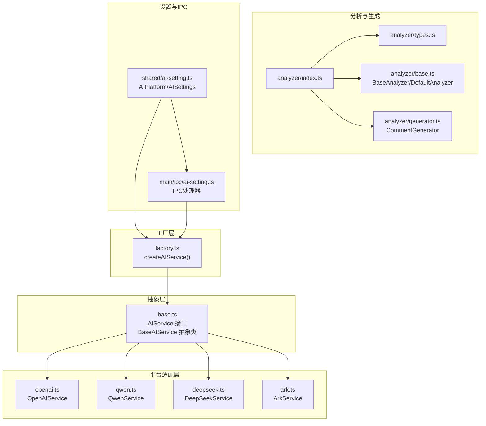
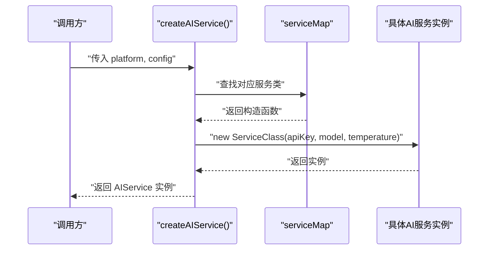
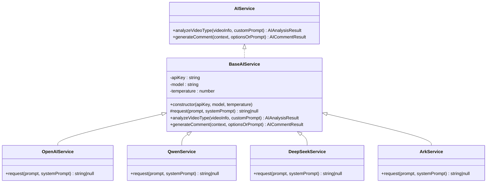
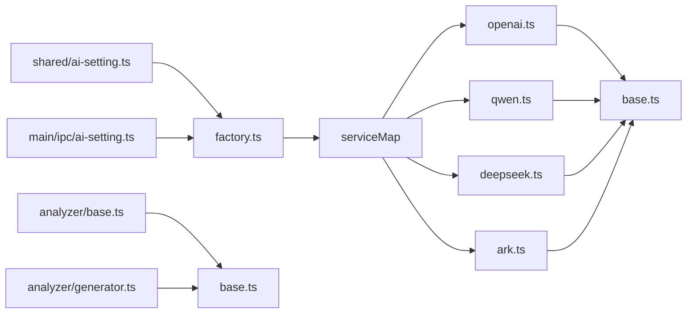

# AI服务工厂

<cite>
**本文引用的文件**
- [factory.ts](file://src/main/integration/ai/factory.ts)
- [base.ts](file://src/main/integration/ai/base.ts)
- [openai.ts](file://src/main/integration/ai/openai.ts)
- [qwen.ts](file://src/main/integration/ai/qwen.ts)
- [deepseek.ts](file://src/main/integration/ai/deepseek.ts)
- [ark.ts](file://src/main/integration/ai/ark.ts)
- [ai-setting.ts](file://src/shared/ai-setting.ts)
- [index.ts](file://src/main/integration/ai/analyzer/index.ts)
- [types.ts](file://src/main/integration/ai/analyzer/types.ts)
- [base.ts](file://src/main/integration/ai/analyzer/base.ts)
- [generator.ts](file://src/main/integration/ai/analyzer/generator.ts)
- [ai-setting.ts](file://src/main/ipc/ai-setting.ts)
- [index.ts](file://src/main/index.ts)
</cite>

## 目录
1. [简介](#简介)
2. [项目结构](#项目结构)
3. [核心组件](#核心组件)
4. [架构总览](#架构总览)
5. [详细组件分析](#详细组件分析)
6. [依赖分析](#依赖分析)
7. [性能考虑](#性能考虑)
8. [故障排除指南](#故障排除指南)
9. [结论](#结论)
10. [附录](#附录)

## 简介
本文件为“AI服务工厂”的详细API文档，聚焦以下目标：
- createAIService函数的使用方法、参数配置与返回值类型
- AI平台枚举值、服务映射表与工厂模式实现原理
- 不同AI平台的服务创建示例、错误处理机制与最佳实践
- BaseAIService接口规范、继承关系与扩展方法

同时，文档还涵盖AI分析器（Analyzer）与评论生成器（CommentGenerator）的配套能力，帮助读者理解从“工厂创建服务”到“具体业务调用”的完整链路。

## 项目结构
AI服务工厂位于主进程集成层，围绕共享设置与平台适配器展开，形成清晰的分层：
- 工厂层：负责按平台选择具体服务类并实例化
- 抽象层：统一AI服务能力接口与通用行为
- 平台适配层：各AI平台的具体实现
- 分析器与生成器：基于AI服务的上层分析与评论生成能力
- 设置与IPC：提供平台、模型、温度等配置项的读写与测试

图表来源
- [factory.ts:1-27](file://src/main/integration/ai/factory.ts#L1-L27)
- [base.ts:23-131](file://src/main/integration/ai/base.ts#L23-L131)
- [openai.ts:1-45](file://src/main/integration/ai/openai.ts#L1-L45)
- [qwen.ts:1-45](file://src/main/integration/ai/qwen.ts#L1-L45)
- [deepseek.ts:1-45](file://src/main/integration/ai/deepseek.ts#L1-L45)
- [ark.ts:1-45](file://src/main/integration/ai/ark.ts#L1-L45)
- [ai-setting.ts:1-29](file://src/shared/ai-setting.ts#L1-L29)
- [ai-setting.ts:1-27](file://src/main/ipc/ai-setting.ts#L1-L27)
- [index.ts:1-4](file://src/main/integration/ai/analyzer/index.ts#L1-L4)
- [types.ts:1-73](file://src/main/integration/ai/analyzer/types.ts#L1-L73)
- [base.ts:10-183](file://src/main/integration/ai/analyzer/base.ts#L10-L183)
- [generator.ts:9-180](file://src/main/integration/ai/analyzer/generator.ts#L9-L180)

章节来源
- [factory.ts:1-27](file://src/main/integration/ai/factory.ts#L1-L27)
- [base.ts:23-131](file://src/main/integration/ai/base.ts#L23-L131)
- [ai-setting.ts:1-29](file://src/shared/ai-setting.ts#L1-L29)
- [ai-setting.ts:1-27](file://src/main/ipc/ai-setting.ts#L1-L27)
- [index.ts:1-4](file://src/main/integration/ai/analyzer/index.ts#L1-L4)

## 核心组件
- 工厂函数：createAIService(platform, config) → AIService
- 平台枚举：AIPlatform = 'volcengine' | 'bailian' | 'openai' | 'deepseek'
- 服务映射表：AIPlatform 到具体服务类的映射
- 抽象接口：AIService 定义 analyzeVideoType 与 generateComment
- 抽象基类：BaseAIService 实现通用逻辑与默认行为
- 平台实现：OpenAIService、QwenService、DeepSeekService、ArkService
- 分析器与生成器：基于AI服务的视频分析、评论分析与评论生成

章节来源
- [factory.ts:9-25](file://src/main/integration/ai/factory.ts#L9-L25)
- [ai-setting.ts:1](file://src/shared/ai-setting.ts#L1)
- [base.ts:23-131](file://src/main/integration/ai/base.ts#L23-L131)
- [openai.ts:3-45](file://src/main/integration/ai/openai.ts#L3-L45)
- [qwen.ts:3-45](file://src/main/integration/ai/qwen.ts#L3-L45)
- [deepseek.ts:3-45](file://src/main/integration/ai/deepseek.ts#L3-L45)
- [ark.ts:3-45](file://src/main/integration/ai/ark.ts#L3-L45)

## 架构总览
工厂模式通过“平台枚举 + 映射表 + 抽象接口 + 具体实现”的组合，实现跨平台AI服务的统一创建与调用。调用流程如下：

图表来源
- [factory.ts:16-25](file://src/main/integration/ai/factory.ts#L16-L25)
- [factory.ts:9-14](file://src/main/integration/ai/factory.ts#L9-L14)

## 详细组件分析

### 工厂函数 createAIService
- 函数签名与用途
  - 输入：platform（AIPlatform）、config（包含 apiKey、model、可选 temperature）
  - 输出：AIService 实例
  - 功能：依据平台选择对应服务类并完成实例化
- 参数与返回值
  - platform：必须为已支持的平台枚举值之一
  - config.apiKey：平台鉴权密钥
  - config.model：模型名称
  - config.temperature：采样温度（未提供时使用默认值）
  - 返回：实现了 AIService 接口的具体服务实例
- 错误处理
  - 若平台不在映射表中，抛出错误提示“不支持的AI平台”
- 使用示例（步骤说明）
  - 从共享设置中读取当前平台、模型与温度
  - 调用 createAIService(platform, { apiKey, model, temperature })
  - 将返回的 AIService 实例用于后续分析与评论生成

章节来源
- [factory.ts:16-25](file://src/main/integration/ai/factory.ts#L16-L25)
- [ai-setting.ts:10-22](file://src/shared/ai-setting.ts#L10-L22)

### AI平台枚举与服务映射表
- 平台枚举
  - 类型：AIPlatform = 'volcengine' | 'bailian' | 'openai' | 'deepseek'
- 服务映射表
  - 映射关系：volcengine → ArkService、bailian → QwenService、openai → OpenAIService、deepseek → DeepSeekService
- 默认设置与可用模型
  - 默认平台：deepseek
  - 默认模型：deepseek-chat
  - 平台可用模型：
    - volcengine：['doubao-seed-1.6-250615', 'doubao-pro-4k-250519']
    - bailian：['qwen-plus', 'qwen-max']
    - openai：['gpt-4o', 'gpt-4o-mini']
    - deepseek：['deepseek-chat', 'deepseek-reasoner']

章节来源
- [ai-setting.ts:1](file://src/shared/ai-setting.ts#L1)
- [ai-setting.ts:24-29](file://src/shared/ai-setting.ts#L24-L29)
- [factory.ts:9-14](file://src/main/integration/ai/factory.ts#L9-L14)

### BaseAIService 接口与抽象类
- 接口规范（AIService）
  - analyzeVideoType(videoInfo: string, customPrompt: string): Promise<AIAnalysisResult>
  - generateComment(context: AICommentContext | string, optionsOrPrompt: AICommentOptions | string): Promise<AICommentResult>
- 抽象类（BaseAIService）
  - 成员：apiKey、model、temperature
  - 构造函数：接收 apiKey、model、temperature（默认值）
  - 抽象方法：protected abstract request(prompt: string, systemPrompt: string): Promise<string | null>
  - 默认实现：
    - analyzeVideoType：构建系统提示与用户提示，调用 request，解析JSON并返回结果；异常或空响应时回退
    - generateComment：兼容旧版调用方式，构建系统提示与用户提示，调用 request，截断长度并回退兜底
- 设计要点
  - 统一温度参数传递
  - 统一错误回退策略（空响应或解析失败时返回兜底结果）

章节来源
- [base.ts:23-131](file://src/main/integration/ai/base.ts#L23-L131)

### 各平台服务实现
- OpenAIService
  - 请求地址：OpenAI Chat Completions
  - 超时控制：AbortController + 30秒超时
  - 错误处理：HTTP非OK或异常时返回null并记录日志
  - 返回：choices[0].message.content 或 null
- QwenService
  - 请求地址：DashScope Compatible Mode
  - 超时控制与错误处理同OpenAI实现
- DeepSeekService
  - 请求地址：DeepSeek Chat Completions
  - 超时控制与错误处理同上
- ArkService
  - 请求地址：火山引擎 Ark API
  - 超时控制与错误处理同上

章节来源
- [openai.ts:3-45](file://src/main/integration/ai/openai.ts#L3-L45)
- [qwen.ts:3-45](file://src/main/integration/ai/qwen.ts#L3-L45)
- [deepseek.ts:3-45](file://src/main/integration/ai/deepseek.ts#L3-L45)
- [ark.ts:3-45](file://src/main/integration/ai/ark.ts#L3-L45)

### AI分析器与评论生成器
- 分析器（BaseAnalyzer/DefaultAnalyzer）
  - 能力：视频分析、评论分析、情感分析
  - 依赖：AIService 实例（通过 setAIService 注入）
  - 行为：构建系统提示与用户提示，调用 AIService.request，解析JSON，异常或空响应时返回默认结果
- 评论生成器（CommentGenerator）
  - 能力：基于视频与评论分析结果生成评论
  - 依赖：AIService、视频分析结果、评论分析结果
  - 行为：构建系统提示与用户提示，调用 AIService.request，计算评分与表情提取，异常或空响应时返回默认结果
- 数据模型（analyzer/types.ts）
  - 视频分析输入/输出、评论分析输入/输出、情感分析结果、评论生成输入/输出等

章节来源
- [base.ts:10-183](file://src/main/integration/ai/analyzer/base.ts#L10-L183)
- [generator.ts:9-180](file://src/main/integration/ai/analyzer/generator.ts#L9-L180)
- [types.ts:1-73](file://src/main/integration/ai/analyzer/types.ts#L1-L73)

### 工厂模式实现原理
- 解耦平台差异：通过映射表将平台枚举与具体服务类解耦
- 统一接口：所有平台实现均继承 BaseAIService，遵循 AIService 接口
- 可扩展性：新增平台只需实现 BaseAIService 并更新映射表
- 控制反转：调用方仅依赖抽象接口，不关心具体平台实现

图表来源
- [base.ts:23-131](file://src/main/integration/ai/base.ts#L23-L131)
- [openai.ts:3](file://src/main/integration/ai/openai.ts#L3)
- [qwen.ts:3](file://src/main/integration/ai/qwen.ts#L3)
- [deepseek.ts:3](file://src/main/integration/ai/deepseek.ts#L3)
- [ark.ts:3](file://src/main/integration/ai/ark.ts#L3)

## 依赖分析
- 工厂对平台实现的依赖：通过 serviceMap 进行静态绑定
- 平台实现对抽象基类的依赖：继承 BaseAIService，复用通用逻辑
- 分析器与生成器对AI服务的依赖：通过 AIService 接口注入
- 设置与IPC：共享设置提供默认值与平台模型清单；IPC提供读取、更新、重置与测试接口

图表来源
- [factory.ts:9-14](file://src/main/integration/ai/factory.ts#L9-L14)
- [base.ts:28-37](file://src/main/integration/ai/base.ts#L28-L37)
- [openai.ts:1](file://src/main/integration/ai/openai.ts#L1)
- [qwen.ts:1](file://src/main/integration/ai/qwen.ts#L1)
- [deepseek.ts:1](file://src/main/integration/ai/deepseek.ts#L1)
- [ark.ts:1](file://src/main/integration/ai/ark.ts#L1)
- [base.ts:10-183](file://src/main/integration/ai/analyzer/base.ts#L10-L183)
- [generator.ts:9-180](file://src/main/integration/ai/analyzer/generator.ts#L9-L180)
- [ai-setting.ts:1-29](file://src/shared/ai-setting.ts#L1-L29)
- [ai-setting.ts:1-27](file://src/main/ipc/ai-setting.ts#L1-L27)

章节来源
- [factory.ts:9-14](file://src/main/integration/ai/factory.ts#L9-L14)
- [base.ts:28-37](file://src/main/integration/ai/base.ts#L28-L37)
- [ai-setting.ts:1-29](file://src/shared/ai-setting.ts#L1-L29)
- [ai-setting.ts:1-27](file://src/main/ipc/ai-setting.ts#L1-L27)

## 性能考虑
- 超时控制：各平台实现均采用 AbortController + 30秒超时，避免长时间阻塞
- 错误快速回退：HTTP非OK或异常时返回null，上层统一回退为兜底结果
- 温度参数：默认温度在抽象基类中设定，可在工厂调用时覆盖
- 批量生成：评论生成器支持并发生成多个评论，提升效率

章节来源
- [openai.ts:4-6](file://src/main/integration/ai/openai.ts#L4-L6)
- [qwen.ts:4-6](file://src/main/integration/ai/qwen.ts#L4-L6)
- [deepseek.ts:4-6](file://src/main/integration/ai/deepseek.ts#L4-L6)
- [ark.ts:4-6](file://src/main/integration/ai/ark.ts#L4-L6)
- [base.ts:33](file://src/main/integration/ai/base.ts#L33)
- [generator.ts:169-179](file://src/main/integration/ai/analyzer/generator.ts#L169-L179)

## 故障排除指南
- “不支持的AI平台”错误
  - 现象：调用 createAIService 时抛出错误
  - 原因：platform 不在映射表中
  - 处理：确认平台枚举值正确，或在映射表中添加新平台
- 请求失败或异常
  - 现象：analyzeVideoType/generateComment 返回兜底结果
  - 原因：HTTP非OK或请求异常
  - 处理：检查 apiKey、网络连通性、平台可用性；查看控制台日志
- JSON解析失败
  - 现象：analyzeVideoType/generateComment 解析失败回退
  - 原因：AI返回内容不符合预期
  - 处理：调整系统提示或自定义提示，确保返回结构稳定
- 评论过长或风格不符
  - 现象：生成评论被截断或风格不匹配
  - 原因：maxLength 或 style 配置不当
  - 处理：调整 AICommentOptions 中的 maxLength 与 style

章节来源
- [factory.ts:21-23](file://src/main/integration/ai/factory.ts#L21-L23)
- [openai.ts:32-43](file://src/main/integration/ai/openai.ts#L32-L43)
- [qwen.ts:32-43](file://src/main/integration/ai/qwen.ts#L32-L43)
- [deepseek.ts:32-43](file://src/main/integration/ai/deepseek.ts#L32-L43)
- [ark.ts:32-43](file://src/main/integration/ai/ark.ts#L32-L43)
- [base.ts:48-59](file://src/main/integration/ai/base.ts#L48-L59)
- [base.ts:116-129](file://src/main/integration/ai/base.ts#L116-L129)

## 结论
AI服务工厂通过“平台枚举 + 映射表 + 抽象接口 + 具体实现”的设计，实现了跨平台AI服务的统一创建与调用。结合 BaseAIService 的通用逻辑与错误回退机制，以及分析器与生成器的配套能力，开发者可以快速接入不同AI平台，并在出现异常时获得稳定的兜底体验。新增平台时仅需实现 BaseAIService 并更新映射表，即可无缝扩展。

## 附录

### API参考：createAIService
- 函数：createAIService(platform, config)
- 参数
  - platform: AIPlatform（'volcengine' | 'bailian' | 'openai' | 'deepseek'）
  - config.apiKey: string
  - config.model: string
  - config.temperature?: number（可选，默认值由抽象基类提供）
- 返回：AIService 实例
- 异常：当 platform 不在映射表中时抛出错误

章节来源
- [factory.ts:16-25](file://src/main/integration/ai/factory.ts#L16-L25)
- [ai-setting.ts:1](file://src/shared/ai-setting.ts#L1)
- [base.ts:33](file://src/main/integration/ai/base.ts#L33)

### 设置与IPC
- 默认设置：getDefaultAISettings 提供默认平台、模型与温度
- 平台模型清单：PLATFORM_MODELS 提供各平台可用模型列表
- IPC接口：
  - ai-settings:get：获取当前AI设置（不存在则返回默认值）
  - ai-settings:update：更新部分设置并持久化
  - ai-settings:reset：重置为默认设置
  - ai-settings:test：占位接口（当前未实现）

章节来源
- [ai-setting.ts:10-22](file://src/shared/ai-setting.ts#L10-L22)
- [ai-setting.ts:24-29](file://src/shared/ai-setting.ts#L24-L29)
- [ai-setting.ts:1-27](file://src/main/ipc/ai-setting.ts#L1-L27)
- [index.ts:54-84](file://src/main/index.ts#L54-L84)