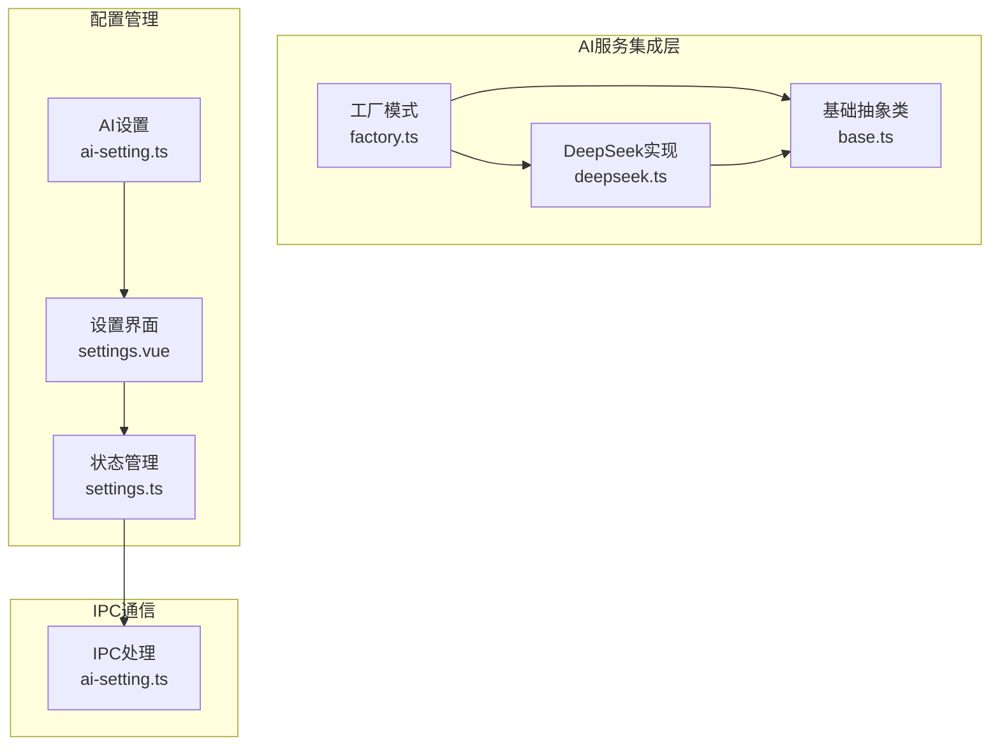
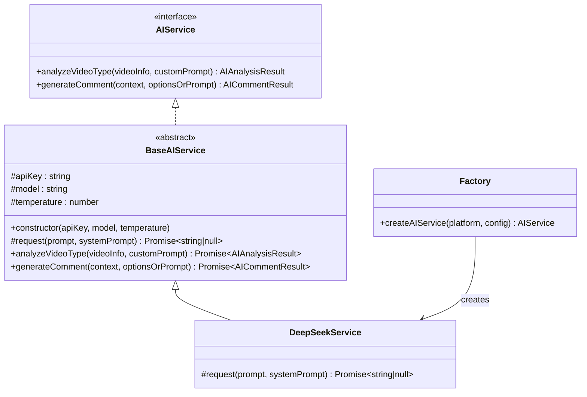
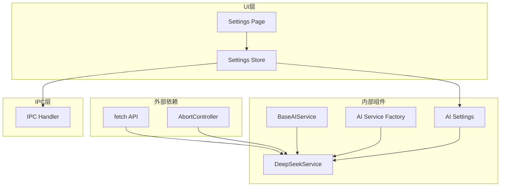

# DeepSeek集成API

<cite>
**本文档引用的文件**
- [deepseek.ts](file://src/main/integration/ai/deepseek.ts)
- [base.ts](file://src/main/integration/ai/base.ts)
- [factory.ts](file://src/main/integration/ai/factory.ts)
- [ai-setting.ts](file://src/shared/ai-setting.ts)
- [settings.vue](file://src/renderer/src/pages/settings.vue)
- [settings.ts](file://src/renderer/src/stores/settings.ts)
- [ai-setting.ts](file://src/main/ipc/ai-setting.ts)
</cite>

## 目录
1. [简介](#简介)
2. [项目结构](#项目结构)
3. [核心组件](#核心组件)
4. [架构概览](#架构概览)
5. [详细组件分析](#详细组件分析)
6. [依赖关系分析](#依赖关系分析)
7. [性能考虑](#性能考虑)
8. [故障排除指南](#故障排除指南)
9. [结论](#结论)
10. [附录](#附录)

## 简介

DeepSeek集成API为应用提供了与DeepSeek大语言模型服务集成的能力。该系统基于统一的AI服务抽象层，实现了DeepSeek、OpenAI、通义千问等多个AI平台的统一接口。通过工厂模式和策略模式，系统能够动态选择不同的AI服务提供商，并提供一致的API接口。

本API文档详细说明了DeepSeekService类的接口实现、方法签名、使用示例以及完整的配置选项。文档涵盖了认证方式、请求参数、响应格式、速率限制等关键信息，并提供了实际的调用示例、错误处理和调试技巧。

## 项目结构

DeepSeek集成API位于项目的AI服务集成模块中，采用分层架构设计：



**图表来源**
- [factory.ts:1-27](file://src/main/integration/ai/factory.ts#L1-L27)
- [base.ts:1-131](file://src/main/integration/ai/base.ts#L1-L131)
- [deepseek.ts:1-45](file://src/main/integration/ai/deepseek.ts#L1-L45)

**章节来源**
- [factory.ts:1-27](file://src/main/integration/ai/factory.ts#L1-L27)
- [base.ts:1-131](file://src/main/integration/ai/base.ts#L1-L131)
- [deepseek.ts:1-45](file://src/main/integration/ai/deepseek.ts#L1-L45)

## 核心组件

### DeepSeekService类

DeepSeekService是DeepSeek AI服务的具体实现，继承自BaseAIService抽象基类。该类实现了与DeepSeek API的完整交互逻辑。

#### 主要特性
- **HTTP客户端实现**：基于fetch API实现异步HTTP请求
- **超时控制**：30秒请求超时机制
- **错误处理**：完善的异常捕获和错误日志记录
- **响应解析**：自动解析JSON响应并提取模型输出

#### 关键方法
- `request(prompt: string, systemPrompt: string)`: 发送HTTP请求到DeepSeek API
- 继承自基类的方法：
  - `analyzeVideoType()`: 视频类型分析
  - `generateComment()`: 评论生成

**章节来源**
- [deepseek.ts:3-45](file://src/main/integration/ai/deepseek.ts#L3-L45)
- [base.ts:28-131](file://src/main/integration/ai/base.ts#L28-L131)

## 架构概览

系统采用工厂模式和策略模式相结合的设计模式：



**图表来源**
- [base.ts:23-131](file://src/main/integration/ai/base.ts#L23-L131)
- [deepseek.ts:3-45](file://src/main/integration/ai/deepseek.ts#L3-L45)
- [factory.ts:16-25](file://src/main/integration/ai/factory.ts#L16-L25)

## 详细组件分析

### DeepSeekService实现

DeepSeekService类提供了DeepSeek API的完整实现，包括认证、请求构建和响应处理。

#### 认证机制
- **认证方式**：Bearer Token认证
- **认证头**：Authorization: Bearer {apiKey}
- **API端点**：https://api.deepseek.com/chat/completions

#### 请求参数配置

| 参数名称 | 类型 | 默认值 | 描述 |
|---------|------|--------|------|
| model | string | deepseek-chat | 模型名称 |
| temperature | number | 0.9 | 采样温度，0-2范围 |
| max_tokens | number | 500 | 最大生成tokens数 |
| messages | array | 必填 | 消息数组，包含system和user消息 |

#### 响应格式
- **成功响应**：返回JSON对象，包含choices数组
- **输出提取**：从choices[0].message.content获取文本内容
- **错误处理**：返回null并记录错误日志

#### 超时和重试机制
- **请求超时**：30秒自动中断
- **AbortController**：用于取消长时间运行的请求
- **异常捕获**：try-catch块处理网络异常

**章节来源**
- [deepseek.ts:4-44](file://src/main/integration/ai/deepseek.ts#L4-L44)

### 工厂模式实现

工厂模式负责根据平台配置动态创建相应的AI服务实例。

#### 平台映射表
```typescript
const serviceMap: Record<AIPlatform, new (apiKey: string, model: string, temperature: number) => BaseAIService> = {
  volcengine: ArkService,
  bailian: QwenService,
  openai: OpenAIService,
  deepseek: DeepSeekService
}
```

#### 创建流程
1. 验证平台类型有效性
2. 获取对应的服务类构造函数
3. 创建服务实例并注入配置参数
4. 返回实现AIService接口的服务对象

**章节来源**
- [factory.ts:9-25](file://src/main/integration/ai/factory.ts#L9-L25)

### 配置管理系统

系统提供了完整的AI设置管理功能，包括默认配置、用户自定义配置和设置持久化。

#### 默认配置
- **平台**：deepseek
- **模型**：deepseek-chat
- **温度**：0.9
- **API密钥**：空字符串（需用户配置）

#### 支持的模型
- deepseek-chat：标准对话模型
- deepseek-reasoner：推理增强模型

#### 设置界面功能
- 实时配置修改
- 连接测试功能
- 设置保存和重置
- 温度参数调节（0-2范围）

**章节来源**
- [ai-setting.ts:10-29](file://src/shared/ai-setting.ts#L10-L29)
- [settings.vue:17-27](file://src/renderer/src/pages/settings.vue#L17-L27)

## 依赖关系分析

系统各组件之间的依赖关系清晰明确：



**图表来源**
- [deepseek.ts:1](file://src/main/integration/ai/deepseek.ts#L1)
- [base.ts:1](file://src/main/integration/ai/base.ts#L1)
- [factory.ts:1](file://src/main/integration/ai/factory.ts#L1)

### 外部依赖分析

系统对外部依赖的使用非常有限且明确：

- **fetch API**：用于HTTP请求，无需额外安装
- **AbortController**：现代浏览器原生支持
- **JSON.parse**：标准JavaScript内置方法

### 内部耦合度评估

- **低耦合**：各AI服务实现相互独立
- **高内聚**：每个服务专注于特定平台的实现
- **可扩展性**：新增AI平台只需实现BaseAIService接口

**章节来源**
- [deepseek.ts:1-45](file://src/main/integration/ai/deepseek.ts#L1-L45)
- [factory.ts:1-27](file://src/main/integration/ai/factory.ts#L1-L27)

## 性能考虑

### 请求性能优化

1. **超时控制**：30秒超时防止请求挂起
2. **内存管理**：及时清理超时定时器
3. **错误快速返回**：网络错误时立即返回null

### 并发处理

- **单请求并发**：每个服务实例一次只能处理一个请求
- **队列管理**：建议在上层实现请求队列管理
- **重试机制**：可根据业务需求添加指数退避重试

### 缓存策略

- **响应缓存**：对于相同输入可考虑本地缓存
- **配置缓存**：避免频繁读取存储中的设置
- **模型缓存**：预热常用模型减少首次加载时间

## 故障排除指南

### 常见问题及解决方案

#### 认证失败
**症状**：返回401未授权错误
**原因**：
- API密钥无效或过期
- 网络连接问题
- 代理服务器阻拦

**解决方法**：
1. 验证API密钥格式正确
2. 检查网络连接状态
3. 配置正确的代理设置

#### 请求超时
**症状**：控制台显示超时错误
**原因**：
- 网络延迟过高
- 服务器负载过大
- 客户端防火墙阻拦

**解决方法**：
1. 检查网络连接质量
2. 降低请求频率
3. 调整超时参数

#### 解析错误
**症状**：JSON解析失败
**原因**：
- API响应格式变更
- 网络传输损坏
- 服务器返回非JSON数据

**解决方法**：
1. 检查API版本兼容性
2. 添加响应验证逻辑
3. 实现降级处理机制

### 调试技巧

#### 日志记录
- 启用详细的错误日志
- 记录请求和响应的完整内容
- 监控请求耗时和成功率

#### 网络诊断
- 使用浏览器开发者工具检查网络请求
- 验证API端点可达性
- 检查CORS配置

#### 性能监控
- 监控请求响应时间
- 统计错误率和成功率
- 分析峰值使用情况

**章节来源**
- [deepseek.ts:32-43](file://src/main/integration/ai/deepseek.ts#L32-L43)

## 结论

DeepSeek集成API提供了完整、可靠的AI服务集成解决方案。通过抽象化的接口设计和工厂模式的应用，系统实现了良好的可扩展性和维护性。

### 主要优势
1. **统一接口**：所有AI平台提供一致的API体验
2. **易于扩展**：新增AI平台只需实现基础接口
3. **配置灵活**：支持多种模型和参数配置
4. **错误处理完善**：提供全面的异常处理机制

### 最佳实践建议
1. 在生产环境中实现请求重试机制
2. 添加详细的日志记录和监控
3. 考虑实现请求限流和配额管理
4. 提供更丰富的错误恢复策略

## 附录

### API使用示例

#### 基本使用流程
```typescript
// 1. 创建AI服务实例
const aiService = createAIService('deepseek', {
  apiKey: 'your-api-key',
  model: 'deepseek-chat',
  temperature: 0.9
});

// 2. 分析视频类型
const analysisResult = await aiService.analyzeVideoType(
  videoInfo, 
  customRules
);

// 3. 生成评论
const commentResult = await aiService.generateComment(
  {
    author: '视频作者',
    videoDesc: '视频描述',
    videoTags: ['标签1', '标签2']
  },
  {
    style: 'humorous',
    maxLength: 50
  }
);
```

#### 错误处理示例
```typescript
try {
  const result = await aiService.analyzeVideoType(videoInfo, customPrompt);
  if (!result.shouldWatch) {
    console.log('视频不符合条件:', result.reason);
  }
} catch (error) {
  console.error('AI服务调用失败:', error);
  // 实现降级逻辑
}
```

### 配置选项详解

#### 温度参数说明
- **范围**：0.0 - 2.0
- **默认值**：0.9
- **影响**：数值越高，输出越随机；数值越低，输出越确定

#### 模型选择
- **deepseek-chat**：适合通用对话和内容生成
- **deepseek-reasoner**：适合需要推理能力的任务

#### 输出控制
- **max_tokens**：控制最大生成长度
- **maxLength**：评论生成的字符限制
- **style**：评论风格（humorous, serious, question, praise, mixed）

**章节来源**
- [base.ts:72-129](file://src/main/integration/ai/base.ts#L72-L129)
- [ai-setting.ts:24-29](file://src/shared/ai-setting.ts#L24-L29)