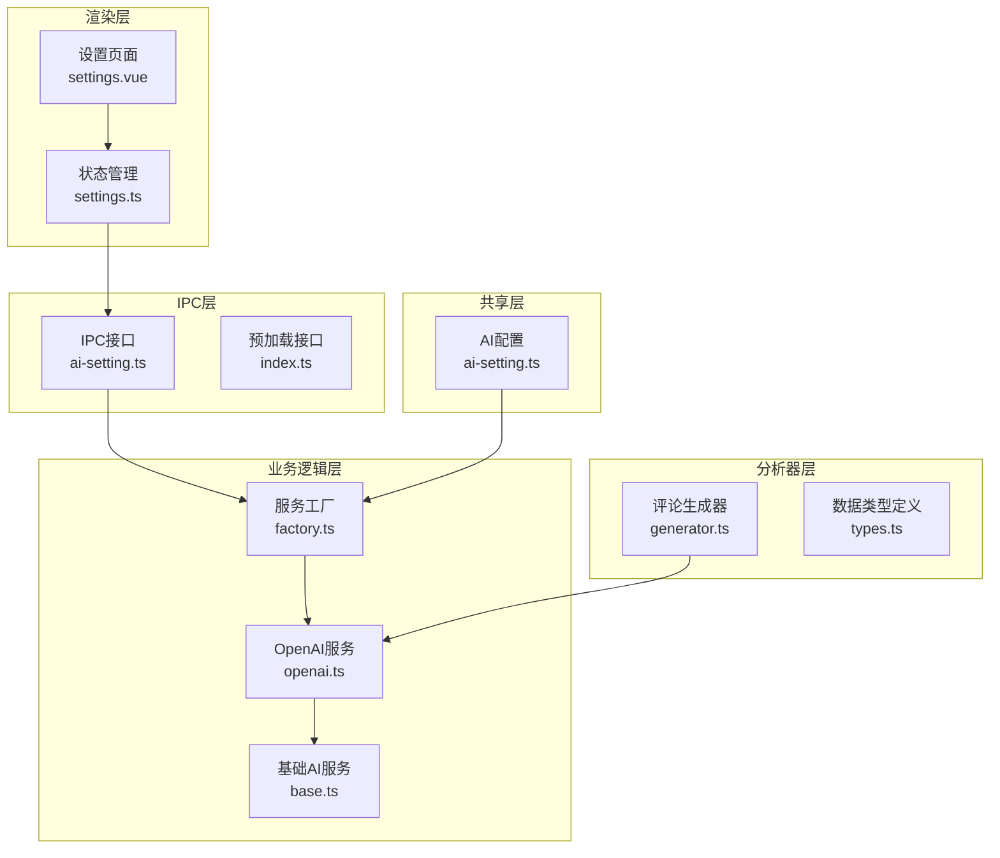
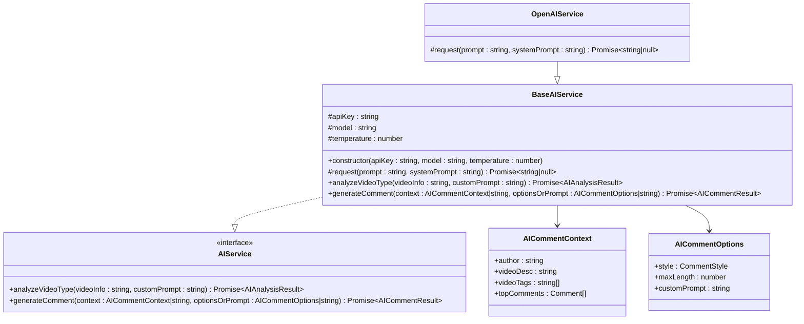
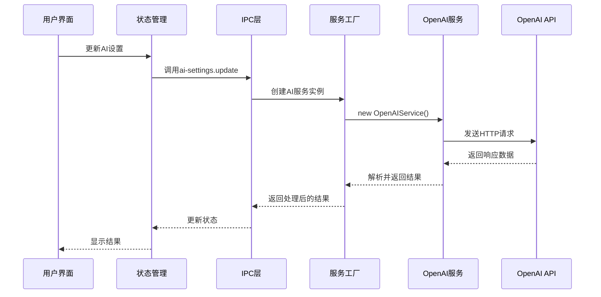
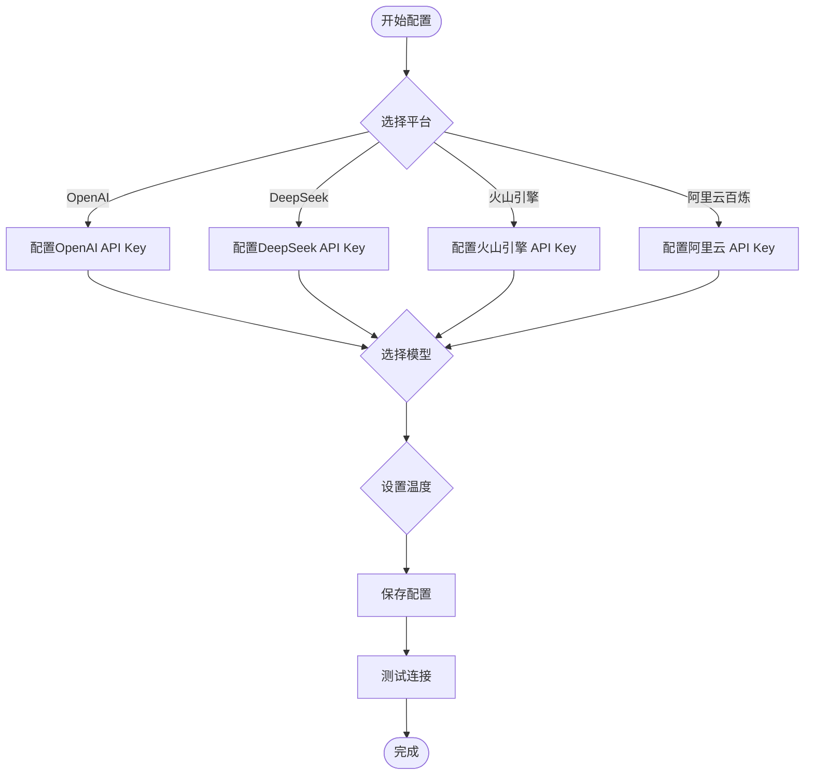
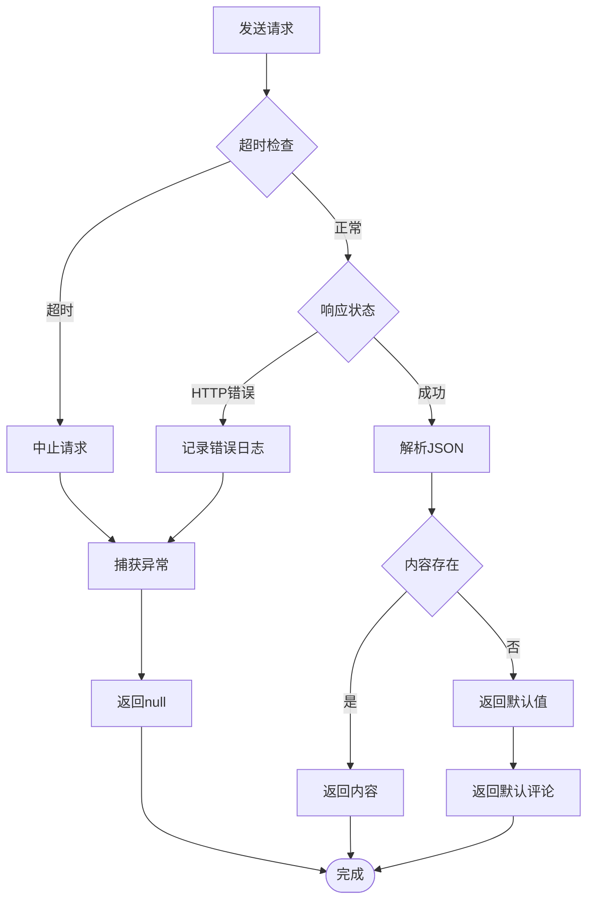
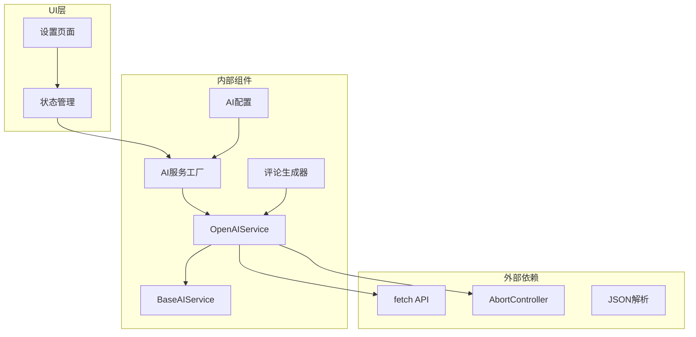

# OpenAI集成API

<cite>
**本文档引用的文件**
- [openai.ts](file://src/main/integration/ai/openai.ts)
- [base.ts](file://src/main/integration/ai/base.ts)
- [factory.ts](file://src/main/integration/ai/factory.ts)
- [ai-setting.ts](file://src/shared/ai-setting.ts)
- [index.ts](file://src/preload/index.ts)
- [settings.vue](file://src/renderer/src/pages/settings.vue)
- [settings.ts](file://src/renderer/src/stores/settings.ts)
- [ai-setting.ts](file://src/main/ipc/ai-setting.ts)
- [generator.ts](file://src/main/integration/ai/analyzer/generator.ts)
- [types.ts](file://src/main/integration/ai/analyzer/types.ts)
</cite>

## 目录
1. [简介](#简介)
2. [项目结构](#项目结构)
3. [核心组件](#核心组件)
4. [架构概览](#架构概览)
5. [详细组件分析](#详细组件分析)
6. [依赖关系分析](#依赖关系分析)
7. [性能考虑](#性能考虑)
8. [故障排除指南](#故障排除指南)
9. [结论](#结论)

## 简介

本文件为OpenAI服务集成的完整API文档，详细记录了OpenAIService类的所有方法、参数和返回值。该系统提供了基于OpenAI GPT模型的智能评论生成功能，支持视频内容分析、评论生成、情感分析等AI服务。文档涵盖了API密钥配置、请求格式、响应结构、错误码处理，并提供了具体的使用场景和性能优化建议。

## 项目结构

该项目采用模块化的架构设计，主要分为以下几个层次：

**图表来源**
- [settings.vue:1-140](file://src/renderer/src/pages/settings.vue#L1-L140)
- [factory.ts:1-27](file://src/main/integration/ai/factory.ts#L1-L27)
- [openai.ts:1-45](file://src/main/integration/ai/openai.ts#L1-L45)

**章节来源**
- [settings.vue:1-140](file://src/renderer/src/pages/settings.vue#L1-L140)
- [factory.ts:1-27](file://src/main/integration/ai/factory.ts#L1-L27)
- [openai.ts:1-45](file://src/main/integration/ai/openai.ts#L1-L45)

## 核心组件

### OpenAIService类

OpenAIService是OpenAI服务的具体实现，继承自BaseAIService抽象类，提供了完整的GPT模型调用功能。

#### 类图

**图表来源**
- [base.ts:23-131](file://src/main/integration/ai/base.ts#L23-L131)
- [openai.ts:3-45](file://src/main/integration/ai/openai.ts#L3-L45)

**章节来源**
- [base.ts:23-131](file://src/main/integration/ai/base.ts#L23-L131)
- [openai.ts:3-45](file://src/main/integration/ai/openai.ts#L3-L45)

## 架构概览

系统采用分层架构设计，实现了清晰的职责分离：

**图表来源**
- [settings.vue:39-64](file://src/renderer/src/pages/settings.vue#L39-L64)
- [factory.ts:16-25](file://src/main/integration/ai/factory.ts#L16-L25)
- [openai.ts:4-44](file://src/main/integration/ai/openai.ts#L4-L44)

## 详细组件分析

### OpenAIService类详解

#### 方法定义

##### 构造函数
- **参数**:
  - `apiKey`: string - OpenAI API密钥
  - `model`: string - GPT模型名称（如"gpt-4o"）
  - `temperature`: number - 生成随机性参数，默认0.8

- **功能**: 初始化OpenAIService实例，设置API密钥、模型和温度参数

##### request方法
- **参数**:
  - `prompt`: string - 用户消息内容
  - `systemPrompt`: string - 系统提示词

- **返回值**: Promise<string | null> - AI生成的回复内容，失败时返回null

- **实现细节**:
  - 使用AbortController实现30秒超时控制
  - 调用OpenAI Chat Completions API
  - 支持系统消息和用户消息的组合
  - 自动处理HTTP响应状态和JSON解析

##### analyzeVideoType方法
- **参数**:
  - `videoInfo`: string - 视频信息描述
  - `customPrompt`: string - 自定义规则

- **返回值**: Promise<AIAnalysisResult> - 包含分析结果的对象

- **功能**: 判断视频是否需要评论引流，返回JSON格式的分析结果

##### generateComment方法
- **参数**:
  - `context`: AICommentContext | string - 评论上下文或视频描述
  - `optionsOrPrompt`: AICommentOptions | string - 评论选项或自定义提示

- **返回值**: Promise<AICommentResult> - 包含生成评论的对象

- **功能**: 生成符合要求的评论内容，支持多种风格和长度限制

**章节来源**
- [openai.ts:3-45](file://src/main/integration/ai/openai.ts#L3-L45)
- [base.ts:28-131](file://src/main/integration/ai/base.ts#L28-L131)

### API配置与使用

#### AI设置配置

系统支持多种AI平台配置，包括OpenAI、DeepSeek、火山引擎和阿里云百炼。

**图表来源**
- [ai-setting.ts:1-29](file://src/shared/ai-setting.ts#L1-L29)
- [settings.vue:75-140](file://src/renderer/src/pages/settings.vue#L75-L140)

#### 请求格式规范

OpenAI API请求遵循标准的Chat Completions格式：

**请求头**:
- `Authorization`: Bearer {API_KEY}
- `Content-Type`: application/json

**请求体字段**:
- `model`: string - 指定使用的GPT模型
- `messages`: Array - 消息数组，包含系统消息和用户消息
- `temperature`: number - 控制生成随机性
- `max_tokens`: number - 最大生成令牌数

**响应结构**:
- `choices`: Array - 包含AI回复的数组
- `message`: Object - 包含回复内容的消息对象
- `content`: string - 实际的回复文本

**章节来源**
- [openai.ts:9-28](file://src/main/integration/ai/openai.ts#L9-L28)
- [base.ts:41-60](file://src/main/integration/ai/base.ts#L41-L60)

### 错误处理机制

系统实现了完善的错误处理机制：

**图表来源**
- [openai.ts:4-44](file://src/main/integration/ai/openai.ts#L4-L44)

**章节来源**
- [openai.ts:32-43](file://src/main/integration/ai/openai.ts#L32-L43)

## 依赖关系分析

### 组件依赖图

**图表来源**
- [openai.ts:1-45](file://src/main/integration/ai/openai.ts#L1-L45)
- [factory.ts:1-27](file://src/main/integration/ai/factory.ts#L1-L27)
- [base.ts:28-37](file://src/main/integration/ai/base.ts#L28-L37)

### 数据流分析

系统中的数据流向如下：

1. **配置阶段**: 用户通过设置页面配置AI参数
2. **初始化阶段**: 工厂模式创建相应的AI服务实例
3. **请求阶段**: 服务向OpenAI API发送HTTP请求
4. **响应阶段**: 处理API响应并返回给调用方
5. **展示阶段**: 结果通过UI界面展示给用户

**章节来源**
- [factory.ts:9-25](file://src/main/integration/ai/factory.ts#L9-L25)
- [settings.vue:39-64](file://src/renderer/src/pages/settings.vue#L39-L64)

## 性能考虑

### 超时控制
- **默认超时时间**: 30秒
- **实现机制**: 使用AbortController中断长时间运行的请求
- **应用场景**: 防止网络延迟导致的UI阻塞

### 连接池优化
- **并发限制**: 建议限制同时进行的AI请求数量
- **重试机制**: 对于临时性错误实现指数退避重试
- **缓存策略**: 对于重复的相似请求考虑本地缓存

### 内存管理
- **响应大小控制**: 通过max_tokens参数限制响应长度
- **错误处理**: 及时清理超时请求占用的资源
- **批量处理**: 对于大量请求考虑分批处理

### 网络优化
- **连接复用**: 利用浏览器的HTTP/2连接复用特性
- **压缩传输**: 启用gzip压缩减少传输数据量
- **CDN加速**: 对于静态资源考虑使用CDN

## 故障排除指南

### 常见问题及解决方案

#### API密钥验证失败
**症状**: 请求返回401未授权错误
**原因**: API密钥无效或过期
**解决方法**:
1. 检查API密钥格式是否正确
2. 确认API密钥具有相应权限
3. 验证账户余额是否充足

#### 请求超时
**症状**: 控制台显示"请求异常"日志
**原因**: 网络延迟或服务器响应慢
**解决方法**:
1. 检查网络连接稳定性
2. 考虑增加超时时间
3. 实现重试机制

#### 响应格式错误
**症状**: JSON解析失败或返回null
**原因**: API响应格式不符合预期
**解决方法**:
1. 检查API版本兼容性
2. 验证请求参数格式
3. 查看API文档更新

#### 温度参数影响
**症状**: 生成内容质量不稳定
**原因**: temperature参数设置不当
**解决方法**:
1. **低温度值(0.1-0.3)**: 更加保守和可预测
2. **中等温度值(0.5-0.7)**: 平衡创造性和一致性
3. **高温度值(0.8-1.0)**: 更加创造性但可能不稳定

**章节来源**
- [openai.ts:32-43](file://src/main/integration/ai/openai.ts#L32-L43)
- [base.ts:127-129](file://src/main/integration/ai/base.ts#L127-L129)

## 结论

OpenAI服务集成为项目提供了强大的AI能力，通过模块化的设计实现了良好的可扩展性和维护性。系统的主要优势包括：

1. **标准化接口**: 统一的AIService接口便于添加新的AI平台
2. **完善的错误处理**: 全面的异常捕获和降级机制
3. **灵活的配置管理**: 支持多种AI平台和模型的动态切换
4. **用户友好的界面**: 直观的设置页面和实时测试功能

未来可以考虑的改进方向：
- 添加更多的AI平台支持
- 实现更精细的错误分类和处理
- 增加请求监控和性能分析功能
- 提供更丰富的配置选项和自定义能力