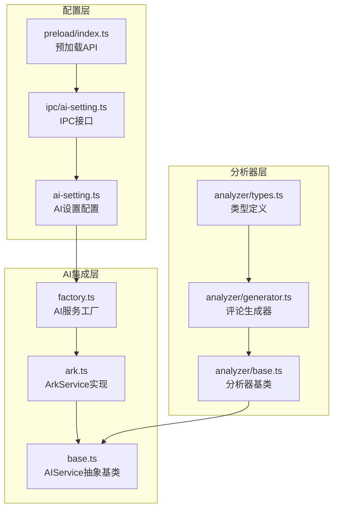
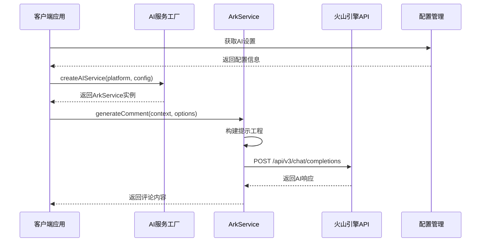
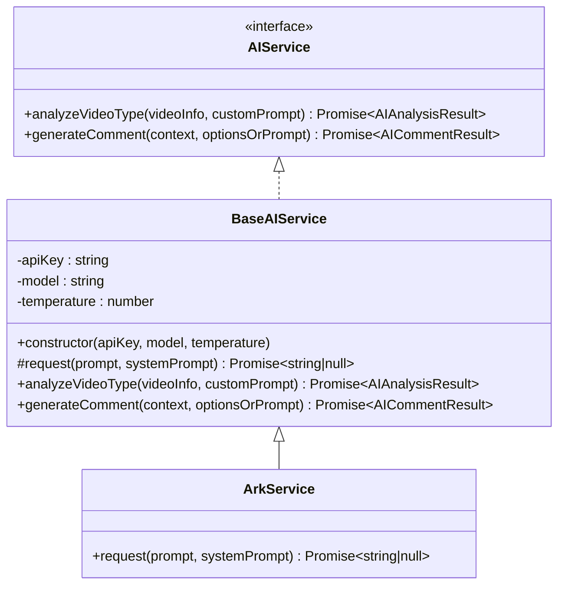
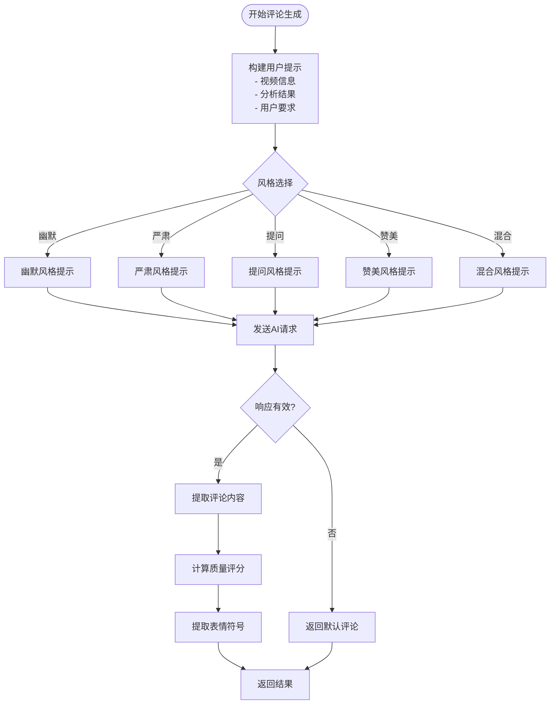
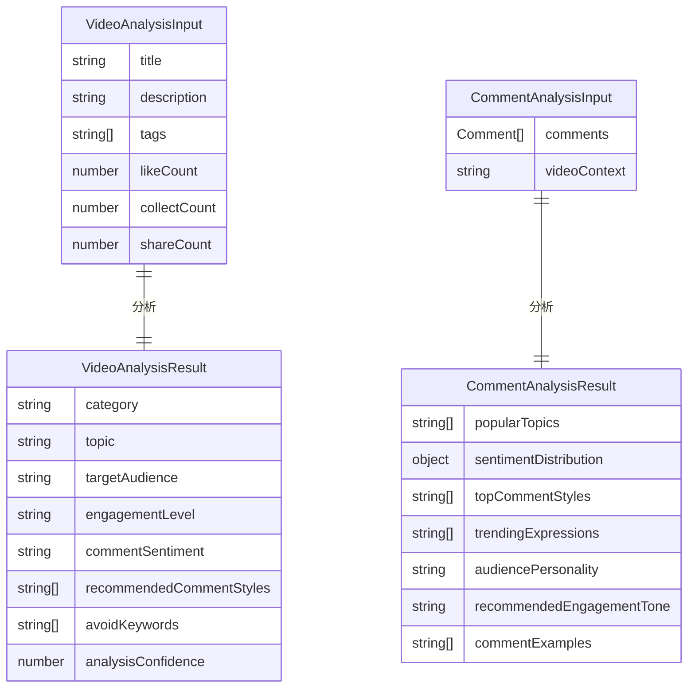
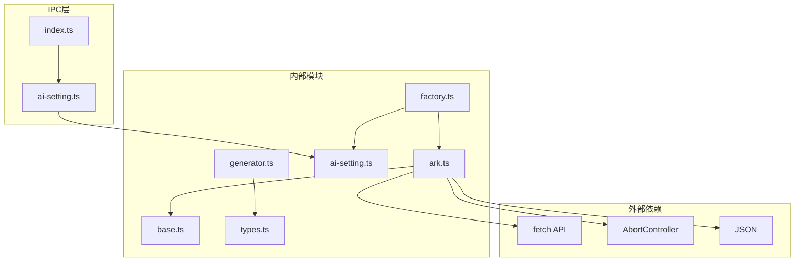
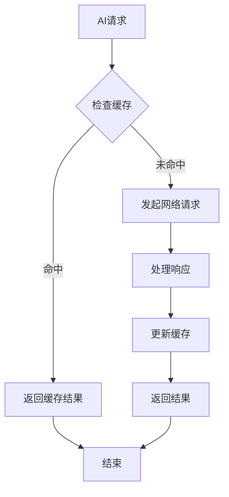

# Reka集成API

<cite>
**本文档引用的文件**
- [ark.ts](file://src/main/integration/ai/ark.ts)
- [base.ts](file://src/main/integration/ai/base.ts)
- [factory.ts](file://src/main/integration/ai/factory.ts)
- [ai-setting.ts](file://src/shared/ai-setting.ts)
- [ai-setting.ts](file://src/main/ipc/ai-setting.ts)
- [index.ts](file://src/preload/index.ts)
- [generator.ts](file://src/main/integration/ai/analyzer/generator.ts)
- [base.ts](file://src/main/integration/ai/analyzer/base.ts)
- [types.ts](file://src/main/integration/ai/analyzer/types.ts)
</cite>

## 目录
1. [简介](#简介)
2. [项目结构](#项目结构)
3. [核心组件](#核心组件)
4. [架构概览](#架构概览)
5. [详细组件分析](#详细组件分析)
6. [依赖关系分析](#依赖关系分析)
7. [性能考虑](#性能考虑)
8. [故障排除指南](#故障排除指南)
9. [结论](#结论)
10. [附录](#附录)

## 简介

Reka（Volcengine）服务集成API为自动运营系统提供了与火山引擎AI服务集成的能力。该集成实现了基于豆包（Doubao）大模型的智能评论生成和视频内容分析功能，支持多种AI平台的统一抽象接口。

本API文档详细说明了ArkService类的接口规范、方法定义和参数配置，包括火山引擎API的调用方式、认证机制和请求格式。文档还涵盖了模型选择、参数调整和响应处理流程，并提供了完整的使用示例、最佳实践和性能优化建议。

## 项目结构

自动运营系统的AI集成模块采用分层架构设计，主要包含以下核心目录：



**图表来源**
- [ark.ts:1-45](file://src/main/integration/ai/ark.ts#L1-L45)
- [base.ts:1-131](file://src/main/integration/ai/base.ts#L1-L131)
- [factory.ts:1-27](file://src/main/integration/ai/factory.ts#L1-L27)

**章节来源**
- [ark.ts:1-45](file://src/main/integration/ai/ark.ts#L1-L45)
- [base.ts:1-131](file://src/main/integration/ai/base.ts#L1-L131)
- [factory.ts:1-27](file://src/main/integration/ai/factory.ts#L1-L27)

## 核心组件

### ArkService类

ArkService是火山引擎AI服务的具体实现，继承自BaseAIService抽象基类。该类实现了与火山引擎API的直接通信，支持聊天补全功能。

#### 主要特性
- **HTTP客户端实现**：使用原生fetch API进行HTTP请求
- **超时控制**：30秒请求超时机制
- **错误处理**：完善的异常捕获和错误恢复
- **认证机制**：基于Bearer Token的API密钥认证

#### 关键方法
- `request(prompt, systemPrompt)`: 执行具体的AI请求
- 继承自基类的分析方法：`analyzeVideoType()`, `generateComment()`

**章节来源**
- [ark.ts:3-45](file://src/main/integration/ai/ark.ts#L3-L45)
- [base.ts:28-131](file://src/main/integration/ai/base.ts#L28-L131)

### AIService接口和BaseAIService基类

AIService定义了AI服务的标准接口，BaseAIService提供了通用的实现逻辑。

#### 接口定义
- `analyzeVideoType(videoInfo, customPrompt)`: 视频类型分析
- `generateComment(context, optionsOrPrompt)`: 评论生成

#### 基类功能
- **参数管理**：API密钥、模型名称、温度参数
- **通用逻辑**：JSON解析、错误处理、结果验证
- **提示工程**：构建系统提示和用户提示

**章节来源**
- [base.ts:23-131](file://src/main/integration/ai/base.ts#L23-L131)

### AI服务工厂

AI服务工厂模式提供了统一的服务创建接口，支持多种AI平台的动态切换。

#### 支持的平台
- `volcengine`: 火山引擎（豆包）
- `bailian`: 阿里云百炼
- `openai`: OpenAI
- `deepseek`: DeepSeek

#### 工厂函数
- `createAIService(platform, config)`: 创建指定平台的AI服务实例

**章节来源**
- [factory.ts:9-25](file://src/main/integration/ai/factory.ts#L9-L25)

## 架构概览

系统采用分层架构设计，实现了AI服务的统一抽象和具体实现的分离。



**图表来源**
- [factory.ts:16-25](file://src/main/integration/ai/factory.ts#L16-L25)
- [ark.ts:4-44](file://src/main/integration/ai/ark.ts#L4-L44)
- [ai-setting.ts:10-22](file://src/shared/ai-setting.ts#L10-L22)

## 详细组件分析

### ArkService实现分析

ArkService类实现了与火山引擎API的直接通信，具有以下特点：

#### 认证机制
- **认证头**: `Authorization: Bearer ${this.apiKey}`
- **API端点**: `https://ark.cn-beijing.volces.com/api/v3/chat/completions`
- **请求方法**: POST

#### 请求参数配置
- **模型选择**: 通过`this.model`参数指定
- **温度控制**: 通过`this.temperature`参数调节创造性
- **消息格式**: 包含system和user角色的消息数组
- **最大令牌数**: 固定为500

#### 错误处理策略
- **超时处理**: 30秒超时自动中止请求
- **HTTP状态检查**: 非OK状态码返回null
- **异常捕获**: 捕获并记录所有请求异常



**图表来源**
- [base.ts:28-131](file://src/main/integration/ai/base.ts#L28-L131)
- [ark.ts:3-45](file://src/main/integration/ai/ark.ts#L3-L45)

**章节来源**
- [ark.ts:4-44](file://src/main/integration/ai/ark.ts#L4-L44)

### AI配置管理系统

AI配置系统提供了统一的设置管理和持久化功能。

#### 配置结构
```typescript
interface AISettings {
  platform: AIPlatform
  apiKeys: Record<AIPlatform, string>
  model: string
  temperature: number
}
```

#### 支持的平台和默认模型
- **volcengine**: doubao-seed-1.6-250615, doubao-pro-4k-250519
- **bailian**: qwen-plus, qwen-max  
- **openai**: gpt-4o, gpt-4o-mini
- **deepseek**: deepseek-chat, deepseek-reasoner

#### IPC接口设计
- `ai-settings:get`: 获取当前配置
- `ai-settings:update`: 更新配置
- `ai-settings:reset`: 重置为默认配置
- `ai-settings:test`: 测试配置有效性

**章节来源**
- [ai-setting.ts:3-29](file://src/shared/ai-setting.ts#L3-L29)
- [ai-setting.ts:10-22](file://src/shared/ai-setting.ts#L10-L22)
- [ai-setting.ts:24-29](file://src/shared/ai-setting.ts#L24-L29)

### 评论生成器分析

评论生成器提供了高级的评论生成能力，集成了视频分析和评论分析结果。

#### 核心功能
- **多维度提示工程**: 结合视频分析和评论分析结果
- **评分系统**: 评估生成评论的质量
- **表情符号提取**: 自动识别和提取评论中的表情符号
- **关键词过滤**: 基于避免词汇列表过滤内容

#### 评分算法
- **长度适配**: 5-50字符范围内加分
- **互动性**: 包含问号等互动元素加分
- **中文内容**: 包含中文字符加分
- **表情符号**: 包含表情符号加分
- **避免词汇**: 包含避免词汇扣分



**图表来源**
- [generator.ts:26-53](file://src/main/integration/ai/analyzer/generator.ts#L26-L53)
- [generator.ts:129-160](file://src/main/integration/ai/analyzer/generator.ts#L129-L160)

**章节来源**
- [generator.ts:9-180](file://src/main/integration/ai/analyzer/generator.ts#L9-L180)

### 分析器系统

分析器系统提供了视频内容分析和情感分析功能。

#### 默认分析器功能
- **视频分析**: 分析视频分类、主题、受众等特征
- **评论分析**: 分析评论趋势、情感分布、热门话题
- **情感分析**: 分析文本情感倾向和强度

#### 数据结构


**图表来源**
- [types.ts:1-73](file://src/main/integration/ai/analyzer/types.ts#L1-L73)

**章节来源**
- [base.ts:10-22](file://src/main/integration/ai/analyzer/base.ts#L10-L22)
- [types.ts:16-73](file://src/main/integration/ai/analyzer/types.ts#L16-L73)

## 依赖关系分析

系统采用模块化设计，各组件之间的依赖关系清晰明确。



**图表来源**
- [ark.ts:1-45](file://src/main/integration/ai/ark.ts#L1-L45)
- [factory.ts:1-27](file://src/main/integration/ai/factory.ts#L1-L27)
- [ai-setting.ts:1-29](file://src/shared/ai-setting.ts#L1-L29)

**章节来源**
- [ark.ts:1-45](file://src/main/integration/ai/ark.ts#L1-L45)
- [factory.ts:1-27](file://src/main/integration/ai/factory.ts#L1-L27)

## 性能考虑

### 请求优化策略

1. **超时控制**: 30秒超时防止长时间阻塞
2. **错误快速失败**: 及时检测HTTP错误状态
3. **内存管理**: 及时清理超时定时器
4. **并发控制**: 建议在业务层实现请求队列

### 缓存策略



### 最佳实践建议

1. **参数调优**
   - 温度参数范围：0.0-1.0，默认0.8
   - 最大令牌数：500（固定值）
   - 超时时间：30秒

2. **错误处理**
   - 实现重试机制（指数退避）
   - 记录详细的错误日志
   - 提供降级策略

3. **资源管理**
   - 合理控制并发请求数
   - 实现连接池管理
   - 监控API使用配额

## 故障排除指南

### 常见问题及解决方案

#### 认证失败
- **症状**: HTTP 401错误
- **原因**: API密钥无效或过期
- **解决**: 检查API密钥配置，重新申请有效密钥

#### 请求超时
- **症状**: 超时异常
- **原因**: 网络延迟或服务器繁忙
- **解决**: 增加重试次数，检查网络连接

#### 解析错误
- **症状**: JSON解析失败
- **原因**: AI响应格式不符合预期
- **解决**: 实现容错处理，使用默认值

#### 配置问题
- **症状**: 服务创建失败
- **原因**: 平台配置错误
- **解决**: 检查平台枚举值，验证配置格式

**章节来源**
- [ark.ts:32-43](file://src/main/integration/ai/ark.ts#L32-L43)
- [base.ts:57-59](file://src/main/integration/ai/base.ts#L57-L59)

## 结论

Reka（Volcengine）服务集成API提供了完整的AI服务抽象和实现，具有以下优势：

1. **统一接口**: 通过AIService接口实现多平台统一访问
2. **模块化设计**: 清晰的分层架构便于维护和扩展
3. **健壮性**: 完善的错误处理和超时控制机制
4. **灵活性**: 支持多种模型和参数配置
5. **可扩展性**: 易于添加新的AI平台和服务类型

该API为自动运营系统提供了强大的AI能力，能够支持智能评论生成、视频内容分析等功能，是构建智能化内容运营系统的重要基础设施。

## 附录

### 使用示例

#### 基础使用
```typescript
// 创建AI服务实例
const aiService = createAIService('volcengine', {
  apiKey: 'your-api-key',
  model: 'doubao-seed-1.6-250615',
  temperature: 0.8
});

// 生成评论
const result = await aiService.generateComment(
  {
    author: '用户名',
    videoDesc: '视频描述',
    videoTags: ['标签1', '标签2']
  },
  {
    style: 'humorous',
    maxLength: 50
  }
);
```

#### 高级使用
```typescript
// 创建评论生成器
const commentGenerator = new CommentGenerator();
commentGenerator.setAIService(aiService);

// 设置分析结果
commentGenerator.setVideoAnalysis(videoAnalysis);
commentGenerator.setCommentAnalysis(commentAnalysis);

// 生成评论
const comments = await commentGenerator.generate({
  videoContext: '视频上下文信息',
  style: 'mixed',
  maxLength: 50
});
```

### API参考

#### ArkService方法
- `constructor(apiKey: string, model: string, temperature: number)`
- `request(prompt: string, systemPrompt: string): Promise<string | null>`
- 继承方法：`analyzeVideoType()`, `generateComment()`

#### 工厂函数
- `createAIService(platform: AIPlatform, config: AISettings): AIService`

#### 配置接口
- `AISettings`: 平台、API密钥、模型、温度参数
- `AIPlatform`: 支持的AI平台枚举