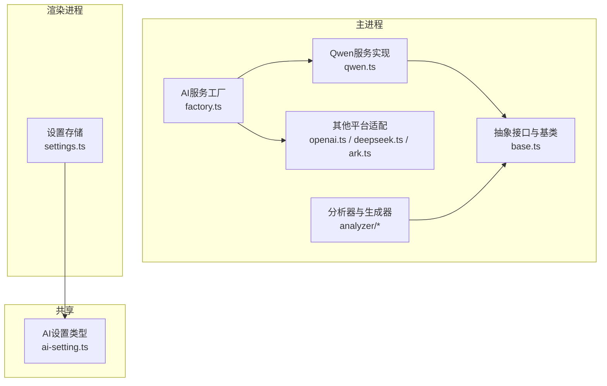
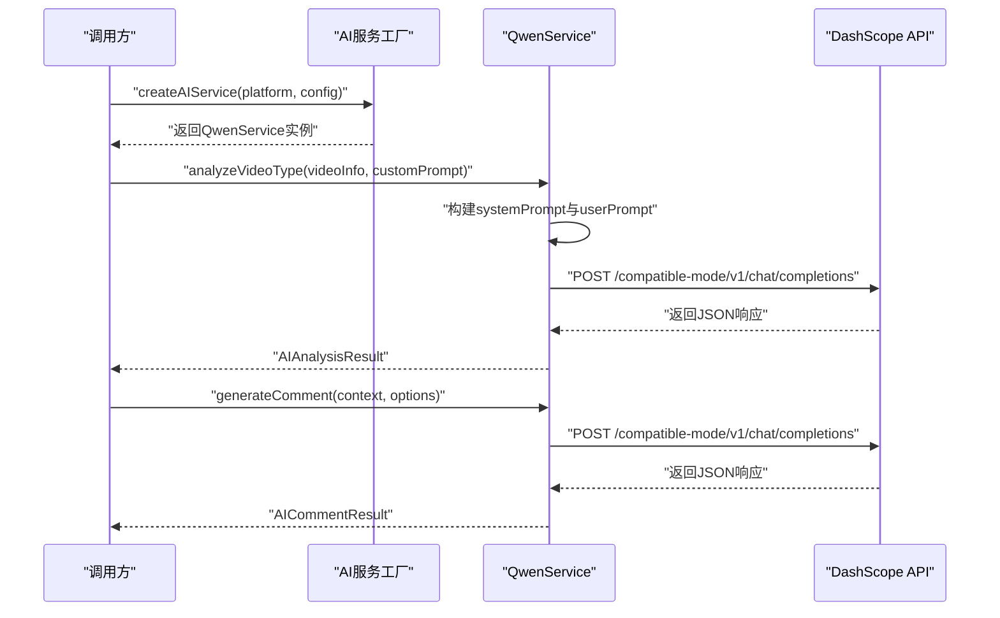
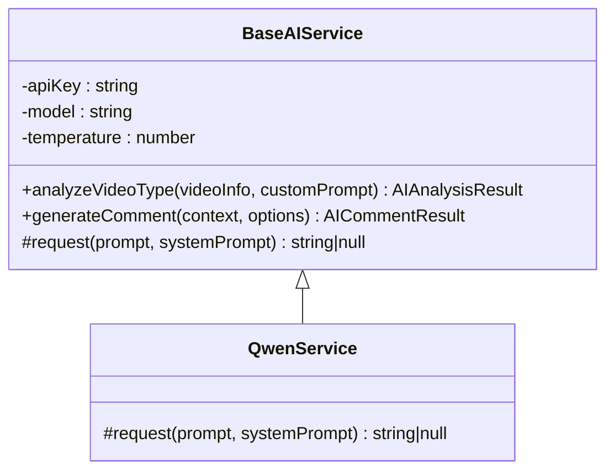
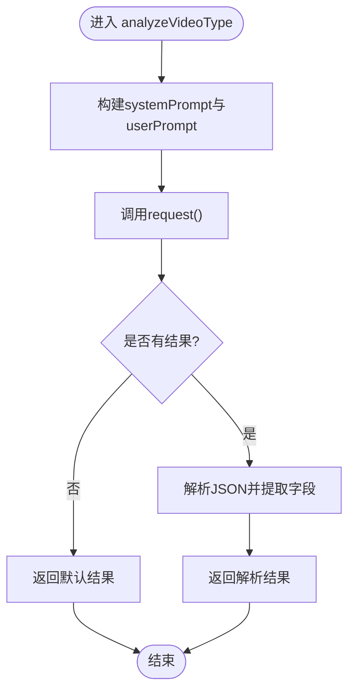
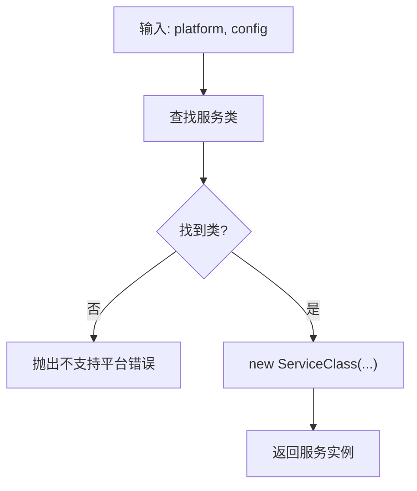
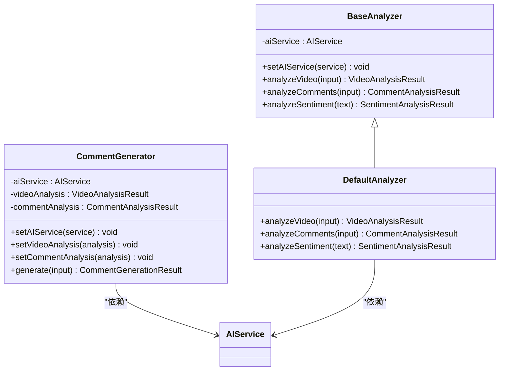
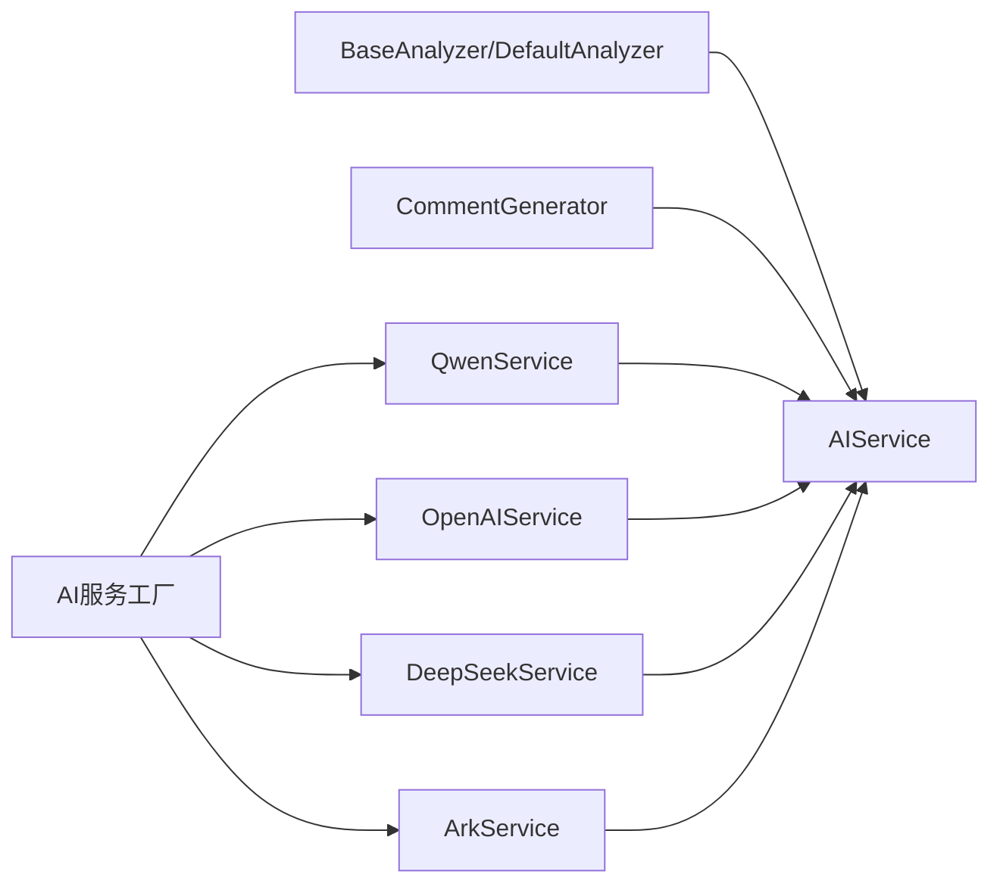

# 通义千问集成API

<cite>
**本文档引用的文件**
- [qwen.ts](file://src/main/integration/ai/qwen.ts)
- [base.ts](file://src/main/integration/ai/base.ts)
- [factory.ts](file://src/main/integration/ai/factory.ts)
- [ai-setting.ts](file://src/shared/ai-setting.ts)
- [index.ts](file://src/main/integration/ai/analyzer/index.ts)
- [types.ts](file://src/main/integration/ai/analyzer/types.ts)
- [base.ts](file://src/main/integration/ai/analyzer/base.ts)
- [generator.ts](file://src/main/integration/ai/analyzer/generator.ts)
- [openai.ts](file://src/main/integration/ai/openai.ts)
- [deepseek.ts](file://src/main/integration/ai/deepseek.ts)
- [ark.ts](file://src/main/integration/ai/ark.ts)
- [settings.ts](file://src/renderer/src/stores/settings.ts)
- [README.md](file://README.md)
</cite>

## 目录
1. [简介](#简介)
2. [项目结构](#项目结构)
3. [核心组件](#核心组件)
4. [架构总览](#架构总览)
5. [详细组件分析](#详细组件分析)
6. [依赖关系分析](#依赖关系分析)
7. [性能考虑](#性能考虑)
8. [故障排除指南](#故障排除指南)
9. [结论](#结论)
10. [附录](#附录)

## 简介
本文件为通义千问（阿里云DashScope）服务在本项目中的集成API文档，覆盖以下内容：
- QwenService类的接口规范、方法定义与参数说明
- DashScope API调用方式、模型选择、请求格式与响应处理
- 通义万相、通义听悟等子服务的API使用方法（如适用）
- 完整的代码示例路径、配置参数与故障排除指南

本项目通过统一的AI服务抽象层，支持多家大模型平台（包括阿里云百炼），并通过工厂模式按平台动态创建具体服务实例。

**章节来源**
- [README.md:1-54](file://README.md#L1-L54)

## 项目结构
与通义千问集成相关的关键目录与文件如下：
- 主进程AI集成层：src/main/integration/ai/
  - qwen.ts：QwenService实现（继承BaseAIService）
  - base.ts：AIService接口与BaseAIService抽象类
  - factory.ts：AI服务工厂，按平台创建具体服务实例
  - analyzer/：视频与评论分析器及评论生成器
  - 其他平台适配：openai.ts、deepseek.ts、ark.ts
- 共享设置：src/shared/ai-setting.ts
- 前端设置存储：src/renderer/src/stores/settings.ts

**图表来源**
- [factory.ts:1-27](file://src/main/integration/ai/factory.ts#L1-L27)
- [base.ts:28-131](file://src/main/integration/ai/base.ts#L28-L131)
- [qwen.ts:3-45](file://src/main/integration/ai/qwen.ts#L3-L45)
- [ai-setting.ts:1-29](file://src/shared/ai-setting.ts#L1-L29)
- [settings.ts:1-46](file://src/renderer/src/stores/settings.ts#L1-L46)

**章节来源**
- [factory.ts:1-27](file://src/main/integration/ai/factory.ts#L1-L27)
- [base.ts:28-131](file://src/main/integration/ai/base.ts#L28-L131)
- [qwen.ts:3-45](file://src/main/integration/ai/qwen.ts#L3-L45)
- [ai-setting.ts:1-29](file://src/shared/ai-setting.ts#L1-L29)
- [settings.ts:1-46](file://src/renderer/src/stores/settings.ts#L1-L46)

## 核心组件
- AIService接口与BaseAIService抽象类
  - 定义统一的AI服务能力：analyzeVideoType与generateComment
  - 提供公共配置：apiKey、model、temperature
  - 提供通用的视频类型分析与评论生成逻辑
- QwenService类
  - 实现DashScope兼容模式的Chat Completions调用
  - 使用Bearer Token鉴权，发送system+user消息
  - 返回choices[0].message.content作为结果
- AI服务工厂
  - 根据平台映射创建对应服务实例
  - 支持平台：volcengine、bailian（通义千问）、openai、deepseek
- 分析器与评论生成器
  - BaseAnalyzer：封装视频分析、评论分析、情感分析的系统提示与调用流程
  - CommentGenerator：基于视频/评论分析结果生成高质量评论

**章节来源**
- [base.ts:23-131](file://src/main/integration/ai/base.ts#L23-L131)
- [qwen.ts:3-45](file://src/main/integration/ai/qwen.ts#L3-L45)
- [factory.ts:9-25](file://src/main/integration/ai/factory.ts#L9-L25)
- [base.ts:10-22](file://src/main/integration/ai/analyzer/base.ts#L10-L22)
- [generator.ts:9-53](file://src/main/integration/ai/analyzer/generator.ts#L9-L53)

## 架构总览
下图展示了从工厂到具体服务、再到DashScope API的整体调用链路：

**图表来源**
- [factory.ts:16-25](file://src/main/integration/ai/factory.ts#L16-L25)
- [qwen.ts:4-44](file://src/main/integration/ai/qwen.ts#L4-L44)

## 详细组件分析

### QwenService 类
- 继承自BaseAIService，实现request方法
- 请求地址：DashScope兼容模式Chat Completions
- 请求头：
  - Authorization: Bearer {apiKey}
  - Content-Type: application/json
- 请求体字段：
  - model：模型名称（来自构造函数）
  - messages：包含system与user消息
  - temperature：采样温度（来自构造函数）
  - max_tokens：最大生成长度（固定值）
- 响应处理：
  - 若HTTP状态非2xx，记录错误并返回null
  - 解析JSON，提取choices[0].message.content
  - 异常捕获后记录错误并返回null
- 超时控制：AbortController在30秒后中断请求

**图表来源**
- [base.ts:28-131](file://src/main/integration/ai/base.ts#L28-L131)
- [qwen.ts:3-45](file://src/main/integration/ai/qwen.ts#L3-L45)

**章节来源**
- [qwen.ts:4-44](file://src/main/integration/ai/qwen.ts#L4-L44)

### BaseAIService 抽象类
- 接口定义：
  - analyzeVideoType(videoInfo, customPrompt)：视频类型分析，返回shouldWatch与reason
  - generateComment(context, options)：评论生成，返回content
- 关键行为：
  - analyzeVideoType：构建systemPrompt与userPrompt，调用request，解析JSON
  - generateComment：根据上下文与选项构建系统提示与用户提示，截断过长内容
- 默认回退策略：
  - analyzeVideoType失败返回{shouldWatch: false, reason: "..."}
  - generateComment失败返回默认评论

**图表来源**
- [base.ts:41-60](file://src/main/integration/ai/base.ts#L41-L60)

**章节来源**
- [base.ts:28-131](file://src/main/integration/ai/base.ts#L28-L131)

### AI服务工厂
- 平台映射：
  - bailian -> QwenService
  - volcengine -> ArkService
  - openai -> OpenAIService
  - deepseek -> DeepSeekService
- 创建逻辑：
  - 根据platform查找对应类，若不存在抛出错误
  - 使用config.apiKey、config.model、config.temperature初始化实例

**图表来源**
- [factory.ts:16-25](file://src/main/integration/ai/factory.ts#L16-L25)

**章节来源**
- [factory.ts:9-25](file://src/main/integration/ai/factory.ts#L9-L25)

### 分析器与评论生成器
- BaseAnalyzer
  - analyzeVideo：构建视频分析提示，期望返回JSON，包含分类、主题、受众、互动水平、情感倾向、推荐评论风格、避免关键词、置信度等
  - analyzeComments：构建评论分析提示，期望返回JSON，包含热门话题、情感分布、热门表达、受众性格、建议语气、可借鉴评论等
  - analyzeSentiment：构建情感分析提示，期望返回JSON，包含总体情感、得分、关键词
- CommentGenerator
  - setAIService/setVideoAnalysis/setCommentAnalysis：注入依赖
  - generate：根据视频/评论分析与用户需求生成评论，计算评分、提取表情符号、避免关键词
  - 默认评论：随机返回预设内容，评分0.5，建议表情符号

**图表来源**
- [base.ts:10-22](file://src/main/integration/ai/analyzer/base.ts#L10-L22)
- [generator.ts:9-53](file://src/main/integration/ai/analyzer/generator.ts#L9-L53)

**章节来源**
- [base.ts:10-183](file://src/main/integration/ai/analyzer/base.ts#L10-L183)
- [generator.ts:9-180](file://src/main/integration/ai/analyzer/generator.ts#L9-L180)

### 通义万相、通义听悟等子服务
- 当前仓库中未发现通义万相、通义听悟专用的独立服务类或API调用实现
- 项目支持的平台包括：volcengine（豆包）、bailian（阿里云百炼/Qwen）、openai、deepseek
- 若需接入通义万相/通义听悟，请在后续扩展中新增对应服务类，并在工厂中注册映射

**章节来源**
- [factory.ts:9-14](file://src/main/integration/ai/factory.ts#L9-L14)
- [README.md:7](file://README.md#L7)

## 依赖关系分析
- 组件耦合
  - QwenService依赖BaseAIService提供的统一接口与通用逻辑
  - 工厂通过映射解耦上层调用与具体实现
  - 分析器与生成器通过AIService接口解耦不同平台
- 外部依赖
  - DashScope API：/compatible-mode/v1/chat/completions
  - 其他平台API：OpenAI、DeepSeek、火山引擎
- 可能的循环依赖
  - 当前结构清晰，无明显循环导入

**图表来源**
- [factory.ts:9-25](file://src/main/integration/ai/factory.ts#L9-L25)
- [base.ts:23-26](file://src/main/integration/ai/base.ts#L23-L26)
- [base.ts:10-22](file://src/main/integration/ai/analyzer/base.ts#L10-L22)
- [generator.ts:1-7](file://src/main/integration/ai/analyzer/generator.ts#L1-L7)

**章节来源**
- [factory.ts:9-25](file://src/main/integration/ai/factory.ts#L9-L25)
- [base.ts:23-26](file://src/main/integration/ai/base.ts#L23-L26)
- [base.ts:10-22](file://src/main/integration/ai/analyzer/base.ts#L10-L22)
- [generator.ts:1-7](file://src/main/integration/ai/analyzer/generator.ts#L1-L7)

## 性能考虑
- 超时控制：所有平台服务均使用AbortController在30秒内中断请求，避免长时间阻塞
- 最大生成长度：统一设置max_tokens=500，防止过长响应影响性能
- 温度参数：通过构造函数传入，可在不同场景调整创造性与稳定性
- 错误降级：请求失败或解析失败时返回默认结果，保证功能可用性

**章节来源**
- [qwen.ts:5-6](file://src/main/integration/ai/qwen.ts#L5-L6)
- [qwen.ts:24](file://src/main/integration/ai/qwen.ts#L24)
- [base.ts:33](file://src/main/integration/ai/base.ts#L33)

## 故障排除指南
- 无法连接DashScope
  - 检查网络连通性与代理设置
  - 确认API Key有效且具有访问权限
- HTTP状态码异常
  - 查看控制台日志中的状态码
  - 确认模型名称正确且在可用模型列表中
- 响应为空或解析失败
  - 确保返回的是JSON格式
  - 检查系统提示与用户提示是否合理
- 生成评论不符合预期
  - 调整temperature与max_length
  - 检查style与customPrompt是否合适
- 设置未生效
  - 在前端设置存储中确认已更新并持久化

**章节来源**
- [qwen.ts:32-38](file://src/main/integration/ai/qwen.ts#L32-L38)
- [base.ts:50-59](file://src/main/integration/ai/base.ts#L50-L59)
- [settings.ts:24-34](file://src/renderer/src/stores/settings.ts#L24-L34)

## 结论
本项目通过统一的AI服务抽象与工厂模式，实现了对多家大模型平台的灵活接入。QwenService基于DashScope兼容模式，提供了稳定的Chat Completions调用能力；结合分析器与评论生成器，能够完成从视频内容分析到评论生成的完整闭环。对于通义万相、通义听悟等子服务，当前仓库未提供专门实现，可在后续版本中按相同模式扩展。

## 附录

### API接口规范与参数说明

- AIService接口
  - analyzeVideoType(videoInfo: string, customPrompt: string): Promise<AIAnalysisResult>
    - 输入：视频信息字符串、自定义规则字符串
    - 输出：shouldWatch布尔值与reason字符串
  - generateComment(context: AICommentContext | string, optionsOrPrompt: AICommentOptions | string): Promise<AICommentResult>
    - 输入：上下文对象或视频描述字符串、选项对象或自定义提示字符串
    - 输出：生成的评论内容

- BaseAIService构造函数
  - 参数：apiKey(string)、model(string)、temperature(number，默认0.8)
  - 作用：保存配置并在子类中使用

- QwenService.request
  - 参数：prompt(string)、systemPrompt(string)
  - 返回：string|null（成功时为模型回复内容，失败时为null）

- 工厂方法createAIService
  - 参数：platform(AIPlatform)、config({ apiKey, model, temperature? })
  - 返回：AIService实例
  - 平台映射：bailian -> QwenService

- DashScope请求参数
  - URL：/compatible-mode/v1/chat/completions
  - 方法：POST
  - 头部：Authorization: Bearer {apiKey}, Content-Type: application/json
  - 体字段：model、messages、temperature、max_tokens

- 平台与模型
  - 平台类型：volcengine、bailian、openai、deepseek
  - 默认平台：deepseek
  - 默认模型：deepseek-chat
  - 平台可用模型：
    - volcengine: ['doubao-seed-1.6-250615', 'doubao-pro-4k-250519']
    - bailian: ['qwen-plus', 'qwen-max']
    - openai: ['gpt-4o', 'gpt-4o-mini']
    - deepseek: ['deepseek-chat', 'deepseek-reasoner']

- 代码示例路径
  - 创建Qwen服务实例：[factory.ts:16-25](file://src/main/integration/ai/factory.ts#L16-L25)
  - 调用视频类型分析：[base.ts:41-60](file://src/main/integration/ai/base.ts#L41-L60)
  - 调用评论生成：[base.ts:62-130](file://src/main/integration/ai/base.ts#L62-L130)
  - DashScope请求调用：[qwen.ts:8-38](file://src/main/integration/ai/qwen.ts#L8-L38)
  - 设置存储与默认配置：[settings.ts:24-34](file://src/renderer/src/stores/settings.ts#L24-L34), [ai-setting.ts:10-22](file://src/shared/ai-setting.ts#L10-L22)

**章节来源**
- [base.ts:23-131](file://src/main/integration/ai/base.ts#L23-L131)
- [factory.ts:16-25](file://src/main/integration/ai/factory.ts#L16-L25)
- [qwen.ts:8-38](file://src/main/integration/ai/qwen.ts#L8-L38)
- [ai-setting.ts:10-29](file://src/shared/ai-setting.ts#L10-L29)
- [settings.ts:24-34](file://src/renderer/src/stores/settings.ts#L24-L34)