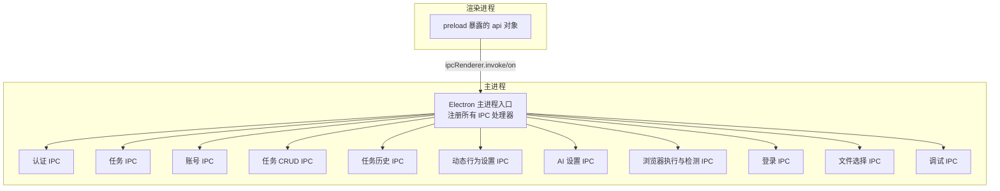
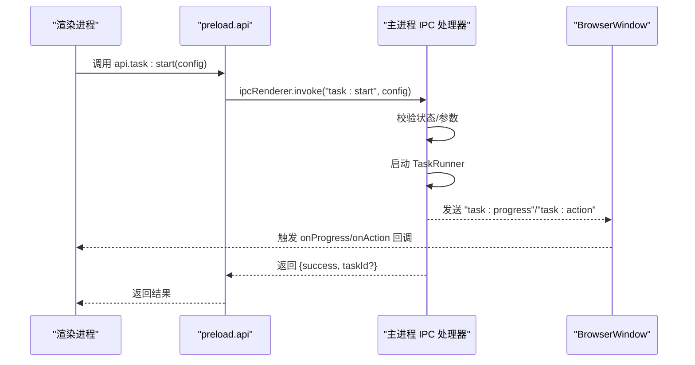
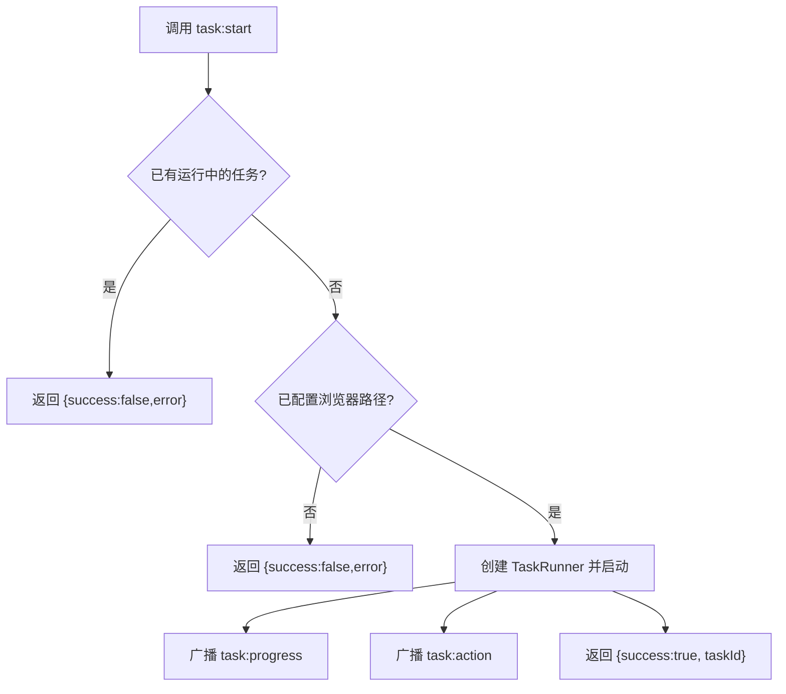
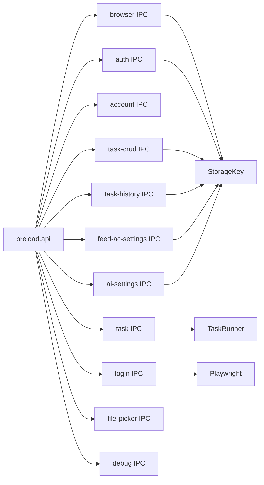

# API参考

<cite>
**本文引用的文件**
- [src/preload/index.ts](file://src/preload/index.ts)
- [src/main/index.ts](file://src/main/index.ts)
- [src/main/ipc/auth.ts](file://src/main/ipc/auth.ts)
- [src/main/ipc/task.ts](file://src/main/ipc/task.ts)
- [src/main/ipc/account.ts](file://src/main/ipc/account.ts)
- [src/main/ipc/task-crud.ts](file://src/main/ipc/task-crud.ts)
- [src/main/ipc/task-history.ts](file://src/main/ipc/task-history.ts)
- [src/main/ipc/feed-ac-setting.ts](file://src/main/ipc/feed-ac-setting.ts)
- [src/main/ipc/ai-setting.ts](file://src/main/ipc/ai-setting.ts)
- [src/main/ipc/browser-exec.ts](file://src/main/ipc/browser-exec.ts)
- [src/main/ipc/browser-detect.ts](file://src/main/ipc/browser-detect.ts)
- [src/main/ipc/login.ts](file://src/main/ipc/login.ts)
- [src/main/ipc/file-picker.ts](file://src/main/ipc/file-picker.ts)
- [src/main/ipc/debug.ts](file://src/main/ipc/debug.ts)
- [src/shared/task.ts](file://src/shared/task.ts)
- [src/shared/account.ts](file://src/shared/account.ts)
- [src/shared/platform.ts](file://src/shared/platform.ts)
</cite>

## 目录
1. [简介](#简介)
2. [项目结构](#项目结构)
3. [核心组件](#核心组件)
4. [架构总览](#架构总览)
5. [详细组件分析](#详细组件分析)
6. [依赖关系分析](#依赖关系分析)
7. [性能考量](#性能考量)
8. [故障排查指南](#故障排查指南)
9. [结论](#结论)
10. [附录](#附录)

## 简介
本文件为 AutoOps 的完整 API 参考文档，聚焦于应用内进程间通信（IPC）接口。文档覆盖以下方面：
- IPC API 端点：HTTP 方法、URL 模式、请求/响应格式与认证方式
- WebSocket/Socket 通信：连接处理、消息格式、事件类型与实时交互模式
- IPC 通信：数据流、消息传递与进程同步机制
- 协议特定示例、错误处理策略、安全考虑与速率限制
- 常见用例、客户端实现指南与性能优化技巧
- 调试工具与监控方法；必要时提供弃用功能迁移指南与向后兼容性说明

说明：
- AutoOps 使用 Electron 架构，前端通过 preload 暴露的 api 对象调用渲染进程 IPC；主进程注册各类 IPC 处理器。
- 文档中的“HTTP 方法/URL 模式”仅用于描述 IPC 命名空间与调用语义，不对应真实 HTTP 接口；实际为 IPC 通道名称与参数约定。

## 项目结构
AutoOps 的 IPC 层位于主进程 src/main/ipc 下，preload 层位于 src/preload/index.ts，共享数据模型位于 src/shared。

图表来源
- [src/main/index.ts:54-76](file://src/main/index.ts#L54-L76)
- [src/preload/index.ts:95-187](file://src/preload/index.ts#L95-L187)

章节来源
- [src/main/index.ts:1-106](file://src/main/index.ts#L1-L106)
- [src/preload/index.ts:1-187](file://src/preload/index.ts#L1-L187)

## 核心组件
- 预加载层（preload）：定义并暴露 ElectronAPI 接口，封装 ipcRenderer.invoke 与 ipcRenderer.on，统一前端调用入口。
- 主进程层（ipc/*）：按功能域划分 IPC 处理器，负责业务逻辑、状态存储与事件广播。
- 共享层（shared/*）：定义平台、任务、账号等数据结构与默认值，确保前后端一致的数据契约。

章节来源
- [src/preload/index.ts:3-93](file://src/preload/index.ts#L3-L93)
- [src/shared/platform.ts:1-260](file://src/shared/platform.ts#L1-L260)
- [src/shared/task.ts:1-54](file://src/shared/task.ts#L1-L54)
- [src/shared/account.ts:1-39](file://src/shared/account.ts#L1-L39)

## 架构总览
IPC 调用链路从渲染进程发起，经由 preload 的 ipcRenderer.invoke 到达主进程处理器，处理器完成业务处理后通过 BrowserWindow.webContents.send 广播事件给渲染进程。

图表来源
- [src/preload/index.ts:102-116](file://src/preload/index.ts#L102-L116)
- [src/main/ipc/task.ts:11-102](file://src/main/ipc/task.ts#L11-L102)

章节来源
- [src/main/ipc/task.ts:11-102](file://src/main/ipc/task.ts#L11-L102)
- [src/preload/index.ts:102-116](file://src/preload/index.ts#L102-L116)

## 详细组件分析

### 认证（auth）
- 命名空间：auth
- 端点与行为
  - hasAuth → 返回是否已认证
  - login(authData) → 写入认证数据并返回成功
  - logout → 清空认证数据并返回成功
  - getAuth → 获取当前认证数据
- 请求/响应
  - login：请求体为任意对象；响应为 { success: boolean }
  - 其他：无请求体或返回布尔/对象
- 认证方式：本地存储键值（AUTH），无网络认证
- 安全考虑：认证数据以本地存储保存，建议配合应用最小权限与沙箱配置

章节来源
- [src/main/ipc/auth.ts:4-23](file://src/main/ipc/auth.ts#L4-L23)
- [src/preload/index.ts:96-101](file://src/preload/index.ts#L96-L101)

### 任务控制（task）
- 命名空间：task
- 端点与行为
  - start(config) → 启动任务；config 包含 settings、accountId、platform、taskType
  - stop → 停止当前任务
  - status → 查询运行状态
  - 进度与动作事件：task:progress（消息体含 message、timestamp）、task:action（消息体含 videoId、action、success）
- 请求/响应
  - start：请求体为 { settings, accountId?, platform?, taskType? }；响应为 { success: boolean, taskId?, error? }
  - stop/status：无请求体；stop 返回 { success: boolean, error? }；status 返回 { running: boolean }
- 实时交互：主进程通过 BrowserWindow 广播进度与动作事件
- 错误处理：并发启动会返回错误；浏览器路径未配置会返回错误
- 安全与速率：任务并发控制由单实例 runner 保证；建议前端避免频繁重复调用

图表来源
- [src/main/ipc/task.ts:11-102](file://src/main/ipc/task.ts#L11-L102)

章节来源
- [src/main/ipc/task.ts:11-102](file://src/main/ipc/task.ts#L11-L102)
- [src/preload/index.ts:102-116](file://src/preload/index.ts#L102-L116)

### 动态行为设置（feed-ac-settings）
- 命名空间：feed-ac-settings
- 端点与行为
  - get → 获取设置（自动从 v2 迁移到 v3）
  - update(partial) → 合并更新并返回最新设置
  - reset → 恢复默认设置
  - export → 导出当前设置
  - import(settings) → 导入并写入（支持 v2 自动迁移）
- 数据版本：内部使用 FeedAcSettingsV3，默认值来自共享层
- 安全与兼容：导入时进行版本校验与迁移，避免破坏现有配置

章节来源
- [src/main/ipc/feed-ac-setting.ts:16-44](file://src/main/ipc/feed-ac-setting.ts#L16-L44)
- [src/preload/index.ts:117-123](file://src/preload/index.ts#L117-L123)

### AI 设置（ai-settings）
- 命名空间：ai-settings
- 端点与行为
  - get → 获取设置（无则返回默认）
  - update(partial) → 合并更新并返回最新设置
  - reset → 恢复默认设置
  - test(config) → 测试（占位，返回提示信息）
- 安全与兼容：默认值来自共享层；测试接口可扩展

章节来源
- [src/main/ipc/ai-setting.ts:5-27](file://src/main/ipc/ai-setting.ts#L5-L27)
- [src/preload/index.ts:124-129](file://src/preload/index.ts#L124-L129)

### 浏览器执行路径（browser-exec）
- 命名空间：browser-exec
- 端点与行为
  - get → 获取已配置的浏览器可执行路径
  - set(path) → 设置浏览器可执行路径并返回成功
- 用途：任务启动前校验浏览器路径

章节来源
- [src/main/ipc/browser-exec.ts:4-13](file://src/main/ipc/browser-exec.ts#L4-L13)
- [src/preload/index.ts:130-133](file://src/preload/index.ts#L130-L133)

### 浏览器检测（browser-detect）
- 命名空间：browser
- 端点与行为
  - detect → 检测系统中可用的浏览器（去重返回 name/path/version）
- 平台支持：Windows、macOS、Linux
- 安全与兼容：通过注册表与常见路径扫描，避免硬编码路径

章节来源
- [src/main/ipc/browser-detect.ts:105-117](file://src/main/ipc/browser-detect.ts#L105-L117)
- [src/preload/index.ts:134-136](file://src/preload/index.ts#L134-L136)

### 登录（login）
- 命名空间：login
- 端点与行为
  - douyin → 使用 Playwright 打开浏览器，等待用户登录，提取用户信息与 cookies，返回 storageState（字符串化）
  - getUrl → 返回目标平台首页 URL
- 安全与兼容：使用临时用户数据目录；cookies 字段标准化；URL 等待超时容错
- 注意：该流程为一次性交互，不持久化凭据至应用存储

章节来源
- [src/main/ipc/login.ts:17-173](file://src/main/ipc/login.ts#L17-L173)
- [src/preload/index.ts:148-150](file://src/preload/index.ts#L148-L150)

### 文件选择（file-picker）
- 命名空间：file-picker
- 端点与行为
  - selectFile(options?) → 打开文件选择对话框，返回 { canceled, filePath, fileName? }
  - selectDirectory() → 打开目录选择对话框，返回 { canceled, dirPath, dirName? }
- 安全与兼容：基于 Electron dialog 组件，跨平台一致

章节来源
- [src/main/ipc/file-picker.ts:4-37](file://src/main/ipc/file-picker.ts#L4-L37)
- [src/preload/index.ts:151-154](file://src/preload/index.ts#L151-L154)

### 任务历史（task-history）
- 命名空间：task-history
- 端点与行为
  - getAll/getById → 查询全部或指定记录
  - add(record) → 新增记录（头部插入）
  - update(id, updates) → 更新并返回 { success: boolean, error? }
  - delete/clear → 删除指定或清空
- 存储：基于本地存储键值（TASK_HISTORY）

章节来源
- [src/main/ipc/task-history.ts:5-45](file://src/main/ipc/task-history.ts#L5-L45)
- [src/preload/index.ts:155-162](file://src/preload/index.ts#L155-L162)

### 任务 CRUD（task-crud）
- 命名空间：task 与 task-template
- 端点与行为
  - task:getAll/getById/getByAccount/getByPlatform → 查询任务
  - task:create({ name, accountId, platform?, taskType?, config? }) → 创建并返回新任务
  - task:update(id, updates) → 更新并返回新值或 null
  - task:delete/duplicate → 删除或复制任务
  - task-template:getAll/save/delete → 模板管理
- 默认值：平台默认 douyin，任务类型默认 comment，配置默认来自共享层
- 安全与兼容：生成唯一 ID；更新时间戳自动维护

章节来源
- [src/main/ipc/task-crud.ts:8-108](file://src/main/ipc/task-crud.ts#L8-L108)
- [src/preload/index.ts:168-181](file://src/preload/index.ts#L168-L181)

### 账号（account）
- 命名空间：account
- 端点与行为
  - list/add/update/delete/setDefault/getDefault/getById/getByPlatform/getActiveAccounts → 账号全量与筛选查询
- 数据模型：Account 接口包含平台、状态、默认标记等字段
- 安全与兼容：首次添加账号自动设为默认；删除后若存在其他账号则补默认

章节来源
- [src/main/ipc/account.ts:32-101](file://src/main/ipc/account.ts#L32-L101)
- [src/preload/index.ts:137-147](file://src/preload/index.ts#L137-L147)

### 调试（debug）
- 命名空间：debug
- 端点与行为
  - getEnv → 返回平台、架构、版本信息
- 用途：辅助诊断环境问题

章节来源
- [src/main/ipc/debug.ts:3-12](file://src/main/ipc/debug.ts#L3-L12)
- [src/preload/index.ts:182-184](file://src/preload/index.ts#L182-L184)

## 依赖关系分析
- 预加载层对主进程 IPC 的依赖：通过命名空间字符串与参数约定耦合
- 主进程各模块相对独立，但共享存储（StorageKey）与日志（electron-log）
- 任务模块依赖平台配置与动态行为设置；登录模块依赖 Playwright 与浏览器路径

图表来源
- [src/preload/index.ts:95-187](file://src/preload/index.ts#L95-L187)
- [src/main/ipc/task.ts:1-104](file://src/main/ipc/task.ts#L1-L104)
- [src/main/ipc/login.ts:17-173](file://src/main/ipc/login.ts#L17-L173)

章节来源
- [src/preload/index.ts:95-187](file://src/preload/index.ts#L95-L187)
- [src/main/ipc/task.ts:1-104](file://src/main/ipc/task.ts#L1-L104)
- [src/main/ipc/login.ts:17-173](file://src/main/ipc/login.ts#L17-L173)

## 性能考量
- 事件广播：任务进度与动作通过 BrowserWindow 广播，建议前端按需订阅，避免过度渲染
- 并发控制：任务启动采用单实例 runner，避免资源竞争
- 存储访问：批量读取/写入本地存储，减少频繁 IO
- 超时与重试：登录流程设置超时与降级回退，提升稳定性
- 资源释放：任务停止后及时清理 runner 引用，避免内存泄漏

## 故障排查指南
- 任务启动失败
  - 检查浏览器路径是否配置（browser-exec:get）
  - 查看日志输出，定位具体错误
- 登录异常
  - 确认浏览器可执行路径正确
  - 检查网络与页面加载状态，必要时增加等待时间
- 事件未到达
  - 确认前端已注册 onProgress/onAction 监听
  - 检查窗口句柄是否有效
- 调试信息
  - 使用 debug:getEnv 获取平台与版本信息
  - 在开发模式下启用日志级别（info/warn/error）

章节来源
- [src/main/ipc/task.ts:92-106](file://src/main/ipc/task.ts#L92-L106)
- [src/main/ipc/login.ts:160-167](file://src/main/ipc/login.ts#L160-L167)
- [src/main/ipc/debug.ts:4-12](file://src/main/ipc/debug.ts#L4-L12)

## 结论
AutoOps 的 IPC API 以清晰的功能域划分与稳定的命名空间组织，覆盖认证、任务、账号、设置、登录、文件选择与调试等核心能力。通过事件广播与本地存储，实现前后端高效协同。建议在生产环境中结合日志与监控，持续优化任务并发与资源使用，并关注平台差异带来的兼容性问题。

## 附录

### WebSocket 与 Socket 通信
- 当前仓库未发现 WebSocket 或 Socket 相关实现。如需实时通信，可在 Electron 中引入 WebSocket 客户端并在主进程侧进行桥接与鉴权。

### 协议特定示例与最佳实践
- 任务启动示例：调用 task:start，传入 settings、platform、taskType；监听 task:progress 与 task:action；根据 success 字段更新 UI
- 登录流程：调用 login:douyin，等待用户完成登录后获取 storageState；将其用于后续账号登录或任务执行
- 设置迁移：feed-ac-settings 支持 v2 到 v3 的自动迁移，导入时无需手动转换

### 安全与速率限制
- 安全：认证数据本地存储；登录使用临时用户数据目录；前端调用需遵循命名空间约定
- 速率：任务并发由单实例 runner 控制；建议前端避免高频重复调用；日志级别按需调整

### 客户端实现指南
- 前端通过 preload 暴露的 api 对象调用 IPC；对事件监听函数返回的移除函数进行管理，避免内存泄漏
- 对于需要持久化的配置，优先使用 feed-ac-settings、ai-settings、task-crud 等 IPC 接口

### 调试工具与监控
- 日志：主进程通过 electron-log 输出 info/warn/error；渲染进程可通过 ipcMain.on('log', ...) 接收日志
- 环境信息：使用 debug:getEnv 获取平台、架构与版本信息
- 登录诊断：检查浏览器路径、页面加载与 cookies 提取逻辑

章节来源
- [src/main/index.ts:92-106](file://src/main/index.ts#L92-L106)
- [src/main/ipc/debug.ts:4-12](file://src/main/ipc/debug.ts#L4-L12)