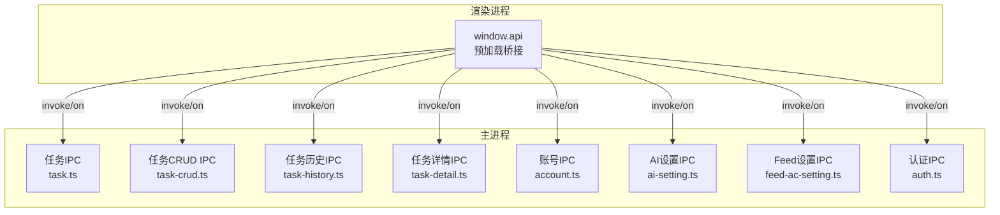
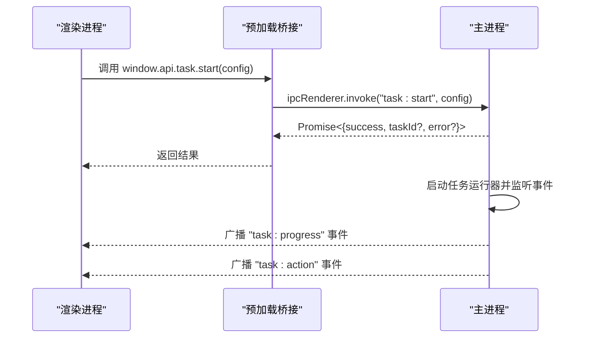
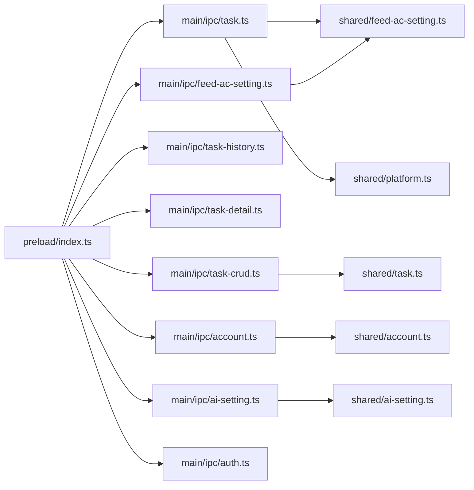

# IPC API参考

<cite>
**本文引用的文件**
- [src/preload/index.ts](file://src/preload/index.ts)
- [src/main/ipc/task.ts](file://src/main/ipc/task.ts)
- [src/main/ipc/task-crud.ts](file://src/main/ipc/task-crud.ts)
- [src/main/ipc/task-history.ts](file://src/main/ipc/task-history.ts)
- [src/main/ipc/task-detail.ts](file://src/main/ipc/task-detail.ts)
- [src/main/ipc/account.ts](file://src/main/ipc/account.ts)
- [src/main/ipc/ai-setting.ts](file://src/main/ipc/ai-setting.ts)
- [src/main/ipc/feed-ac-setting.ts](file://src/main/ipc/feed-ac-setting.ts)
- [src/main/ipc/auth.ts](file://src/main/ipc/auth.ts)
- [src/shared/platform.ts](file://src/shared/platform.ts)
- [src/shared/feed-ac-setting.ts](file://src/shared/feed-ac-setting.ts)
- [src/shared/account.ts](file://src/shared/account.ts)
- [src/shared/task.ts](file://src/shared/task.ts)
- [src/shared/ai-setting.ts](file://src/shared/ai-setting.ts)
</cite>

## 目录
1. [简介](#简介)
2. [项目结构](#项目结构)
3. [核心组件](#核心组件)
4. [架构总览](#架构总览)
5. [详细组件分析](#详细组件分析)
6. [依赖关系分析](#依赖关系分析)
7. [性能考量](#性能考量)
8. [故障排查指南](#故障排查指南)
9. [结论](#结论)
10. [附录](#附录)

## 简介
本文件为 AutoOps 的 IPC API 完整参考文档，覆盖主进程与渲染进程之间的所有 IPC 接口，重点包括：
- 任务管理 API：task:start、task:stop、task:status 及进度/动作事件
- 账号管理 API：账户列表、新增、更新、删除、设默认、查询等
- 设置管理 API：通用设置读取与更新（含浏览器执行路径）
- AI 配置 API：AI 平台设置读取、更新、重置、测试占位
- Feed 动态行为设置 API：读取、更新、重置、导入导出
- 认证与登录 API：认证状态检查、登录、登出、获取认证信息
- 任务 CRUD 与历史详情 API：任务模板、任务复制、历史记录增删改查、视频记录与状态更新

文档提供每个端点的参数类型、返回值格式、错误处理机制、事件触发时机、异步处理模式，并给出客户端调用示例与最佳实践。

## 项目结构
AutoOps 使用 Electron 架构，通过 preload 桥接暴露统一的 window.api 接口到渲染进程；主进程通过 ipcMain.handle 注册 IPC 处理函数，渲染进程通过 ipcRenderer.invoke/on 发起请求与订阅事件。

图表来源
- [src/preload/index.ts:1-187](file://src/preload/index.ts#L1-L187)
- [src/main/ipc/task.ts:11-104](file://src/main/ipc/task.ts#L11-L104)
- [src/main/ipc/task-crud.ts:8-108](file://src/main/ipc/task-crud.ts#L8-L108)
- [src/main/ipc/task-history.ts:5-45](file://src/main/ipc/task-history.ts#L5-L45)
- [src/main/ipc/task-detail.ts:5-39](file://src/main/ipc/task-detail.ts#L5-L39)
- [src/main/ipc/account.ts:32-101](file://src/main/ipc/account.ts#L32-L101)
- [src/main/ipc/ai-setting.ts:5-27](file://src/main/ipc/ai-setting.ts#L5-L27)
- [src/main/ipc/feed-ac-setting.ts:16-44](file://src/main/ipc/feed-ac-setting.ts#L16-L44)
- [src/main/ipc/auth.ts:4-23](file://src/main/ipc/auth.ts#L4-L23)

章节来源
- [src/preload/index.ts:1-187](file://src/preload/index.ts#L1-L187)

## 核心组件
- 预加载桥接层：在 preload 中定义 ElectronAPI 类型与实现，将 ipcRenderer.invoke/on 封装为 window.api，供渲染进程调用。
- 主进程 IPC 层：按功能域拆分多个文件，分别注册对应 IPC 处理函数。
- 共享数据模型：平台类型、任务配置、账号信息、Feed设置、AI设置等，确保前后端数据结构一致。

章节来源
- [src/preload/index.ts:3-93](file://src/preload/index.ts#L3-L93)
- [src/shared/platform.ts:1-260](file://src/shared/platform.ts#L1-L260)
- [src/shared/feed-ac-setting.ts:1-149](file://src/shared/feed-ac-setting.ts#L1-L149)
- [src/shared/account.ts:1-39](file://src/shared/account.ts#L1-L39)
- [src/shared/task.ts:1-54](file://src/shared/task.ts#L1-L54)
- [src/shared/ai-setting.ts:1-29](file://src/shared/ai-setting.ts#L1-L29)

## 架构总览
IPC 调用采用“请求-响应”（invoke）与“事件广播”（on）两种模式：
- 请求-响应：渲染进程调用 window.api.<category>.<method>，主进程 ipcMain.handle 处理并返回 Promise 结果。
- 事件广播：主进程在特定生命周期向所有 BrowserWindow 广播事件，渲染进程通过 window.api.<category>.onXxx 订阅。

图表来源
- [src/preload/index.ts:102-116](file://src/preload/index.ts#L102-L116)
- [src/main/ipc/task.ts:11-104](file://src/main/ipc/task.ts#L11-L104)

## 详细组件分析

### 任务管理 API
- 端点与用途
  - task:start：启动任务，支持传入 Feed 设置、可选账号、平台、任务类型
  - task:stop：停止当前任务
  - task:status：查询任务运行状态
  - 事件：task:progress（进度消息）、task:action（视频操作结果）

- 参数与返回
  - task:start
    - 参数：config.settings（Feed 设置，支持 V2/V3），可选 accountId、platform、taskType
    - 返回：{ success: boolean, taskId?: string, error?: string }
  - task:stop
    - 参数：无
    - 返回：{ success: boolean, error?: string }
  - task:status
    - 参数：无
    - 返回：{ running: boolean }
  - 事件
    - task:progress：{ message: string, timestamp: number }
    - task:action：{ videoId: string, action: string, success: boolean }

- 错误处理与边界
  - 若已有任务运行，task:start 返回 { success: false, error: 'Task already running' }
  - 若未配置浏览器执行路径，task:start 返回 { success: false, error: 'Browser path not configured' }
  - task:stop 在无任务时返回 { success: false, error: 'No task running' }

- 异步与事件
  - task:start 成功后，任务运行器会持续广播进度与动作事件
  - 任务停止后，运行器清理引用，避免重复启动

- 客户端调用示例（路径）
  - 启动任务：[src/preload/index.ts:102-104](file://src/preload/index.ts#L102-L104)
  - 停止任务：[src/preload/index.ts:105](file://src/preload/index.ts#L105)
  - 查询状态：[src/preload/index.ts:106](file://src/preload/index.ts#L106)
  - 订阅进度事件：[src/preload/index.ts:106-110](file://src/preload/index.ts#L106-L110)
  - 订阅动作事件：[src/preload/index.ts:111-115](file://src/preload/index.ts#L111-L115)

- 最佳实践
  - 启动前校验浏览器路径已配置
  - 使用 onProgress/onAction 更新 UI，避免轮询
  - 停止任务时确保清理事件监听

章节来源
- [src/main/ipc/task.ts:11-104](file://src/main/ipc/task.ts#L11-L104)
- [src/preload/index.ts:102-116](file://src/preload/index.ts#L102-L116)

### 账号管理 API
- 端点与用途
  - account:list：获取全部账号
  - account:add：新增账号（自动生成 id 与创建时间，首次添加自动设为默认）
  - account:update：按 id 更新账号
  - account:delete：按 id 删除账号，若无默认则将首个账号设为默认
  - account:setDefault：按 id 设为默认账号
  - account:getDefault：获取默认账号
  - account:getById：按 id 获取账号
  - account:getByPlatform：按平台筛选账号
  - account:getActiveAccounts：获取状态为 active 的账号

- 参数与返回
  - account:list：返回 Account[]
  - account:add：入参为去除了 id/createdAt 的 Account，返回新增 Account
  - account:update：入参为 id 与 updates，返回更新后的 Account 或抛错（未找到）
  - account:delete：入参为 id，返回 { success: boolean }
  - account:setDefault：入参为 id，返回 { success: boolean }
  - account:getDefault：返回 Account | null
  - account:getById：入参为 id，返回 Account | null
  - account:getByPlatform：入参为平台枚举，返回 Account[]
  - account:getActiveAccounts：返回 Account[]

- 数据模型
  - Account：包含 id、name、platform、avatar、storageState、cookies、createdAt、isDefault、status、expiresAt 等字段

- 客户端调用示例（路径）
  - 新增账号：[src/preload/index.ts:137-147](file://src/preload/index.ts#L137-L147)
  - 更新账号：[src/preload/index.ts:140](file://src/preload/index.ts#L140)
  - 删除账号：[src/preload/index.ts:141](file://src/preload/index.ts#L141)
  - 设默认账号：[src/preload/index.ts:142](file://src/preload/index.ts#L142)
  - 获取默认账号：[src/preload/index.ts:143](file://src/preload/index.ts#L143)
  - 按 id 获取：[src/preload/index.ts:144](file://src/preload/index.ts#L144)
  - 按平台筛选：[src/preload/index.ts:145](file://src/preload/index.ts#L145)
  - 获取活跃账号：[src/preload/index.ts:146](file://src/preload/index.ts#L146)

- 最佳实践
  - 新增账号时注意首次自动设默认
  - 删除账号后确保 UI 重新选择默认账号
  - 使用 account:getActiveAccounts 过滤可用账号

章节来源
- [src/main/ipc/account.ts:32-101](file://src/main/ipc/account.ts#L32-L101)
- [src/shared/account.ts:3-15](file://src/shared/account.ts#L3-L15)
- [src/preload/index.ts:137-147](file://src/preload/index.ts#L137-L147)

### 设置管理 API
- 通用设置
  - browser-exec:get：获取浏览器执行路径
  - browser-exec:set：设置浏览器执行路径
  - browser:detect：检测系统中可用浏览器及其版本
  - file-picker:selectFile：选择文件（可带过滤器）
  - file-picker:selectDirectory：选择目录
  - debug:getEnv：获取调试环境信息

- 参数与返回
  - browser-exec:get：返回 string | null
  - browser-exec:set：入参为 path，返回 { success: boolean }
  - browser:detect：返回数组，元素包含 { path, name, version }
  - file-picker:selectFile：返回 { canceled, filePath, fileName? }
  - file-picker:selectDirectory：返回 { canceled, dirPath, dirName? }
  - debug:getEnv：返回任意对象（调试信息）

- 客户端调用示例（路径）
  - 获取浏览器路径：[src/preload/index.ts:130-132](file://src/preload/index.ts#L130-L132)
  - 设置浏览器路径：[src/preload/index.ts:131-132](file://src/preload/index.ts#L131-L132)
  - 检测浏览器：[src/preload/index.ts:134-135](file://src/preload/index.ts#L134-L135)
  - 选择文件：[src/preload/index.ts:151-153](file://src/preload/index.ts#L151-L153)
  - 选择目录：[src/preload/index.ts:152-154](file://src/preload/index.ts#L152-L154)
  - 获取调试环境：[src/preload/index.ts:182-184](file://src/preload/index.ts#L182-L184)

- 最佳实践
  - 启动任务前先确认 browser-exec:get 已有有效路径
  - 使用 browser:detect 提示用户选择正确浏览器

章节来源
- [src/preload/index.ts:30-92](file://src/preload/index.ts#L30-L92)

### AI 配置 API
- 端点与用途
  - ai-settings:get：获取 AI 设置（不存在则返回默认值）
  - ai-settings:update：部分更新 AI 设置
  - ai-settings:reset：重置为默认 AI 设置
  - ai-settings:test：测试 AI 配置（占位，返回占位消息）

- 参数与返回
  - ai-settings:get：返回 AISettings 或默认值
  - ai-settings:update：入参为 Partial<AISettings>，返回更新后的 AISettings
  - ai-settings:reset：返回默认 AISettings
  - ai-settings:test：入参为 { platform, apiKey, model }，返回 { success: boolean, message: string }

- 数据模型
  - AISettings：包含 platform、apiKeys（按平台映射）、model、temperature
  - 默认值：platform='deepseek'，model='deepseek-chat'，temperature=0.9

- 客户端调用示例（路径）
  - 获取：[src/preload/index.ts:24-28](file://src/preload/index.ts#L24-L28)
  - 更新：[src/preload/index.ts:25-27](file://src/preload/index.ts#L25-L27)
  - 重置：[src/preload/index.ts:26](file://src/preload/index.ts#L26)
  - 测试：[src/preload/index.ts:28](file://src/preload/index.ts#L28)

- 最佳实践
  - 更新前先 get 再合并，避免丢失未变更字段
  - 测试接口可扩展为实际网络连通性检测

章节来源
- [src/main/ipc/ai-setting.ts:5-27](file://src/main/ipc/ai-setting.ts#L5-L27)
- [src/shared/ai-setting.ts:3-29](file://src/shared/ai-setting.ts#L3-L29)
- [src/preload/index.ts:24-28](file://src/preload/index.ts#L24-L28)

### Feed 动态行为设置 API
- 端点与用途
  - feed-ac-settings:get：获取 Feed 设置（自动迁移至 V3）
  - feed-ac-settings:update：部分更新设置
  - feed-ac-settings:reset：重置为默认 V3 设置
  - feed-ac-settings:export：导出当前设置（V3）
  - feed-ac-settings:import：导入设置（V2/V3，内部转换为 V3）

- 参数与返回
  - feed-ac-settings:get：返回 FeedAcSettingsV3
  - feed-ac-settings:update：入参为 Partial<FeedAcSettingsV3>，返回更新后的设置
  - feed-ac-settings:reset：返回默认 V3 设置
  - feed-ac-settings:export：返回当前设置（V3）
  - feed-ac-settings:import：入参为 FeedAcSettingsV2|V3，返回 { success: boolean }

- 数据模型
  - FeedAcSettingsV3：包含 version='v3'、taskType、ruleGroups、blockKeywords、authorBlockKeywords、operations 等
  - 默认值：包含 operations 数组、skipAdVideo/skipLiveVideo 等开关与阈值

- 客户端调用示例（路径）
  - 获取：[src/preload/index.ts:17-22](file://src/preload/index.ts#L17-L22)
  - 更新：[src/preload/index.ts:18-22](file://src/preload/index.ts#L18-L22)
  - 重置：[src/preload/index.ts:19-22](file://src/preload/index.ts#L19-L22)
  - 导出：[src/preload/index.ts:20-22](file://src/preload/index.ts#L20-L22)
  - 导入：[src/preload/index.ts:21-22](file://src/preload/index.ts#L21-L22)

- 最佳实践
  - 导入前确保传入的设置包含 version 字段或由 migrateToV3 正确识别
  - 更新时仅传入需要变更的字段，避免覆盖默认值

章节来源
- [src/main/ipc/feed-ac-setting.ts:16-44](file://src/main/ipc/feed-ac-setting.ts#L16-L44)
- [src/shared/feed-ac-setting.ts:37-70](file://src/shared/feed-ac-setting.ts#L37-L70)
- [src/preload/index.ts:17-22](file://src/preload/index.ts#L17-L22)

### 认证与登录 API
- 端点与用途
  - auth:hasAuth：检查是否存在认证信息
  - auth:login：保存认证信息
  - auth:logout：清除认证信息
  - auth:getAuth：获取认证信息

- 参数与返回
  - auth:hasAuth：返回 boolean
  - auth:login：入参为 authData，返回 { success: boolean }
  - auth:logout：返回 { success: boolean }
  - auth:getAuth：返回存储的认证信息

- 客户端调用示例（路径）
  - 检查认证：[src/preload/index.ts:4-8](file://src/preload/index.ts#L4-L8)
  - 登录：[src/preload/index.ts:5-7](file://src/preload/index.ts#L5-L7)
  - 登出：[src/preload/index.ts:6-8](file://src/preload/index.ts#L6-L8)
  - 获取认证：[src/preload/index.ts:7-8](file://src/preload/index.ts#L7-L8)

- 最佳实践
  - 登录成功后立即调用 auth:getAuth 更新本地状态
  - 登出时清理所有敏感数据

章节来源
- [src/main/ipc/auth.ts:4-23](file://src/main/ipc/auth.ts#L4-L23)
- [src/preload/index.ts:4-8](file://src/preload/index.ts#L4-L8)

### 任务 CRUD 与模板 API
- 端点与用途
  - task:getAll：获取全部任务
  - task:getById：按 id 获取任务
  - task:getByAccount：按账号 id 获取任务
  - task:getByPlatform：按平台获取任务
  - task:create：创建任务（自动生成 id 与时间戳）
  - task:update：按 id 更新任务
  - task:delete：按 id 删除任务
  - task:duplicate：复制任务（生成新 id，名称加“(副本)”）
  - task-template:getAll：获取全部任务模板
  - task-template:save：保存模板
  - task-template:delete：按 id 删除模板

- 参数与返回
  - task:create：入参包含 name、accountId、可选 platform、taskType、config，返回新建任务
  - task:update：入参为 id 与 updates，返回更新后的任务或 null
  - task:duplicate：入参为 id，返回复制的新任务或 null
  - task-template:save：入参为 name、config、可选 platform、taskType，返回新建模板

- 数据模型
  - Task：包含 id、name、accountId、platform、taskType、config、createdAt、updatedAt
  - TaskTemplate：包含 id、name、platform、taskType、config、createdAt

- 客户端调用示例（路径）
  - 创建任务：[src/preload/index.ts:168-176](file://src/preload/index.ts#L168-L176)
  - 更新任务：[src/preload/index.ts:171-175](file://src/preload/index.ts#L171-L175)
  - 复制任务：[src/preload/index.ts:175](file://src/preload/index.ts#L175)
  - 保存模板：[src/preload/index.ts:177-181](file://src/preload/index.ts#L177-L181)

- 最佳实践
  - 创建任务时提供默认 Feed 设置
  - 复制任务时注意名称去重与 id 生成

章节来源
- [src/main/ipc/task-crud.ts:8-108](file://src/main/ipc/task-crud.ts#L8-L108)
- [src/shared/task.ts:5-23](file://src/shared/task.ts#L5-L23)
- [src/preload/index.ts:168-181](file://src/preload/index.ts#L168-L181)

### 任务历史与详情 API
- 任务历史
  - task-history:getAll：获取全部历史记录
  - task-history:getById：按 id 获取历史记录
  - task-history:add：新增历史记录（头部插入）
  - task-history:update：按 id 更新历史记录
  - task-history:delete：按 id 删除历史记录
  - task-history:clear：清空历史记录

- 任务详情
  - task-detail:get：按 id 获取历史记录
  - task-detail:addVideoRecord：追加视频记录并更新统计
  - task-detail:updateStatus：更新任务状态，完成/停止/错误时写入结束时间

- 参数与返回
  - add/update/delete/clear：返回 { success: boolean } 或 { success: boolean, error: string }

- 客户端调用示例（路径）
  - 历史记录：[src/preload/index.ts:155-162](file://src/preload/index.ts#L155-L162)
  - 详情：[src/preload/index.ts:163-167](file://src/preload/index.ts#L163-L167)

- 最佳实践
  - addVideoRecord 时根据是否评论更新计数
  - 状态更新为终止态时统一记录结束时间

章节来源
- [src/main/ipc/task-history.ts:5-45](file://src/main/ipc/task-history.ts#L5-L45)
- [src/main/ipc/task-detail.ts:5-39](file://src/main/ipc/task-detail.ts#L5-L39)
- [src/preload/index.ts:155-167](file://src/preload/index.ts#L155-L167)

## 依赖关系分析
- 预加载桥接依赖于各 IPC 文件暴露的通道名与参数签名
- 主进程 IPC 依赖共享数据模型（平台、账号、任务、Feed设置、AI设置）
- 任务运行器通过事件向渲染进程广播进度与动作

图表来源
- [src/preload/index.ts:1-187](file://src/preload/index.ts#L1-L187)
- [src/main/ipc/task.ts:1-104](file://src/main/ipc/task.ts#L1-L104)
- [src/main/ipc/task-crud.ts:1-108](file://src/main/ipc/task-crud.ts#L1-L108)
- [src/main/ipc/task-history.ts:1-45](file://src/main/ipc/task-history.ts#L1-L45)
- [src/main/ipc/task-detail.ts:1-39](file://src/main/ipc/task-detail.ts#L1-L39)
- [src/main/ipc/account.ts:1-101](file://src/main/ipc/account.ts#L1-L101)
- [src/main/ipc/ai-setting.ts:1-27](file://src/main/ipc/ai-setting.ts#L1-L27)
- [src/main/ipc/feed-ac-setting.ts:1-44](file://src/main/ipc/feed-ac-setting.ts#L1-L44)
- [src/main/ipc/auth.ts:1-23](file://src/main/ipc/auth.ts#L1-L23)
- [src/shared/feed-ac-setting.ts:1-149](file://src/shared/feed-ac-setting.ts#L1-L149)
- [src/shared/task.ts:1-54](file://src/shared/task.ts#L1-L54)
- [src/shared/account.ts:1-39](file://src/shared/account.ts#L1-L39)
- [src/shared/ai-setting.ts:1-29](file://src/shared/ai-setting.ts#L1-L29)
- [src/shared/platform.ts:1-260](file://src/shared/platform.ts#L1-L260)

## 性能考量
- 事件广播：task:progress 与 task:action 会在任务运行期间高频触发，建议在渲染层节流或去抖处理 UI 更新。
- 存储访问：各 IPC 读写 store，频繁操作可能阻塞主线程，建议批量更新或延迟写入。
- 浏览器检测：browser:detect 可能较慢，建议缓存结果并在设置页显示提示。
- AI 测试：ai-settings:test 当前为占位，后续可加入超时与连通性检测以提升用户体验。

## 故障排查指南
- 任务无法启动
  - 检查 browser-exec:get 是否返回有效路径
  - 查看 task:start 返回的 error 字段
- 任务无法停止
  - 确认 task:status 返回 running=true
  - 检查 task:stop 返回的 error 字段
- 账号相关问题
  - account:update 抛错“Account not found”：确认 id 存在且未被删除
  - account:delete 后无默认账号：系统会自动将首个账号设为默认
- 设置导入失败
  - 确保传入的设置包含 version 或符合 V2/V3 结构
- 事件未收到
  - 确认已调用 onProgress/onAction 并在组件卸载时移除监听

章节来源
- [src/main/ipc/task.ts:27-30](file://src/main/ipc/task.ts#L27-L30)
- [src/main/ipc/task.ts:32-36](file://src/main/ipc/task.ts#L32-L36)
- [src/main/ipc/task.ts:86-98](file://src/main/ipc/task.ts#L86-L98)
- [src/main/ipc/account.ts:51-60](file://src/main/ipc/account.ts#L51-L60)
- [src/main/ipc/feed-ac-setting.ts:39-43](file://src/main/ipc/feed-ac-setting.ts#L39-L43)

## 结论
本文档系统梳理了 AutoOps 的 IPC API，涵盖任务、账号、设置、AI、Feed、认证及任务历史与详情等模块。通过明确的参数、返回值、错误处理与事件机制，开发者可在渲染层安全地调用主进程能力，并结合最佳实践获得稳定高效的自动化体验。

## 附录
- 平台与任务类型
  - 平台：douyin、kuaishou、xiaohongshu、wechat
  - 任务类型：comment、like、collect、follow、watch、combo
- 关键数据结构
  - FeedAcSettingsV3：包含规则组、屏蔽词、观看时长、最大数量、AI 评论、操作集合等
  - AISettings：包含平台、API Key 映射、模型、温度
  - Account：包含平台、头像、存储状态、状态与过期时间等

章节来源
- [src/shared/platform.ts:1-51](file://src/shared/platform.ts#L1-L51)
- [src/shared/feed-ac-setting.ts:37-70](file://src/shared/feed-ac-setting.ts#L37-L70)
- [src/shared/ai-setting.ts:3-22](file://src/shared/ai-setting.ts#L3-L22)
- [src/shared/account.ts:3-15](file://src/shared/account.ts#L3-L15)