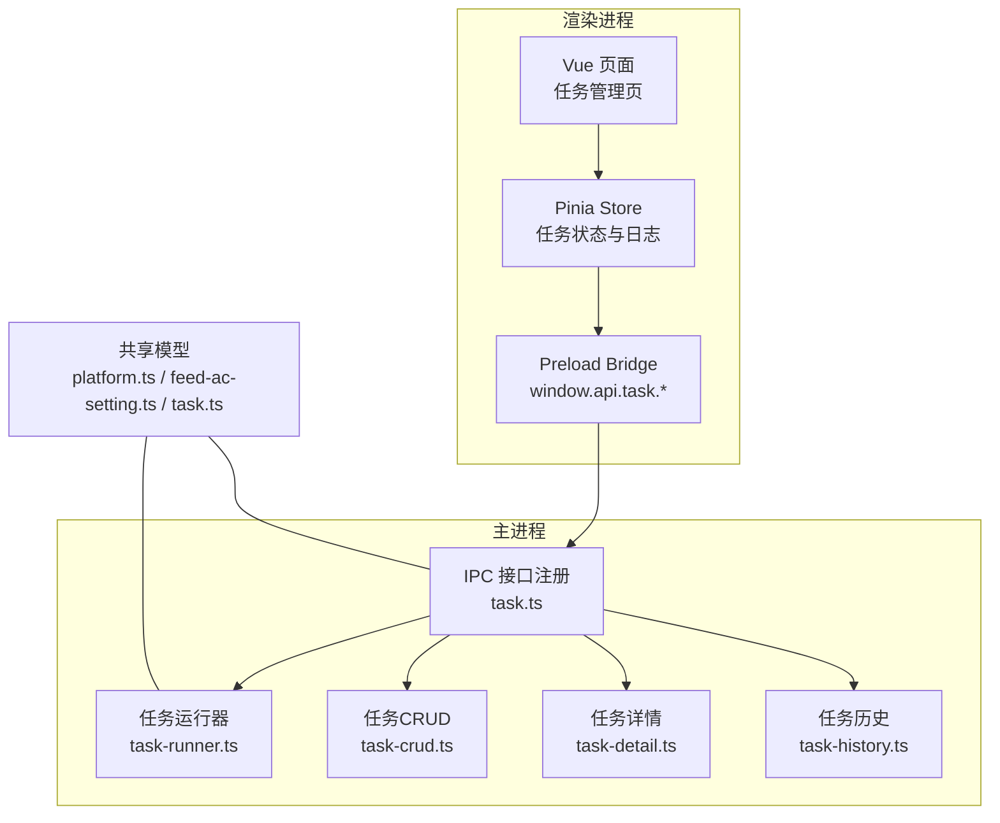
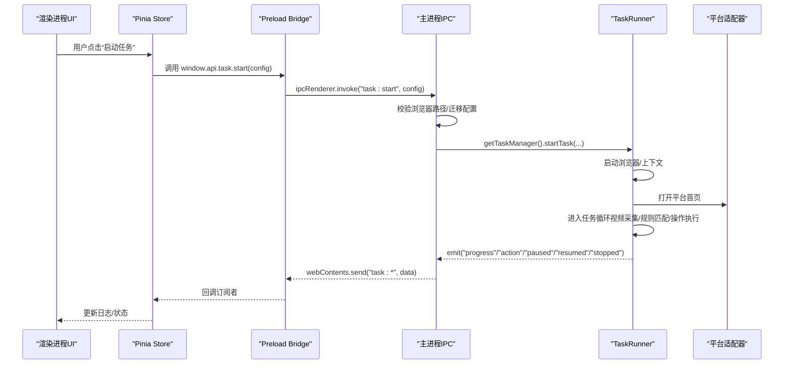
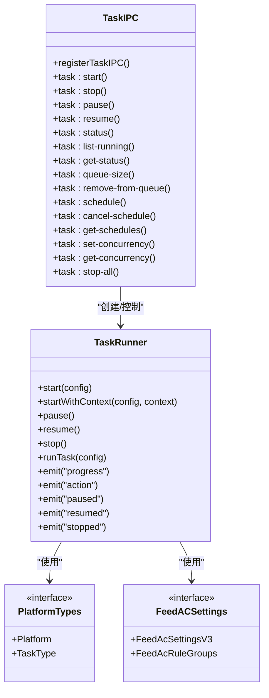

# 任务管理API

<cite>
**本文档引用的文件**
- [src/main/ipc/task.ts](file://src/main/ipc/task.ts)
- [src/main/service/task-runner.ts](file://src/main/service/task-runner.ts)
- [src/shared/platform.ts](file://src/shared/platform.ts)
- [src/shared/feed-ac-setting.ts](file://src/shared/feed-ac-setting.ts)
- [src/shared/task.ts](file://src/shared/task.ts)
- [src/main/ipc/task-crud.ts](file://src/main/ipc/task-crud.ts)
- [src/main/ipc/task-detail.ts](file://src/main/ipc/task-detail.ts)
- [src/main/ipc/task-history.ts](file://src/main/ipc/task-history.ts)
- [src/shared/task-history.ts](file://src/shared/task-history.ts)
- [src/preload/index.ts](file://src/preload/index.ts)
- [src/renderer/src/stores/task.ts](file://src/renderer/src/stores/task.ts)
- [src/renderer/src/pages/tasks.vue](file://src/renderer/src/pages/tasks.vue)
</cite>

## 目录
1. [简介](#简介)
2. [项目结构](#项目结构)
3. [核心组件](#核心组件)
4. [架构总览](#架构总览)
5. [详细组件分析](#详细组件分析)
6. [依赖关系分析](#依赖关系分析)
7. [性能考虑](#性能考虑)
8. [故障排查指南](#故障排查指南)
9. [结论](#结论)
10. [附录](#附录)

## 简介
本文件系统性梳理任务管理IPC API，覆盖任务生命周期控制（启动、停止、暂停、恢复、状态查询）、任务配置数据结构与校验、事件通知机制（进度、动作、调度等）、以及任务详情与历史记录管理。文档面向前端开发者与集成方，提供清晰的接口定义、参数说明、返回值格式与错误处理策略，并给出客户端调用示例与最佳实践。

## 项目结构
任务管理相关代码主要分布在以下层次：
- 主进程IPC层：负责注册任务控制IPC接口、转发事件到渲染进程
- 服务层：封装任务运行器，实现具体业务逻辑
- 共享数据模型：平台类型、任务类型、FeedAC配置、任务与历史记录模型
- 渲染进程桥接层：通过contextBridge暴露window.api.task系列方法
- 渲染进程存储与页面：Pinia Store与Vue页面组件对IPC进行封装与使用

**图表来源**
- [src/main/ipc/task.ts:81-240](file://src/main/ipc/task.ts#L81-L240)
- [src/main/service/task-runner.ts:25-113](file://src/main/service/task-runner.ts#L25-L113)
- [src/main/ipc/task-crud.ts:8-108](file://src/main/ipc/task-crud.ts#L8-L108)
- [src/main/ipc/task-detail.ts:5-39](file://src/main/ipc/task-detail.ts#L5-L39)
- [src/main/ipc/task-history.ts:5-45](file://src/main/ipc/task-history.ts#L5-L45)
- [src/shared/platform.ts:1-260](file://src/shared/platform.ts#L1-L260)
- [src/shared/feed-ac-setting.ts:62-97](file://src/shared/feed-ac-setting.ts#L62-L97)
- [src/shared/task.ts:12-31](file://src/shared/task.ts#L12-L31)
- [src/preload/index.ts:13-44](file://src/preload/index.ts#L13-L44)

**章节来源**
- [src/main/ipc/task.ts:1-243](file://src/main/ipc/task.ts#L1-L243)
- [src/main/service/task-runner.ts:1-760](file://src/main/service/task-runner.ts#L1-L760)
- [src/shared/platform.ts:1-260](file://src/shared/platform.ts#L1-L260)
- [src/shared/feed-ac-setting.ts:1-179](file://src/shared/feed-ac-setting.ts#L1-L179)
- [src/shared/task.ts:1-62](file://src/shared/task.ts#L1-L62)
- [src/main/ipc/task-crud.ts:1-108](file://src/main/ipc/task-crud.ts#L1-L108)
- [src/main/ipc/task-detail.ts:1-39](file://src/main/ipc/task-detail.ts#L1-L39)
- [src/main/ipc/task-history.ts:1-45](file://src/main/ipc/task-history.ts#L1-L45)
- [src/preload/index.ts:1-234](file://src/preload/index.ts#L1-L234)

## 核心组件
- 任务控制IPC接口：task:start、task:stop、task:pause、task:resume、task:status、task:list-running、task:get-status、task:queue-size、task:remove-from-queue、task:schedule、task:cancel-schedule、task:get-schedules、task:set-concurrency、task:get-concurrency、task:stop-all
- 事件通知通道：task:progress、task:action、task:paused、task:resumed、task:started、task:stopped、task:queued、task:scheduleTriggered
- 任务配置数据结构：FeedAcSettingsV3、Platform、TaskType
- 任务详情与历史：TaskHistoryRecord、VideoRecord
- 渲染进程桥接：window.api.task.* 方法集合

**章节来源**
- [src/main/ipc/task.ts:81-240](file://src/main/ipc/task.ts#L81-L240)
- [src/preload/index.ts:13-44](file://src/preload/index.ts#L13-L44)
- [src/shared/feed-ac-setting.ts:62-97](file://src/shared/feed-ac-setting.ts#L62-L97)
- [src/shared/platform.ts:1-5](file://src/shared/platform.ts#L1-L5)
- [src/shared/task-history.ts:14-22](file://src/shared/task-history.ts#L14-L22)

## 架构总览
任务管理采用“主进程IPC + 服务层运行器”的分层设计。渲染进程通过preload桥接调用主进程接口；主进程根据请求创建或控制TaskRunner实例，驱动浏览器自动化执行任务；运行器在执行过程中通过EventEmitter发布事件，主进程统一转发到渲染进程。

**图表来源**
- [src/main/ipc/task.ts:81-132](file://src/main/ipc/task.ts#L81-L132)
- [src/main/service/task-runner.ts:55-113](file://src/main/service/task-runner.ts#L55-L113)
- [src/preload/index.ts:137-161](file://src/preload/index.ts#L137-L161)

## 详细组件分析

### 任务控制接口定义
- task:start
  - 请求参数
    - settings: FeedAcSettingsV3（必填）
    - accountId?: string
    - platform?: Platform
    - taskType?: TaskType
    - taskName?: string
  - 返回值
    - 成功: { success: true, taskId: string }
    - 失败: { success: false, error: string }
  - 错误处理
    - 浏览器路径未配置时直接返回错误
    - 内部异常捕获并返回字符串化错误
  - 兼容性
    - 自动将FeedAcSettingsV2迁移到V3
    - 默认platform为'douyin'，默认taskType取自settings或'comment'

- task:stop
  - 请求参数
    - taskId?: string（可选，不传则停止所有任务）
  - 返回值
    - 成功: { success: true }
    - 失败: { success: false, error: string }

- task:pause / task:resume
  - 请求参数
    - taskId: string
  - 返回值
    - 成功: { success: true }
    - 失败: { success: false, error: string }

- task:status
  - 请求参数
    - taskId?: string（可选）
  - 返回值
    - 指定taskId: TaskStatusInfo 或 { running: false }
    - 不指定taskId: { running: boolean, tasks?: TaskStatusInfo[] }

- task:list-running
  - 返回值: TaskStatusInfo[]

- task:get-status
  - 请求参数: taskId: string
  - 返回值: TaskStatusInfo | null

- task:queue-size
  - 返回值: { size: number }

- task:remove-from-queue
  - 请求参数: queueId: string
  - 返回值: { success: boolean }

- task:schedule
  - 请求参数: taskId: string, cron: string
  - 返回值: { success: boolean, error?: string }

- task:cancel-schedule
  - 请求参数: taskId: string
  - 返回值: { success: boolean }

- task:get-schedules
  - 返回值: Array<{ taskId: string; cron: string; enabled: boolean; nextRunAt?: number; lastRunAt?: number }>

- task:set-concurrency
  - 请求参数: max: number
  - 返回值: { success: true }

- task:get-concurrency
  - 返回值: { maxConcurrency: number }

- task:stop-all
  - 返回值: { success: true, error?: string }

**章节来源**
- [src/main/ipc/task.ts:81-240](file://src/main/ipc/task.ts#L81-L240)
- [src/preload/index.ts:20-44](file://src/preload/index.ts#L20-L44)

### 事件通知机制
- task:progress
  - 触发时机：任务启动、阶段推进、日志输出
  - 数据格式：{ message: string, timestamp: number, taskId?: string }

- task:action
  - 触发时机：执行评论/点赞/收藏/关注等动作后
  - 数据格式：{ videoId: string, action: string, success: boolean, taskId?: string }

- task:paused / task:resumed
  - 触发时机：任务暂停/恢复
  - 数据格式：{ taskId: string, timestamp: number }

- task:started / task:stopped
  - 触发时机：任务开始/结束
  - 数据格式：{ taskId: string, taskName?: string }

- task:queued
  - 触发时机：任务进入队列
  - 数据格式：{ queueId: string, taskName?: string }

- task:scheduleTriggered
  - 触发时机：定时任务被触发
  - 数据格式：{ taskId: string, cron: string }

**章节来源**
- [src/main/ipc/task.ts:22-76](file://src/main/ipc/task.ts#L22-L76)
- [src/main/service/task-runner.ts:185-202](file://src/main/service/task-runner.ts#L185-L202)

### 任务配置数据结构与验证规则
- FeedAcSettingsV3（核心配置）
  - 字段要点
    - version: 'v3'
    - taskType: 'comment' | 'like' | 'collect' | 'follow' | 'watch' | 'combo'
    - ruleGroups: FeedAcRuleGroups[]
    - blockKeywords / authorBlockKeywords: string[]
    - simulateWatchBeforeComment: boolean
    - watchTimeRangeSeconds: [number, number]
    - onlyCommentActiveVideo: boolean
    - maxCount: number
    - aiCommentEnabled: boolean
    - operations: Array<...>（含type、enabled、probability、maxCount、aiEnabled、commentTexts、aiPrompt）
    - 跳过控制：skipAdVideo、skipLiveVideo、skipImageSet
    - 连续跳过阈值：maxConsecutiveSkips
    - 视频切换等待：videoSwitchWaitMs
    - AI评论控制：commentReferenceCount、commentStyle、commentMaxLength
    - 视频分类：videoCategories（enabled、mode、categories、customKeywords、useAI）

- FeedAcRuleGroups（规则组）
  - type: 'ai' | 'manual'
  - relation: 'and' | 'or'
  - rules: Array<{ field: 'nickName'|'videoDesc'|'videoTag', keyword: string }>
  - commentTexts: string[]
  - children?: FeedAcRuleGroups[]
  - aiPrompt?: string

- 平台与任务类型
  - Platform: 'douyin' | 'kuaishou' | 'xiaohongshu' | 'wechat'
  - TaskType: 'comment' | 'like' | 'collect' | 'follow' | 'watch' | 'combo'

- 验证与迁移
  - V2到V3迁移：自动填充默认字段、合并评论文本与AI提示、设置默认概率与开关
  - 主进程在启动前会检测并迁移配置

**章节来源**
- [src/shared/feed-ac-setting.ts:62-97](file://src/shared/feed-ac-setting.ts#L62-L97)
- [src/shared/feed-ac-setting.ts:148-174](file://src/shared/feed-ac-setting.ts#L148-L174)
- [src/shared/platform.ts:1-5](file://src/shared/platform.ts#L1-L5)
- [src/main/ipc/task.ts:104-106](file://src/main/ipc/task.ts#L104-L106)

### 任务详情与历史记录
- 任务详情
  - 获取详情：task-detail:get(id)
  - 添加视频记录：task-detail:addVideoRecord(taskId, videoRecord)
  - 更新状态：task-detail:updateStatus(taskId, status)

- 任务历史
  - 获取全部：task-history:getAll()
  - 按ID获取：task-history:getById(id)
  - 新增：task-history:add(record)
  - 更新：task-history:update(id, updates)
  - 删除：task-history:delete(id)
  - 清空：task-history:clear()

- 数据模型
  - TaskHistoryRecord：包含id、startTime、endTime、status、commentCount、videoRecords、settings
  - VideoRecord：包含视频ID、作者、描述、标签、分享链接、观看时长、操作标记、跳过原因、时间戳

**章节来源**
- [src/main/ipc/task-detail.ts:5-39](file://src/main/ipc/task-detail.ts#L5-L39)
- [src/main/ipc/task-history.ts:5-45](file://src/main/ipc/task-history.ts#L5-L45)
- [src/shared/task-history.ts:14-22](file://src/shared/task-history.ts#L14-L22)

### 任务CRUD与模板
- 任务CRUD
  - 获取全部：task:getAll()
  - 按ID获取：task:getById(id)
  - 按账号过滤：task:getByAccount(accountId)
  - 按平台过滤：task:getByPlatform(platform)
  - 创建：task:create({ name, accountId, platform?, taskType?, config? })
  - 更新：task:update(id, updates)
  - 删除：task:delete(id)
  - 复制：task:duplicate(id)

- 任务模板
  - 获取全部：task-template:getAll()
  - 保存：task-template:save(name, config, platform?, taskType?)
  - 删除：task-template:delete(id)

**章节来源**
- [src/main/ipc/task-crud.ts:8-108](file://src/main/ipc/task-crud.ts#L8-L108)

### 任务运行器执行流程
- 启动
  - 创建浏览器实例（headless=false）
  - 加载账号登录态或全局认证
  - 初始化平台适配器与页面
  - 启动异步任务循环

- 循环逻辑
  - 等待视频切换间隔
  - 抓取当前视频信息（缓存/接口）
  - 类型过滤（广告/直播/图集）
  - 分类筛选（关键词/AI）
  - 屏蔽词检查
  - 规则匹配（手动/AI）
  - 可选模拟观看
  - 执行操作（评论/点赞/收藏/关注），记录结果
  - 连续跳过计数与阈值控制
  - 结束条件：达到目标数量或被停止

- 事件与日志
  - emit('progress') 输出阶段性日志
  - emit('action') 输出动作结果
  - emit('paused'/'resumed'/'stopped') 通知状态变更

**章节来源**
- [src/main/service/task-runner.ts:55-113](file://src/main/service/task-runner.ts#L55-L113)
- [src/main/service/task-runner.ts:235-371](file://src/main/service/task-runner.ts#L235-L371)
- [src/main/service/task-runner.ts:185-202](file://src/main/service/task-runner.ts#L185-L202)

## 依赖关系分析
- IPC层依赖共享模型（平台、任务类型、FeedAC配置）
- 任务运行器依赖平台适配器与AI服务（可选）
- 渲染进程通过preload桥接调用IPC接口，订阅事件并更新UI

**图表来源**
- [src/main/ipc/task.ts:81-240](file://src/main/ipc/task.ts#L81-L240)
- [src/main/service/task-runner.ts:25-113](file://src/main/service/task-runner.ts#L25-L113)
- [src/shared/platform.ts:1-5](file://src/shared/platform.ts#L1-L5)
- [src/shared/feed-ac-setting.ts:62-97](file://src/shared/feed-ac-setting.ts#L62-L97)

**章节来源**
- [src/main/ipc/task.ts:1-243](file://src/main/ipc/task.ts#L1-L243)
- [src/main/service/task-runner.ts:1-760](file://src/main/service/task-runner.ts#L1-L760)
- [src/shared/platform.ts:1-260](file://src/shared/platform.ts#L1-L260)
- [src/shared/feed-ac-setting.ts:1-179](file://src/shared/feed-ac-setting.ts#L1-L179)

## 性能考虑
- 并发控制：通过task:set-concurrency与task:get-concurrency限制同时运行的任务数，避免资源争用
- 视频切换等待：合理设置videoSwitchWaitMs，平衡效率与稳定性
- 连续跳过阈值：maxConsecutiveSkips防止无效轮询导致CPU占用
- 日志与事件：高频事件（如progress/action）应避免在渲染端做重计算，建议节流或聚合
- AI服务：AI评论可能带来延迟，建议按需启用并设置合理的超时

[本节为通用指导，无需源码引用]

## 故障排查指南
- 启动失败
  - 现象：task:start返回{ success: false, error }
  - 排查：确认浏览器可执行路径已配置；查看主进程日志；检查FeedAC配置版本与字段完整性
- 无法收到事件
  - 现象：UI不显示进度/动作
  - 排查：确认渲染端已注册对应onProgress/onAction等回调；检查preload桥接是否正确暴露
- 任务卡住
  - 现象：连续跳过达到阈值后暂停
  - 排查：调整maxConsecutiveSkips；检查网络与平台接口；确认规则组与屏蔽词设置
- 停止/暂停无效
  - 现象：调用task:stop/task:pause无响应
  - 排查：确认taskId正确；检查任务状态；确保主进程TaskManager实例已初始化

**章节来源**
- [src/main/ipc/task.ts:98-102](file://src/main/ipc/task.ts#L98-L102)
- [src/main/service/task-runner.ts:268-273](file://src/main/service/task-runner.ts#L268-L273)
- [src/renderer/src/stores/task.ts:161-200](file://src/renderer/src/stores/task.ts#L161-L200)

## 结论
该任务管理IPC体系以清晰的分层设计实现了从配置到执行再到事件反馈的完整闭环。通过标准化的数据结构与严格的错误处理，既保证了易用性也兼顾了可维护性。建议在生产环境中配合并发控制、事件节流与完善的日志体系，持续优化用户体验与系统稳定性。

[本节为总结，无需源码引用]

## 附录

### 客户端调用示例（基于渲染进程Store）
- 启动任务
  - 步骤：准备FeedAcSettingsV3 → 调用taskStore.start(settings, accountId, taskType, taskName) → 订阅task:progress与task:action → 监控运行状态
  - 参考路径：[src/renderer/src/stores/task.ts:138-201](file://src/renderer/src/stores/task.ts#L138-L201)

- 停止/暂停/恢复任务
  - 步骤：taskStore.stop(taskId?) / taskStore.pauseTask(tid) / taskStore.resumeTask(tid)
  - 参考路径：[src/renderer/src/stores/task.ts:203-235](file://src/renderer/src/stores/task.ts#L203-L235)

- 查询状态与队列
  - 步骤：taskStore.checkStatus() / taskStore.loadRunningTasks() / window.api.task.queueSize()
  - 参考路径：[src/renderer/src/stores/task.ts:102-118](file://src/renderer/src/stores/task.ts#L102-L118)

- 设置定时任务与并发
  - 步骤：taskStore.scheduleTask(id, cron) / taskStore.cancelSchedule(id) / taskStore.setConcurrency(max)
  - 参考路径：[src/renderer/src/stores/task.ts:237-251](file://src/renderer/src/stores/task.ts#L237-L251)

- 页面集成示例
  - 参考路径：[src/renderer/src/pages/tasks.vue:245-282](file://src/renderer/src/pages/tasks.vue#L245-L282)

**章节来源**
- [src/renderer/src/stores/task.ts:138-251](file://src/renderer/src/stores/task.ts#L138-L251)
- [src/renderer/src/pages/tasks.vue:245-282](file://src/renderer/src/pages/tasks.vue#L245-L282)