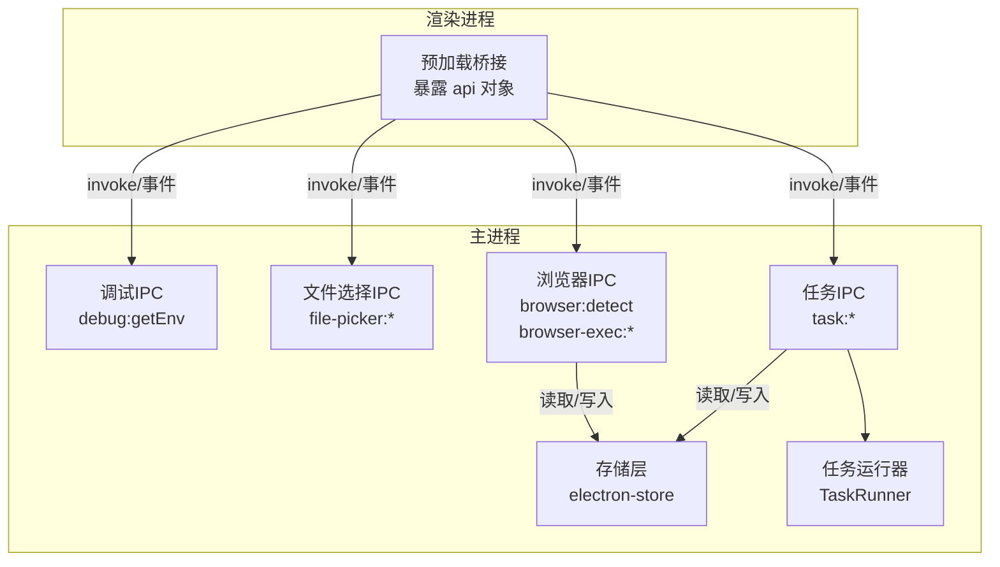
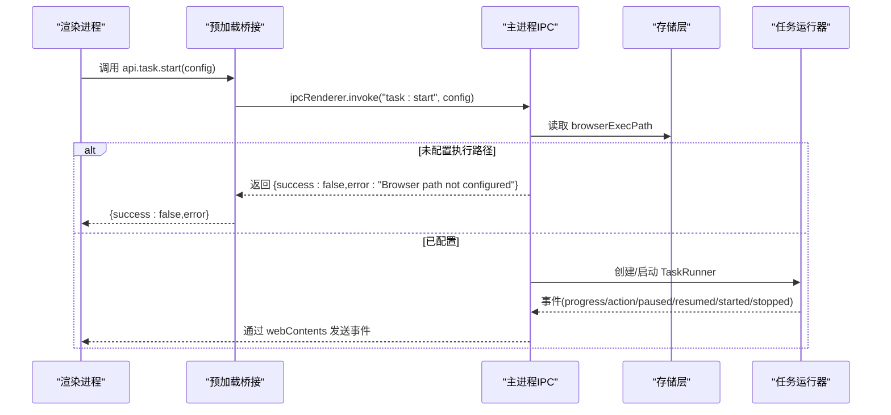
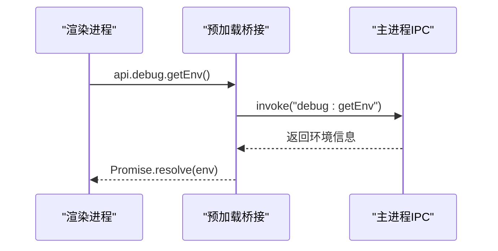
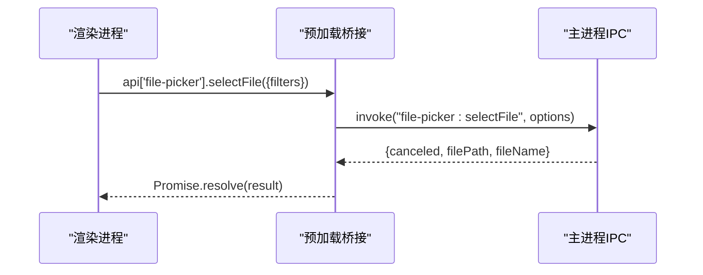
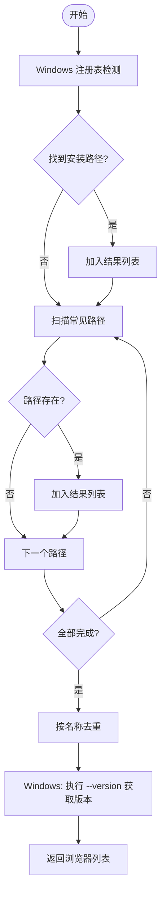
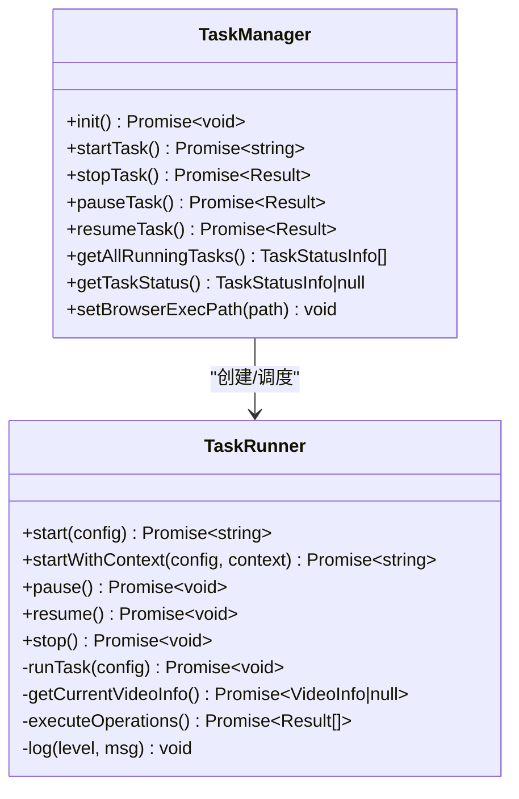
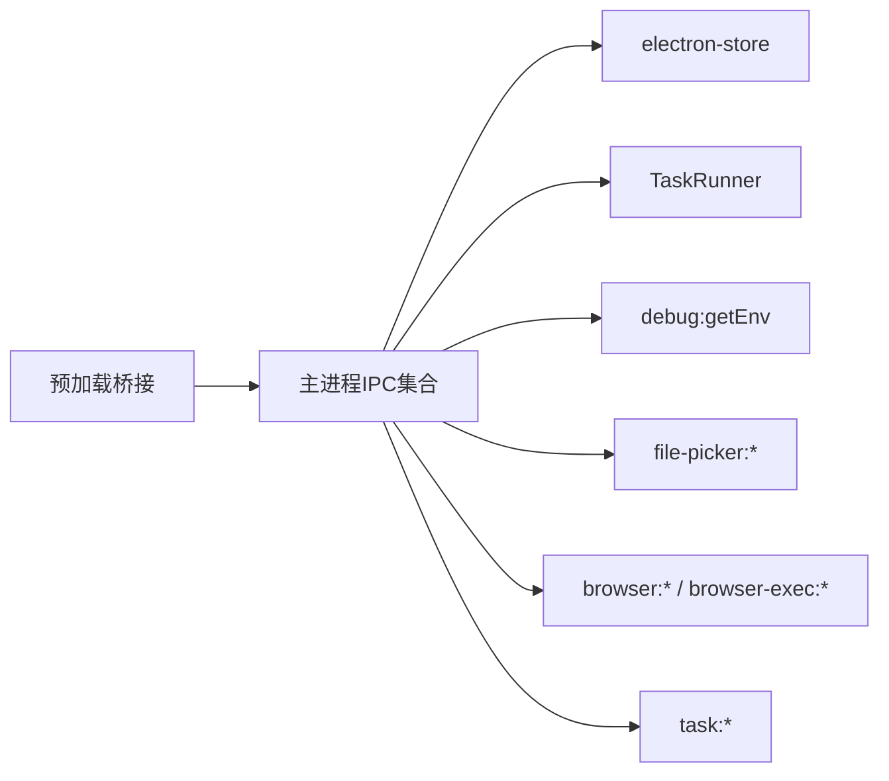

# 工具类API

<cite>
**本文引用的文件**
- [src/main/ipc/debug.ts](file://src/main/ipc/debug.ts)
- [src/main/ipc/file-picker.ts](file://src/main/ipc/file-picker.ts)
- [src/main/ipc/browser-detect.ts](file://src/main/ipc/browser-detect.ts)
- [src/main/ipc/browser-exec.ts](file://src/main/ipc/browser-exec.ts)
- [src/main/utils/storage.ts](file://src/main/utils/storage.ts)
- [src/preload/index.ts](file://src/preload/index.ts)
- [src/main/ipc/task.ts](file://src/main/ipc/task.ts)
- [src/main/service/task-runner.ts](file://src/main/service/task-runner.ts)
- [src/shared/platform.ts](file://src/shared/platform.ts)
- [src/shared/task.ts](file://src/shared/task.ts)
- [src/main/ipc/account.ts](file://src/main/ipc/account.ts)
- [src/main/ipc/task-crud.ts](file://src/main/ipc/task-crud.ts)
- [src/main/index.ts](file://src/main/index.ts)
- [package.json](file://package.json)
</cite>

## 目录
1. [简介](#简介)
2. [项目结构](#项目结构)
3. [核心组件](#核心组件)
4. [架构总览](#架构总览)
5. [详细组件分析](#详细组件分析)
6. [依赖关系分析](#依赖关系分析)
7. [性能与内存管理](#性能与内存管理)
8. [故障排查指南](#故障排查指南)
9. [结论](#结论)
10. [附录：使用示例与最佳实践](#附录使用示例与最佳实践)

## 简介
本文件为工具类IPC API的完整技术文档，覆盖调试接口（日志输出、性能监控、错误追踪）、文件选择器API（文件/目录选择、过滤器、路径处理）、浏览器检测与执行路径配置（支持的浏览器类型、版本检测、路径验证）、系统信息查询与环境检测、错误处理与异常捕获、以及性能优化与资源清理的最佳实践。文档同时提供关键流程的时序图与类图，帮助开发者快速理解与集成。

## 项目结构
- 主进程IPC层：集中注册各类IPC通道，负责与渲染进程交互、读写存储、调用服务层。
- 预加载桥接层：通过contextBridge暴露受控的api对象给渲染进程，统一封装invoke与事件监听。
- 服务层：如任务运行器、平台适配器等，实现具体业务逻辑与浏览器自动化。
- 共享模型：平台常量、任务定义、设置结构等，确保主/渲染/共享层一致。

图表来源
- [src/preload/index.ts:14-235](file://src/preload/index.ts#L14-L235)
- [src/main/ipc/debug.ts:3-12](file://src/main/ipc/debug.ts#L3-L12)
- [src/main/ipc/file-picker.ts:4-37](file://src/main/ipc/file-picker.ts#L4-L37)
- [src/main/ipc/browser-detect.ts:105-118](file://src/main/ipc/browser-detect.ts#L105-L118)
- [src/main/ipc/browser-exec.ts:4-13](file://src/main/ipc/browser-exec.ts#L4-L13)
- [src/main/ipc/task.ts:81-242](file://src/main/ipc/task.ts#L81-L242)
- [src/main/utils/storage.ts:16-53](file://src/main/utils/storage.ts#L16-L53)

章节来源
- [src/preload/index.ts:14-235](file://src/preload/index.ts#L14-L235)
- [src/main/index.ts:54-84](file://src/main/index.ts#L54-L84)

## 核心组件
- 调试与环境信息
  - 渲染端：api.debug.getEnv()
  - 主进程：ipcMain.handle('debug:getEnv') 返回 platform/arch/versions/electron
- 文件选择器
  - 渲染端：api['file-picker'].selectFile(options?)、api['file-picker'].selectDirectory()
  - 主进程：基于dialog.showOpenDialog，支持filters、返回filePath/dirPath及文件名
- 浏览器检测与执行路径
  - 浏览器检测：api.browser.detect() -> [{path,name,version}]
  - 执行路径存取：api['browser-exec'].get()/set(path)
  - 存储键：browserExecPath
- 任务系统与进度事件
  - 渲染端：api.task.*（start/stop/pause/resume/status/队列/并发/定时）
  - 主进程：taskIPC转发事件到各窗口webContents
  - 运行器：TaskRunner负责实际自动化流程与日志输出
- 平台与任务模型
  - 平台常量与选择器：Platform/TaskType/PlatformConfig
  - 任务定义：Task/TaskTemplate/TaskSchedule

章节来源
- [src/main/ipc/debug.ts:3-12](file://src/main/ipc/debug.ts#L3-L12)
- [src/main/ipc/file-picker.ts:4-37](file://src/main/ipc/file-picker.ts#L4-L37)
- [src/main/ipc/browser-detect.ts:105-118](file://src/main/ipc/browser-detect.ts#L105-L118)
- [src/main/ipc/browser-exec.ts:4-13](file://src/main/ipc/browser-exec.ts#L4-L13)
- [src/main/ipc/task.ts:81-242](file://src/main/ipc/task.ts#L81-L242)
- [src/main/service/task-runner.ts:26-120](file://src/main/service/task-runner.ts#L26-L120)
- [src/shared/platform.ts:1-260](file://src/shared/platform.ts#L1-L260)
- [src/shared/task.ts:12-62](file://src/shared/task.ts#L12-L62)

## 架构总览
下图展示从渲染进程发起调用到主进程处理、存储读写与服务执行的整体流程。

图表来源
- [src/preload/index.ts:138-162](file://src/preload/index.ts#L138-L162)
- [src/main/ipc/task.ts:81-134](file://src/main/ipc/task.ts#L81-L134)
- [src/main/service/task-runner.ts:61-120](file://src/main/service/task-runner.ts#L61-L120)
- [src/main/utils/storage.ts:16-31](file://src/main/utils/storage.ts#L16-L31)

## 详细组件分析

### 调试与环境信息（debug:getEnv）
- 功能
  - 获取当前运行平台、CPU架构、Node/Electron版本等环境信息
- 接口
  - 渲染端：api.debug.getEnv() -> Promise<unknown>
  - 主进程：ipcMain.handle('debug:getEnv') -> {platform, arch, versions, electron}
- 典型用途
  - 日志上报、兼容性诊断、用户反馈收集

图表来源
- [src/preload/index.ts:229-231](file://src/preload/index.ts#L229-L231)
- [src/main/ipc/debug.ts:3-12](file://src/main/ipc/debug.ts#L3-L12)

章节来源
- [src/main/ipc/debug.ts:3-12](file://src/main/ipc/debug.ts#L3-L12)
- [src/preload/index.ts:229-231](file://src/preload/index.ts#L229-L231)

### 文件选择器API（file-picker）
- 支持能力
  - 单文件选择：带filters过滤器（默认“All Files”），返回filePath与fileName
  - 目录选择：返回dirPath与dirName
  - 取消行为：canceled=true时返回null路径
- 接口
  - 渲染端：api['file-picker'].selectFile(options?) -> Promise<{canceled, filePath?, fileName?}>
  - 渲染端：api['file-picker'].selectDirectory() -> Promise<{canceled, dirPath?, dirName?}>
  - 主进程：ipcMain.handle('file-picker:selectFile'/'selectDirectory')
- 注意事项
  - filters为可选参数；若未提供则默认显示所有文件
  - 返回的路径为绝对路径

图表来源
- [src/preload/index.ts:198-201](file://src/preload/index.ts#L198-L201)
- [src/main/ipc/file-picker.ts:4-20](file://src/main/ipc/file-picker.ts#L4-L20)

章节来源
- [src/main/ipc/file-picker.ts:4-37](file://src/main/ipc/file-picker.ts#L4-L37)
- [src/preload/index.ts:198-201](file://src/preload/index.ts#L198-L201)

### 浏览器检测与执行路径配置
- 浏览器检测（browser:detect）
  - 支持平台：Windows/macOS/Linux
  - 检测策略：
    - Windows：从注册表HKLM\...App Paths读取安装路径
    - 通用路径扫描：Program Files/Applications常见位置
  - 版本检测：仅Windows支持通过命令行获取版本字符串，其他平台返回“unknown”
  - 去重：按浏览器名称去重，避免重复项
- 执行路径配置（browser-exec:get/set）
  - 存储键：browserExecPath
  - 渲染端：api['browser-exec'].get() -> Promise<string|null>
  - 渲染端：api['browser-exec'].set(path) -> Promise<{success:boolean}>

图表来源
- [src/main/ipc/browser-detect.ts:47-103](file://src/main/ipc/browser-detect.ts#L47-L103)
- [src/main/ipc/browser-detect.ts:105-118](file://src/main/ipc/browser-detect.ts#L105-L118)

章节来源
- [src/main/ipc/browser-detect.ts:105-118](file://src/main/ipc/browser-detect.ts#L105-L118)
- [src/main/ipc/browser-exec.ts:4-13](file://src/main/ipc/browser-exec.ts#L4-L13)
- [src/main/utils/storage.ts:33-44](file://src/main/utils/storage.ts#L33-L44)

### 任务系统与事件流
- 渲染端API（部分）
  - 开始/停止/暂停/恢复：api.task.start/stop/pause/resume
  - 状态查询：api.task.status/getStatus/listRunning
  - 队列与并发：api.task.queueSize/removeFromQueue/setConcurrency/getConcurrency
  - 定时任务：api.task.schedule/cancelSchedule/getSchedules
  - 进度与动作事件：onProgress/onAction/onPaused/onResumed/onStarted/onStopped/onQueued/onScheduleTriggered
- 主进程处理
  - 初始化TaskManager并转发事件到所有窗口
  - 读取browserExecPath并校验
- 运行器职责
  - 启动Chromium、注入storageState、导航至平台首页
  - 监听feed响应缓存视频数据
  - 执行规则匹配、AI生成评论、执行操作（点赞/收藏/关注/评论）
  - 输出结构化日志并通过事件上报

图表来源
- [src/main/service/task-runner.ts:26-120](file://src/main/service/task-runner.ts#L26-L120)
- [src/main/ipc/task.ts:13-79](file://src/main/ipc/task.ts#L13-L79)

章节来源
- [src/main/ipc/task.ts:81-242](file://src/main/ipc/task.ts#L81-L242)
- [src/main/service/task-runner.ts:26-120](file://src/main/service/task-runner.ts#L26-L120)
- [src/shared/platform.ts:1-260](file://src/shared/platform.ts#L1-L260)
- [src/shared/task.ts:12-62](file://src/shared/task.ts#L12-L62)

### 平台与账号管理
- 平台常量与配置
  - 平台枚举：douyin/kuaishou/xiaohongshu/wechat
  - 任务类型：comment/like/collect/follow/watch/combo
  - 选择器与API端点：不同平台的DOM选择器与GraphQL端点
- 账号管理
  - 列表/新增/更新/删除/设默认/获取默认/按平台筛选/活跃账号
  - 状态检查：单个与批量检查登录状态并持久化

章节来源
- [src/shared/platform.ts:1-260](file://src/shared/platform.ts#L1-L260)
- [src/main/ipc/account.ts:32-127](file://src/main/ipc/account.ts#L32-L127)

### 任务模板与CRUD
- 任务模板：保存/删除/列出
- 任务CRUD：创建/更新/删除/复制/按账户/平台查询

章节来源
- [src/main/ipc/task-crud.ts:8-108](file://src/main/ipc/task-crud.ts#L8-L108)
- [src/shared/task.ts:24-62](file://src/shared/task.ts#L24-L62)

## 依赖关系分析
- 预加载桥接统一导出所有API通道，渲染端通过api命名空间访问
- 主进程集中注册所有IPC处理器，并在应用启动时统一初始化
- 存储层采用electron-store，键空间明确，便于调试与迁移
- 任务系统通过TaskManager单例化管理，TaskRunner负责具体自动化流程

图表来源
- [src/preload/index.ts:14-235](file://src/preload/index.ts#L14-L235)
- [src/main/index.ts:54-84](file://src/main/index.ts#L54-L84)
- [src/main/utils/storage.ts:16-53](file://src/main/utils/storage.ts#L16-L53)

章节来源
- [src/preload/index.ts:14-235](file://src/preload/index.ts#L14-L235)
- [src/main/index.ts:54-84](file://src/main/index.ts#L54-L84)

## 性能与内存管理
- 浏览器实例与上下文
  - TaskRunner支持两种启动模式：独立浏览器实例或共享BrowserContext
  - 任务结束时释放page/context/browser，避免句柄泄漏
- 事件与日志
  - 使用electron-log输出结构化日志，避免频繁I/O阻塞
  - 通过事件驱动进度上报，降低轮询成本
- 资源清理
  - 任务停止/完成时主动关闭页面与上下文，必要时关闭浏览器
  - 存储状态在上下文关闭前持久化，保证会话一致性
- 并发与队列
  - 通过TaskManager控制最大并发数，避免资源争用
  - 提供队列大小查询与移除接口，便于动态调节

章节来源
- [src/main/service/task-runner.ts:220-241](file://src/main/service/task-runner.ts#L220-L241)
- [src/main/ipc/task.ts:222-231](file://src/main/ipc/task.ts#L222-L231)

## 故障排查指南
- 无法启动任务
  - 检查浏览器执行路径是否配置：api['browser-exec'].get() 应返回非空
  - 若返回null，先调用 api['browser-exec'].set(path) 写入有效路径
- 浏览器检测不到
  - 在Windows上确认注册表项 HKLM\...\App Paths\chrome.exe/msedge.exe 是否存在
  - 确认常见路径是否存在对应可执行文件
- 日志与调试
  - 使用 api.debug.getEnv() 获取平台/版本信息，便于定位兼容性问题
  - 渲染端可通过事件监听 api.task.onProgress/api.task.onAction 等观察执行过程
- 存储与配置
  - 存储键空间参见 StorageKey 枚举，确保读写键一致
  - 如需重置配置，可清空对应键或重建Store实例

章节来源
- [src/main/ipc/browser-exec.ts:4-13](file://src/main/ipc/browser-exec.ts#L4-L13)
- [src/main/ipc/browser-detect.ts:47-103](file://src/main/ipc/browser-detect.ts#L47-L103)
- [src/main/ipc/debug.ts:3-12](file://src/main/ipc/debug.ts#L3-L12)
- [src/main/utils/storage.ts:33-44](file://src/main/utils/storage.ts#L33-L44)

## 结论
本工具类IPC API以清晰的命名空间与严格的职责划分，提供了从系统环境检测、文件选择、浏览器配置到任务自动化与事件驱动的完整能力。通过electron-store与electron-log的配合，既保证了配置持久化，也便于问题定位与性能观测。建议在生产环境中结合事件监听与日志策略，持续监控任务状态与资源占用，确保稳定性与可维护性。

## 附录：使用示例与最佳实践
- 获取系统环境信息
  - 渲染端调用：await api.debug.getEnv()
  - 用途：上报、诊断、兼容性判断
- 选择文件/目录
  - 选择文件：await api['file-picker'].selectFile({ filters: [{ name:'图片', extensions:['jpg','png'] }] })
  - 选择目录：await api['file-picker'].selectDirectory()
  - 处理取消：canceled为true时提示用户重新选择
- 设置浏览器执行路径
  - 检测可用浏览器：await api.browser.detect()
  - 选择后写入：await api['browser-exec'].set(chosen.path)
  - 启动任务前校验：若 api['browser-exec'].get() 为空则提示用户配置
- 启动任务并监听进度
  - 启动：const { success, taskId, error } = await api.task.start({ settings, accountId, taskType })
  - 监听：api.task.onProgress((data)=>console.log(data.message))
- 并发与队列
  - 设置并发：await api.task.setConcurrency(max)
  - 查询队列：await api.task.queueSize()
- 最佳实践
  - 统一通过预加载桥接访问API，避免直接使用ipcRenderer
  - 任务结束后及时释放资源，避免内存泄漏
  - 将关键配置（如browserExecPath）持久化，减少重复配置
  - 使用事件驱动而非轮询，降低CPU占用

章节来源
- [src/preload/index.ts:14-235](file://src/preload/index.ts#L14-L235)
- [src/main/ipc/file-picker.ts:4-37](file://src/main/ipc/file-picker.ts#L4-L37)
- [src/main/ipc/browser-detect.ts:105-118](file://src/main/ipc/browser-detect.ts#L105-L118)
- [src/main/ipc/browser-exec.ts:4-13](file://src/main/ipc/browser-exec.ts#L4-L13)
- [src/main/ipc/task.ts:81-242](file://src/main/ipc/task.ts#L81-L242)
- [src/main/service/task-runner.ts:220-241](file://src/main/service/task-runner.ts#L220-L241)