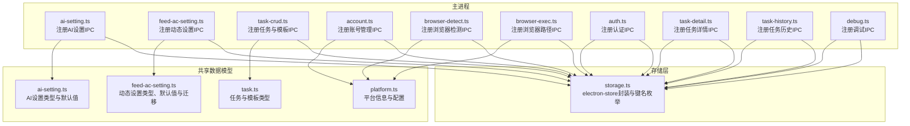
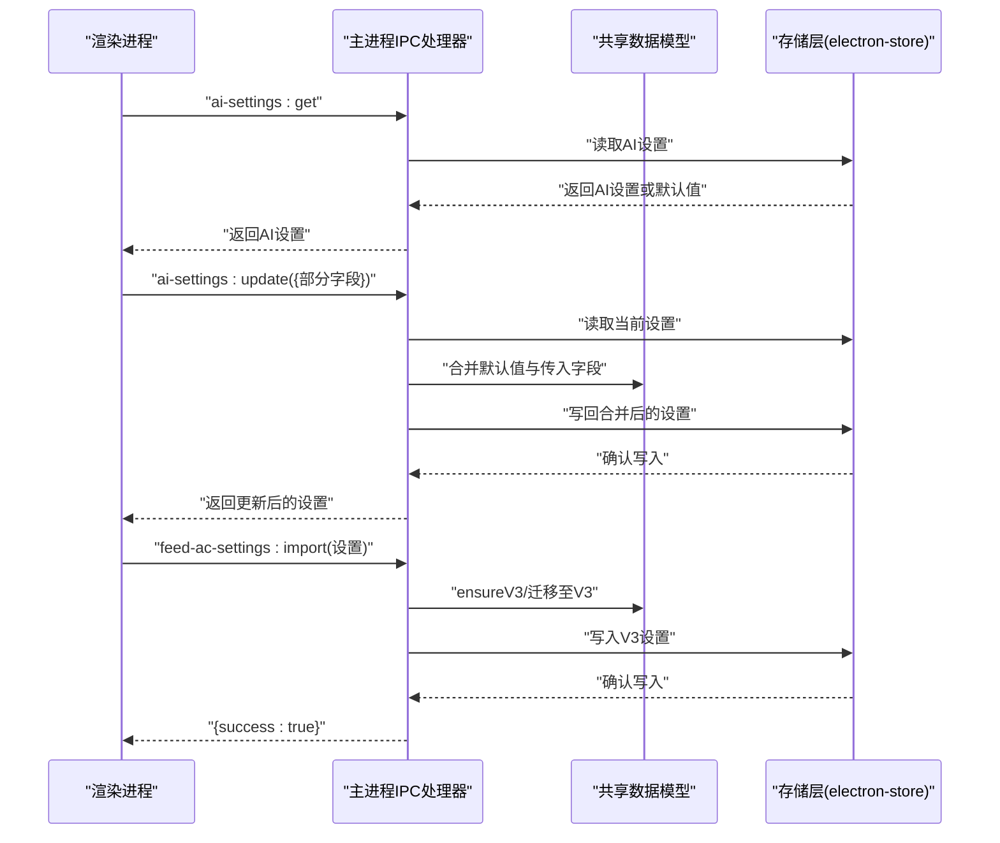
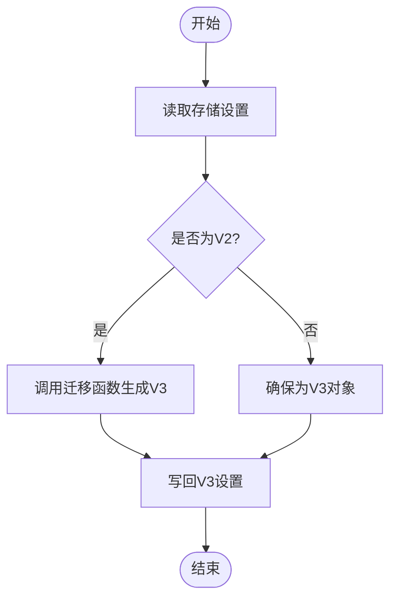
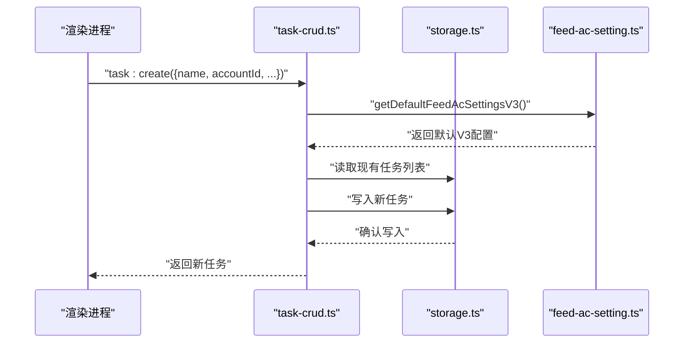
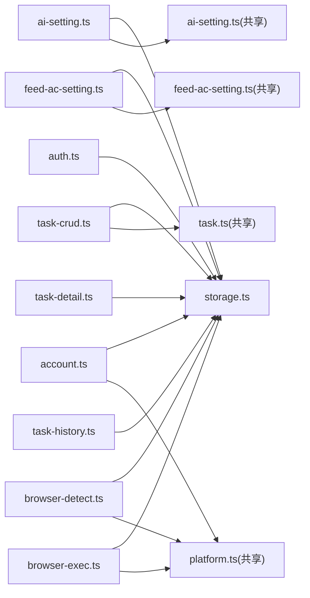

# 设置管理API

<cite>
**本文档引用的文件**
- [src/main/ipc/ai-setting.ts](file://src/main/ipc/ai-setting.ts)
- [src/shared/ai-setting.ts](file://src/shared/ai-setting.ts)
- [src/main/ipc/feed-ac-setting.ts](file://src/main/ipc/feed-ac-setting.ts)
- [src/shared/feed-ac-setting.ts](file://src/shared/feed-ac-setting.ts)
- [src/main/ipc/task-crud.ts](file://src/main/ipc/task-crud.ts)
- [src/shared/task.ts](file://src/shared/task.ts)
- [src/main/utils/storage.ts](file://src/main/utils/storage.ts)
- [src/main/ipc/account.ts](file://src/main/ipc/account.ts)
- [src/shared/platform.ts](file://src/shared/platform.ts)
- [src/main/ipc/browser-detect.ts](file://src/main/ipc/browser-detect.ts)
- [src/main/ipc/browser-exec.ts](file://src/main/ipc/browser-exec.ts)
- [src/main/ipc/auth.ts](file://src/main/ipc/auth.ts)
- [src/main/ipc/task-detail.ts](file://src/main/ipc/task-detail.ts)
- [src/main/ipc/task-history.ts](file://src/main/ipc/task-history.ts)
- [src/main/ipc/debug.ts](file://src/main/ipc/debug.ts)
</cite>

## 目录
1. [简介](#简介)
2. [项目结构](#项目结构)
3. [核心组件](#核心组件)
4. [架构总览](#架构总览)
5. [详细组件分析](#详细组件分析)
6. [依赖关系分析](#依赖关系分析)
7. [性能考虑](#性能考虑)
8. [故障排除指南](#故障排除指南)
9. [结论](#结论)
10. [附录](#附录)

## 简介
本文件系统化梳理设置管理IPC API，覆盖全局应用设置、平台特定配置与AI服务配置的管理接口；明确设置项的数据结构、默认值与验证规则；记录设置的增删改查、配置迁移与版本兼容策略；包含AI服务配置（OpenAI、通义千问等）的API接口、密钥管理、请求参数与调用限制；涵盖筛选规则设置、任务模板配置与系统行为控制；提供设置备份恢复、批量配置与配置验证的API说明，并给出完整使用示例与故障排除指南。

## 项目结构
设置管理相关模块主要分布在以下位置：
- 主进程IPC层：负责注册各类设置相关的IPC处理器，统一通过存储层读写配置
- 共享数据模型层：定义设置项的数据结构、默认值与版本迁移逻辑
- 存储层：基于electron-store封装键值存储，集中管理各设置域



图表来源
- [src/main/ipc/ai-setting.ts:1-27](file://src/main/ipc/ai-setting.ts#L1-L27)
- [src/main/ipc/feed-ac-setting.ts:1-44](file://src/main/ipc/feed-ac-setting.ts#L1-L44)
- [src/main/ipc/task-crud.ts:1-108](file://src/main/ipc/task-crud.ts#L1-L108)
- [src/main/ipc/account.ts:1-128](file://src/main/ipc/account.ts#L1-L128)
- [src/main/ipc/browser-detect.ts:1-118](file://src/main/ipc/browser-detect.ts#L1-L118)
- [src/main/ipc/browser-exec.ts:1-13](file://src/main/ipc/browser-exec.ts#L1-L13)
- [src/main/ipc/auth.ts:1-23](file://src/main/ipc/auth.ts#L1-L23)
- [src/main/ipc/task-detail.ts:1-39](file://src/main/ipc/task-detail.ts#L1-L39)
- [src/main/ipc/task-history.ts:1-45](file://src/main/ipc/task-history.ts#L1-L45)
- [src/main/ipc/debug.ts:1-12](file://src/main/ipc/debug.ts#L1-L12)
- [src/shared/ai-setting.ts:1-29](file://src/shared/ai-setting.ts#L1-L29)
- [src/shared/feed-ac-setting.ts:1-179](file://src/shared/feed-ac-setting.ts#L1-L179)
- [src/shared/task.ts:1-62](file://src/shared/task.ts#L1-L62)
- [src/shared/platform.ts:1-260](file://src/shared/platform.ts#L1-L260)
- [src/main/utils/storage.ts:1-53](file://src/main/utils/storage.ts#L1-L53)

章节来源
- [src/main/ipc/ai-setting.ts:1-27](file://src/main/ipc/ai-setting.ts#L1-L27)
- [src/main/ipc/feed-ac-setting.ts:1-44](file://src/main/ipc/feed-ac-setting.ts#L1-L44)
- [src/main/ipc/task-crud.ts:1-108](file://src/main/ipc/task-crud.ts#L1-L108)
- [src/main/ipc/account.ts:1-128](file://src/main/ipc/account.ts#L1-L128)
- [src/main/ipc/browser-detect.ts:1-118](file://src/main/ipc/browser-detect.ts#L1-L118)
- [src/main/ipc/browser-exec.ts:1-13](file://src/main/ipc/browser-exec.ts#L1-L13)
- [src/main/ipc/auth.ts:1-23](file://src/main/ipc/auth.ts#L1-L23)
- [src/main/ipc/task-detail.ts:1-39](file://src/main/ipc/task-detail.ts#L1-L39)
- [src/main/ipc/task-history.ts:1-45](file://src/main/ipc/task-history.ts#L1-L45)
- [src/main/ipc/debug.ts:1-12](file://src/main/ipc/debug.ts#L1-L12)
- [src/shared/ai-setting.ts:1-29](file://src/shared/ai-setting.ts#L1-L29)
- [src/shared/feed-ac-setting.ts:1-179](file://src/shared/feed-ac-setting.ts#L1-L179)
- [src/shared/task.ts:1-62](file://src/shared/task.ts#L1-L62)
- [src/shared/platform.ts:1-260](file://src/shared/platform.ts#L1-L260)
- [src/main/utils/storage.ts:1-53](file://src/main/utils/storage.ts#L1-L53)

## 核心组件
- AI服务设置IPC：提供获取、更新、重置与测试AI设置的接口，支持多平台密钥与模型选择
- 动态设置IPC：提供获取、更新、重置、导出、导入的接口，内置版本兼容与迁移逻辑
- 任务与模板IPC：提供任务的增删改查、复制、模板保存删除等接口
- 账号管理IPC：提供账号列表、新增、更新、删除、设默认、查询、状态检查等接口
- 浏览器检测与执行IPC：提供浏览器自动检测与执行路径设置
- 认证IPC：提供登录状态判断、登录、登出、获取认证信息
- 任务详情与历史IPC：提供任务详情记录、视频记录追加、状态更新与历史记录的CRUD
- 调试IPC：提供运行环境信息查询

章节来源
- [src/main/ipc/ai-setting.ts:5-27](file://src/main/ipc/ai-setting.ts#L5-L27)
- [src/main/ipc/feed-ac-setting.ts:16-44](file://src/main/ipc/feed-ac-setting.ts#L16-L44)
- [src/main/ipc/task-crud.ts:8-108](file://src/main/ipc/task-crud.ts#L8-L108)
- [src/main/ipc/account.ts:32-127](file://src/main/ipc/account.ts#L32-L127)
- [src/main/ipc/browser-detect.ts:105-117](file://src/main/ipc/browser-detect.ts#L105-L117)
- [src/main/ipc/browser-exec.ts:4-13](file://src/main/ipc/browser-exec.ts#L4-L13)
- [src/main/ipc/auth.ts:4-23](file://src/main/ipc/auth.ts#L4-L23)
- [src/main/ipc/task-detail.ts:5-39](file://src/main/ipc/task-detail.ts#L5-L39)
- [src/main/ipc/task-history.ts:5-45](file://src/main/ipc/task-history.ts#L5-L45)
- [src/main/ipc/debug.ts:3-12](file://src/main/ipc/debug.ts#L3-L12)

## 架构总览
设置管理采用“IPC处理器 + 共享数据模型 + 存储层”的分层架构。IPC处理器负责暴露统一的RPC接口，共享数据模型定义数据结构与默认值，存储层负责持久化与版本兼容。



图表来源
- [src/main/ipc/ai-setting.ts:6-16](file://src/main/ipc/ai-setting.ts#L6-L16)
- [src/main/ipc/feed-ac-setting.ts:17-43](file://src/main/ipc/feed-ac-setting.ts#L17-L43)
- [src/shared/ai-setting.ts:10-22](file://src/shared/ai-setting.ts#L10-L22)
- [src/shared/feed-ac-setting.ts:115-174](file://src/shared/feed-ac-setting.ts#L115-L174)
- [src/main/utils/storage.ts:16-29](file://src/main/utils/storage.ts#L16-L29)

## 详细组件分析

### AI服务设置管理
- 数据结构与默认值
  - 平台枚举：支持通义千问、阿里百炼、OpenAI、DeepSeek
  - 密钥存储：按平台分别存储密钥
  - 模型与温度：支持模型名称与采样温度
  - 默认值：平台默认为DeepSeek，模型默认为对应平台推荐模型，温度默认为0.9
- 接口规范
  - 获取：ai-settings:get → 返回当前设置或默认值
  - 更新：ai-settings:update({部分字段}) → 合并后写回
  - 重置：ai-settings:reset → 写入默认值
  - 测试：ai-settings:test({platform, apiKey, model}) → 占位返回（待实现）
- 验证规则
  - 平台必须在允许集合内
  - 密钥为空字符串时视为未配置
  - 模型需属于平台可用模型列表
  - 温度应在合理范围（建议0~1）

```mermaid
classDiagram
class AISettings {
+platform : AIPlatform
+apiKeys : Record<AIPlatform, string>
+model : string
+temperature : number
}
class AIPlatform {
<<enum>>
"volcengine"
"bailian"
"openai"
"deepseek"
}
class getDefaultAISettings {
+invoke() AISettings
}
class PLATFORM_MODELS {
+map : Record<AIPlatform, string[]>
}
AISettings --> AIPlatform : "使用"
getDefaultAISettings --> AISettings : "生成默认值"
PLATFORM_MODELS --> AIPlatform : "映射模型列表"
```

图表来源
- [src/shared/ai-setting.ts:3-8](file://src/shared/ai-setting.ts#L3-L8)
- [src/shared/ai-setting.ts:10-22](file://src/shared/ai-setting.ts#L10-L22)
- [src/shared/ai-setting.ts:24-29](file://src/shared/ai-setting.ts#L24-L29)

章节来源
- [src/shared/ai-setting.ts:1-29](file://src/shared/ai-setting.ts#L1-L29)
- [src/main/ipc/ai-setting.ts:5-27](file://src/main/ipc/ai-setting.ts#L5-L27)

### 动态设置（筛选规则与系统行为）
- 数据结构与默认值
  - 版本：V2/V3，V3为当前版本
  - 任务类型：comment/like/collect/follow/watch/combo
  - 规则组：支持AI/手动两类，可嵌套，支持与/或关系
  - 屏蔽词：按作者与内容屏蔽
  - 观看模拟：评论前观看时长范围
  - 最大数量与概率：每类操作的上限与触发概率
  - 视频跳过策略：广告、直播、图集跳过；连续跳过阈值；切换等待时间
  - AI评论：参考热门评论数、风格、最大长度
  - 视频分类：白名单/黑名单、预定义分类、自定义关键词、是否使用AI
- 接口规范
  - 获取：feed-ac-settings:get → 返回V3设置（自动迁移）
  - 更新：feed-ac-settings:update({部分字段}) → 合并后写回
  - 重置：feed-ac-settings:reset → 写入默认V3
  - 导出：feed-ac-settings:export → 返回当前V3设置
  - 导入：feed-ac-settings:import(V2/V3) → 自动迁移并写回
- 版本兼容与迁移
  - V2到V3：自动补全缺失字段，将旧规则组中的评论文本迁移到新操作配置中，保留AI提示与开关



图表来源
- [src/main/ipc/feed-ac-setting.ts:10-14](file://src/main/ipc/feed-ac-setting.ts#L10-L14)
- [src/shared/feed-ac-setting.ts:148-174](file://src/shared/feed-ac-setting.ts#L148-L174)

章节来源
- [src/shared/feed-ac-setting.ts:22-97](file://src/shared/feed-ac-setting.ts#L22-L97)
- [src/shared/feed-ac-setting.ts:115-174](file://src/shared/feed-ac-setting.ts#L115-L174)
- [src/main/ipc/feed-ac-setting.ts:16-44](file://src/main/ipc/feed-ac-setting.ts#L16-L44)

### 任务与任务模板管理
- 数据结构
  - 任务：包含任务ID、名称、账号ID、平台、任务类型、配置、定时计划、时间戳
  - 任务模板：包含模板ID、名称、平台、任务类型、配置、时间戳
  - 组合任务：由多个子任务类型组成，去除operations字段以避免循环引用
- 接口规范
  - 任务：getAll/getById/getByAccount/getByPlatform/create/update/delete/duplicate
  - 模板：getAll/save/delete
- 默认行为
  - 创建任务时，若未指定配置，则使用动态设置V3默认值
  - 复制任务时，生成新的任务ID并追加副本后缀



图表来源
- [src/main/ipc/task-crud.ts:29-44](file://src/main/ipc/task-crud.ts#L29-L44)
- [src/shared/feed-ac-setting.ts:115-146](file://src/shared/feed-ac-setting.ts#L115-L146)

章节来源
- [src/shared/task.ts:12-31](file://src/shared/task.ts#L12-L31)
- [src/shared/task.ts:42-62](file://src/shared/task.ts#L42-L62)
- [src/main/ipc/task-crud.ts:8-108](file://src/main/ipc/task-crud.ts#L8-L108)

### 账号管理
- 数据结构
  - 账号：包含ID、名称、平台、头像、登录状态、过期时间、存储状态、Cookie等
- 接口规范
  - 列表、新增、更新、删除、设默认、查询、按平台查询、活跃账号查询
  - 单个账号状态检查与批量检查
- 默认行为
  - 新增账号时自动分配ID与创建时间，首次添加账号默认为默认账号
  - 删除账号后如存在其他账号则自动设置其中一个为默认

章节来源
- [src/main/ipc/account.ts:32-127](file://src/main/ipc/account.ts#L32-L127)

### 浏览器检测与执行路径
- 浏览器检测
  - 支持Windows注册表、常见路径扫描，返回浏览器名称、路径、版本
- 浏览器执行路径
  - 获取与设置浏览器可执行路径，用于自动化流程

章节来源
- [src/main/ipc/browser-detect.ts:105-117](file://src/main/ipc/browser-detect.ts#L105-L117)
- [src/main/ipc/browser-exec.ts:4-13](file://src/main/ipc/browser-exec.ts#L4-L13)

### 认证管理
- 接口规范
  - hasAuth：判断是否存在认证信息
  - login：写入认证信息
  - logout：清除认证信息
  - getAuth：获取认证信息

章节来源
- [src/main/ipc/auth.ts:4-23](file://src/main/ipc/auth.ts#L4-L23)

### 任务详情与历史
- 任务详情
  - 获取详情、追加视频记录、更新状态（含结束时间）
- 任务历史
  - 获取全部、按ID获取、新增、更新、删除、清空

章节来源
- [src/main/ipc/task-detail.ts:5-39](file://src/main/ipc/task-detail.ts#L5-L39)
- [src/main/ipc/task-history.ts:5-45](file://src/main/ipc/task-history.ts#L5-L45)

### 调试信息
- 提供平台、架构、Electron版本等运行时信息

章节来源
- [src/main/ipc/debug.ts:3-12](file://src/main/ipc/debug.ts#L3-L12)

## 依赖关系分析
- IPC处理器依赖存储层进行读写
- 动态设置IPC依赖共享模型的默认值与迁移函数
- 任务IPC依赖动态设置默认值
- 平台配置在共享模型中定义，供渲染层UI与业务逻辑使用



图表来源
- [src/main/ipc/ai-setting.ts:1-27](file://src/main/ipc/ai-setting.ts#L1-L27)
- [src/main/ipc/feed-ac-setting.ts:1-44](file://src/main/ipc/feed-ac-setting.ts#L1-L44)
- [src/main/ipc/task-crud.ts:1-108](file://src/main/ipc/task-crud.ts#L1-L108)
- [src/main/ipc/account.ts:1-128](file://src/main/ipc/account.ts#L1-L128)
- [src/main/ipc/browser-detect.ts:1-118](file://src/main/ipc/browser-detect.ts#L1-L118)
- [src/main/ipc/browser-exec.ts:1-13](file://src/main/ipc/browser-exec.ts#L1-L13)
- [src/main/ipc/auth.ts:1-23](file://src/main/ipc/auth.ts#L1-L23)
- [src/main/ipc/task-detail.ts:1-39](file://src/main/ipc/task-detail.ts#L1-L39)
- [src/main/ipc/task-history.ts:1-45](file://src/main/ipc/task-history.ts#L1-L45)
- [src/shared/ai-setting.ts:1-29](file://src/shared/ai-setting.ts#L1-L29)
- [src/shared/feed-ac-setting.ts:1-179](file://src/shared/feed-ac-setting.ts#L1-L179)
- [src/shared/task.ts:1-62](file://src/shared/task.ts#L1-L62)
- [src/shared/platform.ts:1-260](file://src/shared/platform.ts#L1-L260)
- [src/main/utils/storage.ts:1-53](file://src/main/utils/storage.ts#L1-L53)

## 性能考虑
- 存储访问：所有设置读写均通过单例存储实例，避免重复初始化开销
- 合并策略：更新接口采用浅合并，减少序列化与IO次数
- 迁移成本：版本迁移仅在读取时触发，避免频繁写入
- 批量操作：建议在渲染层聚合多次更新后再调用IPC，降低IPC往返

## 故障排除指南
- AI设置测试接口占位
  - 现象：调用测试接口返回占位消息
  - 建议：在实现具体平台测试逻辑前，先确保密钥与模型配置正确
- 动态设置导入失败
  - 现象：导入V2设置后未生效
  - 排查：确认导入接口传入的是V2或V3对象；检查迁移函数是否被调用
- 任务创建配置异常
  - 现象：新建任务后行为不符合预期
  - 排查：确认默认配置是否正确生成；检查任务类型与平台是否匹配
- 账号状态不一致
  - 现象：界面显示与实际状态不符
  - 排查：调用状态检查接口刷新状态；确认账号存储字段是否更新
- 浏览器路径无效
  - 现象：自动化流程无法启动浏览器
  - 排查：重新检测浏览器；确认设置的路径存在且可执行

章节来源
- [src/main/ipc/ai-setting.ts:24-26](file://src/main/ipc/ai-setting.ts#L24-L26)
- [src/main/ipc/feed-ac-setting.ts:39-43](file://src/main/ipc/feed-ac-setting.ts#L39-L43)
- [src/main/ipc/account.ts:102-121](file://src/main/ipc/account.ts#L102-L121)

## 结论
本设置管理API体系以IPC为边界，结合共享数据模型与存储层，实现了对全局应用设置、平台特定配置与AI服务配置的统一管理。通过版本迁移与默认值策略，保证了配置的稳定性与兼容性；通过完善的CRUD与批量操作接口，满足了用户对配置管理的高频需求。建议在后续迭代中完善AI设置测试接口与配置校验逻辑，进一步提升用户体验与系统可靠性。

## 附录

### 使用示例（步骤说明）
- 获取AI设置
  - 调用 ai-settings:get，接收返回的设置对象或默认值
- 更新AI设置
  - 调用 ai-settings:update({平台/密钥/模型/温度的部分字段})，接收更新后的设置
- 导入动态设置
  - 调用 feed-ac-settings:import(V2/V3)，确认返回成功
- 创建任务
  - 调用 task:create({name, accountId, ...})，若未传配置则使用默认V3
- 保存任务模板
  - 调用 task-template:save({name, config, ...})，保存当前配置为模板
- 设置默认浏览器
  - 调用 browser-exec:set("浏览器可执行路径")
- 登录认证
  - 调用 auth:login({认证数据})，随后可通过 auth:hasAuth 与 auth:getAuth 使用

章节来源
- [src/main/ipc/ai-setting.ts:6-16](file://src/main/ipc/ai-setting.ts#L6-L16)
- [src/main/ipc/feed-ac-setting.ts:39-43](file://src/main/ipc/feed-ac-setting.ts#L39-L43)
- [src/main/ipc/task-crud.ts:29-44](file://src/main/ipc/task-crud.ts#L29-L44)
- [src/main/ipc/browser-exec.ts:9-12](file://src/main/ipc/browser-exec.ts#L9-L12)
- [src/main/ipc/auth.ts:10-12](file://src/main/ipc/auth.ts#L10-L12)