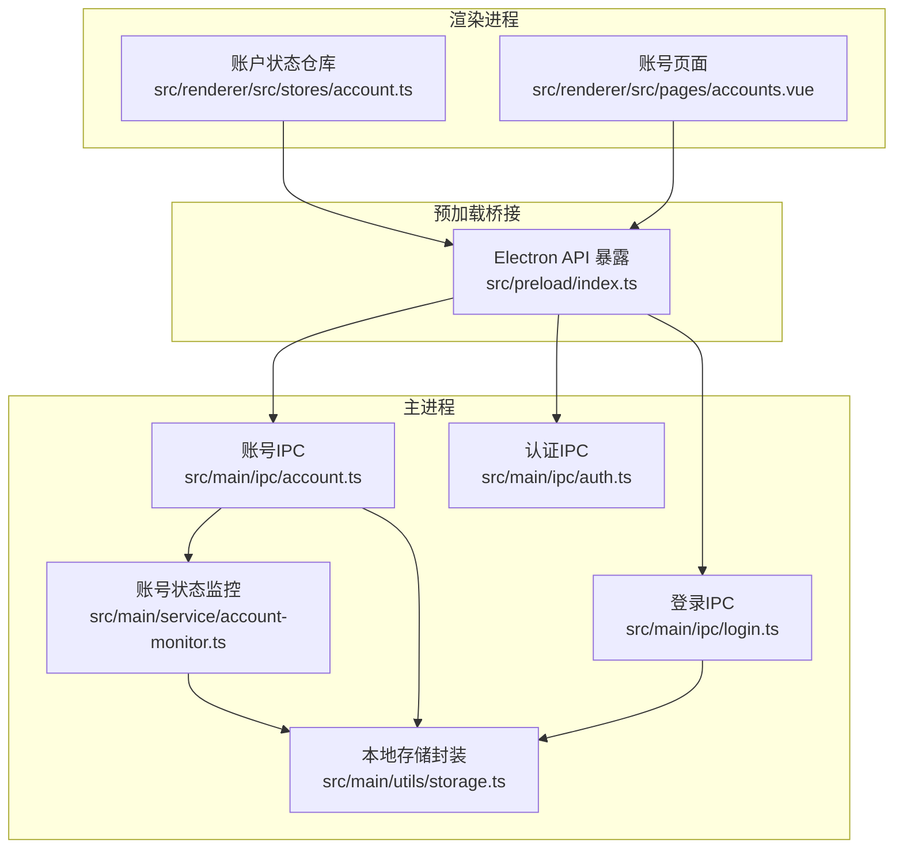
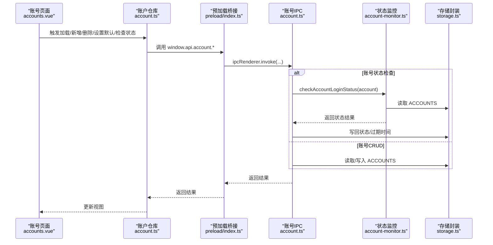
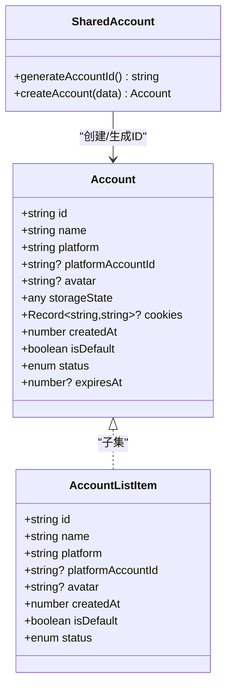
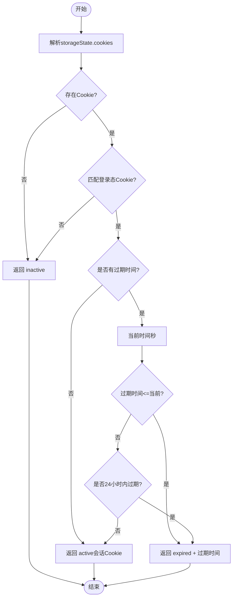
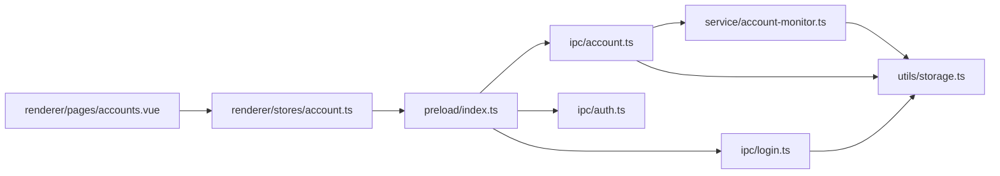

# 账号管理API

<cite>
**本文引用的文件**
- [src/main/ipc/account.ts](file://src/main/ipc/account.ts)
- [src/main/ipc/auth.ts](file://src/main/ipc/auth.ts)
- [src/main/ipc/login.ts](file://src/main/ipc/login.ts)
- [src/main/service/account-monitor.ts](file://src/main/service/account-monitor.ts)
- [src/preload/index.ts](file://src/preload/index.ts)
- [src/renderer/src/stores/account.ts](file://src/renderer/src/stores/account.ts)
- [src/renderer/src/pages/accounts.vue](file://src/renderer/src/pages/accounts.vue)
- [src/shared/account.ts](file://src/shared/account.ts)
- [src/shared/platform.ts](file://src/shared/platform.ts)
- [src/main/utils/storage.ts](file://src/main/utils/storage.ts)
</cite>

## 目录
1. [简介](#简介)
2. [项目结构](#项目结构)
3. [核心组件](#核心组件)
4. [架构总览](#架构总览)
5. [详细组件分析](#详细组件分析)
6. [依赖关系分析](#依赖关系分析)
7. [性能与可扩展性](#性能与可扩展性)
8. [故障排查指南](#故障排查指南)
9. [结论](#结论)
10. [附录：API参考与最佳实践](#附录api参考与最佳实践)

## 简介
本文件系统化梳理“账号管理IPC API”的设计与实现，覆盖账号CRUD、登录态检查、状态管理、以及与渲染层的交互方式。重点说明以下方面：
- 账号数据模型与存储键位
- IPC通道注册与调用约定
- 登录流程与状态提取
- 登录态检查策略与批量刷新
- 客户端调用示例与最佳实践

## 项目结构
围绕账号管理的关键文件分布如下：
- 主进程IPC与业务逻辑：src/main/ipc/account.ts、src/main/ipc/auth.ts、src/main/ipc/login.ts、src/main/service/account-monitor.ts
- 预加载桥接与类型声明：src/preload/index.ts
- 渲染层状态与UI：src/renderer/src/stores/account.ts、src/renderer/src/pages/accounts.vue
- 共享数据模型：src/shared/account.ts、src/shared/platform.ts
- 存储封装：src/main/utils/storage.ts

图表来源
- [src/renderer/src/stores/account.ts:1-128](file://src/renderer/src/stores/account.ts#L1-L128)
- [src/renderer/src/pages/accounts.vue:1-289](file://src/renderer/src/pages/accounts.vue#L1-L289)
- [src/preload/index.ts:130-234](file://src/preload/index.ts#L130-L234)
- [src/main/ipc/account.ts:32-127](file://src/main/ipc/account.ts#L32-L127)
- [src/main/ipc/auth.ts:4-23](file://src/main/ipc/auth.ts#L4-L23)
- [src/main/ipc/login.ts:85-193](file://src/main/ipc/login.ts#L85-L193)
- [src/main/service/account-monitor.ts:17-109](file://src/main/service/account-monitor.ts#L17-L109)
- [src/main/utils/storage.ts:16-53](file://src/main/utils/storage.ts#L16-L53)

章节来源
- [src/main/ipc/account.ts:32-127](file://src/main/ipc/account.ts#L32-L127)
- [src/main/ipc/auth.ts:4-23](file://src/main/ipc/auth.ts#L4-L23)
- [src/main/ipc/login.ts:85-193](file://src/main/ipc/login.ts#L85-L193)
- [src/main/service/account-monitor.ts:17-109](file://src/main/service/account-monitor.ts#L17-L109)
- [src/preload/index.ts:130-234](file://src/preload/index.ts#L130-L234)
- [src/renderer/src/stores/account.ts:19-127](file://src/renderer/src/stores/account.ts#L19-L127)
- [src/renderer/src/pages/accounts.vue:60-160](file://src/renderer/src/pages/accounts.vue#L60-L160)
- [src/shared/account.ts:3-39](file://src/shared/account.ts#L3-L39)
- [src/shared/platform.ts:1-260](file://src/shared/platform.ts#L1-L260)
- [src/main/utils/storage.ts:16-53](file://src/main/utils/storage.ts#L16-L53)

## 核心组件
- 账号数据模型与生成
  - 数据模型：包含平台、昵称、头像、登录态、Cookie、创建时间、是否默认、状态、过期时间等字段
  - 工具函数：生成唯一ID、创建账号对象
- 存储与键位
  - 使用electron-store统一管理，键位包含AUTH、ACCOUNTS等
- 主进程IPC
  - 账号CRUD、默认账号设置、按平台筛选、活跃账号查询、单账号/批量状态检查
  - 认证状态查询、登录、登出、获取认证信息
  - 抖音登录流程：打开浏览器、等待登录、提取用户信息与Cookie序列化
- 渲染层
  - Pinia仓库封装IPC调用，负责状态同步与UI交互
  - 账号页面负责触发登录、批量检查状态、设置默认账号、删除账号

章节来源
- [src/shared/account.ts:3-39](file://src/shared/account.ts#L3-L39)
- [src/main/utils/storage.ts:33-53](file://src/main/utils/storage.ts#L33-L53)
- [src/main/ipc/account.ts:32-127](file://src/main/ipc/account.ts#L32-L127)
- [src/main/ipc/auth.ts:4-23](file://src/main/ipc/auth.ts#L4-L23)
- [src/main/ipc/login.ts:85-193](file://src/main/ipc/login.ts#L85-L193)
- [src/renderer/src/stores/account.ts:19-127](file://src/renderer/src/stores/account.ts#L19-L127)
- [src/renderer/src/pages/accounts.vue:60-160](file://src/renderer/src/pages/accounts.vue#L60-L160)

## 架构总览
下图展示从渲染层到主进程IPC，再到状态监控与存储的整体调用链。

图表来源
- [src/renderer/src/pages/accounts.vue:110-160](file://src/renderer/src/pages/accounts.vue#L110-L160)
- [src/renderer/src/stores/account.ts:41-105](file://src/renderer/src/stores/account.ts#L41-L105)
- [src/preload/index.ts:182-196](file://src/preload/index.ts#L182-L196)
- [src/main/ipc/account.ts:32-127](file://src/main/ipc/account.ts#L32-L127)
- [src/main/service/account-monitor.ts:80-109](file://src/main/service/account-monitor.ts#L80-L109)
- [src/main/utils/storage.ts:16-53](file://src/main/utils/storage.ts#L16-L53)

## 详细组件分析

### 账号数据模型与共享类型
- 字段说明
  - 平台标识、昵称、头像、平台账号ID、登录态存储、Cookie映射、创建时间、是否默认、状态、过期时间
- 关键工具
  - 生成唯一ID、创建账号对象（含自动生成ID与创建时间）

图表来源
- [src/shared/account.ts:3-39](file://src/shared/account.ts#L3-L39)

章节来源
- [src/shared/account.ts:3-39](file://src/shared/account.ts#L3-L39)

### 账号CRUD与查询IPC接口
- 接口清单
  - 列表：返回全部账号
  - 新增：传入除ID与创建时间外的账号信息，自动生成ID与创建时间，首次新增自动标记默认账号
  - 更新：按ID部分更新字段
  - 删除：按ID删除；若删除后无默认账号则将首个账号标记为默认
  - 设置默认：按ID设置isDefault
  - 获取默认：返回isDefault为true的账号或首个账号
  - 按ID查询：返回单个账号或空
  - 按平台查询：返回该平台下的账号列表
  - 获取活跃账号：返回状态为“正常”的账号列表
  - 单账号状态检查：检查登录态并更新本地状态与过期时间
  - 批量状态检查：遍历活跃/将过期账号并行检查，更新本地状态，广播状态变更事件

- 参数与返回
  - 新增：请求体为去除了id与createdAt的账号对象；返回完整账号对象
  - 更新：请求体为id与updates；返回更新后的账号对象
  - 删除/设置默认/获取默认/按ID/按平台/活跃账号：返回值见具体接口
  - 状态检查：返回状态枚举与可选过期时间戳

章节来源
- [src/main/ipc/account.ts:32-127](file://src/main/ipc/account.ts#L32-L127)
- [src/main/service/account-monitor.ts:17-109](file://src/main/service/account-monitor.ts#L17-L109)
- [src/preload/index.ts:182-196](file://src/preload/index.ts#L182-L196)

### 认证与登录相关IPC接口
- 认证接口
  - hasAuth：检测是否存在认证信息
  - login：写入认证信息
  - logout：清除认证信息
  - getAuth：读取认证信息
- 登录接口
  - login:douyin：打开浏览器执行抖音登录，等待用户完成登录，提取用户信息与Cookie序列化为storageState返回
  - getUrl：返回抖音首页URL

- 登录流程要点
  - 需要预先配置浏览器可执行路径
  - 登录完成后提取昵称、头像、用户ID，并序列化Cookies为storageState
  - 失败时返回错误信息

章节来源
- [src/main/ipc/auth.ts:4-23](file://src/main/ipc/auth.ts#L4-L23)
- [src/main/ipc/login.ts:85-193](file://src/main/ipc/login.ts#L85-L193)
- [src/main/utils/storage.ts:33-53](file://src/main/utils/storage.ts#L33-L53)

### 账号状态管理与登录态检查
- 策略
  - 解析storageState中的cookies，识别关键登录态Cookie名称集合
  - 统计最早过期时间，区分会话Cookie（无过期）与有固定过期时间的Cookie
  - 将“即将过期”（24小时内）与“已过期”统一标记为expired
  - 异常情况下返回inactive并记录日志
- 批量检查
  - 遍历账号，调用单账号检查并更新本地状态
  - 向所有窗口广播“account:statusUpdate”事件，携带各账号状态结果

图表来源
- [src/main/service/account-monitor.ts:17-75](file://src/main/service/account-monitor.ts#L17-L75)

章节来源
- [src/main/service/account-monitor.ts:17-109](file://src/main/service/account-monitor.ts#L17-L109)

### 渲染层交互与状态同步
- 仓库职责
  - 账号列表加载、新增、更新、删除、设置默认、按平台分组、检查单账号/批量检查状态
  - 与window.api.account与window.api.login交互
- 页面职责
  - 提供“添加账号”、“检查状态”、“设置默认”、“删除”等操作入口
  - 展示账号状态徽章与时间信息

章节来源
- [src/renderer/src/stores/account.ts:19-127](file://src/renderer/src/stores/account.ts#L19-L127)
- [src/renderer/src/pages/accounts.vue:60-160](file://src/renderer/src/pages/accounts.vue#L60-L160)

## 依赖关系分析
- 耦合与内聚
  - 账号IPC与状态监控紧密耦合，前者负责数据持久化，后者负责状态计算与广播
  - 预加载桥接集中暴露API，降低渲染层对IPC细节的感知
- 外部依赖
  - electron-store用于本地存储
  - @playwright/test用于登录流程中的浏览器自动化（仅登录IPC使用）
- 循环依赖
  - 未发现直接循环依赖；IPC与监控通过存储间接通信

图表来源
- [src/preload/index.ts:130-234](file://src/preload/index.ts#L130-L234)
- [src/main/ipc/account.ts:32-127](file://src/main/ipc/account.ts#L32-L127)
- [src/main/ipc/auth.ts:4-23](file://src/main/ipc/auth.ts#L4-L23)
- [src/main/ipc/login.ts:85-193](file://src/main/ipc/login.ts#L85-L193)
- [src/main/service/account-monitor.ts:80-109](file://src/main/service/account-monitor.ts#L80-L109)
- [src/main/utils/storage.ts:16-53](file://src/main/utils/storage.ts#L16-L53)
- [src/renderer/src/stores/account.ts:19-127](file://src/renderer/src/stores/account.ts#L19-L127)
- [src/renderer/src/pages/accounts.vue:60-160](file://src/renderer/src/pages/accounts.vue#L60-L160)

章节来源
- [src/preload/index.ts:130-234](file://src/preload/index.ts#L130-L234)
- [src/main/ipc/account.ts:32-127](file://src/main/ipc/account.ts#L32-L127)
- [src/main/ipc/auth.ts:4-23](file://src/main/ipc/auth.ts#L4-L23)
- [src/main/ipc/login.ts:85-193](file://src/main/ipc/login.ts#L85-L193)
- [src/main/service/account-monitor.ts:80-109](file://src/main/service/account-monitor.ts#L80-L109)
- [src/main/utils/storage.ts:16-53](file://src/main/utils/storage.ts#L16-L53)
- [src/renderer/src/stores/account.ts:19-127](file://src/renderer/src/stores/account.ts#L19-L127)
- [src/renderer/src/pages/accounts.vue:60-160](file://src/renderer/src/pages/accounts.vue#L60-L160)

## 性能与可扩展性
- 性能特性
  - 批量状态检查采用并发策略，提升大规模账号场景下的检查效率
  - 状态更新后仅在必要时写回存储，避免频繁IO
- 可扩展性
  - 平台扩展：通过共享平台常量与配置，新增平台只需补充平台配置与登录流程
  - 存储扩展：新增键位与默认值即可接入新的业务域
  - 登录扩展：新增登录IPC接口，遵循现有返回结构，保持与预加载桥接一致

[本节为通用建议，不直接分析具体文件]

## 故障排查指南
- 常见问题
  - 浏览器路径未配置：登录接口会返回错误提示，需在设置页配置浏览器路径
  - Cookie缺失或无效：状态检查返回inactive，需重新登录并确保登录态有效
  - 网络超时：登录等待URL跳转超时，可手动刷新页面后重试
- 日志定位
  - 主进程登录与状态检查均记录日志，便于定位失败原因
- 建议
  - 定期批量检查账号状态，及时发现即将过期的登录态
  - 对于会话Cookie（无过期），建议定期重新登录以维持长期有效性

章节来源
- [src/main/ipc/login.ts:89-91](file://src/main/ipc/login.ts#L89-L91)
- [src/main/service/account-monitor.ts:50-74](file://src/main/service/account-monitor.ts#L50-L74)

## 结论
本账号管理IPC API以清晰的数据模型、稳定的存储策略与完善的登录态检查机制为核心，结合渲染层的仓库与页面，提供了完整的账号生命周期管理能力。通过并发的状态检查与统一的预加载桥接，系统在可用性与可维护性上具备良好平衡。后续可在平台扩展、登录流程优化与状态通知机制上持续演进。

[本节为总结性内容，不直接分析具体文件]

## 附录：API参考与最佳实践

### API参考（IPC通道与返回）
- 账号管理
  - 账号列表：返回账号数组
  - 新增账号：请求为去id与创建时间的账号对象；返回完整账号对象
  - 更新账号：请求为id与updates；返回更新后的账号对象
  - 删除账号：请求为id；返回包含success字段的对象
  - 设置默认账号：请求为id；返回包含success字段的对象
  - 获取默认账号：返回单个账号或空
  - 按ID查询：返回单个账号或空
  - 按平台查询：返回该平台账号数组
  - 获取活跃账号：返回状态为“正常”的账号数组
  - 单账号状态检查：返回状态与可选过期时间
  - 批量状态检查：返回各账号状态结果数组
- 认证管理
  - hasAuth：返回布尔值
  - login：请求为认证数据；返回包含success字段的对象
  - logout：返回包含success字段的对象
  - getAuth：返回认证数据或空
- 登录流程
  - login:douyin：返回包含success、可选storageState、userInfo、可选error的对象
  - getUrl：返回抖音首页URL字符串

章节来源
- [src/main/ipc/account.ts:32-127](file://src/main/ipc/account.ts#L32-L127)
- [src/main/ipc/auth.ts:4-23](file://src/main/ipc/auth.ts#L4-L23)
- [src/main/ipc/login.ts:85-193](file://src/main/ipc/login.ts#L85-L193)
- [src/preload/index.ts:182-196](file://src/preload/index.ts#L182-L196)

### 客户端使用示例（步骤说明）
- 新增账号（基于登录结果）
  - 步骤1：调用登录接口获取storageState与userInfo
  - 步骤2：构造账号对象（去除id与创建时间），填入平台、昵称、头像、storageState等
  - 步骤3：调用新增账号接口保存
  - 步骤4：重新加载账号列表
- 设置默认账号
  - 调用设置默认账号接口，传入目标账号ID
- 批量检查状态
  - 调用批量状态检查接口，等待状态更新广播或轮询状态
- 删除账号
  - 调用删除账号接口，传入目标账号ID；如删除后无默认账号，系统会自动选择首个账号为默认

章节来源
- [src/renderer/src/pages/accounts.vue:110-160](file://src/renderer/src/pages/accounts.vue#L110-L160)
- [src/renderer/src/stores/account.ts:50-105](file://src/renderer/src/stores/account.ts#L50-L105)

### 最佳实践
- 数据一致性
  - 在渲染层收到状态更新广播后，统一在仓库中更新对应账号字段
- 错误处理
  - 对登录与状态检查的失败进行捕获与提示，避免阻塞主线程
- 安全与隐私
  - storageState包含敏感Cookie，应避免在日志中打印完整内容
  - 登录流程在临时目录运行，结束后关闭上下文，减少持久化风险
- 可靠性
  - 对登录态检查失败的账号，建议提供“重新登录”入口
  - 对即将过期的账号，提供提醒与自动续期策略（如适用）

[本节为通用建议，不直接分析具体文件]