# 平台适配器API参考

<cite>
**本文档引用的文件**
- [src/main/platform/base.ts](file://src/main/platform/base.ts)
- [src/main/platform/factory.ts](file://src/main/platform/factory.ts)
- [src/main/platform/douyin/index.ts](file://src/main/platform/douyin/index.ts)
- [src/main/platform/kuaishou/index.ts](file://src/main/platform/kuaishou/index.ts)
- [src/main/platform/xiaohongshu/index.ts](file://src/main/platform/xiaohongshu/index.ts)
- [src/shared/platform.ts](file://src/shared/platform.ts)
- [src/main/service/task-runner.ts](file://src/main/service/task-runner.ts)
- [src/main/utils/common.ts](file://src/main/utils/common.ts)
- [src/main/utils/storage.ts](file://src/main/utils/storage.ts)
- [src/main/ipc/task.ts](file://src/main/ipc/task.ts)
</cite>

## 目录
1. [简介](#简介)
2. [项目结构](#项目结构)
3. [核心组件](#核心组件)
4. [架构概览](#架构概览)
5. [详细组件分析](#详细组件分析)
6. [依赖关系分析](#依赖关系分析)
7. [性能考虑](#性能考虑)
8. [故障排除指南](#故障排除指南)
9. [结论](#结论)
10. [附录](#附录)

## 简介

AutoOps平台适配器系统是一个基于Electron和Playwright构建的自动化平台适配器框架，专门用于抖音、快手、小红书等短视频平台的自动化操作。该系统采用工厂模式设计，提供了统一的适配器接口，使得不同平台的操作可以以一致的方式进行抽象和管理。

系统的核心特性包括：
- 统一的适配器接口抽象
- 工厂模式的平台适配器创建
- 基于事件驱动的日志系统
- 面向对象的生命周期管理
- 错误处理和重试机制
- 扩展性良好的架构设计

## 项目结构

AutoOps平台适配器系统采用模块化的设计，主要包含以下核心目录结构：

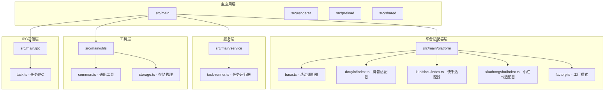

**图表来源**
- [src/main/platform/base.ts:1-105](file://src/main/platform/base.ts#L1-L105)
- [src/main/platform/factory.ts:1-32](file://src/main/platform/factory.ts#L1-L32)
- [src/main/service/task-runner.ts:1-760](file://src/main/service/task-runner.ts#L1-L760)

**章节来源**
- [src/main/platform/base.ts:1-105](file://src/main/platform/base.ts#L1-L105)
- [src/main/platform/factory.ts:1-32](file://src/main/platform/factory.ts#L1-L32)

## 核心组件

### 基础适配器类

BasePlatformAdapter是所有平台适配器的基类，定义了统一的接口规范和通用功能：

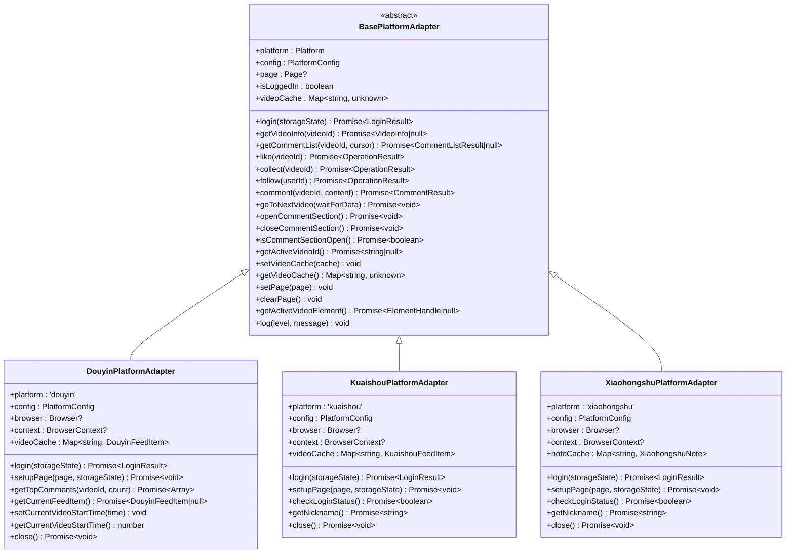

**图表来源**
- [src/main/platform/base.ts:24-80](file://src/main/platform/base.ts#L24-L80)
- [src/main/platform/douyin/index.ts:56-67](file://src/main/platform/douyin/index.ts#L56-L67)
- [src/main/platform/kuaishou/index.ts:22-33](file://src/main/platform/kuaishou/index.ts#L22-L33)
- [src/main/platform/xiaohongshu/index.ts:23-34](file://src/main/platform/xiaohongshu/index.ts#L23-L34)

### 工厂模式实现

工厂模式负责创建和管理不同平台的适配器实例：

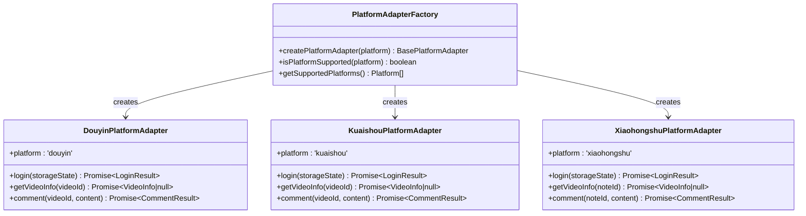

**图表来源**
- [src/main/platform/factory.ts:7-26](file://src/main/platform/factory.ts#L7-L26)

**章节来源**
- [src/main/platform/base.ts:24-80](file://src/main/platform/base.ts#L24-L80)
- [src/main/platform/factory.ts:1-32](file://src/main/platform/factory.ts#L1-L32)

## 架构概览

AutoOps平台适配器系统采用分层架构设计，各层职责明确，耦合度低：

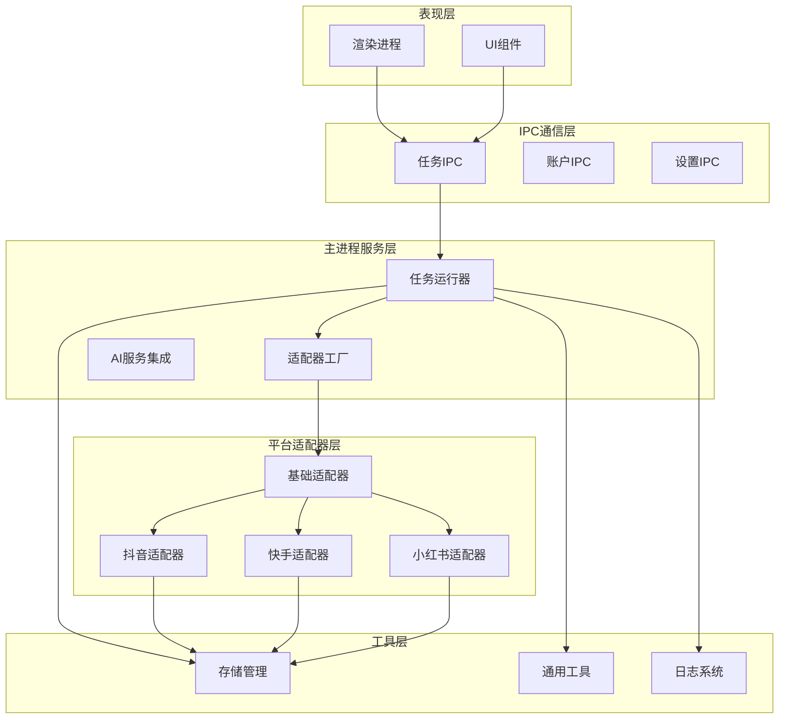

**图表来源**
- [src/main/ipc/task.ts:11-103](file://src/main/ipc/task.ts#L11-L103)
- [src/main/service/task-runner.ts:25-113](file://src/main/service/task-runner.ts#L25-L113)
- [src/main/platform/factory.ts:7-18](file://src/main/platform/factory.ts#L7-L18)

系统的核心工作流程：

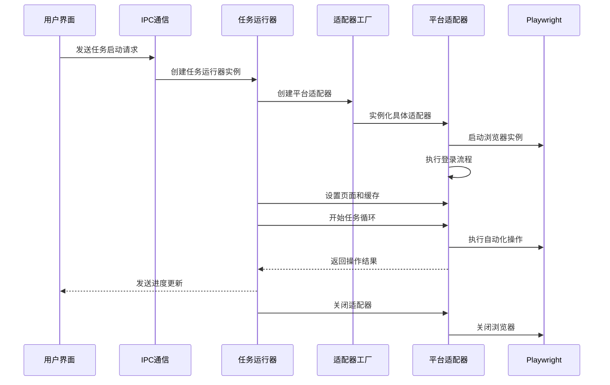

**图表来源**
- [src/main/ipc/task.ts:49-71](file://src/main/ipc/task.ts#L49-L71)
- [src/main/service/task-runner.ts:55-113](file://src/main/service/task-runner.ts#L55-L113)
- [src/main/platform/factory.ts:7-18](file://src/main/platform/factory.ts#L7-L18)

**章节来源**
- [src/main/service/task-runner.ts:1-760](file://src/main/service/task-runner.ts#L1-L760)
- [src/main/ipc/task.ts:1-104](file://src/main/ipc/task.ts#L1-L104)

## 详细组件分析

### 基础适配器接口定义

基础适配器类定义了所有平台适配器必须实现的标准接口：

#### 核心接口方法

| 方法名 | 参数 | 返回值 | 描述 |
|--------|------|--------|------|
| login | storageState?: unknown | Promise<LoginResult> | 执行平台登录操作 |
| getVideoInfo | videoId: string | Promise<VideoInfo \| null> | 获取视频信息 |
| getCommentList | videoId: string, cursor?: number | Promise<CommentListResult \| null> | 获取评论列表 |
| like | videoId: string | Promise<OperationResult> | 点赞操作 |
| collect | videoId: string | Promise<OperationResult> | 收藏操作 |
| follow | userId: string | Promise<OperationResult> | 关注操作 |
| comment | videoId: string, content: string | Promise<CommentResult> | 评论操作 |
| goToNextVideo | waitForData?: boolean | Promise<void> | 切换到下一个视频 |
| openCommentSection | - | Promise<void> | 打开评论区域 |
| closeCommentSection | - | Promise<void> | 关闭评论区域 |
| isCommentSectionOpen | - | Promise<boolean> | 检查评论区域是否打开 |

#### 事件系统

基础适配器继承自EventEmitter，支持以下事件：

- `log`: 日志事件，包含级别、消息和时间戳
- `progress`: 进度事件，用于任务状态跟踪
- `action`: 操作事件，记录具体的执行动作

**章节来源**
- [src/main/platform/base.ts:24-80](file://src/main/platform/base.ts#L24-L80)

### 抖店平台适配器

DouyinPlatformAdapter是抖音平台的专用适配器，实现了完整的抖音生态功能：

#### 特有功能

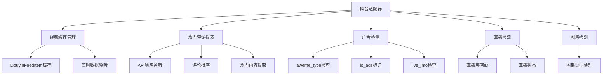

**图表来源**
- [src/main/platform/douyin/index.ts:155-180](file://src/main/platform/douyin/index.ts#L155-L180)

#### 关键实现细节

1. **视频数据缓存**: 通过监听抖音的feed API响应，实时缓存视频数据
2. **广告识别**: 通过多种维度识别广告内容，避免对广告进行自动化操作
3. **验证码处理**: 检测并处理平台的验证码弹窗
4. **智能等待**: 根据视频类型和网络状况动态调整等待时间

**章节来源**
- [src/main/platform/douyin/index.ts:1-507](file://src/main/platform/douyin/index.ts#L1-L507)

### 快手平台适配器

KuaishouPlatformAdapter专注于快手平台的自动化操作：

#### 登录流程

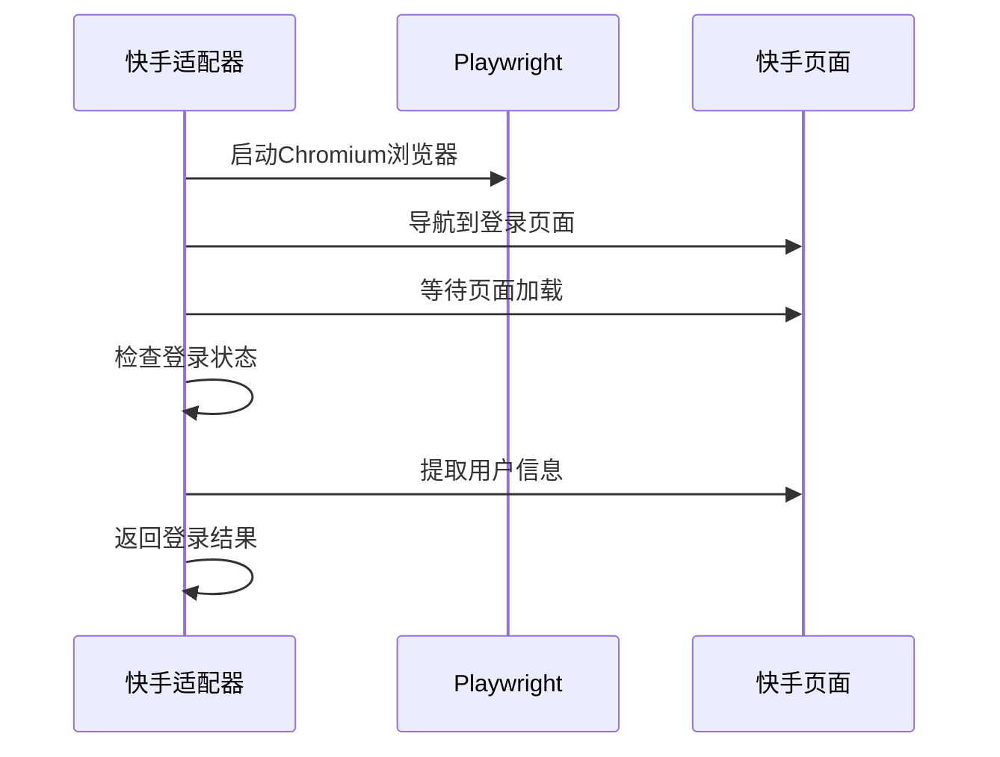

**图表来源**
- [src/main/platform/kuaishou/index.ts:35-69](file://src/main/platform/kuaishou/index.ts#L35-L69)

#### 平台特色

- **简化登录**: 通过简单的登录按钮检测实现登录状态判断
- **轻量级实现**: 相比抖音适配器，功能相对简化
- **统一接口**: 保持与基础适配器的一致性

**章节来源**
- [src/main/platform/kuaishou/index.ts:1-253](file://src/main/platform/kuaishou/index.ts#L1-L253)

### 小红书平台适配器

XiaohongshuPlatformAdapter针对小红书的内容特点进行了专门优化：

#### 内容类型适配

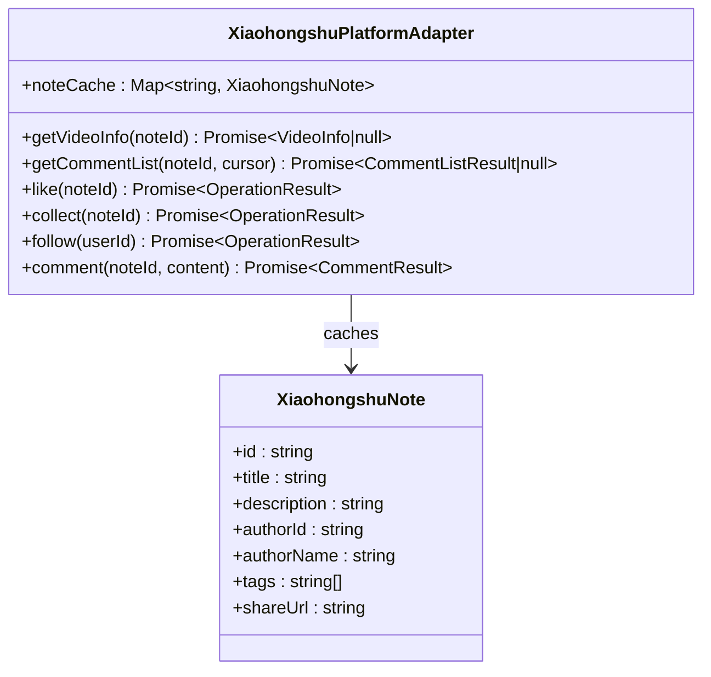

**图表来源**
- [src/main/platform/xiaohongshu/index.ts:13-21](file://src/main/platform/xiaohongshu/index.ts#L13-L21)

#### 适配器差异

- **Note缓存**: 使用XiaohongshuNote替代视频缓存
- **选择器适配**: 针对小红书的DOM结构优化选择器
- **功能简化**: 基于小红书平台的特点简化部分功能

**章节来源**
- [src/main/platform/xiaohongshu/index.ts:1-264](file://src/main/platform/xiaohongshu/index.ts#L1-L264)

### 工厂模式实现

平台适配器工厂提供了统一的创建接口：

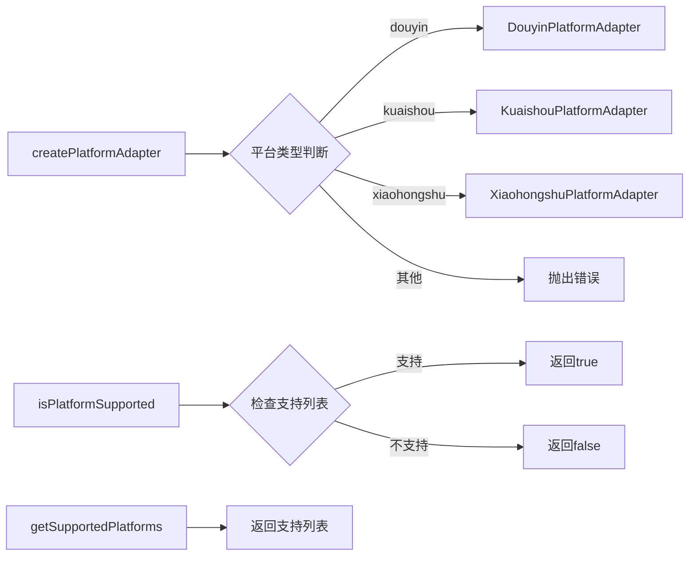

**图表来源**
- [src/main/platform/factory.ts:7-26](file://src/main/platform/factory.ts#L7-L26)

**章节来源**
- [src/main/platform/factory.ts:1-32](file://src/main/platform/factory.ts#L1-L32)

## 依赖关系分析

系统的关键依赖关系如下：

```mermaid
graph TB
subgraph "外部依赖"
A[@playwright/test]
B[electron-store]
C[electron-log]
end
subgraph "内部模块"
D[BasePlatformAdapter]
E[PlatformAdapterFactory]
F[TaskRunner]
G[Common Utils]
H[Storage Utils]
end
subgraph "平台特定模块"
I[Douyin Adapter]
J[Kuaishou Adapter]
K[Xiaohongshu Adapter]
end
A --> D
A --> I
A --> J
A --> K
B --> H
C --> F
D --> E
E --> I
E --> J
E --> K
F --> D
F --> G
F --> H
I --> G
J --> G
K --> G
```

**图表来源**
- [src/main/platform/base.ts:1-12](file://src/main/platform/base.ts#L1-L12)
- [src/main/service/task-runner.ts:1-13](file://src/main/service/task-runner.ts#L1-L13)

### 主要依赖分析

1. **Playwright集成**: 所有适配器都依赖Playwright进行页面自动化
2. **Electron集成**: 使用Electron进行桌面应用封装
3. **事件驱动架构**: 基于EventEmitter实现松耦合通信
4. **配置驱动**: 通过配置文件实现平台差异化的处理

**章节来源**
- [src/shared/platform.ts:1-260](file://src/shared/platform.ts#L1-L260)
- [src/main/utils/storage.ts:1-46](file://src/main/utils/storage.ts#L1-L46)

## 性能考虑

### 缓存策略

系统采用了多层次的缓存机制来提升性能：

1. **视频数据缓存**: 通过监听API响应实时缓存视频数据
2. **页面状态缓存**: 缓存登录状态和用户信息
3. **操作结果缓存**: 避免重复的网络请求

### 异步处理

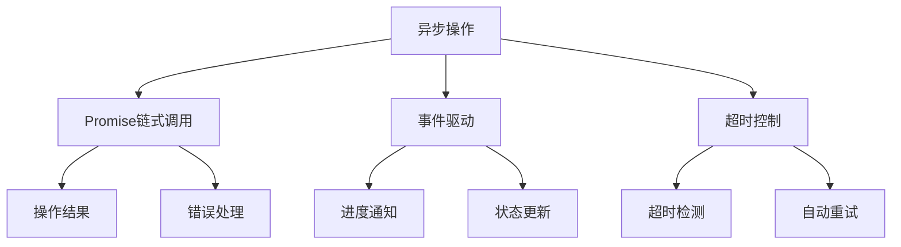

**图表来源**
- [src/main/service/task-runner.ts:235-371](file://src/main/service/task-runner.ts#L235-L371)

### 性能优化建议

1. **合理设置等待时间**: 根据网络状况动态调整等待时间
2. **批量操作优化**: 合理安排操作顺序，减少页面刷新
3. **内存管理**: 及时清理不需要的数据和事件监听器
4. **并发控制**: 控制同时运行的任务数量

## 故障排除指南

### 常见问题及解决方案

#### 登录问题

| 问题类型 | 症状 | 解决方案 |
|----------|------|----------|
| 登录失败 | 无法进入主页 | 检查登录凭据，重新登录 |
| 验证码弹窗 | 操作被中断 | 手动完成验证码验证 |
| 会话过期 | 需要重新登录 | 检查存储状态，重新加载 |

#### 页面元素定位问题

| 问题类型 | 症状 | 解决方案 |
|----------|------|----------|
| 元素找不到 | 操作失败 | 更新选择器配置 |
| 动态元素 | 定位不稳定 | 添加等待条件 |
| 平台更新 | 选择器失效 | 同步更新平台配置 |

#### 网络连接问题

| 问题类型 | 症状 | 解决方案 |
|----------|------|----------|
| 请求超时 | 操作超时 | 增加超时时间，检查网络 |
| API变更 | 数据获取失败 | 更新API端点配置 |
| 限流保护 | 请求被拒绝 | 降低请求频率 |

**章节来源**
- [src/main/platform/douyin/index.ts:335-342](file://src/main/platform/douyin/index.ts#L335-L342)
- [src/main/platform/base.ts:68-79](file://src/main/platform/base.ts#L68-L79)

### 错误处理机制

系统实现了完善的错误处理机制：

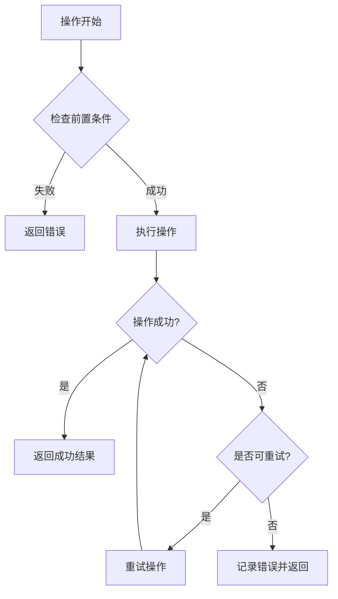

**图表来源**
- [src/main/platform/douyin/index.ts:263-272](file://src/main/platform/douyin/index.ts#L263-L272)

**章节来源**
- [src/main/platform/base.ts:68-79](file://src/main/platform/base.ts#L68-L79)

## 结论

AutoOps平台适配器系统通过精心设计的架构和统一的接口规范，成功地将多个不同平台的自动化操作进行了抽象和标准化。系统的主要优势包括：

1. **高度可扩展**: 通过工厂模式和基础适配器设计，易于添加新的平台支持
2. **稳定的接口**: 统一的API设计使得上层应用无需关心底层实现细节
3. **强大的功能**: 支持复杂的业务逻辑，如AI评论生成、规则匹配等
4. **良好的维护性**: 清晰的代码结构和完善的错误处理机制

对于开发者而言，该系统提供了清晰的扩展路径和最佳实践指导，是构建跨平台自动化系统的优秀参考实现。

## 附录

### API参考表

#### 基础适配器接口

| 接口名称 | 方法签名 | 参数说明 | 返回值 |
|----------|----------|----------|--------|
| login | login(storageState?: unknown) | 存储状态 | Promise<LoginResult> |
| getVideoInfo | getVideoInfo(videoId: string) | 视频ID | Promise<VideoInfo \| null> |
| getCommentList | getCommentList(videoId: string, cursor?: number) | 视频ID, 游标 | Promise<CommentListResult \| null> |
| like | like(videoId: string) | 视频ID | Promise<OperationResult> |
| collect | collect(videoId: string) | 视频ID | Promise<OperationResult> |
| follow | follow(userId: string) | 用户ID | Promise<OperationResult> |
| comment | comment(videoId: string, content: string) | 视频ID, 评论内容 | Promise<CommentResult> |
| goToNextVideo | goToNextVideo(waitForData?: boolean) | 是否等待数据 | Promise<void> |
| openCommentSection | openCommentSection() | - | Promise<void> |
| closeCommentSection | closeCommentSection() | - | Promise<void> |
| isCommentSectionOpen | isCommentSectionOpen() | - | Promise<boolean> |
| getActiveVideoId | getActiveVideoId() | - | Promise<string \| null> |

#### 工厂模式接口

| 接口名称 | 方法签名 | 参数说明 | 返回值 |
|----------|----------|----------|--------|
| createPlatformAdapter | createPlatformAdapter(platform: Platform) | 平台类型 | BasePlatformAdapter |
| isPlatformSupported | isPlatformSupported(platform: Platform) | 平台类型 | boolean |
| getSupportedPlatforms | getSupportedPlatforms() | - | Platform[] |

#### 任务运行器接口

| 接口名称 | 方法签名 | 参数说明 | 返回值 |
|----------|----------|----------|--------|
| start | start(config: TaskRunConfig) | 任务配置 | Promise<string> |
| startWithContext | startWithContext(config: TaskRunConfig, context: BrowserContext) | 任务配置, 上下文 | Promise<string> |
| pause | pause() | - | Promise<void> |
| resume | resume() | - | Promise<void> |
| stop | stop() | - | Promise<void> |
| getStatus | status | - | TaskRunnerStatus |

### 最佳实践

1. **适配器扩展**: 新增平台时，确保实现所有必需的方法
2. **错误处理**: 在每个操作中添加适当的错误处理和重试机制
3. **性能优化**: 合理使用缓存，避免不必要的网络请求
4. **日志记录**: 使用统一的日志格式，便于调试和监控
5. **配置管理**: 通过配置文件管理平台差异，避免硬编码