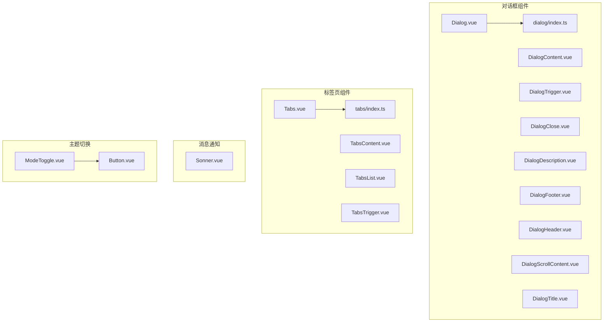
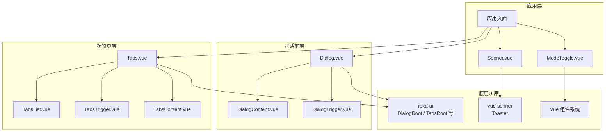
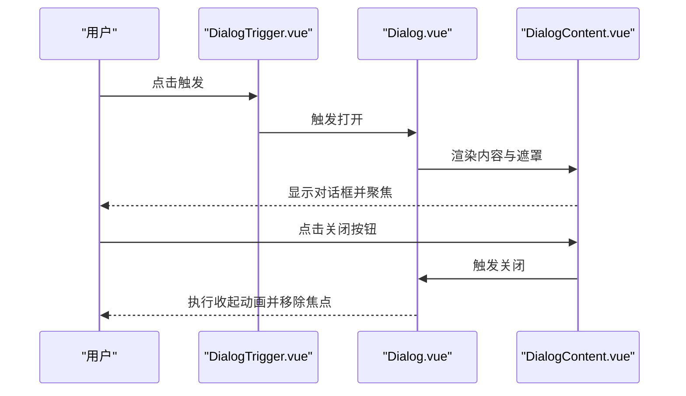
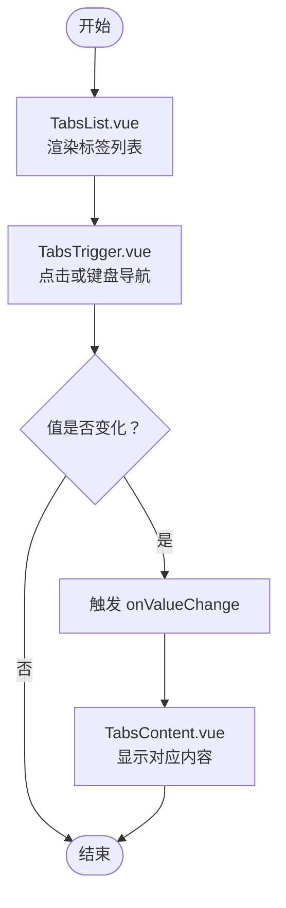
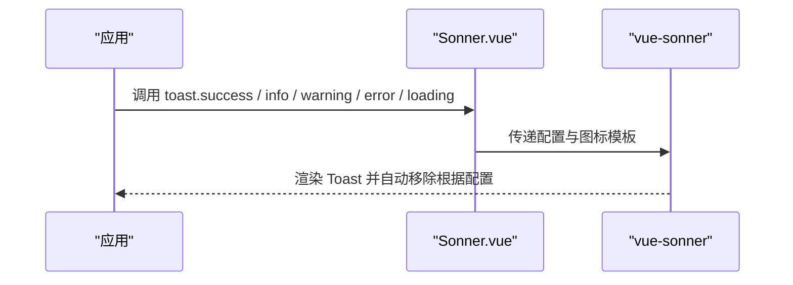
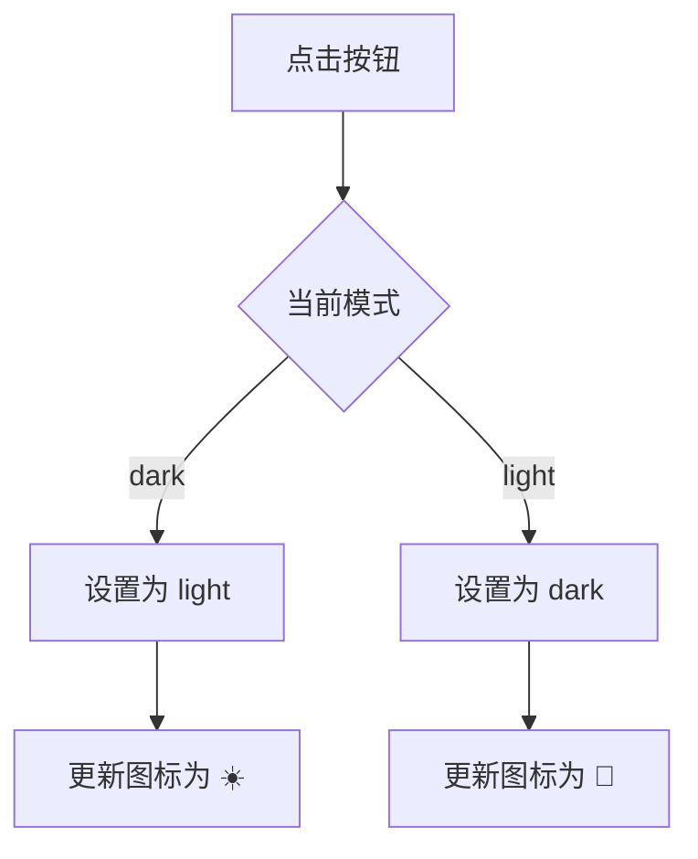
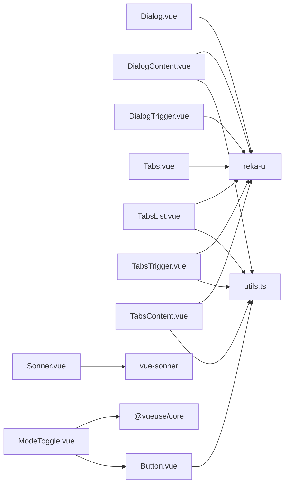

# 反馈组件

<cite>
**本文引用的文件**
- [Dialog.vue](file://src/renderer/src/components/ui/dialog/Dialog.vue)
- [DialogContent.vue](file://src/renderer/src/components/ui/dialog/DialogContent.vue)
- [DialogTrigger.vue](file://src/renderer/src/components/ui/dialog/DialogTrigger.vue)
- [DialogClose.vue](file://src/renderer/src/components/ui/dialog/DialogClose.vue)
- [DialogDescription.vue](file://src/renderer/src/components/ui/dialog/DialogDescription.vue)
- [DialogFooter.vue](file://src/renderer/src/components/ui/dialog/DialogFooter.vue)
- [DialogHeader.vue](file://src/renderer/src/components/ui/dialog/DialogHeader.vue)
- [DialogScrollContent.vue](file://src/renderer/src/components/ui/dialog/DialogScrollContent.vue)
- [DialogTitle.vue](file://src/renderer/src/components/ui/dialog/DialogTitle.vue)
- [index.ts（对话框导出）](file://src/renderer/src/components/ui/dialog/index.ts)
- [Tabs.vue](file://src/renderer/src/components/ui/tabs/Tabs.vue)
- [TabsContent.vue](file://src/renderer/src/components/ui/tabs/TabsContent.vue)
- [TabsList.vue](file://src/renderer/src/components/ui/tabs/TabsList.vue)
- [TabsTrigger.vue](file://src/renderer/src/components/ui/tabs/TabsTrigger.vue)
- [index.ts（标签页导出）](file://src/renderer/src/components/ui/tabs/index.ts)
- [Sonner.vue](file://src/renderer/src/components/ui/sonner/Sonner.vue)
- [ModeToggle.vue](file://src/renderer/src/components/ModeToggle.vue)
- [Button.vue](file://src/renderer/src/components/ui/button/Button.vue)
- [index.ts（按钮变体）](file://src/renderer/src/components/ui/button/index.ts)
- [utils.ts](file://src/renderer/src/lib/utils.ts)
</cite>

## 目录
1. [简介](#简介)
2. [项目结构](#项目结构)
3. [核心组件](#核心组件)
4. [架构总览](#架构总览)
5. [详细组件分析](#详细组件分析)
6. [依赖关系分析](#依赖关系分析)
7. [性能考虑](#性能考虑)
8. [故障排除指南](#故障排除指南)
9. [结论](#结论)
10. [附录](#附录)

## 简介
本文件为用户反馈相关UI组件的API参考文档，覆盖以下组件：
- 对话框（Dialog）
- 标签页（Tabs）
- 消息通知（Sonner）
- 主题切换（ModeToggle）

文档从属性定义、事件回调、插槽使用、状态管理、模态行为、动画效果、键盘交互与无障碍支持等维度进行说明，并结合实际源码路径定位组件实现细节，帮助开发者快速理解与正确使用这些组件。

## 项目结构
反馈组件位于渲染器侧的UI组件目录中，采用按功能域分层组织：
- 对话框：ui/dialog
- 标签页：ui/tabs
- 消息通知：ui/sonner
- 主题切换：根级组件（ModeToggle.vue）
- 基础按钮：ui/button（用于主题切换等基础交互）

图表来源
- [Dialog.vue:1-16](file://src/renderer/src/components/ui/dialog/Dialog.vue#L1-L16)
- [DialogContent.vue:1-47](file://src/renderer/src/components/ui/dialog/DialogContent.vue#L1-L47)
- [DialogTrigger.vue:1-13](file://src/renderer/src/components/ui/dialog/DialogTrigger.vue#L1-L13)
- [Tabs.vue:1-16](file://src/renderer/src/components/ui/tabs/Tabs.vue#L1-L16)
- [TabsContent.vue:1-21](file://src/renderer/src/components/ui/tabs/TabsContent.vue#L1-L21)
- [TabsList.vue:1-24](file://src/renderer/src/components/ui/tabs/TabsList.vue#L1-L24)
- [TabsTrigger.vue:1-28](file://src/renderer/src/components/ui/tabs/TabsTrigger.vue#L1-L28)
- [Sonner.vue:1-48](file://src/renderer/src/components/ui/sonner/Sonner.vue#L1-L48)
- [ModeToggle.vue:1-17](file://src/renderer/src/components/ModeToggle.vue#L1-L17)
- [Button.vue:1-29](file://src/renderer/src/components/ui/button/Button.vue#L1-L29)

章节来源
- [Dialog.vue:1-16](file://src/renderer/src/components/ui/dialog/Dialog.vue#L1-L16)
- [Tabs.vue:1-16](file://src/renderer/src/components/ui/tabs/Tabs.vue#L1-L16)
- [Sonner.vue:1-48](file://src/renderer/src/components/ui/sonner/Sonner.vue#L1-L48)
- [ModeToggle.vue:1-17](file://src/renderer/src/components/ModeToggle.vue#L1-L17)

## 核心组件
- 对话框（Dialog）：基于 reka-ui 的 DialogRoot 包装，提供透传属性与事件的能力，内部通过 Portal 渲染遮罩与内容区，支持开合动画与无障碍关闭按钮。
- 标签页（Tabs）：基于 reka-ui 的 TabsRoot 包装，提供透传属性与事件的能力，配合 TabsList、TabsTrigger、TabsContent 组成可切换的内容区域。
- 消息通知（Sonner）：基于 vue-sonner 的 Toaster，自定义图标与样式类名，统一 Toast 展示风格。
- 主题切换（ModeToggle）：基于 @vueuse/core 的 useColorMode，通过按钮切换明暗主题，并以图标直观展示当前模式。

章节来源
- [Dialog.vue:1-16](file://src/renderer/src/components/ui/dialog/Dialog.vue#L1-L16)
- [DialogContent.vue:1-47](file://src/renderer/src/components/ui/dialog/DialogContent.vue#L1-L47)
- [Tabs.vue:1-16](file://src/renderer/src/components/ui/tabs/Tabs.vue#L1-L16)
- [TabsContent.vue:1-21](file://src/renderer/src/components/ui/tabs/TabsContent.vue#L1-L21)
- [Sonner.vue:1-48](file://src/renderer/src/components/ui/sonner/Sonner.vue#L1-L48)
- [ModeToggle.vue:1-17](file://src/renderer/src/components/ModeToggle.vue#L1-L17)

## 架构总览
下图展示了反馈组件与底层UI库的关系以及关键数据流：

图表来源
- [Dialog.vue:1-16](file://src/renderer/src/components/ui/dialog/Dialog.vue#L1-L16)
- [DialogContent.vue:1-47](file://src/renderer/src/components/ui/dialog/DialogContent.vue#L1-L47)
- [DialogTrigger.vue:1-13](file://src/renderer/src/components/ui/dialog/DialogTrigger.vue#L1-L13)
- [Tabs.vue:1-16](file://src/renderer/src/components/ui/tabs/Tabs.vue#L1-L16)
- [TabsList.vue:1-24](file://src/renderer/src/components/ui/tabs/TabsList.vue#L1-L24)
- [TabsTrigger.vue:1-28](file://src/renderer/src/components/ui/tabs/TabsTrigger.vue#L1-L28)
- [TabsContent.vue:1-21](file://src/renderer/src/components/ui/tabs/TabsContent.vue#L1-L21)
- [Sonner.vue:1-48](file://src/renderer/src/components/ui/sonner/Sonner.vue#L1-L48)
- [ModeToggle.vue:1-17](file://src/renderer/src/components/ModeToggle.vue#L1-L17)

## 详细组件分析

### 对话框（Dialog）
- 组件职责
  - 作为顶层容器，封装 reka-ui 的 DialogRoot，负责属性与事件的透传。
  - 内部通过 Portal 渲染遮罩与内容区，支持开合动画与无障碍关闭按钮。
- 关键属性（透传自 reka-ui）
  - DialogRootProps：如 isOpen、defaultOpen、modal 等（具体以 reka-ui 文档为准）。
- 事件回调（透传自 reka-ui）
  - DialogRootEmits：如 onOpenChange 等（具体以 reka-ui 文档为准）。
- 插槽
  - 默认插槽：放置子组件（如 DialogContent、DialogHeader、DialogFooter 等）。
- 子组件概览
  - DialogContent：带遮罩、动画与关闭按钮的内容容器，支持额外 class 注入。
  - DialogTrigger：触发打开对话框的触发器。
  - DialogClose：内置关闭按钮，具备无障碍语义。
  - DialogHeader/DialogFooter：头部与底部布局容器。
  - DialogTitle/DialogDescription：标题与描述文本。
  - DialogScrollContent：滚动型内容容器（适用于长内容）。
- 动画与模态
  - 内置淡入淡出、缩放与滑动动画；遮罩默认为半透明背景，支持 modal 行为。
- 键盘交互与无障碍
  - 内置关闭按钮带有“关闭”语义文本，便于读屏软件识别。
- 使用场景
  - 配置确认、表单提交、信息提示、复杂设置面板等需要阻断主流程的交互。

图表来源
- [DialogTrigger.vue:1-13](file://src/renderer/src/components/ui/dialog/DialogTrigger.vue#L1-L13)
- [Dialog.vue:1-16](file://src/renderer/src/components/ui/dialog/Dialog.vue#L1-L16)
- [DialogContent.vue:1-47](file://src/renderer/src/components/ui/dialog/DialogContent.vue#L1-L47)

章节来源
- [Dialog.vue:1-16](file://src/renderer/src/components/ui/dialog/Dialog.vue#L1-L16)
- [DialogContent.vue:1-47](file://src/renderer/src/components/ui/dialog/DialogContent.vue#L1-L47)
- [DialogTrigger.vue:1-13](file://src/renderer/src/components/ui/dialog/DialogTrigger.vue#L1-L13)
- [DialogClose.vue](file://src/renderer/src/components/ui/dialog/DialogClose.vue)
- [DialogDescription.vue](file://src/renderer/src/components/ui/dialog/DialogDescription.vue)
- [DialogFooter.vue](file://src/renderer/src/components/ui/dialog/DialogFooter.vue)
- [DialogHeader.vue](file://src/renderer/src/components/ui/dialog/DialogHeader.vue)
- [DialogScrollContent.vue](file://src/renderer/src/components/ui/dialog/DialogScrollContent.vue)
- [DialogTitle.vue](file://src/renderer/src/components/ui/dialog/DialogTitle.vue)
- [index.ts（对话框导出）:1-10](file://src/renderer/src/components/ui/dialog/index.ts#L1-L10)

### 标签页（Tabs）
- 组件职责
  - 作为顶层容器，封装 reka-ui 的 TabsRoot，负责属性与事件的透传。
  - 配合 TabsList、TabsTrigger、TabsContent 实现可切换的内容区域。
- 关键属性（透传自 reka-ui）
  - TabsRootProps：如 value、defaultValue、orientation、activationMode 等（具体以 reka-ui 文档为准）。
- 事件回调（透传自 reka-ui）
  - TabsRootEmits：如 onValueChange 等（具体以 reka-ui 文档为准）。
- 插槽
  - 默认插槽：放置 TabsList 与多个 TabsContent。
- 子组件概览
  - TabsList：标签列表容器，承载多个 TabsTrigger。
  - TabsTrigger：标签项，激活态具备视觉差异。
  - TabsContent：对应标签的内容容器，仅在激活时可见。
- 动画与模态
  - 通过 reka-ui 提供的切换逻辑控制内容显示，未内置额外动画类。
- 键盘交互与无障碍
  - 由 reka-ui 负责键盘导航与焦点管理，确保可访问性。
- 使用场景
  - 设置分组、多视图切换、筛选条件分组等。

图表来源
- [Tabs.vue:1-16](file://src/renderer/src/components/ui/tabs/Tabs.vue#L1-L16)
- [TabsList.vue:1-24](file://src/renderer/src/components/ui/tabs/TabsList.vue#L1-L24)
- [TabsTrigger.vue:1-28](file://src/renderer/src/components/ui/tabs/TabsTrigger.vue#L1-L28)
- [TabsContent.vue:1-21](file://src/renderer/src/components/ui/tabs/TabsContent.vue#L1-L21)

章节来源
- [Tabs.vue:1-16](file://src/renderer/src/components/ui/tabs/Tabs.vue#L1-L16)
- [TabsContent.vue:1-21](file://src/renderer/src/components/ui/tabs/TabsContent.vue#L1-L21)
- [TabsList.vue:1-24](file://src/renderer/src/components/ui/tabs/TabsList.vue#L1-L24)
- [TabsTrigger.vue:1-28](file://src/renderer/src/components/ui/tabs/TabsTrigger.vue#L1-L28)
- [index.ts（标签页导出）:1-5](file://src/renderer/src/components/ui/tabs/index.ts#L1-L5)

### 消息通知（Sonner）
- 组件职责
  - 基于 vue-sonner 的 Toaster，统一样式与图标，提供成功、信息、警告、错误、加载、关闭等模板。
- 关键属性
  - ToasterProps：透传给 vue-sonner 的所有配置项（如 toastOptions、position、duration 等）。
- 插槽
  - 成功/信息/警告/错误/加载/关闭 图标插槽，用于替换默认图标。
- 样式类名
  - 自定义 toast、description、actionButton、cancelButton 的类名，确保与主题一致。
- 使用场景
  - 异步操作结果反馈、系统提示、用户引导等非阻断式通知。

图表来源
- [Sonner.vue:1-48](file://src/renderer/src/components/ui/sonner/Sonner.vue#L1-L48)

章节来源
- [Sonner.vue:1-48](file://src/renderer/src/components/ui/sonner/Sonner.vue#L1-L48)

### 主题切换（ModeToggle）
- 组件职责
  - 切换明/暗主题，使用 @vueuse/core 的 useColorMode 管理状态。
- 关键属性
  - 无显式属性，通过内部状态切换模式。
- 事件回调
  - 点击事件：切换 mode.value。
- 插槽
  - 无插槽，直接渲染按钮。
- 状态管理
  - 通过 useColorMode 维护全局颜色模式，点击切换并在按钮上以图标表示当前模式。
- 使用场景
  - 应用级主题切换入口，常置于顶部导航或设置页。

图表来源
- [ModeToggle.vue:1-17](file://src/renderer/src/components/ModeToggle.vue#L1-L17)
- [Button.vue:1-29](file://src/renderer/src/components/ui/button/Button.vue#L1-L29)

章节来源
- [ModeToggle.vue:1-17](file://src/renderer/src/components/ModeToggle.vue#L1-L17)
- [Button.vue:1-29](file://src/renderer/src/components/ui/button/Button.vue#L1-L29)
- [index.ts（按钮变体）:1-39](file://src/renderer/src/components/ui/button/index.ts#L1-L39)

## 依赖关系分析
- 对话框与标签页
  - 均基于 reka-ui 的 Root 组件进行包装，保持属性与事件透传的一致性。
  - 子组件通过 reactiveOmit 将 class 与核心属性分离，避免重复绑定。
- 消息通知
  - 基于 vue-sonner 的 Toaster，通过插槽注入图标，统一类名以适配主题。
- 主题切换
  - 依赖 @vueuse/core 的 useColorMode 与 ui/button 组件，实现简洁的按钮交互。

图表来源
- [Dialog.vue:1-16](file://src/renderer/src/components/ui/dialog/Dialog.vue#L1-L16)
- [DialogContent.vue:1-47](file://src/renderer/src/components/ui/dialog/DialogContent.vue#L1-L47)
- [DialogTrigger.vue:1-13](file://src/renderer/src/components/ui/dialog/DialogTrigger.vue#L1-L13)
- [Tabs.vue:1-16](file://src/renderer/src/components/ui/tabs/Tabs.vue#L1-L16)
- [TabsList.vue:1-24](file://src/renderer/src/components/ui/tabs/TabsList.vue#L1-L24)
- [TabsTrigger.vue:1-28](file://src/renderer/src/components/ui/tabs/TabsTrigger.vue#L1-L28)
- [TabsContent.vue:1-21](file://src/renderer/src/components/ui/tabs/TabsContent.vue#L1-L21)
- [Sonner.vue:1-48](file://src/renderer/src/components/ui/sonner/Sonner.vue#L1-L48)
- [ModeToggle.vue:1-17](file://src/renderer/src/components/ModeToggle.vue#L1-L17)
- [Button.vue:1-29](file://src/renderer/src/components/ui/button/Button.vue#L1-L29)
- [utils.ts:1-8](file://src/renderer/src/lib/utils.ts#L1-L8)

章节来源
- [utils.ts:1-8](file://src/renderer/src/lib/utils.ts#L1-L8)

## 性能考虑
- 对话框与标签页
  - 通过 Portal 渲染遮罩与内容，避免层级过深导致的重绘问题；动画类基于数据状态切换，尽量减少不必要的计算。
- 消息通知
  - 使用 vue-sonner 的轻量渲染机制，建议合理设置 duration 与最大同时显示数量，避免频繁创建/销毁造成抖动。
- 主题切换
  - useColorMode 通过响应式状态驱动，点击切换成本极低；按钮组件使用 cn 合并类名，避免重复样式计算。

## 故障排除指南
- 对话框无法关闭
  - 检查是否正确使用 DialogTrigger 打开、DialogClose 或外部逻辑触发关闭；确认 onOpenChange 事件是否被正确处理。
- 标签页切换无效
  - 确认 TabsTrigger 的 value 与 Tabs 的 value 对齐；检查 TabsRoot 的 onValueChange 是否生效。
- 通知不显示或样式异常
  - 检查 ToasterProps 配置是否正确；确认图标插槽是否按需提供；核对类名覆盖是否与主题一致。
- 主题切换无效
  - 检查 useColorMode 返回的状态是否被正确写入；确认按钮点击事件是否绑定到 mode.value 切换逻辑。

## 结论
上述反馈组件通过统一的属性透传与事件转发，结合 reka-ui 与 vue-sonner 的能力，提供了稳定、可访问且易于扩展的用户反馈体验。对话框与标签页强调可访问性与动画一致性，消息通知强调统一风格与易用性，主题切换则提供简洁直观的全局模式切换入口。建议在业务中优先使用这些组件，以保证一致的交互与视觉体验。

## 附录
- 通用样式工具
  - cn：基于 clsx 与 tailwind-merge 的类名合并函数，用于安全地组合样式类。
- 按钮变体
  - buttonVariants：定义默认、破坏性、轮廓、次级、幽灵、链接等变体与尺寸，配合 Button.vue 使用。

章节来源
- [utils.ts:1-8](file://src/renderer/src/lib/utils.ts#L1-L8)
- [Button.vue:1-29](file://src/renderer/src/components/ui/button/Button.vue#L1-L29)
- [index.ts（按钮变体）:1-39](file://src/renderer/src/components/ui/button/index.ts#L1-L39)