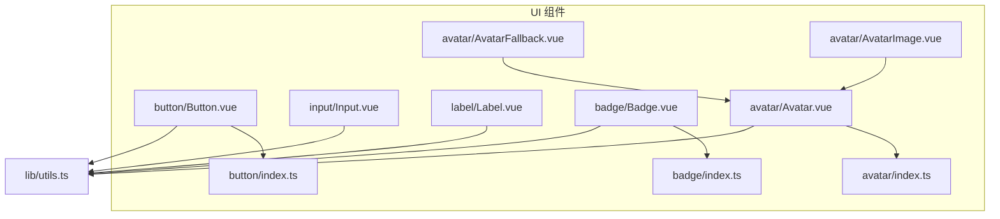
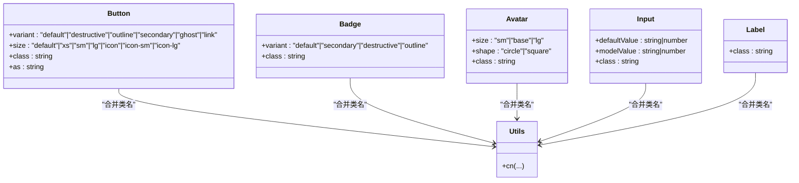
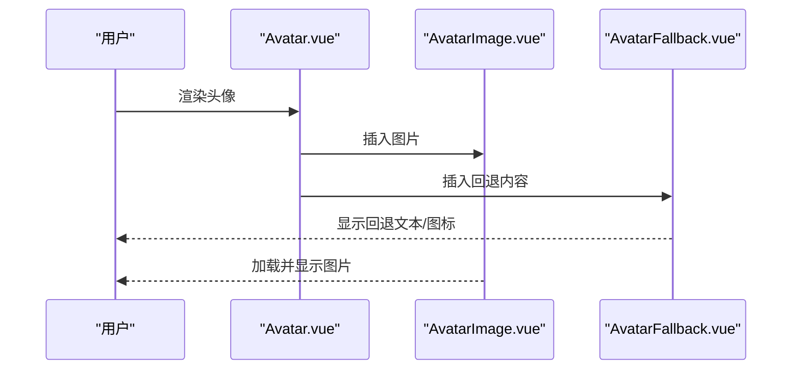
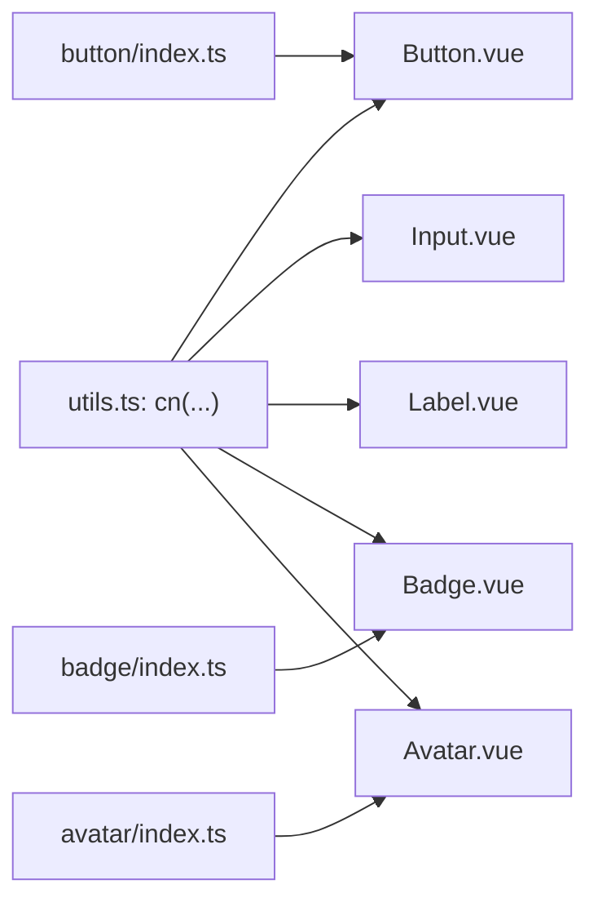

# 基础组件

<cite>
**本文引用的文件**
- [Button.vue](file://src/renderer/src/components/ui/button/Button.vue)
- [button/index.ts](file://src/renderer/src/components/ui/button/index.ts)
- [Input.vue](file://src/renderer/src/components/ui/input/Input.vue)
- [Label.vue](file://src/renderer/src/components/ui/label/Label.vue)
- [Badge.vue](file://src/renderer/src/components/ui/badge/Badge.vue)
- [badge/index.ts](file://src/renderer/src/components/ui/badge/index.ts)
- [Avatar.vue](file://src/renderer/src/components/ui/avatar/Avatar.vue)
- [avatar/index.ts](file://src/renderer/src/components/ui/avatar/index.ts)
- [AvatarFallback.vue](file://src/renderer/src/components/ui/avatar/AvatarFallback.vue)
- [AvatarImage.vue](file://src/renderer/src/components/ui/avatar/AvatarImage.vue)
- [utils.ts](file://src/renderer/src/lib/utils.ts)
</cite>

## 目录
1. [简介](#简介)
2. [项目结构](#项目结构)
3. [核心组件](#核心组件)
4. [架构总览](#架构总览)
5. [组件详细分析](#组件详细分析)
6. [依赖关系分析](#依赖关系分析)
7. [性能考量](#性能考量)
8. [故障排查指南](#故障排查指南)
9. [结论](#结论)
10. [附录](#附录)

## 简介
本文件为基础UI组件的API参考文档，覆盖按钮(Button)、输入框(Input)、标签(Label)、徽章(Badge)与头像(Avatar)等组件。内容包括：
- 属性(props)定义与默认值
- 事件(events)与插槽(slots)说明
- 方法(methods)与可定制选项
- 使用示例与最佳实践
- 响应式行为、无障碍访问支持与性能优化建议

## 项目结构
基础组件位于渲染进程的UI组件目录中，采用按功能分层组织：每个组件独立一个目录，包含组件实现与变体定义（如适用）。通用工具函数通过工具模块统一处理类名合并。

图表来源
- [Button.vue:1-29](file://src/renderer/src/components/ui/button/Button.vue#L1-L29)
- [button/index.ts:1-39](file://src/renderer/src/components/ui/button/index.ts#L1-L39)
- [Input.vue:1-34](file://src/renderer/src/components/ui/input/Input.vue#L1-L34)
- [Label.vue:1-26](file://src/renderer/src/components/ui/label/Label.vue#L1-L26)
- [Badge.vue:1-18](file://src/renderer/src/components/ui/badge/Badge.vue#L1-L18)
- [badge/index.ts:1-27](file://src/renderer/src/components/ui/badge/index.ts#L1-L27)
- [Avatar.vue:1-23](file://src/renderer/src/components/ui/avatar/Avatar.vue#L1-L23)
- [avatar/index.ts:1-26](file://src/renderer/src/components/ui/avatar/index.ts#L1-L26)
- [AvatarFallback.vue:1-13](file://src/renderer/src/components/ui/avatar/AvatarFallback.vue#L1-L13)
- [AvatarImage.vue:1-13](file://src/renderer/src/components/ui/avatar/AvatarImage.vue#L1-L13)
- [utils.ts:1-8](file://src/renderer/src/lib/utils.ts#L1-L8)

章节来源
- [Button.vue:1-29](file://src/renderer/src/components/ui/button/Button.vue#L1-L29)
- [Input.vue:1-34](file://src/renderer/src/components/ui/input/Input.vue#L1-L34)
- [Label.vue:1-26](file://src/renderer/src/components/ui/label/Label.vue#L1-L26)
- [Badge.vue:1-18](file://src/renderer/src/components/ui/badge/Badge.vue#L1-L18)
- [Avatar.vue:1-23](file://src/renderer/src/components/ui/avatar/Avatar.vue#L1-L23)
- [utils.ts:1-8](file://src/renderer/src/lib/utils.ts#L1-L8)

## 核心组件
本节概述各组件的职责与共性：
- Button：语义化按钮容器，基于变体系统提供多种外观与尺寸。
- Input：受控/非受控输入封装，内置双向绑定与无障碍属性。
- Label：标签容器，用于关联表单控件，提升可访问性。
- Badge：轻量状态/计数标记，支持多变体。
- Avatar：头像组合组件，包含根容器、图片与回退文本，支持尺寸与形状变体。

章节来源
- [Button.vue:1-29](file://src/renderer/src/components/ui/button/Button.vue#L1-L29)
- [Input.vue:1-34](file://src/renderer/src/components/ui/input/Input.vue#L1-L34)
- [Label.vue:1-26](file://src/renderer/src/components/ui/label/Label.vue#L1-L26)
- [Badge.vue:1-18](file://src/renderer/src/components/ui/badge/Badge.vue#L1-L18)
- [Avatar.vue:1-23](file://src/renderer/src/components/ui/avatar/Avatar.vue#L1-L23)

## 架构总览
组件遵循“声明式props + 变体系统 + 工具函数合并类名”的设计模式：
- 变体定义通过CVA生成，集中管理外观与尺寸。
- 组件内部通过工具函数合并用户传入的类名，确保覆盖优先级。
- 头像组件由多个子组件组成，形成组合式结构。

图表来源
- [button/index.ts:6-36](file://src/renderer/src/components/ui/button/index.ts#L6-L36)
- [badge/index.ts:6-24](file://src/renderer/src/components/ui/badge/index.ts#L6-L24)
- [avatar/index.ts:8-23](file://src/renderer/src/components/ui/avatar/index.ts#L8-L23)
- [Input.vue:6-19](file://src/renderer/src/components/ui/input/Input.vue#L6-L19)
- [Label.vue:8-10](file://src/renderer/src/components/ui/label/Label.vue#L8-L10)
- [utils.ts:5-7](file://src/renderer/src/lib/utils.ts#L5-L7)

## 组件详细分析

### 按钮 Button
- 组件定位：语义化按钮容器，支持原生button或自定义元素类型。
- 属性(props)
  - variant: 变体类型，支持 default、destructive、outline、secondary、ghost、link。
  - size: 尺寸类型，支持 default、xs、sm、lg、icon、icon-sm、icon-lg。
  - class: 用户自定义样式类。
  - as: 渲染元素类型，默认为"button"。
- 事件(events)
  - 无显式自定义事件；继承自底层Primitive容器。
- 插槽(slots)
  - 默认插槽：按钮内容。
- 方法(methods)
  - 无额外公开方法。
- 使用示例
  - 基础用法：[Button.vue:20-28](file://src/renderer/src/components/ui/button/Button.vue#L20-L28)
  - 变体与尺寸：[button/index.ts:9-29](file://src/renderer/src/components/ui/button/index.ts#L9-L29)
- 默认样式与可定制
  - 默认类名由变体系统生成，可通过class追加或覆盖。
- 最佳实践
  - 优先使用语义化元素；需要链接样式的场景使用link变体。
- 无障碍与响应式
  - 内置焦点可见环与禁用态样式，适配键盘导航与高对比度。
- 性能
  - 无状态逻辑，开销极低。

章节来源
- [Button.vue:9-17](file://src/renderer/src/components/ui/button/Button.vue#L9-L17)
- [button/index.ts:6-36](file://src/renderer/src/components/ui/button/index.ts#L6-L36)

### 输入框 Input
- 组件定位：输入控件封装，内置v-model与无障碍属性。
- 属性(props)
  - defaultValue: 初始值（非受控模式）。
  - modelValue: 当前值（受控模式）。
  - class: 用户自定义样式类。
- 事件(events)
  - update:modelValue: 值变更事件。
- 插槽(slots)
  - 无。
- 方法(methods)
  - 无额外公开方法。
- 使用示例
  - 受控用法与事件监听：[Input.vue:12-19](file://src/renderer/src/components/ui/input/Input.vue#L12-L19)
  - 样式类合并：[Input.vue:26-31](file://src/renderer/src/components/ui/input/Input.vue#L26-L31)
- 默认样式与可定制
  - 默认类名包含边框、圆角、阴影、聚焦环、禁用态与无效态样式，可通过class扩展。
- 最佳实践
  - 表单场景建议使用受控模式；结合Label进行关联。
- 无障碍与响应式
  - 自动设置data-slot与aria属性，支持invalid状态样式。
- 性能
  - 使用被动v-model避免不必要的重渲染。

章节来源
- [Input.vue:6-19](file://src/renderer/src/components/ui/input/Input.vue#L6-L19)

### 标签 Label
- 组件定位：表单标签容器，用于提升可访问性。
- 属性(props)
  - class: 用户自定义样式类。
- 事件(events)
  - 无。
- 插槽(slots)
  - 默认插槽：标签文本。
- 方法(methods)
  - 无。
- 使用示例
  - 基础用法与类名合并：[Label.vue:13-22](file://src/renderer/src/components/ui/label/Label.vue#L13-L22)
- 默认样式与可定制
  - 默认类名包含字体大小、字重与禁用态样式，可通过class扩展。
- 最佳实践
  - 与Input、Select等控件配合使用，提升可访问性。
- 无障碍与响应式
  - 透传底层Label属性，保持语义化。
- 性能
  - 轻量组件，开销低。

章节来源
- [Label.vue:8-10](file://src/renderer/src/components/ui/label/Label.vue#L8-L10)

### 徽章 Badge
- 组件定位：状态/计数徽标，常用于提示信息。
- 属性(props)
  - variant: 变体类型，支持 default、secondary、destructive、outline。
  - class: 用户自定义样式类。
- 事件(events)
  - 无。
- 插槽(slots)
  - 默认插槽：徽章内容。
- 方法(methods)
  - 无。
- 使用示例
  - 基础用法与变体：[Badge.vue:13-16](file://src/renderer/src/components/ui/badge/Badge.vue#L13-L16)
  - 变体定义：[badge/index.ts:6-24](file://src/renderer/src/components/ui/badge/index.ts#L6-L24)
- 默认样式与可定制
  - 默认类名包含边框、内边距、圆角与阴影，可通过class扩展。
- 最佳实践
  - 与Button、Avatar等组件组合使用，突出状态。
- 无障碍与响应式
  - 无特殊交互，注意颜色对比度。
- 性能
  - 无状态逻辑，开销极低。

章节来源
- [Badge.vue:7-10](file://src/renderer/src/components/ui/badge/Badge.vue#L7-L10)
- [badge/index.ts:6-24](file://src/renderer/src/components/ui/badge/index.ts#L6-L24)

### 头像 Avatar
- 组件定位：头像组合组件，包含根容器、图片与回退文本。
- 属性(props)
  - size: 尺寸，支持 sm、base、lg。
  - shape: 形状，支持 circle、square。
  - class: 用户自定义样式类。
- 事件(events)
  - 无。
- 插槽(slots)
  - 默认插槽：头像内容（通常为图片或回退文本）。
- 方法(methods)
  - 无。
- 使用示例
  - 基础用法与默认值：[Avatar.vue:8-15](file://src/renderer/src/components/ui/avatar/Avatar.vue#L8-L15)
  - 变体定义：[avatar/index.ts:8-23](file://src/renderer/src/components/ui/avatar/index.ts#L8-L23)
- 子组件
  - AvatarImage：承载头像图片，自动填充容器并裁剪。
  - AvatarFallback：在图片未加载时显示回退内容。
- 默认样式与可定制
  - 默认类名包含尺寸、形状与背景色，可通过class扩展。
- 最佳实践
  - 配合AvatarImage与AvatarFallback使用，保证加载体验。
- 无障碍与响应式
  - 作为静态展示组件，无需ARIA属性。
- 性能
  - 无状态逻辑，开销极低。

图表来源
- [Avatar.vue:18-22](file://src/renderer/src/components/ui/avatar/Avatar.vue#L18-L22)
- [AvatarImage.vue:8-12](file://src/renderer/src/components/ui/avatar/AvatarImage.vue#L8-L12)
- [AvatarFallback.vue:8-12](file://src/renderer/src/components/ui/avatar/AvatarFallback.vue#L8-L12)

章节来源
- [Avatar.vue:8-15](file://src/renderer/src/components/ui/avatar/Avatar.vue#L8-L15)
- [avatar/index.ts:8-23](file://src/renderer/src/components/ui/avatar/index.ts#L8-L23)
- [AvatarImage.vue:5-12](file://src/renderer/src/components/ui/avatar/AvatarImage.vue#L5-L12)
- [AvatarFallback.vue:5-12](file://src/renderer/src/components/ui/avatar/AvatarFallback.vue#L5-L12)

## 依赖关系分析
- 类名合并：所有组件均通过工具函数合并类名，确保用户样式覆盖底层默认样式。
- 变体系统：Button、Badge、Avatar通过CVA定义变体，集中管理外观与尺寸。
- 底层库：组件大量依赖reka-ui提供的语义化容器与属性转发能力，简化实现复杂度。

图表来源
- [utils.ts:5-7](file://src/renderer/src/lib/utils.ts#L5-L7)
- [Button.vue:24-24](file://src/renderer/src/components/ui/button/Button.vue#L24-L24)
- [Input.vue:26-31](file://src/renderer/src/components/ui/input/Input.vue#L26-L31)
- [Label.vue:16-21](file://src/renderer/src/components/ui/label/Label.vue#L16-L21)
- [Badge.vue:14-14](file://src/renderer/src/components/ui/badge/Badge.vue#L14-L14)
- [Avatar.vue:19-19](file://src/renderer/src/components/ui/avatar/Avatar.vue#L19-L19)
- [button/index.ts:6-36](file://src/renderer/src/components/ui/button/index.ts#L6-L36)
- [badge/index.ts:6-24](file://src/renderer/src/components/ui/badge/index.ts#L6-L24)
- [avatar/index.ts:8-23](file://src/renderer/src/components/ui/avatar/index.ts#L8-L23)

章节来源
- [utils.ts:5-7](file://src/renderer/src/lib/utils.ts#L5-L7)
- [button/index.ts:1-39](file://src/renderer/src/components/ui/button/index.ts#L1-L39)
- [badge/index.ts:1-27](file://src/renderer/src/components/ui/badge/index.ts#L1-L27)
- [avatar/index.ts:1-26](file://src/renderer/src/components/ui/avatar/index.ts#L1-L26)

## 性能考量
- 类名合并：使用工具函数统一合并，减少重复计算与冲突。
- 变体系统：CVA生成稳定类名，避免运行时条件判断。
- 受控输入：Input使用被动v-model，降低更新成本。
- 无状态组件：Button、Badge、Avatar均为纯展示组件，渲染开销低。
- 建议
  - 在高频渲染场景中优先使用默认变体，避免频繁切换。
  - 合理拆分组件树，避免不必要的包裹层级。

## 故障排查指南
- 输入框无法输入
  - 检查是否正确使用受控模式与事件监听：[Input.vue:12-19](file://src/renderer/src/components/ui/input/Input.vue#L12-L19)
- 样式被覆盖
  - 确认用户类名顺序与工具函数合并规则：[utils.ts:5-7](file://src/renderer/src/lib/utils.ts#L5-L7)
- 头像不显示图片
  - 确保AvatarImage已正确插入且网络可用，回退内容由AvatarFallback提供：[AvatarImage.vue:8-12](file://src/renderer/src/components/ui/avatar/AvatarImage.vue#L8-L12)，[AvatarFallback.vue:8-12](file://src/renderer/src/components/ui/avatar/AvatarFallback.vue#L8-L12)
- 按钮样式异常
  - 检查变体与尺寸参数是否正确：[button/index.ts:9-29](file://src/renderer/src/components/ui/button/index.ts#L9-L29)

章节来源
- [Input.vue:12-19](file://src/renderer/src/components/ui/input/Input.vue#L12-L19)
- [utils.ts:5-7](file://src/renderer/src/lib/utils.ts#L5-L7)
- [AvatarImage.vue:8-12](file://src/renderer/src/components/ui/avatar/AvatarImage.vue#L8-L12)
- [AvatarFallback.vue:8-12](file://src/renderer/src/components/ui/avatar/AvatarFallback.vue#L8-L12)
- [button/index.ts:9-29](file://src/renderer/src/components/ui/button/index.ts#L9-L29)

## 结论
上述基础组件以简洁API与强一致的变体系统为核心，结合工具函数实现灵活的样式定制。它们在可访问性、响应式与性能方面均有良好表现，适合在复杂界面中快速搭建一致的交互与视觉体验。

## 附录
- 变体与尺寸对照
  - Button：见 [button/index.ts:9-29](file://src/renderer/src/components/ui/button/index.ts#L9-L29)
  - Badge：见 [badge/index.ts:9-18](file://src/renderer/src/components/ui/badge/index.ts#L9-L18)
  - Avatar：见 [avatar/index.ts:11-20](file://src/renderer/src/components/ui/avatar/index.ts#L11-L20)
- 类名合并工具
  - 见 [utils.ts:5-7](file://src/renderer/src/lib/utils.ts#L5-L7)