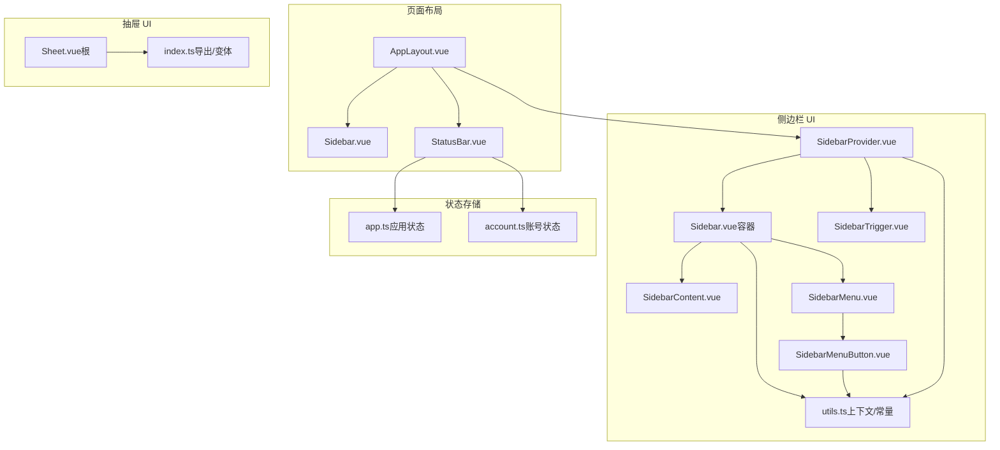
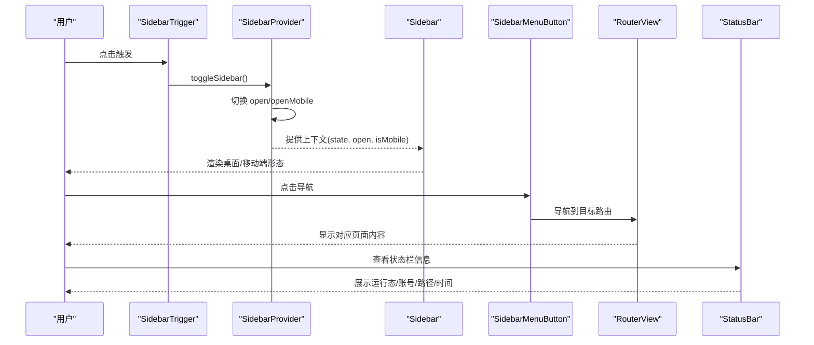
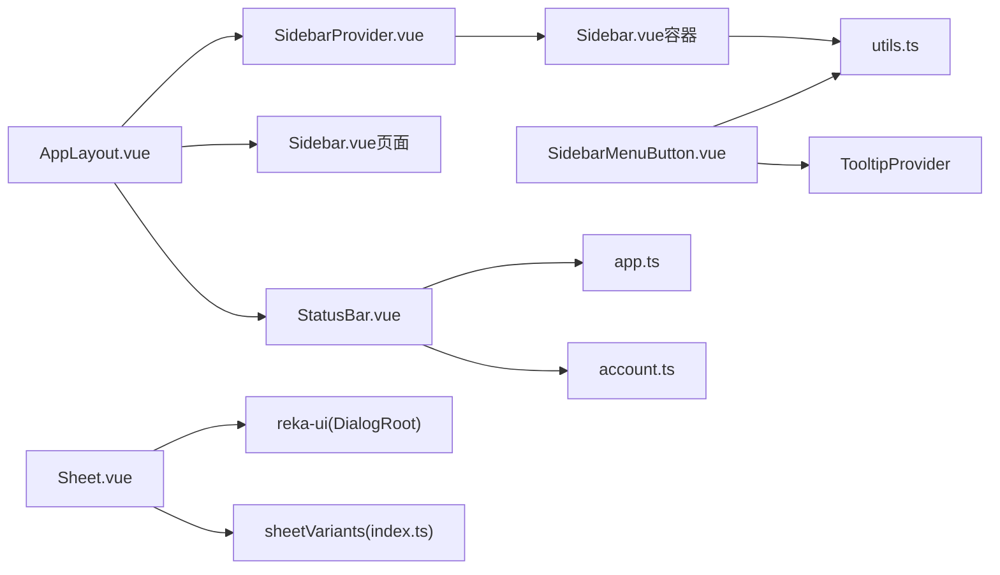

# 布局组件

<cite>
**本文引用的文件**
- [AppLayout.vue](file://src/renderer/src/components/layout/AppLayout.vue)
- [Sidebar.vue](file://src/renderer/src/components/layout/Sidebar.vue)
- [StatusBar.vue](file://src/renderer/src/components/layout/StatusBar.vue)
- [index.ts（侧边栏导出）](file://src/renderer/src/components/ui/sidebar/index.ts)
- [Sidebar.vue（侧边栏容器）](file://src/renderer/src/components/ui/sidebar/Sidebar.vue)
- [SidebarContent.vue](file://src/renderer/src/components/ui/sidebar/SidebarContent.vue)
- [SidebarMenu.vue](file://src/renderer/src/components/ui/sidebar/SidebarMenu.vue)
- [SidebarMenuButton.vue](file://src/renderer/src/components/ui/sidebar/SidebarMenuButton.vue)
- [SidebarProvider.vue](file://src/renderer/src/components/ui/sidebar/SidebarProvider.vue)
- [SidebarTrigger.vue](file://src/renderer/src/components/ui/sidebar/SidebarTrigger.vue)
- [utils.ts（侧边栏上下文与常量）](file://src/renderer/src/components/ui/sidebar/utils.ts)
- [index.ts（抽屉导出）](file://src/renderer/src/components/ui/sheet/index.ts)
- [Sheet.vue（抽屉根组件）](file://src/renderer/src/components/ui/sheet/Sheet.vue)
- [app.ts（应用状态存储）](file://src/renderer/src/stores/app.ts)
- [account.ts（账号状态存储）](file://src/renderer/src/stores/account.ts)
- [utils.ts（工具函数）](file://src/renderer/src/lib/utils.ts)
</cite>

## 目录
1. [简介](#简介)
2. [项目结构](#项目结构)
3. [核心组件](#核心组件)
4. [架构总览](#架构总览)
5. [详细组件分析](#详细组件分析)
6. [依赖分析](#依赖分析)
7. [性能考虑](#性能考虑)
8. [故障排除指南](#故障排除指南)
9. [结论](#结论)

## 简介
本文件为布局相关 UI 组件的 API 参考，覆盖应用布局（AppLayout）、侧边栏（Sidebar）体系、状态栏（StatusBar）以及抽屉（Sheet）组件。内容包括：
- 属性定义与默认值
- 事件回调与触发方式
- 插槽使用与扩展点
- 样式定制与变体
- 响应式行为与布局策略
- 组件间协作模式与状态管理
- 性能优化建议与常见问题排查

## 项目结构
布局组件主要位于渲染端的 layout 与 ui 子目录中，采用“页面级布局 + 可复用 UI 组件”的分层组织：
- 页面布局：AppLayout 负责整体布局骨架，挂载侧边栏、主内容区与状态栏
- 侧边栏体系：由 SidebarProvider 提供上下文，Sidebar 容器根据设备与折叠策略渲染桌面或移动端形态；菜单项通过 SidebarMenuButton 实现交互与提示
- 抽屉体系：Sheet 根据 reka-ui 的 DialogRoot 封装，支持多方位滑入动画与变体
- 状态栏：StatusBar 读取 Pinia 状态，展示任务运行态、当前账号与浏览器路径等信息

图表来源
- [AppLayout.vue:13-23](file://src/renderer/src/components/layout/AppLayout.vue#L13-L23)
- [Sidebar.vue:1-67](file://src/renderer/src/components/layout/Sidebar.vue#L1-L67)
- [StatusBar.vue:1-85](file://src/renderer/src/components/layout/StatusBar.vue#L1-L85)
- [SidebarProvider.vue:1-82](file://src/renderer/src/components/ui/sidebar/SidebarProvider.vue#L1-L82)
- [Sidebar.vue（侧边栏容器）:1-86](file://src/renderer/src/components/ui/sidebar/Sidebar.vue#L1-L86)
- [SidebarContent.vue:1-18](file://src/renderer/src/components/ui/sidebar/SidebarContent.vue#L1-L18)
- [SidebarMenu.vue:1-18](file://src/renderer/src/components/ui/sidebar/SidebarMenu.vue#L1-L18)
- [SidebarMenuButton.vue:1-49](file://src/renderer/src/components/ui/sidebar/SidebarMenuButton.vue#L1-L49)
- [SidebarTrigger.vue:1-27](file://src/renderer/src/components/ui/sidebar/SidebarTrigger.vue#L1-L27)
- [utils.ts（侧边栏上下文与常量）:1-20](file://src/renderer/src/components/ui/sidebar/utils.ts#L1-L20)
- [Sheet.vue（抽屉根组件）:1-20](file://src/renderer/src/components/ui/sheet/Sheet.vue#L1-L20)
- [index.ts（抽屉导出）:1-33](file://src/renderer/src/components/ui/sheet/index.ts#L1-L33)
- [app.ts:18-71](file://src/renderer/src/stores/app.ts#L18-L71)
- [account.ts:19-128](file://src/renderer/src/stores/account.ts#L19-L128)

章节来源
- [AppLayout.vue:1-24](file://src/renderer/src/components/layout/AppLayout.vue#L1-L24)
- [Sidebar.vue:1-67](file://src/renderer/src/components/layout/Sidebar.vue#L1-L67)
- [StatusBar.vue:1-85](file://src/renderer/src/components/layout/StatusBar.vue#L1-L85)

## 核心组件
本节概述各组件职责与关键 API。

- AppLayout
  - 作用：页面级布局容器，提供 SidebarProvider 上下文、挂载侧边栏与主内容区、承载状态栏
  - 关键点：内部组合 SidebarProvider、AppSidebar、SidebarInset（隐含在模板中）、RouterView、StatusBar
  - 适用场景：作为应用根布局，统一管理侧边栏与主内容区的布局关系

- 侧边栏体系（SidebarProvider/Sidebar/SidebarContent/SidebarMenu/SidebarMenuButton/SidebarTrigger）
  - SidebarProvider：提供侧边栏上下文（展开/折叠状态、移动端开关、键盘快捷键、Cookie 持久化），负责响应式判断与状态同步
  - Sidebar：根据设备与可折叠策略渲染桌面固定/浮动/嵌入或移动端抽屉形态，支持左右定位与多种变体
  - SidebarContent：内容区域容器，处理滚动与折叠时的溢出控制
  - SidebarMenu：菜单列表容器，提供横向/纵向布局能力
  - SidebarMenuButton：菜单按钮封装，支持 Tooltip 提示、激活态、尺寸与外观变体
  - SidebarTrigger：触发切换侧边栏的按钮，用于移动端抽屉或桌面折叠切换

- 抽屉体系（Sheet）
  - Sheet：基于 reka-ui 的 DialogRoot 封装，提供多方位（上/下/左/右）滑入动画与变体
  - index.ts：导出所有子组件与 sheetVariants（按 side 分类）

- 状态栏（StatusBar）
  - 作用：展示任务运行状态、当前账号、浏览器路径与系统时间等信息
  - 数据来源：Pinia 应用状态与账号状态，定时刷新时间

章节来源
- [AppLayout.vue:13-23](file://src/renderer/src/components/layout/AppLayout.vue#L13-L23)
- [SidebarProvider.vue:1-82](file://src/renderer/src/components/ui/sidebar/SidebarProvider.vue#L1-L82)
- [Sidebar.vue（侧边栏容器）:1-86](file://src/renderer/src/components/ui/sidebar/Sidebar.vue#L1-L86)
- [SidebarContent.vue:1-18](file://src/renderer/src/components/ui/sidebar/SidebarContent.vue#L1-L18)
- [SidebarMenu.vue:1-18](file://src/renderer/src/components/ui/sidebar/SidebarMenu.vue#L1-L18)
- [SidebarMenuButton.vue:1-49](file://src/renderer/src/components/ui/sidebar/SidebarMenuButton.vue#L1-L49)
- [SidebarTrigger.vue:1-27](file://src/renderer/src/components/ui/sidebar/SidebarTrigger.vue#L1-L27)
- [index.ts（抽屉导出）:1-33](file://src/renderer/src/components/ui/sheet/index.ts#L1-L33)
- [Sheet.vue（抽屉根组件）:1-20](file://src/renderer/src/components/ui/sheet/Sheet.vue#L1-L20)
- [StatusBar.vue:1-85](file://src/renderer/src/components/layout/StatusBar.vue#L1-L85)

## 架构总览
下图展示布局组件的协作关系与数据流：

图表来源
- [SidebarTrigger.vue:12-25](file://src/renderer/src/components/ui/sidebar/SidebarTrigger.vue#L12-L25)
- [SidebarProvider.vue:42-51](file://src/renderer/src/components/ui/sidebar/SidebarProvider.vue#L42-L51)
- [Sidebar.vue（侧边栏容器）:17-17](file://src/renderer/src/components/ui/sidebar/Sidebar.vue#L17-L17)
- [SidebarMenuButton.vue:23-23](file://src/renderer/src/components/ui/sidebar/SidebarMenuButton.vue#L23-L23)
- [AppLayout.vue:14-22](file://src/renderer/src/components/layout/AppLayout.vue#L14-L22)
- [StatusBar.vue:14-38](file://src/renderer/src/components/layout/StatusBar.vue#L14-L38)

## 详细组件分析

### AppLayout（应用布局）
- 用途：页面级布局骨架，统一承载侧边栏、主内容区与状态栏
- 嵌套关系：SidebarProvider → AppSidebar → SidebarInset（隐含）→ RouterView → StatusBar
- 关键点：通过组合子组件实现布局解耦，便于替换与扩展

章节来源
- [AppLayout.vue:13-23](file://src/renderer/src/components/layout/AppLayout.vue#L13-L23)

### 侧边栏体系（SidebarProvider/Sidebar/SidebarContent/SidebarMenu/SidebarMenuButton/SidebarTrigger）

#### SidebarProvider（上下文提供者）
- 属性
  - defaultOpen?: boolean（默认打开状态，默认从 Cookie 读取）
  - open?: boolean（受控模式）
  - class?: string
- 事件
  - update:open(open: boolean)：当 open 改变时触发
- 行为
  - 响应式判断（移动端宽度阈值）
  - 键盘快捷键（Ctrl/Cmd + B）切换
  - Cookie 持久化展开/折叠状态
  - 提供上下文：state、open、setOpen、isMobile、openMobile、setOpenMobile、toggleSidebar

章节来源
- [SidebarProvider.vue:9-28](file://src/renderer/src/components/ui/sidebar/SidebarProvider.vue#L9-L28)
- [SidebarProvider.vue:18-20](file://src/renderer/src/components/ui/sidebar/SidebarProvider.vue#L18-L20)
- [SidebarProvider.vue:46-51](file://src/renderer/src/components/ui/sidebar/SidebarProvider.vue#L46-L51)
- [SidebarProvider.vue:57-65](file://src/renderer/src/components/ui/sidebar/SidebarProvider.vue#L57-L65)

#### Sidebar（侧边栏容器）
- 属性
  - side?: "left" | "right"（默认 left）
  - variant?: "sidebar" | "floating" | "inset"（默认 sidebar）
  - collapsible?: "offcanvas" | "icon" | "none"（默认 offcanvas）
  - class?: string
- 行为
  - 非可折叠模式：直接渲染固定宽度容器
  - 移动端：以抽屉形式呈现，宽度由常量控制
  - 桌面端：根据 variant 与 collapsible 计算布局与动画
  - 通过 data-* 属性传递状态给子组件，便于样式定制

章节来源
- [Sidebar.vue（侧边栏容器）:5-15](file://src/renderer/src/components/ui/sidebar/Sidebar.vue#L5-L15)
- [Sidebar.vue（侧边栏容器）:29-43](file://src/renderer/src/components/ui/sidebar/Sidebar.vue#L29-L43)
- [Sidebar.vue（侧边栏容器）:45-84](file://src/renderer/src/components/ui/sidebar/Sidebar.vue#L45-L84)

#### SidebarContent（内容容器）
- 属性
  - class?: string
- 行为
  - 处理折叠时的溢出隐藏与滚动区域计算
  - 作为菜单组与内容的容器

章节来源
- [SidebarContent.vue:5-7](file://src/renderer/src/components/ui/sidebar/SidebarContent.vue#L5-L7)
- [SidebarContent.vue:10-17](file://src/renderer/src/components/ui/sidebar/SidebarContent.vue#L10-L17)

#### SidebarMenu（菜单列表）
- 属性
  - class?: string
- 行为
  - 提供横向/纵向布局容器，承载菜单项

章节来源
- [SidebarMenu.vue:5-7](file://src/renderer/src/components/ui/sidebar/SidebarMenu.vue#L5-L7)
- [SidebarMenu.vue:10-17](file://src/renderer/src/components/ui/sidebar/SidebarMenu.vue#L10-L17)

#### SidebarMenuButton（菜单按钮）
- 属性
  - as?: string（默认 button）
  - variant?: "default" | "outline"
  - size?: "default" | "sm" | "lg"
  - tooltip?: string | Component（可选提示）
  - 其他原生属性透传
- 行为
  - 在非折叠且非移动端时，可选包裹 Tooltip
  - 透传除 tooltip 外的属性到子组件
  - 支持激活态与尺寸/外观变体

章节来源
- [SidebarMenuButton.vue:13-19](file://src/renderer/src/components/ui/sidebar/SidebarMenuButton.vue#L13-L19)
- [SidebarMenuButton.vue:31-47](file://src/renderer/src/components/ui/sidebar/SidebarMenuButton.vue#L31-L47)

#### SidebarTrigger（触发器）
- 属性
  - class?: string
- 行为
  - 调用上下文 toggleSidebar 切换侧边栏

章节来源
- [SidebarTrigger.vue:8-10](file://src/renderer/src/components/ui/sidebar/SidebarTrigger.vue#L8-L10)
- [SidebarTrigger.vue:12-25](file://src/renderer/src/components/ui/sidebar/SidebarTrigger.vue#L12-L25)

#### 侧边栏常量与上下文（utils.ts）
- 常量
  - SIDEBAR_WIDTH、SIDEBAR_WIDTH_MOBILE、SIDEBAR_WIDTH_ICON、SIDEBAR_KEYBOARD_SHORTCUT
  - SIDEBAR_COOKIE_NAME、SIDEBAR_COOKIE_MAX_AGE
- 上下文
  - useSidebar/provideSidebarContext：暴露 state、open、setOpen、isMobile、openMobile、setOpenMobile、toggleSidebar

章节来源
- [utils.ts（侧边栏上下文与常量）:4-9](file://src/renderer/src/components/ui/sidebar/utils.ts#L4-L9)
- [utils.ts（侧边栏上下文与常量）:11-19](file://src/renderer/src/components/ui/sidebar/utils.ts#L11-L19)

#### 侧边栏导出与变体（index.ts）
- 导出
  - 所有侧边栏子组件与工具
- 变体
  - sidebarMenuButtonVariants：支持 variant/size 变体，便于主题定制

章节来源
- [index.ts（侧边栏导出）:12-36](file://src/renderer/src/components/ui/sidebar/index.ts#L12-L36)
- [index.ts（侧边栏导出）:38-60](file://src/renderer/src/components/ui/sidebar/index.ts#L38-L60)

### 抽屉体系（Sheet）
- Sheet（根组件）
  - 基于 reka-ui 的 DialogRoot 封装，透传属性与事件
- index.ts（导出与变体）
  - 导出 Sheet 及其子组件
  - sheetVariants：按 side（top/bottom/left/right）提供动画与定位变体，支持默认方向与尺寸约束

章节来源
- [Sheet.vue（抽屉根组件）:1-20](file://src/renderer/src/components/ui/sheet/Sheet.vue#L1-L20)
- [index.ts（抽屉导出）:4-32](file://src/renderer/src/components/ui/sheet/index.ts#L4-L32)
- [index.ts（抽屉导出）:13-30](file://src/renderer/src/components/ui/sheet/index.ts#L13-L30)

### 状态栏（StatusBar）
- 属性：无（内部通过 store 与计算属性驱动）
- 事件：无
- 插槽：无
- 行为
  - 定时更新本地时间（每秒）
  - 依据应用状态显示运行态颜色与文本
  - 条件展示当前账号与浏览器路径（带 Tooltip）
- 依赖
  - useAppStore：任务运行态、浏览器路径
  - useAccountStore：默认账号信息

章节来源
- [StatusBar.vue:1-39](file://src/renderer/src/components/layout/StatusBar.vue#L1-L39)
- [StatusBar.vue:42-84](file://src/renderer/src/components/layout/StatusBar.vue#L42-L84)
- [app.ts:24-26](file://src/renderer/src/stores/app.ts#L24-L26)
- [account.ts:27-29](file://src/renderer/src/stores/account.ts#L27-L29)

## 依赖分析
- 组件耦合
  - AppLayout 依赖 SidebarProvider 与页面级组件（Sidebar/StatusBar）
  - Sidebar 依赖 SidebarProvider 上下文与 utils 常量
  - SidebarMenuButton 依赖 Tooltip 与 SidebarProvider 上下文
  - Sheet 依赖 reka-ui 的 DialogRoot 与自身变体定义
  - StatusBar 依赖 Pinia 状态存储
- 外部依赖
  - reka-ui：提供 DialogRoot、TooltipProvider 等基础能力
  - VueUse：媒体查询、事件监听、v-model 同步
  - Tailwind/CVA：样式合并与变体生成

图表来源
- [AppLayout.vue:14-22](file://src/renderer/src/components/layout/AppLayout.vue#L14-L22)
- [Sidebar.vue（侧边栏容器）:17-17](file://src/renderer/src/components/ui/sidebar/Sidebar.vue#L17-L17)
- [SidebarMenuButton.vue:5-7](file://src/renderer/src/components/ui/sidebar/SidebarMenuButton.vue#L5-L7)
- [Sheet.vue（抽屉根组件）:3-3](file://src/renderer/src/components/ui/sheet/Sheet.vue#L3-L3)
- [index.ts（抽屉导出）:13-30](file://src/renderer/src/components/ui/sheet/index.ts#L13-L30)
- [StatusBar.vue:3-15](file://src/renderer/src/components/layout/StatusBar.vue#L3-L15)

## 性能考虑
- 响应式渲染
  - SidebarProvider 使用媒体查询区分移动端，避免在桌面端执行移动端逻辑
- 状态持久化
  - 通过 Cookie 记录侧边栏状态，减少重复计算与 DOM 重排
- 动画与过渡
  - 抽屉与侧边栏使用 CSS 过渡与滑入动画，注意在低端设备上的帧率影响
- 计算属性
  - StatusBar 的时间更新频率较高，建议在组件卸载时清理定时器（已实现）
- 样式合并
  - 使用工具函数合并类名，避免重复样式导致的渲染抖动

## 故障排除指南
- 侧边栏无法切换
  - 检查是否正确包裹 SidebarProvider
  - 确认键盘快捷键冲突（Ctrl/Cmd + B）
  - 检查 Cookie 是否被禁用或过期
- 移动端抽屉不出现
  - 确认设备宽度小于阈值，且 collapsible 不为 "none"
- 状态栏信息不更新
  - 确认 Pinia store 初始化完成
  - 检查定时器是否正常清理（组件卸载时）

章节来源
- [SidebarProvider.vue:22-28](file://src/renderer/src/components/ui/sidebar/SidebarProvider.vue#L22-L28)
- [SidebarProvider.vue:46-51](file://src/renderer/src/components/ui/sidebar/SidebarProvider.vue#L46-L51)
- [utils.ts（侧边栏上下文与常量）:4-9](file://src/renderer/src/components/ui/sidebar/utils.ts#L4-L9)
- [StatusBar.vue:21-29](file://src/renderer/src/components/layout/StatusBar.vue#L21-L29)

## 结论
本布局体系通过 Provider/Container/Item 的分层设计，实现了高内聚、低耦合的布局组件生态。SidebarProvider 提供统一上下文与响应式策略，Sidebar/SidebarMenuButton 等子组件聚焦具体功能与样式变体，Sheet 提供灵活的抽屉能力，StatusBar 则以最小成本接入全局状态。配合 Pinia 状态管理与工具函数，整体具备良好的可扩展性与可维护性。