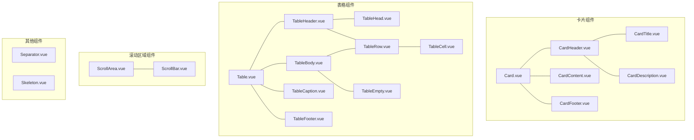
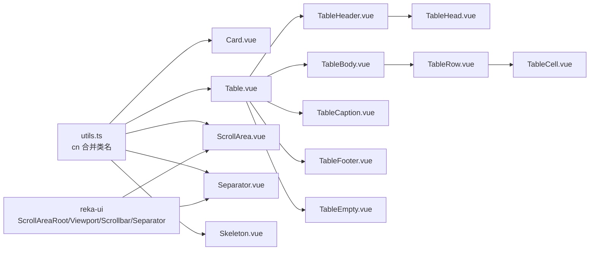
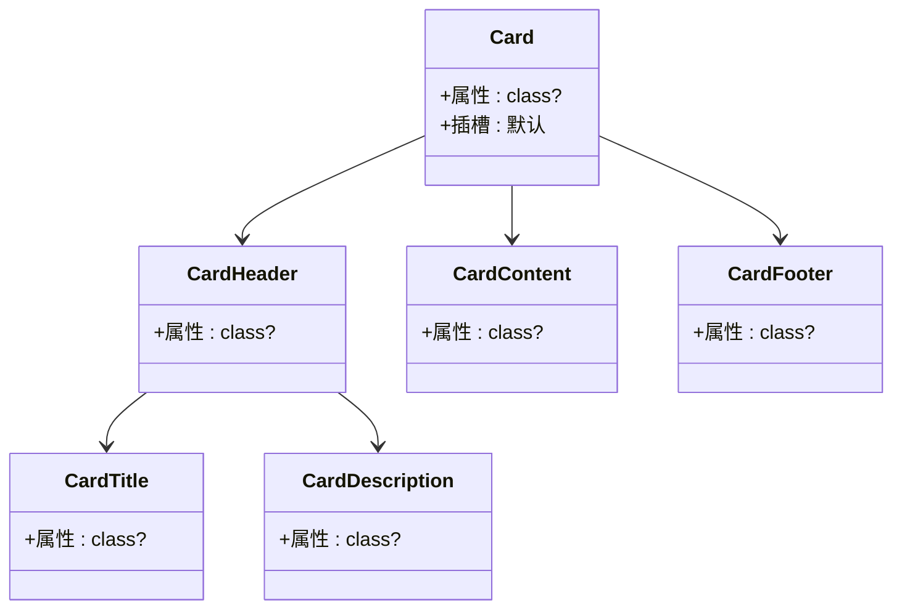
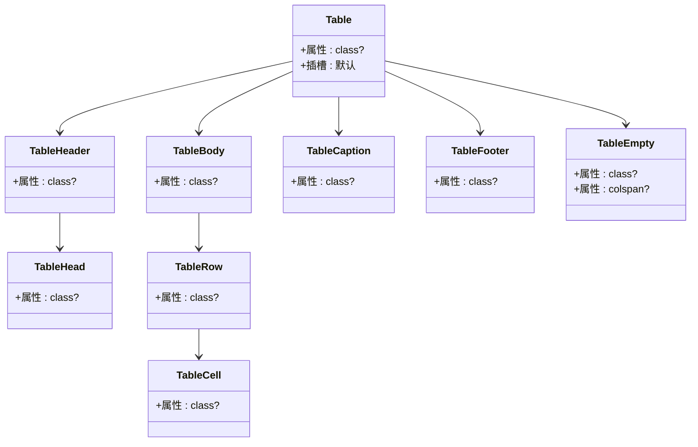
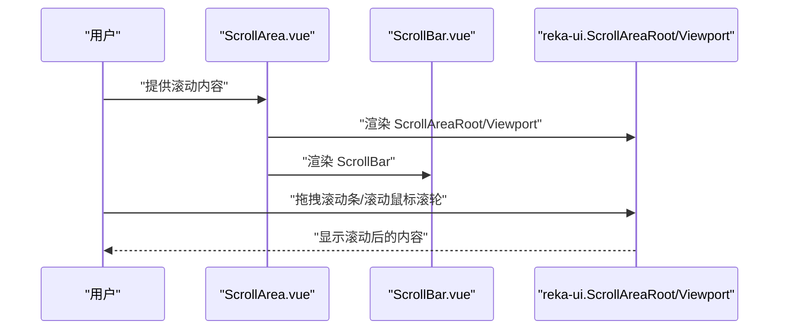
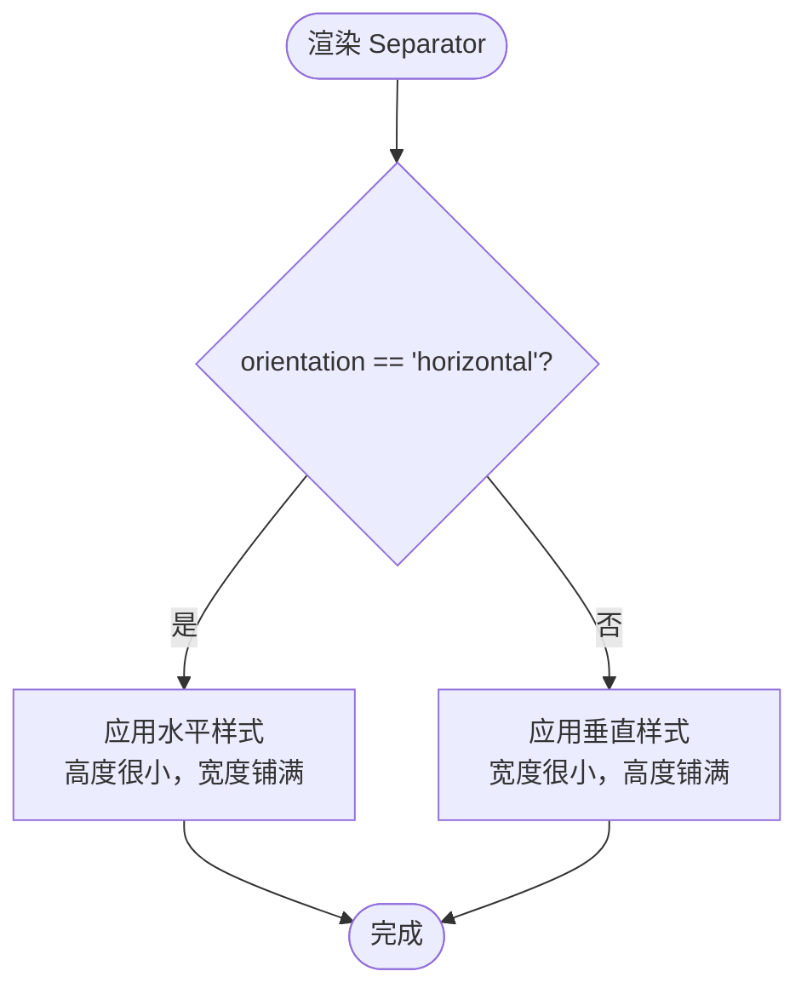
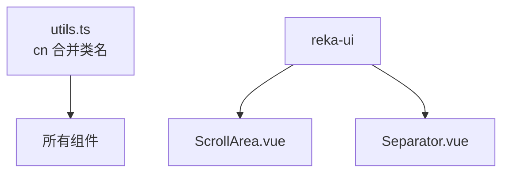

# 数据展示组件

<cite>
**本文引用的文件**
- [Card.vue](file://src/renderer/src/components/ui/card/Card.vue)
- [CardContent.vue](file://src/renderer/src/components/ui/card/CardContent.vue)
- [CardDescription.vue](file://src/renderer/src/components/ui/card/CardDescription.vue)
- [CardFooter.vue](file://src/renderer/src/components/ui/card/CardFooter.vue)
- [CardHeader.vue](file://src/renderer/src/components/ui/card/CardHeader.vue)
- [CardTitle.vue](file://src/renderer/src/components/ui/card/CardTitle.vue)
- [index.ts（卡片导出）](file://src/renderer/src/components/ui/card/index.ts)
- [Table.vue](file://src/renderer/src/components/ui/table/Table.vue)
- [TableBody.vue](file://src/renderer/src/components/ui/table/TableBody.vue)
- [TableCaption.vue](file://src/renderer/src/components/ui/table/TableCaption.vue)
- [TableCell.vue](file://src/renderer/src/components/ui/table/TableCell.vue)
- [TableEmpty.vue](file://src/renderer/src/components/ui/table/TableEmpty.vue)
- [TableFooter.vue](file://src/renderer/src/components/ui/table/TableFooter.vue)
- [TableHead.vue](file://src/renderer/src/components/ui/table/TableHead.vue)
- [TableHeader.vue](file://src/renderer/src/components/ui/table/TableHeader.vue)
- [TableRow.vue](file://src/renderer/src/components/ui/table/TableRow.vue)
- [index.ts（表格导出）](file://src/renderer/src/components/ui/table/index.ts)
- [ScrollArea.vue](file://src/renderer/src/components/ui/scroll-area/ScrollArea.vue)
- [ScrollBar.vue](file://src/renderer/src/components/ui/scroll-area/ScrollBar.vue)
- [index.ts（滚动区域导出）](file://src/renderer/src/components/ui/scroll-area/index.ts)
- [Separator.vue](file://src/renderer/src/components/ui/separator/Separator.vue)
- [index.ts（分隔线导出）](file://src/renderer/src/components/ui/separator/index.ts)
- [Skeleton.vue](file://src/renderer/src/components/ui/skeleton/Skeleton.vue)
- [index.ts（骨架屏导出）](file://src/renderer/src/components/ui/skeleton/index.ts)
- [utils.ts（cn 工具）](file://src/renderer/src/lib/utils.ts)
</cite>

## 目录
1. [简介](#简介)
2. [项目结构](#项目结构)
3. [核心组件](#核心组件)
4. [架构总览](#架构总览)
5. [详细组件分析](#详细组件分析)
6. [依赖分析](#依赖分析)
7. [性能考虑](#性能考虑)
8. [故障排除指南](#故障排除指南)
9. [结论](#结论)
10. [附录：API 参考速查](#附录api-参考速查)

## 简介
本文件为“数据展示”相关 UI 组件的 API 参考与使用指南，覆盖以下组件：
- 卡片（Card）
- 表格（Table）
- 滚动区域（ScrollArea）
- 分隔线（Separator）
- 骨架屏（Skeleton）

内容包括：属性定义、事件处理、插槽使用、样式定制、数据绑定方式、响应式布局与性能优化策略，并给出在不同数据规模下的最佳实践建议。

## 项目结构
这些组件位于渲染端（renderer）的 UI 组件目录中，采用按功能域分层组织：
- 卡片：由根组件与若干子区块组成，便于组合使用
- 表格：由容器与多个语义化子组件构成，形成完整的表格结构
- 滚动区域：基于 reka-ui 的 ScrollAreaRoot/Viewport/Scrollbar 组合封装
- 分隔线：基于 reka-ui 的 Separator 封装
- 骨架屏：基础占位元素，配合动画实现加载态

图表来源
- [Card.vue:1-22](file://src/renderer/src/components/ui/card/Card.vue#L1-L22)
- [Table.vue:1-17](file://src/renderer/src/components/ui/table/Table.vue#L1-L17)
- [ScrollArea.vue:1-27](file://src/renderer/src/components/ui/scroll-area/ScrollArea.vue#L1-L27)
- [Separator.vue:1-30](file://src/renderer/src/components/ui/separator/Separator.vue#L1-L30)
- [Skeleton.vue:1-18](file://src/renderer/src/components/ui/skeleton/Skeleton.vue#L1-L18)

章节来源
- [Card.vue:1-22](file://src/renderer/src/components/ui/card/Card.vue#L1-L22)
- [Table.vue:1-17](file://src/renderer/src/components/ui/table/Table.vue#L1-L17)
- [ScrollArea.vue:1-27](file://src/renderer/src/components/ui/scroll-area/ScrollArea.vue#L1-L27)
- [Separator.vue:1-30](file://src/renderer/src/components/ui/separator/Separator.vue#L1-L30)
- [Skeleton.vue:1-18](file://src/renderer/src/components/ui/skeleton/Skeleton.vue#L1-L18)

## 核心组件
本节概述各组件的职责与通用能力：
- 卡片（Card）：用于承载一组相关内容，支持通过子区块组件进行结构化组织
- 表格（Table）：提供响应式容器与语义化子组件，适配大量数据与交互场景
- 滚动区域（ScrollArea）：提供可定制滚动条与角落，增强长内容可读性
- 分隔线（Separator）：水平或垂直分隔符，支持装饰性与语义化两种模式
- 骨架屏（Skeleton）：提供加载态占位，提升感知性能

章节来源
- [Card.vue:1-22](file://src/renderer/src/components/ui/card/Card.vue#L1-L22)
- [Table.vue:1-17](file://src/renderer/src/components/ui/table/Table.vue#L1-L17)
- [ScrollArea.vue:1-27](file://src/renderer/src/components/ui/scroll-area/ScrollArea.vue#L1-L27)
- [Separator.vue:1-30](file://src/renderer/src/components/ui/separator/Separator.vue#L1-L30)
- [Skeleton.vue:1-18](file://src/renderer/src/components/ui/skeleton/Skeleton.vue#L1-L18)

## 架构总览
组件间关系与依赖如下：
- 所有组件均通过工具函数进行类名合并，保证样式一致性
- 滚动区域与分隔线组件基于 reka-ui 的原生组件进行二次封装
- 表格组件内部组合多个语义化子组件，形成完整的表格结构

图表来源
- [utils.ts（cn 工具）](file://src/renderer/src/lib/utils.ts)
- [ScrollArea.vue:1-27](file://src/renderer/src/components/ui/scroll-area/ScrollArea.vue#L1-L27)
- [Separator.vue:1-30](file://src/renderer/src/components/ui/separator/Separator.vue#L1-L30)
- [Table.vue:1-17](file://src/renderer/src/components/ui/table/Table.vue#L1-L17)
- [TableHeader.vue:1-15](file://src/renderer/src/components/ui/table/TableHeader.vue#L1-L15)
- [TableBody.vue:1-15](file://src/renderer/src/components/ui/table/TableBody.vue#L1-L15)
- [TableCaption.vue:1-15](file://src/renderer/src/components/ui/table/TableCaption.vue#L1-L15)
- [TableHead.vue:1-15](file://src/renderer/src/components/ui/table/TableHead.vue#L1-L15)
- [TableRow.vue:1-15](file://src/renderer/src/components/ui/table/TableRow.vue#L1-L15)
- [TableCell.vue:1-22](file://src/renderer/src/components/ui/table/TableCell.vue#L1-L22)
- [TableFooter.vue:1-15](file://src/renderer/src/components/ui/table/TableFooter.vue#L1-L15)
- [TableEmpty.vue:1-35](file://src/renderer/src/components/ui/table/TableEmpty.vue#L1-L35)

## 详细组件分析

### 卡片（Card）
- 组件定位：容器型组件，包裹卡片内容，提供统一的边框、背景与阴影
- 属性
  - class：可选，传入额外的 CSS 类名，通过工具函数合并到根元素
- 插槽
  - 默认插槽：放置卡片内部内容
- 子区块组件
  - CardHeader：卡片头部容器，控制内边距与间距
  - CardTitle：标题元素，提供字号与字重样式
  - CardDescription：描述文本，提供辅助信息样式
  - CardContent：主体内容容器，控制上内边距
  - CardFooter：底部操作区容器，控制对齐与内边距
- 数据绑定
  - 通过 class 属性实现样式扩展；子区块组件同样支持 class
- 事件处理
  - 无内置事件，可通过父级容器或子元素绑定事件
- 样式定制
  - 基于主题变量与工具函数，支持通过 class 覆盖默认样式
- 最佳实践
  - 使用子区块组件构建清晰的卡片结构
  - 在大数据列表中作为单元容器，避免过度嵌套

图表来源
- [Card.vue:1-22](file://src/renderer/src/components/ui/card/Card.vue#L1-L22)
- [CardHeader.vue:1-15](file://src/renderer/src/components/ui/card/CardHeader.vue#L1-L15)
- [CardTitle.vue:1-19](file://src/renderer/src/components/ui/card/CardTitle.vue#L1-L19)
- [CardDescription.vue:1-15](file://src/renderer/src/components/ui/card/CardDescription.vue#L1-L15)
- [CardContent.vue:1-15](file://src/renderer/src/components/ui/card/CardContent.vue#L1-L15)
- [CardFooter.vue:1-15](file://src/renderer/src/components/ui/card/CardFooter.vue#L1-L15)

章节来源
- [Card.vue:1-22](file://src/renderer/src/components/ui/card/Card.vue#L1-L22)
- [CardHeader.vue:1-15](file://src/renderer/src/components/ui/card/CardHeader.vue#L1-L15)
- [CardTitle.vue:1-19](file://src/renderer/src/components/ui/card/CardTitle.vue#L1-L19)
- [CardDescription.vue:1-15](file://src/renderer/src/components/ui/card/CardDescription.vue#L1-L15)
- [CardContent.vue:1-15](file://src/renderer/src/components/ui/card/CardContent.vue#L1-L15)
- [CardFooter.vue:1-15](file://src/renderer/src/components/ui/card/CardFooter.vue#L1-L15)
- [index.ts（卡片导出）:1-7](file://src/renderer/src/components/ui/card/index.ts#L1-L7)

### 表格（Table）
- 组件定位：提供响应式表格容器与语义化子组件，适配大量数据与交互
- 容器组件
  - Table：根容器，提供横向溢出与表格基础样式
- 头部/主体/页脚
  - TableHeader/TableBody/TableFooter：表头/主体/页脚容器
  - TableCaption：表格标题
  - TableHead：表头单元格
  - TableRow：表格行
  - TableCell：表格单元格
- 特殊状态
  - TableEmpty：空状态行，支持跨列配置
- 属性
  - class：可选，传入额外的 CSS 类名，通过工具函数合并到对应元素
  - TableEmpty 支持 colspan 默认值
- 插槽
  - 默认插槽：放置子组件
- 数据绑定
  - 通过 class 属性实现样式扩展；子组件同样支持 class
- 事件处理
  - 无内置事件，可通过父级容器或子元素绑定事件
- 样式定制
  - 基于主题变量与工具函数，支持通过 class 覆盖默认样式
- 性能与虚拟滚动
  - 该实现未内置虚拟滚动；在大数据量场景下建议结合外部库或分页策略
- 最佳实践
  - 使用 TableEmpty 提供空状态提示
  - 使用 TableCaption 提供表格说明
  - 使用 TableHead/TableCell 明确语义与对齐

图表来源
- [Table.vue:1-17](file://src/renderer/src/components/ui/table/Table.vue#L1-L17)
- [TableHeader.vue:1-15](file://src/renderer/src/components/ui/table/TableHeader.vue#L1-L15)
- [TableBody.vue:1-15](file://src/renderer/src/components/ui/table/TableBody.vue#L1-L15)
- [TableCaption.vue:1-15](file://src/renderer/src/components/ui/table/TableCaption.vue#L1-L15)
- [TableHead.vue:1-15](file://src/renderer/src/components/ui/table/TableHead.vue#L1-L15)
- [TableRow.vue:1-15](file://src/renderer/src/components/ui/table/TableRow.vue#L1-L15)
- [TableCell.vue:1-22](file://src/renderer/src/components/ui/table/TableCell.vue#L1-L22)
- [TableFooter.vue:1-15](file://src/renderer/src/components/ui/table/TableFooter.vue#L1-L15)
- [TableEmpty.vue:1-35](file://src/renderer/src/components/ui/table/TableEmpty.vue#L1-L35)

章节来源
- [Table.vue:1-17](file://src/renderer/src/components/ui/table/Table.vue#L1-L17)
- [TableHeader.vue:1-15](file://src/renderer/src/components/ui/table/TableHeader.vue#L1-L15)
- [TableBody.vue:1-15](file://src/renderer/src/components/ui/table/TableBody.vue#L1-L15)
- [TableCaption.vue:1-15](file://src/renderer/src/components/ui/table/TableCaption.vue#L1-L15)
- [TableHead.vue:1-15](file://src/renderer/src/components/ui/table/TableHead.vue#L1-L15)
- [TableRow.vue:1-15](file://src/renderer/src/components/ui/table/TableRow.vue#L1-L15)
- [TableCell.vue:1-22](file://src/renderer/src/components/ui/table/TableCell.vue#L1-L22)
- [TableFooter.vue:1-15](file://src/renderer/src/components/ui/table/TableFooter.vue#L1-L15)
- [TableEmpty.vue:1-35](file://src/renderer/src/components/ui/table/TableEmpty.vue#L1-L35)
- [index.ts（表格导出）:1-10](file://src/renderer/src/components/ui/table/index.ts#L1-L10)

### 滚动区域（ScrollArea）
- 组件定位：提供可定制滚动条与角落，增强长内容可读性
- 属性
  - class：可选，传入额外的 CSS 类名
  - 内部委托了 reka-ui 的 ScrollAreaRoot 所有可用属性（如滚动方向、视口行为等）
- 插槽
  - 默认插槽：放置需要滚动的内容
- 子组件
  - ScrollBar：滚动条，支持方向配置
- 数据绑定
  - 通过 class 属性实现样式扩展；内部使用工具函数合并类名
- 事件处理
  - 无内置事件，可通过 reka-ui 提供的回调或父级容器绑定事件
- 样式定制
  - 基于主题变量与工具函数，支持通过 class 覆盖默认样式
- 性能与虚拟滚动
  - 该实现未内置虚拟滚动；在大数据量场景下建议结合外部库或分页策略
- 最佳实践
  - 在对话框、侧边栏或长列表中使用，确保滚动条样式一致
  - 注意容器尺寸设置，避免滚动失效

图表来源
- [ScrollArea.vue:1-27](file://src/renderer/src/components/ui/scroll-area/ScrollArea.vue#L1-L27)
- [ScrollBar.vue:1-29](file://src/renderer/src/components/ui/scroll-area/ScrollBar.vue#L1-L29)

章节来源
- [ScrollArea.vue:1-27](file://src/renderer/src/components/ui/scroll-area/ScrollArea.vue#L1-L27)
- [ScrollBar.vue:1-29](file://src/renderer/src/components/ui/scroll-area/ScrollBar.vue#L1-L29)
- [index.ts（滚动区域导出）:1-3](file://src/renderer/src/components/ui/scroll-area/index.ts#L1-L3)

### 分隔线（Separator）
- 组件定位：水平或垂直分隔符，支持装饰性与语义化两种模式
- 属性
  - class：可选，传入额外的 CSS 类名
  - orientation：方向，默认 horizontal
  - decorative：是否装饰性，默认 true
- 插槽
  - 无插槽，仅渲染基础元素
- 数据绑定
  - 通过 class 属性实现样式扩展
- 事件处理
  - 无内置事件
- 样式定制
  - 基于主题变量与工具函数，支持通过 class 覆盖默认样式
- 最佳实践
  - 语义化场景下保持 decorative 为 true，避免破坏无障碍语义
  - 水平分隔线用于段落或区块之间，垂直分隔线用于侧边栏或菜单

图表来源
- [Separator.vue:1-30](file://src/renderer/src/components/ui/separator/Separator.vue#L1-L30)

章节来源
- [Separator.vue:1-30](file://src/renderer/src/components/ui/separator/Separator.vue#L1-L30)
- [index.ts（分隔线导出）:1-2](file://src/renderer/src/components/ui/separator/index.ts#L1-L2)

### 骨架屏（Skeleton）
- 组件定位：提供加载态占位，提升感知性能
- 属性
  - class：可选，传入额外的 CSS 类名
- 插槽
  - 无插槽，仅渲染基础元素
- 数据绑定
  - 通过 class 属性实现样式扩展
- 事件处理
  - 无内置事件
- 样式定制
  - 基于主题变量与工具函数，支持通过 class 覆盖默认样式
- 最佳实践
  - 在数据请求期间显示骨架屏，减少白屏时间
  - 结合动画与颜色透明度，营造自然的加载效果

章节来源
- [Skeleton.vue:1-18](file://src/renderer/src/components/ui/skeleton/Skeleton.vue#L1-L18)
- [index.ts（骨架屏导出）:1-2](file://src/renderer/src/components/ui/skeleton/index.ts#L1-L2)

## 依赖分析
- 工具函数
  - 所有组件均通过工具函数进行类名合并，保证样式一致性与可扩展性
- 外部依赖
  - 滚动区域与分隔线组件基于 reka-ui 进行二次封装
- 导出方式
  - 各组件通过各自的 index.ts 文件集中导出，便于按需引入

图表来源
- [utils.ts（cn 工具）](file://src/renderer/src/lib/utils.ts)
- [ScrollArea.vue:1-27](file://src/renderer/src/components/ui/scroll-area/ScrollArea.vue#L1-L27)
- [Separator.vue:1-30](file://src/renderer/src/components/ui/separator/Separator.vue#L1-L30)

章节来源
- [utils.ts（cn 工具）](file://src/renderer/src/lib/utils.ts)
- [ScrollArea.vue:1-27](file://src/renderer/src/components/ui/scroll-area/ScrollArea.vue#L1-L27)
- [Separator.vue:1-30](file://src/renderer/src/components/ui/separator/Separator.vue#L1-L30)

## 性能考虑
- 通用策略
  - 使用 class 属性进行样式扩展，避免内联样式的重复计算
  - 通过工具函数合并类名，减少不必要的 DOM 属性更新
- 大数据量场景
  - 表格与滚动区域未内置虚拟滚动，建议结合外部库或分页策略
  - 骨架屏用于提升感知性能，减少长列表渲染时的闪烁
- 响应式布局
  - 表格容器提供横向溢出，适合移动端查看
  - 卡片组件通过子区块组件实现灵活布局

## 故障排除指南
- 滚动区域不生效
  - 检查容器尺寸设置，确保滚动区域有明确的高度或宽度
  - 确认内容超出容器边界，否则不会触发滚动
- 分隔线方向错误
  - 检查 orientation 属性是否正确设置
- 骨架屏不显示
  - 确认在数据加载完成前已渲染骨架屏
  - 检查 class 是否被意外覆盖导致不可见

## 结论
上述组件提供了数据展示的基础能力：卡片用于内容分组与结构化呈现，表格用于结构化数据的展示与交互，滚动区域增强了长内容的可读性，分隔线用于视觉与语义分隔，骨架屏提升了加载体验。在大数据量场景下，建议结合外部库或分页策略以获得更优性能。

## 附录：API 参考速查
- 卡片（Card）
  - 属性：class?
  - 插槽：默认
  - 子区块：CardHeader、CardTitle、CardDescription、CardContent、CardFooter
- 表格（Table）
  - 容器：Table（class?）
  - 头部/主体/页脚：TableHeader、TableBody、TableCaption、TableHead、TableRow、TableCell、TableFooter、TableEmpty（colspan?）
- 滚动区域（ScrollArea）
  - 属性：class?；委托 reka-ui 的 ScrollAreaRoot 所有属性
  - 子组件：ScrollBar（orientation?）
- 分隔线（Separator）
  - 属性：class?；orientation（horizontal/vertical，默认 horizontal）；decorative（默认 true）
- 骨架屏（Skeleton）
  - 属性：class?

章节来源
- [Card.vue:1-22](file://src/renderer/src/components/ui/card/Card.vue#L1-L22)
- [Table.vue:1-17](file://src/renderer/src/components/ui/table/Table.vue#L1-L17)
- [ScrollArea.vue:1-27](file://src/renderer/src/components/ui/scroll-area/ScrollArea.vue#L1-L27)
- [Separator.vue:1-30](file://src/renderer/src/components/ui/separator/Separator.vue#L1-L30)
- [Skeleton.vue:1-18](file://src/renderer/src/components/ui/skeleton/Skeleton.vue#L1-L18)
- [index.ts（卡片导出）:1-7](file://src/renderer/src/components/ui/card/index.ts#L1-L7)
- [index.ts（表格导出）:1-10](file://src/renderer/src/components/ui/table/index.ts#L1-L10)
- [index.ts（滚动区域导出）:1-3](file://src/renderer/src/components/ui/scroll-area/index.ts#L1-L3)
- [index.ts（分隔线导出）:1-2](file://src/renderer/src/components/ui/separator/index.ts#L1-L2)
- [index.ts（骨架屏导出）:1-2](file://src/renderer/src/components/ui/skeleton/index.ts#L1-L2)