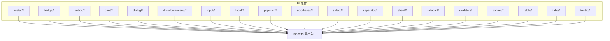
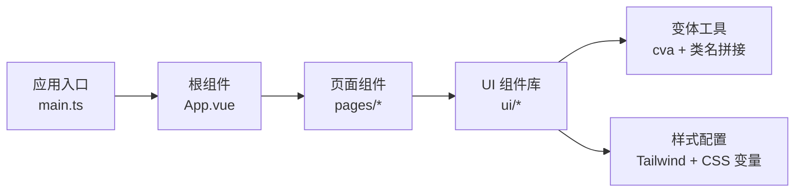
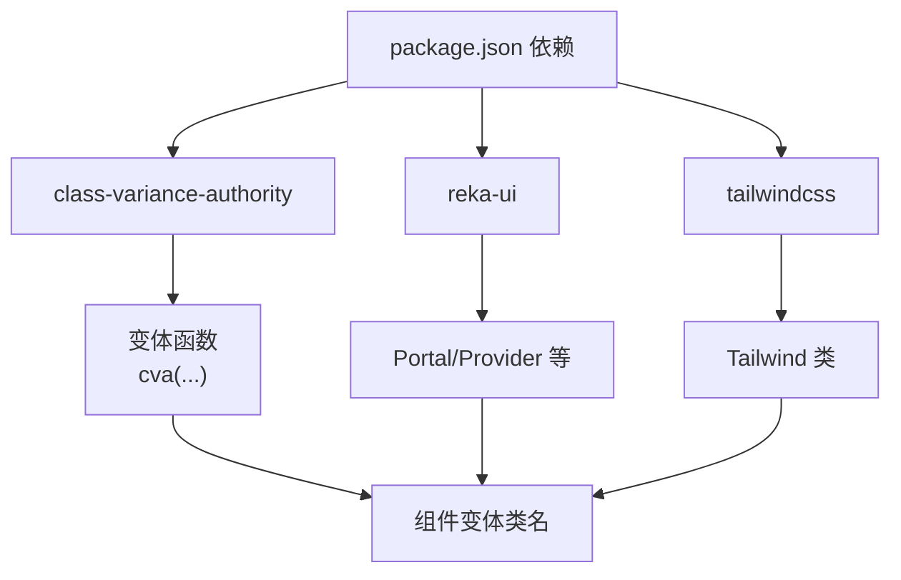

# 组件API参考

<cite>
**本文引用的文件**
- [src/renderer/src/components/ui/avatar/index.ts](file://src/renderer/src/components/ui/avatar/index.ts)
- [src/renderer/src/components/ui/badge/index.ts](file://src/renderer/src/components/ui/badge/index.ts)
- [src/renderer/src/components/ui/button/index.ts](file://src/renderer/src/components/ui/button/index.ts)
- [src/renderer/src/components/ui/card/index.ts](file://src/renderer/src/components/ui/card/index.ts)
- [src/renderer/src/components/ui/dialog/index.ts](file://src/renderer/src/components/ui/dialog/index.ts)
- [src/renderer/src/components/ui/dropdown-menu/index.ts](file://src/renderer/src/components/ui/dropdown-menu/index.ts)
- [src/renderer/src/components/ui/input/index.ts](file://src/renderer/src/components/ui/input/index.ts)
- [src/renderer/src/components/ui/label/index.ts](file://src/renderer/src/components/ui/label/index.ts)
- [src/renderer/src/components/ui/popover/index.ts](file://src/renderer/src/components/ui/popover/index.ts)
- [src/renderer/src/components/ui/scroll-area/index.ts](file://src/renderer/src/components/ui/scroll-area/index.ts)
- [src/renderer/src/components/ui/select/index.ts](file://src/renderer/src/components/ui/select/index.ts)
- [src/renderer/src/components/ui/separator/index.ts](file://src/renderer/src/components/ui/separator/index.ts)
- [src/renderer/src/components/ui/sheet/index.ts](file://src/renderer/src/components/ui/sheet/index.ts)
- [src/renderer/src/components/ui/sidebar/index.ts](file://src/renderer/src/components/ui/sidebar/index.ts)
- [src/renderer/src/components/ui/skeleton/index.ts](file://src/renderer/src/components/ui/skeleton/index.ts)
- [src/renderer/src/components/ui/sonner/index.ts](file://src/renderer/src/components/ui/sonner/index.ts)
- [src/renderer/src/components/ui/table/index.ts](file://src/renderer/src/components/ui/table/index.ts)
- [src/renderer/src/components/ui/tabs/index.ts](file://src/renderer/src/components/ui/tabs/index.ts)
- [src/renderer/src/components/ui/tooltip/index.ts](file://src/renderer/src/components/ui/tooltip/index.ts)
- [src/renderer/src/lib/utils.ts](file://src/renderer/src/lib/utils.ts)
- [src/renderer/src/main.ts](file://src/renderer/src/main.ts)
- [src/renderer/src/App.vue](file://src/renderer/src/App.vue)
- [package.json](file://package.json)
- [tailwind.config.js](file://tailwind.config.js)
</cite>

## 目录
1. [简介](#简介)
2. [项目结构](#项目结构)
3. [核心组件](#核心组件)
4. [架构总览](#架构总览)
5. [详细组件分析](#详细组件分析)
6. [依赖分析](#依赖分析)
7. [性能考虑](#性能考虑)
8. [故障排除指南](#故障排除指南)
9. [结论](#结论)
10. [附录](#附录)

## 简介
本文件为 AutoOps UI 组件系统的 API 参考文档，覆盖渲染端（renderer）中基于 Vue 的 UI 组件库。内容包括：
- 所有自定义组件的属性（props）、事件、插槽与方法
- 组件变体与样式定制（通过变体函数与 Tailwind 类）
- 使用示例、组合模式与最佳实践
- 组件间依赖关系、状态管理与性能优化建议
- 主题定制、响应式设计与无障碍访问支持

## 项目结构
UI 组件集中于 src/renderer/src/components/ui 下，按功能域拆分子目录，每个子目录通常包含若干 Vue 组件与一个 index.ts 导出入口，用于统一导出组件与变体工具。

图表来源
- [src/renderer/src/components/ui/avatar/index.ts:1-26](file://src/renderer/src/components/ui/avatar/index.ts#L1-L26)
- [src/renderer/src/components/ui/badge/index.ts:1-27](file://src/renderer/src/components/ui/badge/index.ts#L1-L27)
- [src/renderer/src/components/ui/button/index.ts:1-39](file://src/renderer/src/components/ui/button/index.ts#L1-L39)
- [src/renderer/src/components/ui/card/index.ts:1-7](file://src/renderer/src/components/ui/card/index.ts#L1-L7)
- [src/renderer/src/components/ui/dialog/index.ts:1-10](file://src/renderer/src/components/ui/dialog/index.ts#L1-L10)
- [src/renderer/src/components/ui/dropdown-menu/index.ts:1-17](file://src/renderer/src/components/ui/dropdown-menu/index.ts#L1-L17)
- [src/renderer/src/components/ui/input/index.ts:1-2](file://src/renderer/src/components/ui/input/index.ts#L1-L2)
- [src/renderer/src/components/ui/label/index.ts:1-2](file://src/renderer/src/components/ui/label/index.ts#L1-L2)
- [src/renderer/src/components/ui/popover/index.ts:1-5](file://src/renderer/src/components/ui/popover/index.ts#L1-L5)
- [src/renderer/src/components/ui/scroll-area/index.ts:1-3](file://src/renderer/src/components/ui/scroll-area/index.ts#L1-L3)
- [src/renderer/src/components/ui/select/index.ts:1-12](file://src/renderer/src/components/ui/select/index.ts#L1-L12)
- [src/renderer/src/components/ui/separator/index.ts:1-2](file://src/renderer/src/components/ui/separator/index.ts#L1-L2)
- [src/renderer/src/components/ui/sheet/index.ts:1-33](file://src/renderer/src/components/ui/sheet/index.ts#L1-L33)
- [src/renderer/src/components/ui/sidebar/index.ts:1-61](file://src/renderer/src/components/ui/sidebar/index.ts#L1-L61)
- [src/renderer/src/components/ui/skeleton/index.ts:1-2](file://src/renderer/src/components/ui/skeleton/index.ts#L1-L2)
- [src/renderer/src/components/ui/sonner/index.ts:1-2](file://src/renderer/src/components/ui/sonner/index.ts#L1-L2)
- [src/renderer/src/components/ui/table/index.ts](file://src/renderer/src/components/ui/table/index.ts)
- [src/renderer/src/components/ui/tabs/index.ts](file://src/renderer/src/components/ui/tabs/index.ts)
- [src/renderer/src/components/ui/tooltip/index.ts](file://src/renderer/src/components/ui/tooltip/index.ts)

章节来源
- [src/renderer/src/components/ui/avatar/index.ts:1-26](file://src/renderer/src/components/ui/avatar/index.ts#L1-L26)
- [src/renderer/src/components/ui/button/index.ts:1-39](file://src/renderer/src/components/ui/button/index.ts#L1-L39)
- [src/renderer/src/components/ui/sheet/index.ts:1-33](file://src/renderer/src/components/ui/sheet/index.ts#L1-L33)
- [src/renderer/src/components/ui/sidebar/index.ts:1-61](file://src/renderer/src/components/ui/sidebar/index.ts#L1-L61)

## 核心组件
本节概述各组件族的关键能力与通用约定：
- 变体系统：多数容器类组件（如 Button、Sheet、Sidebar）通过变体函数生成类名，支持 variant/size 等参数驱动样式。
- 组合模式：容器组件常由多个子组件组成（如 Card、Dialog、Sheet、Sidebar），通过具名插槽或子元素组织内容。
- 无障碍与可访问性：组件遵循语义化标签与键盘交互约定；部分复合组件提供 Provider/Trigger/Content 结构以提升可访问性。
- 响应式与主题：通过 Tailwind 类与 CSS 变量实现响应式布局与主题切换；变体函数统一管理尺寸与风格。

章节来源
- [src/renderer/src/components/ui/button/index.ts:1-39](file://src/renderer/src/components/ui/button/index.ts#L1-L39)
- [src/renderer/src/components/ui/sheet/index.ts:1-33](file://src/renderer/src/components/ui/sheet/index.ts#L1-L33)
- [src/renderer/src/components/ui/sidebar/index.ts:1-61](file://src/renderer/src/components/ui/sidebar/index.ts#L1-L61)

## 架构总览
UI 组件采用“分层模块 + 统一导出”的组织方式，便于按需引入与 Tree-shaking。组件间通过 props/事件/插槽进行通信，样式通过变体函数与 Tailwind 类控制。

图表来源
- [src/renderer/src/main.ts](file://src/renderer/src/main.ts)
- [src/renderer/src/App.vue](file://src/renderer/src/App.vue)
- [src/renderer/src/lib/utils.ts](file://src/renderer/src/lib/utils.ts)

章节来源
- [src/renderer/src/main.ts](file://src/renderer/src/main.ts)
- [src/renderer/src/App.vue](file://src/renderer/src/App.vue)
- [src/renderer/src/lib/utils.ts](file://src/renderer/src/lib/utils.ts)

## 详细组件分析

### 按钮 Button
- 组件职责：承载点击交互，支持多种视觉风格与尺寸。
- 变体与尺寸：
  - variant: default、destructive、outline、secondary、ghost、link
  - size: default、xs、sm、lg、icon、icon-sm、icon-lg
- 关键属性（props）：继承原生按钮属性（type、disabled 等），可通过变体函数传入 variant/size 控制样式。
- 事件：click 等原生事件透传。
- 插槽：默认插槽用于放置按钮文本或图标。
- 方法：无公开实例方法。
- 最佳实践：
  - 图标按钮优先使用 icon/icon-sm 尺寸。
  - 需要强调操作时使用 destructive 或 outline。
- 性能建议：避免在按钮内部频繁重渲染大组件；必要时使用 v-memo 或保持浅比较。

章节来源
- [src/renderer/src/components/ui/button/index.ts:1-39](file://src/renderer/src/components/ui/button/index.ts#L1-L39)

### 徽章 Badge
- 组件职责：展示状态、计数或标签信息。
- 变体：
  - variant: default、secondary、destructive、outline
- 默认变体：variant="default"
- 属性：无额外业务属性，主要通过 variant 控制外观。
- 事件：无。
- 插槽：默认插槽用于显示徽章内容。
- 最佳实践：配合状态型数据使用，确保颜色语义清晰。

章节来源
- [src/renderer/src/components/ui/badge/index.ts:1-27](file://src/renderer/src/components/ui/badge/index.ts#L1-L27)

### 头像 Avatar
- 组件职责：展示用户头像与占位符。
- 变体：
  - size: sm、base、lg
  - shape: circle、square
- 属性：无额外业务属性，主要通过 size/shape 控制外观。
- 事件：无。
- 插槽：AvatarImage、AvatarFallback 子组件用于加载图片与回退占位。
- 最佳实践：结合占位图与懒加载策略，避免首屏阻塞。

章节来源
- [src/renderer/src/components/ui/avatar/index.ts:1-26](file://src/renderer/src/components/ui/avatar/index.ts#L1-L26)

### 卡片 Card
- 组件职责：内容区块容器，支持头部、主体、描述、标题、页脚等子区域。
- 子组件：Card、CardContent、CardDescription、CardFooter、CardHeader、CardTitle。
- 属性：Card 支持 class 等通用属性；子组件无特殊属性。
- 事件：无。
- 插槽：各子区域通过具名插槽组织内容。
- 最佳实践：将卡片作为独立信息单元，避免嵌套过深。

章节来源
- [src/renderer/src/components/ui/card/index.ts:1-7](file://src/renderer/src/components/ui/card/index.ts#L1-L7)

### 对话框 Dialog
- 组件职责：模态对话框，支持触发器、内容区、标题、描述、底部等。
- 子组件：Dialog、DialogClose、DialogContent、DialogDescription、DialogFooter、DialogHeader、DialogScrollContent、DialogTitle、DialogTrigger。
- 属性：Dialog 支持 open 等状态控制；子组件无额外属性。
- 事件：无。
- 插槽：无；通过子组件组织内容。
- 最佳实践：使用 DialogTrigger 触发，DialogScrollContent 支持滚动内容；注意焦点管理与 ESC 关闭。

章节来源
- [src/renderer/src/components/ui/dialog/index.ts:1-10](file://src/renderer/src/components/ui/dialog/index.ts#L1-L10)

### 下拉菜单 DropdownMenu
- 组件职责：下拉菜单与子菜单，支持单选、多选、分组、快捷键等。
- 子组件：DropdownMenu、DropdownMenuCheckboxItem、DropdownMenuContent、DropdownMenuGroup、DropdownMenuItem、DropdownMenuLabel、DropdownMenuRadioGroup、DropdownMenuRadioItem、DropdownMenuSeparator、DropdownMenuShortcut、DropdownMenuSub、DropdownMenuSubContent、DropdownMenuSubTrigger、DropdownMenuTrigger、DropdownMenuPortal。
- 属性：DropdownMenu 支持 open 等状态控制；子组件无额外属性。
- 事件：无。
- 插槽：无；通过子组件组织内容。
- 最佳实践：使用 Portal 提升渲染层级；为快捷键提供可见提示。

章节来源
- [src/renderer/src/components/ui/dropdown-menu/index.ts:1-17](file://src/renderer/src/components/ui/dropdown-menu/index.ts#L1-L17)

### 输入 Input
- 组件职责：基础输入控件，支持类型、禁用、只读等。
- 属性：继承原生 input 属性（type、value、disabled、readonly 等）。
- 事件：input、change、focus、blur 等原生事件透传。
- 插槽：无。
- 最佳实践：与 Label 组合使用，提供可访问性标签；在表单中统一校验与反馈。

章节来源
- [src/renderer/src/components/ui/input/index.ts:1-2](file://src/renderer/src/components/ui/input/index.ts#L1-L2)

### 标签 Label
- 组件职责：为表单控件提供可访问性标签。
- 属性：for 等原生属性，指向对应控件 id。
- 事件：无。
- 插槽：默认插槽用于显示标签文本。
- 最佳实践：始终与表单控件配对使用，确保可点击区域与可聚焦性。

章节来源
- [src/renderer/src/components/ui/label/index.ts:1-2](file://src/renderer/src/components/ui/label/index.ts#L1-L2)

### 弹出层 Popover
- 组件职责：弹出提示或选择面板，支持触发器与内容区。
- 子组件：Popover、PopoverContent、PopoverTrigger、PopoverAnchor。
- 属性：Popover 支持 open 等状态控制；子组件无额外属性。
- 事件：无。
- 插槽：无；通过子组件组织内容。
- 最佳实践：使用 Portal 提升渲染层级；注意定位与边界检测。

章节来源
- [src/renderer/src/components/ui/popover/index.ts:1-5](file://src/renderer/src/components/ui/popover/index.ts#L1-L5)

### 滚动区域 ScrollArea
- 组件职责：增强滚动体验，提供自定义滚动条。
- 子组件：ScrollArea、ScrollBar。
- 属性：无额外业务属性。
- 事件：无。
- 插槽：无；通过子组件组织内容。
- 最佳实践：在长列表或内容块中使用，避免默认滚动条样式冲突。

章节来源
- [src/renderer/src/components/ui/scroll-area/index.ts:1-3](file://src/renderer/src/components/ui/scroll-area/index.ts#L1-L3)

### 选择器 Select
- 组件职责：下拉选择，支持分组、滚动按钮、分隔符等。
- 子组件：Select、SelectContent、SelectGroup、SelectItem、SelectItemText、SelectLabel、SelectScrollDownButton、SelectScrollUpButton、SelectSeparator、SelectTrigger、SelectValue。
- 属性：Select 支持 value/open 等状态控制；子组件无额外属性。
- 事件：无。
- 插槽：无；通过子组件组织内容。
- 最佳实践：为每个选项提供唯一值；使用滚动按钮处理大量选项。

章节来源
- [src/renderer/src/components/ui/select/index.ts:1-12](file://src/renderer/src/components/ui/select/index.ts#L1-L12)

### 分隔线 Separator
- 组件职责：内容分隔线，支持水平/垂直方向。
- 属性：无额外属性。
- 事件：无。
- 插槽：无。
- 最佳实践：用于卡片、列表、导航等场景的视觉分隔。

章节来源
- [src/renderer/src/components/ui/separator/index.ts:1-2](file://src/renderer/src/components/ui/separator/index.ts#L1-L2)

### 幻灯窗 Sheet
- 组件职责：从侧边滑出的面板，支持不同停靠位置与动画。
- 变体：
  - side: top、bottom、left、right
- 默认变体：side="right"
- 子组件：Sheet、SheetClose、SheetContent、SheetDescription、SheetFooter、SheetHeader、SheetTitle、SheetTrigger。
- 属性：Sheet 支持 open 等状态控制；子组件无额外属性。
- 事件：无。
- 插槽：无；通过子组件组织内容。
- 最佳实践：合理设置宽度与遮罩层；注意移动端适配与手势关闭。

章节来源
- [src/renderer/src/components/ui/sheet/index.ts:1-33](file://src/renderer/src/components/ui/sheet/index.ts#L1-L33)

### 侧边栏 Sidebar
- 组件职责：主侧边栏与菜单系统，支持折叠、浮动、内嵌等模式。
- 属性接口（SidebarProps）：
  - side: "left" | "right"
  - variant: "sidebar" | "floating" | "inset"
  - collapsible: "offcanvas" | "icon" | "none"
  - class: HTML 属性 class
- 子组件：Sidebar、SidebarContent、SidebarFooter、SidebarGroup、SidebarGroupAction、SidebarGroupContent、SidebarGroupLabel、SidebarHeader、SidebarInput、SidebarInset、SidebarMenu、SidebarMenuAction、SidebarMenuBadge、SidebarMenuButton、SidebarMenuItem、SidebarMenuSkeleton、SidebarMenuSub、SidebarMenuSubButton、SidebarMenuSubItem、SidebarProvider、SidebarRail、SidebarSeparator、SidebarTrigger。
- 变体：
  - sidebarMenuButtonVariants：支持 variant/size 控制菜单按钮外观。
- 属性：Sidebar 支持上述 props；子组件无额外属性。
- 事件：无。
- 插槽：无；通过子组件组织内容。
- 最佳实践：根据设备与布局选择合适的 collapsible 与 variant；使用 useSidebar 管理状态。

章节来源
- [src/renderer/src/components/ui/sidebar/index.ts:1-61](file://src/renderer/src/components/ui/sidebar/index.ts#L1-L61)

### 表格 Table
- 组件职责：表格容器与行、列、标题、描述等子组件。
- 子组件：Table、TableBody、TableCaption、TableCell、TableEmpty、TableFooter、TableHead、TableHeader、TableRow。
- 属性：无额外业务属性。
- 事件：无。
- 插槽：无；通过子组件组织内容。
- 最佳实践：在大数据集上启用虚拟滚动或分页；保持表头与内容对齐。

章节来源
- [src/renderer/src/components/ui/table/index.ts](file://src/renderer/src/components/ui/table/index.ts)

### 标签页 Tabs
- 组件职责：标签页容器，支持列表与内容区。
- 子组件：Tabs、TabsContent、TabsList、TabsTrigger。
- 属性：Tabs 支持 value/onUpdate:value 等状态控制；子组件无额外属性。
- 事件：无。
- 插槽：无；通过子组件组织内容。
- 最佳实践：为每个标签页提供明确的可访问名称；避免一次性渲染过多内容。

章节来源
- [src/renderer/src/components/ui/tabs/index.ts](file://src/renderer/src/components/ui/tabs/index.ts)

### 提示 Tooltip
- 组件职责：轻量提示，支持触发器与内容区。
- 子组件：Tooltip、TooltipContent、TooltipProvider、TooltipTrigger。
- 属性：Tooltip 支持 open 等状态控制；子组件无额外属性。
- 事件：无。
- 插槽：无；通过子组件组织内容。
- 最佳实践：为图标按钮提供简短说明；避免遮挡主要内容。

章节来源
- [src/renderer/src/components/ui/tooltip/index.ts](file://src/renderer/src/components/ui/tooltip/index.ts)

### 骨架屏 Skeleton
- 组件职责：内容加载前的占位骨架。
- 属性：无额外属性。
- 事件：无。
- 插槽：无。
- 最佳实践：与异步数据加载配合使用，提升感知性能。

章节来源
- [src/renderer/src/components/ui/skeleton/index.ts:1-2](file://src/renderer/src/components/ui/skeleton/index.ts#L1-L2)

### 消息 Toaster
- 组件职责：全局消息通知展示。
- 子组件：Toaster。
- 属性：无额外属性。
- 事件：无。
- 插槽：无。
- 最佳实践：区分成功/警告/错误信息；限制同时显示数量。

章节来源
- [src/renderer/src/components/ui/sonner/index.ts:1-2](file://src/renderer/src/components/ui/sonner/index.ts#L1-L2)

## 依赖分析
- 组件导出：各子目录通过 index.ts 统一导出组件与变体工具，便于按需引入。
- 变体工具：使用 class-variance-authority 的 cva 生成变体类名，减少重复样式逻辑。
- 样式依赖：Tailwind CSS 提供原子化样式，CSS 变量支撑主题切换。
- 第三方依赖：部分复合组件使用 reka-ui 的 Portal/Provider 等能力，提升可访问性与渲染层级。

图表来源
- [package.json](file://package.json)
- [src/renderer/src/components/ui/sheet/index.ts:1-33](file://src/renderer/src/components/ui/sheet/index.ts#L1-L33)
- [src/renderer/src/components/ui/sidebar/index.ts:1-61](file://src/renderer/src/components/ui/sidebar/index.ts#L1-L61)
- [src/renderer/src/components/ui/dropdown-menu/index.ts:1-17](file://src/renderer/src/components/ui/dropdown-menu/index.ts#L1-L17)
- [tailwind.config.js](file://tailwind.config.js)

章节来源
- [package.json](file://package.json)
- [tailwind.config.js](file://tailwind.config.js)

## 性能考虑
- 按需引入：通过 index.ts 导出路径按需导入，减少打包体积。
- 变体复用：使用变体函数统一管理样式，避免重复条件判断。
- 虚拟化与分页：大数据表格与列表建议使用虚拟滚动或分页。
- 渲染优化：避免在组件内部创建新的对象/数组；使用稳定引用与浅比较。
- 动画与过渡：合理使用 CSS 过渡与动画，避免在主线程执行重计算。
- 可访问性：确保键盘可达、焦点管理与屏幕阅读器友好。

## 故障排除指南
- 样式不生效
  - 检查 Tailwind 配置是否正确加载，确认变体类名拼接逻辑。
  - 章节来源
    - [tailwind.config.js](file://tailwind.config.js)
- 组件不可见或层级问题
  - 使用 Portal 组件提升渲染层级；检查 z-index 与定位。
  - 章节来源
    - [src/renderer/src/components/ui/dropdown-menu/index.ts:16-16](file://src/renderer/src/components/ui/dropdown-menu/index.ts#L16-L16)
    - [src/renderer/src/components/ui/popover/index.ts:4-4](file://src/renderer/src/components/ui/popover/index.ts#L4-L4)
- 焦点与键盘交互异常
  - 确保使用 Provider/Trigger/Content 组合；为可交互元素提供可访问名称。
  - 章节来源
    - [src/renderer/src/components/ui/dialog/index.ts:1-10](file://src/renderer/src/components/ui/dialog/index.ts#L1-L10)
    - [src/renderer/src/components/ui/tabs/index.ts](file://src/renderer/src/components/ui/tabs/index.ts)
    - [src/renderer/src/components/ui/tooltip/index.ts](file://src/renderer/src/components/ui/tooltip/index.ts)
- 侧边栏状态不同步
  - 使用 useSidebar 管理状态；确保 open/value 等属性双向绑定。
  - 章节来源
    - [src/renderer/src/components/ui/sidebar/index.ts:36-36](file://src/renderer/src/components/ui/sidebar/index.ts#L36-L36)

## 结论
AutoOps UI 组件系统通过清晰的模块划分、统一的变体工具与 Tailwind 样式体系，提供了高可组合性与可定制性的组件库。遵循本文档的 API 说明、最佳实践与性能建议，可在保证可访问性与响应式体验的同时，高效构建复杂界面。

## 附录
- 主题定制
  - 通过 Tailwind 配置与 CSS 变量调整颜色、字体与间距。
  - 章节来源
    - [tailwind.config.js](file://tailwind.config.js)
- 响应式设计
  - 使用 Tailwind 断点类与相对单位；在容器组件中合理设置尺寸与间距。
- 无障碍访问
  - 为交互元素提供可访问名称；确保键盘可达与焦点顺序合理；使用语义化标签与 ARIA 属性。