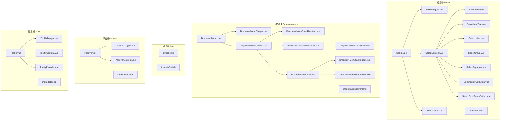
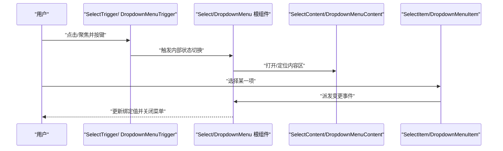
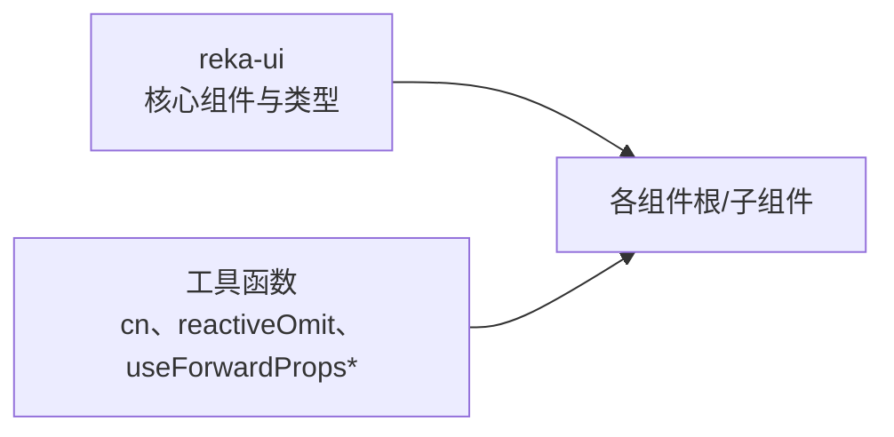

# 表单组件

<cite>
**本文引用的文件**
- [Select.vue](file://src/renderer/src/components/ui/select/Select.vue)
- [SelectContent.vue](file://src/renderer/src/components/ui/select/SelectContent.vue)
- [SelectTrigger.vue](file://src/renderer/src/components/ui/select/SelectTrigger.vue)
- [SelectItem.vue](file://src/renderer/src/components/ui/select/SelectItem.vue)
- [SelectItemText.vue](file://src/renderer/src/components/ui/select/SelectItemText.vue)
- [SelectLabel.vue](file://src/renderer/src/components/ui/select/SelectLabel.vue)
- [SelectGroup.vue](file://src/renderer/src/components/ui/select/SelectGroup.vue)
- [SelectSeparator.vue](file://src/renderer/src/components/ui/select/SelectSeparator.vue)
- [SelectScrollUpButton.vue](file://src/renderer/src/components/ui/select/SelectScrollUpButton.vue)
- [SelectScrollDownButton.vue](file://src/renderer/src/components/ui/select/SelectScrollDownButton.vue)
- [SelectValue.vue](file://src/renderer/src/components/ui/select/SelectValue.vue)
- [index.ts（Select）](file://src/renderer/src/components/ui/select/index.ts)
- [DropdownMenu.vue](file://src/renderer/src/components/ui/dropdown-menu/DropdownMenu.vue)
- [DropdownMenuTrigger.vue](file://src/renderer/src/components/ui/dropdown-menu/DropdownMenuTrigger.vue)
- [DropdownMenuContent.vue](file://src/renderer/src/components/ui/dropdown-menu/DropdownMenuContent.vue)
- [DropdownMenuCheckboxItem.vue](file://src/renderer/src/components/ui/dropdown-menu/DropdownMenuCheckboxItem.vue)
- [DropdownMenuRadioGroup.vue](file://src/renderer/src/components/ui/dropdown-menu/DropdownMenuRadioGroup.vue)
- [DropdownMenuRadioItem.vue](file://src/renderer/src/components/ui/dropdown-menu/DropdownMenuRadioItem.vue)
- [DropdownMenuSub.vue](file://src/renderer/src/components/ui/dropdown-menu/DropdownMenuSub.vue)
- [DropdownMenuSubTrigger.vue](file://src/renderer/src/components/ui/dropdown-menu/DropdownMenuSubTrigger.vue)
- [DropdownMenuSubContent.vue](file://src/renderer/src/components/ui/dropdown-menu/DropdownMenuSubContent.vue)
- [index.ts（DropdownMenu）](file://src/renderer/src/components/ui/dropdown-menu/index.ts)
- [Switch.vue](file://src/renderer/src/components/ui/switch/Switch.vue)
- [index.ts（Switch）](file://src/renderer/src/components/ui/switch/index.ts)
- [Popover.vue](file://src/renderer/src/components/ui/popover/Popover.vue)
- [PopoverContent.vue](file://src/renderer/src/components/ui/popover/PopoverContent.vue)
- [PopoverTrigger.vue](file://src/renderer/src/components/ui/popover/PopoverTrigger.vue)
- [index.ts（Popover）](file://src/renderer/src/components/ui/popover/index.ts)
- [Tooltip.vue](file://src/renderer/src/components/ui/tooltip/Tooltip.vue)
- [TooltipContent.vue](file://src/renderer/src/components/ui/tooltip/TooltipContent.vue)
- [TooltipProvider.vue](file://src/renderer/src/components/ui/tooltip/TooltipProvider.vue)
- [TooltipTrigger.vue](file://src/renderer/src/components/ui/tooltip/TooltipTrigger.vue)
- [index.ts（Tooltip）](file://src/renderer/src/components/ui/tooltip/index.ts)
</cite>

## 目录
1. [简介](#简介)
2. [项目结构](#项目结构)
3. [核心组件](#核心组件)
4. [架构总览](#架构总览)
5. [详细组件分析](#详细组件分析)
6. [依赖关系分析](#依赖关系分析)
7. [性能与可访问性](#性能与可访问性)
8. [故障排查指南](#故障排查指南)
9. [结论](#结论)
10. [附录：组合与最佳实践](#附录组合与最佳实践)

## 简介
本文件为表单相关UI组件的API参考文档，覆盖以下交互组件：
- 选择器：Select（含触发器、内容区、选项、分组、标签、滚动按钮等）
- 下拉菜单：DropdownMenu（含触发器、内容区、子菜单、单选/多选项等）
- 开关：Switch
- 弹出框：Popover（含触发器、内容区）
- 提示框：Tooltip（含提供者、触发器、内容区）

文档从API属性、事件、插槽、状态管理、交互行为、键盘导航、无障碍访问、表单验证集成、组合模式与最佳实践等方面进行系统化说明。

## 项目结构
这些组件均基于 reka-ui 的语义化组件封装，并通过统一的转发机制将外部属性与事件透传到底层实现，同时提供少量样式增强与插槽扩展点。



图表来源
- [Select.vue:1-16](file://src/renderer/src/components/ui/select/Select.vue#L1-L16)
- [SelectTrigger.vue:1-30](file://src/renderer/src/components/ui/select/SelectTrigger.vue#L1-L30)
- [SelectContent.vue:1-50](file://src/renderer/src/components/ui/select/SelectContent.vue#L1-L50)
- [SelectItem.vue](file://src/renderer/src/components/ui/select/SelectItem.vue)
- [SelectItemText.vue](file://src/renderer/src/components/ui/select/SelectItemText.vue)
- [SelectLabel.vue](file://src/renderer/src/components/ui/select/SelectLabel.vue)
- [SelectGroup.vue](file://src/renderer/src/components/ui/select/SelectGroup.vue)
- [SelectSeparator.vue](file://src/renderer/src/components/ui/select/SelectSeparator.vue)
- [SelectScrollUpButton.vue](file://src/renderer/src/components/ui/select/SelectScrollUpButton.vue)
- [SelectScrollDownButton.vue](file://src/renderer/src/components/ui/select/SelectScrollDownButton.vue)
- [SelectValue.vue](file://src/renderer/src/components/ui/select/SelectValue.vue)
- [index.ts（Select）:1-12](file://src/renderer/src/components/ui/select/index.ts#L1-L12)
- [DropdownMenu.vue:1-16](file://src/renderer/src/components/ui/dropdown-menu/DropdownMenu.vue#L1-L16)
- [DropdownMenuTrigger.vue:1-15](file://src/renderer/src/components/ui/dropdown-menu/DropdownMenuTrigger.vue#L1-L15)
- [DropdownMenuContent.vue:1-35](file://src/renderer/src/components/ui/dropdown-menu/DropdownMenuContent.vue#L1-L35)
- [DropdownMenuCheckboxItem.vue](file://src/renderer/src/components/ui/dropdown-menu/DropdownMenuCheckboxItem.vue)
- [DropdownMenuRadioGroup.vue](file://src/renderer/src/components/ui/dropdown-menu/DropdownMenuRadioGroup.vue)
- [DropdownMenuRadioItem.vue](file://src/renderer/src/components/ui/dropdown-menu/DropdownMenuRadioItem.vue)
- [DropdownMenuSub.vue](file://src/renderer/src/components/ui/dropdown-menu/DropdownMenuSub.vue)
- [DropdownMenuSubTrigger.vue](file://src/renderer/src/components/ui/dropdown-menu/DropdownMenuSubTrigger.vue)
- [DropdownMenuSubContent.vue](file://src/renderer/src/components/ui/dropdown-menu/DropdownMenuSubContent.vue)
- [index.ts（DropdownMenu）:1-17](file://src/renderer/src/components/ui/dropdown-menu/index.ts#L1-L17)
- [Switch.vue:1-36](file://src/renderer/src/components/ui/switch/Switch.vue#L1-L36)
- [index.ts（Switch）:1-2](file://src/renderer/src/components/ui/switch/index.ts#L1-L2)
- [Popover.vue:1-16](file://src/renderer/src/components/ui/popover/Popover.vue#L1-L16)
- [PopoverTrigger.vue](file://src/renderer/src/components/ui/popover/PopoverTrigger.vue)
- [PopoverContent.vue](file://src/renderer/src/components/ui/popover/PopoverContent.vue)
- [index.ts（Popover）:1-5](file://src/renderer/src/components/ui/popover/index.ts#L1-L5)
- [Tooltip.vue:1-16](file://src/renderer/src/components/ui/tooltip/Tooltip.vue#L1-L16)
- [TooltipTrigger.vue](file://src/renderer/src/components/ui/tooltip/TooltipTrigger.vue)
- [TooltipContent.vue](file://src/renderer/src/components/ui/tooltip/TooltipContent.vue)
- [TooltipProvider.vue](file://src/renderer/src/components/ui/tooltip/TooltipProvider.vue)
- [index.ts（Tooltip）:1-5](file://src/renderer/src/components/ui/tooltip/index.ts#L1-L5)

章节来源
- [Select.vue:1-16](file://src/renderer/src/components/ui/select/Select.vue#L1-L16)
- [DropdownMenu.vue:1-16](file://src/renderer/src/components/ui/dropdown-menu/DropdownMenu.vue#L1-L16)
- [Switch.vue:1-36](file://src/renderer/src/components/ui/switch/Switch.vue#L1-L36)
- [Popover.vue:1-16](file://src/renderer/src/components/ui/popover/Popover.vue#L1-L16)
- [Tooltip.vue:1-16](file://src/renderer/src/components/ui/tooltip/Tooltip.vue#L1-L16)

## 核心组件
- 组件统一采用“根组件 + 子组件”的组合模式，根组件负责状态与事件转发，子组件负责渲染与交互细节。
- 大多数根组件仅做属性与事件的透传，不引入额外样式；子组件通过工具函数合并类名并提供默认样式。
- 插槽用于内容扩展，如 Switch 的 thumb 插槽、Select 的 viewport 内容插槽等。

章节来源
- [Select.vue:1-16](file://src/renderer/src/components/ui/select/Select.vue#L1-L16)
- [DropdownMenu.vue:1-16](file://src/renderer/src/components/ui/dropdown-menu/DropdownMenu.vue#L1-L16)
- [Switch.vue:1-36](file://src/renderer/src/components/ui/switch/Switch.vue#L1-L36)
- [Popover.vue:1-16](file://src/renderer/src/components/ui/popover/Popover.vue#L1-L16)
- [Tooltip.vue:1-16](file://src/renderer/src/components/ui/tooltip/Tooltip.vue#L1-L16)

## 架构总览
下面以序列图展示“选择器”与“下拉菜单”的典型调用流程：用户点击触发器 -> 打开内容区 -> 选择项 -> 触发变更事件 -> 更新值。



图表来源
- [SelectTrigger.vue:1-30](file://src/renderer/src/components/ui/select/SelectTrigger.vue#L1-L30)
- [SelectContent.vue:1-50](file://src/renderer/src/components/ui/select/SelectContent.vue#L1-L50)
- [DropdownMenuTrigger.vue:1-15](file://src/renderer/src/components/ui/dropdown-menu/DropdownMenuTrigger.vue#L1-L15)
- [DropdownMenuContent.vue:1-35](file://src/renderer/src/components/ui/dropdown-menu/DropdownMenuContent.vue#L1-L35)

## 详细组件分析

### 选择器（Select）
- 组件族：Select（根）、SelectTrigger、SelectContent、SelectItem、SelectItemText、SelectLabel、SelectGroup、SelectSeparator、SelectScrollUpButton、SelectScrollDownButton、SelectValue。
- 主要职责
  - Select：作为根容器，透传属性与事件，承载插槽。
  - SelectTrigger：触发器，负责外观与焦点态，内置下拉图标。
  - SelectContent：内容区，支持 popper 定位动画与视口滚动按钮。
  - SelectItem/SelectItemText：选项与文本显示。
  - SelectLabel/SelectGroup/SelectSeparator：分组与分隔符。
  - SelectScrollUpButton/SelectScrollDownButton：滚动控制。
  - SelectValue：占位符或当前值显示。
- 属性与事件
  - 根组件与子组件均继承自 reka-ui 的类型定义，支持 value、open、onValueChange 等常用属性与事件。
  - SelectContent 支持 position（默认 popper）等定位相关属性。
- 插槽
  - SelectTrigger/SelectContent/SelectItem 等均提供默认插槽以插入内容。
  - Switch 的 SwitchRoot 提供名为 thumb 的插槽，允许自定义拇指图标。
- 状态管理
  - 由 reka-ui 内部维护，组件通过 useForwardPropsEmits/useForwardProps 将外部 props 与 emits 转发给底层实现。
- 交互行为与键盘导航
  - 支持 Enter/Open 切换、Esc 关闭、上下方向键在选项间移动、回车确认、输入字母跳转等标准行为（由 reka-ui 提供）。
- 无障碍访问
  - 自动设置 aria-* 属性与 role，确保屏幕阅读器可用。
- 表单验证集成
  - 可直接绑定到表单控件（如 v-model），配合校验库使用。
- 组合模式与最佳实践
  - 使用 SelectTrigger 作为按钮入口，SelectContent 包裹一组 SelectItem。
  - 需要分组时使用 SelectGroup + SelectLabel + SelectItem。
  - 长列表建议配合滚动按钮与视口高度控制。

```mermaid
classDiagram
class SelectRoot {
"+value"
"+open"
"+onValueChange"
}
class SelectTrigger {
"+class?"
"+...rest"
}
class SelectContent {
"+position='popper'"
"+class?"
"+...rest"
}
class SelectItem {
"+value"
"+disabled?"
"+onSelect?"
}
class SelectItemText
class SelectLabel
class SelectGroup
class SelectSeparator
class SelectScrollUpButton
class SelectScrollDownButton
class SelectValue
SelectRoot --> SelectTrigger : "包含"
SelectRoot --> SelectContent : "包含"
SelectContent --> SelectItem : "包含"
SelectContent --> SelectItemText : "包含"
SelectContent --> SelectLabel : "包含"
SelectContent --> SelectGroup : "包含"
SelectContent --> SelectSeparator : "包含"
SelectContent --> SelectScrollUpButton : "包含"
SelectContent --> SelectScrollDownButton : "包含"
SelectRoot --> SelectValue : "包含"
```

图表来源
- [Select.vue:1-16](file://src/renderer/src/components/ui/select/Select.vue#L1-L16)
- [SelectTrigger.vue:1-30](file://src/renderer/src/components/ui/select/SelectTrigger.vue#L1-L30)
- [SelectContent.vue:1-50](file://src/renderer/src/components/ui/select/SelectContent.vue#L1-L50)
- [SelectItem.vue](file://src/renderer/src/components/ui/select/SelectItem.vue)
- [SelectItemText.vue](file://src/renderer/src/components/ui/select/SelectItemText.vue)
- [SelectLabel.vue](file://src/renderer/src/components/ui/select/SelectLabel.vue)
- [SelectGroup.vue](file://src/renderer/src/components/ui/select/SelectGroup.vue)
- [SelectSeparator.vue](file://src/renderer/src/components/ui/select/SelectSeparator.vue)
- [SelectScrollUpButton.vue](file://src/renderer/src/components/ui/select/SelectScrollUpButton.vue)
- [SelectScrollDownButton.vue](file://src/renderer/src/components/ui/select/SelectScrollDownButton.vue)
- [SelectValue.vue](file://src/renderer/src/components/ui/select/SelectValue.vue)

章节来源
- [Select.vue:1-16](file://src/renderer/src/components/ui/select/Select.vue#L1-L16)
- [SelectTrigger.vue:1-30](file://src/renderer/src/components/ui/select/SelectTrigger.vue#L1-L30)
- [SelectContent.vue:1-50](file://src/renderer/src/components/ui/select/SelectContent.vue#L1-L50)
- [index.ts（Select）:1-12](file://src/renderer/src/components/ui/select/index.ts#L1-L12)

### 下拉菜单（DropdownMenu）
- 组件族：DropdownMenu（根）、DropdownMenuTrigger、DropdownMenuContent、DropdownMenuCheckboxItem、DropdownMenuRadioGroup、DropdownMenuRadioItem、DropdownMenuSub（含 SubTrigger/SubContent）、DropdownMenuPortal。
- 主要职责
  - DropdownMenu：根容器，透传属性与事件。
  - DropdownMenuTrigger：触发器，通常为按钮或链接。
  - DropdownMenuContent：内容区，支持侧向定位与动画。
  - DropdownMenuCheckboxItem/DropdownMenuRadioGroup/RadioItem：多选/单选项。
  - DropdownMenuSub：子菜单容器，支持嵌套。
- 属性与事件
  - 支持 sideOffset、align、avoidCollisions 等定位属性。
  - 提供 onOpenChange、onEscapeKeyDown 等事件。
- 插槽
  - Content 内部提供默认插槽放置菜单项。
- 状态管理
  - 由 reka-ui 维护，组件通过 useForwardPropsEmits 转发。
- 交互行为与键盘导航
  - 支持 Enter/Open、Esc 关闭、方向键导航、子菜单展开/收起等。
- 无障碍访问
  - 自动设置 aria-haspopup、aria-expanded 等属性。
- 表单验证集成
  - 可与表单控件结合，作为复杂操作入口。
- 组合模式与最佳实践
  - 使用 DropdownMenuTrigger 作为入口，DropdownMenuContent 包裹菜单项。
  - 复杂场景使用 DropdownMenuSub 实现二级菜单。
  - 使用 Portal 将内容挂载到 body，避免被裁剪。

```mermaid
classDiagram
class DropdownMenuRoot
class DropdownMenuTrigger
class DropdownMenuContent {
"+sideOffset=4"
"+...rest"
}
class DropdownMenuCheckboxItem
class DropdownMenuRadioGroup
class DropdownMenuRadioItem
class DropdownMenuSub
class DropdownMenuSubTrigger
class DropdownMenuSubContent
class DropdownMenuPortal
DropdownMenuRoot --> DropdownMenuTrigger : "包含"
DropdownMenuRoot --> DropdownMenuContent : "包含"
DropdownMenuContent --> DropdownMenuCheckboxItem : "包含"
DropdownMenuContent --> DropdownMenuRadioGroup : "包含"
DropdownMenuRadioGroup --> DropdownMenuRadioItem : "包含"
DropdownMenuContent --> DropdownMenuSub : "包含"
DropdownMenuSub --> DropdownMenuSubTrigger : "包含"
DropdownMenuSub --> DropdownMenuSubContent : "包含"
DropdownMenuRoot --> DropdownMenuPortal : "导出"
```

图表来源
- [DropdownMenu.vue:1-16](file://src/renderer/src/components/ui/dropdown-menu/DropdownMenu.vue#L1-L16)
- [DropdownMenuTrigger.vue:1-15](file://src/renderer/src/components/ui/dropdown-menu/DropdownMenuTrigger.vue#L1-L15)
- [DropdownMenuContent.vue:1-35](file://src/renderer/src/components/ui/dropdown-menu/DropdownMenuContent.vue#L1-L35)
- [DropdownMenuCheckboxItem.vue](file://src/renderer/src/components/ui/dropdown-menu/DropdownMenuCheckboxItem.vue)
- [DropdownMenuRadioGroup.vue](file://src/renderer/src/components/ui/dropdown-menu/DropdownMenuRadioGroup.vue)
- [DropdownMenuRadioItem.vue](file://src/renderer/src/components/ui/dropdown-menu/DropdownMenuRadioItem.vue)
- [DropdownMenuSub.vue](file://src/renderer/src/components/ui/dropdown-menu/DropdownMenuSub.vue)
- [DropdownMenuSubTrigger.vue](file://src/renderer/src/components/ui/dropdown-menu/DropdownMenuSubTrigger.vue)
- [DropdownMenuSubContent.vue](file://src/renderer/src/components/ui/dropdown-menu/DropdownMenuSubContent.vue)
- [index.ts（DropdownMenu）:1-17](file://src/renderer/src/components/ui/dropdown-menu/index.ts#L1-L17)

章节来源
- [DropdownMenu.vue:1-16](file://src/renderer/src/components/ui/dropdown-menu/DropdownMenu.vue#L1-L16)
- [DropdownMenuTrigger.vue:1-15](file://src/renderer/src/components/ui/dropdown-menu/DropdownMenuTrigger.vue#L1-L15)
- [DropdownMenuContent.vue:1-35](file://src/renderer/src/components/ui/dropdown-menu/DropdownMenuContent.vue#L1-L35)
- [index.ts（DropdownMenu）:1-17](file://src/renderer/src/components/ui/dropdown-menu/index.ts#L1-L17)

### 开关（Switch）
- 组件族：Switch（根）。
- 主要职责
  - Switch：开关控件，支持受控/非受控两种模式。
- 属性与事件
  - 支持 checked、disabled、onCheckedChange 等。
  - 提供 class 扩展样式。
- 插槽
  - SwitchRoot 提供名为 thumb 的插槽，可替换拇指图标。
- 状态管理
  - 由 reka-ui 维护，组件通过 useForwardPropsEmits 转发。
- 交互行为与键盘导航
  - Space/Toggle 切换，支持 Tab 键盘导航。
- 无障碍访问
  - 自动设置 aria-checked 与 role=switch。
- 表单验证集成
  - 可直接绑定到表单控件（如 v-model 或受控属性）。
- 组合模式与最佳实践
  - 建议与 Label 组件配合使用，提升可访问性。
  - 可通过插槽自定义拇指图标或文案。

```mermaid
classDiagram
class SwitchRoot {
"+checked"
"+disabled"
"+onCheckedChange"
"+class?"
}
class SwitchThumb {
"<<slot>> thumb"
}
SwitchRoot --> SwitchThumb : "包含"
```

图表来源
- [Switch.vue:1-36](file://src/renderer/src/components/ui/switch/Switch.vue#L1-L36)
- [index.ts（Switch）:1-2](file://src/renderer/src/components/ui/switch/index.ts#L1-L2)

章节来源
- [Switch.vue:1-36](file://src/renderer/src/components/ui/switch/Switch.vue#L1-L36)
- [index.ts（Switch）:1-2](file://src/renderer/src/components/ui/switch/index.ts#L1-L2)

### 弹出框（Popover）
- 组件族：Popover（根）、PopoverTrigger、PopoverContent、PopoverAnchor（导出）。
- 主要职责
  - Popover：根容器，透传属性与事件。
  - PopoverTrigger：触发器。
  - PopoverContent：内容区，支持定位与动画。
- 属性与事件
  - 支持 sideOffset、align、avoidCollisions 等定位属性。
  - 提供 onOpenChange、onEscapeKeyDown 等事件。
- 插槽
  - Content 内部提供默认插槽。
- 状态管理
  - 由 reka-ui 维护，组件通过 useForwardPropsEmits 转发。
- 交互行为与键盘导航
  - 支持 Enter/Open、Esc 关闭、Tab 导航。
- 无障碍访问
  - 自动设置 aria-haspopup、aria-expanded 等属性。
- 表单验证集成
  - 可作为复杂输入的弹出式面板（如日期选择器、颜色选择器）。
- 组合模式与最佳实践
  - 使用 PopoverTrigger 作为入口，PopoverContent 放置表单片段。
  - 使用 Anchor 可将弹出框锚定到指定元素。

```mermaid
classDiagram
class PopoverRoot
class PopoverTrigger
class PopoverContent {
"+sideOffset=..."
"+...rest"
}
class PopoverAnchor
PopoverRoot --> PopoverTrigger : "包含"
PopoverRoot --> PopoverContent : "包含"
PopoverRoot --> PopoverAnchor : "导出"
```

图表来源
- [Popover.vue:1-16](file://src/renderer/src/components/ui/popover/Popover.vue#L1-L16)
- [PopoverTrigger.vue](file://src/renderer/src/components/ui/popover/PopoverTrigger.vue)
- [PopoverContent.vue](file://src/renderer/src/components/ui/popover/PopoverContent.vue)
- [index.ts（Popover）:1-5](file://src/renderer/src/components/ui/popover/index.ts#L1-L5)

章节来源
- [Popover.vue:1-16](file://src/renderer/src/components/ui/popover/Popover.vue#L1-L16)
- [PopoverTrigger.vue](file://src/renderer/src/components/ui/popover/PopoverTrigger.vue)
- [PopoverContent.vue](file://src/renderer/src/components/ui/popover/PopoverContent.vue)
- [index.ts（Popover）:1-5](file://src/renderer/src/components/ui/popover/index.ts#L1-L5)

### 提示框（Tooltip）
- 组件族：Tooltip（根）、TooltipTrigger、TooltipContent、TooltipProvider。
- 主要职责
  - Tooltip：根容器，透传属性与事件。
  - TooltipTrigger：触发器。
  - TooltipContent：提示内容。
  - TooltipProvider：全局提供者，统一配置延迟与策略。
- 属性与事件
  - 支持 delayDuration、disableHoverableContent 等全局配置。
  - 提供 onOpenChange 等事件。
- 插槽
  - Content 内部提供默认插槽。
- 状态管理
  - 由 reka-ui 维护，组件通过 useForwardPropsEmits 转发。
- 交互行为与键盘导航
  - 鼠标悬停/焦点显示，支持键盘 Tab 导航。
- 无障碍访问
  - 自动设置 aria-describedby 等属性。
- 表单验证集成
  - 可用于表单字段的辅助说明或错误提示。
- 组合模式与最佳实践
  - 在应用根部包裹 TooltipProvider，统一延迟与行为。
  - 将 TooltipTrigger 作为按钮/输入的外层包装。

```mermaid
classDiagram
class TooltipRoot
class TooltipTrigger
class TooltipContent
class TooltipProvider {
"+delayDuration"
"+disableHoverableContent"
}
TooltipRoot --> TooltipTrigger : "包含"
TooltipRoot --> TooltipContent : "包含"
TooltipRoot --> TooltipProvider : "依赖"
```

图表来源
- [Tooltip.vue:1-16](file://src/renderer/src/components/ui/tooltip/Tooltip.vue#L1-L16)
- [TooltipTrigger.vue](file://src/renderer/src/components/ui/tooltip/TooltipTrigger.vue)
- [TooltipContent.vue](file://src/renderer/src/components/ui/tooltip/TooltipContent.vue)
- [TooltipProvider.vue](file://src/renderer/src/components/ui/tooltip/TooltipProvider.vue)
- [index.ts（Tooltip）:1-5](file://src/renderer/src/components/ui/tooltip/index.ts#L1-L5)

章节来源
- [Tooltip.vue:1-16](file://src/renderer/src/components/ui/tooltip/Tooltip.vue#L1-L16)
- [TooltipTrigger.vue](file://src/renderer/src/components/ui/tooltip/TooltipTrigger.vue)
- [TooltipContent.vue](file://src/renderer/src/components/ui/tooltip/TooltipContent.vue)
- [TooltipProvider.vue](file://src/renderer/src/components/ui/tooltip/TooltipProvider.vue)
- [index.ts（Tooltip）:1-5](file://src/renderer/src/components/ui/tooltip/index.ts#L1-L5)

## 依赖关系分析
- 所有组件均依赖 reka-ui 的核心能力（如 SelectRoot、DropdownMenuRoot、SwitchRoot、PopoverRoot、TooltipRoot 等）。
- 通过 useForwardProps/useForwardPropsEmits 将外部属性与事件透传至底层实现，保持 API 一致性。
- 通过 cn 工具函数合并类名，实现样式扩展与主题适配。



图表来源
- [Select.vue:1-16](file://src/renderer/src/components/ui/select/Select.vue#L1-L16)
- [DropdownMenu.vue:1-16](file://src/renderer/src/components/ui/dropdown-menu/DropdownMenu.vue#L1-L16)
- [Switch.vue:1-36](file://src/renderer/src/components/ui/switch/Switch.vue#L1-L36)
- [Popover.vue:1-16](file://src/renderer/src/components/ui/popover/Popover.vue#L1-L16)
- [Tooltip.vue:1-16](file://src/renderer/src/components/ui/tooltip/Tooltip.vue#L1-L16)

章节来源
- [Select.vue:1-16](file://src/renderer/src/components/ui/select/Select.vue#L1-L16)
- [DropdownMenu.vue:1-16](file://src/renderer/src/components/ui/dropdown-menu/DropdownMenu.vue#L1-L16)
- [Switch.vue:1-36](file://src/renderer/src/components/ui/switch/Switch.vue#L1-L36)
- [Popover.vue:1-16](file://src/renderer/src/components/ui/popover/Popover.vue#L1-L16)
- [Tooltip.vue:1-16](file://src/renderer/src/components/ui/tooltip/Tooltip.vue#L1-L16)

## 性能与可访问性
- 性能
  - 使用 Portal 将内容挂载到合适位置，减少布局抖动与重绘。
  - 滚动按钮与视口配合，长列表场景避免一次性渲染过多节点。
- 可访问性
  - 自动设置 aria-* 属性与 role，确保键盘与屏幕阅读器友好。
  - 支持焦点管理与 Escape 关闭，符合 WCAG 基本要求。
- 表单验证
  - 组件支持受控/非受控模式，可与表单库（如 vee-validate、yup）结合使用。
  - 建议在表单中为每个控件提供明确的标签与错误信息。

[本节为通用指导，无需列出具体文件来源]

## 故障排查指南
- 无法打开下拉菜单/弹出框
  - 检查触发器是否正确包裹在根组件内。
  - 确认未禁用组件且未被父级样式遮挡。
- 选项不可选或无响应
  - 确认 SelectItem 的 value 设置正确，且未标记 disabled。
  - 检查 onValueChange 是否正确绑定。
- 样式错乱
  - 确认未覆盖关键类名；必要时使用插槽或 class 扩展。
- 无障碍问题
  - 确保为每个控件提供可读标签；检查 aria-* 属性是否缺失。
- Tooltip/Popover 延迟异常
  - 在 TooltipProvider 中调整 delayDuration；确认未设置 disableHoverableContent。

章节来源
- [DropdownMenuContent.vue:1-35](file://src/renderer/src/components/ui/dropdown-menu/DropdownMenuContent.vue#L1-L35)
- [SelectContent.vue:1-50](file://src/renderer/src/components/ui/select/SelectContent.vue#L1-L50)
- [Switch.vue:1-36](file://src/renderer/src/components/ui/switch/Switch.vue#L1-L36)
- [TooltipProvider.vue](file://src/renderer/src/components/ui/tooltip/TooltipProvider.vue)
- [PopoverContent.vue](file://src/renderer/src/components/ui/popover/PopoverContent.vue)

## 结论
上述组件通过统一的 reka-ui 能力与轻量封装，提供了高可访问性、可组合、可扩展的表单交互体验。开发者可通过插槽与类名扩展满足定制需求，并借助受控/非受控模式与表单库无缝集成。

[本节为总结，无需列出具体文件来源]

## 附录：组合与最佳实践
- 选择器
  - 单选：Select + SelectTrigger + SelectContent + SelectItem。
  - 分组：Select + SelectGroup + SelectLabel + SelectItem。
  - 长列表：配合 SelectScrollUpButton/SelectScrollDownButton 与视口高度。
- 下拉菜单
  - 多选/单选：DropdownMenu + CheckboxItem/RadioGroup/RadioItem。
  - 嵌套：DropdownMenu + Sub + SubTrigger + SubContent。
- 开关
  - 与 Label 组合，提供清晰的语义标签。
  - 使用 thumb 插槽自定义图标。
- 弹出框
  - 作为复杂输入的弹出面板，内容区尽量简洁。
  - 使用 Anchor 将弹出框锚定到目标元素。
- 提示框
  - 在应用根部统一配置 Provider，避免重复设置。
  - 文案简明，避免过长内容导致阅读困难。

[本节为通用指导，无需列出具体文件来源]