# 账户监控服务

<cite>
**本文档引用的文件**
- [src/main/service/account-monitor.ts](file://src/main/service/account-monitor.ts)
- [src/shared/account.ts](file://src/shared/account.ts)
- [src/main/ipc/account.ts](file://src/main/ipc/account.ts)
- [src/renderer/src/stores/account.ts](file://src/renderer/src/stores/account.ts)
- [src/main/utils/storage.ts](file://src/main/utils/storage.ts)
- [src/shared/platform.ts](file://src/shared/platform.ts)
- [src/main/platform/base.ts](file://src/main/platform/base.ts)
- [src/main/platform/douyin/index.ts](file://src/main/platform/douyin/index.ts)
- [src/renderer/src/pages/accounts.vue](file://src/renderer/src/pages/accounts.vue)
- [src/main/ipc/login.ts](file://src/main/ipc/login.ts)
- [README.md](file://README.md)
- [package.json](file://package.json)
</cite>

## 目录
1. [简介](#简介)
2. [项目结构](#项目结构)
3. [核心组件](#核心组件)
4. [架构概览](#架构概览)
5. [详细组件分析](#详细组件分析)
6. [依赖关系分析](#依赖关系分析)
7. [性能考虑](#性能考虑)
8. [故障排除指南](#故障排除指南)
9. [结论](#结论)

## 简介

AutoOps 是一个基于 Electron 和 Vue 3 的多平台自动化运营工具，专门用于监控和管理多个社交媒体平台的账号状态。该系统的核心功能是账户监控服务，能够自动检测抖音、快手、小红书等平台账号的登录状态，提供实时的状态更新和通知机制。

该系统采用现代化的技术栈，包括 Electron 38.x、Vue 3 + TypeScript、Vite + electron-vite、Tailwind CSS 4、Pinia 状态管理和 Playwright 浏览器自动化框架。通过 IPC（Inter-Process Communication）机制实现主进程与渲染进程之间的通信，确保账户状态的实时同步。

## 项目结构

AutoOps 项目采用清晰的分层架构设计，主要分为以下层次：

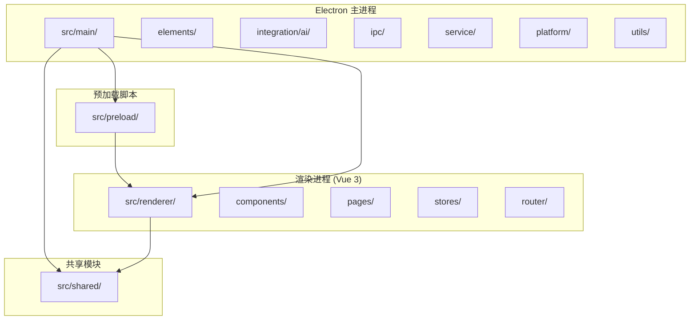

**图表来源**
- [README.md:36-54](file://README.md#L36-L54)

### 核心目录说明

- **src/main/**: Electron 主进程代码，包含业务逻辑和服务实现
- **src/preload/**: 预加载脚本，提供安全的 IPC 接口
- **src/renderer/**: Vue 3 前端应用，负责用户界面和交互
- **src/shared/**: 共享的数据类型和接口定义
- **src/main/ipc/**: IPC 处理器，管理主进程与渲染进程的通信
- **src/main/service/**: 业务服务实现，包括账户监控、任务管理等
- **src/main/platform/**: 平台适配器，支持不同社交媒体平台

**章节来源**
- [README.md:36-54](file://README.md#L36-L54)
- [package.json:1-86](file://package.json#L1-L86)

## 核心组件

账户监控服务由多个相互协作的组件构成，每个组件都有明确的职责和边界：

### 数据模型组件

账户监控系统的核心数据模型包括账户信息、状态枚举和存储结构：

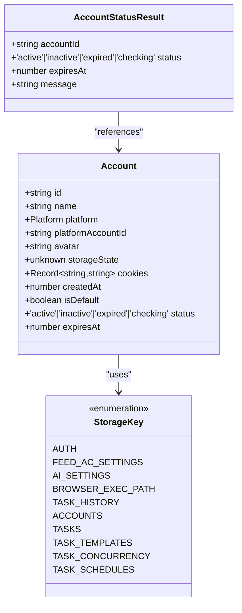

**图表来源**
- [src/shared/account.ts:3-15](file://src/shared/account.ts#L3-L15)
- [src/main/utils/storage.ts:33-44](file://src/main/utils/storage.ts#L33-L44)

### 业务服务组件

账户监控服务的核心业务逻辑封装在独立的服务模块中：

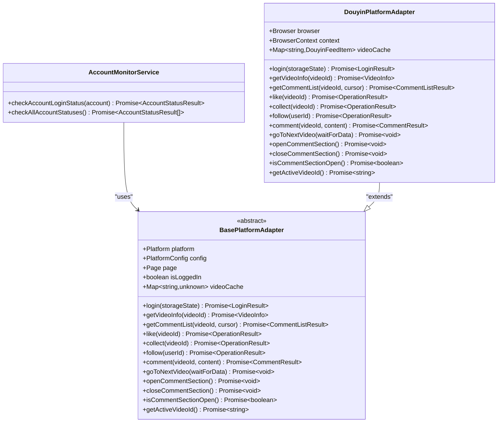

**图表来源**
- [src/main/service/account-monitor.ts:17-75](file://src/main/service/account-monitor.ts#L17-L75)
- [src/main/platform/base.ts:24-80](file://src/main/platform/base.ts#L24-L80)
- [src/main/platform/douyin/index.ts:60-109](file://src/main/platform/douyin/index.ts#L60-L109)

**章节来源**
- [src/shared/account.ts:3-39](file://src/shared/account.ts#L3-L39)
- [src/main/service/account-monitor.ts:1-110](file://src/main/service/account-monitor.ts#L1-L110)
- [src/main/platform/base.ts:1-105](file://src/main/platform/base.ts#L1-L105)

## 架构概览

账户监控服务采用事件驱动的架构模式，通过 IPC 通道实现主进程与渲染进程的解耦通信：

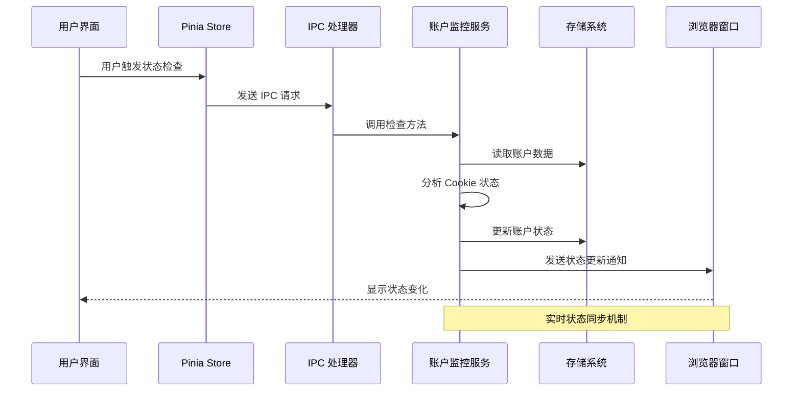

**图表来源**
- [src/renderer/src/stores/account.ts:84-105](file://src/renderer/src/stores/account.ts#L84-L105)
- [src/main/ipc/account.ts:102-126](file://src/main/ipc/account.ts#L102-L126)
- [src/main/service/account-monitor.ts:80-109](file://src/main/service/account-monitor.ts#L80-L109)

### 状态管理流程

账户状态检查的完整流程包括多个阶段的状态转换：

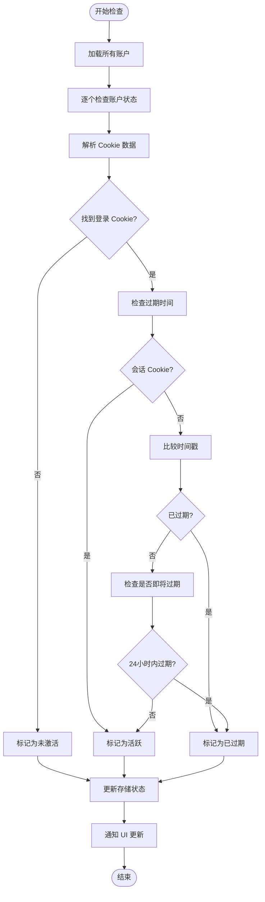

**图表来源**
- [src/main/service/account-monitor.ts:17-75](file://src/main/service/account-monitor.ts#L17-L75)
- [src/main/service/account-monitor.ts:80-109](file://src/main/service/account-monitor.ts#L80-L109)

**章节来源**
- [src/main/service/account-monitor.ts:17-109](file://src/main/service/account-monitor.ts#L17-L109)
- [src/renderer/src/stores/account.ts:84-127](file://src/renderer/src/stores/account.ts#L84-L127)

## 详细组件分析

### 账户监控服务

账户监控服务是整个系统的核心组件，负责分析和维护账户的登录状态：

#### 核心算法实现

账户状态检查算法基于 Cookie 分析机制，通过识别关键的登录态 Cookie 来判断账户的有效性：

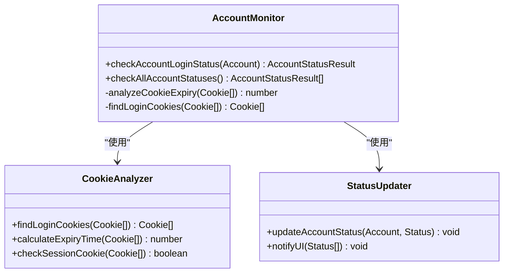

**图表来源**
- [src/main/service/account-monitor.ts:17-75](file://src/main/service/account-monitor.ts#L17-L75)

#### 状态判定逻辑

系统采用多层次的状态判定机制：

1. **无登录状态**: 当账户没有存储状态数据时，标记为未激活
2. **无 Cookie 数据**: 缺少必要的 Cookie 信息，标记为未激活
3. **会话 Cookie**: 临时登录状态，标记为活跃但需要定期刷新
4. **已过期 Cookie**: 登录状态已失效，标记为已过期
5. **即将过期 Cookie**: 在24小时内过期的登录状态，标记为已过期

**章节来源**
- [src/main/service/account-monitor.ts:17-75](file://src/main/service/account-monitor.ts#L17-L75)

### IPC 通信层

IPC 层负责处理主进程与渲染进程之间的异步通信，提供完整的 CRUD 操作和状态查询接口：

#### IPC 接口设计

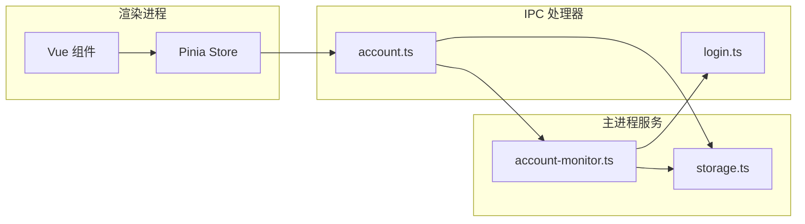

**图表来源**
- [src/main/ipc/account.ts:32-127](file://src/main/ipc/account.ts#L32-L127)
- [src/main/ipc/login.ts:85-192](file://src/main/ipc/login.ts#L85-L192)

#### 异步操作流程

账户操作通过异步 IPC 调用实现，确保 UI 的流畅性和响应性：

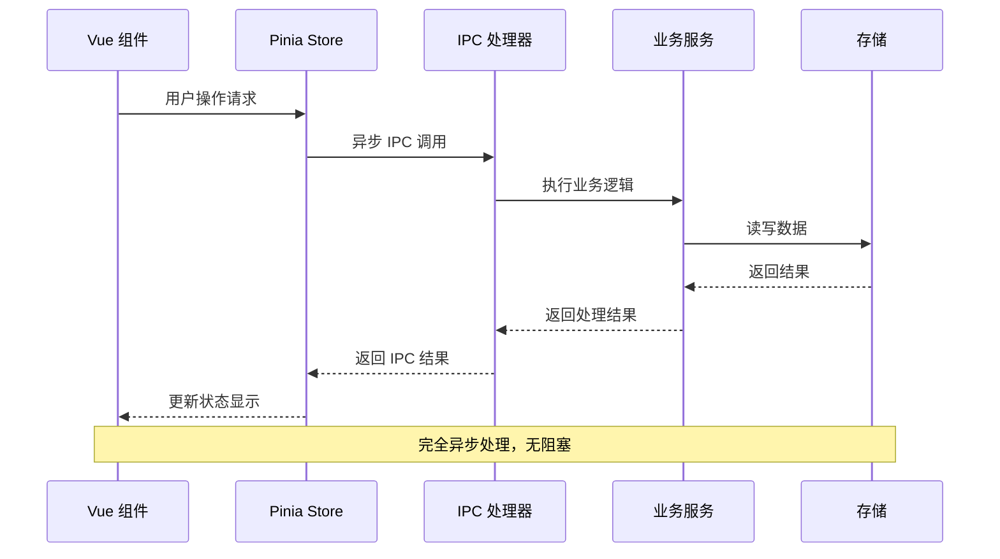

**图表来源**
- [src/renderer/src/stores/account.ts:41-82](file://src/renderer/src/stores/account.ts#L41-L82)
- [src/main/ipc/account.ts:32-127](file://src/main/ipc/account.ts#L32-L127)

**章节来源**
- [src/main/ipc/account.ts:1-128](file://src/main/ipc/account.ts#L1-L128)
- [src/renderer/src/stores/account.ts:1-128](file://src/renderer/src/stores/account.ts#L1-L128)

### 前端状态管理

前端使用 Pinia 进行状态管理，提供响应式的账户数据绑定和操作接口：

#### Store 架构设计

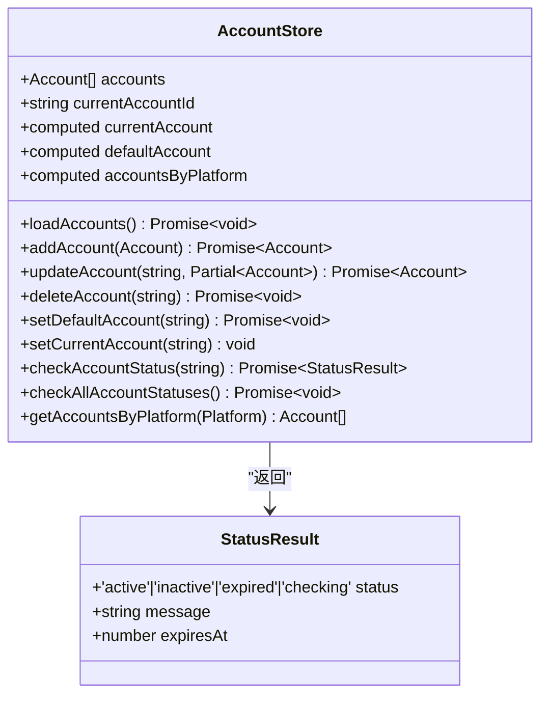

**图表来源**
- [src/renderer/src/stores/account.ts:19-127](file://src/renderer/src/stores/account.ts#L19-L127)

#### 响应式状态更新

前端通过计算属性和响应式数据实现自动化的状态更新：

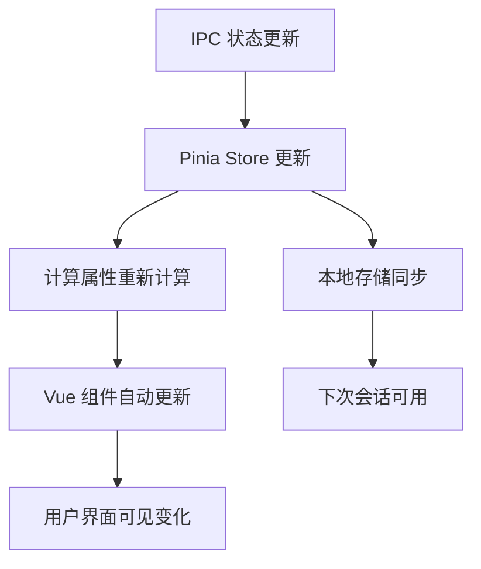

**图表来源**
- [src/renderer/src/stores/account.ts:84-105](file://src/renderer/src/stores/account.ts#L84-L105)

**章节来源**
- [src/renderer/src/stores/account.ts:19-127](file://src/renderer/src/stores/account.ts#L19-L127)

### 平台适配器系统

系统支持多个社交媒体平台，通过统一的适配器接口实现平台无关的操作：

#### 平台抽象层

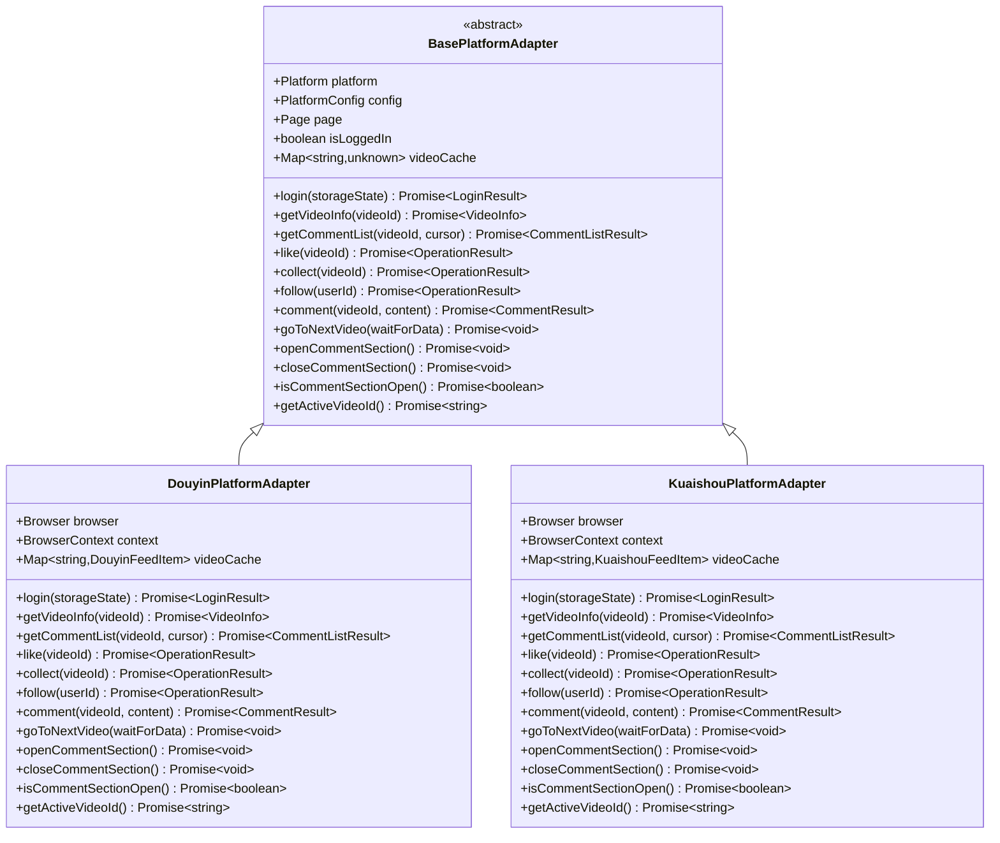

**图表来源**
- [src/main/platform/base.ts:24-80](file://src/main/platform/base.ts#L24-L80)
- [src/main/platform/douyin/index.ts:60-109](file://src/main/platform/douyin/index.ts#L60-L109)

#### 平台配置管理

每个平台都有独立的配置管理，包括选择器、API 端点和键盘快捷键：

**章节来源**
- [src/main/platform/base.ts:24-105](file://src/main/platform/base.ts#L24-L105)
- [src/shared/platform.ts:88-200](file://src/shared/platform.ts#L88-L200)

## 依赖关系分析

账户监控服务的依赖关系体现了清晰的分层架构和模块化设计：

```mermaid
graph TB
subgraph "外部依赖"
A[Electron 38.x]
B[Vue 3 + TypeScript]
C[Playwright]
D[Pinia]
E[electron-store]
end
subgraph "内部模块"
F[account-monitor.ts]
G[account.ts (IPC)]
H[account.ts (Store)]
I[storage.ts]
J[platform adapters]
end
subgraph "共享类型"
K[account.ts]
L[platform.ts]
end
A --> F
B --> H
C --> J
D --> H
E --> I
F --> I
G --> F
H --> G
J --> L
F --> K
G --> K
H --> K
```

**图表来源**
- [package.json:16-34](file://package.json#L16-L34)
- [src/main/service/account-monitor.ts:1-5](file://src/main/service/account-monitor.ts#L1-L5)

### 关键依赖关系

1. **Electron 与 IPC**: Electron 提供跨进程通信能力，是整个系统的基础
2. **Vue 3 与 Pinia**: 提供响应式状态管理和组件化 UI
3. **Playwright 与浏览器自动化**: 实现平台特定的功能操作
4. **electron-store 与持久化存储**: 确保数据的可靠存储和恢复

**章节来源**
- [package.json:16-34](file://package.json#L16-L34)
- [src/main/service/account-monitor.ts:1-5](file://src/main/service/account-monitor.ts#L1-L5)

## 性能考虑

账户监控服务在设计时充分考虑了性能优化和资源管理：

### 内存管理策略

1. **Cookie 缓存**: 使用 Map 数据结构缓存账户的 Cookie 信息，避免重复解析
2. **状态更新批处理**: 批量检查多个账户状态，减少 IPC 调用次数
3. **资源清理**: 及时关闭浏览器上下文和页面实例，释放内存资源

### 异步处理优化

1. **Promise 并行执行**: 使用 Promise.all 并行检查多个账户状态
2. **超时控制**: 为网络请求和页面操作设置合理的超时机制
3. **错误隔离**: 每个账户的检查操作相互独立，避免单点故障影响整体性能

### 存储优化

1. **增量更新**: 仅在状态发生变化时更新存储，减少不必要的写操作
2. **数据压缩**: 对存储的数据进行适当的压缩和序列化
3. **索引优化**: 通过平台分类快速定位相关账户

## 故障排除指南

### 常见问题诊断

#### 账户状态检查失败

**症状**: 账户状态始终显示为未激活或检查失败

**可能原因**:
1. 存储状态数据格式不正确
2. Cookie 解析异常
3. 网络连接问题
4. 浏览器上下文创建失败

**解决方案**:
1. 验证存储状态数据的完整性
2. 检查 Cookie 字段的正确性
3. 确认网络连接稳定
4. 重新初始化浏览器上下文

#### IPC 通信异常

**症状**: 前端无法接收到状态更新通知

**可能原因**:
1. IPC 处理器未正确注册
2. 渲染进程监听器缺失
3. 浏览器窗口实例不存在
4. 序列化数据格式错误

**解决方案**:
1. 确认 IPC 处理器的注册顺序
2. 验证渲染进程的事件监听
3. 检查 BrowserWindow 实例状态
4. 使用 JSON 序列化确保数据传输

#### 平台适配器问题

**症状**: 平台特定功能无法正常工作

**可能原因**:
1. 选择器配置错误
2. API 端点变更
3. 页面元素结构变化
4. 浏览器兼容性问题

**解决方案**:
1. 更新平台选择器配置
2. 检查 API 端点的有效性
3. 重新映射页面元素
4. 测试不同浏览器版本

**章节来源**
- [src/main/service/account-monitor.ts:71-74](file://src/main/service/account-monitor.ts#L71-L74)
- [src/main/ipc/account.ts:102-126](file://src/main/ipc/account.ts#L102-L126)

### 调试技巧

1. **日志分析**: 利用 electron-log 记录详细的调试信息
2. **状态监控**: 通过浏览器开发者工具监控 IPC 通信
3. **内存分析**: 使用 Chrome DevTools 分析内存泄漏
4. **网络监控**: 监控 API 请求和响应时间

## 结论

AutoOps 的账户监控服务展现了现代桌面应用开发的最佳实践，通过清晰的架构设计、完善的错误处理机制和高效的性能优化，为用户提供了可靠的多平台账号管理体验。

### 系统优势

1. **模块化设计**: 清晰的分层架构使得系统易于维护和扩展
2. **异步处理**: 完全异步的 IPC 通信确保了 UI 的流畅性
3. **状态管理**: 响应式的状态管理提供了良好的用户体验
4. **平台扩展**: 适配器模式支持轻松添加新的社交媒体平台

### 技术亮点

1. **Electron + Vue 3**: 现代化的桌面应用技术栈
2. **Playwright 集成**: 强大的浏览器自动化能力
3. **类型安全**: TypeScript 提供完整的类型安全保障
4. **状态持久化**: electron-store 实现可靠的数据存储

### 未来发展方向

1. **性能优化**: 进一步优化内存使用和响应速度
2. **功能扩展**: 支持更多社交媒体平台和操作类型
3. **智能化监控**: 集成机器学习算法进行更精准的状态预测
4. **安全性增强**: 加强账户数据的安全保护和隐私控制

该系统为自动化运营工具提供了坚实的技术基础，通过持续的优化和扩展，有望成为多平台自动化运营领域的优秀解决方案。