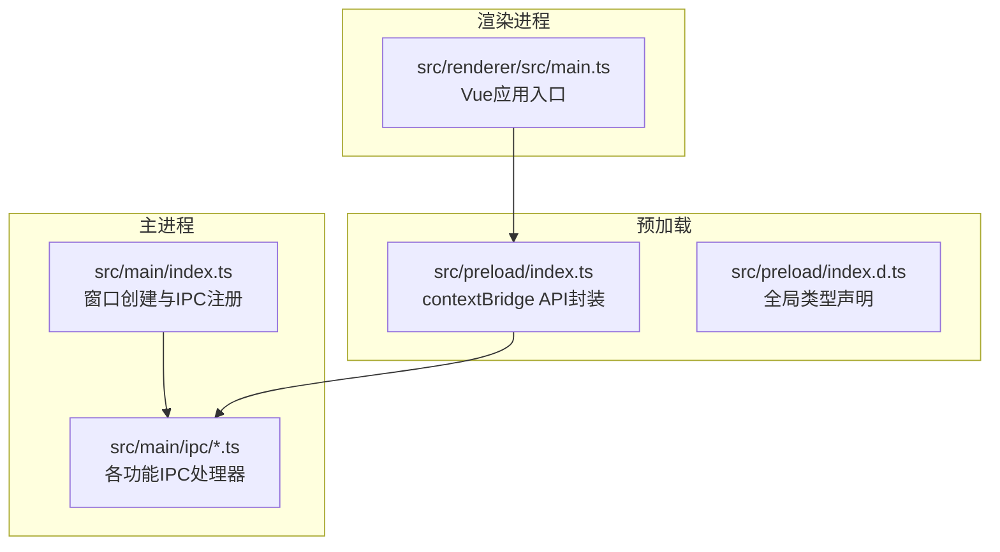
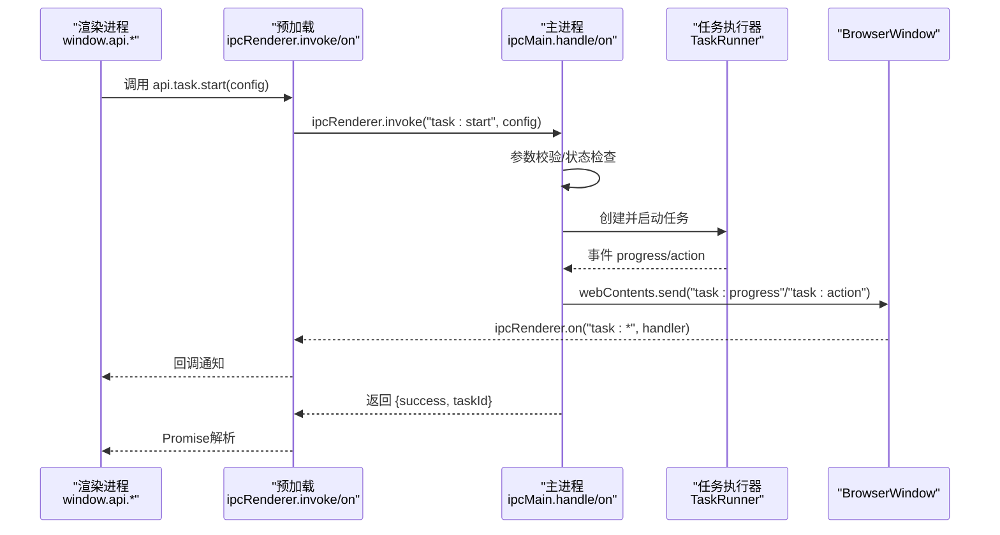
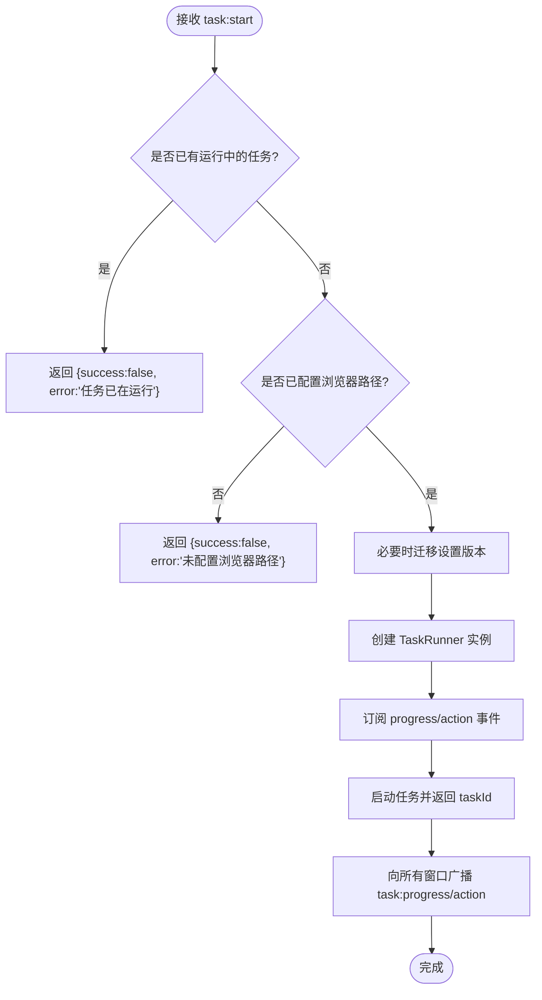
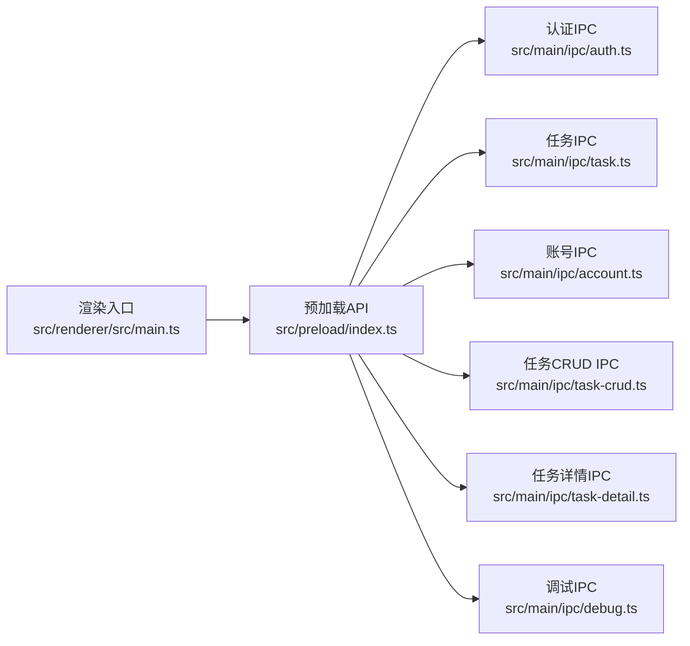

# IPC架构设计

<cite>
**本文引用的文件**
- [src/main/index.ts](file://src/main/index.ts)
- [src/preload/index.ts](file://src/preload/index.ts)
- [src/preload/index.d.ts](file://src/preload/index.d.ts)
- [src/main/ipc/auth.ts](file://src/main/ipc/auth.ts)
- [src/main/ipc/task.ts](file://src/main/ipc/task.ts)
- [src/main/ipc/account.ts](file://src/main/ipc/account.ts)
- [src/main/ipc/task-crud.ts](file://src/main/ipc/task-crud.ts)
- [src/main/ipc/task-detail.ts](file://src/main/ipc/task-detail.ts)
- [src/main/ipc/debug.ts](file://src/main/ipc/debug.ts)
- [src/renderer/src/main.ts](file://src/renderer/src/main.ts)
- [package.json](file://package.json)
- [electron.vite.config.ts](file://electron.vite.config.ts)
</cite>

## 目录
1. [简介](#简介)
2. [项目结构](#项目结构)
3. [核心组件](#核心组件)
4. [架构总览](#架构总览)
5. [详细组件分析](#详细组件分析)
6. [依赖关系分析](#依赖关系分析)
7. [性能考量](#性能考量)
8. [故障排查指南](#故障排查指南)
9. [结论](#结论)
10. [附录](#附录)

## 简介
本文件系统性阐述 AutoOps 的 Electron IPC 架构设计，重点覆盖以下方面：
- 主进程与渲染进程之间的通信路径与消息协议
- 预加载脚本的安全边界与暴露 API 设计
- IPC 处理器的注册与事件驱动模式
- 异步通信（invoke/on）与广播（webContents.send）机制
- 安全与权限控制、数据校验策略
- 完整的架构图与组件交互时序图
- 实际代码示例的路径指引与最佳实践

## 项目结构
AutoOps 采用标准的 Electron-Vite 分层组织：主进程入口负责窗口创建与 IPC 注册；预加载脚本通过 contextBridge 暴露受控 API；渲染进程基于 Vue 应用启动。

图表来源
- [src/main/index.ts:22-52](file://src/main/index.ts#L22-L52)
- [src/preload/index.ts:187](file://src/preload/index.ts#L187)
- [src/renderer/src/main.ts:1-12](file://src/renderer/src/main.ts#L1-L12)

章节来源
- [src/main/index.ts:1-106](file://src/main/index.ts#L1-L106)
- [src/preload/index.ts:1-187](file://src/preload/index.ts#L1-L187)
- [src/preload/index.d.ts:1-7](file://src/preload/index.d.ts#L1-L7)
- [src/renderer/src/main.ts:1-12](file://src/renderer/src/main.ts#L1-L12)

## 核心组件
- 主进程入口与窗口初始化：负责创建 BrowserWindow、设置 webPreferences（上下文隔离、禁用 Node 集成）、注册所有 IPC 处理器、加载渲染页面。
- 预加载脚本：通过 contextBridge 将有限的 API 暴露到渲染进程，使用 ipcRenderer.invoke/on 进行请求-响应与事件订阅。
- IPC 处理器：按功能模块拆分（认证、任务、账号、任务模板/历史、调试等），主进程使用 ipcMain.handle/on 响应调用并广播事件。
- 渲染进程：以 Vue 应用启动，通过 window.api 调用预加载暴露的方法。

章节来源
- [src/main/index.ts:22-84](file://src/main/index.ts#L22-L84)
- [src/preload/index.ts:95-187](file://src/preload/index.ts#L95-L187)
- [src/main/ipc/auth.ts:1-23](file://src/main/ipc/auth.ts#L1-L23)
- [src/main/ipc/task.ts:1-104](file://src/main/ipc/task.ts#L1-L104)
- [src/main/ipc/account.ts:1-101](file://src/main/ipc/account.ts#L1-L101)
- [src/main/ipc/task-crud.ts:1-108](file://src/main/ipc/task-crud.ts#L1-L108)
- [src/main/ipc/task-detail.ts:1-39](file://src/main/ipc/task-detail.ts#L1-L39)
- [src/main/ipc/debug.ts:1-12](file://src/main/ipc/debug.ts#L1-L12)

## 架构总览
下图展示了从渲染进程发起 IPC 请求到主进程处理并回传结果的端到端流程，以及主进程向所有窗口广播事件的机制。

图表来源
- [src/preload/index.ts:102-116](file://src/preload/index.ts#L102-L116)
- [src/main/ipc/task.ts:11-84](file://src/main/ipc/task.ts#L11-L84)

章节来源
- [src/preload/index.ts:95-187](file://src/preload/index.ts#L95-L187)
- [src/main/ipc/task.ts:1-104](file://src/main/ipc/task.ts#L1-L104)

## 详细组件分析

### 预加载脚本与安全边界
- 安全配置
  - 上下文隔离开启，Node 集成关闭，沙箱关闭但隔离有效。
  - 仅通过 contextBridge 暴露受控 API，避免直接暴露 Node/Electron 能力。
- API 设计
  - 使用统一命名空间与方法集合，如 api.auth、api.task、api.account 等。
  - 所有调用通过 ipcRenderer.invoke（请求-响应）或 ipcRenderer.on（事件订阅）完成。
  - 事件订阅返回移除函数，便于组件销毁时清理监听。
- 类型约束
  - 通过全局类型声明确保 window.api 的类型安全，便于 IDE 提示与编译期校验。

章节来源
- [src/main/index.ts:30-36](file://src/main/index.ts#L30-L36)
- [src/preload/index.ts:3-93](file://src/preload/index.ts#L3-L93)
- [src/preload/index.ts:95-187](file://src/preload/index.ts#L95-L187)
- [src/preload/index.d.ts:1-7](file://src/preload/index.d.ts#L1-L7)

### 认证模块（auth）
- 功能要点
  - 提供 hasAuth/login/logout/getAuth 四个方法，基于本地存储进行认证状态管理。
  - 主进程侧通过 ipcMain.handle 注册，渲染侧通过 api.auth.* 调用。
- 数据流
  - 登录成功后写入存储，后续查询与登出清空存储。
- 安全建议
  - 对 authData 进行最小化存储，必要时加密敏感字段。
  - 在渲染侧对敏感操作增加二次确认与权限校验。

章节来源
- [src/main/ipc/auth.ts:1-23](file://src/main/ipc/auth.ts#L1-L23)
- [src/preload/index.ts:96-101](file://src/preload/index.ts#L96-L101)

### 任务模块（task）
- 功能要点
  - 支持启动/停止/状态查询；通过事件广播进度与动作结果。
  - 启动前校验浏览器可执行路径；支持设置版本迁移（FeedAC Settings V2 -> V3）。
  - 任务运行期间向所有窗口广播 task:progress 与 task:action 事件。
- 错误处理
  - 捕获异常并返回错误信息；清理当前任务实例。
- 广播机制
  - 使用 BrowserWindow.getAllWindows() 获取实例并逐个发送事件，保证多窗口一致性。

图表来源
- [src/main/ipc/task.ts:11-84](file://src/main/ipc/task.ts#L11-L84)

章节来源
- [src/main/ipc/task.ts:1-104](file://src/main/ipc/task.ts#L1-L104)

### 账号模块（account）
- 功能要点
  - 列表、新增、更新、删除、设默认、查询默认、按 ID/平台查询、查询活跃账号。
  - 新增时自动生成唯一 ID 与创建时间，首次添加自动设为默认账号。
  - 删除后若列表非空且无默认账号，则自动选择首个账号设为默认。
- 数据模型
  - 账号对象包含平台、存储状态、头像、状态（active/inactive/expired）等字段。

章节来源
- [src/main/ipc/account.ts:1-101](file://src/main/ipc/account.ts#L1-L101)

### 任务 CRUD 与模板（task-crud）
- 功能要点
  - 支持任务的查询、创建、更新、删除、去重；支持任务模板的保存与删除。
  - 创建时生成唯一 ID、记录创建/更新时间；模板保存时可指定平台与任务类型。
- 数据持久化
  - 基于本地存储键值对维护任务与模板列表。

章节来源
- [src/main/ipc/task-crud.ts:1-108](file://src/main/ipc/task-crud.ts#L1-L108)

### 任务详情（task-detail）
- 功能要点
  - 查询任务详情、追加视频记录（含评论计数联动）、更新任务状态（含结束时间）。
  - 更新失败时返回错误信息，保证幂等与一致性。

章节来源
- [src/main/ipc/task-detail.ts:1-39](file://src/main/ipc/task-detail.ts#L1-L39)

### 调试模块（debug）
- 功能要点
  - 暴露平台、架构、版本信息用于诊断与日志输出。

章节来源
- [src/main/ipc/debug.ts:1-12](file://src/main/ipc/debug.ts#L1-L12)

### 渲染进程入口
- 功能要点
  - 初始化 Vue 应用、Pinia、路由，挂载到 DOM。
  - 通过 window.api 调用预加载暴露的 IPC 方法。

章节来源
- [src/renderer/src/main.ts:1-12](file://src/renderer/src/main.ts#L1-L12)

## 依赖关系分析
- 主进程入口集中注册所有 IPC 处理器，形成清晰的模块化边界。
- 预加载脚本作为“桥接层”，将渲染侧调用映射到具体 IPC 名称，降低渲染侧耦合度。
- 渲染侧不直接依赖 Electron，仅通过 window.api 调用，提升安全性与可测试性。

图表来源
- [src/renderer/src/main.ts:1-12](file://src/renderer/src/main.ts#L1-L12)
- [src/preload/index.ts:95-187](file://src/preload/index.ts#L95-L187)
- [src/main/ipc/auth.ts:1-23](file://src/main/ipc/auth.ts#L1-L23)
- [src/main/ipc/task.ts:1-104](file://src/main/ipc/task.ts#L1-L104)
- [src/main/ipc/account.ts:1-101](file://src/main/ipc/account.ts#L1-L101)
- [src/main/ipc/task-crud.ts:1-108](file://src/main/ipc/task-crud.ts#L1-L108)
- [src/main/ipc/task-detail.ts:1-39](file://src/main/ipc/task-detail.ts#L1-L39)
- [src/main/ipc/debug.ts:1-12](file://src/main/ipc/debug.ts#L1-L12)

章节来源
- [src/main/index.ts:4-16](file://src/main/index.ts#L4-L16)
- [src/main/index.ts:63-75](file://src/main/index.ts#L63-L75)

## 性能考量
- 事件广播范围
  - 当前实现遍历所有窗口并逐一发送事件，适用于多窗口场景；若窗口数量较多，可考虑按需广播或分组广播以减少开销。
- 任务并发
  - 主进程仅允许单任务运行，避免资源竞争；如需扩展，应在 TaskRunner 层面引入队列与资源锁。
- 日志与可观测性
  - 主进程对关键 IPC 流程记录日志，便于问题定位；建议在渲染侧也记录调用轨迹，配合服务端日志进行端到端追踪。

## 故障排查指南
- 无法收到任务事件
  - 检查渲染侧是否正确订阅 api.task.onProgress/api.task.onAction，并在组件卸载时调用返回的移除函数。
  - 确认主进程是否已向所有窗口广播事件。
- 任务启动失败
  - 检查浏览器可执行路径是否配置；查看主进程日志中关于路径与设置版本迁移的信息。
- 认证状态异常
  - 确认登录成功后存储已写入；登出后存储已被清空；必要时在渲染侧增加状态提示与重试逻辑。
- 调试信息缺失
  - 使用 api.debug.getEnv 获取平台与版本信息，辅助定位环境差异导致的问题。

章节来源
- [src/main/ipc/task.ts:51-63](file://src/main/ipc/task.ts#L51-L63)
- [src/main/ipc/task.ts:32-38](file://src/main/ipc/task.ts#L32-L38)
- [src/main/ipc/auth.ts:10-18](file://src/main/ipc/auth.ts#L10-L18)
- [src/main/ipc/debug.ts:4-11](file://src/main/ipc/debug.ts#L4-L11)

## 结论
AutoOps 的 IPC 架构遵循“上下文隔离 + 受控 API 暴露”的安全原则，通过模块化的 IPC 处理器与事件驱动的异步通信，实现了渲染层与主进程的清晰边界。预加载脚本作为桥接层，既保证了易用性，又限制了潜在风险。未来可在事件广播优化、并发任务支持与更强的数据校验方面进一步增强。

## 附录

### IPC 通信最佳实践（示例路径）
- 渲染侧调用任务启动
  - [src/preload/index.ts:102-104](file://src/preload/index.ts#L102-L104)
  - [src/main/ipc/task.ts:17-71](file://src/main/ipc/task.ts#L17-L71)
- 渲染侧订阅任务进度
  - [src/preload/index.ts:106-115](file://src/preload/index.ts#L106-L115)
  - [src/main/ipc/task.ts:51-63](file://src/main/ipc/task.ts#L51-L63)
- 渲染侧调用账号查询
  - [src/preload/index.ts:137-147](file://src/preload/index.ts#L137-L147)
  - [src/main/ipc/account.ts:33-35](file://src/main/ipc/account.ts#L33-L35)
- 渲染侧调用任务 CRUD
  - [src/preload/index.ts:168-176](file://src/preload/index.ts#L168-L176)
  - [src/main/ipc/task-crud.ts:29-44](file://src/main/ipc/task-crud.ts#L29-L44)

### 构建与运行配置
- 应用入口与打包配置
  - [package.json:1-85](file://package.json#L1-L85)
  - [electron.vite.config.ts:1-34](file://electron.vite.config.ts#L1-L34)