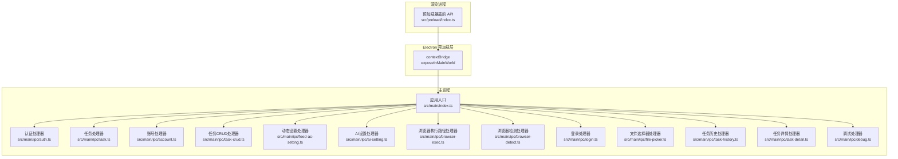
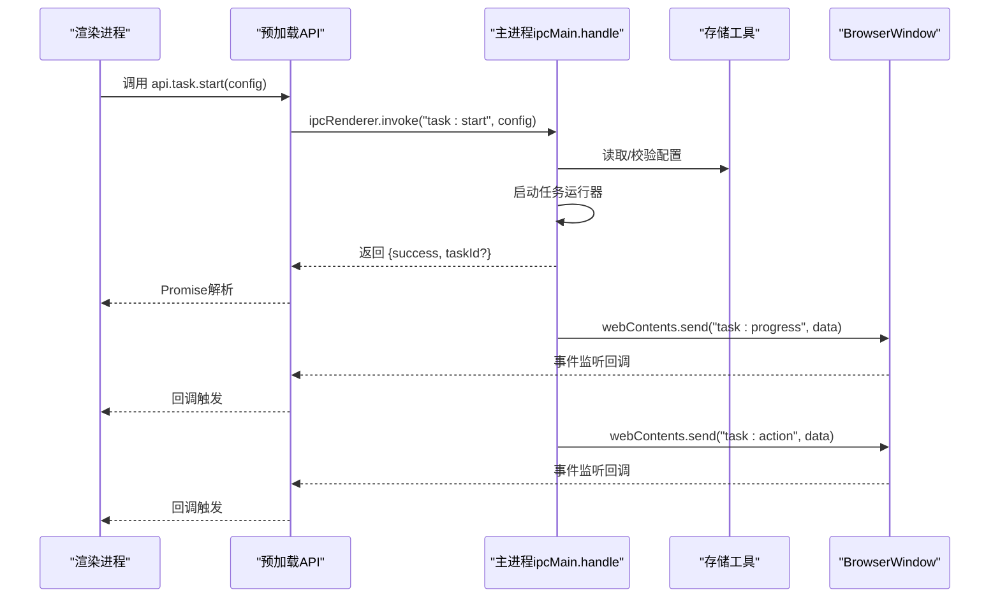
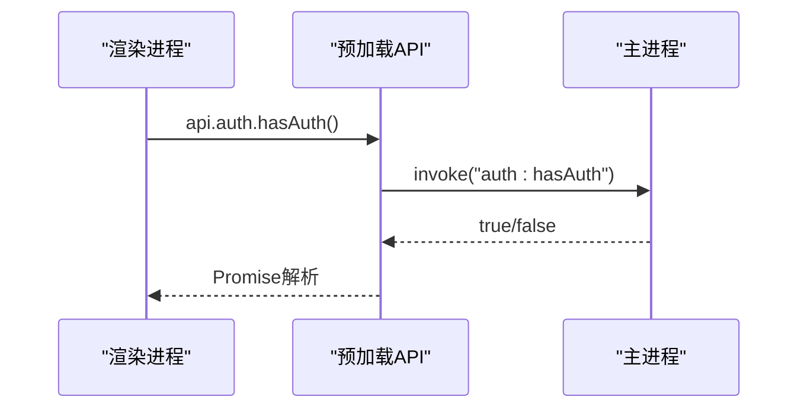
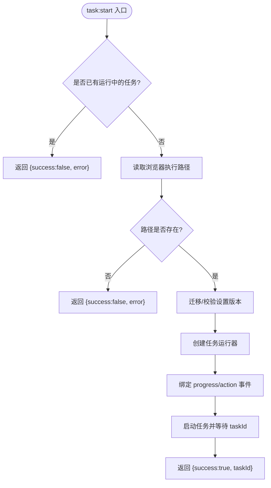
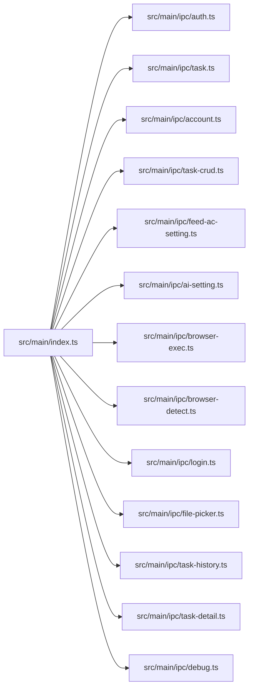

# IPC通信

<cite>
**本文引用的文件**
- [src/preload/index.ts](file://src/preload/index.ts)
- [src/main/index.ts](file://src/main/index.ts)
- [src/main/ipc/auth.ts](file://src/main/ipc/auth.ts)
- [src/main/ipc/task.ts](file://src/main/ipc/task.ts)
- [src/main/ipc/account.ts](file://src/main/ipc/account.ts)
- [src/main/ipc/task-crud.ts](file://src/main/ipc/task-crud.ts)
- [src/main/ipc/feed-ac-setting.ts](file://src/main/ipc/feed-ac-setting.ts)
- [src/main/ipc/ai-setting.ts](file://src/main/ipc/ai-setting.ts)
- [src/main/ipc/browser-exec.ts](file://src/main/ipc/browser-exec.ts)
- [src/main/ipc/browser-detect.ts](file://src/main/ipc/browser-detect.ts)
- [src/main/ipc/login.ts](file://src/main/ipc/login.ts)
- [src/main/ipc/file-picker.ts](file://src/main/ipc/file-picker.ts)
- [src/main/ipc/task-history.ts](file://src/main/ipc/task-history.ts)
- [src/main/ipc/task-detail.ts](file://src/main/ipc/task-detail.ts)
- [src/main/ipc/debug.ts](file://src/main/ipc/debug.ts)
</cite>

## 目录
1. [简介](#简介)
2. [项目结构](#项目结构)
3. [核心组件](#核心组件)
4. [架构总览](#架构总览)
5. [详细组件分析](#详细组件分析)
6. [依赖关系分析](#依赖关系分析)
7. [性能考量](#性能考量)
8. [故障排查指南](#故障排查指南)
9. [结论](#结论)
10. [附录：IPC API 完整参考](#附录ipc-api-完整参考)

## 简介
本文件系统性梳理 AutoOps 的 IPC（进程间通信）体系，覆盖主进程与渲染进程之间的通信机制、消息传递协议、数据序列化方式、各类 IPC 处理器的实现原理、请求-响应模式与错误处理策略，并给出通信安全、性能优化与调试方法。同时提供 IPC API 的完整参考与使用示例路径，解释预加载脚本的安全作用与限制机制。

## 项目结构
AutoOps 的 IPC 架构采用“预加载桥接 + 主进程处理器”的模式：
- 预加载脚本通过 contextBridge 暴露受控 API 到渲染进程，统一使用 ipcRenderer.invoke 进行请求，使用 ipcRenderer.on 订阅事件。
- 主进程在应用启动时注册所有 IPC 处理器，使用 ipcMain.handle 响应请求，使用 BrowserWindow.webContents.send 广播事件。

图表来源
- [src/main/index.ts:54-84](file://src/main/index.ts#L54-L84)
- [src/preload/index.ts:95-187](file://src/preload/index.ts#L95-L187)

章节来源
- [src/main/index.ts:1-106](file://src/main/index.ts#L1-L106)
- [src/preload/index.ts:1-187](file://src/preload/index.ts#L1-L187)

## 核心组件
- 预加载 API 接口定义与实现：集中于预加载脚本，定义了渲染进程可用的 API 名称空间与方法签名，并通过 ipcRenderer.invoke 调用主进程；对进度与动作等事件使用 ipcRenderer.on 订阅。
- 主进程处理器：每个功能域一个处理器文件，使用 ipcMain.handle 注册请求处理函数，返回 Promise；使用 BrowserWindow.webContents.send 广播事件给所有窗口。
- 存储与工具：处理器普遍依赖存储工具读写配置与状态，如浏览器执行路径、账号列表、任务模板、动态设置等。
- 日志：主进程统一使用 electron-log 记录日志，渲染端可通过特定 IPC 将日志转发到主进程记录。

章节来源
- [src/preload/index.ts:3-93](file://src/preload/index.ts#L3-L93)
- [src/main/index.ts:17-106](file://src/main/index.ts#L17-L106)

## 架构总览
下图展示了从渲染进程发起调用到主进程处理再到事件广播的整体流程：

图表来源
- [src/main/ipc/task.ts:11-103](file://src/main/ipc/task.ts#L11-L103)
- [src/preload/index.ts:102-116](file://src/preload/index.ts#L102-L116)

## 详细组件分析

### 预加载脚本与安全边界
- 作用：通过 contextBridge.exposeInMainWorld 将受限 API 暴露给渲染进程，避免直接访问 Node/Electron API。
- 限制机制：仅暴露白名单方法，参数与返回值类型由接口定义约束；事件订阅通过 on/removeListener 管理，防止内存泄漏。
- 数据序列化：invoke 与 send 均基于可序列化数据传输，复杂对象需遵循可序列化规则。

章节来源
- [src/preload/index.ts:1-187](file://src/preload/index.ts#L1-L187)

### 认证 IPC（auth）
- 请求-响应模式：hasAuth/login/logout/getAuth 四个方法均通过 ipcRenderer.invoke 调用，主进程使用 ipcMain.handle 实现。
- 错误处理：主进程直接返回布尔或对象，渲染侧根据 success 字段判断结果。
- 数据序列化：认证数据以任意对象形式传递，主进程存入存储工具。

图表来源
- [src/main/ipc/auth.ts:4-23](file://src/main/ipc/auth.ts#L4-L23)
- [src/preload/index.ts:96-101](file://src/preload/index.ts#L96-L101)

章节来源
- [src/main/ipc/auth.ts:1-23](file://src/main/ipc/auth.ts#L1-L23)
- [src/preload/index.ts:4-9](file://src/preload/index.ts#L4-L9)

### 任务 IPC（task）
- 请求-响应模式：start/stop/status 使用 invoke；进度与动作事件通过 on 订阅。
- 并发控制：同一时刻仅允许一个任务运行，重复启动返回错误。
- 事件广播：使用 BrowserWindow.getAllWindows() 对所有窗口广播进度与动作事件。
- 数据序列化：任务配置与事件数据均为可序列化对象。

图表来源
- [src/main/ipc/task.ts:11-103](file://src/main/ipc/task.ts#L11-L103)

章节来源
- [src/main/ipc/task.ts:1-104](file://src/main/ipc/task.ts#L1-L104)
- [src/preload/index.ts:102-116](file://src/preload/index.ts#L102-L116)

### 账号 IPC（account）
- 功能：列出、新增、更新、删除、设默认、查询默认、按 ID 查询、按平台筛选、查询活跃账号。
- 数据模型：Account 接口定义字段，新增时自动生成唯一 ID 与创建时间，首次添加自动设为默认账号。
- 错误处理：更新不存在的账号会抛出异常；删除后若无默认账号则自动选择首个账号设为默认。

章节来源
- [src/main/ipc/account.ts:1-101](file://src/main/ipc/account.ts#L1-L101)

### 任务 CRUD 与模板 IPC（task-crud）
- 功能：获取全部任务、按 ID/账户/平台查询、创建、更新、删除、复制任务；保存/删除任务模板。
- 默认值：创建任务时自动填充平台、任务类型与默认动态设置。
- 数据模型：Task 与 TaskTemplate 接口，生成唯一 ID。

章节来源
- [src/main/ipc/task-crud.ts:1-108](file://src/main/ipc/task-crud.ts#L1-L108)

### 动态设置 IPC（feed-ac-setting）
- 功能：获取、更新、重置、导出、导入动态设置；内部保证返回 V3 版本配置。
- 版本迁移：当存储为 V2 时自动迁移至 V3，默认值回退到 V3 默认配置。

章节来源
- [src/main/ipc/feed-ac-setting.ts:1-44](file://src/main/ipc/feed-ac-setting.ts#L1-L44)

### AI 设置 IPC（ai-setting）
- 功能：获取、更新、重置 AI 设置；测试接口占位返回提示信息。
- 默认值：缺失时返回默认 AI 设置。

章节来源
- [src/main/ipc/ai-setting.ts:1-27](file://src/main/ipc/ai-setting.ts#L1-L27)

### 浏览器执行路径 IPC（browser-exec）
- 功能：获取/设置浏览器可执行路径；用于任务启动前的前置检查。

章节来源
- [src/main/ipc/browser-exec.ts:1-13](file://src/main/ipc/browser-exec.ts#L1-L13)

### 浏览器检测 IPC（browser-detect）
- 功能：扫描系统常见路径与注册表（Windows）定位已安装浏览器，去重后返回名称、路径与版本。
- 跨平台：不同平台的常见路径集合；仅 Windows 支持注册表查询。

章节来源
- [src/main/ipc/browser-detect.ts:1-118](file://src/main/ipc/browser-detect.ts#L1-L118)

### 登录 IPC（login）
- 功能：抖音登录流程封装，使用 Playwright 启动带临时用户数据目录的 Chromium，等待用户手动登录后提取用户信息与 Cookie，返回可复用的 storageState。
- 参数校验：若未配置浏览器路径，直接返回错误。
- 数据序列化：storageState 以字符串形式返回，便于后续任务复用。

章节来源
- [src/main/ipc/login.ts:1-173](file://src/main/ipc/login.ts#L1-L173)

### 文件选择器 IPC（file-picker）
- 功能：打开系统对话框选择文件或目录，返回路径与基础名；取消时返回标记与空值。

章节来源
- [src/main/ipc/file-picker.ts:1-37](file://src/main/ipc/file-picker.ts#L1-L37)

### 任务历史与详情 IPC（task-history / task-detail）
- 任务历史：增删改查与清空；新增时插入到头部。
- 任务详情：追加视频记录并维护统计字段；更新状态时在完成/停止/错误时补记结束时间。

章节来源
- [src/main/ipc/task-history.ts:1-45](file://src/main/ipc/task-history.ts#L1-L45)
- [src/main/ipc/task-detail.ts:1-39](file://src/main/ipc/task-detail.ts#L1-L39)

### 调试 IPC（debug）
- 功能：返回当前平台、架构、版本信息，辅助诊断。

章节来源
- [src/main/ipc/debug.ts:1-12](file://src/main/ipc/debug.ts#L1-L12)

## 依赖关系分析
- 应用入口负责注册所有 IPC 处理器，并在窗口创建时注入预加载脚本。
- 预加载脚本集中声明 API 接口与实现，统一调用约定。
- 处理器之间低耦合，通过存储工具共享状态；任务运行器作为外部组件被任务处理器驱动。

图表来源
- [src/main/index.ts:54-76](file://src/main/index.ts#L54-L76)

章节来源
- [src/main/index.ts:1-106](file://src/main/index.ts#L1-L106)

## 性能考量
- 事件广播范围：任务进度与动作事件通过遍历所有窗口发送，窗口数量较多时建议在渲染端做本地去重与节流。
- 任务并发：单实例任务避免资源竞争与状态混乱，适合大多数场景。
- 序列化成本：尽量减少大对象的频繁传输；必要时拆分多次小消息。
- 存储访问：批量更新时合并写入，降低磁盘 IO。
- 日志：生产环境建议降低日志级别，避免高频 I/O 影响主线程。

## 故障排查指南
- 渲染端无法调用 API：确认预加载脚本已注入且未被 CSP 或上下文隔离破坏。
- 任务启动失败：检查浏览器执行路径是否配置；查看主进程日志中关于“Browser path not configured”等错误。
- 事件不触发：确认事件通道名称一致（如 task:progress），并在渲染端正确注册监听与清理。
- 登录失败：检查浏览器路径与网络连通性；查看主进程日志中的错误堆栈。
- 存储异常：确认存储键名与版本兼容（如动态设置 V2/V3 迁移）。

章节来源
- [src/main/index.ts:92-106](file://src/main/index.ts#L92-L106)
- [src/main/ipc/task.ts:32-36](file://src/main/ipc/task.ts#L32-L36)
- [src/main/ipc/login.ts:160-167](file://src/main/ipc/login.ts#L160-L167)

## 结论
AutoOps 的 IPC 体系以预加载脚本为核心边界，围绕功能域划分处理器，采用 invoke/on 统一的消息模型，结合存储工具实现配置与状态持久化。整体设计清晰、职责明确，具备良好的扩展性与可维护性。建议在高并发场景下进一步优化事件广播与序列化策略，并完善错误处理与可观测性。

## 附录：IPC API 完整参考

- 认证（auth）
  - hasAuth(): Promise<boolean>
  - login(authData: unknown): Promise<{ success: boolean }>
  - logout(): Promise<{ success: boolean }>
  - getAuth(): Promise<unknown>

- 任务（task）
  - start(config: { settings: unknown; accountId?: string; taskType?: string }): Promise<{ success: boolean; taskId?: string; error?: string }>
  - stop(): Promise<{ success: boolean; error?: string }>
  - status(): Promise<{ running: boolean }>
  - onProgress(callback: (data: { message: string; timestamp: number }) => void): void
  - onAction(callback: (data: { videoId: string; action: string; success: boolean }) => void): void

- 动态设置（feed-ac-settings）
  - get(): Promise<unknown>
  - update(settings: unknown): Promise<unknown>
  - reset(): Promise<unknown>
  - export(): Promise<unknown>
  - import(settings: unknown): Promise<{ success: boolean }>

- AI 设置（ai-settings）
  - get(): Promise<unknown>
  - update(settings: unknown): Promise<unknown>
  - reset(): Promise<unknown>
  - test(config: unknown): Promise<{ success: boolean; message: string }>

- 浏览器执行路径（browser-exec）
  - get(): Promise<string | null>
  - set(path: string): Promise<{ success: boolean }>

- 浏览器检测（browser）
  - detect(): Promise<{ path: string; name: string; version: string }[]>

- 账号（account）
  - list(): Promise<unknown[]>
  - add(account: unknown): Promise<unknown>
  - update(id: string, updates: unknown): Promise<unknown>
  - delete(id: string): Promise<{ success: boolean }>
  - setDefault(id: string): Promise<{ success: boolean }>
  - getDefault(): Promise<unknown | null>
  - getById(id: string): Promise<unknown | null>
  - getByPlatform(platform: string): Promise<unknown[]>
  - getActiveAccounts(): Promise<unknown[]>

- 登录（login）
  - douyin(): Promise<{ success: boolean; storageState?: string; error?: string; userInfo?: { nickname: string; avatar?: string; uniqueId?: string } }>

- 文件选择器（file-picker）
  - selectFile(options?: { filters?: { name: string; extensions: string[] }[] }): Promise<{ canceled: boolean; filePath: string | null; fileName?: string }>
  - selectDirectory(): Promise<{ canceled: boolean; dirPath: string | null; dirName?: string }>

- 任务历史（task-history）
  - getAll(): Promise<unknown[]>
  - getById(id: string): Promise<unknown | null>
  - add(record: unknown): Promise<{ success: boolean }>
  - update(id: string, updates: unknown): Promise<{ success: boolean }>
  - delete(id: string): Promise<{ success: boolean }>
  - clear(): Promise<{ success: boolean }>

- 任务详情（task-detail）
  - get(id: string): Promise<unknown | null>
  - addVideoRecord(taskId: string, videoRecord: unknown): Promise<{ success: boolean }>
  - updateStatus(taskId: string, status: string): Promise<{ success: boolean }>

- 任务 CRUD（taskCRUD）
  - getAll(): Promise<unknown[]>
  - getById(id: string): Promise<unknown | null>
  - getByAccount(accountId: string): Promise<unknown[]>
  - create(data: { name: string; accountId: string; taskType?: string; config?: unknown }): Promise<unknown>
  - update(id: string, updates: unknown): Promise<unknown | null>
  - delete(id: string): Promise<{ success: boolean }>
  - duplicate(id: string): Promise<unknown | null>

- 任务模板（task-template）
  - getAll(): Promise<unknown[]>
  - save(name: string, config: unknown): Promise<unknown>
  - delete(id: string): Promise<{ success: boolean }>

- 调试（debug）
  - getEnv(): Promise<unknown>

章节来源
- [src/preload/index.ts:3-93](file://src/preload/index.ts#L3-L93)
- [src/main/ipc/auth.ts:4-23](file://src/main/ipc/auth.ts#L4-L23)
- [src/main/ipc/task.ts:11-103](file://src/main/ipc/task.ts#L11-L103)
- [src/main/ipc/account.ts:32-100](file://src/main/ipc/account.ts#L32-L100)
- [src/main/ipc/task-crud.ts:8-107](file://src/main/ipc/task-crud.ts#L8-L107)
- [src/main/ipc/feed-ac-setting.ts:16-43](file://src/main/ipc/feed-ac-setting.ts#L16-L43)
- [src/main/ipc/ai-setting.ts:5-27](file://src/main/ipc/ai-setting.ts#L5-L27)
- [src/main/ipc/browser-exec.ts:4-12](file://src/main/ipc/browser-exec.ts#L4-L12)
- [src/main/ipc/browser-detect.ts:105-117](file://src/main/ipc/browser-detect.ts#L105-L117)
- [src/main/ipc/login.ts:17-172](file://src/main/ipc/login.ts#L17-L172)
- [src/main/ipc/file-picker.ts:4-36](file://src/main/ipc/file-picker.ts#L4-L36)
- [src/main/ipc/task-history.ts:5-44](file://src/main/ipc/task-history.ts#L5-L44)
- [src/main/ipc/task-detail.ts:5-38](file://src/main/ipc/task-detail.ts#L5-L38)
- [src/main/ipc/debug.ts:3-11](file://src/main/ipc/debug.ts#L3-L11)