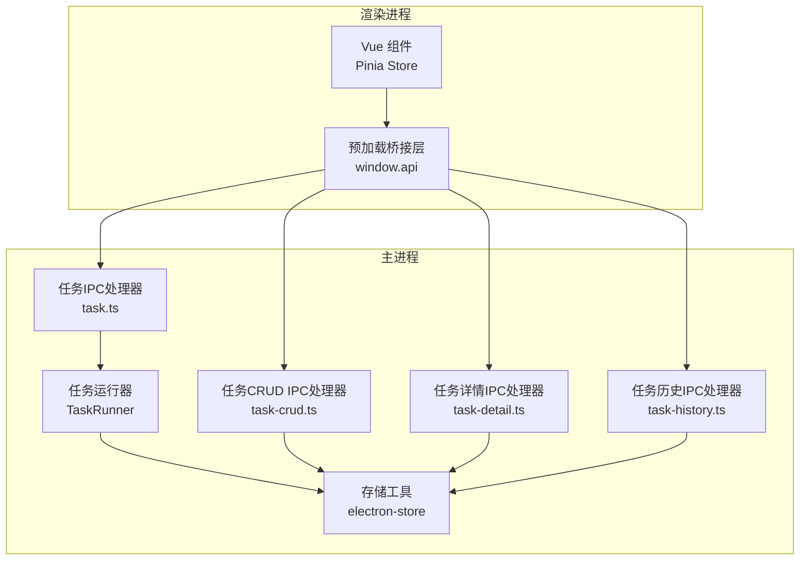
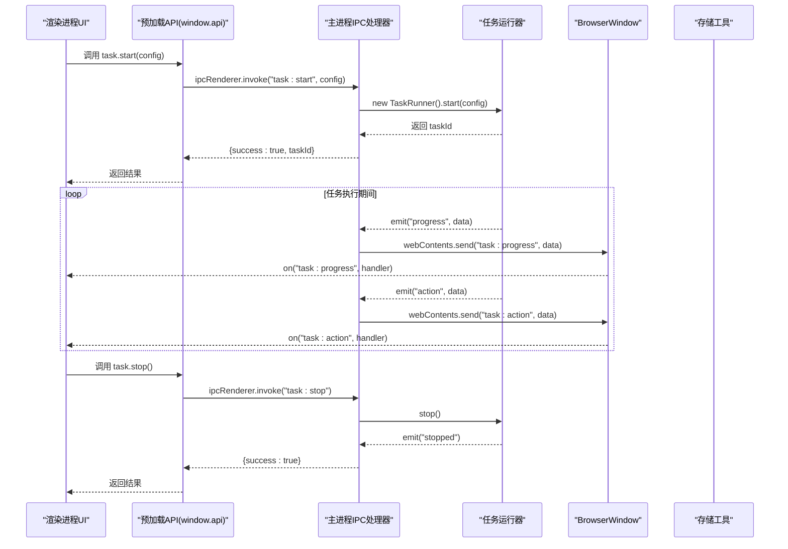
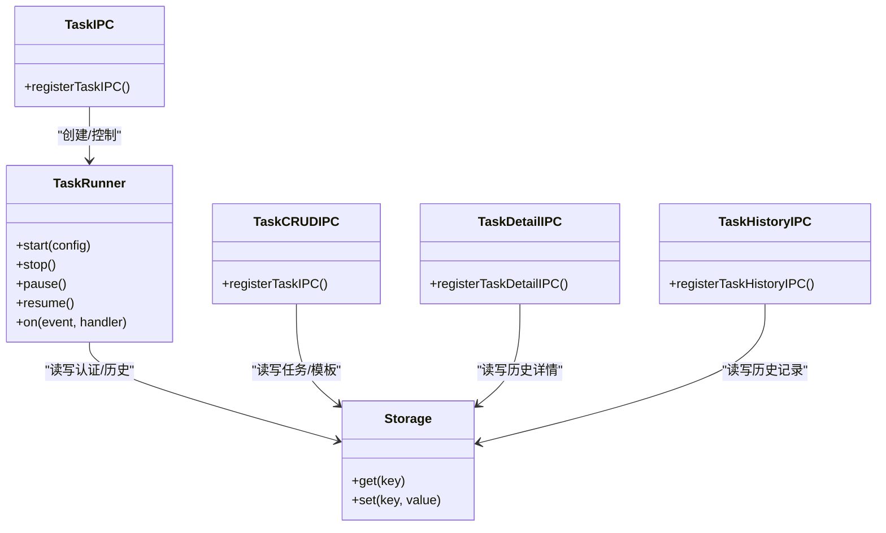

# 任务管理IPC

<cite>
**本文档引用的文件**
- [src/main/ipc/task.ts](file://src/main/ipc/task.ts)
- [src/main/ipc/task-crud.ts](file://src/main/ipc/task-crud.ts)
- [src/main/ipc/task-detail.ts](file://src/main/ipc/task-detail.ts)
- [src/main/ipc/task-history.ts](file://src/main/ipc/task-history.ts)
- [src/main/service/task-runner.ts](file://src/main/service/task-runner.ts)
- [src/preload/index.ts](file://src/preload/index.ts)
- [src/renderer/src/stores/task.ts](file://src/renderer/src/stores/task.ts)
- [src/shared/task.ts](file://src/shared/task.ts)
- [src/shared/task-history.ts](file://src/shared/task-history.ts)
- [src/shared/feed-ac-setting.ts](file://src/shared/feed-ac-setting.ts)
- [src/shared/platform.ts](file://src/shared/platform.ts)
- [src/main/utils/storage.ts](file://src/main/utils/storage.ts)
- [package.json](file://package.json)
</cite>

## 目录
1. [简介](#简介)
2. [项目结构](#项目结构)
3. [核心组件](#核心组件)
4. [架构总览](#架构总览)
5. [详细组件分析](#详细组件分析)
6. [依赖关系分析](#依赖关系分析)
7. [性能考虑](#性能考虑)
8. [故障排查指南](#故障排查指南)
9. [结论](#结论)
10. [附录](#附录)

## 简介
本文件为 AutoOps 任务管理 IPC 模块的详细技术文档，聚焦于任务生命周期管理的 IPC 通信机制，涵盖任务启动、停止、状态查询与进度监控；任务 CRUD 操作的 IPC 实现；任务详情与历史记录管理的通信协议；任务执行状态的实时同步机制、错误处理策略与异常恢复方案；任务配置的序列化传输、版本兼容性处理与数据验证机制；以及完整的任务管理 IPC API 参考与使用示例路径。

## 项目结构
任务管理 IPC 模块由主进程 IPC 注册器、渲染进程预加载桥接层、任务运行器服务、共享数据模型与存储工具组成，形成清晰的分层架构：
- 主进程 IPC 层：注册任务启动/停止/状态查询、任务 CRUD、任务详情与历史记录等 IPC 处理函数
- 预加载桥接层：向渲染进程暴露安全的 API 接口，封装 ipcRenderer.invoke 与事件监听
- 任务运行器服务：负责实际任务执行、事件发射与状态管理
- 共享数据模型：定义任务、任务模板、任务历史、FeedAC 设置、平台类型等接口
- 存储工具：基于 electron-store 的键值存储封装

图表来源
- [src/preload/index.ts:1-187](file://src/preload/index.ts#L1-L187)
- [src/main/ipc/task.ts:11-103](file://src/main/ipc/task.ts#L11-L103)
- [src/main/ipc/task-crud.ts:8-107](file://src/main/ipc/task-crud.ts#L8-L107)
- [src/main/ipc/task-detail.ts:5-39](file://src/main/ipc/task-detail.ts#L5-L39)
- [src/main/ipc/task-history.ts:5-45](file://src/main/ipc/task-history.ts#L5-L45)
- [src/main/service/task-runner.ts:25-760](file://src/main/service/task-runner.ts#L25-L760)
- [src/main/utils/storage.ts:14-46](file://src/main/utils/storage.ts#L14-L46)

章节来源
- [src/preload/index.ts:1-187](file://src/preload/index.ts#L1-L187)
- [src/main/ipc/task.ts:11-103](file://src/main/ipc/task.ts#L11-L103)
- [src/main/ipc/task-crud.ts:8-107](file://src/main/ipc/task-crud.ts#L8-L107)
- [src/main/ipc/task-detail.ts:5-39](file://src/main/ipc/task-detail.ts#L5-L39)
- [src/main/ipc/task-history.ts:5-45](file://src/main/ipc/task-history.ts#L5-L45)
- [src/main/service/task-runner.ts:25-760](file://src/main/service/task-runner.ts#L25-L760)
- [src/main/utils/storage.ts:14-46](file://src/main/utils/storage.ts#L14-L46)

## 核心组件
- 任务IPC处理器：提供任务启动、停止、状态查询，并通过 BrowserWindow 广播进度与动作事件
- 任务CRUD处理器：提供任务列表、按条件查询、创建、更新、删除、复制模板等操作
- 任务详情处理器：提供单条任务详情查询、视频记录追加、状态更新
- 任务历史处理器：提供历史记录增删改查与清空
- 任务运行器：封装 Playwright 浏览器自动化、平台适配器、AI 评论生成、事件发射与状态管理
- 预加载桥接层：统一暴露 window.api，封装 invoke 与 on 事件监听
- 数据模型与存储：共享接口定义、版本迁移、存储键值映射

章节来源
- [src/main/ipc/task.ts:11-103](file://src/main/ipc/task.ts#L11-L103)
- [src/main/ipc/task-crud.ts:8-107](file://src/main/ipc/task-crud.ts#L8-L107)
- [src/main/ipc/task-detail.ts:5-39](file://src/main/ipc/task-detail.ts#L5-L39)
- [src/main/ipc/task-history.ts:5-45](file://src/main/ipc/task-history.ts#L5-L45)
- [src/main/service/task-runner.ts:25-760](file://src/main/service/task-runner.ts#L25-L760)
- [src/preload/index.ts:95-187](file://src/preload/index.ts#L95-L187)
- [src/shared/task.ts:5-54](file://src/shared/task.ts#L5-L54)
- [src/shared/feed-ac-setting.ts:37-145](file://src/shared/feed-ac-setting.ts#L37-L145)
- [src/shared/task-history.ts:14-26](file://src/shared/task-history.ts#L14-L26)
- [src/main/utils/storage.ts:29-46](file://src/main/utils/storage.ts#L29-L46)

## 架构总览
任务管理 IPC 的端到端流程如下：
- 渲染进程通过 window.api 调用主进程 IPC 方法
- 主进程根据请求类型分派到对应处理器或任务运行器
- 任务运行器在执行过程中通过事件发射进度与动作信息
- 主进程将事件广播给所有 BrowserWindow，渲染进程订阅并更新 UI
- 所有持久化数据通过 electron-store 键值存储统一管理

图表来源
- [src/preload/index.ts:102-116](file://src/preload/index.ts#L102-L116)
- [src/main/ipc/task.ts:11-103](file://src/main/ipc/task.ts#L11-L103)
- [src/main/service/task-runner.ts:55-113](file://src/main/service/task-runner.ts#L55-L113)

章节来源
- [src/preload/index.ts:102-116](file://src/preload/index.ts#L102-L116)
- [src/main/ipc/task.ts:11-103](file://src/main/ipc/task.ts#L11-L103)
- [src/main/service/task-runner.ts:55-113](file://src/main/service/task-runner.ts#L55-L113)

## 详细组件分析

### 任务生命周期管理IPC
- 任务启动
  - 参数：settings（FeedAC 设置，支持 v2/v3）、accountId、platform、taskType
  - 行为：校验当前是否已有运行中的任务；读取浏览器可执行路径；进行版本迁移（v2->v3）；创建 TaskRunner 并注册进度与动作事件广播；返回 {success, taskId}
  - 版本兼容：当 settings.version 为 'v2' 时，调用 migrateToV3 进行迁移
  - 错误处理：若无浏览器路径或启动异常，返回 {success:false, error}
- 任务停止
  - 行为：若存在运行中任务则调用 stop() 并清理引用，返回 {success:true}
  - 错误处理：若无任务运行，返回 {success:false, error:'No task running'}
- 任务状态查询
  - 行为：返回 {running: boolean}

章节来源
- [src/main/ipc/task.ts:11-103](file://src/main/ipc/task.ts#L11-L103)
- [src/shared/feed-ac-setting.ts:120-145](file://src/shared/feed-ac-setting.ts#L120-L145)

### 任务CRUD操作IPC
- 查询
  - getAll：返回所有任务
  - getById：按 ID 查询
  - getByAccount：按账号 ID 查询
  - getByPlatform：按平台查询
- 创建
  - create：生成唯一 ID，填充默认配置，写入存储
- 更新
  - update：按 ID 更新部分字段并更新时间戳
- 删除
  - delete：按 ID 过滤任务列表并写回
- 复制
  - duplicate：复制原任务并生成新 ID，名称加 "(副本)"

章节来源
- [src/main/ipc/task-crud.ts:8-107](file://src/main/ipc/task-crud.ts#L8-L107)
- [src/shared/task.ts:34-54](file://src/shared/task.ts#L34-L54)

### 任务详情与历史记录IPC
- 任务详情
  - get：按 taskId 获取详情
  - addVideoRecord：追加视频记录并更新统计
  - updateStatus：更新任务状态，结束时设置结束时间
- 任务历史
  - getAll、getById、add、update、delete、clear：标准 CRUD 与清空

章节来源
- [src/main/ipc/task-detail.ts:5-39](file://src/main/ipc/task-detail.ts#L5-L39)
- [src/main/ipc/task-history.ts:5-45](file://src/main/ipc/task-history.ts#L5-L45)
- [src/shared/task-history.ts:14-26](file://src/shared/task-history.ts#L14-L26)

### 任务运行器与事件发射
- 事件
  - progress：任务进度消息与时间戳
  - action：视频 ID、动作类型与成功标志
  - stopped：任务结束
  - paused/resumed：暂停/恢复事件（用于 UI 状态同步）
- 执行逻辑
  - 启动：创建浏览器上下文、初始化平台适配器、加载首页、可选初始化 AI 服务
  - 循环：拉取视频、类型过滤、规则匹配、AI/文本评论生成、执行操作、计数与统计
  - 结束：保存认证状态、关闭页面与上下文，发射 stopped

章节来源
- [src/main/service/task-runner.ts:25-760](file://src/main/service/task-runner.ts#L25-L760)

### 预加载桥接层与渲染进程集成
- 预加载 API
  - task：start、stop、status、onProgress、onAction
  - taskCRUD：getAll、getById、getByAccount、create、update、delete、duplicate
  - task-detail、task-history：详情与历史相关方法
- 渲染进程 Store
  - 订阅任务进度与动作事件，维护日志与运行状态
  - 提供 start/stop 方法，封装错误处理与 UI 更新

章节来源
- [src/preload/index.ts:95-187](file://src/preload/index.ts#L95-L187)
- [src/renderer/src/stores/task.ts:12-192](file://src/renderer/src/stores/task.ts#L12-L192)

### 数据模型与版本兼容
- 任务与模板
  - Task/TaskTemplate：包含 ID、名称、账号、平台、任务类型、配置、时间戳
  - 默认任务生成器与 ID 生成器
- 任务历史
  - TaskHistoryRecord：包含开始/结束时间、状态、评论计数、视频记录数组、原始设置
- FeedAC 设置
  - V2/V3：字段差异与迁移逻辑
  - 默认配置与迁移函数
- 平台与任务类型
  - 支持平台与任务类型枚举，平台选择器与 API 端点配置

章节来源
- [src/shared/task.ts:5-54](file://src/shared/task.ts#L5-L54)
- [src/shared/task-history.ts:14-26](file://src/shared/task-history.ts#L14-L26)
- [src/shared/feed-ac-setting.ts:22-145](file://src/shared/feed-ac-setting.ts#L22-L145)
- [src/shared/platform.ts:1-260](file://src/shared/platform.ts#L1-L260)

### 存储与键值映射
- 存储键值
  - AUTH、FEED_AC_SETTINGS、AI_SETTINGS、BROWSER_EXEC_PATH、TASK_HISTORY、ACCOUNTS、TASKS、TASK_TEMPLATES
- 默认值与读写封装

章节来源
- [src/main/utils/storage.ts:14-46](file://src/main/utils/storage.ts#L14-L46)

## 依赖关系分析

图表来源
- [src/main/ipc/task.ts:11-103](file://src/main/ipc/task.ts#L11-L103)
- [src/main/ipc/task-crud.ts:8-107](file://src/main/ipc/task-crud.ts#L8-L107)
- [src/main/ipc/task-detail.ts:5-39](file://src/main/ipc/task-detail.ts#L5-L39)
- [src/main/ipc/task-history.ts:5-45](file://src/main/ipc/task-history.ts#L5-L45)
- [src/main/service/task-runner.ts:25-760](file://src/main/service/task-runner.ts#L25-L760)
- [src/main/utils/storage.ts:14-46](file://src/main/utils/storage.ts#L14-L46)

章节来源
- [src/main/ipc/task.ts:11-103](file://src/main/ipc/task.ts#L11-L103)
- [src/main/ipc/task-crud.ts:8-107](file://src/main/ipc/task-crud.ts#L8-L107)
- [src/main/ipc/task-detail.ts:5-39](file://src/main/ipc/task-detail.ts#L5-L39)
- [src/main/ipc/task-history.ts:5-45](file://src/main/ipc/task-history.ts#L5-L45)
- [src/main/service/task-runner.ts:25-760](file://src/main/service/task-runner.ts#L25-L760)
- [src/main/utils/storage.ts:14-46](file://src/main/utils/storage.ts#L14-L46)

## 性能考虑
- 事件频率控制：进度与动作事件在任务执行循环中高频触发，建议渲染层做节流或限制日志数量
- 浏览器资源管理：任务结束后及时关闭页面与上下文，避免内存泄漏
- 存储访问：批量写入前合并变更，减少磁盘 IO
- 并发任务：TaskRunner 支持共享上下文模式，便于多任务并行（需谨慎处理上下文隔离）

## 故障排查指南
- 启动失败
  - 检查浏览器可执行路径是否配置
  - 查看主进程日志与返回的错误信息
- 无法停止
  - 确认是否存在运行中的任务实例
  - 检查异常捕获与状态重置逻辑
- 事件未到达
  - 确认渲染层是否正确订阅了 onProgress/onAction
  - 检查 BrowserWindow 广播逻辑
- 数据不一致
  - 检查存储键值与默认值映射
  - 确认 CRUD 操作的原子性与一致性

章节来源
- [src/main/ipc/task.ts:18-84](file://src/main/ipc/task.ts#L18-L84)
- [src/main/ipc/task.ts:86-98](file://src/main/ipc/task.ts#L86-L98)
- [src/main/service/task-runner.ts:204-233](file://src/main/service/task-runner.ts#L204-L233)
- [src/main/utils/storage.ts:14-46](file://src/main/utils/storage.ts#L14-L46)

## 结论
AutoOps 任务管理 IPC 模块通过清晰的分层设计与事件驱动机制，实现了从渲染层到主进程再到任务运行器的完整闭环。其具备完善的任务生命周期管理、实时状态同步、版本兼容与错误恢复能力，并提供了标准化的 CRUD 与历史记录管理接口。建议在生产环境中进一步优化事件频率与存储写入策略，确保系统稳定与高性能。

## 附录

### 完整API参考

- 任务IPC
  - task.start(config)
    - 参数：{ settings: FeedAcSettingsV3, accountId?: string, platform?: Platform, taskType?: TaskType }
    - 返回：{ success: boolean, taskId?: string, error?: string }
  - task.stop()
    - 返回：{ success: boolean, error?: string }
  - task.status()
    - 返回：{ running: boolean }
  - 事件：task:progress、task:action
    - 数据：{ message: string, timestamp: number }、{ videoId: string, action: string, success: boolean }

- 任务CRUD
  - taskCRUD.getAll()
  - taskCRUD.getById(id)
  - taskCRUD.getByAccount(accountId)
  - taskCRUD.create({ name, accountId, platform?, taskType?, config? })
  - taskCRUD.update(id, updates)
  - taskCRUD.delete(id)
  - taskCRUD.duplicate(id)

- 任务详情
  - task-detail.get(id)
  - task-detail.addVideoRecord(taskId, videoRecord)
  - task-detail.updateStatus(taskId, status)

- 任务历史
  - task-history.getAll()
  - task-history.getById(id)
  - task-history.add(record)
  - task-history.update(id, updates)
  - task-history.delete(id)
  - task-history.clear()

章节来源
- [src/preload/index.ts:102-116](file://src/preload/index.ts#L102-L116)
- [src/preload/index.ts:168-176](file://src/preload/index.ts#L168-L176)
- [src/preload/index.ts:163-167](file://src/preload/index.ts#L163-L167)
- [src/preload/index.ts:155-162](file://src/preload/index.ts#L155-L162)
- [src/main/ipc/task.ts:11-103](file://src/main/ipc/task.ts#L11-L103)
- [src/main/ipc/task-crud.ts:8-107](file://src/main/ipc/task-crud.ts#L8-L107)
- [src/main/ipc/task-detail.ts:5-39](file://src/main/ipc/task-detail.ts#L5-L39)
- [src/main/ipc/task-history.ts:5-45](file://src/main/ipc/task-history.ts#L5-L45)

### 使用示例（代码片段路径）
- 启动任务
  - [src/renderer/src/stores/task.ts:100-144](file://src/renderer/src/stores/task.ts#L100-L144)
  - [src/preload/index.ts:102-116](file://src/preload/index.ts#L102-L116)
- 停止任务
  - [src/renderer/src/stores/task.ts:146-157](file://src/renderer/src/stores/task.ts#L146-L157)
  - [src/preload/index.ts:102-116](file://src/preload/index.ts#L102-L116)
- 订阅进度与动作
  - [src/renderer/src/stores/task.ts:123-137](file://src/renderer/src/stores/task.ts#L123-L137)
  - [src/preload/index.ts:106-115](file://src/preload/index.ts#L106-L115)
- 任务CRUD
  - [src/renderer/src/stores/task.ts:31-59](file://src/renderer/src/stores/task.ts#L31-L59)
  - [src/preload/index.ts:168-176](file://src/preload/index.ts#L168-L176)
- 任务详情与历史
  - [src/renderer/src/stores/task.ts:61-70](file://src/renderer/src/stores/task.ts#L61-L70)
  - [src/preload/index.ts:163-167](file://src/preload/index.ts#L163-L167)
  - [src/preload/index.ts:155-162](file://src/preload/index.ts#L155-L162)