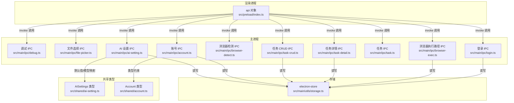
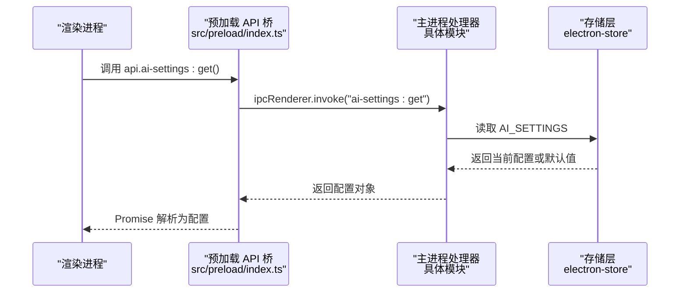
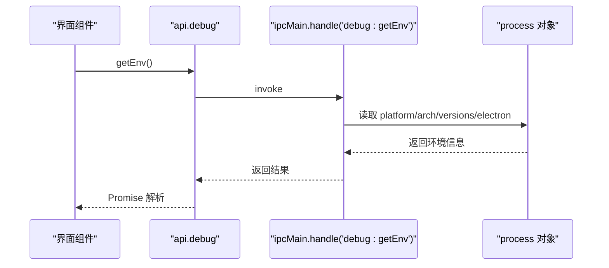
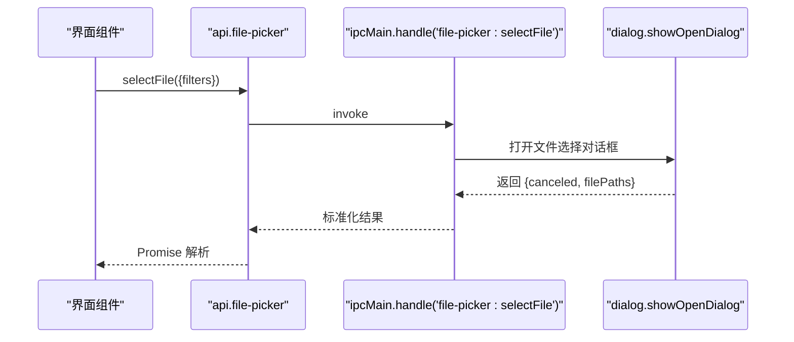
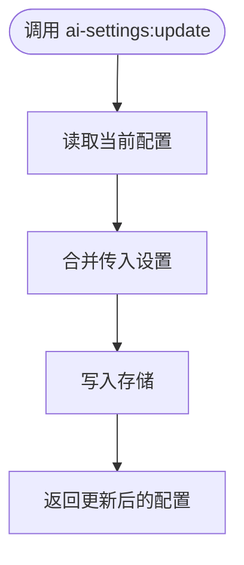
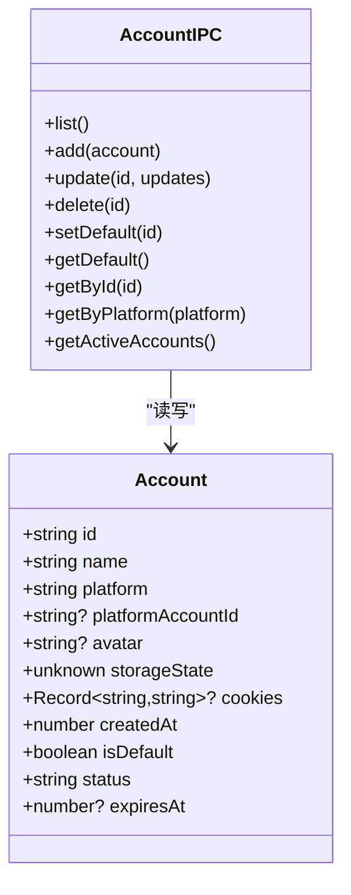
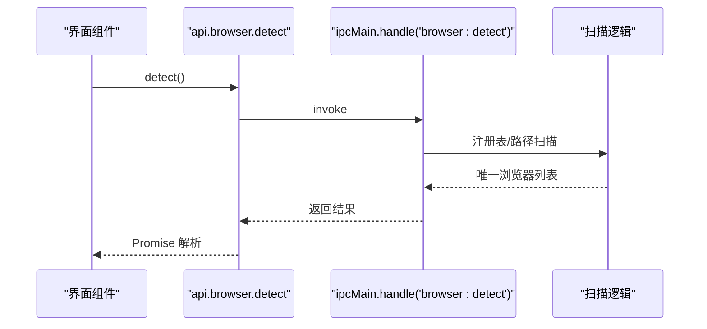
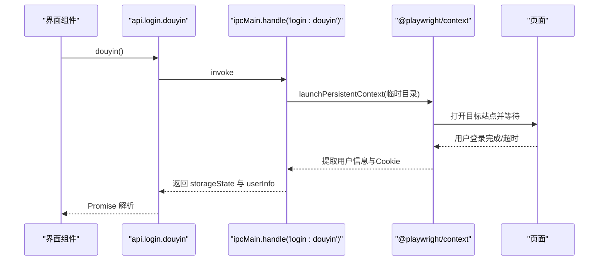
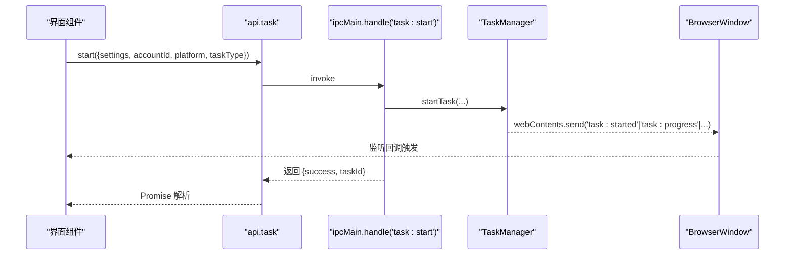
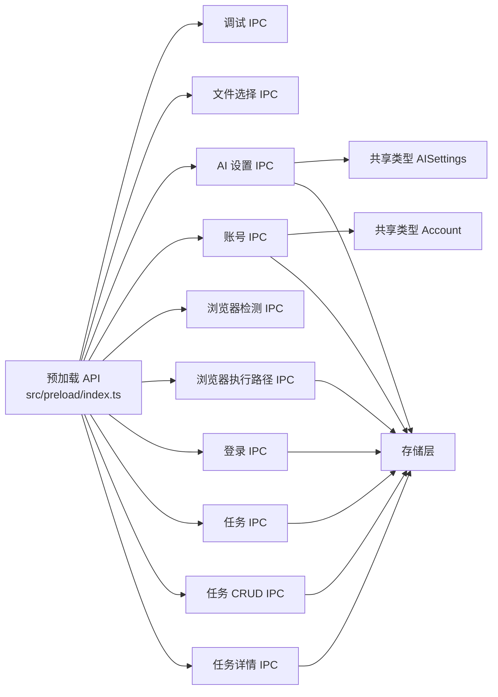

# 工具类IPC

<cite>
**本文引用的文件**
- [src/preload/index.ts](file://src/preload/index.ts)
- [src/main/ipc/debug.ts](file://src/main/ipc/debug.ts)
- [src/main/ipc/file-picker.ts](file://src/main/ipc/file-picker.ts)
- [src/main/ipc/ai-setting.ts](file://src/main/ipc/ai-setting.ts)
- [src/shared/ai-setting.ts](file://src/shared/ai-setting.ts)
- [src/main/ipc/account.ts](file://src/main/ipc/account.ts)
- [src/shared/account.ts](file://src/shared/account.ts)
- [src/main/ipc/browser-detect.ts](file://src/main/ipc/browser-detect.ts)
- [src/main/ipc/browser-exec.ts](file://src/main/ipc/browser-exec.ts)
- [src/main/ipc/login.ts](file://src/main/ipc/login.ts)
- [src/main/ipc/task.ts](file://src/main/ipc/task.ts)
- [src/main/ipc/task-crud.ts](file://src/main/ipc/task-crud.ts)
- [src/main/ipc/task-detail.ts](file://src/main/ipc/task-detail.ts)
- [src/main/utils/storage.ts](file://src/main/utils/storage.ts)
</cite>

## 目录
1. [简介](#简介)
2. [项目结构](#项目结构)
3. [核心组件](#核心组件)
4. [架构总览](#架构总览)
5. [详细组件分析](#详细组件分析)
6. [依赖关系分析](#依赖关系分析)
7. [性能考量](#性能考量)
8. [故障排查指南](#故障排查指南)
9. [结论](#结论)
10. [附录：API 参考](#附录api-参考)

## 简介
本文件聚焦 AutoOps 的工具类 IPC 模块，系统性梳理调试工具、文件选择器与 AI 设置工具的 IPC 通信机制，覆盖调试信息采集与传输、文件系统访问封装、AI 配置动态管理、安全与权限控制、资源管理策略、文件选择对话框实现、调试日志实时传输以及 AI 服务配置的热更新机制，并提供完整的 API 参考与使用示例路径。

## 项目结构
工具类 IPC 主要分布在以下位置：
- 预加载层暴露统一的渲染进程 API 接口桥（contextBridge）
- 主进程各模块注册 ipcMain.handle 处理器，负责具体业务逻辑
- 存储层通过 electron-store 统一持久化
- 共享类型定义位于 shared 目录，确保主/渲染层数据契约一致

图表来源
- [src/preload/index.ts:130-234](file://src/preload/index.ts#L130-L234)
- [src/main/ipc/debug.ts:3-12](file://src/main/ipc/debug.ts#L3-L12)
- [src/main/ipc/file-picker.ts:4-37](file://src/main/ipc/file-picker.ts#L4-L37)
- [src/main/ipc/ai-setting.ts:5-27](file://src/main/ipc/ai-setting.ts#L5-L27)
- [src/main/ipc/account.ts:32-101](file://src/main/ipc/account.ts#L32-L101)
- [src/main/ipc/browser-detect.ts:105-118](file://src/main/ipc/browser-detect.ts#L105-L118)
- [src/main/ipc/browser-exec.ts:4-13](file://src/main/ipc/browser-exec.ts#L4-L13)
- [src/main/ipc/login.ts:17-173](file://src/main/ipc/login.ts#L17-L173)
- [src/main/ipc/task.ts:81-240](file://src/main/ipc/task.ts#L81-L240)
- [src/main/ipc/task-crud.ts:8-108](file://src/main/ipc/task-crud.ts#L8-L108)
- [src/main/ipc/task-detail.ts:5-39](file://src/main/ipc/task-detail.ts#L5-L39)
- [src/main/utils/storage.ts:14-46](file://src/main/utils/storage.ts#L14-L46)
- [src/shared/ai-setting.ts:1-29](file://src/shared/ai-setting.ts#L1-L29)
- [src/shared/account.ts:1-39](file://src/shared/account.ts#L1-L39)

章节来源
- [src/preload/index.ts:130-234](file://src/preload/index.ts#L130-L234)
- [src/main/ipc/debug.ts:3-12](file://src/main/ipc/debug.ts#L3-L12)
- [src/main/ipc/file-picker.ts:4-37](file://src/main/ipc/file-picker.ts#L4-L37)
- [src/main/ipc/ai-setting.ts:5-27](file://src/main/ipc/ai-setting.ts#L5-L27)
- [src/main/ipc/account.ts:32-101](file://src/main/ipc/account.ts#L32-L101)
- [src/main/ipc/browser-detect.ts:105-118](file://src/main/ipc/browser-detect.ts#L105-L118)
- [src/main/ipc/browser-exec.ts:4-13](file://src/main/ipc/browser-exec.ts#L4-L13)
- [src/main/ipc/login.ts:17-173](file://src/main/ipc/login.ts#L17-L173)
- [src/main/ipc/task.ts:81-240](file://src/main/ipc/task.ts#L81-L240)
- [src/main/ipc/task-crud.ts:8-108](file://src/main/ipc/task-crud.ts#L8-L108)
- [src/main/ipc/task-detail.ts:5-39](file://src/main/ipc/task-detail.ts#L5-L39)
- [src/main/utils/storage.ts:14-46](file://src/main/utils/storage.ts#L14-L46)
- [src/shared/ai-setting.ts:1-29](file://src/shared/ai-setting.ts#L1-L29)
- [src/shared/account.ts:1-39](file://src/shared/account.ts#L1-L39)

## 核心组件
- 预加载 API 桥：集中暴露 auth、task、feed-ac-settings、ai-settings、browser-exec、browser、account、login、file-picker、task-history、task-detail、taskCRUD、task-template、debug 等接口，统一渲染进程调用入口
- 调试工具 IPC：提供运行环境信息查询能力
- 文件选择器 IPC：封装原生对话框，支持文件与目录选择，返回标准化结果
- AI 设置 IPC：提供 AI 平台配置的读取、更新、重置与测试占位
- 账号管理 IPC：提供账号列表、增删改查、默认账号设置、按平台筛选等
- 浏览器检测与执行路径 IPC：自动检测可用浏览器并持久化执行路径
- 登录 IPC：基于 Playwright 启动临时上下文进行抖音登录，提取用户信息与 Cookie
- 任务 IPC：任务生命周期管理、并发控制、队列操作、调度与事件广播
- 任务 CRUD 与详情 IPC：任务模板与历史记录的持久化与维护

章节来源
- [src/preload/index.ts:130-234](file://src/preload/index.ts#L130-L234)
- [src/main/ipc/debug.ts:3-12](file://src/main/ipc/debug.ts#L3-L12)
- [src/main/ipc/file-picker.ts:4-37](file://src/main/ipc/file-picker.ts#L4-L37)
- [src/main/ipc/ai-setting.ts:5-27](file://src/main/ipc/ai-setting.ts#L5-L27)
- [src/main/ipc/account.ts:32-101](file://src/main/ipc/account.ts#L32-L101)
- [src/main/ipc/browser-detect.ts:105-118](file://src/main/ipc/browser-detect.ts#L105-L118)
- [src/main/ipc/browser-exec.ts:4-13](file://src/main/ipc/browser-exec.ts#L4-L13)
- [src/main/ipc/login.ts:17-173](file://src/main/ipc/login.ts#L17-L173)
- [src/main/ipc/task.ts:81-240](file://src/main/ipc/task.ts#L81-L240)
- [src/main/ipc/task-crud.ts:8-108](file://src/main/ipc/task-crud.ts#L8-L108)
- [src/main/ipc/task-detail.ts:5-39](file://src/main/ipc/task-detail.ts#L5-L39)

## 架构总览
渲染进程通过 contextBridge 暴露的 api 对象发起 ipcRenderer.invoke 调用；主进程在对应模块注册 ipcMain.handle 处理器，完成业务逻辑与存储交互；部分处理器会向所有 BrowserWindow 广播事件，实现前端实时状态更新。

图表来源
- [src/preload/index.ts:169-174](file://src/preload/index.ts#L169-L174)
- [src/main/ipc/ai-setting.ts:6-9](file://src/main/ipc/ai-setting.ts#L6-L9)
- [src/main/utils/storage.ts:14-46](file://src/main/utils/storage.ts#L14-L46)

## 详细组件分析

### 调试工具 IPC
- 功能：提供运行时平台、架构、Electron 版本等环境信息
- 实现要点：
  - 主进程处理器返回结构化环境信息
  - 渲染进程通过 api.debug.getEnv() 获取
- 安全与权限：
  - 仅返回非敏感信息，不涉及文件系统或网络凭据
- 使用场景：
  - 日志上报、问题诊断、版本统计

图表来源
- [src/preload/index.ts:228-230](file://src/preload/index.ts#L228-L230)
- [src/main/ipc/debug.ts:4-11](file://src/main/ipc/debug.ts#L4-L11)

章节来源
- [src/preload/index.ts:228-230](file://src/preload/index.ts#L228-L230)
- [src/main/ipc/debug.ts:3-12](file://src/main/ipc/debug.ts#L3-L12)

### 文件选择器 IPC
- 功能：封装原生文件/目录选择对话框，返回标准化结果
- 实现要点：
  - 支持过滤器配置、取消处理、文件名提取
  - 返回字段包含是否取消、路径、名称
- 安全与权限：
  - 仅允许用户交互触发，避免无授权访问
- 使用场景：
  - 导入配置、选择日志文件、选择工作目录

图表来源
- [src/preload/index.ts:197-200](file://src/preload/index.ts#L197-L200)
- [src/main/ipc/file-picker.ts:5-20](file://src/main/ipc/file-picker.ts#L5-L20)

章节来源
- [src/preload/index.ts:197-200](file://src/preload/index.ts#L197-L200)
- [src/main/ipc/file-picker.ts:4-37](file://src/main/ipc/file-picker.ts#L4-L37)

### AI 设置工具 IPC
- 功能：读取、更新、重置、测试（占位）AI 配置
- 数据模型：共享类型定义了平台枚举、键值映射、默认模型与温度
- 实现要点：
  - 更新时合并当前配置与新设置
  - 默认值来源于共享类型
  - 测试接口当前返回占位消息
- 安全与权限：
  - 配置存储于本地，建议对敏感字段加密或限制访问
- 使用场景：
  - 动态切换模型、调整温度、一键恢复默认

图表来源
- [src/main/ipc/ai-setting.ts:11-16](file://src/main/ipc/ai-setting.ts#L11-L16)
- [src/shared/ai-setting.ts:10-22](file://src/shared/ai-setting.ts#L10-L22)

章节来源
- [src/main/ipc/ai-setting.ts:5-27](file://src/main/ipc/ai-setting.ts#L5-L27)
- [src/shared/ai-setting.ts:1-29](file://src/shared/ai-setting.ts#L1-L29)

### 账号管理 IPC
- 功能：账号列表、新增、更新、删除、设默认、按平台筛选、活跃账号查询
- 实现要点：
  - 自动为首个账号设置默认标记
  - 删除后若无默认账号则自动补回
  - 提供按状态筛选
- 安全与权限：
  - 存储 cookies 与 storageState，需谨慎处理敏感数据
- 使用场景：
  - 多账号轮换、按平台分组管理、默认账号优先

图表来源
- [src/shared/account.ts:3-15](file://src/shared/account.ts#L3-L15)
- [src/main/ipc/account.ts:32-101](file://src/main/ipc/account.ts#L32-L101)

章节来源
- [src/main/ipc/account.ts:32-101](file://src/main/ipc/account.ts#L32-L101)
- [src/shared/account.ts:1-39](file://src/shared/account.ts#L1-L39)

### 浏览器检测与执行路径 IPC
- 功能：检测系统中已安装的浏览器并持久化执行路径
- 实现要点：
  - Windows 从注册表与常见路径扫描；其他平台从固定路径集合
  - 去重并返回唯一浏览器列表
  - 执行路径写入存储，供后续任务使用
- 安全与权限：
  - 仅读取系统路径，避免写入
- 使用场景：
  - 自动发现浏览器、设置默认执行路径

图表来源
- [src/preload/index.ts:179-181](file://src/preload/index.ts#L179-L181)
- [src/main/ipc/browser-detect.ts:105-118](file://src/main/ipc/browser-detect.ts#L105-L118)

章节来源
- [src/main/ipc/browser-detect.ts:105-118](file://src/main/ipc/browser-detect.ts#L105-L118)
- [src/main/ipc/browser-exec.ts:4-13](file://src/main/ipc/browser-exec.ts#L4-L13)

### 登录工具 IPC（抖音）
- 功能：启动临时浏览器上下文，引导用户登录抖音，提取用户信息与 Cookie
- 实现要点：
  - 使用 Playwright 启动带参数的 Chromium 上下文
  - 等待用户跳转至个人页或关注页
  - 通过多种选择器与 URL 模式提取昵称、头像、唯一标识
  - 序列化 Cookie 为 storageState 返回
- 安全与权限：
  - 临时目录隔离，避免污染用户数据
  - 仅在用户交互触发时执行
- 使用场景：
  - 快速绑定账号、生成可复用的登录态

图表来源
- [src/preload/index.ts:194-196](file://src/preload/index.ts#L194-L196)
- [src/main/ipc/login.ts:17-173](file://src/main/ipc/login.ts#L17-L173)

章节来源
- [src/main/ipc/login.ts:17-173](file://src/main/ipc/login.ts#L17-L173)

### 任务管理 IPC（生命周期、并发、队列与调度）
- 功能：任务启动/停止/暂停/恢复、状态查询、并发控制、队列操作、定时调度
- 实现要点：
  - 单例 TaskManager，首次使用初始化并转发事件到所有窗口
  - 事件通道：progress、action、paused、resumed、started、stopped、queued、scheduleTriggered
  - 支持按任务 ID 查询状态，或查询运行中的任务列表
  - 支持设置最大并发度与查询当前并发上限
- 安全与权限：
  - 事件广播面向所有窗口，注意避免重复监听导致的性能问题
- 使用场景：
  - 控制自动化任务流、实时监控进度与动作、定时批量执行

图表来源
- [src/preload/index.ts:137-161](file://src/preload/index.ts#L137-L161)
- [src/main/ipc/task.ts:81-240](file://src/main/ipc/task.ts#L81-L240)

章节来源
- [src/main/ipc/task.ts:81-240](file://src/main/ipc/task.ts#L81-L240)

### 任务 CRUD 与详情 IPC
- 功能：任务列表、按条件查询、创建、更新、删除、去重；任务模板保存与删除；任务详情记录与状态更新
- 实现要点：
  - 自动生成唯一 ID
  - 详情更新时根据评论标志维护计数与结束时间
- 安全与权限：
  - 仅操作本地存储的任务与模板数据
- 使用场景：
  - 任务模板复用、历史记录追踪、批量管理

章节来源
- [src/main/ipc/task-crud.ts:8-108](file://src/main/ipc/task-crud.ts#L8-L108)
- [src/main/ipc/task-detail.ts:5-39](file://src/main/ipc/task-detail.ts#L5-L39)

## 依赖关系分析
- 预加载层聚合所有 IPC 接口，形成统一调用面
- 主进程各模块相对独立，通过存储层解耦
- 共享类型确保前后端数据契约一致
- 任务 IPC 依赖 TaskManager 与 BrowserWindow 广播事件

图表来源
- [src/preload/index.ts:130-234](file://src/preload/index.ts#L130-L234)
- [src/shared/ai-setting.ts:1-29](file://src/shared/ai-setting.ts#L1-L29)
- [src/shared/account.ts:1-39](file://src/shared/account.ts#L1-L39)
- [src/main/utils/storage.ts:14-46](file://src/main/utils/storage.ts#L14-L46)

章节来源
- [src/preload/index.ts:130-234](file://src/preload/index.ts#L130-L234)
- [src/shared/ai-setting.ts:1-29](file://src/shared/ai-setting.ts#L1-L29)
- [src/shared/account.ts:1-39](file://src/shared/account.ts#L1-L39)
- [src/main/utils/storage.ts:14-46](file://src/main/utils/storage.ts#L14-L46)

## 性能考量
- 事件广播：任务 IPC 会对所有 BrowserWindow 发送事件，建议在不需要时移除监听以降低开销
- 存储访问：频繁读写存储可能成为瓶颈，建议批处理或节流
- 浏览器检测：扫描注册表与路径可能阻塞，应在后台线程或异步任务中执行
- 登录流程：Playwright 启动上下文与页面加载耗时较长，应避免重复启动

## 故障排查指南
- 调试信息缺失：确认渲染进程已正确调用 api.debug.getEnv()
- 文件选择无响应：检查用户交互触发与过滤器配置
- AI 设置未生效：确认已调用 api.ai-settings:update 并检查存储键值
- 账号状态异常：检查默认账号标记与删除后的自动补回逻辑
- 任务无法启动：确认浏览器执行路径已设置且 TaskManager 初始化成功
- 登录失败：检查浏览器路径、网络连通性与页面元素选择器匹配情况

章节来源
- [src/main/ipc/debug.ts:3-12](file://src/main/ipc/debug.ts#L3-L12)
- [src/main/ipc/file-picker.ts:4-37](file://src/main/ipc/file-picker.ts#L4-L37)
- [src/main/ipc/ai-setting.ts:5-27](file://src/main/ipc/ai-setting.ts#L5-L27)
- [src/main/ipc/account.ts:32-101](file://src/main/ipc/account.ts#L32-L101)
- [src/main/ipc/task.ts:81-240](file://src/main/ipc/task.ts#L81-L240)
- [src/main/ipc/login.ts:17-173](file://src/main/ipc/login.ts#L17-L173)

## 结论
工具类 IPC 模块通过预加载 API 桥实现了清晰的渲染进程调用面，主进程各模块职责明确、耦合度低，配合共享类型与存储层达成前后端一致性与持久化需求。调试、文件选择、AI 设置、账号管理、浏览器检测、登录与任务管理等功能均具备完善的 IPC 通信机制与安全策略，适合在生产环境中稳定运行。

## 附录：API 参考

- 调试工具
  - 方法：api.debug.getEnv()
  - 参数：无
  - 返回：运行环境信息对象
  - 示例路径：[src/preload/index.ts:228-230](file://src/preload/index.ts#L228-L230)，[src/main/ipc/debug.ts:4-11](file://src/main/ipc/debug.ts#L4-L11)

- 文件选择器
  - 方法：api.file-picker.selectFile(options?)、api.file-picker.selectDirectory()
  - 参数：selectFile 支持 filters 数组；selectDirectory 无参数
  - 返回：标准化结果对象（canceled、filePath/dirPath、fileName/dirName）
  - 示例路径：[src/preload/index.ts:197-200](file://src/preload/index.ts#L197-L200)，[src/main/ipc/file-picker.ts:5-36](file://src/main/ipc/file-picker.ts#L5-L36)

- AI 设置
  - 方法：api.ai-settings.get()、api.ai-settings.update(settings)、api.ai-settings.reset()、api.ai-settings.test(config)
  - 参数：update 传入部分设置；test 传入平台、apiKey、model
  - 返回：当前配置、更新后的配置、默认配置、测试结果占位
  - 示例路径：[src/preload/index.ts:169-174](file://src/preload/index.ts#L169-L174)，[src/main/ipc/ai-setting.ts:6-26](file://src/main/ipc/ai-setting.ts#L6-L26)，[src/shared/ai-setting.ts:10-22](file://src/shared/ai-setting.ts#L10-L22)

- 账号管理
  - 方法：api.account.list()、api.account.add(account)、api.account.update(id, updates)、api.account.delete(id)、api.account.setDefault(id)、api.account.getDefault()、api.account.getById(id)、api.account.getByPlatform(platform)、api.account.getActiveAccounts()
  - 参数：按方法定义传入
  - 返回：列表、新增/更新对象、删除结果、默认账号、按平台筛选结果、活跃账号列表
  - 示例路径：[src/preload/index.ts:182-193](file://src/preload/index.ts#L182-L193)，[src/main/ipc/account.ts:33-99](file://src/main/ipc/account.ts#L33-L99)，[src/shared/account.ts:3-15](file://src/shared/account.ts#L3-L15)

- 浏览器检测与执行路径
  - 方法：api.browser.detect()、api.browser-exec.get()、api.browser-exec.set(path)
  - 参数：detect 无；get 无；set 传入路径
  - 返回：浏览器列表、执行路径、设置结果
  - 示例路径：[src/preload/index.ts:179-181](file://src/preload/index.ts#L179-L181)，[src/preload/index.ts:175-178](file://src/preload/index.ts#L175-L178)，[src/main/ipc/browser-detect.ts:106-116](file://src/main/ipc/browser-detect.ts#L106-L116)，[src/main/ipc/browser-exec.ts:5-12](file://src/main/ipc/browser-exec.ts#L5-L12)

- 登录（抖音）
  - 方法：api.login.douyin()
  - 参数：无
  - 返回：登录结果对象（storageState、userInfo、错误信息）
  - 示例路径：[src/preload/index.ts:194-196](file://src/preload/index.ts#L194-L196)，[src/main/ipc/login.ts:18-159](file://src/main/ipc/login.ts#L18-L159)

- 任务管理
  - 方法：api.task.start(config)、api.task.stop(taskId?)、api.task.pause(taskId)、api.task.resume(taskId)、api.task.status(taskId?)、api.task.listRunning()、api.task.getStatus(taskId)、api.task.queueSize()、api.task.removeFromQueue(queueId)、api.task.schedule(taskId, cron)、api.task.cancelSchedule(taskId)、api.task.getSchedules()、api.task.setConcurrency(max)、api.task.getConcurrency()、api.task.stopAll()
  - 事件：onProgress、onAction、onPaused、onResumed、onStarted、onStopped、onQueued、onScheduleTriggered
  - 参数：config 包含 settings、accountId、platform、taskType、taskName
  - 返回：操作结果与状态信息
  - 示例路径：[src/preload/index.ts:137-161](file://src/preload/index.ts#L137-L161)，[src/main/ipc/task.ts:82-239](file://src/main/ipc/task.ts#L82-L239)

- 任务 CRUD 与详情
  - 方法：api.taskCRUD.getAll()、api.taskCRUD.getById(id)、api.taskCRUD.getByAccount(accountId)、api.taskCRUD.create(data)、api.taskCRUD.update(id, updates)、api.taskCRUD.delete(id)、api.taskCRUD.duplicate(id)、api.task-detail.get(id)、api.task-detail.addVideoRecord(taskId, videoRecord)、api.task-detail.updateStatus(taskId, status)、api.task-template.getAll()、api.task-template.save(name, config, platform?, taskType?)、api.task-template.delete(id)
  - 参数：按方法定义传入
  - 返回：列表、对象、结果对象
  - 示例路径：[src/preload/index.ts:214-227](file://src/preload/index.ts#L214-L227)，[src/main/ipc/task-crud.ts:9-107](file://src/main/ipc/task-crud.ts#L9-L107)，[src/main/ipc/task-detail.ts:6-39](file://src/main/ipc/task-detail.ts#L6-L39)