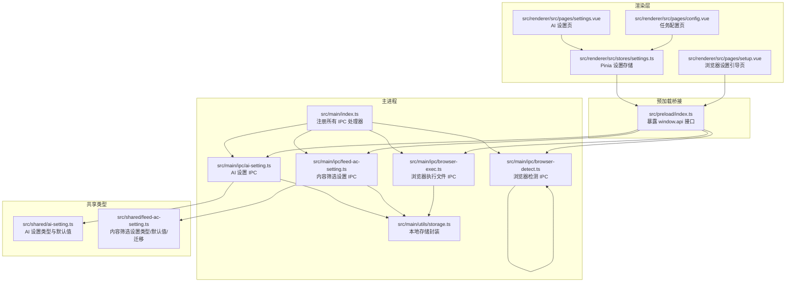
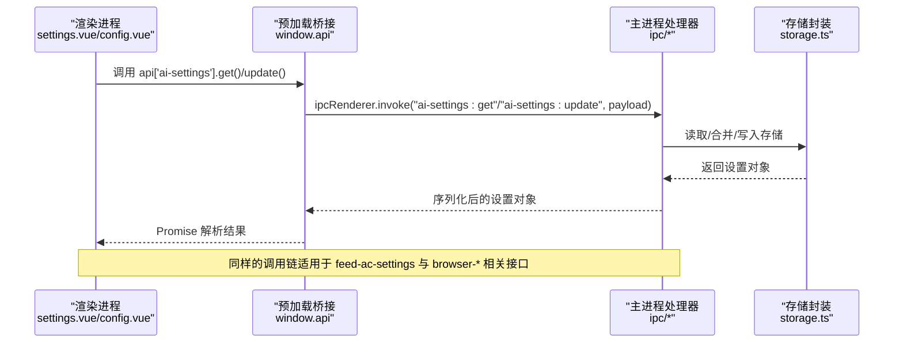
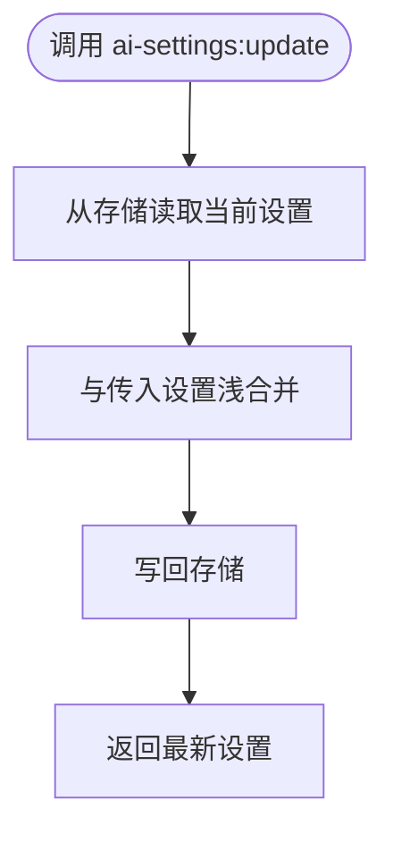
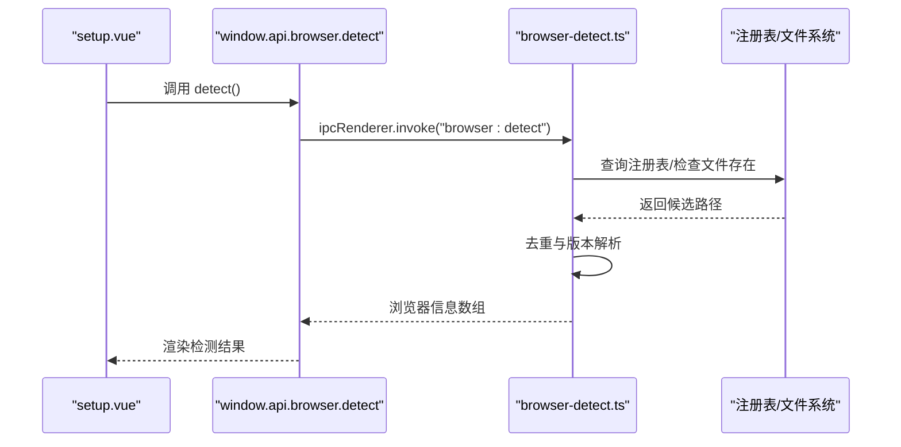
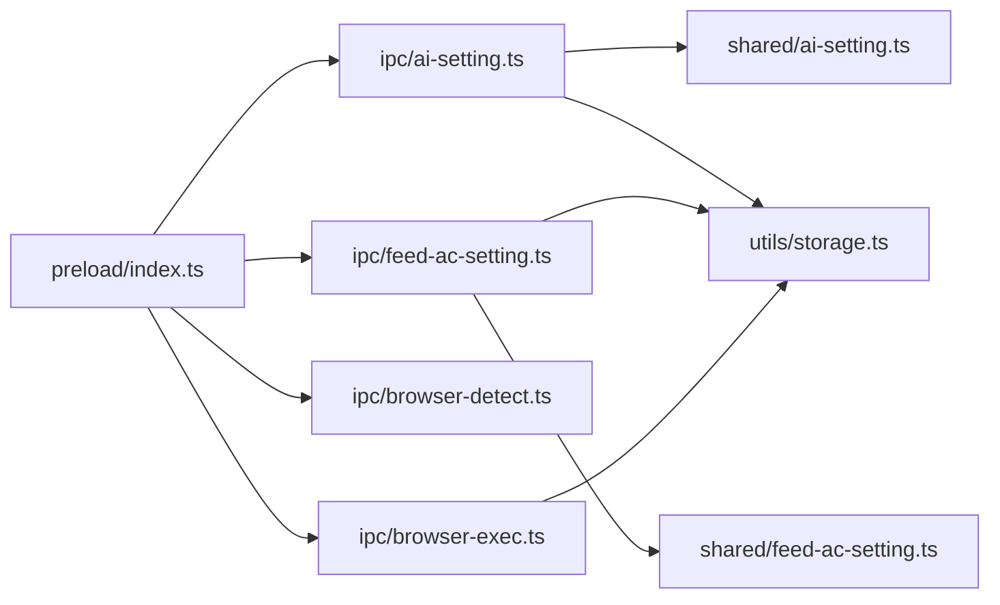

# 设置管理IPC

<cite>
**本文引用的文件**
- [src/main/ipc/ai-setting.ts](file://src/main/ipc/ai-setting.ts)
- [src/main/ipc/feed-ac-setting.ts](file://src/main/ipc/feed-ac-setting.ts)
- [src/main/ipc/browser-detect.ts](file://src/main/ipc/browser-detect.ts)
- [src/main/ipc/browser-exec.ts](file://src/main/ipc/browser-exec.ts)
- [src/shared/ai-setting.ts](file://src/shared/ai-setting.ts)
- [src/shared/feed-ac-setting.ts](file://src/shared/feed-ac-setting.ts)
- [src/main/utils/storage.ts](file://src/main/utils/storage.ts)
- [src/preload/index.ts](file://src/preload/index.ts)
- [src/main/index.ts](file://src/main/index.ts)
- [src/renderer/src/stores/settings.ts](file://src/renderer/src/stores/settings.ts)
- [src/renderer/src/pages/settings.vue](file://src/renderer/src/pages/settings.vue)
- [src/renderer/src/pages/setup.vue](file://src/renderer/src/pages/setup.vue)
- [src/renderer/src/pages/config.vue](file://src/renderer/src/pages/config.vue)
</cite>

## 目录
1. [简介](#简介)
2. [项目结构](#项目结构)
3. [核心组件](#核心组件)
4. [架构总览](#架构总览)
5. [详细组件分析](#详细组件分析)
6. [依赖关系分析](#依赖关系分析)
7. [性能考量](#性能考量)
8. [故障排查指南](#故障排查指南)
9. [结论](#结论)
10. [附录：API 参考](#附录api-参考)

## 简介
本文件面向 AutoOps 的“设置管理IPC”模块，系统性阐述应用配置管理的跨进程通信机制，覆盖以下主题：
- AI 设置、内容筛选设置与浏览器配置的 IPC 实现
- 设置项的读取、更新、重置与验证流程
- 配置迁移与版本兼容策略（以 Feed 内容筛选设置为例）
- 设置数据的序列化传输、默认值管理与校验机制
- 浏览器路径检测、执行文件配置与环境变量处理的 IPC 模式
- 完整的设置管理 IPC API 参考（含类型定义、验证规则与操作方法）
- 结合实际页面与存储层的使用示例路径

## 项目结构
设置管理相关代码主要分布在以下位置：
- 主进程 IPC 处理器：负责注册 IPC 通道、访问存储、执行业务逻辑
- 共享类型定义：定义设置的数据结构、默认值与迁移函数
- 预加载桥接：向渲染进程暴露安全的 API 接口
- 渲染层存储与页面：调用预加载 API 读写设置，并驱动 UI



图表来源
- [src/main/index.ts:54-76](file://src/main/index.ts#L54-L76)
- [src/main/ipc/ai-setting.ts:1-27](file://src/main/ipc/ai-setting.ts#L1-L27)
- [src/main/ipc/feed-ac-setting.ts:1-44](file://src/main/ipc/feed-ac-setting.ts#L1-L44)
- [src/main/ipc/browser-detect.ts:1-118](file://src/main/ipc/browser-detect.ts#L1-L118)
- [src/main/ipc/browser-exec.ts:1-13](file://src/main/ipc/browser-exec.ts#L1-L13)
- [src/main/utils/storage.ts:1-46](file://src/main/utils/storage.ts#L1-L46)
- [src/shared/ai-setting.ts:1-29](file://src/shared/ai-setting.ts#L1-L29)
- [src/shared/feed-ac-setting.ts:1-179](file://src/shared/feed-ac-setting.ts#L1-L179)
- [src/preload/index.ts:1-187](file://src/preload/index.ts#L1-L187)
- [src/renderer/src/stores/settings.ts:1-46](file://src/renderer/src/stores/settings.ts#L1-L46)
- [src/renderer/src/pages/settings.vue:1-165](file://src/renderer/src/pages/settings.vue#L1-L165)
- [src/renderer/src/pages/setup.vue:1-215](file://src/renderer/src/pages/setup.vue#L1-L215)
- [src/renderer/src/pages/config.vue:1-323](file://src/renderer/src/pages/config.vue#L1-L323)

章节来源
- [src/main/index.ts:54-76](file://src/main/index.ts#L54-L76)
- [src/preload/index.ts:95-187](file://src/preload/index.ts#L95-L187)

## 核心组件
- AI 设置 IPC：提供获取、更新、重置与测试接口，读写共享类型定义的 AISettings，默认值来自共享模块。
- 内容筛选设置 IPC：提供获取、更新、重置、导出、导入接口；内置版本兼容与迁移（V2 -> V3），确保新旧配置平滑过渡。
- 浏览器检测 IPC：扫描系统常见路径与注册表，返回可用浏览器列表（名称、路径、版本）。
- 浏览器执行文件 IPC：持久化保存浏览器可执行文件路径，供任务执行阶段使用。
- 存储封装：基于 electron-store 提供键值存储、默认值与类型约束。
- 预加载桥接：统一暴露 window.api，渲染进程通过 invoke/on 调用主进程 IPC。
- 渲染层设置存储：Pinia store 封装设置读写，配合页面组件完成用户交互。

章节来源
- [src/main/ipc/ai-setting.ts:5-27](file://src/main/ipc/ai-setting.ts#L5-L27)
- [src/main/ipc/feed-ac-setting.ts:16-44](file://src/main/ipc/feed-ac-setting.ts#L16-L44)
- [src/main/ipc/browser-detect.ts:105-118](file://src/main/ipc/browser-detect.ts#L105-L118)
- [src/main/ipc/browser-exec.ts:4-13](file://src/main/ipc/browser-exec.ts#L4-L13)
- [src/main/utils/storage.ts:14-46](file://src/main/utils/storage.ts#L14-L46)
- [src/preload/index.ts:95-187](file://src/preload/index.ts#L95-L187)
- [src/renderer/src/stores/settings.ts:8-46](file://src/renderer/src/stores/settings.ts#L8-L46)

## 架构总览
设置管理的 IPC 通信遵循“渲染进程 -> 预加载桥接 -> 主进程处理器 -> 存储”的链路，所有设置项均通过共享类型定义进行序列化传输，避免类型不一致导致的错误。



图表来源
- [src/preload/index.ts:117-129](file://src/preload/index.ts#L117-L129)
- [src/main/ipc/ai-setting.ts:6-16](file://src/main/ipc/ai-setting.ts#L6-L16)
- [src/main/utils/storage.ts:40-46](file://src/main/utils/storage.ts#L40-L46)

## 详细组件分析

### AI 设置管理（src/main/ipc/ai-setting.ts）
- 功能要点
  - 获取：若存储中存在设置则返回，否则返回共享模块提供的默认值。
  - 更新：对现有设置与传入部分设置进行浅合并，写回存储并返回最新设置。
  - 重置：恢复默认值并写回存储。
  - 测试：预留接口，当前返回占位结果。
- 数据流与类型
  - 输入/输出均为 AISettings 或其子集，类型由共享模块定义。
  - 默认值来源于共享模块的 getDefaultAISettings。
- 错误处理
  - 未见显式 try/catch，建议在渲染层捕获异常并提示用户。



图表来源
- [src/main/ipc/ai-setting.ts:11-16](file://src/main/ipc/ai-setting.ts#L11-L16)
- [src/shared/ai-setting.ts:10-22](file://src/shared/ai-setting.ts#L10-L22)

章节来源
- [src/main/ipc/ai-setting.ts:5-27](file://src/main/ipc/ai-setting.ts#L5-L27)
- [src/shared/ai-setting.ts:1-29](file://src/shared/ai-setting.ts#L1-L29)

### 内容筛选设置管理（src/main/ipc/feed-ac-setting.ts）
- 功能要点
  - 获取：确保返回 V3 结构，若为空或 V2 则迁移至 V3。
  - 更新：合并传入的部分设置，写回存储并返回最新设置。
  - 重置：恢复 V3 默认值。
  - 导出/导入：支持将当前设置导出为 V3，或将任意 V2/V3 设置导入并迁移。
- 版本兼容与迁移
  - ensureV3：空值返回默认 V3；V2 通过 migrateToV3 转换。
  - migrateToV3：保留关键字段，补充新增字段与默认值。
- 数据流与类型
  - 输入/输出为 FeedAcSettingsV3 或其子集；内部可能处理 V2。
  - 默认值来源于共享模块的 getDefaultFeedAcSettingsV3。

```mermaid
flowchart TD
Get(["feed-ac-settings:get"]) --> Read["读取存储"]
Read --> Ensure{"是否需要迁移?"}
Ensure --> |是(V2/空)| Migrate["migrateToV3()"]
Ensure --> |否| Keep["保持原状"]
Migrate --> ReturnGet["返回 V3 设置"]
Keep --> ReturnGet
Update(["feed-ac-settings:update"]) --> Read2["读取并 ensureV3"]
Read2 --> Merge2["浅合并传入设置"]
Merge2 --> Write2["写回存储"]
Write2 --> ReturnUpdate["返回最新设置"]
```

图表来源
- [src/main/ipc/feed-ac-setting.ts:10-14](file://src/main/ipc/feed-ac-setting.ts#L10-L14)
- [src/main/ipc/feed-ac-setting.ts:16-44](file://src/main/ipc/feed-ac-setting.ts#L16-L44)
- [src/shared/feed-ac-setting.ts:148-174](file://src/shared/feed-ac-setting.ts#L148-L174)
- [src/shared/feed-ac-setting.ts:115-146](file://src/shared/feed-ac-setting.ts#L115-L146)

章节来源
- [src/main/ipc/feed-ac-setting.ts:1-44](file://src/main/ipc/feed-ac-setting.ts#L1-L44)
- [src/shared/feed-ac-setting.ts:1-179](file://src/shared/feed-ac-setting.ts#L1-L179)

### 浏览器检测与执行文件管理
- 浏览器检测（browser-detect）
  - 平台差异：Windows 使用注册表与常见路径组合；macOS/Linux 使用预设路径数组。
  - 版本提取：Windows 通过命令行参数获取版本字符串；其他平台返回 unknown。
  - 去重：按名称去重，避免重复显示同一浏览器的不同路径。
- 浏览器执行文件（browser-exec）
  - 读取：返回存储中的浏览器可执行文件路径。
  - 写入：保存路径并返回 { success: true }。



图表来源
- [src/renderer/src/pages/setup.vue:32-45](file://src/renderer/src/pages/setup.vue#L32-L45)
- [src/preload/index.ts:134-136](file://src/preload/index.ts#L134-L136)
- [src/main/ipc/browser-detect.ts:105-118](file://src/main/ipc/browser-detect.ts#L105-L118)

章节来源
- [src/main/ipc/browser-detect.ts:1-118](file://src/main/ipc/browser-detect.ts#L1-L118)
- [src/main/ipc/browser-exec.ts:1-13](file://src/main/ipc/browser-exec.ts#L1-L13)
- [src/renderer/src/pages/setup.vue:1-215](file://src/renderer/src/pages/setup.vue#L1-L215)

### 渲染层集成与使用示例
- 设置存储（Pinia）
  - 加载/更新/重置 AI 与 Feed 内容筛选设置，内部通过 window.api 调用 IPC。
- 页面组件
  - settings.vue：展示并保存 AI 设置，调用 ai-settings.test 发起连通性测试。
  - config.vue：维护 Feed 内容筛选规则与参数，保存后启动任务。
  - setup.vue：引导用户检测/选择浏览器并保存执行文件路径。

章节来源
- [src/renderer/src/stores/settings.ts:8-46](file://src/renderer/src/stores/settings.ts#L8-L46)
- [src/renderer/src/pages/settings.vue:32-64](file://src/renderer/src/pages/settings.vue#L32-L64)
- [src/renderer/src/pages/config.vue:41-51](file://src/renderer/src/pages/config.vue#L41-L51)
- [src/renderer/src/pages/setup.vue:32-75](file://src/renderer/src/pages/setup.vue#L32-L75)

## 依赖关系分析
- 组件耦合
  - 主进程处理器依赖存储封装与共享类型定义，耦合度低、内聚性强。
  - 预加载桥接仅作为薄层转发，避免渲染进程直接访问 Node/Electron API。
- 外部依赖
  - electron-store：键值存储与默认值管理。
  - child_process/fs/path：浏览器检测在 Windows 上使用注册表查询与文件存在性判断。
- 循环依赖
  - 未发现循环依赖迹象；IPC 注册集中在主进程入口统一完成。



图表来源
- [src/preload/index.ts:95-187](file://src/preload/index.ts#L95-L187)
- [src/main/ipc/ai-setting.ts:1-3](file://src/main/ipc/ai-setting.ts#L1-L3)
- [src/main/ipc/feed-ac-setting.ts:1-8](file://src/main/ipc/feed-ac-setting.ts#L1-L8)
- [src/main/ipc/browser-detect.ts:1-4](file://src/main/ipc/browser-detect.ts#L1-L4)
- [src/main/ipc/browser-exec.ts:1-2](file://src/main/ipc/browser-exec.ts#L1-L2)
- [src/main/utils/storage.ts:1-46](file://src/main/utils/storage.ts#L1-L46)
- [src/shared/ai-setting.ts:1-29](file://src/shared/ai-setting.ts#L1-L29)
- [src/shared/feed-ac-setting.ts:1-179](file://src/shared/feed-ac-setting.ts#L1-L179)

章节来源
- [src/main/index.ts:4-16](file://src/main/index.ts#L4-L16)
- [src/main/utils/storage.ts:14-38](file://src/main/utils/storage.ts#L14-L38)

## 性能考量
- 序列化成本
  - 所有 IPC 传输均采用 JSON 序列化，建议避免传输超大对象；必要时分批或延迟加载。
- 存储访问
  - 每次读写均触发磁盘 IO，建议在高频更新场景下合并变更或节流。
- 浏览器检测
  - Windows 下注册表查询与版本命令执行存在超时限制，避免阻塞主线程；当前实现已设置超时，建议在 UI 层提供反馈。
- 类型安全
  - 通过共享类型定义保证前后端一致性，减少因类型不匹配导致的序列化/反序列化错误。

## 故障排查指南
- AI 设置测试接口返回占位结果
  - 现象：调用 ai-settings:test 返回 success 但消息为占位文本。
  - 建议：在主进程实现具体测试逻辑（如调用对应平台 SDK/HTTP 请求），并在渲染层展示真实结果。
- 浏览器检测无结果
  - 现象：setup 页面显示“未检测到浏览器”。
  - 排查：确认操作系统平台、路径权限与可执行文件存在性；Windows 可检查注册表访问权限。
- 设置更新后未生效
  - 现象：界面显示最新值，但后续读取仍为旧值。
  - 排查：确认存储键名一致、未被其他进程并发覆盖；检查渲染层是否正确调用 reset/load/update。
- 版本迁移异常
  - 现象：导入 V2 设置后出现字段缺失或默认值异常。
  - 排查：核对 migrateToV3 的字段映射与默认值；确保 ensureV3 在读取时被调用。

章节来源
- [src/main/ipc/ai-setting.ts:24-26](file://src/main/ipc/ai-setting.ts#L24-L26)
- [src/main/ipc/browser-detect.ts:47-80](file://src/main/ipc/browser-detect.ts#L47-L80)
- [src/main/ipc/feed-ac-setting.ts:10-14](file://src/main/ipc/feed-ac-setting.ts#L10-L14)

## 结论
设置管理IPC模块以清晰的职责划分与共享类型定义为基础，实现了稳定的跨进程配置管理能力。AI 设置、内容筛选设置与浏览器配置三大领域均具备完善的读取、更新、重置与迁移机制。建议后续完善 AI 设置测试接口与浏览器检测的错误反馈，进一步提升用户体验与系统健壮性。

## 附录：API 参考

### 通用约定
- 所有 IPC 方法均通过 window.api 访问，例如 window.api['ai-settings'].get()。
- 返回值均为 Promise，错误通过异常抛出，建议在调用处使用 try/catch。
- 设置对象通过 JSON 序列化在进程间传输，注意避免传输不可序列化字段。

### AI 设置（ai-settings）
- 获取
  - 路径：ai-settings:get
  - 参数：无
  - 返回：AISettings
  - 默认值：来自共享模块 getDefaultAISettings
- 更新
  - 路径：ai-settings:update
  - 参数：Partial<AISettings>
  - 返回：AISettings（合并后的最新设置）
- 重置
  - 路径：ai-settings:reset
  - 参数：无
  - 返回：AISettings（默认值）
- 测试
  - 路径：ai-settings:test
  - 参数：{ platform: string; apiKey: string; model: string }
  - 返回：{ success: boolean; message: string }

章节来源
- [src/preload/index.ts:124-129](file://src/preload/index.ts#L124-L129)
- [src/main/ipc/ai-setting.ts:6-26](file://src/main/ipc/ai-setting.ts#L6-L26)
- [src/shared/ai-setting.ts:10-22](file://src/shared/ai-setting.ts#L10-L22)

### 内容筛选设置（feed-ac-settings）
- 获取
  - 路径：feed-ac-settings:get
  - 参数：无
  - 返回：FeedAcSettingsV3（自动迁移/补全）
- 更新
  - 路径：feed-ac-settings:update
  - 参数：Partial<FeedAcSettingsV3>
  - 返回：FeedAcSettingsV3（合并后的最新设置）
- 重置
  - 路径：feed-ac-settings:reset
  - 参数：无
  - 返回：FeedAcSettingsV3（默认值）
- 导出
  - 路径：feed-ac-settings:export
  - 参数：无
  - 返回：FeedAcSettingsV3
- 导入
  - 路径：feed-ac-settings:import
  - 参数：FeedAcSettingsV2 | FeedAcSettingsV3
  - 返回：{ success: boolean }

章节来源
- [src/preload/index.ts:117-123](file://src/preload/index.ts#L117-L123)
- [src/main/ipc/feed-ac-setting.ts:17-43](file://src/main/ipc/feed-ac-setting.ts#L17-L43)
- [src/shared/feed-ac-setting.ts:115-146](file://src/shared/feed-ac-setting.ts#L115-L146)

### 浏览器配置（browser-exec）
- 获取执行文件路径
  - 路径：browser-exec:get
  - 参数：无
  - 返回：string | null
- 设置执行文件路径
  - 路径：browser-exec:set
  - 参数：string（可执行文件绝对路径）
  - 返回：{ success: boolean }

章节来源
- [src/preload/index.ts:130-133](file://src/preload/index.ts#L130-L133)
- [src/main/ipc/browser-exec.ts:5-12](file://src/main/ipc/browser-exec.ts#L5-L12)

### 浏览器检测（browser）
- 检测可用浏览器
  - 路径：browser:detect
  - 参数：无
  - 返回：Array<{ path: string; name: string; version: string }>
  - 说明：Windows 通过注册表与常见路径检测；macOS/Linux 通过预设路径检测；版本在 Windows 下解析，其他平台返回 unknown

章节来源
- [src/preload/index.ts:134-136](file://src/preload/index.ts#L134-L136)
- [src/main/ipc/browser-detect.ts:105-118](file://src/main/ipc/browser-detect.ts#L105-L118)

### 类型定义与默认值
- AI 设置（AISettings）
  - 字段：platform（AIPlatform）、apiKeys（各平台密钥映射）、model、temperature
  - 默认值：见 getDefaultAISettings
  - 平台模型：见 PLATFORM_MODELS
- 内容筛选设置（FeedAcSettingsV2/V3）
  - 关键字段：version、ruleGroups、blockKeywords、authorBlockKeywords、simulateWatchBeforeComment、watchTimeRangeSeconds、onlyCommentActiveVideo、maxCount、aiCommentEnabled、operations、skipAdVideo、skipLiveVideo、skipImageSet、maxConsecutiveSkips、videoSwitchWaitMs、commentReferenceCount、commentStyle、commentMaxLength、videoCategories
  - 默认值：见 getDefaultFeedAcSettingsV2/getDefaultFeedAcSettingsV3
  - 迁移：见 migrateToV3

章节来源
- [src/shared/ai-setting.ts:1-29](file://src/shared/ai-setting.ts#L1-L29)
- [src/shared/feed-ac-setting.ts:22-97](file://src/shared/feed-ac-setting.ts#L22-L97)
- [src/shared/feed-ac-setting.ts:101-146](file://src/shared/feed-ac-setting.ts#L101-L146)
- [src/shared/feed-ac-setting.ts:148-174](file://src/shared/feed-ac-setting.ts#L148-L174)

### 使用示例（代码片段路径）
- 在设置页保存 AI 设置
  - [src/renderer/src/pages/settings.vue:39-48](file://src/renderer/src/pages/settings.vue#L39-L48)
- 在设置页发起 AI 连通性测试
  - [src/renderer/src/pages/settings.vue:50-64](file://src/renderer/src/pages/settings.vue#L50-L64)
- 在任务配置页加载/更新内容筛选设置并启动任务
  - [src/renderer/src/pages/config.vue:41-51](file://src/renderer/src/pages/config.vue#L41-L51)
- 在设置引导页检测/选择浏览器并保存执行文件路径
  - [src/renderer/src/pages/setup.vue:32-75](file://src/renderer/src/pages/setup.vue#L32-L75)
- 渲染层设置存储封装
  - [src/renderer/src/stores/settings.ts:12-34](file://src/renderer/src/stores/settings.ts#L12-L34)