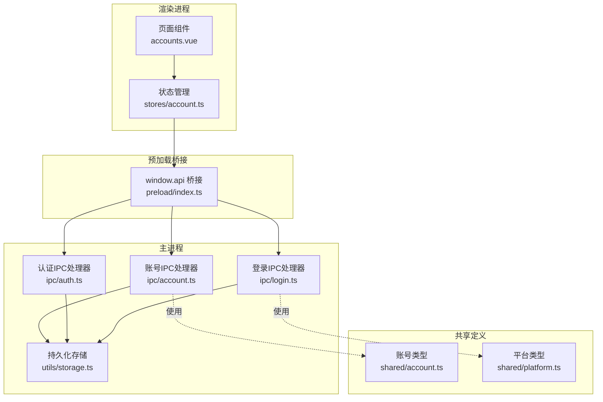
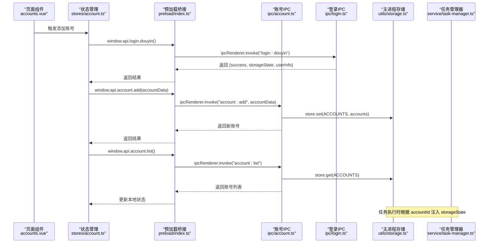
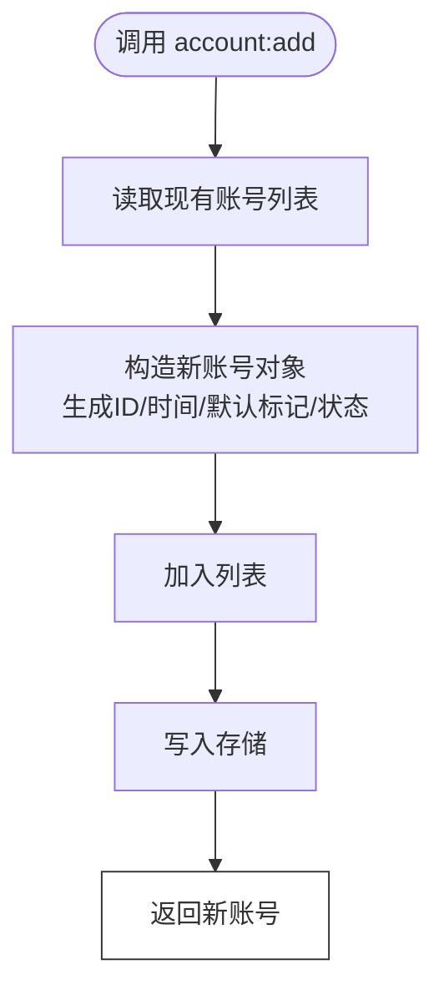
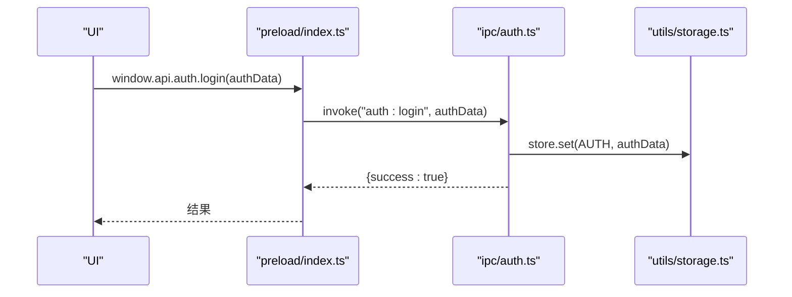
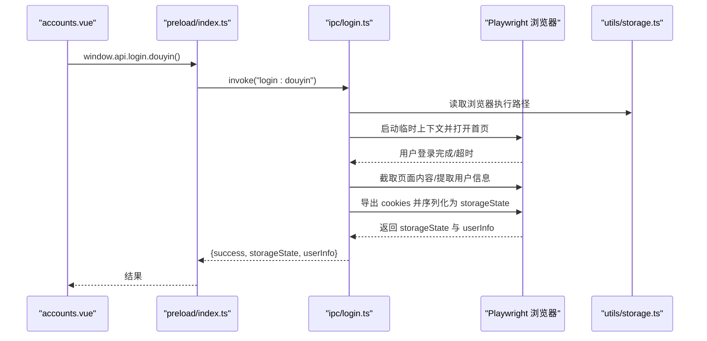
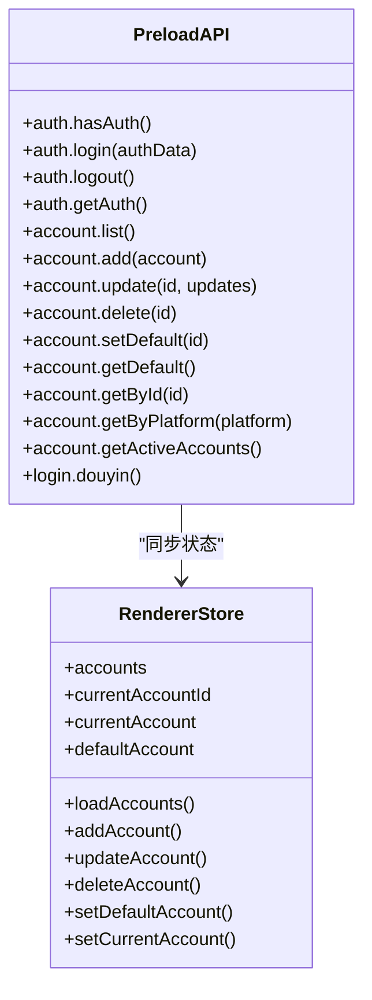
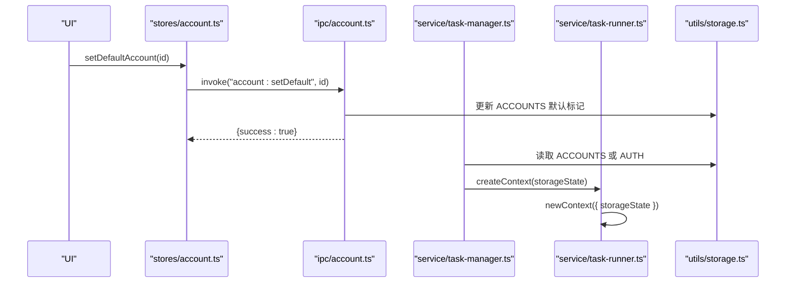
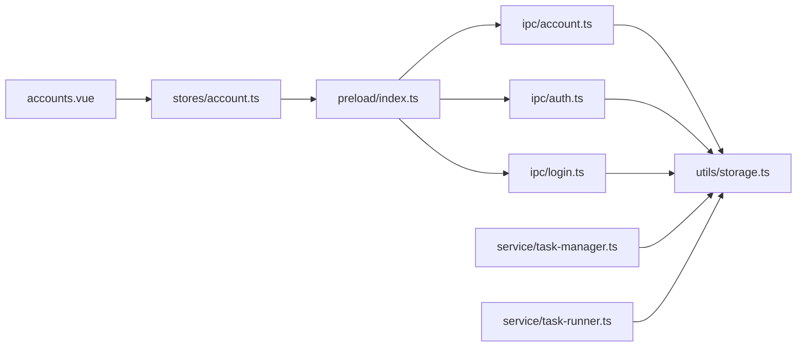

# 账号管理IPC

<cite>
**本文引用的文件**
- [src/main/ipc/account.ts](file://src/main/ipc/account.ts)
- [src/main/ipc/auth.ts](file://src/main/ipc/auth.ts)
- [src/main/ipc/login.ts](file://src/main/ipc/login.ts)
- [src/main/utils/storage.ts](file://src/main/utils/storage.ts)
- [src/preload/index.ts](file://src/preload/index.ts)
- [src/renderer/src/stores/account.ts](file://src/renderer/src/stores/account.ts)
- [src/renderer/src/pages/accounts.vue](file://src/renderer/src/pages/accounts.vue)
- [src/shared/account.ts](file://src/shared/account.ts)
- [src/shared/platform.ts](file://src/shared/platform.ts)
- [src/main/index.ts](file://src/main/index.ts)
- [src/main/service/task-runner.ts](file://src/main/service/task-runner.ts)
- [src/main/service/task-manager.ts](file://src/main/service/task-manager.ts)
</cite>

## 目录
1. [简介](#简介)
2. [项目结构](#项目结构)
3. [核心组件](#核心组件)
4. [架构总览](#架构总览)
5. [详细组件分析](#详细组件分析)
6. [依赖关系分析](#依赖关系分析)
7. [性能与并发特性](#性能与并发特性)
8. [故障排查指南](#故障排查指南)
9. [结论](#结论)
10. [附录：API 参考](#附录api-参考)

## 简介
本文件面向 AutoOps 的“账号管理 IPC”模块，系统性阐述账号信息管理的 IPC 通信机制，覆盖账号的添加、删除、更新、默认账号设置、按平台筛选与状态查询；详述登录流程的 IPC 实现、认证令牌与 Cookie 存储、跨进程数据传递；并给出多账号支持、账号切换同步与状态持久化的整体方案。文档同时提供完整的 API 参考与关键流程图示，帮助开发者快速理解与正确集成。

## 项目结构
账号管理 IPC 涉及主进程 IPC 处理器、预加载桥接层、渲染进程状态与页面交互、共享类型定义以及持久化存储。核心文件分布如下：
- 主进程 IPC：账号管理、认证、登录
- 预加载桥接：统一暴露 window.api.* 接口
- 渲染进程：Pinia 状态管理与页面组件
- 共享类型：账号与平台类型定义
- 存储：electron-store 持久化键值
- 任务服务：基于账号 storageState 的上下文注入

**图表来源**
- [src/renderer/src/pages/accounts.vue:1-203](file://src/renderer/src/pages/accounts.vue#L1-L203)
- [src/renderer/src/stores/account.ts:1-82](file://src/renderer/src/stores/account.ts#L1-L82)
- [src/preload/index.ts:1-187](file://src/preload/index.ts#L1-L187)
- [src/main/ipc/account.ts:1-101](file://src/main/ipc/account.ts#L1-L101)
- [src/main/ipc/auth.ts:1-23](file://src/main/ipc/auth.ts#L1-L23)
- [src/main/ipc/login.ts:1-173](file://src/main/ipc/login.ts#L1-L173)
- [src/main/utils/storage.ts:1-46](file://src/main/utils/storage.ts#L1-L46)
- [src/shared/account.ts:1-39](file://src/shared/account.ts#L1-L39)
- [src/shared/platform.ts:1-260](file://src/shared/platform.ts#L1-L260)

**章节来源**
- [src/main/index.ts:1-106](file://src/main/index.ts#L1-L106)
- [src/preload/index.ts:1-187](file://src/preload/index.ts#L1-L187)
- [src/main/ipc/account.ts:1-101](file://src/main/ipc/account.ts#L1-L101)
- [src/main/ipc/auth.ts:1-23](file://src/main/ipc/auth.ts#L1-L23)
- [src/main/ipc/login.ts:1-173](file://src/main/ipc/login.ts#L1-L173)
- [src/main/utils/storage.ts:1-46](file://src/main/utils/storage.ts#L1-L46)
- [src/shared/account.ts:1-39](file://src/shared/account.ts#L1-L39)
- [src/shared/platform.ts:1-260](file://src/shared/platform.ts#L1-L260)
- [src/renderer/src/stores/account.ts:1-82](file://src/renderer/src/stores/account.ts#L1-L82)
- [src/renderer/src/pages/accounts.vue:1-203](file://src/renderer/src/pages/accounts.vue#L1-L203)

## 核心组件
- 账号 IPC 处理器：提供账号列表、新增、更新、删除、设置默认、查询默认、按 ID 查询、按平台过滤、获取有效账号等接口。
- 认证 IPC 处理器：提供是否已认证、登录写入认证数据、登出清空、读取认证数据等接口。
- 登录 IPC 处理器：通过 Playwright 启动浏览器，引导用户登录抖音，提取用户信息与 Cookie 序列化为 storageState 返回。
- 预加载桥接：在渲染进程暴露 window.api.*，统一调用主进程 ipcRenderer.invoke。
- 渲染状态与页面：Pinia 账号 store 负责本地状态与 IPC 同步；accounts 页面负责 UI 与交互。
- 共享类型：Account、AccountListItem、Platform 等，确保主/渲染/共享层类型一致。
- 存储：electron-store 提供键值持久化，包含 AUTH、ACCOUNTS 等键。

**章节来源**
- [src/main/ipc/account.ts:32-100](file://src/main/ipc/account.ts#L32-L100)
- [src/main/ipc/auth.ts:4-23](file://src/main/ipc/auth.ts#L4-L23)
- [src/main/ipc/login.ts:17-173](file://src/main/ipc/login.ts#L17-L173)
- [src/preload/index.ts:37-150](file://src/preload/index.ts#L37-L150)
- [src/renderer/src/stores/account.ts:14-82](file://src/renderer/src/stores/account.ts#L14-L82)
- [src/shared/account.ts:3-39](file://src/shared/account.ts#L3-L39)
- [src/shared/platform.ts:1-260](file://src/shared/platform.ts#L1-L260)
- [src/main/utils/storage.ts:29-46](file://src/main/utils/storage.ts#L29-L46)

## 架构总览
下图展示了从页面触发到主进程处理、存储落盘与任务执行时上下文注入的整体链路。

**图表来源**
- [src/renderer/src/pages/accounts.vue:62-95](file://src/renderer/src/pages/accounts.vue#L62-L95)
- [src/renderer/src/stores/account.ts:26-48](file://src/renderer/src/stores/account.ts#L26-L48)
- [src/preload/index.ts:137-150](file://src/preload/index.ts#L137-L150)
- [src/main/ipc/login.ts:17-173](file://src/main/ipc/login.ts#L17-L173)
- [src/main/ipc/account.ts:32-60](file://src/main/ipc/account.ts#L32-L60)
- [src/main/utils/storage.ts:14-25](file://src/main/utils/storage.ts#L14-L25)
- [src/main/service/task-manager.ts:132-156](file://src/main/service/task-manager.ts#L132-L156)

## 详细组件分析

### 账号管理 IPC（account）
- 功能要点
  - 列表查询、新增、更新、删除、设置默认、查询默认、按 ID 查询、按平台过滤、获取有效账号。
  - 新增时自动生成唯一 ID 与创建时间，首次添加自动置为默认账号。
  - 删除时若无默认账号则自动选择首个账号为默认。
  - 支持按状态过滤有效账号，便于任务调度时筛选可用账号。

**图表来源**
- [src/main/ipc/account.ts:37-49](file://src/main/ipc/account.ts#L37-L49)

**章节来源**
- [src/main/ipc/account.ts:20-100](file://src/main/ipc/account.ts#L20-L100)
- [src/shared/account.ts:28-39](file://src/shared/account.ts#L28-L39)

### 认证管理 IPC（auth）
- 功能要点
  - 检查是否已认证、登录写入认证数据、登出清空、读取认证数据。
  - 认证数据通常用于全局上下文注入，当任务未指定账号时可作为兜底。

**图表来源**
- [src/main/ipc/auth.ts:10-13](file://src/main/ipc/auth.ts#L10-L13)
- [src/main/utils/storage.ts:14-25](file://src/main/utils/storage.ts#L14-L25)

**章节来源**
- [src/main/ipc/auth.ts:4-23](file://src/main/ipc/auth.ts#L4-L23)
- [src/main/utils/storage.ts:29-46](file://src/main/utils/storage.ts#L29-L46)

### 登录流程 IPC（login）
- 功能要点
  - 通过 Playwright 启动浏览器，访问抖音首页，等待用户登录并检测 URL 变化。
  - 成功后提取用户昵称、头像、用户 ID，并收集 Cookie 序列化为 storageState。
  - 返回 {success, storageState, userInfo}，其中 storageState 为字符串化 JSON，供后续任务注入使用。

**图表来源**
- [src/main/ipc/login.ts:17-173](file://src/main/ipc/login.ts#L17-L173)
- [src/main/utils/storage.ts:3-12](file://src/main/utils/storage.ts#L3-L12)

**章节来源**
- [src/main/ipc/login.ts:17-173](file://src/main/ipc/login.ts#L17-L173)
- [src/main/utils/storage.ts:3-12](file://src/main/utils/storage.ts#L3-L12)

### 预加载桥接与渲染状态
- 预加载桥接
  - 在 window 上暴露统一的 API 命名空间，如 window.api.account、window.api.auth、window.api.login 等。
  - 所有调用均通过 ipcRenderer.invoke 发送至主进程对应通道。
- 渲染状态与页面
  - Pinia store 负责维护账号列表与当前选中账号；与 IPC 同步，支持加载、新增、更新、删除、设置默认。
  - accounts 页面负责 UI 展示、触发登录与保存账号。

**图表来源**
- [src/preload/index.ts:37-150](file://src/preload/index.ts#L37-L150)
- [src/renderer/src/stores/account.ts:14-82](file://src/renderer/src/stores/account.ts#L14-L82)

**章节来源**
- [src/preload/index.ts:3-187](file://src/preload/index.ts#L3-L187)
- [src/renderer/src/stores/account.ts:1-82](file://src/renderer/src/stores/account.ts#L1-L82)
- [src/renderer/src/pages/accounts.vue:1-203](file://src/renderer/src/pages/accounts.vue#L1-L203)

### 多账号支持与账号切换
- 多账号存储
  - 主进程使用 ACCOUNTS 键存储账号数组，每个账号包含 storageState（字符串化）、cookies、状态、默认标记等。
- 账号切换
  - 渲染侧通过 setDefaultAccount 与 setCurrentAccount 切换默认与当前账号；IPC 层保证状态一致性。
- 任务执行时的上下文注入
  - 任务管理器优先根据 accountId 从 ACCOUNTS 中读取 storageState 并解析为对象注入 BrowserContext。
  - 若未指定 accountId，则回退使用 AUTH 全局认证数据。

**图表来源**
- [src/renderer/src/stores/account.ts:58-67](file://src/renderer/src/stores/account.ts#L58-L67)
- [src/main/ipc/account.ts:72-79](file://src/main/ipc/account.ts#L72-L79)
- [src/main/service/task-manager.ts:132-156](file://src/main/service/task-manager.ts#L132-L156)
- [src/main/service/task-runner.ts:72-86](file://src/main/service/task-runner.ts#L72-L86)
- [src/main/utils/storage.ts:14-25](file://src/main/utils/storage.ts#L14-L25)

**章节来源**
- [src/main/ipc/account.ts:72-84](file://src/main/ipc/account.ts#L72-L84)
- [src/renderer/src/stores/account.ts:58-67](file://src/renderer/src/stores/account.ts#L58-L67)
- [src/main/service/task-manager.ts:132-156](file://src/main/service/task-manager.ts#L132-L156)
- [src/main/service/task-runner.ts:72-86](file://src/main/service/task-runner.ts#L72-L86)

## 依赖关系分析
- 组件耦合
  - 渲染层仅依赖预加载桥接，不直接访问主进程逻辑，降低耦合。
  - 主进程 IPC 处理器依赖存储模块，保持数据一致性。
  - 任务服务依赖存储模块读取账号 storageState，形成“账号 -> 上下文”的注入链。
- 外部依赖
  - Playwright 用于登录流程的自动化与 storageState 提取。
  - electron-store 用于键值持久化。

**图表来源**
- [src/renderer/src/pages/accounts.vue:1-203](file://src/renderer/src/pages/accounts.vue#L1-L203)
- [src/renderer/src/stores/account.ts:1-82](file://src/renderer/src/stores/account.ts#L1-L82)
- [src/preload/index.ts:1-187](file://src/preload/index.ts#L1-L187)
- [src/main/ipc/account.ts:1-101](file://src/main/ipc/account.ts#L1-L101)
- [src/main/ipc/auth.ts:1-23](file://src/main/ipc/auth.ts#L1-L23)
- [src/main/ipc/login.ts:1-173](file://src/main/ipc/login.ts#L1-L173)
- [src/main/utils/storage.ts:1-46](file://src/main/utils/storage.ts#L1-L46)
- [src/main/service/task-manager.ts:1-200](file://src/main/service/task-manager.ts#L1-L200)
- [src/main/service/task-runner.ts:1-200](file://src/main/service/task-runner.ts#L1-L200)

**章节来源**
- [src/main/index.ts:4-17](file://src/main/index.ts#L4-L17)
- [src/main/service/task-manager.ts:1-200](file://src/main/service/task-manager.ts#L1-L200)
- [src/main/service/task-runner.ts:1-200](file://src/main/service/task-runner.ts#L1-L200)

## 性能与并发特性
- 登录流程
  - 采用临时用户数据目录与独立上下文，避免干扰主应用状态，且可并行处理多个登录任务。
- 账号并发与冷却
  - 任务管理器对单账号并发与冷却时间进行限制，防止过度请求导致风控。
- 存储与序列化
  - storageState 以字符串形式存储，任务执行前解析为对象注入上下文，减少主进程内存压力。

**章节来源**
- [src/main/ipc/login.ts:28-150](file://src/main/ipc/login.ts#L28-L150)
- [src/main/service/task-manager.ts:161-173](file://src/main/service/task-manager.ts#L161-L173)
- [src/main/service/task-runner.ts:72-86](file://src/main/service/task-runner.ts#L72-L86)

## 故障排查指南
- 登录失败
  - 检查浏览器执行路径是否配置；确认网络可达与页面加载超时；查看日志输出定位 URL 等待超时或提取失败。
- 账号无法切换
  - 确认 setDefault 与 setCurrent 已调用且 IPC 返回成功；检查 store 中 isDefault 标记是否更新。
- 任务未注入登录态
  - 确认 accountId 正确传递；检查 ACCOUNTS 中对应账号的 storageState 是否存在且可解析；若为空则回退 AUTH。
- 存储异常
  - 检查 electron-store 默认值与键名是否匹配；确认 StorageKey 常量与存储键一致。

**章节来源**
- [src/main/ipc/login.ts:21-23](file://src/main/ipc/login.ts#L21-L23)
- [src/main/ipc/account.ts:72-79](file://src/main/ipc/account.ts#L72-L79)
- [src/main/service/task-manager.ts:135-156](file://src/main/service/task-manager.ts#L135-L156)
- [src/main/utils/storage.ts:29-46](file://src/main/utils/storage.ts#L29-L46)

## 结论
AutoOps 的账号管理 IPC 通过清晰的职责分层与强类型的共享定义，实现了从登录采集、账号持久化到任务执行上下文注入的完整闭环。预加载桥接统一了渲染层调用，主进程 IPC 与存储模块保障了数据一致性与可靠性。多账号支持与并发控制策略使系统具备良好的扩展性与稳定性。

## 附录：API 参考

### 账号管理接口（account）
- account:list
  - 描述：获取所有账号
  - 返回：账号数组
- account:add
  - 参数：账号数据（不含 id、createdAt）
  - 返回：新创建的账号
- account:update
  - 参数：id, updates
  - 返回：更新后的账号
- account:delete
  - 参数：id
  - 返回：{ success: boolean }
- account:setDefault
  - 参数：id
  - 返回：{ success: boolean }
- account:getDefault
  - 返回：默认账号或 null
- account:getById
  - 参数：id
  - 返回：账号或 null
- account:getByPlatform
  - 参数：平台枚举
  - 返回：该平台下的账号数组
- account:getActiveAccounts
  - 返回：状态为有效的账号数组

**章节来源**
- [src/main/ipc/account.ts:32-100](file://src/main/ipc/account.ts#L32-L100)
- [src/preload/index.ts:137-147](file://src/preload/index.ts#L137-L147)

### 认证接口（auth）
- auth:hasAuth
  - 返回：是否已认证（布尔）
- auth:login
  - 参数：authData
  - 返回：{ success: boolean }
- auth:logout
  - 返回：{ success: boolean }
- auth:getAuth
  - 返回：认证数据

**章节来源**
- [src/main/ipc/auth.ts:4-23](file://src/main/ipc/auth.ts#L4-L23)
- [src/preload/index.ts:96-101](file://src/preload/index.ts#L96-L101)

### 登录接口（login）
- login:douyin
  - 返回：{ success: boolean, storageState?: string, error?: string, userInfo?: { nickname, avatar?, uniqueId? } }
- login:getUrl
  - 返回：抖音首页 URL

**章节来源**
- [src/main/ipc/login.ts:17-173](file://src/main/ipc/login.ts#L17-L173)
- [src/preload/index.ts:148-150](file://src/preload/index.ts#L148-L150)

### 预加载桥接（window.api）
- account.*
- auth.*
- login.*

**章节来源**
- [src/preload/index.ts:3-187](file://src/preload/index.ts#L3-L187)

### 渲染层调用示例（路径）
- 页面触发登录并保存账号
  - [src/renderer/src/pages/accounts.vue:62-95](file://src/renderer/src/pages/accounts.vue#L62-L95)
- 账号列表与默认账号切换
  - [src/renderer/src/stores/account.ts:26-67](file://src/renderer/src/stores/account.ts#L26-L67)

**章节来源**
- [src/renderer/src/pages/accounts.vue:62-95](file://src/renderer/src/pages/accounts.vue#L62-L95)
- [src/renderer/src/stores/account.ts:26-67](file://src/renderer/src/stores/account.ts#L26-L67)