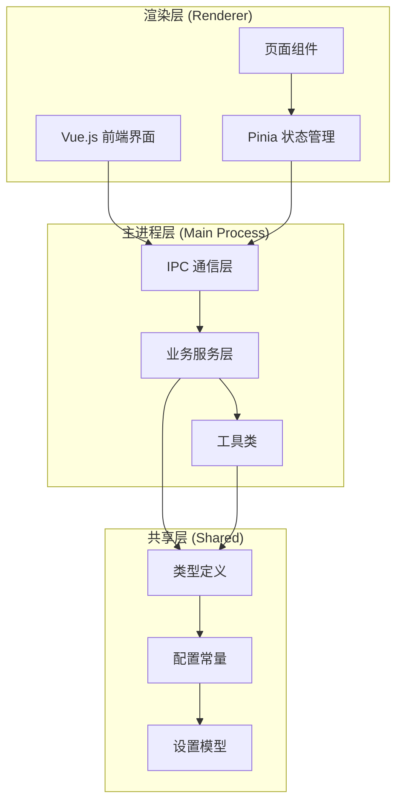
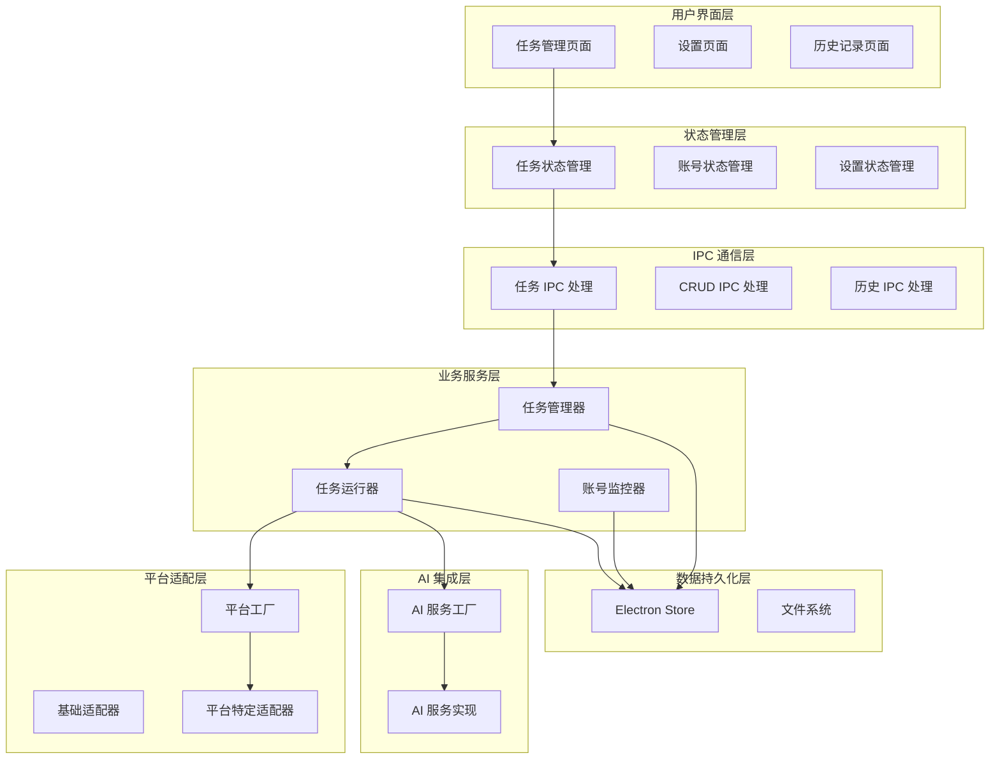
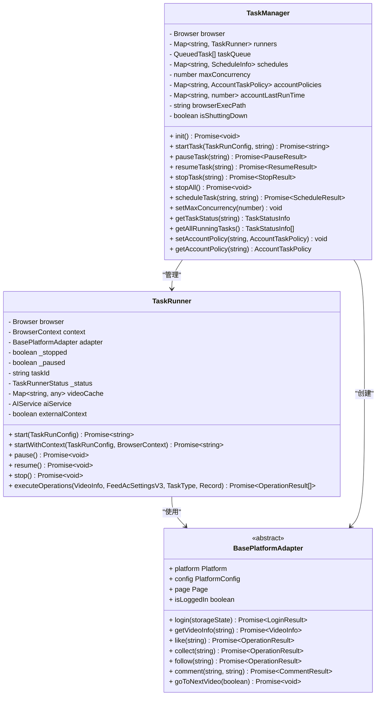
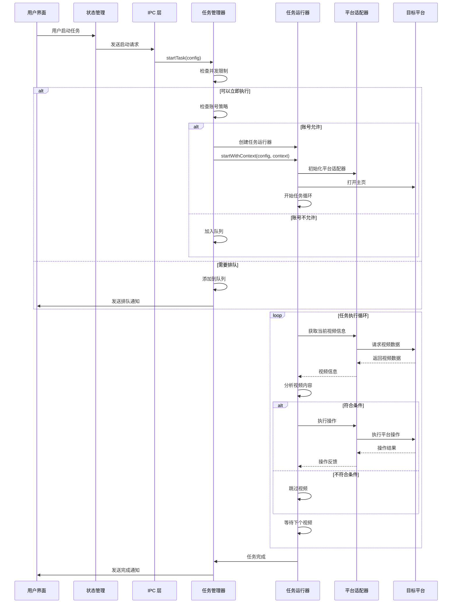
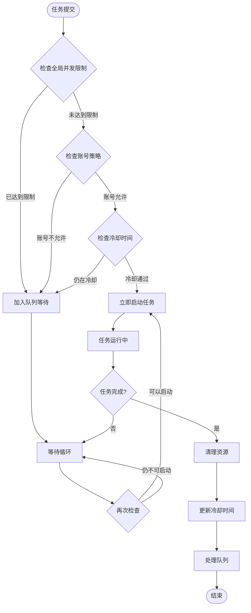
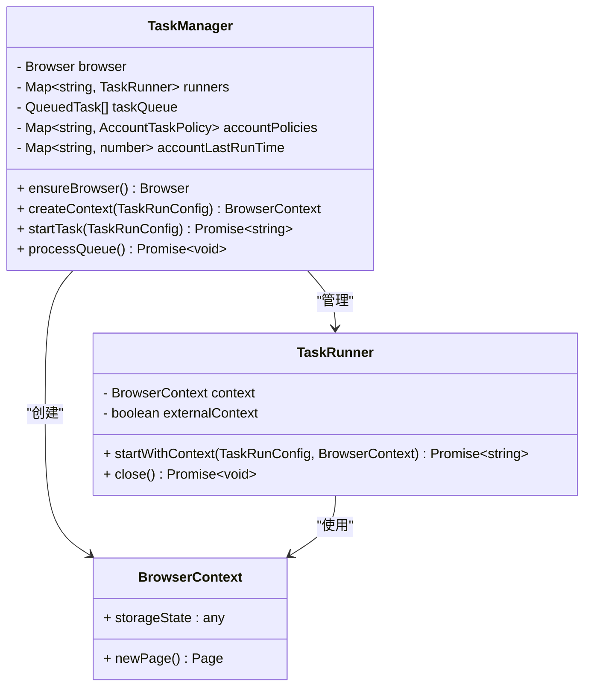
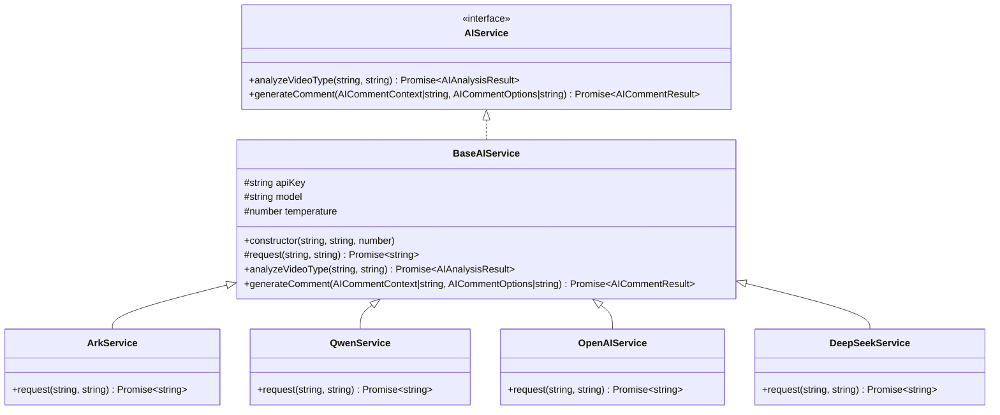
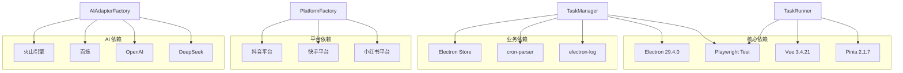

# 任务管理服务

<cite>
**本文档引用的文件**
- [task-manager.ts](file://src/main/service/task-manager.ts)
- [task-runner.ts](file://src/main/service/task-runner.ts)
- [task.ts](file://src/shared/task.ts)
- [task-history.ts](file://src/shared/task-history.ts)
- [task.ts](file://src/main/ipc/task.ts)
- [task-crud.ts](file://src/main/ipc/task-crud.ts)
- [base.ts](file://src/main/platform/base.ts)
- [factory.ts](file://src/main/platform/factory.ts)
- [platform.ts](file://src/shared/platform.ts)
- [storage.ts](file://src/main/utils/storage.ts)
- [feed-ac-setting.ts](file://src/shared/feed-ac-setting.ts)
- [task.ts](file://src/renderer/src/stores/task.ts)
- [tasks.vue](file://src/renderer/src/pages/tasks.vue)
- [account-monitor.ts](file://src/main/service/account-monitor.ts)
- [factory.ts](file://src/main/integration/ai/factory.ts)
- [base.ts](file://src/main/integration/ai/base.ts)
- [ai-setting.ts](file://src/shared/ai-setting.ts)
</cite>

## 更新摘要
**变更内容**
- 新增浏览器上下文共享机制，支持多任务并行执行
- 引入账户特定并发策略控制系统
- 增强队列管理功能，提供更精细的任务调度控制
- 优化任务启动流程，支持外部浏览器上下文注入

## 目录
1. [简介](#简介)
2. [项目结构](#项目结构)
3. [核心组件](#核心组件)
4. [架构概览](#架构概览)
5. [详细组件分析](#详细组件分析)
6. [依赖关系分析](#依赖关系分析)
7. [性能考虑](#性能考虑)
8. [故障排除指南](#故障排除指南)
9. [结论](#结论)

## 简介

任务管理服务是一个基于 Electron 和 Vue.js 构建的自动化任务管理系统，专门用于在抖音、快手、小红书等短视频平台上执行自动化操作。该系统提供了完整的任务生命周期管理、并发控制、定时调度、AI 集成等功能。

**最新增强功能**：
- **浏览器上下文共享**：通过共享浏览器实例和 BrowserContext 实现多任务并行执行，显著提升资源利用率
- **账户特定并发策略**：为不同账号配置独立的并发限制和冷却时间，避免账号间相互影响
- **智能队列管理**：改进的任务队列调度算法，支持动态优先级调整和更精确的资源控制

系统的核心功能包括：
- 多平台支持（抖音、快手、小红书）
- 任务类型多样化（评论、点赞、收藏、关注、组合任务）
- 并发任务管理与资源控制
- 定时任务调度
- AI 驱动的智能内容筛选和评论生成
- 任务历史记录和状态监控

## 项目结构

该项目采用模块化的架构设计，主要分为以下几个层次：

**图表来源**
- [task-manager.ts:48-546](file://src/main/service/task-manager.ts#L48-L546)
- [task-runner.ts:26-850](file://src/main/service/task-runner.ts#L26-L850)
- [task.ts:24-316](file://src/renderer/src/stores/task.ts#L24-L316)

**章节来源**
- [task-manager.ts:1-546](file://src/main/service/task-manager.ts#L1-L546)
- [task-runner.ts:1-850](file://src/main/service/task-runner.ts#L1-L850)
- [platform.ts:1-260](file://src/shared/platform.ts#L1-L260)

## 核心组件

### 任务管理器 (TaskManager)

任务管理器是整个系统的核心协调者，负责管理所有任务的生命周期、并发控制和资源分配。

**主要职责：**
- 任务启动、暂停、恢复、停止
- **新增**：浏览器上下文共享管理
- **新增**：账户特定并发策略控制
- **新增**：智能队列管理与调度
- 任务队列管理
- 浏览器实例管理
- 事件转发和状态同步

**关键特性：**
- 支持最多 10 个并发任务（可配置）
- **新增**：基于账号的并发策略控制
- **新增**：共享浏览器实例优化资源使用
- **新增**：智能队列调度机制
- **新增**：外部浏览器上下文注入支持

### 任务运行器 (TaskRunner)

任务运行器负责具体的任务执行逻辑，包括视频内容识别、操作执行和结果处理。

**主要功能：**
- 视频信息获取和缓存
- 智能内容筛选（类型过滤、分类匹配）
- 多种操作执行（评论、点赞、收藏、关注）
- AI 驱动的智能决策
- 任务状态监控和日志记录
- **新增**：外部浏览器上下文支持

**章节来源**
- [task-manager.ts:48-546](file://src/main/service/task-manager.ts#L48-L546)
- [task-runner.ts:26-850](file://src/main/service/task-runner.ts#L26-L850)

## 架构概览

系统采用分层架构设计，确保各层职责清晰、耦合度低：

**图表来源**
- [task.ts:13-79](file://src/main/ipc/task.ts#L13-L79)
- [task-crud.ts:8-108](file://src/main/ipc/task-crud.ts#L8-L108)
- [task.ts:24-316](file://src/renderer/src/stores/task.ts#L24-L316)
- [account-monitor.ts:17-110](file://src/main/service/account-monitor.ts#L17-L110)

## 详细组件分析

### 任务管理器架构

**图表来源**
- [task-manager.ts:48-546](file://src/main/service/task-manager.ts#L48-L546)
- [task-runner.ts:26-850](file://src/main/service/task-runner.ts#L26-L850)
- [base.ts:24-80](file://src/main/platform/base.ts#L24-L80)

### 任务执行流程

**图表来源**
- [task.ts:82-134](file://src/main/ipc/task.ts#L82-L134)
- [task-manager.ts:179-235](file://src/main/service/task-manager.ts#L179-L235)
- [task-runner.ts:256-392](file://src/main/service/task-runner.ts#L256-L392)

### 并发控制机制

**图表来源**
- [task-manager.ts:162-174](file://src/main/service/task-manager.ts#L162-L174)
- [task-manager.ts:368-391](file://src/main/service/task-manager.ts#L368-L391)

**章节来源**
- [task-manager.ts:162-391](file://src/main/service/task-manager.ts#L162-L391)
- [task-runner.ts:256-392](file://src/main/service/task-runner.ts#L256-L392)

### 浏览器上下文共享架构

**图表来源**
- [task-manager.ts:113-158](file://src/main/service/task-manager.ts#L113-L158)
- [task-runner.ts:162-207](file://src/main/service/task-runner.ts#L162-L207)

**章节来源**
- [task-manager.ts:113-158](file://src/main/service/task-manager.ts#L113-L158)
- [task-runner.ts:162-207](file://src/main/service/task-runner.ts#L162-L207)

### AI 集成架构

**图表来源**
- [base.ts:23-131](file://src/main/integration/ai/base.ts#L23-L131)
- [factory.ts:9-25](file://src/main/integration/ai/factory.ts#L9-L25)

**章节来源**
- [base.ts:23-131](file://src/main/integration/ai/base.ts#L23-L131)
- [factory.ts:9-25](file://src/main/integration/ai/factory.ts#L9-L25)
- [ai-setting.ts:1-29](file://src/shared/ai-setting.ts#L1-L29)

## 依赖关系分析

系统的关键依赖关系如下：

**图表来源**
- [package.json](file://package.json)
- [task-manager.ts:1-13](file://src/main/service/task-manager.ts#L1-L13)
- [task-runner.ts:1-13](file://src/main/service/task-runner.ts#L1-L13)

**章节来源**
- [package.json](file://package.json)
- [task-manager.ts:1-13](file://src/main/service/task-manager.ts#L1-L13)
- [task-runner.ts:1-13](file://src/main/service/task-runner.ts#L1-L13)

## 性能考虑

### 资源优化策略

1. **浏览器实例复用**
   - **新增**：共享浏览器实例减少内存占用
   - **新增**：动态创建和销毁 BrowserContext
   - **新增**：自动重连机制处理断开连接
   - **新增**：外部上下文注入支持多任务并行

2. **并发控制**
   - 可配置的最大并发数（1-10）
   - **新增**：基于账号的并发策略
   - **新增**：冷却时间防止频繁切换
   - **新增**：智能队列调度算法

3. **内存管理**
   - 视频缓存自动清理
   - 任务完成后及时释放资源
   - 日志缓冲区大小限制
   - **新增**：浏览器上下文状态持久化

### 性能监控指标

- **任务执行效率**: 通过任务历史记录跟踪执行时间
- **资源使用率**: 监控内存和 CPU 使用情况
- **错误率统计**: 记录任务失败原因和频率
- **响应时间**: 页面加载和 API 请求响应时间
- **新增**：并发控制效果监控
- **新增**：队列处理效率统计

## 故障排除指南

### 常见问题及解决方案

**1. 浏览器路径配置错误**
- **症状**: 启动任务时报错"浏览器路径未配置"
- **解决**: 在设置中正确配置浏览器可执行文件路径
- **预防**: 启动前验证浏览器路径存在性

**2. 账号登录状态失效**
- **症状**: 任务执行过程中被强制登出
- **解决**: 使用账号监控功能检查登录状态
- **预防**: 定期检查账号有效期

**3. 任务长时间无响应**
- **症状**: 任务卡在某个视频无法继续
- **解决**: 检查网络连接和平台稳定性
- **预防**: 设置合理的超时时间和重试机制

**4. 并发任务冲突**
- **症状**: 任务排队或执行缓慢
- **解决**: 调整最大并发数设置
- **预防**: 根据系统资源合理配置并发数
- **新增**：检查账号特定并发策略配置

**5. 浏览器上下文共享问题**
- **症状**: 多任务执行时出现状态混乱
- **解决**: 确保使用正确的上下文注入方法
- **预防**: 验证外部上下文的存储状态完整性

**6. 队列管理异常**
- **症状**: 任务无法正常启动或重复排队
- **解决**: 检查队列状态和调度逻辑
- **预防**: 定期清理无效队列项

**章节来源**
- [account-monitor.ts:17-110](file://src/main/service/account-monitor.ts#L17-L110)
- [task-manager.ts:112-128](file://src/main/service/task-manager.ts#L112-L128)

## 结论

任务管理服务提供了一个完整、可扩展的自动化任务执行框架，具有以下优势：

1. **模块化设计**: 清晰的分层架构便于维护和扩展
2. **多平台支持**: 统一的适配器模式支持多个短视频平台
3. **智能化功能**: AI 集成提供智能内容筛选和评论生成
4. **完善的监控**: 详细的状态跟踪和日志记录
5. **用户友好**: 直观的界面和丰富的配置选项
6. **新增**：**浏览器上下文共享**：通过共享浏览器实例和 BrowserContext 实现多任务并行执行，显著提升资源利用率
7. **新增**：**账户特定并发策略**：为不同账号配置独立的并发限制和冷却时间，避免账号间相互影响
8. **新增**：**智能队列管理**：改进的任务队列调度算法，支持动态优先级调整和更精确的资源控制

该系统适合需要批量执行社交媒体操作的场景，通过合理的配置和监控，可以实现高效稳定的自动化任务管理。最新的增强功能进一步提升了系统的可扩展性和资源利用效率，特别适合需要同时管理多个账号和大量任务的高级用户。