# UI组件

<cite>
**本文引用的文件**
- [src/renderer/src/components/ui/button/Button.vue](file://src/renderer/src/components/ui/button/Button.vue)
- [src/renderer/src/components/ui/button/index.ts](file://src/renderer/src/components/ui/button/index.ts)
- [src/renderer/src/components/ui/dialog/Dialog.vue](file://src/renderer/src/components/ui/dialog/Dialog.vue)
- [src/renderer/src/components/ui/dialog/index.ts](file://src/renderer/src/components/ui/dialog/index.ts)
- [src/renderer/src/components/ui/card/Card.vue](file://src/renderer/src/components/ui/card/Card.vue)
- [src/renderer/src/components/ui/card/index.ts](file://src/renderer/src/components/ui/card/index.ts)
- [src/renderer/src/components/ui/input/Input.vue](file://src/renderer/src/components/ui/input/Input.vue)
- [src/renderer/src/components/ui/input/index.ts](file://src/renderer/src/components/ui/input/index.ts)
- [src/renderer/src/lib/utils.ts](file://src/renderer/src/lib/utils.ts)
- [src/renderer/src/components/ui/avatar/index.ts](file://src/renderer/src/components/ui/avatar/index.ts)
- [src/renderer/src/components/ui/badge/index.ts](file://src/renderer/src/components/ui/badge/index.ts)
- [src/renderer/src/components/ui/dropdown-menu/index.ts](file://src/renderer/src/components/ui/dropdown-menu/index.ts)
- [src/renderer/src/components/ui/popover/index.ts](file://src/renderer/src/components/ui/popover/index.ts)
- [src/renderer/src/components/ui/select/index.ts](file://src/renderer/src/components/ui/select/index.ts)
</cite>

## 目录
1. [简介](#简介)
2. [项目结构](#项目结构)
3. [核心组件](#核心组件)
4. [架构总览](#架构总览)
5. [详细组件分析](#详细组件分析)
6. [依赖关系分析](#依赖关系分析)
7. [性能与可访问性](#性能与可访问性)
8. [故障排查指南](#故障排查指南)
9. [结论](#结论)
10. [附录：使用示例与最佳实践](#附录使用示例与最佳实践)

## 简介
本文件系统化梳理 AutoOps 渲染端（Renderer）的UI组件体系，覆盖设计理念、视觉外观、行为模式、交互方式、属性/事件/插槽、定制与主题、响应式与无障碍、状态与动画、跨浏览器与性能优化，以及组件组合与集成方式。所有说明均基于仓库中实际存在的组件源码与导出结构。

## 项目结构
UI 组件集中位于渲染端的组件目录，采用“按功能域分包”的组织方式，每个功能域包含一个基础组件与若干子组件（如卡片、对话框、下拉菜单等），并通过统一的入口 index.ts 导出，便于按需引入与组合使用。

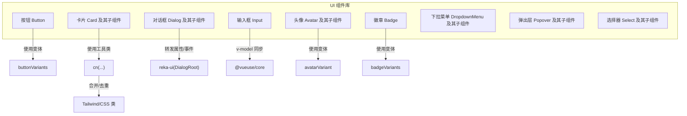

图表来源
- [src/renderer/src/components/ui/button/Button.vue:1-29](file://src/renderer/src/components/ui/button/Button.vue#L1-L29)
- [src/renderer/src/components/ui/button/index.ts:1-39](file://src/renderer/src/components/ui/button/index.ts#L1-L39)
- [src/renderer/src/components/ui/dialog/Dialog.vue:1-16](file://src/renderer/src/components/ui/dialog/Dialog.vue#L1-L16)
- [src/renderer/src/components/ui/card/Card.vue:1-22](file://src/renderer/src/components/ui/card/Card.vue#L1-L22)
- [src/renderer/src/components/ui/input/Input.vue:1-34](file://src/renderer/src/components/ui/input/Input.vue#L1-L34)
- [src/renderer/src/lib/utils.ts:1-8](file://src/renderer/src/lib/utils.ts#L1-L8)
- [src/renderer/src/components/ui/avatar/index.ts:1-26](file://src/renderer/src/components/ui/avatar/index.ts#L1-L26)
- [src/renderer/src/components/ui/badge/index.ts:1-27](file://src/renderer/src/components/ui/badge/index.ts#L1-L27)

章节来源
- [src/renderer/src/components/ui/button/Button.vue:1-29](file://src/renderer/src/components/ui/button/Button.vue#L1-L29)
- [src/renderer/src/components/ui/button/index.ts:1-39](file://src/renderer/src/components/ui/button/index.ts#L1-L39)
- [src/renderer/src/components/ui/dialog/Dialog.vue:1-16](file://src/renderer/src/components/ui/dialog/Dialog.vue#L1-L16)
- [src/renderer/src/components/ui/dialog/index.ts:1-10](file://src/renderer/src/components/ui/dialog/index.ts#L1-L10)
- [src/renderer/src/components/ui/card/Card.vue:1-22](file://src/renderer/src/components/ui/card/Card.vue#L1-L22)
- [src/renderer/src/components/ui/card/index.ts:1-7](file://src/renderer/src/components/ui/card/index.ts#L1-L7)
- [src/renderer/src/components/ui/input/Input.vue:1-34](file://src/renderer/src/components/ui/input/Input.vue#L1-L34)
- [src/renderer/src/components/ui/input/index.ts:1-2](file://src/renderer/src/components/ui/input/index.ts#L1-L2)
- [src/renderer/src/lib/utils.ts:1-8](file://src/renderer/src/lib/utils.ts#L1-L8)
- [src/renderer/src/components/ui/avatar/index.ts:1-26](file://src/renderer/src/components/ui/avatar/index.ts#L1-L26)
- [src/renderer/src/components/ui/badge/index.ts:1-27](file://src/renderer/src/components/ui/badge/index.ts#L1-L27)
- [src/renderer/src/components/ui/dropdown-menu/index.ts:1-17](file://src/renderer/src/components/ui/dropdown-menu/index.ts#L1-L17)
- [src/renderer/src/components/ui/popover/index.ts:1-5](file://src/renderer/src/components/ui/popover/index.ts#L1-L5)
- [src/renderer/src/components/ui/select/index.ts:1-12](file://src/renderer/src/components/ui/select/index.ts#L1-L12)

## 核心组件
- 按钮 Button：通过变体系统控制外观与尺寸，支持原生按钮或语义标签包裹，具备焦点可见环与禁用态。
- 卡片 Card：容器型组件，提供头部、标题、描述、内容、底部等子组件，统一边框、背景与阴影风格。
- 对话框 Dialog：基于 reka-ui 的 DialogRoot，提供触发器、内容、关闭、标题、描述、页脚等子组件，支持滚动内容与触发转发。
- 输入框 Input：受控/非受控值同步，支持默认值、禁用、占位符、错误态样式与可访问性属性 aria-invalid。
- 头像 Avatar：支持多尺寸与形状变体，提供图像与回退内容子组件。
- 徽章 Badge：强调性标签，支持多种变体与默认选中。
- 下拉菜单 DropdownMenu：完整菜单体系，含子菜单、复选/单选组、快捷键、分隔线等。
- 弹出层 Popover：触发器与内容组合，支持锚点。
- 选择器 Select：滚动按钮、分组、标签、项、值显示等子组件齐全。

章节来源
- [src/renderer/src/components/ui/button/Button.vue:1-29](file://src/renderer/src/components/ui/button/Button.vue#L1-L29)
- [src/renderer/src/components/ui/button/index.ts:1-39](file://src/renderer/src/components/ui/button/index.ts#L1-L39)
- [src/renderer/src/components/ui/card/Card.vue:1-22](file://src/renderer/src/components/ui/card/Card.vue#L1-L22)
- [src/renderer/src/components/ui/card/index.ts:1-7](file://src/renderer/src/components/ui/card/index.ts#L1-L7)
- [src/renderer/src/components/ui/dialog/Dialog.vue:1-16](file://src/renderer/src/components/ui/dialog/Dialog.vue#L1-L16)
- [src/renderer/src/components/ui/dialog/index.ts:1-10](file://src/renderer/src/components/ui/dialog/index.ts#L1-L10)
- [src/renderer/src/components/ui/input/Input.vue:1-34](file://src/renderer/src/components/ui/input/Input.vue#L1-L34)
- [src/renderer/src/components/ui/input/index.ts:1-2](file://src/renderer/src/components/ui/input/index.ts#L1-L2)
- [src/renderer/src/components/ui/avatar/index.ts:1-26](file://src/renderer/src/components/ui/avatar/index.ts#L1-L26)
- [src/renderer/src/components/ui/badge/index.ts:1-27](file://src/renderer/src/components/ui/badge/index.ts#L1-L27)
- [src/renderer/src/components/ui/dropdown-menu/index.ts:1-17](file://src/renderer/src/components/ui/dropdown-menu/index.ts#L1-L17)
- [src/renderer/src/components/ui/popover/index.ts:1-5](file://src/renderer/src/components/ui/popover/index.ts#L1-L5)
- [src/renderer/src/components/ui/select/index.ts:1-12](file://src/renderer/src/components/ui/select/index.ts#L1-L12)

## 架构总览
组件架构以“基础组件 + 变体系统 + 子组件导出 + 工具函数”为核心：
- 基础组件：承载通用逻辑与样式，如按钮、卡片、输入框等。
- 变体系统：使用 class-variance-authority 定义不同外观/尺寸，通过工具函数合并 Tailwind 类。
- 子组件导出：每个功能域通过 index.ts 汇总导出，便于按需引入。
- 工具函数：cn(...) 聚合 clsx 与 tailwind-merge，确保类名冲突最小化。

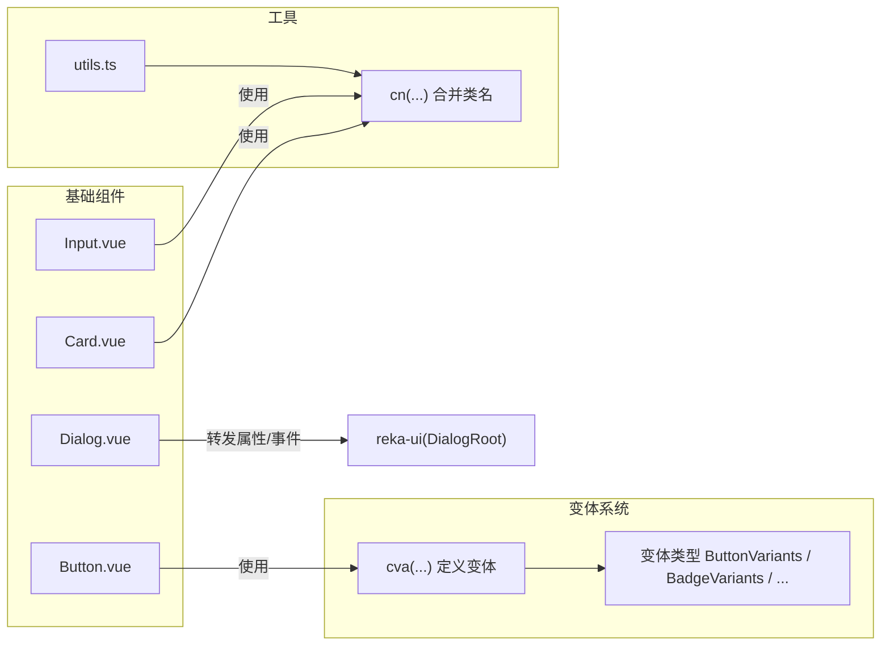

图表来源
- [src/renderer/src/components/ui/button/index.ts:1-39](file://src/renderer/src/components/ui/button/index.ts#L1-L39)
- [src/renderer/src/components/ui/button/Button.vue:1-29](file://src/renderer/src/components/ui/button/Button.vue#L1-L29)
- [src/renderer/src/components/ui/card/Card.vue:1-22](file://src/renderer/src/components/ui/card/Card.vue#L1-L22)
- [src/renderer/src/components/ui/input/Input.vue:1-34](file://src/renderer/src/components/ui/input/Input.vue#L1-L34)
- [src/renderer/src/components/ui/dialog/Dialog.vue:1-16](file://src/renderer/src/components/ui/dialog/Dialog.vue#L1-L16)
- [src/renderer/src/lib/utils.ts:1-8](file://src/renderer/src/lib/utils.ts#L1-L8)

## 详细组件分析

### 按钮 Button
- 设计理念：通过变体系统统一控制外观（默认/危险/描边/次级/幽灵/链接）与尺寸（默认/xs/sm/lg/icon/icon-sm/icon-lg），保持一致的交互反馈与视觉层级。
- 视觉外观：使用变体生成的类名，结合焦点可见环与禁用态处理，确保可访问性与一致性。
- 行为模式：支持原生按钮或语义标签包裹；通过 Primitive 组件透传属性与子节点；支持自定义根元素类型与 as-child。
- 属性/事件/插槽
  - 属性
    - as: 根元素类型（默认按钮）
    - asChild: 是否仅渲染子元素
    - variant: 变体名称（来自 buttonVariants）
    - size: 尺寸名称（来自 buttonVariants）
    - class: 额外类名
  - 事件：无特定事件（继承 Primitive）
  - 插槽：默认插槽用于放置按钮内容
- 定制选项：通过变体系统扩展新变体；通过 class 注入额外样式；支持 as/as-child 改写根元素。
- 使用示例路径
  - [按钮基础用法:15-17](file://src/renderer/src/components/ui/button/Button.vue#L15-L17)
  - [变体定义:6-36](file://src/renderer/src/components/ui/button/index.ts#L6-L36)
- 无障碍与响应式：变体包含焦点可见环与禁用态，尺寸变体适配移动端与桌面端。
- 动画与过渡：变体包含过渡类，悬停时有颜色过渡；图标尺寸与间距由变体统一管理。

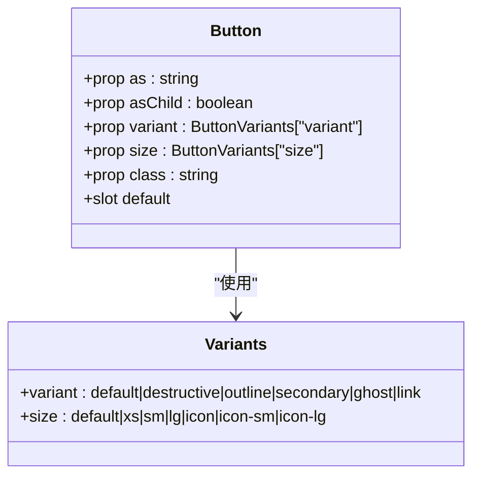

图表来源
- [src/renderer/src/components/ui/button/Button.vue:9-17](file://src/renderer/src/components/ui/button/Button.vue#L9-L17)
- [src/renderer/src/components/ui/button/index.ts:6-36](file://src/renderer/src/components/ui/button/index.ts#L6-L36)

章节来源
- [src/renderer/src/components/ui/button/Button.vue:1-29](file://src/renderer/src/components/ui/button/Button.vue#L1-L29)
- [src/renderer/src/components/ui/button/index.ts:1-39](file://src/renderer/src/components/ui/button/index.ts#L1-L39)

### 卡片 Card
- 设计理念：作为信息区块容器，提供清晰的边界与背景，配合子组件实现结构化布局。
- 视觉外观：统一圆角、边框、背景与阴影，支持通过 class 扩展。
- 行为模式：纯展示容器，无状态；通过子组件组织内容。
- 属性/事件/插槽
  - 属性
    - class: 额外类名
  - 事件：无
  - 插槽：默认插槽用于放置卡片内容
- 定制选项：通过 class 注入 Tailwind 类；子组件提供头部/标题/描述/内容/底部等结构化区域。
- 使用示例路径
  - [卡片容器:10-21](file://src/renderer/src/components/ui/card/Card.vue#L10-L21)
  - [子组件导出:1-7](file://src/renderer/src/components/ui/card/index.ts#L1-L7)

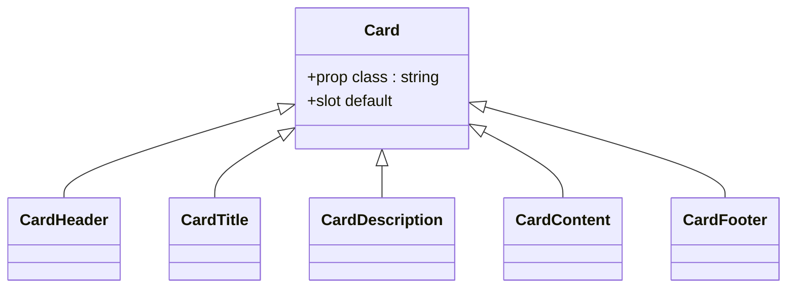

图表来源
- [src/renderer/src/components/ui/card/Card.vue:1-22](file://src/renderer/src/components/ui/card/Card.vue#L1-L22)
- [src/renderer/src/components/ui/card/index.ts:1-7](file://src/renderer/src/components/ui/card/index.ts#L1-L7)

章节来源
- [src/renderer/src/components/ui/card/Card.vue:1-22](file://src/renderer/src/components/ui/card/Card.vue#L1-L22)
- [src/renderer/src/components/ui/card/index.ts:1-7](file://src/renderer/src/components/ui/card/index.ts#L1-L7)

### 对话框 Dialog
- 设计理念：基于 reka-ui 的 DialogRoot 实现，提供触发器、内容、关闭、标题、描述、页脚、滚动内容等子组件，支持滚动场景与触发转发。
- 视觉外观：通过子组件组合形成标准对话框结构；支持遮罩层与定位。
- 行为模式：通过 DialogTrigger 打开/关闭；支持滚动内容；事件通过 useForwardPropsEmits 转发。
- 属性/事件/插槽
  - 属性：继承 DialogRootProps
  - 事件：继承 DialogRootEmits
  - 插槽：默认插槽用于放置子组件
- 定制选项：通过子组件组合实现复杂布局；支持滚动内容与触发转发。
- 使用示例路径
  - [根组件封装:1-16](file://src/renderer/src/components/ui/dialog/Dialog.vue#L1-L16)
  - [子组件导出:1-10](file://src/renderer/src/components/ui/dialog/index.ts#L1-L10)

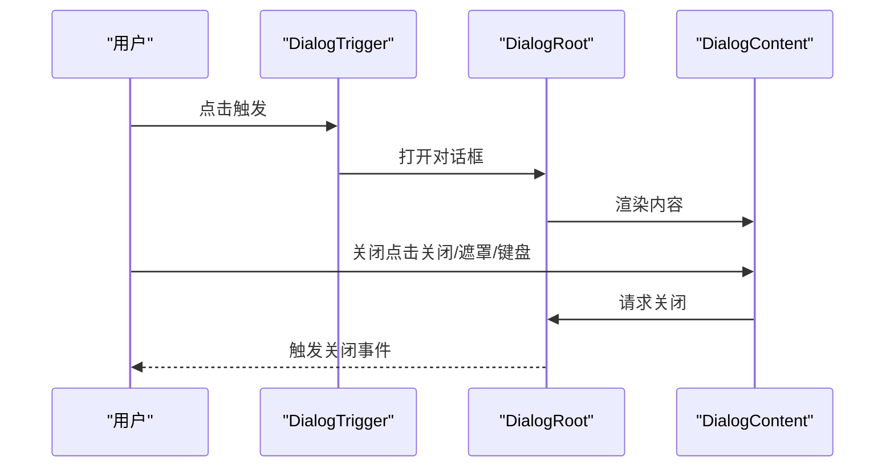

图表来源
- [src/renderer/src/components/ui/dialog/Dialog.vue:1-16](file://src/renderer/src/components/ui/dialog/Dialog.vue#L1-L16)
- [src/renderer/src/components/ui/dialog/index.ts:1-10](file://src/renderer/src/components/ui/dialog/index.ts#L1-L10)

章节来源
- [src/renderer/src/components/ui/dialog/Dialog.vue:1-16](file://src/renderer/src/components/ui/dialog/Dialog.vue#L1-L16)
- [src/renderer/src/components/ui/dialog/index.ts:1-10](file://src/renderer/src/components/ui/dialog/index.ts#L1-L10)

### 输入框 Input
- 设计理念：提供受控/非受控值同步，支持默认值、禁用、占位符、错误态与可访问性属性。
- 视觉外观：统一高度、圆角、边框、背景与阴影过渡；聚焦时显示焦点环；错误态使用破坏色系。
- 行为模式：使用 useVModel 实现 v-model 同步；支持被动模式与默认值；提供 update:modelValue 事件。
- 属性/事件/插槽
  - 属性
    - modelValue: 受控值
    - defaultValue: 非受控默认值
    - class: 额外类名
  - 事件
    - update:modelValue: 值变更事件
  - 插槽：无
- 定制选项：通过 class 注入 Tailwind 类；支持 aria-invalid 错误态。
- 使用示例路径
  - [受控/非受控与事件:6-19](file://src/renderer/src/components/ui/input/Input.vue#L6-L19)
  - [样式类名与可访问性:22-33](file://src/renderer/src/components/ui/input/Input.vue#L22-L33)

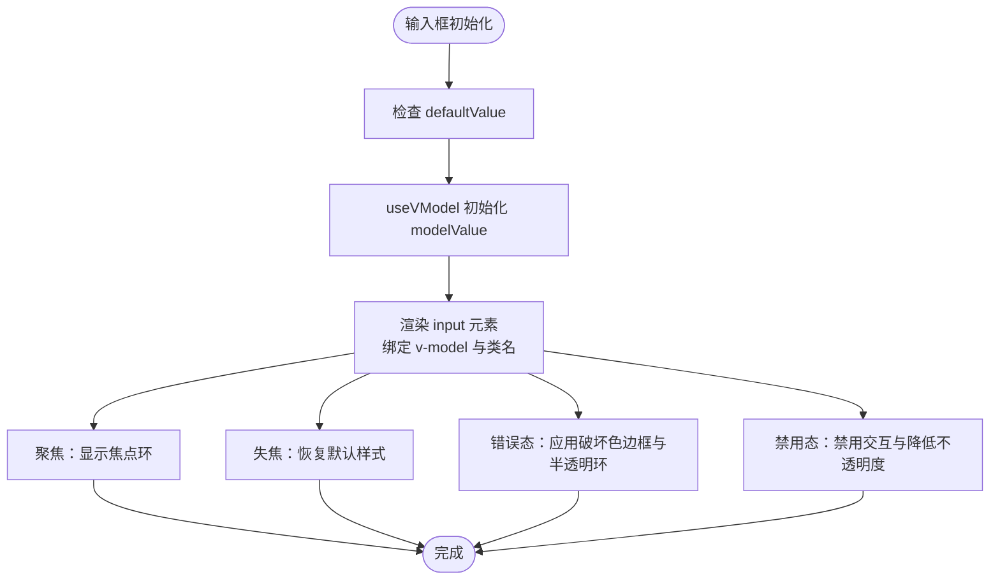

图表来源
- [src/renderer/src/components/ui/input/Input.vue:1-34](file://src/renderer/src/components/ui/input/Input.vue#L1-L34)

章节来源
- [src/renderer/src/components/ui/input/Input.vue:1-34](file://src/renderer/src/components/ui/input/Input.vue#L1-L34)
- [src/renderer/src/components/ui/input/index.ts:1-2](file://src/renderer/src/components/ui/input/index.ts#L1-L2)

### 头像 Avatar
- 设计理念：提供头像展示与回退机制，支持多尺寸与形状变体。
- 视觉外观：根据变体设置尺寸与形状（圆形/方形），统一背景与文字样式。
- 行为模式：通过子组件分别承载图片与回退内容。
- 属性/事件/插槽
  - 属性：继承子组件属性（如 size、shape）
  - 事件：无特定事件
  - 插槽：默认插槽用于放置子组件
- 定制选项：通过 avatarVariant 扩展尺寸与形状；通过 class 注入额外样式。
- 使用示例路径
  - [变体定义:8-23](file://src/renderer/src/components/ui/avatar/index.ts#L8-L23)

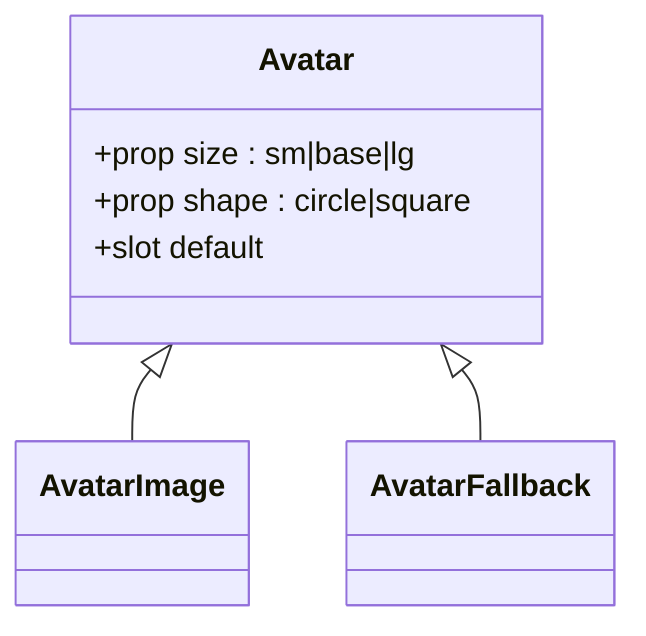

图表来源
- [src/renderer/src/components/ui/avatar/index.ts:1-26](file://src/renderer/src/components/ui/avatar/index.ts#L1-L26)

章节来源
- [src/renderer/src/components/ui/avatar/index.ts:1-26](file://src/renderer/src/components/ui/avatar/index.ts#L1-L26)

### 徽章 Badge
- 设计理念：强调性标签，支持多种变体与默认选中。
- 视觉外观：根据变体设置背景、边框与阴影；默认变体提供强调效果。
- 行为模式：纯展示组件，无状态。
- 属性/事件/插槽
  - 属性：variant（来自 badgeVariants）
  - 事件：无
  - 插槽：默认插槽用于放置文本或图标
- 定制选项：通过 badgeVariants 扩展变体；通过 class 注入额外样式。
- 使用示例路径
  - [变体定义:6-24](file://src/renderer/src/components/ui/badge/index.ts#L6-L24)

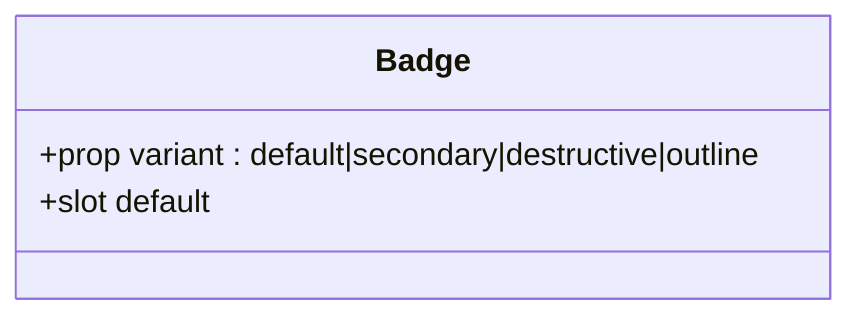

图表来源
- [src/renderer/src/components/ui/badge/index.ts:1-27](file://src/renderer/src/components/ui/badge/index.ts#L1-L27)

章节来源
- [src/renderer/src/components/ui/badge/index.ts:1-27](file://src/renderer/src/components/ui/badge/index.ts#L1-L27)

### 下拉菜单 DropdownMenu
- 设计理念：提供完整菜单体系，支持子菜单、复选/单选组、快捷键、分隔线等。
- 视觉外观：统一菜单样式与交互反馈。
- 行为模式：通过 Trigger 打开，支持 Sub/Portal 等高级结构。
- 属性/事件/插槽：详见导出清单。
- 定制选项：通过子组件组合实现复杂菜单结构。
- 使用示例路径
  - [子组件导出:1-17](file://src/renderer/src/components/ui/dropdown-menu/index.ts#L1-L17)

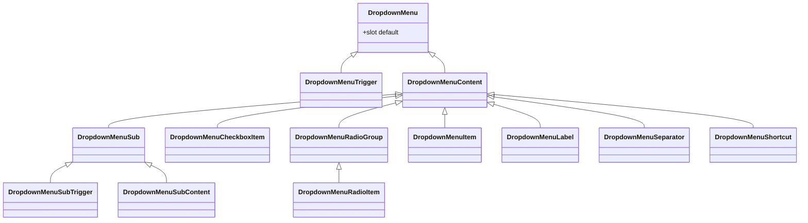

图表来源
- [src/renderer/src/components/ui/dropdown-menu/index.ts:1-17](file://src/renderer/src/components/ui/dropdown-menu/index.ts#L1-L17)

章节来源
- [src/renderer/src/components/ui/dropdown-menu/index.ts:1-17](file://src/renderer/src/components/ui/dropdown-menu/index.ts#L1-L17)

### 弹出层 Popover
- 设计理念：触发器与内容组合，支持锚点。
- 视觉外观：统一弹出层样式。
- 行为模式：通过 Trigger 打开/关闭，支持锚点。
- 属性/事件/插槽：详见导出清单。
- 定制选项：通过子组件组合实现弹出层内容。
- 使用示例路径
  - [子组件导出:1-5](file://src/renderer/src/components/ui/popover/index.ts#L1-L5)

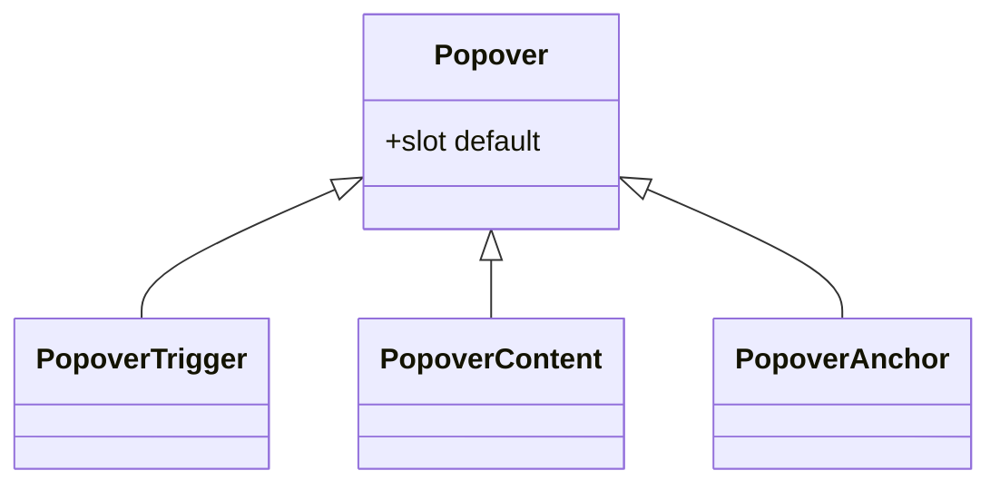

图表来源
- [src/renderer/src/components/ui/popover/index.ts:1-5](file://src/renderer/src/components/ui/popover/index.ts#L1-L5)

章节来源
- [src/renderer/src/components/ui/popover/index.ts:1-5](file://src/renderer/src/components/ui/popover/index.ts#L1-L5)

### 选择器 Select
- 设计理念：提供滚动按钮、分组、标签、项、值显示等子组件，支持复杂选择场景。
- 视觉外观：统一触发器与内容样式。
- 行为模式：通过 Trigger 打开内容，支持滚动按钮与分组。
- 属性/事件/插槽：详见导出清单。
- 定制选项：通过子组件组合实现分组与滚动。
- 使用示例路径
  - [子组件导出:1-12](file://src/renderer/src/components/ui/select/index.ts#L1-L12)

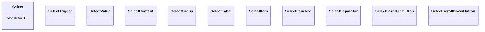

图表来源
- [src/renderer/src/components/ui/select/index.ts:1-12](file://src/renderer/src/components/ui/select/index.ts#L1-L12)

章节来源
- [src/renderer/src/components/ui/select/index.ts:1-12](file://src/renderer/src/components/ui/select/index.ts#L1-L12)

## 依赖关系分析
- 组件间耦合
  - Button 依赖变体系统与工具函数 cn(...)
  - Card 依赖工具函数 cn(...)
  - Input 依赖 @vueuse/core 的 useVModel
  - Dialog 依赖 reka-ui 的 DialogRoot 与事件转发
  - Avatar/Badge 依赖变体系统
  - DropdownMenu/Popover/Select 依赖 reka-ui 或内部子组件组合
- 外部依赖
  - class-variance-authority：变体系统
  - tailwind-merge / clsx：类名合并与去重
  - @vueuse/core：v-model 同步
  - reka-ui：对话框与部分复合组件的基础能力

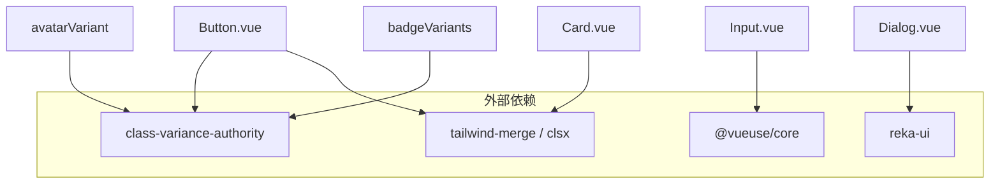

图表来源
- [src/renderer/src/components/ui/button/index.ts:1-39](file://src/renderer/src/components/ui/button/index.ts#L1-L39)
- [src/renderer/src/components/ui/button/Button.vue:1-29](file://src/renderer/src/components/ui/button/Button.vue#L1-L29)
- [src/renderer/src/components/ui/card/Card.vue:1-22](file://src/renderer/src/components/ui/card/Card.vue#L1-L22)
- [src/renderer/src/components/ui/input/Input.vue:1-34](file://src/renderer/src/components/ui/input/Input.vue#L1-L34)
- [src/renderer/src/components/ui/dialog/Dialog.vue:1-16](file://src/renderer/src/components/ui/dialog/Dialog.vue#L1-L16)
- [src/renderer/src/components/ui/avatar/index.ts:1-26](file://src/renderer/src/components/ui/avatar/index.ts#L1-L26)
- [src/renderer/src/components/ui/badge/index.ts:1-27](file://src/renderer/src/components/ui/badge/index.ts#L1-L27)
- [src/renderer/src/lib/utils.ts:1-8](file://src/renderer/src/lib/utils.ts#L1-L8)

章节来源
- [src/renderer/src/components/ui/button/index.ts:1-39](file://src/renderer/src/components/ui/button/index.ts#L1-L39)
- [src/renderer/src/components/ui/button/Button.vue:1-29](file://src/renderer/src/components/ui/button/Button.vue#L1-L29)
- [src/renderer/src/components/ui/card/Card.vue:1-22](file://src/renderer/src/components/ui/card/Card.vue#L1-L22)
- [src/renderer/src/components/ui/input/Input.vue:1-34](file://src/renderer/src/components/ui/input/Input.vue#L1-L34)
- [src/renderer/src/components/ui/dialog/Dialog.vue:1-16](file://src/renderer/src/components/ui/dialog/Dialog.vue#L1-L16)
- [src/renderer/src/components/ui/avatar/index.ts:1-26](file://src/renderer/src/components/ui/avatar/index.ts#L1-L26)
- [src/renderer/src/components/ui/badge/index.ts:1-27](file://src/renderer/src/components/ui/badge/index.ts#L1-L27)
- [src/renderer/src/lib/utils.ts:1-8](file://src/renderer/src/lib/utils.ts#L1-L8)

## 性能与可访问性
- 性能
  - 受控/非受控同步：Input 使用被动模式与默认值，减少不必要的重渲染。
  - 类名合并：cn(...) 通过 tailwind-merge 与 clsx 合并类名，避免重复与冲突。
  - 变体系统：cva(...) 生成稳定类名，减少运行时计算。
- 可访问性
  - Input 支持 aria-invalid 错误态与焦点可见环。
  - Button 提供禁用态与焦点可见环。
  - Dialog 通过 reka-ui 提供键盘导航与焦点管理。
- 响应式
  - 多尺寸变体（如 Button 的 icon-sm/icon-lg、Input 的尺寸过渡）适配不同屏幕密度。
- 主题支持
  - 组件样式基于语义变量（如 primary、destructive、accent 等），可通过主题切换实现整体风格变化。

章节来源
- [src/renderer/src/components/ui/input/Input.vue:16-19](file://src/renderer/src/components/ui/input/Input.vue#L16-L19)
- [src/renderer/src/components/ui/input/Input.vue:26-31](file://src/renderer/src/components/ui/input/Input.vue#L26-L31)
- [src/renderer/src/components/ui/button/Button.vue:21-27](file://src/renderer/src/components/ui/button/Button.vue#L21-L27)
- [src/renderer/src/components/ui/button/index.ts:6-36](file://src/renderer/src/components/ui/button/index.ts#L6-L36)
- [src/renderer/src/components/ui/dialog/Dialog.vue:1-16](file://src/renderer/src/components/ui/dialog/Dialog.vue#L1-L16)

## 故障排查指南
- 输入框无法同步
  - 检查是否正确使用 v-model 与 update:modelValue 事件。
  - 确认 useVModel 的被动模式与默认值配置。
  - 参考路径：[输入框事件与 v-model:12-19](file://src/renderer/src/components/ui/input/Input.vue#L12-L19)
- 对话框无法关闭或事件未触发
  - 确认 DialogTrigger 与 DialogRoot 的组合使用。
  - 检查 useForwardPropsEmits 是否正确转发属性与事件。
  - 参考路径：[对话框根组件:5-8](file://src/renderer/src/components/ui/dialog/Dialog.vue#L5-L8)
- 类名冲突或样式异常
  - 使用 cn(...) 合并类名，避免重复覆盖。
  - 参考路径：[类名合并工具:5-7](file://src/renderer/src/lib/utils.ts#L5-L7)
- 按钮无焦点环或禁用态异常
  - 检查变体类名与禁用态类名是否正确应用。
  - 参考路径：[按钮变体与类名:6-36](file://src/renderer/src/components/ui/button/index.ts#L6-L36)

章节来源
- [src/renderer/src/components/ui/input/Input.vue:12-19](file://src/renderer/src/components/ui/input/Input.vue#L12-L19)
- [src/renderer/src/components/ui/dialog/Dialog.vue:5-8](file://src/renderer/src/components/ui/dialog/Dialog.vue#L5-L8)
- [src/renderer/src/lib/utils.ts:5-7](file://src/renderer/src/lib/utils.ts#L5-L7)
- [src/renderer/src/components/ui/button/index.ts:6-36](file://src/renderer/src/components/ui/button/index.ts#L6-L36)

## 结论
AutoOps 的 UI 组件体系以“变体系统 + 工具函数 + reka-ui 基础能力”为核心，实现了高内聚、低耦合、可扩展且易维护的组件库。通过统一的类名合并策略与语义化变量，组件在视觉与交互上保持一致；通过子组件导出与组合，满足复杂业务场景需求。建议在后续迭代中持续完善变体与主题系统，并补充更丰富的无障碍与跨浏览器测试。

## 附录：使用示例与最佳实践
- 按钮
  - 基础用法：参考 [按钮组件:15-17](file://src/renderer/src/components/ui/button/Button.vue#L15-L17)
  - 自定义尺寸与外观：参考 [变体定义:6-36](file://src/renderer/src/components/ui/button/index.ts#L6-L36)
- 卡片
  - 结构化布局：参考 [卡片容器:10-21](file://src/renderer/src/components/ui/card/Card.vue#L10-L21) 与 [子组件导出:1-7](file://src/renderer/src/components/ui/card/index.ts#L1-L7)
- 对话框
  - 触发与关闭：参考 [根组件封装:1-16](file://src/renderer/src/components/ui/dialog/Dialog.vue#L1-L16)
  - 子组件组合：参考 [子组件导出:1-10](file://src/renderer/src/components/ui/dialog/index.ts#L1-L10)
- 输入框
  - 受控/非受控与事件：参考 [输入框事件与 v-model:12-19](file://src/renderer/src/components/ui/input/Input.vue#L12-L19)
  - 错误态与可访问性：参考 [样式类名与可访问性:26-31](file://src/renderer/src/components/ui/input/Input.vue#L26-L31)
- 头像与徽章
  - 变体扩展：参考 [头像变体:8-23](file://src/renderer/src/components/ui/avatar/index.ts#L8-L23) 与 [徽章变体:6-24](file://src/renderer/src/components/ui/badge/index.ts#L6-L24)
- 下拉菜单、弹出层、选择器
  - 子组件组合：参考 [下拉菜单导出:1-17](file://src/renderer/src/components/ui/dropdown-menu/index.ts#L1-L17)、[弹出层导出:1-5](file://src/renderer/src/components/ui/popover/index.ts#L1-L5)、[选择器导出:1-12](file://src/renderer/src/components/ui/select/index.ts#L1-L12)