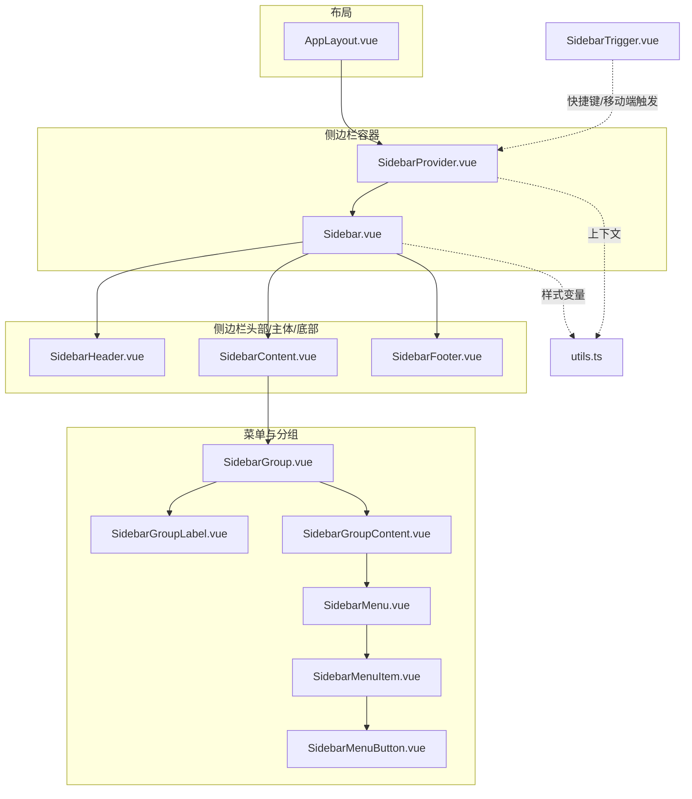
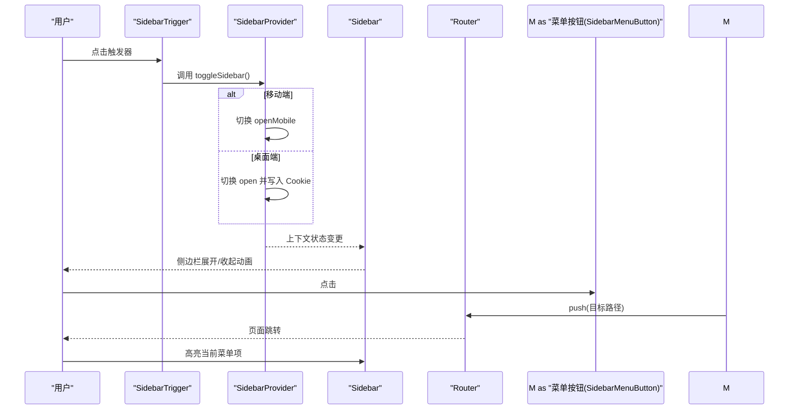
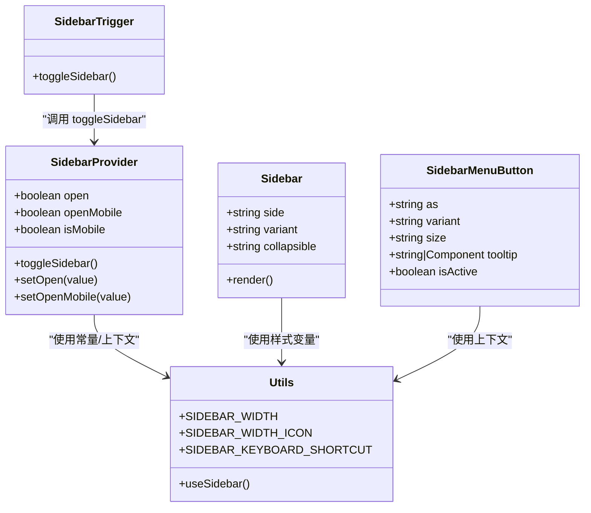

# 侧边栏组件

<cite>
**本文引用的文件**
- [Sidebar.vue](file://src/renderer/src/components/layout/Sidebar.vue)
- [SidebarProvider.vue](file://src/renderer/src/components/ui/sidebar/SidebarProvider.vue)
- [SidebarTrigger.vue](file://src/renderer/src/components/ui/sidebar/SidebarTrigger.vue)
- [Sidebar.vue](file://src/renderer/src/components/ui/sidebar/Sidebar.vue)
- [SidebarContent.vue](file://src/renderer/src/components/ui/sidebar/SidebarContent.vue)
- [SidebarHeader.vue](file://src/renderer/src/components/ui/sidebar/SidebarHeader.vue)
- [SidebarFooter.vue](file://src/renderer/src/components/ui/sidebar/SidebarFooter.vue)
- [SidebarMenu.vue](file://src/renderer/src/components/ui/sidebar/SidebarMenu.vue)
- [SidebarMenuItem.vue](file://src/renderer/src/components/ui/sidebar/SidebarMenuItem.vue)
- [SidebarMenuButton.vue](file://src/renderer/src/components/ui/sidebar/SidebarMenuButton.vue)
- [SidebarGroup.vue](file://src/renderer/src/components/ui/sidebar/SidebarGroup.vue)
- [SidebarGroupContent.vue](file://src/renderer/src/components/ui/sidebar/SidebarGroupContent.vue)
- [SidebarGroupLabel.vue](file://src/renderer/src/components/ui/sidebar/SidebarGroupLabel.vue)
- [utils.ts](file://src/renderer/src/components/ui/sidebar/utils.ts)
</cite>

## 目录
1. [简介](#简介)
2. [项目结构](#项目结构)
3. [核心组件](#核心组件)
4. [架构总览](#架构总览)
5. [组件详解](#组件详解)
6. [依赖关系分析](#依赖关系分析)
7. [性能考量](#性能考量)
8. [故障排查指南](#故障排查指南)
9. [结论](#结论)
10. [附录：使用示例与最佳实践](#附录使用示例与最佳实践)

## 简介
本文件面向 AutoOps 的侧边栏组件系统，系统性阐述其设计理念、导航模式与用户交互方式；详细说明各子组件的属性、事件与插槽；覆盖折叠/展开、路由集成、菜单高亮、嵌套菜单、与主内容区域的协调机制、响应式行为、动态菜单与权限控制、工具提示、快捷键与键盘导航等关键能力，并提供可直接定位到源码位置的参考路径，便于快速查阅与二次开发。

## 项目结构
AutoOps 的侧边栏采用“布局容器 + 组合子组件”的分层设计：
- 布局层：AppLayout 负责整体布局与主内容区域渲染
- 侧边栏层：由 SidebarProvider 提供上下文状态，Sidebar 作为容器，内部组合 Header/Content/Footer 与菜单组、菜单项、按钮等
- 触发器层：SidebarTrigger 提供移动端抽屉开关与快捷键触发
- 工具层：utils.ts 定义上下文、样式变量与快捷键常量

图表来源
- [SidebarProvider.vue:1-82](file://src/renderer/src/components/ui/sidebar/SidebarProvider.vue#L1-L82)
- [Sidebar.vue:1-86](file://src/renderer/src/components/ui/sidebar/Sidebar.vue#L1-L86)
- [SidebarHeader.vue:1-18](file://src/renderer/src/components/ui/sidebar/SidebarHeader.vue#L1-L18)
- [SidebarContent.vue:1-18](file://src/renderer/src/components/ui/sidebar/SidebarContent.vue#L1-L18)
- [SidebarFooter.vue:1-18](file://src/renderer/src/components/ui/sidebar/SidebarFooter.vue#L1-L18)
- [SidebarGroup.vue:1-18](file://src/renderer/src/components/ui/sidebar/SidebarGroup.vue#L1-L18)
- [SidebarGroupLabel.vue:1-25](file://src/renderer/src/components/ui/sidebar/SidebarGroupLabel.vue#L1-L25)
- [SidebarGroupContent.vue:1-18](file://src/renderer/src/components/ui/sidebar/SidebarGroupContent.vue#L1-L18)
- [SidebarMenu.vue:1-18](file://src/renderer/src/components/ui/sidebar/SidebarMenu.vue#L1-L18)
- [SidebarMenuItem.vue:1-18](file://src/renderer/src/components/ui/sidebar/SidebarMenuItem.vue#L1-L18)
- [SidebarMenuButton.vue:1-49](file://src/renderer/src/components/ui/sidebar/SidebarMenuButton.vue#L1-L49)
- [SidebarTrigger.vue:1-27](file://src/renderer/src/components/ui/sidebar/SidebarTrigger.vue#L1-L27)
- [utils.ts:1-20](file://src/renderer/src/components/ui/sidebar/utils.ts#L1-L20)

章节来源
- [SidebarProvider.vue:1-82](file://src/renderer/src/components/ui/sidebar/SidebarProvider.vue#L1-L82)
- [Sidebar.vue:1-86](file://src/renderer/src/components/ui/sidebar/Sidebar.vue#L1-L86)
- [utils.ts:1-20](file://src/renderer/src/components/ui/sidebar/utils.ts#L1-L20)

## 核心组件
- SidebarProvider：提供侧边栏状态上下文（展开/收起、移动端状态、是否移动端），持久化 Cookie，处理快捷键切换，注入样式变量
- Sidebar：根据可折叠策略与设备类型渲染桌面固定/浮动/抽屉或移动端抽屉
- SidebarHeader/SidebarContent/SidebarFooter：分别承载头部、主内容区、底部区域
- SidebarGroup/SidebarGroupLabel/SidebarGroupContent：用于对菜单进行分组与标签化
- SidebarMenu/SidebarMenuItem：菜单容器与菜单项
- SidebarMenuButton：菜单按钮，支持工具提示、激活态、图标+文本
- SidebarTrigger：触发侧边栏开关（含快捷键）
- utils.ts：上下文定义、样式变量、Cookie 名称与快捷键常量

章节来源
- [SidebarProvider.vue:1-82](file://src/renderer/src/components/ui/sidebar/SidebarProvider.vue#L1-L82)
- [Sidebar.vue:1-86](file://src/renderer/src/components/ui/sidebar/Sidebar.vue#L1-L86)
- [SidebarHeader.vue:1-18](file://src/renderer/src/components/ui/sidebar/SidebarHeader.vue#L1-L18)
- [SidebarContent.vue:1-18](file://src/renderer/src/components/ui/sidebar/SidebarContent.vue#L1-L18)
- [SidebarFooter.vue:1-18](file://src/renderer/src/components/ui/sidebar/SidebarFooter.vue#L1-L18)
- [SidebarGroup.vue:1-18](file://src/renderer/src/components/ui/sidebar/SidebarGroup.vue#L1-L18)
- [SidebarGroupLabel.vue:1-25](file://src/renderer/src/components/ui/sidebar/SidebarGroupLabel.vue#L1-L25)
- [SidebarGroupContent.vue:1-18](file://src/renderer/src/components/ui/sidebar/SidebarGroupContent.vue#L1-L18)
- [SidebarMenu.vue:1-18](file://src/renderer/src/components/ui/sidebar/SidebarMenu.vue#L1-L18)
- [SidebarMenuItem.vue:1-18](file://src/renderer/src/components/ui/sidebar/SidebarMenuItem.vue#L1-L18)
- [SidebarMenuButton.vue:1-49](file://src/renderer/src/components/ui/sidebar/SidebarMenuButton.vue#L1-L49)
- [SidebarTrigger.vue:1-27](file://src/renderer/src/components/ui/sidebar/SidebarTrigger.vue#L1-L27)
- [utils.ts:1-20](file://src/renderer/src/components/ui/sidebar/utils.ts#L1-L20)

## 架构总览
侧边栏系统通过 Provider 注入上下文，Sidebar 根据设备与可折叠策略选择渲染形态；菜单项通过路由集成实现导航与高亮；工具提示在侧边栏收起时显示；快捷键支持跨平台组合键切换。

图表来源
- [SidebarTrigger.vue:1-27](file://src/renderer/src/components/ui/sidebar/SidebarTrigger.vue#L1-L27)
- [SidebarProvider.vue:1-82](file://src/renderer/src/components/ui/sidebar/SidebarProvider.vue#L1-L82)
- [Sidebar.vue:1-86](file://src/renderer/src/components/ui/sidebar/Sidebar.vue#L1-L86)
- [SidebarMenuButton.vue:1-49](file://src/renderer/src/components/ui/sidebar/SidebarMenuButton.vue#L1-L49)

## 组件详解

### SidebarProvider（上下文提供者）
- 职责
  - 维护 open/openMobile/isMobile 状态
  - 处理快捷键（默认 Ctrl/Cmd + B）切换侧边栏
  - 将状态注入到子组件上下文，供其他组件读取
  - 写入 Cookie 以持久化侧边栏状态
  - 注入样式变量（桌面/图标模式宽度）
- 关键属性
  - defaultOpen?: boolean（默认从 Cookie 读取）
  - open?: boolean（受控模式）
  - class?: string
- 关键事件
  - update:open —— 向外发出 open 变更
- 关键方法
  - setOpen(value: boolean)：更新 open 并写入 Cookie
  - setOpenMobile(value: boolean)：更新移动端状态
  - toggleSidebar()：根据设备类型切换对应状态
- 响应式与状态
  - 使用媒体查询判断 isMobile
  - 计算 state 为 expanded/collapsed，用于数据属性与样式

章节来源
- [SidebarProvider.vue:1-82](file://src/renderer/src/components/ui/sidebar/SidebarProvider.vue#L1-L82)
- [utils.ts:1-20](file://src/renderer/src/components/ui/sidebar/utils.ts#L1-L20)

### Sidebar（容器）
- 职责
  - 根据 collapsible 与设备类型渲染不同形态
  - 在桌面端支持 offcanvas/icon/floating/inset 等变体
  - 注入样式变量并传递属性给子元素
- 关键属性
  - side: "left"|"right"
  - variant: "sidebar"|"floating"|"inset"
  - collapsible: "offcanvas"|"icon"|"none"
  - class?: string
- 行为
  - mobile：使用抽屉（SheetContent）渲染
  - desktop：固定/浮动/内嵌侧边栏，配合 data-state/data-collapsible/data-variant/data-side 数据属性

章节来源
- [Sidebar.vue:1-86](file://src/renderer/src/components/ui/sidebar/Sidebar.vue#L1-L86)
- [utils.ts:1-20](file://src/renderer/src/components/ui/sidebar/utils.ts#L1-L20)

### SidebarHeader / SidebarContent / SidebarFooter
- 职责
  - 分别承载头部、主内容区、底部区域
  - Content 支持溢出滚动，icon 模式下自动隐藏溢出
- 关键属性
  - class?: string

章节来源
- [SidebarHeader.vue:1-18](file://src/renderer/src/components/ui/sidebar/SidebarHeader.vue#L1-L18)
- [SidebarContent.vue:1-18](file://src/renderer/src/components/ui/sidebar/SidebarContent.vue#L1-L18)
- [SidebarFooter.vue:1-18](file://src/renderer/src/components/ui/sidebar/SidebarFooter.vue#L1-L18)

### SidebarGroup / SidebarGroupLabel / SidebarGroupContent
- 职责
  - 对菜单进行分组与标签化展示
  - 支持在 icon 模式下隐藏标签
- 关键属性
  - class?: string

章节来源
- [SidebarGroup.vue:1-18](file://src/renderer/src/components/ui/sidebar/SidebarGroup.vue#L1-L18)
- [SidebarGroupLabel.vue:1-25](file://src/renderer/src/components/ui/sidebar/SidebarGroupLabel.vue#L1-L25)
- [SidebarGroupContent.vue:1-18](file://src/renderer/src/components/ui/sidebar/SidebarGroupContent.vue#L1-L18)

### SidebarMenu / SidebarMenuItem
- 职责
  - 菜单容器与菜单项包装
  - 为菜单项提供统一的布局与数据属性
- 关键属性
  - class?: string

章节来源
- [SidebarMenu.vue:1-18](file://src/renderer/src/components/ui/sidebar/SidebarMenu.vue#L1-L18)
- [SidebarMenuItem.vue:1-18](file://src/renderer/src/components/ui/sidebar/SidebarMenuItem.vue#L1-L18)

### SidebarMenuButton（菜单按钮）
- 职责
  - 承载图标与文本，支持激活态与工具提示
  - 在侧边栏收起且非移动端时显示工具提示
- 关键属性
  - as: "button"|"a"
  - variant: "default"|"ghost"
  - size: "default"|"sm"
  - tooltip?: string|Component
  - isActive?: boolean
  - class?: string
- 插槽
  - 默认插槽：放置图标与文本
- 事件
  - click（透传自底层按钮）

章节来源
- [SidebarMenuButton.vue:1-49](file://src/renderer/src/components/ui/sidebar/SidebarMenuButton.vue#L1-L49)

### SidebarTrigger（触发器）
- 职责
  - 提供移动端抽屉开关与快捷键触发
- 关键属性
  - class?: string
- 交互
  - 点击：调用 toggleSidebar
  - 快捷键：Ctrl/Cmd + B（由 Provider 统一监听）

章节来源
- [SidebarTrigger.vue:1-27](file://src/renderer/src/components/ui/sidebar/SidebarTrigger.vue#L1-L27)
- [SidebarProvider.vue:46-51](file://src/renderer/src/components/ui/sidebar/SidebarProvider.vue#L46-L51)

### 路由集成与菜单高亮
- 集成方式
  - 使用 vue-router 的 useRouter/useRoute
  - 通过 isActive(path) 判断当前路径是否匹配
  - 点击菜单项调用 router.push 进行导航
- 高亮策略
  - isActive("/")：仅根路径匹配
  - isActive(prefix)：前缀匹配，适合子路由场景

章节来源
- [Sidebar.vue:22-39](file://src/renderer/src/components/layout/Sidebar.vue#L22-L39)

### 折叠/展开与响应式行为
- 折叠策略
  - collapsible="icon"：仅显示图标，文字在 hover 时出现
  - collapsible="offcanvas"：完全隐藏，通过触发器或快捷键唤出
  - collapsible="none"：始终可见
- 响应式
  - 移动端使用抽屉（SheetContent）渲染
  - 桌面端根据 variant（sidebar/floating/inset）与 data-* 属性决定布局与边框阴影

章节来源
- [Sidebar.vue:20-84](file://src/renderer/src/components/ui/sidebar/Sidebar.vue#L20-L84)
- [utils.ts:6-8](file://src/renderer/src/components/ui/sidebar/utils.ts#L6-L8)

### 工具提示、快捷键与键盘导航
- 工具提示
  - SidebarMenuButton 支持 tooltip 字符串或组件
  - 仅在侧边栏处于 collapsed 且非移动端时显示
- 快捷键
  - 默认 Ctrl/Cmd + B 切换侧边栏
  - 由 SidebarProvider 统一监听并调用 toggleSidebar
- 键盘导航
  - 触发器按钮具备可访问性标识（sr-only 文本）
  - 菜单按钮基于 reka-ui 的 Tooltip/Trigger 结构，具备标准语义

章节来源
- [SidebarMenuButton.vue:31-47](file://src/renderer/src/components/ui/sidebar/SidebarMenuButton.vue#L31-L47)
- [SidebarProvider.vue:46-51](file://src/renderer/src/components/ui/sidebar/SidebarProvider.vue#L46-L51)
- [SidebarTrigger.vue:16-25](file://src/renderer/src/components/ui/sidebar/SidebarTrigger.vue#L16-L25)
- [utils.ts:9-19](file://src/renderer/src/components/ui/sidebar/utils.ts#L9-L19)

### 嵌套菜单与动态生成
- 嵌套菜单
  - 通过 SidebarMenu/Sub/SidebarMenuItem/SubItem 实现层级结构
  - 子菜单项可复用相同按钮组件，保持一致的交互与样式
- 动态生成
  - 菜单项数组可由配置或权限计算生成
  - 可结合 isActive 与 router 进行运行时高亮与导航

章节来源
- [SidebarMenu.vue:1-18](file://src/renderer/src/components/ui/sidebar/SidebarMenu.vue#L1-L18)
- [SidebarMenuItem.vue:1-18](file://src/renderer/src/components/ui/sidebar/SidebarMenuItem.vue#L1-L18)

### 权限控制
- 实现思路
  - 在生成 navItems 时按角色/权限过滤
  - 未授权菜单项不渲染，避免越权访问
- 注意事项
  - 高亮逻辑需与权限集合保持一致，避免出现“不可见但高亮”的异常

章节来源
- [Sidebar.vue:25-30](file://src/renderer/src/components/layout/Sidebar.vue#L25-L30)

### 与主内容区域的协调机制
- 宽度与间距
  - 通过 CSS 变量 --sidebar-width/--sidebar-width-icon 控制侧边栏宽度
  - 桌面端侧边栏收起时，主内容区域自动留出间隙
- 数据属性驱动样式
  - data-state、data-collapsible、data-variant、data-side 用于 Tailwind 类名条件控制
- 浮动/内嵌变体
  - floating/inset 变体在收起时仍保留一定可视宽度，便于交互

章节来源
- [Sidebar.vue:52-74](file://src/renderer/src/components/ui/sidebar/Sidebar.vue#L52-L74)
- [utils.ts:6-8](file://src/renderer/src/components/ui/sidebar/utils.ts#L6-L8)

## 依赖关系分析

图表来源
- [SidebarProvider.vue:1-82](file://src/renderer/src/components/ui/sidebar/SidebarProvider.vue#L1-L82)
- [Sidebar.vue:1-86](file://src/renderer/src/components/ui/sidebar/Sidebar.vue#L1-L86)
- [SidebarMenuButton.vue:1-49](file://src/renderer/src/components/ui/sidebar/SidebarMenuButton.vue#L1-L49)
- [SidebarTrigger.vue:1-27](file://src/renderer/src/components/ui/sidebar/SidebarTrigger.vue#L1-L27)
- [utils.ts:1-20](file://src/renderer/src/components/ui/sidebar/utils.ts#L1-L20)

## 性能考量
- 渲染策略
  - 移动端抽屉仅在需要时打开，减少桌面端 DOM 开销
  - icon 模式下隐藏文字与溢出滚动，降低重排成本
- 状态持久化
  - Cookie 写入在切换时触发，建议避免频繁切换导致的抖动
- 样式变量
  - 通过 CSS 变量控制宽度，减少重复类名与样式计算

## 故障排查指南
- 侧边栏无法收起/展开
  - 检查是否正确包裹在 SidebarProvider 中
  - 确认 collapsible 与设备断言是否符合预期
- 快捷键无效
  - 确认浏览器焦点在页面上，且未被输入框拦截
  - 检查是否同时按下 Ctrl/Cmd 与 B
- 工具提示不显示
  - 确认侧边栏处于 collapsed 且非移动端
  - 检查 tooltip 属性是否正确传入
- 菜单高亮异常
  - 检查 isActive 的匹配规则与路由前缀是否一致
  - 确认导航路径与菜单项 path 是否匹配

章节来源
- [SidebarProvider.vue:46-51](file://src/renderer/src/components/ui/sidebar/SidebarProvider.vue#L46-L51)
- [SidebarMenuButton.vue:31-47](file://src/renderer/src/components/ui/sidebar/SidebarMenuButton.vue#L31-L47)
- [Sidebar.vue:32-35](file://src/renderer/src/components/layout/Sidebar.vue#L32-L35)

## 结论
AutoOps 的侧边栏组件体系以“上下文 + 容器 + 组合子组件”为核心，实现了灵活的折叠/展开、响应式布局、路由集成与高亮、工具提示与快捷键支持。通过清晰的职责划分与数据属性驱动样式，既保证了易用性，也兼顾了扩展性与可维护性。

## 附录：使用示例与最佳实践

- 应用导航与功能分类
  - 在布局中引入 SidebarProvider 与 Sidebar，使用 SidebarHeader/SidebarContent/SidebarFooter 组织区域
  - 通过 SidebarGroup/SidebarGroupLabel 对菜单进行分组与标签化
  - 使用 SidebarMenu/SidebarMenuItem/SidebarMenuButton 构建菜单树
  - 参考路径：[Sidebar.vue:42-66](file://src/renderer/src/components/layout/Sidebar.vue#L42-L66)

- 路由集成与高亮
  - 使用 useRouter/useRoute 获取路由实例
  - 通过 isActive 判断当前菜单项是否高亮
  - 点击菜单项调用 router.push 导航
  - 参考路径：[Sidebar.vue:22-39](file://src/renderer/src/components/layout/Sidebar.vue#L22-L39)

- 折叠/展开与响应式
  - 设置 collapsible 为 "icon" 或 "offcanvas"，在桌面端实现图标模式或抽屉模式
  - 移动端自动使用抽屉渲染
  - 参考路径：[Sidebar.vue:29-43](file://src/renderer/src/components/ui/sidebar/Sidebar.vue#L29-L43)

- 工具提示与快捷键
  - 为菜单按钮传入 tooltip，在侧边栏收起时显示
  - 使用 SidebarTrigger 触发快捷键切换
  - 参考路径：[SidebarMenuButton.vue:31-47](file://src/renderer/src/components/ui/sidebar/SidebarMenuButton.vue#L31-L47)，[SidebarTrigger.vue:16-25](file://src/renderer/src/components/ui/sidebar/SidebarTrigger.vue#L16-L25)

- 动态生成与权限控制
  - 在生成 navItems 时按权限过滤
  - 高亮逻辑与导航路径保持一致
  - 参考路径：[Sidebar.vue:25-30](file://src/renderer/src/components/layout/Sidebar.vue#L25-L30)

- 与主内容区域的协调
  - 通过 data-state 与 CSS 变量控制主内容区域留白
  - 浮动/内嵌变体在收起时仍保留交互空间
  - 参考路径：[Sidebar.vue:52-74](file://src/renderer/src/components/ui/sidebar/Sidebar.vue#L52-L74)