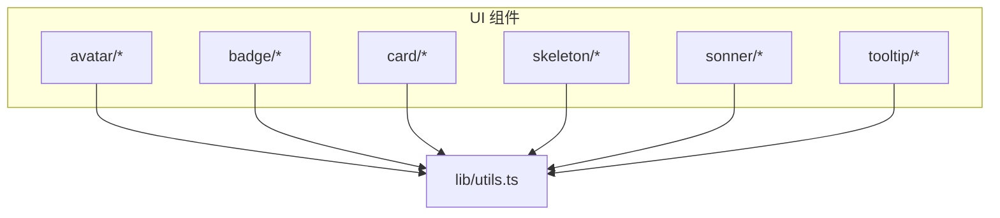
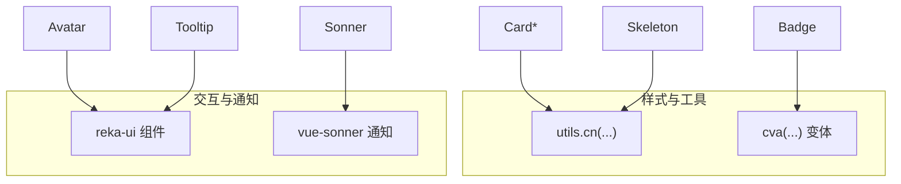
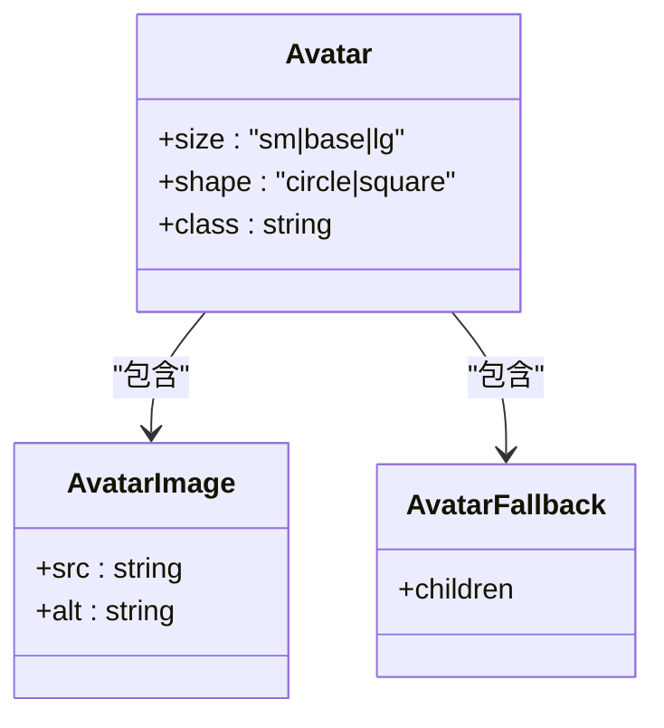
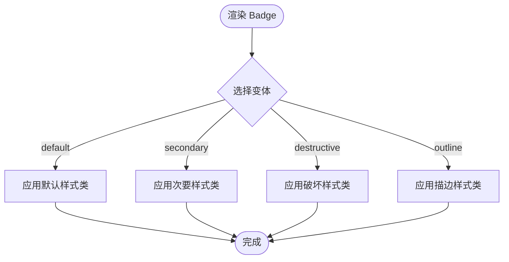
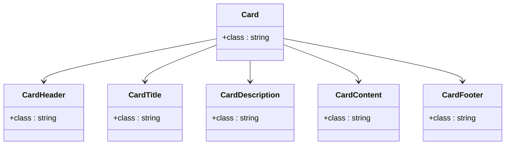
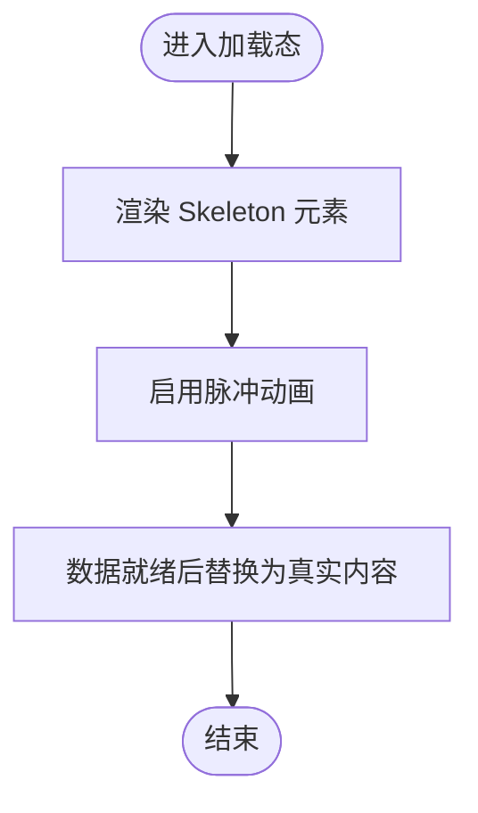
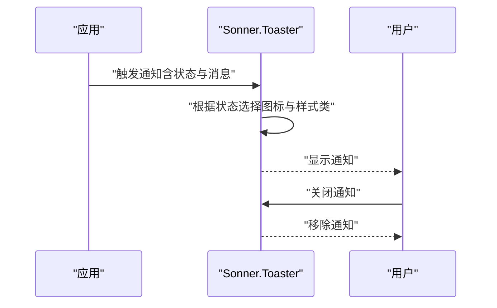
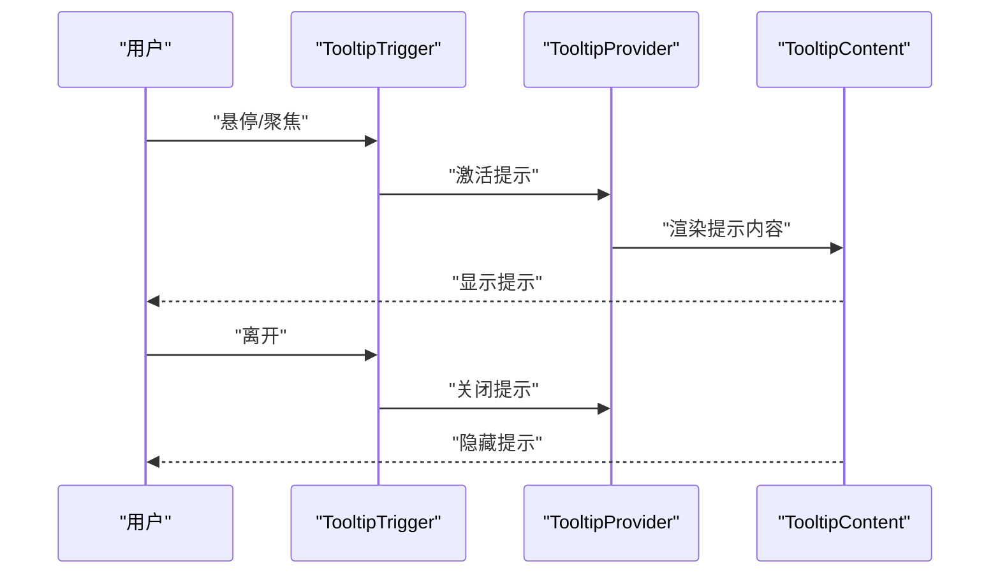
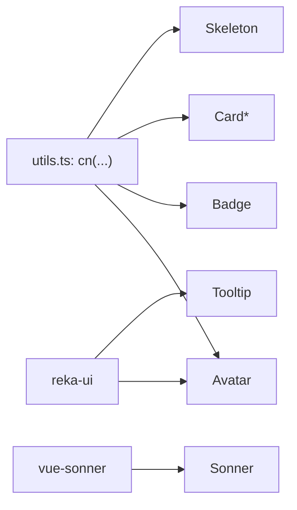

# 反馈组件

<cite>
**本文引用的文件**
- [Avatar.vue](file://src/renderer/src/components/ui/avatar/Avatar.vue)
- [AvatarFallback.vue](file://src/renderer/src/components/ui/avatar/AvatarFallback.vue)
- [AvatarImage.vue](file://src/renderer/src/components/ui/avatar/AvatarImage.vue)
- [avatar/index.ts](file://src/renderer/src/components/ui/avatar/index.ts)
- [Badge.vue](file://src/renderer/src/components/ui/badge/Badge.vue)
- [badge/index.ts](file://src/renderer/src/components/ui/badge/index.ts)
- [Card.vue](file://src/renderer/src/components/ui/card/Card.vue)
- [CardContent.vue](file://src/renderer/src/components/ui/card/CardContent.vue)
- [CardDescription.vue](file://src/renderer/src/components/ui/card/CardDescription.vue)
- [CardFooter.vue](file://src/renderer/src/components/ui/card/CardFooter.vue)
- [CardHeader.vue](file://src/renderer/src/components/ui/card/CardHeader.vue)
- [CardTitle.vue](file://src/renderer/src/components/ui/card/CardTitle.vue)
- [card/index.ts](file://src/renderer/src/components/ui/card/index.ts)
- [Skeleton.vue](file://src/renderer/src/components/ui/skeleton/Skeleton.vue)
- [skeleton/index.ts](file://src/renderer/src/components/ui/skeleton/index.ts)
- [Sonner.vue](file://src/renderer/src/components/ui/sonner/Sonner.vue)
- [sonner/index.ts](file://src/renderer/src/components/ui/sonner/index.ts)
- [Tooltip.vue](file://src/renderer/src/components/ui/tooltip/Tooltip.vue)
- [tooltip/index.ts](file://src/renderer/src/components/ui/tooltip/index.ts)
- [utils.ts](file://src/renderer/src/lib/utils.ts)
</cite>

## 目录
1. [简介](#简介)
2. [项目结构](#项目结构)
3. [核心组件](#核心组件)
4. [架构总览](#架构总览)
5. [详细组件分析](#详细组件分析)
6. [依赖分析](#依赖分析)
7. [性能考虑](#性能考虑)
8. [故障排除指南](#故障排除指南)
9. [结论](#结论)
10. [附录](#附录)

## 简介
本文件系统化梳理 AutoOps 的反馈组件体系，覆盖设计理念、用户体验与信息传达方式，并对各组件的属性、事件、使用场景进行说明。重点包括头像、徽章、卡片、骨架屏、通知（Sonner）、气泡提示（Tooltip）等。文档同时涵盖加载态、成功/失败/警告提示、用户反馈的实现细节，提供通知系统、气泡提示与占位符的使用示例，解释动画与过渡效果，并给出无障碍访问与屏幕阅读器兼容性建议。

## 项目结构
反馈组件位于渲染端 UI 组件目录中，采用按功能域分层组织：每个组件以独立文件夹存放，统一通过 index.ts 暴露入口；公共样式与工具函数集中于 lib/utils.ts。组件间通过 reka-ui、vue-sonner 等外部库实现交互与视觉状态管理。

图示来源
- [utils.ts:1-8](file://src/renderer/src/lib/utils.ts#L1-L8)
- [avatar/index.ts:1-26](file://src/renderer/src/components/ui/avatar/index.ts#L1-L26)
- [badge/index.ts:1-27](file://src/renderer/src/components/ui/badge/index.ts#L1-L27)
- [card/index.ts:1-7](file://src/renderer/src/components/ui/card/index.ts#L1-L7)
- [skeleton/index.ts:1-2](file://src/renderer/src/components/ui/skeleton/index.ts#L1-L2)
- [sonner/index.ts:1-2](file://src/renderer/src/components/ui/sonner/index.ts#L1-L2)
- [tooltip/index.ts:1-5](file://src/renderer/src/components/ui/tooltip/index.ts#L1-L5)

章节来源
- [utils.ts:1-8](file://src/renderer/src/lib/utils.ts#L1-L8)
- [avatar/index.ts:1-26](file://src/renderer/src/components/ui/avatar/index.ts#L1-L26)
- [badge/index.ts:1-27](file://src/renderer/src/components/ui/badge/index.ts#L1-L27)
- [card/index.ts:1-7](file://src/renderer/src/components/ui/card/index.ts#L1-L7)
- [skeleton/index.ts:1-2](file://src/renderer/src/components/ui/skeleton/index.ts#L1-L2)
- [sonner/index.ts:1-2](file://src/renderer/src/components/ui/sonner/index.ts#L1-L2)
- [tooltip/index.ts:1-5](file://src/renderer/src/components/ui/tooltip/index.ts#L1-L5)

## 核心组件
- 头像（Avatar）
  - 设计理念：提供可配置尺寸与形状的头像容器，支持图片与占位内容，强调可访问性与一致性。
  - 关键属性：size（sm/base/lg）、shape（circle/square）、自定义类名。
  - 使用场景：用户资料、团队成员列表、操作者标识。
  - 事件：由底层 reka-ui 提供，组件本身透传属性与事件。
- 徽章（Badge）
  - 设计理念：用于标签化信息展示，强调语义与层级（默认/次要/破坏/描边）。
  - 关键属性：variant（default/secondary/destructive/outline）、自定义类名。
  - 使用场景：状态标签、优先级、类型分类。
- 卡片（Card）
  - 设计理念：承载复杂信息区块，配合标题、描述、内容与页脚，形成清晰的信息层次。
  - 子组件：CardHeader、CardTitle、CardDescription、CardContent、CardFooter。
  - 使用场景：任务详情、设置项、统计面板。
- 骨架屏（Skeleton）
  - 设计理念：在数据加载时提供占位反馈，提升感知速度与可用性。
  - 关键属性：自定义类名。
  - 使用场景：列表加载、异步数据渲染前。
- 通知（Sonner）
  - 设计理念：全局通知系统，内置成功/信息/警告/错误/加载图标与样式类映射。
  - 关键属性：继承 vue-sonner 的 ToasterProps，支持自定义 toast 样式与图标模板。
  - 使用场景：任务执行结果、系统提示、操作反馈。
- 气泡提示（Tooltip）
  - 设计理念：轻量上下文提示，基于 Provider/Trigger/Content 组合，支持延迟与定位。
  - 关键属性：透传 reka-ui TooltipRootProps，事件透传。
  - 使用场景：按钮/图标辅助说明、快捷键提示。

章节来源
- [Avatar.vue:1-23](file://src/renderer/src/components/ui/avatar/Avatar.vue#L1-L23)
- [AvatarFallback.vue:1-13](file://src/renderer/src/components/ui/avatar/AvatarFallback.vue#L1-L13)
- [AvatarImage.vue:1-13](file://src/renderer/src/components/ui/avatar/AvatarImage.vue#L1-L13)
- [avatar/index.ts:1-26](file://src/renderer/src/components/ui/avatar/index.ts#L1-L26)
- [Badge.vue:1-18](file://src/renderer/src/components/ui/badge/Badge.vue#L1-L18)
- [badge/index.ts:1-27](file://src/renderer/src/components/ui/badge/index.ts#L1-L27)
- [Card.vue:1-22](file://src/renderer/src/components/ui/card/Card.vue#L1-L22)
- [CardContent.vue:1-15](file://src/renderer/src/components/ui/card/CardContent.vue#L1-L15)
- [CardDescription.vue:1-15](file://src/renderer/src/components/ui/card/CardDescription.vue#L1-L15)
- [CardFooter.vue:1-15](file://src/renderer/src/components/ui/card/CardFooter.vue#L1-L15)
- [CardHeader.vue:1-15](file://src/renderer/src/components/ui/card/CardHeader.vue#L1-L15)
- [CardTitle.vue:1-19](file://src/renderer/src/components/ui/card/CardTitle.vue#L1-L19)
- [card/index.ts:1-7](file://src/renderer/src/components/ui/card/index.ts#L1-L7)
- [Skeleton.vue:1-18](file://src/renderer/src/components/ui/skeleton/Skeleton.vue#L1-L18)
- [skeleton/index.ts:1-2](file://src/renderer/src/components/ui/skeleton/index.ts#L1-L2)
- [Sonner.vue:1-48](file://src/renderer/src/components/ui/sonner/Sonner.vue#L1-L48)
- [sonner/index.ts:1-2](file://src/renderer/src/components/ui/sonner/index.ts#L1-L2)
- [Tooltip.vue:1-16](file://src/renderer/src/components/ui/tooltip/Tooltip.vue#L1-L16)
- [tooltip/index.ts:1-5](file://src/renderer/src/components/ui/tooltip/index.ts#L1-L5)

## 架构总览
反馈组件围绕“可组合 + 变体 + 工具函数”的模式构建：通过 cva 定义变体样式，使用 cn 合并类名，借助 reka-ui 与 vue-sonner 实现交互与通知能力。整体架构强调低耦合、高内聚与一致的视觉语言。

图示来源
- [utils.ts:1-8](file://src/renderer/src/lib/utils.ts#L1-L8)
- [avatar/index.ts:1-26](file://src/renderer/src/components/ui/avatar/index.ts#L1-L26)
- [badge/index.ts:1-27](file://src/renderer/src/components/ui/badge/index.ts#L1-L27)
- [card/index.ts:1-7](file://src/renderer/src/components/ui/card/index.ts#L1-L7)
- [skeleton/index.ts:1-2](file://src/renderer/src/components/ui/skeleton/index.ts#L1-L2)
- [Sonner.vue:1-48](file://src/renderer/src/components/ui/sonner/Sonner.vue#L1-L48)
- [Tooltip.vue:1-16](file://src/renderer/src/components/ui/tooltip/Tooltip.vue#L1-L16)

## 详细组件分析

### 头像（Avatar）组件族
- 组件构成
  - Avatar：根容器，支持 size 与 shape 变体。
  - AvatarImage：承载头像图片，使用对象填充策略。
  - AvatarFallback：占位内容，当图片未加载或失败时显示。
- 设计要点
  - 通过 cva 定义尺寸与形状变体，保证视觉一致性。
  - 透传属性与事件，便于上层组合使用。
- 使用场景
  - 用户头像展示、任务执行者标识、成员列表。
- 无障碍与可访问性
  - 图片加载失败时应确保占位内容具备可读性；必要时提供 alt 文本或替代文案。
- 动画与过渡
  - 头像切换可通过外部过渡类实现平滑过渡，避免闪烁。

图示来源
- [Avatar.vue:1-23](file://src/renderer/src/components/ui/avatar/Avatar.vue#L1-L23)
- [AvatarImage.vue:1-13](file://src/renderer/src/components/ui/avatar/AvatarImage.vue#L1-L13)
- [AvatarFallback.vue:1-13](file://src/renderer/src/components/ui/avatar/AvatarFallback.vue#L1-L13)
- [avatar/index.ts:1-26](file://src/renderer/src/components/ui/avatar/index.ts#L1-L26)

章节来源
- [Avatar.vue:1-23](file://src/renderer/src/components/ui/avatar/Avatar.vue#L1-L23)
- [AvatarImage.vue:1-13](file://src/renderer/src/components/ui/avatar/AvatarImage.vue#L1-L13)
- [AvatarFallback.vue:1-13](file://src/renderer/src/components/ui/avatar/AvatarFallback.vue#L1-L13)
- [avatar/index.ts:1-26](file://src/renderer/src/components/ui/avatar/index.ts#L1-L26)

### 徽章（Badge）组件
- 设计理念
  - 通过变体区分语义层级，支持默认、次要、破坏、描边四种风格。
- 属性与事件
  - 属性：variant、class。
  - 事件：由底层组件透传。
- 使用场景
  - 状态标签（如进行中/已完成）、优先级、类型分类。

图示来源
- [badge/index.ts:1-27](file://src/renderer/src/components/ui/badge/index.ts#L1-L27)
- [Badge.vue:1-18](file://src/renderer/src/components/ui/badge/Badge.vue#L1-L18)

章节来源
- [Badge.vue:1-18](file://src/renderer/src/components/ui/badge/Badge.vue#L1-L18)
- [badge/index.ts:1-27](file://src/renderer/src/components/ui/badge/index.ts#L1-L27)

### 卡片（Card）组件族
- 设计理念
  - 以 Card 为核心容器，配合 Header/Title/Description/Content/Footer 形成完整信息区块。
- 属性与事件
  - 所有子组件均支持 class 自定义。
- 使用场景
  - 任务详情、设置项、统计面板、对话框内容区。

图示来源
- [Card.vue:1-22](file://src/renderer/src/components/ui/card/Card.vue#L1-L22)
- [CardHeader.vue:1-15](file://src/renderer/src/components/ui/card/CardHeader.vue#L1-L15)
- [CardTitle.vue:1-19](file://src/renderer/src/components/ui/card/CardTitle.vue#L1-L19)
- [CardDescription.vue:1-15](file://src/renderer/src/components/ui/card/CardDescription.vue#L1-L15)
- [CardContent.vue:1-15](file://src/renderer/src/components/ui/card/CardContent.vue#L1-L15)
- [CardFooter.vue:1-15](file://src/renderer/src/components/ui/card/CardFooter.vue#L1-L15)

章节来源
- [Card.vue:1-22](file://src/renderer/src/components/ui/card/Card.vue#L1-L22)
- [CardHeader.vue:1-15](file://src/renderer/src/components/ui/card/CardHeader.vue#L1-L15)
- [CardTitle.vue:1-19](file://src/renderer/src/components/ui/card/CardTitle.vue#L1-L19)
- [CardDescription.vue:1-15](file://src/renderer/src/components/ui/card/CardDescription.vue#L1-L15)
- [CardContent.vue:1-15](file://src/renderer/src/components/ui/card/CardContent.vue#L1-L15)
- [CardFooter.vue:1-15](file://src/renderer/src/components/ui/card/CardFooter.vue#L1-L15)
- [card/index.ts:1-7](file://src/renderer/src/components/ui/card/index.ts#L1-L7)

### 骨架屏（Skeleton）
- 设计理念
  - 通过脉冲动画与浅色背景模拟加载态，降低感知等待时间。
- 属性与事件
  - 属性：class。
- 使用场景
  - 列表项、卡片内容、异步数据渲染前的占位。

图示来源
- [Skeleton.vue:1-18](file://src/renderer/src/components/ui/skeleton/Skeleton.vue#L1-L18)
- [skeleton/index.ts:1-2](file://src/renderer/src/components/ui/skeleton/index.ts#L1-L2)

章节来源
- [Skeleton.vue:1-18](file://src/renderer/src/components/ui/skeleton/Skeleton.vue#L1-L18)
- [skeleton/index.ts:1-2](file://src/renderer/src/components/ui/skeleton/index.ts#L1-L2)

### 通知（Sonner）
- 设计理念
  - 基于 vue-sonner 的全局通知系统，内置多种图标与样式类映射，支持成功/信息/警告/错误/加载等状态。
- 属性与事件
  - 属性：继承 ToasterProps，通过 toastOptions 自定义样式类。
  - 插槽：success-icon、info-icon、warning-icon、error-icon、loading-icon、close-icon。
- 使用场景
  - 任务执行结果提示、系统消息、用户操作反馈。
- 动画与过渡
  - 加载态使用旋转动画；通知入场/离场可通过框架提供的过渡类实现。

图示来源
- [Sonner.vue:1-48](file://src/renderer/src/components/ui/sonner/Sonner.vue#L1-L48)
- [sonner/index.ts:1-2](file://src/renderer/src/components/ui/sonner/index.ts#L1-L2)

章节来源
- [Sonner.vue:1-48](file://src/renderer/src/components/ui/sonner/Sonner.vue#L1-L48)
- [sonner/index.ts:1-2](file://src/renderer/src/components/ui/sonner/index.ts#L1-L2)

### 气泡提示（Tooltip）
- 设计理念
  - 轻量上下文提示，通过 Provider/Trigger/Content 组合实现，支持延迟与定位。
- 属性与事件
  - 属性：透传 reka-ui TooltipRootProps；事件：透传 emits。
- 使用场景
  - 按钮/图标辅助说明、快捷键提示、复杂表单字段说明。

图示来源
- [Tooltip.vue:1-16](file://src/renderer/src/components/ui/tooltip/Tooltip.vue#L1-L16)
- [tooltip/index.ts:1-5](file://src/renderer/src/components/ui/tooltip/index.ts#L1-L5)

章节来源
- [Tooltip.vue:1-16](file://src/renderer/src/components/ui/tooltip/Tooltip.vue#L1-L16)
- [tooltip/index.ts:1-5](file://src/renderer/src/components/ui/tooltip/index.ts#L1-L5)

## 依赖分析
- 内部依赖
  - 所有组件均依赖 utils.ts 中的 cn 函数进行类名合并，确保样式一致性与可维护性。
- 外部依赖
  - reka-ui：提供 Avatar、Tooltip 等交互基础组件。
  - vue-sonner：提供全局通知系统。
- 变体系统
  - 通过 class-variance-authority 定义变体，Badge 与 Avatar 均采用该模式，提升可扩展性。

图示来源
- [utils.ts:1-8](file://src/renderer/src/lib/utils.ts#L1-L8)
- [avatar/index.ts:1-26](file://src/renderer/src/components/ui/avatar/index.ts#L1-L26)
- [badge/index.ts:1-27](file://src/renderer/src/components/ui/badge/index.ts#L1-L27)
- [card/index.ts:1-7](file://src/renderer/src/components/ui/card/index.ts#L1-L7)
- [skeleton/index.ts:1-2](file://src/renderer/src/components/ui/skeleton/index.ts#L1-L2)
- [Sonner.vue:1-48](file://src/renderer/src/components/ui/sonner/Sonner.vue#L1-L48)
- [Tooltip.vue:1-16](file://src/renderer/src/components/ui/tooltip/Tooltip.vue#L1-L16)

章节来源
- [utils.ts:1-8](file://src/renderer/src/lib/utils.ts#L1-L8)
- [avatar/index.ts:1-26](file://src/renderer/src/components/ui/avatar/index.ts#L1-L26)
- [badge/index.ts:1-27](file://src/renderer/src/components/ui/badge/index.ts#L1-L27)
- [card/index.ts:1-7](file://src/renderer/src/components/ui/card/index.ts#L1-L7)
- [skeleton/index.ts:1-2](file://src/renderer/src/components/ui/skeleton/index.ts#L1-L2)
- [Sonner.vue:1-48](file://src/renderer/src/components/ui/sonner/Sonner.vue#L1-L48)
- [Tooltip.vue:1-16](file://src/renderer/src/components/ui/tooltip/Tooltip.vue#L1-L16)

## 性能考虑
- 渲染开销
  - Skeleton 仅渲染占位元素，避免真实内容的重排与重绘。
  - Tooltip 在未激活时不渲染内容，减少 DOM 节点数量。
- 动画与过渡
  - Skeleton 使用轻量脉冲动画；Sonner 的加载图标使用简单旋转动画，避免复杂计算。
- 样式合并
  - 通过 cn 合并类名，减少重复样式与冲突，提升渲染效率。

## 故障排除指南
- 头像图片不显示
  - 检查 AvatarImage 的 src 是否有效；在 AvatarFallback 中提供可读的占位内容。
- 徽章样式异常
  - 确认 variant 值在允许范围内；检查自定义 class 是否覆盖了关键样式。
- 卡片内容溢出
  - 使用 CardContent 控制内边距与布局；必要时在外层容器添加滚动条。
- 骨架屏闪烁
  - 确保在数据就绪后及时替换为真实内容，避免长时间保持 Skeleton。
- 通知不显示或样式错乱
  - 检查 Toaster 的 toastOptions 类名映射是否正确；确认 vue-sonner 版本兼容性。
- 气泡提示不出现
  - 确认 TooltipProvider 已包裹 TooltipTrigger；检查触发事件与延迟设置。

章节来源
- [AvatarImage.vue:1-13](file://src/renderer/src/components/ui/avatar/AvatarImage.vue#L1-L13)
- [AvatarFallback.vue:1-13](file://src/renderer/src/components/ui/avatar/AvatarFallback.vue#L1-L13)
- [Badge.vue:1-18](file://src/renderer/src/components/ui/badge/Badge.vue#L1-L18)
- [CardContent.vue:1-15](file://src/renderer/src/components/ui/card/CardContent.vue#L1-L15)
- [Skeleton.vue:1-18](file://src/renderer/src/components/ui/skeleton/Skeleton.vue#L1-L18)
- [Sonner.vue:1-48](file://src/renderer/src/components/ui/sonner/Sonner.vue#L1-L48)
- [Tooltip.vue:1-16](file://src/renderer/src/components/ui/tooltip/Tooltip.vue#L1-L16)

## 结论
AutoOps 的反馈组件体系以“可组合 + 变体 + 工具函数”为核心，结合 reka-ui 与 vue-sonner 提供一致且高效的交互体验。通过 Skeleton、Badge、Card、Avatar、Tooltip、Sonner 等组件，能够覆盖从加载态到操作反馈的全链路用户感知。建议在实际应用中遵循变体规范、合理使用动画与过渡，并关注无障碍与可访问性，以提升整体用户体验。

## 附录
- 无障碍与屏幕阅读器兼容性建议
  - 为图标与装饰性元素提供替代文本或隐藏处理；为交互元素提供明确的焦点状态与键盘导航支持。
  - 在 Tooltip 中使用 aria-label 或 aria-describedby 提升可读性。
  - 在通知中提供可读的文本描述与关闭按钮的可访问性标签。
- 实际使用场景示例（路径指引）
  - 任务状态显示：在 Card 中展示任务标题与描述，使用 Badge 表示状态，Skeleton 作为加载占位。
  - 操作反馈：通过 Sonner 显示成功/失败/警告/信息/加载通知，结合 Tooltip 提供上下文说明。
  - 用户反馈：使用 Avatar 展示执行者头像，AvatarFallback 保障图片加载失败时的可读性。