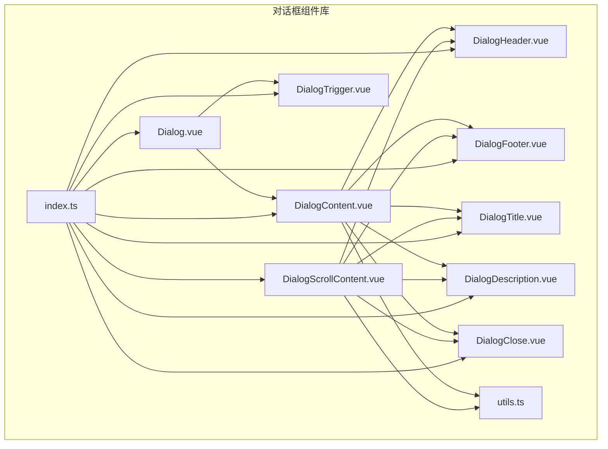
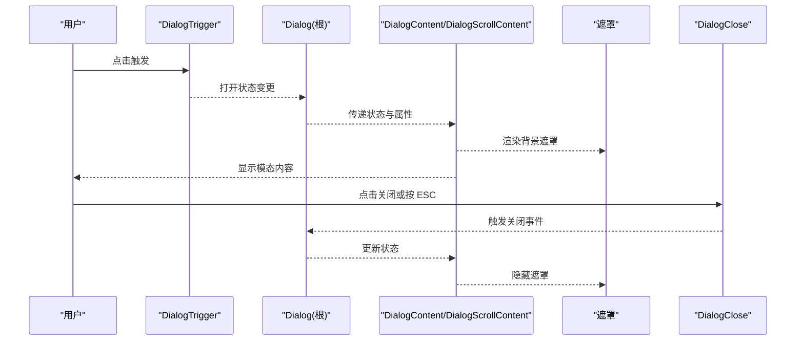
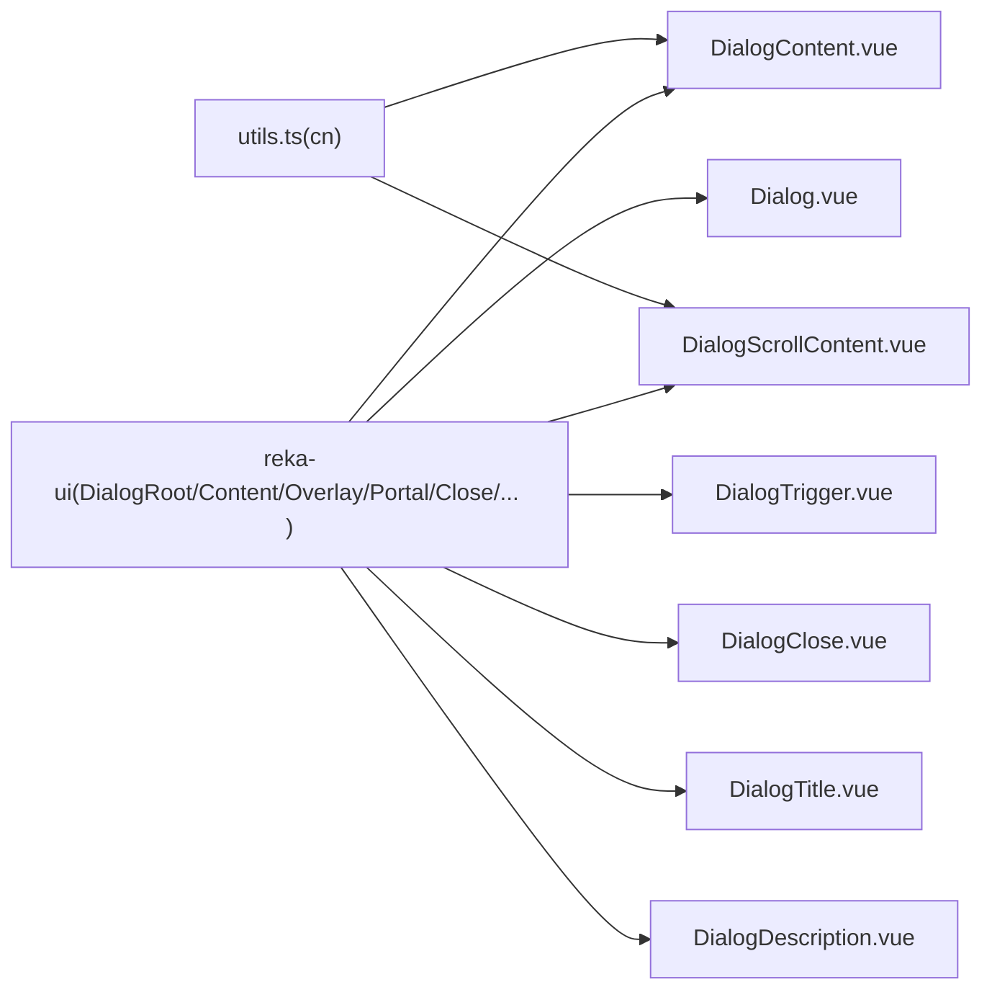

# 对话框组件

<cite>
**本文引用的文件**
- [Dialog.vue](file://src/renderer/src/components/ui/dialog/Dialog.vue)
- [DialogContent.vue](file://src/renderer/src/components/ui/dialog/DialogContent.vue)
- [DialogHeader.vue](file://src/renderer/src/components/ui/dialog/DialogHeader.vue)
- [DialogFooter.vue](file://src/renderer/src/components/ui/dialog/DialogFooter.vue)
- [DialogTrigger.vue](file://src/renderer/src/components/ui/dialog/DialogTrigger.vue)
- [DialogTitle.vue](file://src/renderer/src/components/ui/dialog/DialogTitle.vue)
- [DialogDescription.vue](file://src/renderer/src/components/ui/dialog/DialogDescription.vue)
- [DialogClose.vue](file://src/renderer/src/components/ui/dialog/DialogClose.vue)
- [DialogScrollContent.vue](file://src/renderer/src/components/ui/dialog/DialogScrollContent.vue)
- [index.ts](file://src/renderer/src/components/ui/dialog/index.ts)
- [utils.ts](file://src/renderer/src/lib/utils.ts)
- [accounts.vue](file://src/renderer/src/pages/accounts.vue)
- [tasks.vue](file://src/renderer/src/pages/tasks.vue)
</cite>

## 目录
1. [简介](#简介)
2. [项目结构](#项目结构)
3. [核心组件](#核心组件)
4. [架构总览](#架构总览)
5. [详细组件分析](#详细组件分析)
6. [依赖关系分析](#依赖关系分析)
7. [性能与可访问性](#性能与可访问性)
8. [使用示例与最佳实践](#使用示例与最佳实践)
9. [故障排查指南](#故障排查指南)
10. [结论](#结论)

## 简介
本文件系统化梳理 AutoOps 的对话框组件体系，基于 reka-ui 提供的语义化组件进行二次封装，覆盖模态窗口行为、键盘导航、焦点管理、背景遮罩、尺寸与位置变体、生命周期与内存清理、以及无障碍（ARIA）支持。文档同时给出表单提交、确认操作等常见场景的实践路径与参考示例。

## 项目结构
对话框组件位于渲染进程 UI 组件库目录下，采用按功能分层的组织方式：根容器负责状态桥接，内容容器负责布局与动画，头部/尾部用于结构化内容，触发器与关闭按钮提供交互入口，工具函数提供样式合并能力。

**图表来源**
- [index.ts:1-10](file://src/renderer/src/components/ui/dialog/index.ts#L1-L10)
- [Dialog.vue:1-16](file://src/renderer/src/components/ui/dialog/Dialog.vue#L1-L16)
- [DialogContent.vue:1-47](file://src/renderer/src/components/ui/dialog/DialogContent.vue#L1-L47)
- [DialogScrollContent.vue:1-56](file://src/renderer/src/components/ui/dialog/DialogScrollContent.vue#L1-L56)
- [DialogHeader.vue:1-17](file://src/renderer/src/components/ui/dialog/DialogHeader.vue#L1-L17)
- [DialogFooter.vue:1-20](file://src/renderer/src/components/ui/dialog/DialogFooter.vue#L1-L20)
- [DialogTitle.vue:1-28](file://src/renderer/src/components/ui/dialog/DialogTitle.vue#L1-L28)
- [DialogDescription.vue:1-23](file://src/renderer/src/components/ui/dialog/DialogDescription.vue#L1-L23)
- [DialogTrigger.vue:1-13](file://src/renderer/src/components/ui/dialog/DialogTrigger.vue#L1-L13)
- [DialogClose.vue:1-13](file://src/renderer/src/components/ui/dialog/DialogClose.vue#L1-L13)
- [utils.ts:1-8](file://src/renderer/src/lib/utils.ts#L1-L8)

**章节来源**
- [index.ts:1-10](file://src/renderer/src/components/ui/dialog/index.ts#L1-L10)
- [utils.ts:1-8](file://src/renderer/src/lib/utils.ts#L1-L8)

## 核心组件
- Dialog：根容器，透传 reka-ui 的 DialogRoot，仅做属性与事件转发，保持语义化与可组合性。
- DialogContent：模态内容主体，内置遮罩、动画、定位与关闭按钮；提供固定尺寸与滚动变体。
- DialogHeader/DialogFooter：内容区结构化容器，分别用于标题/描述区域与底部操作区。
- DialogTrigger：触发器，绑定到任意可点击元素以打开对话框。
- DialogTitle/DialogDescription：标题与描述，配合无障碍属性使用。
- DialogClose：关闭按钮，支持键盘操作与无障碍读屏。
- DialogScrollContent：滚动型内容容器，适配长内容场景，增强外部点击关闭策略。

上述组件均通过 reka-ui 的原生属性与事件进行桥接，确保行为一致性与可扩展性。

**章节来源**
- [Dialog.vue:1-16](file://src/renderer/src/components/ui/dialog/Dialog.vue#L1-L16)
- [DialogContent.vue:1-47](file://src/renderer/src/components/ui/dialog/DialogContent.vue#L1-L47)
- [DialogHeader.vue:1-17](file://src/renderer/src/components/ui/dialog/DialogHeader.vue#L1-L17)
- [DialogFooter.vue:1-20](file://src/renderer/src/components/ui/dialog/DialogFooter.vue#L1-L20)
- [DialogTrigger.vue:1-13](file://src/renderer/src/components/ui/dialog/DialogTrigger.vue#L1-L13)
- [DialogTitle.vue:1-28](file://src/renderer/src/components/ui/dialog/DialogTitle.vue#L1-L28)
- [DialogDescription.vue:1-23](file://src/renderer/src/components/ui/dialog/DialogDescription.vue#L1-L23)
- [DialogClose.vue:1-13](file://src/renderer/src/components/ui/dialog/DialogClose.vue#L1-L13)
- [DialogScrollContent.vue:1-56](file://src/renderer/src/components/ui/dialog/DialogScrollContent.vue#L1-L56)

## 架构总览
对话框系统遵循“容器-内容-结构-触发”的分层设计，通过 Portal 渲染遮罩与内容，结合动画类与定位类实现开合过渡与居中显示。组件间通过 props 与 emits 进行数据与事件传递，利用工具函数统一处理样式合并。

**图表来源**
- [DialogTrigger.vue:1-13](file://src/renderer/src/components/ui/dialog/DialogTrigger.vue#L1-L13)
- [Dialog.vue:1-16](file://src/renderer/src/components/ui/dialog/Dialog.vue#L1-L16)
- [DialogContent.vue:23-46](file://src/renderer/src/components/ui/dialog/DialogContent.vue#L23-L46)
- [DialogScrollContent.vue:23-55](file://src/renderer/src/components/ui/dialog/DialogScrollContent.vue#L23-L55)
- [DialogClose.vue:1-13](file://src/renderer/src/components/ui/dialog/DialogClose.vue#L1-L13)

## 详细组件分析

### Dialog（根容器）
- 职责：作为 reka-ui DialogRoot 的轻量包装，负责属性与事件的转发，保证上层调用的一致性。
- 关键点：使用 useForwardPropsEmits 将父级传入的 props 与 emits 原样传递给底层组件，避免额外逻辑侵入。

**章节来源**
- [Dialog.vue:1-16](file://src/renderer/src/components/ui/dialog/Dialog.vue#L1-L16)

### DialogContent（固定尺寸模态）
- 职责：承载对话框主体，内置遮罩与动画，提供关闭按钮与定位类。
- 样式与定位：通过定位类使内容在视口中心显示，结合动画类实现开合过渡。
- 事件处理：透传所有原生事件，确保与 reka-ui 行为一致。
- 可选类名：支持通过 class 属性追加自定义样式，内部使用工具函数进行合并。

**章节来源**
- [DialogContent.vue:1-47](file://src/renderer/src/components/ui/dialog/DialogContent.vue#L1-L47)
- [utils.ts:1-8](file://src/renderer/src/lib/utils.ts#L1-L8)

### DialogScrollContent（滚动型模态）
- 职责：适用于长内容场景，提供滚动容器与更灵活的遮罩布局。
- 特性：在遮罩层使用网格布局实现居中，内容容器支持滚动；对“外部点击”有特殊处理以避免误关。
- 事件处理：对 pointerdown 外部点击事件进行拦截判断，仅在点击空白区域时阻止默认关闭行为。

**章节来源**
- [DialogScrollContent.vue:1-56](file://src/renderer/src/components/ui/dialog/DialogScrollContent.vue#L1-L56)

### DialogHeader/DialogFooter（结构化容器）
- DialogHeader：纵向布局，适合标题与描述的垂直排列，支持响应式对齐。
- DialogFooter：底部操作区，默认反向堆叠，小屏向下、大屏向右对齐，便于放置确认/取消按钮。

**章节来源**
- [DialogHeader.vue:1-17](file://src/renderer/src/components/ui/dialog/DialogHeader.vue#L1-L17)
- [DialogFooter.vue:1-20](file://src/renderer/src/components/ui/dialog/DialogFooter.vue#L1-L20)

### DialogTrigger（触发器）
- 职责：将任意元素（如按钮）转换为打开对话框的触发器，透传所有原生属性。
- 使用建议：通常包裹在按钮或链接内，配合 Dialog 根容器使用。

**章节来源**
- [DialogTrigger.vue:1-13](file://src/renderer/src/components/ui/dialog/DialogTrigger.vue#L1-L13)

### DialogTitle/DialogDescription（语义化标题与描述）
- 职责：为对话框提供标题与描述，配合无障碍读屏使用。
- 实现：通过 useForwardProps 将 props 转发至底层组件，内部使用工具函数合并类名。

**章节来源**
- [DialogTitle.vue:1-28](file://src/renderer/src/components/ui/dialog/DialogTitle.vue#L1-L28)
- [DialogDescription.vue:1-23](file://src/renderer/src/components/ui/dialog/DialogDescription.vue#L1-L23)
- [utils.ts:1-8](file://src/renderer/src/lib/utils.ts#L1-L8)

### DialogClose（关闭按钮）
- 职责：提供显式的关闭入口，支持键盘聚焦与无障碍读屏。
- 实现：直接透传至底层组件，内部包含不可见文本用于读屏识别。

**章节来源**
- [DialogClose.vue:1-13](file://src/renderer/src/components/ui/dialog/DialogClose.vue#L1-L13)

## 依赖关系分析
- 组件依赖：所有子组件均依赖 reka-ui 的对应原生组件与工具方法；根容器依赖 DialogRoot；内容容器依赖 Portal、Overlay、Content、Close。
- 工具依赖：cn 工具函数统一处理 Tailwind 类名合并，避免冲突。
- 导出结构：index.ts 汇总导出全部对话框相关组件，便于上层页面按需引入。

**图表来源**
- [Dialog.vue:1-16](file://src/renderer/src/components/ui/dialog/Dialog.vue#L1-L16)
- [DialogContent.vue:1-47](file://src/renderer/src/components/ui/dialog/DialogContent.vue#L1-L47)
- [DialogScrollContent.vue:1-56](file://src/renderer/src/components/ui/dialog/DialogScrollContent.vue#L1-L56)
- [DialogTrigger.vue:1-13](file://src/renderer/src/components/ui/dialog/DialogTrigger.vue#L1-L13)
- [DialogClose.vue:1-13](file://src/renderer/src/components/ui/dialog/DialogClose.vue#L1-L13)
- [DialogTitle.vue:1-28](file://src/renderer/src/components/ui/dialog/DialogTitle.vue#L1-L28)
- [DialogDescription.vue:1-23](file://src/renderer/src/components/ui/dialog/DialogDescription.vue#L1-L23)
- [utils.ts:1-8](file://src/renderer/src/lib/utils.ts#L1-L8)

**章节来源**
- [index.ts:1-10](file://src/renderer/src/components/ui/dialog/index.ts#L1-L10)

## 性能与可访问性
- 动画与渲染：内容容器使用数据状态驱动的动画类，开合时自动应用进入/退出动画，减少手动控制复杂度。
- 焦点管理：依赖 reka-ui 的焦点管理机制，首次打开时自动将焦点置于可聚焦元素；关闭时恢复原焦点。
- 键盘导航：支持 ESC 关闭；在滚动型内容中，外部点击关闭策略避免误触导致的频繁关闭。
- 无障碍支持：标题与描述组件配合底层语义化标签；关闭按钮包含不可见文本，确保读屏可读。
- 内存清理：组件随根容器卸载而销毁，遮罩与内容在关闭后移除 DOM，避免内存泄漏。

[本节为通用指导，不直接分析具体文件，故无“章节来源”]

## 使用示例与最佳实践

### 基础打开/关闭流程
- 步骤：在页面中引入 Dialog 相关组件，使用 DialogTrigger 包裹按钮，将 DialogContent 放置在需要的位置，内部可嵌套 DialogHeader、DialogTitle、DialogDescription、DialogFooter、DialogClose。
- 参考路径：
  - [accounts.vue:17-24](file://src/renderer/src/pages/accounts.vue#L17-L24)
  - [tasks.vue:13-21](file://src/renderer/src/pages/tasks.vue#L13-L21)

**章节来源**
- [accounts.vue:17-24](file://src/renderer/src/pages/accounts.vue#L17-L24)
- [tasks.vue:13-21](file://src/renderer/src/pages/tasks.vue#L13-L21)

### 不同尺寸与位置
- 固定尺寸：使用 DialogContent，内部网格布局与最大宽度类控制尺寸，适合中等体量的信息展示与简单表单。
- 滚动型：使用 DialogScrollContent，适合长内容或复杂表单，遮罩层使用网格居中，内容容器支持滚动。
- 位置：内容容器通过定位类固定在视口中心，无需额外定位属性即可实现水平垂直居中。

**章节来源**
- [DialogContent.vue:23-46](file://src/renderer/src/components/ui/dialog/DialogContent.vue#L23-L46)
- [DialogScrollContent.vue:23-55](file://src/renderer/src/components/ui/dialog/DialogScrollContent.vue#L23-L55)

### 键盘导航与焦点管理
- 首次打开：焦点自动进入对话框内首个可聚焦元素。
- ESC 关闭：支持键盘 ESC 快捷键关闭。
- 外部点击：滚动型内容对 pointerdown 外部点击进行判断，避免误关。

**章节来源**
- [DialogScrollContent.vue:36-42](file://src/renderer/src/components/ui/dialog/DialogScrollContent.vue#L36-L42)

### 背景遮罩与动画
- 遮罩：DialogOverlay 在 Portal 中渲染，覆盖整个视口，支持开合动画。
- 动画：通过数据状态类实现进入/退出动画，包括淡入淡出、缩放与位移。

**章节来源**
- [DialogContent.vue:25-27](file://src/renderer/src/components/ui/dialog/DialogContent.vue#L25-L27)
- [DialogScrollContent.vue:25-26](file://src/renderer/src/components/ui/dialog/DialogScrollContent.vue#L25-L26)

### 生命周期与内存清理
- 卸载即清理：对话框关闭后，遮罩与内容容器从 DOM 中移除，避免残留节点造成内存占用。
- 状态同步：根容器与内容容器通过 reka-ui 的状态同步机制，确保关闭时联动清理。

**章节来源**
- [Dialog.vue:1-16](file://src/renderer/src/components/ui/dialog/Dialog.vue#L1-L16)
- [DialogContent.vue:23-46](file://src/renderer/src/components/ui/dialog/DialogContent.vue#L23-L46)
- [DialogScrollContent.vue:23-55](file://src/renderer/src/components/ui/dialog/DialogScrollContent.vue#L23-L55)

### 无障碍访问（ARIA 与读屏）
- 标题与描述：使用 DialogTitle 与 DialogDescription 提供语义化标签。
- 关闭按钮：包含不可见文本，确保读屏可读。
- 焦点与键盘：依赖底层库的无障碍实现，无需额外配置。

**章节来源**
- [DialogTitle.vue:16-26](file://src/renderer/src/components/ui/dialog/DialogTitle.vue#L16-L26)
- [DialogDescription.vue:16-21](file://src/renderer/src/components/ui/dialog/DialogDescription.vue#L16-L21)
- [DialogClose.vue:1-13](file://src/renderer/src/components/ui/dialog/DialogClose.vue#L1-L13)

### 常见场景示例（路径指引）
- 表单提交：在 DialogContent 内部放置表单控件与提交按钮，使用 DialogFooter 放置确认/取消按钮。
- 确认操作：使用 DialogTrigger 触发，内容中展示确认文案与操作按钮，关闭后执行业务逻辑。
- 长内容详情：使用 DialogScrollContent 承载滚动详情页，避免内容溢出。

[本节为场景说明，不直接分析具体文件，故无“章节来源”]

## 故障排查指南
- 打不开或无法关闭：检查是否正确包裹在 Dialog 根容器内，确认 DialogTrigger 是否生效，以及是否存在事件被拦截的情况。
- 焦点异常：确认内容容器内存在可聚焦元素；若无，可手动添加一个隐藏的聚焦锚点。
- 外部点击误关：滚动型内容已内置外部点击判断逻辑，如仍出现误关，检查事件冒泡与容器层级。
- 样式冲突：使用工具函数合并类名，避免重复覆盖；必要时通过 class 属性追加样式。

**章节来源**
- [DialogScrollContent.vue:36-42](file://src/renderer/src/components/ui/dialog/DialogScrollContent.vue#L36-L42)
- [utils.ts:1-8](file://src/renderer/src/lib/utils.ts#L1-L8)

## 结论
AutoOps 的对话框组件体系以 reka-ui 为基础，通过轻量封装实现了高可用的模态窗口能力：良好的开合动画、稳定的焦点管理、完善的键盘与无障碍支持，以及灵活的内容布局与尺寸变体。结合页面中的实际使用路径，开发者可以快速构建表单、确认与详情等常见交互场景。