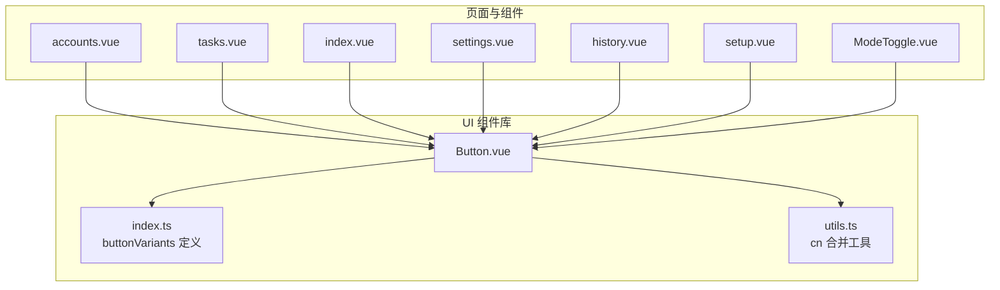
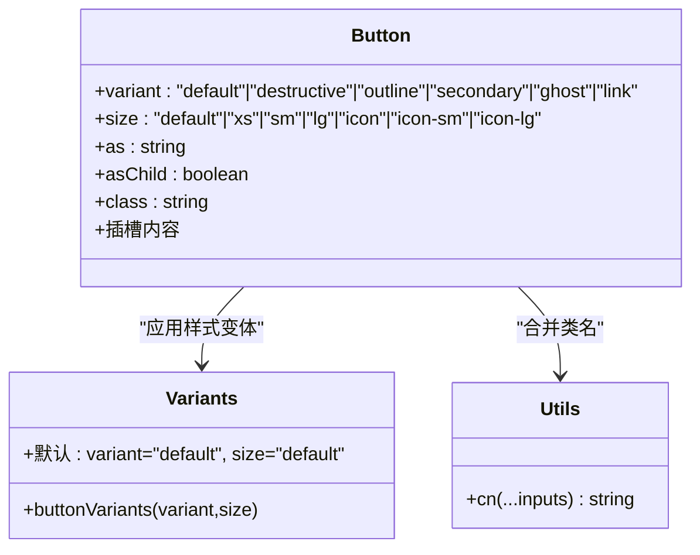
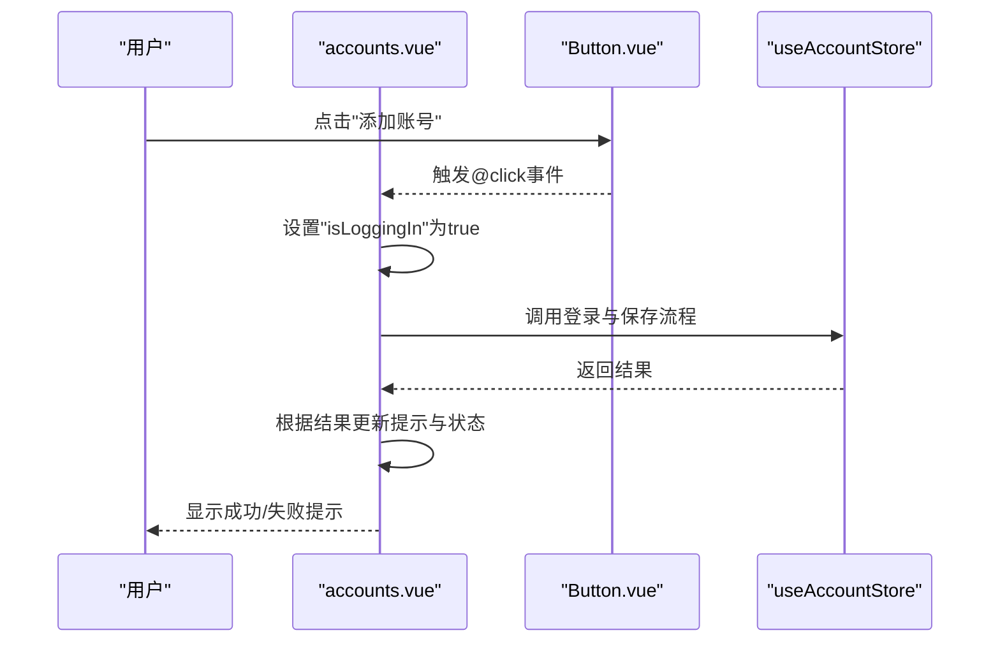
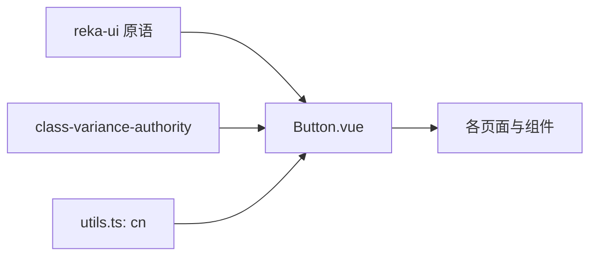

# 按钮组件

<cite>
**本文引用的文件**
- [Button.vue](file://src/renderer/src/components/ui/button/Button.vue)
- [index.ts](file://src/renderer/src/components/ui/button/index.ts)
- [utils.ts](file://src/renderer/src/lib/utils.ts)
- [accounts.vue](file://src/renderer/src/pages/accounts.vue)
- [tasks.vue](file://src/renderer/src/pages/tasks.vue)
- [index.vue](file://src/renderer/src/pages/index.vue)
- [settings.vue](file://src/renderer/src/pages/settings.vue)
- [history.vue](file://src/renderer/src/pages/history.vue)
- [setup.vue](file://src/renderer/src/pages/setup.vue)
- [ModeToggle.vue](file://src/renderer/src/components/ModeToggle.vue)
</cite>

## 目录
1. [简介](#简介)
2. [项目结构](#项目结构)
3. [核心组件](#核心组件)
4. [架构概览](#架构概览)
5. [详细组件分析](#详细组件分析)
6. [依赖关系分析](#依赖关系分析)
7. [性能考虑](#性能考虑)
8. [故障排除指南](#故障排除指南)
9. [结论](#结论)
10. [附录](#附录)

## 简介
本文件为 AutoOps 的按钮组件提供完整的技术文档。该组件基于 reka-ui 的原语组件与 class-variance-authority 的变体系统实现，具备可组合的视觉变体与尺寸体系，并通过 Tailwind CSS 实现一致的主题风格。文档涵盖设计理念、视觉外观、交互行为、属性说明、事件回调、插槽使用、无障碍支持、键盘导航、状态变化与加载处理、样式定制与主题适配，以及在不同业务场景中的使用示例。

## 项目结构
按钮组件位于渲染端 UI 组件库中，采用按功能分层的组织方式：
- 组件定义：Button.vue
- 变体与尺寸：index.ts 中的 buttonVariants
- 工具函数：utils.ts 中的 cn 合并工具
- 使用示例：多处页面与组件中导入并使用

**图表来源**
- [Button.vue:1-29](file://src/renderer/src/components/ui/button/Button.vue#L1-L29)
- [index.ts:1-39](file://src/renderer/src/components/ui/button/index.ts#L1-L39)
- [utils.ts:1-8](file://src/renderer/src/lib/utils.ts#L1-L8)
- [accounts.vue:1-200](file://src/renderer/src/pages/accounts.vue#L1-L200)
- [tasks.vue:1-200](file://src/renderer/src/pages/tasks.vue#L1-L200)
- [index.vue:1-200](file://src/renderer/src/pages/index.vue#L1-L200)
- [settings.vue:1-165](file://src/renderer/src/pages/settings.vue#L1-L165)
- [history.vue:1-102](file://src/renderer/src/pages/history.vue#L1-L102)
- [setup.vue:235-245](file://src/renderer/src/pages/setup.vue#L235-L245)
- [ModeToggle.vue:1-17](file://src/renderer/src/components/ModeToggle.vue#L1-L17)

**章节来源**
- [Button.vue:1-29](file://src/renderer/src/components/ui/button/Button.vue#L1-L29)
- [index.ts:1-39](file://src/renderer/src/components/ui/button/index.ts#L1-L39)
- [utils.ts:1-8](file://src/renderer/src/lib/utils.ts#L1-L8)

## 核心组件
- 组件名称：Button
- 组件类型：基于 reka-ui 的原语组件，支持 as/asChild 属性以渲染为任意 HTML 标签或子元素
- 主要职责：
  - 应用变体与尺寸样式
  - 支持插槽内容
  - 透传原生按钮行为（禁用、聚焦、点击等）

关键特性：
- 变体（variant）：default、destructive、outline、secondary、ghost、link
- 尺寸（size）：default、xs、sm、lg、icon、icon-sm、icon-lg
- 默认变体与尺寸：default/default
- 状态类：禁用、聚焦可见轮廓与外圈光晕、图标嵌套样式约束

**章节来源**
- [Button.vue:9-17](file://src/renderer/src/components/ui/button/Button.vue#L9-L17)
- [index.ts:6-36](file://src/renderer/src/components/ui/button/index.ts#L6-L36)

## 架构概览
按钮组件通过变体系统与工具函数实现样式合并，最终渲染到 DOM。其依赖关系如下：

**图表来源**
- [Button.vue:1-29](file://src/renderer/src/components/ui/button/Button.vue#L1-L29)
- [index.ts:6-36](file://src/renderer/src/components/ui/button/index.ts#L6-L36)
- [utils.ts:5-7](file://src/renderer/src/lib/utils.ts#L5-L7)

## 详细组件分析

### 设计理念与视觉外观
- 设计理念：以最小必要属性实现最大可组合性；通过变体与尺寸解耦视觉表现与交互语义。
- 视觉外观：
  - 默认态：强调色背景与阴影，悬停时轻微透明度变化
  - 危险态：破坏性动作的警示色彩与阴影
  - 描边态：背景透明、描边与输入色，悬停时强调色填充
  - 次要态：次级强调色与较小阴影
  - 幽灵态：仅悬停时改变背景与文字色
  - 链接态：下划线与强调色，适合内联操作
- 尺寸体系：覆盖文本按钮与多种图标尺寸，满足不同密度布局需求

**章节来源**
- [index.ts:9-30](file://src/renderer/src/components/ui/button/index.ts#L9-L30)

### 交互行为与事件回调
- 事件：支持原生按钮事件（如 onClick），由 reka-ui 原语组件透传
- 焦点与可访问性：内置焦点可见轮廓与外圈光晕，便于键盘导航
- 禁用态：禁用指针事件与不透明度，确保不可交互

**章节来源**
- [Button.vue:20-28](file://src/renderer/src/components/ui/button/Button.vue#L20-L28)
- [index.ts](file://src/renderer/src/components/ui/button/index.ts#L7)

### 属性与插槽
- 属性（Props）：
  - variant：变体类型
  - size：尺寸类型
  - as/asChild：渲染标签或作为子元素
  - class：额外自定义类名
- 插槽：默认插槽用于放置按钮内容（文本、图标、组合元素）

**章节来源**
- [Button.vue:9-17](file://src/renderer/src/components/ui/button/Button.vue#L9-L17)

### 不同变体与尺寸的使用示例
- 变体示例（来自页面与组件）：
  - primary：default（默认强调）
  - secondary：secondary（次要强调）
  - destructive：danger 操作（删除、清空等）
  - outline：边框样式（设置、返回等）
  - ghost：轻量交互（菜单项触发）
  - link：内联链接（设置页返回）
- 尺寸示例（来自页面与组件）：
  - lg：进入应用（setup 页面）
  - sm：下拉菜单触发（accounts 页面）
  - icon/icon-sm/icon-lg：模式切换、操作按钮（ModeToggle、index 页面卡片入口）

**章节来源**
- [accounts.vue:168-190](file://src/renderer/src/pages/accounts.vue#L168-L190)
- [accounts.vue:105-109](file://src/renderer/src/pages/accounts.vue#L105-L109)
- [index.vue:98-103](file://src/renderer/src/pages/index.vue#L98-L103)
- [settings.vue:72-72](file://src/renderer/src/pages/settings.vue#L72-L72)
- [settings.vue:137-139](file://src/renderer/src/pages/settings.vue#L137-L139)
- [history.vue:97-98](file://src/renderer/src/pages/history.vue#L97-L98)
- [setup.vue:237-240](file://src/renderer/src/pages/setup.vue#L237-L240)
- [ModeToggle.vue:9-16](file://src/renderer/src/components/ModeToggle.vue#L9-L16)

### 加载状态与状态变化
- 加载状态：通过插槽内条件渲染加载图标与文案，同时禁用按钮避免重复提交
- 状态变化：根据业务逻辑动态切换文案与图标，保持用户反馈一致

示例场景：
- 登录流程中显示“登录中...”并禁用按钮
- AI 设置测试中显示“测试中...”并禁用按钮

**章节来源**
- [accounts.vue:62-95](file://src/renderer/src/pages/accounts.vue#L62-L95)
- [accounts.vue:105-109](file://src/renderer/src/pages/accounts.vue#L105-L109)
- [settings.vue:50-64](file://src/renderer/src/pages/settings.vue#L50-L64)
- [settings.vue:137-139](file://src/renderer/src/pages/settings.vue#L137-L139)

### 样式定制与主题适配
- 主题适配：通过 Tailwind CSS 类与变体系统实现颜色与阴影的统一风格
- 自定义类名：通过 class 属性叠加自定义样式，cn 工具负责合并与冲突修复
- 图标一致性：变体规则中对 svg 子元素的尺寸与交互行为进行约束，保证视觉一致

**章节来源**
- [index.ts](file://src/renderer/src/components/ui/button/index.ts#L7)
- [utils.ts:5-7](file://src/renderer/src/lib/utils.ts#L5-L7)

### 无障碍访问与键盘导航
- 键盘可达：内置焦点可见轮廓与外圈光晕，支持键盘激活
- 屏幕阅读器友好：作为按钮原语渲染，语义清晰
- 禁用态处理：禁用时阻止交互，避免误触

**章节来源**
- [index.ts](file://src/renderer/src/components/ui/button/index.ts#L7)

### API 定义与调用序列
以下序列图展示了按钮在页面中的典型调用流程（以“添加账号”为例）：

**图表来源**
- [accounts.vue:62-95](file://src/renderer/src/pages/accounts.vue#L62-L95)
- [accounts.vue:105-109](file://src/renderer/src/pages/accounts.vue#L105-L109)
- [Button.vue:20-28](file://src/renderer/src/components/ui/button/Button.vue#L20-L28)

## 依赖关系分析
- 组件依赖：
  - Button 依赖 reka-ui 的原语组件以实现可组合的渲染能力
  - Button 依赖 utils.ts 的 cn 工具进行类名合并
  - Button 依赖 index.ts 的 buttonVariants 提供样式变体
- 页面与组件依赖：
  - 多个页面与组件导入 Button 并在不同场景中使用

**图表来源**
- [Button.vue:1-7](file://src/renderer/src/components/ui/button/Button.vue#L1-L7)
- [index.ts:1-2](file://src/renderer/src/components/ui/button/index.ts#L1-L2)
- [utils.ts:1-8](file://src/renderer/src/lib/utils.ts#L1-L8)

**章节来源**
- [Button.vue:1-7](file://src/renderer/src/components/ui/button/Button.vue#L1-L7)
- [index.ts:1-2](file://src/renderer/src/components/ui/button/index.ts#L1-L2)
- [utils.ts:1-8](file://src/renderer/src/lib/utils.ts#L1-L8)

## 性能考虑
- 样式计算：变体系统在编译期生成类名，运行时仅做类名拼接，开销极低
- 渲染策略：通过 as/asChild 控制渲染目标，避免不必要的包装元素
- 禁用态优化：禁用态通过 CSS 控制，减少事件监听器数量

[本节为通用指导，无需特定文件引用]

## 故障排除指南
- 按钮无响应
  - 检查是否处于禁用态（disabled）
  - 确认事件绑定正确且未被父容器阻止
- 样式异常
  - 确认未覆盖关键类名（如变体类）
  - 使用 cn 工具合并类名时注意顺序
- 图标不显示或尺寸异常
  - 确保图标作为子元素正确渲染
  - 遵循变体中对 svg 的尺寸与交互约束

**章节来源**
- [index.ts](file://src/renderer/src/components/ui/button/index.ts#L7)
- [utils.ts:5-7](file://src/renderer/src/lib/utils.ts#L5-L7)

## 结论
AutoOps 的按钮组件通过简洁的属性体系与强大的变体系统，实现了高可组合性与一致的视觉风格。结合 reka-ui 的原语能力与 Tailwind CSS 的主题适配，能够在不同业务场景中快速构建符合设计规范的交互元素。建议在使用时遵循变体与尺寸的最佳实践，并充分利用插槽与禁用态来提升用户体验与可访问性。

[本节为总结性内容，无需特定文件引用]

## 附录

### 属性与变体速查
- 变体（variant）
  - default：强调色背景
  - destructive：危险色背景
  - outline：描边背景
  - secondary：次要色背景
  - ghost：透明背景
  - link：链接样式
- 尺寸（size）
  - default：常规文本按钮
  - xs/sm/lg：不同高度与内边距
  - icon/icon-sm/icon-lg：正方形图标按钮

**章节来源**
- [index.ts:9-30](file://src/renderer/src/components/ui/button/index.ts#L9-L30)

### 在不同场景中的使用示例（路径）
- 登录与加载状态：accounts.vue
  - [handleLogin 与按钮禁用:62-95](file://src/renderer/src/pages/accounts.vue#L62-L95)
  - [按钮触发与加载图标:105-109](file://src/renderer/src/pages/accounts.vue#L105-L109)
- 新建任务与返回：index.vue
  - [新建任务按钮:98-103](file://src/renderer/src/pages/index.vue#L98-L103)
- 设置与测试：settings.vue
  - [返回按钮（outline）:72-72](file://src/renderer/src/pages/settings.vue#L72-L72)
  - [测试连接按钮（禁用态）:137-139](file://src/renderer/src/pages/settings.vue#L137-L139)
- 删除与清空：history.vue
  - [清空历史按钮（destructive）:97-98](file://src/renderer/src/pages/history.vue#L97-L98)
- 进入应用：setup.vue
  - [lg 尺寸按钮:237-240](file://src/renderer/src/pages/setup.vue#L237-L240)
- 模式切换：ModeToggle.vue
  - [outline + icon 尺寸:9-16](file://src/renderer/src/components/ModeToggle.vue#L9-L16)