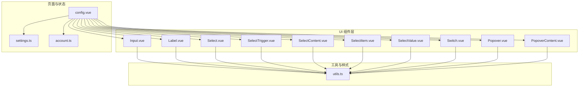
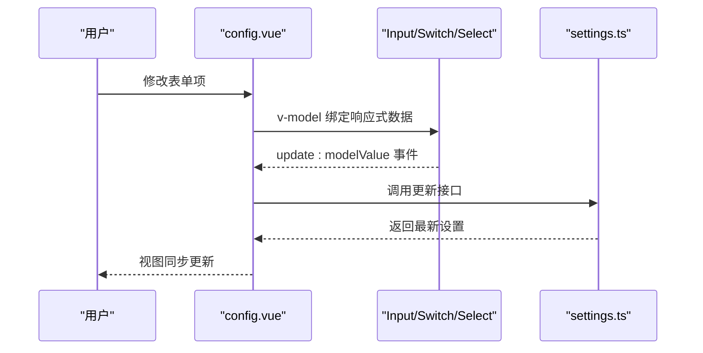
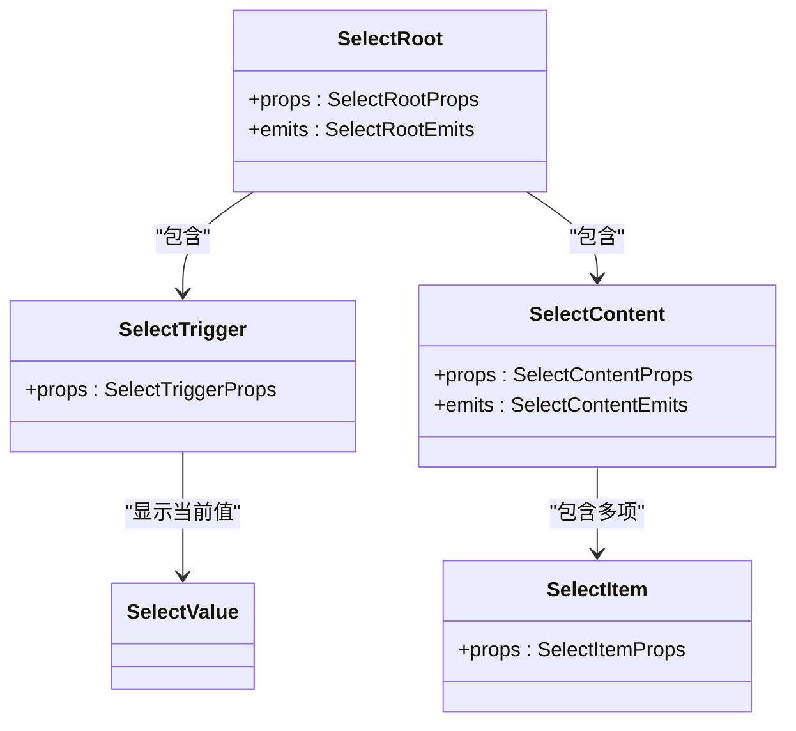
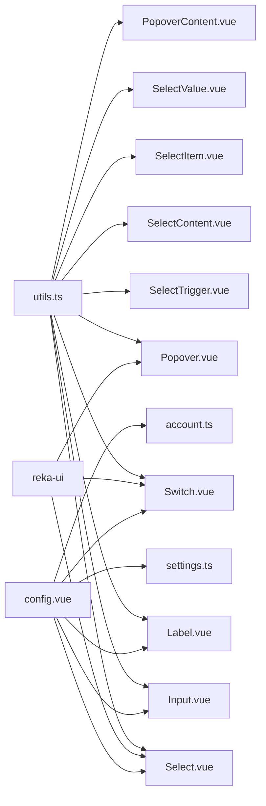

# 表单组件

<cite>
**本文引用的文件**
- [Input.vue](file://src/renderer/src/components/ui/input/Input.vue)
- [Label.vue](file://src/renderer/src/components/ui/label/Label.vue)
- [Select.vue](file://src/renderer/src/components/ui/select/Select.vue)
- [SelectContent.vue](file://src/renderer/src/components/ui/select/SelectContent.vue)
- [SelectItem.vue](file://src/renderer/src/components/ui/select/SelectItem.vue)
- [SelectTrigger.vue](file://src/renderer/src/components/ui/select/SelectTrigger.vue)
- [SelectValue.vue](file://src/renderer/src/components/ui/select/SelectValue.vue)
- [Switch.vue](file://src/renderer/src/components/ui/switch/Switch.vue)
- [Popover.vue](file://src/renderer/src/components/ui/popover/Popover.vue)
- [PopoverContent.vue](file://src/renderer/src/components/ui/popover/PopoverContent.vue)
- [utils.ts](file://src/renderer/src/lib/utils.ts)
- [config.vue](file://src/renderer/src/pages/config.vue)
- [settings.ts](file://src/renderer/src/stores/settings.ts)
- [account.ts](file://src/renderer/src/stores/account.ts)
</cite>

## 目录
1. [简介](#简介)
2. [项目结构](#项目结构)
3. [核心组件](#核心组件)
4. [架构总览](#架构总览)
5. [组件详解](#组件详解)
6. [依赖关系分析](#依赖关系分析)
7. [性能与可访问性](#性能与可访问性)
8. [故障排查指南](#故障排查指南)
9. [结论](#结论)
10. [附录：常见应用示例](#附录常见应用示例)

## 简介
本文件系统化梳理 AutoOps 的表单组件体系，覆盖设计理念、数据绑定模式、用户输入处理、验证与错误提示、必填与格式化、状态管理、提交与重置流程，并补充无障碍与键盘操作要点。同时给出配置表单、搜索表单等典型场景的实践路径与参考位置。

## 项目结构
AutoOps 的 UI 组件基于 reka-ui 进行封装，统一通过工具函数合并样式类，形成一致的外观与交互体验。表单相关组件集中在 src/renderer/src/components/ui 下，页面级表单示例位于 src/renderer/src/pages。

图示来源
- [Input.vue:1-34](file://src/renderer/src/components/ui/input/Input.vue#L1-L34)
- [Label.vue:1-26](file://src/renderer/src/components/ui/label/Label.vue#L1-L26)
- [Select.vue:1-16](file://src/renderer/src/components/ui/select/Select.vue#L1-L16)
- [SelectTrigger.vue:1-30](file://src/renderer/src/components/ui/select/SelectTrigger.vue#L1-L30)
- [SelectContent.vue:1-50](file://src/renderer/src/components/ui/select/SelectContent.vue#L1-L50)
- [SelectItem.vue:1-42](file://src/renderer/src/components/ui/select/SelectItem.vue#L1-L42)
- [SelectValue.vue:1-13](file://src/renderer/src/components/ui/select/SelectValue.vue#L1-L13)
- [Switch.vue:1-36](file://src/renderer/src/components/ui/switch/Switch.vue#L1-L36)
- [Popover.vue:1-16](file://src/renderer/src/components/ui/popover/Popover.vue#L1-L16)
- [PopoverContent.vue:1-45](file://src/renderer/src/components/ui/popover/PopoverContent.vue#L1-L45)
- [utils.ts:1-8](file://src/renderer/src/lib/utils.ts#L1-L8)
- [config.vue:1-323](file://src/renderer/src/pages/config.vue#L1-L323)
- [settings.ts:1-46](file://src/renderer/src/stores/settings.ts#L1-L46)
- [account.ts:1-82](file://src/renderer/src/stores/account.ts#L1-L82)

章节来源
- [Input.vue:1-34](file://src/renderer/src/components/ui/input/Input.vue#L1-L34)
- [Label.vue:1-26](file://src/renderer/src/components/ui/label/Label.vue#L1-L26)
- [Select.vue:1-16](file://src/renderer/src/components/ui/select/Select.vue#L1-L16)
- [SelectContent.vue:1-50](file://src/renderer/src/components/ui/select/SelectContent.vue#L1-L50)
- [SelectItem.vue:1-42](file://src/renderer/src/components/ui/select/SelectItem.vue#L1-L42)
- [SelectTrigger.vue:1-30](file://src/renderer/src/components/ui/select/SelectTrigger.vue#L1-L30)
- [SelectValue.vue:1-13](file://src/renderer/src/components/ui/select/SelectValue.vue#L1-L13)
- [Switch.vue:1-36](file://src/renderer/src/components/ui/switch/Switch.vue#L1-L36)
- [Popover.vue:1-16](file://src/renderer/src/components/ui/popover/Popover.vue#L1-L16)
- [PopoverContent.vue:1-45](file://src/renderer/src/components/ui/popover/PopoverContent.vue#L1-L45)
- [utils.ts:1-8](file://src/renderer/src/lib/utils.ts#L1-L8)
- [config.vue:1-323](file://src/renderer/src/pages/config.vue#L1-L323)
- [settings.ts:1-46](file://src/renderer/src/stores/settings.ts#L1-L46)
- [account.ts:1-82](file://src/renderer/src/stores/account.ts#L1-L82)

## 核心组件
- 输入框 Input：基于 v-model 的受控组件，支持数字类型与字符串类型；通过 aria-invalid 实现错误态样式联动。
- 标签 Label：透传 reka-ui 的 Label，用于关联控件与可访问性语义。
- 选择器 Select：根组件与子组件组合，提供触发器、内容区、选项项与值占位，支持滚动按钮与弹出定位。
- 开关 Switch：基于 reka-ui 的开关控件，支持禁用、选中/未选中态样式。
- 弹出 Popover：提供弹出容器与内容区，支持对齐与偏移等属性。
- 工具函数 utils.cn：基于 clsx 与 tailwind-merge 合并样式类，保证冲突样式被正确覆盖。

章节来源
- [Input.vue:1-34](file://src/renderer/src/components/ui/input/Input.vue#L1-L34)
- [Label.vue:1-26](file://src/renderer/src/components/ui/label/Label.vue#L1-L26)
- [Select.vue:1-16](file://src/renderer/src/components/ui/select/Select.vue#L1-L16)
- [SelectContent.vue:1-50](file://src/renderer/src/components/ui/select/SelectContent.vue#L1-L50)
- [SelectItem.vue:1-42](file://src/renderer/src/components/ui/select/SelectItem.vue#L1-L42)
- [SelectTrigger.vue:1-30](file://src/renderer/src/components/ui/select/SelectTrigger.vue#L1-L30)
- [SelectValue.vue:1-13](file://src/renderer/src/components/ui/select/SelectValue.vue#L1-L13)
- [Switch.vue:1-36](file://src/renderer/src/components/ui/switch/Switch.vue#L1-L36)
- [Popover.vue:1-16](file://src/renderer/src/components/ui/popover/Popover.vue#L1-L16)
- [PopoverContent.vue:1-45](file://src/renderer/src/components/ui/popover/PopoverContent.vue#L1-L45)
- [utils.ts:1-8](file://src/renderer/src/lib/utils.ts#L1-L8)

## 架构总览
表单组件采用“轻封装 + 受控绑定”的设计：组件本身不直接持有状态，而是通过 v-model 与外部 store 或页面响应式数据进行双向绑定；验证与错误提示通过 aria 属性与样式类联动实现；页面通过 Pinia store 管理持久化设置与业务状态。

图示来源
- [config.vue:1-323](file://src/renderer/src/pages/config.vue#L1-L323)
- [settings.ts:1-46](file://src/renderer/src/stores/settings.ts#L1-L46)

## 组件详解

### Input 输入框
- 数据绑定
  - 使用 useVModel 将 props.modelValue 与 emit(update:modelValue) 统一为 v-model。
  - 支持 defaultValue 作为初始值，passive 模式避免非必要的同步。
- 样式与可访问性
  - 通过 aria-invalid 动态叠加错误态样式，结合 focus-visible-ring 提升可见性。
  - 默认类名包含尺寸、边框、阴影与禁用态处理。
- 事件
  - update:modelValue：当输入变化时向外发出新值。
- 适用场景
  - 文本输入、数值输入（配合 v-model.number）。

章节来源
- [Input.vue:1-34](file://src/renderer/src/components/ui/input/Input.vue#L1-L34)

### Label 标签
- 作用
  - 透传 reka-ui 的 Label，用于提升可访问性与点击激活关联控件。
- 扩展
  - 支持透传 class，便于主题化或布局微调。

章节来源
- [Label.vue:1-26](file://src/renderer/src/components/ui/label/Label.vue#L1-L26)

### Select 选择器
- 组件族
  - Select.vue：根容器，转发 props/emits。
  - SelectTrigger.vue：触发器，包含图标与文本占位。
  - SelectContent.vue：内容区，支持 popper 定位与滚动按钮。
  - SelectItem.vue：选项项，含选中指示器与文本。
  - SelectValue.vue：值占位，显示当前选中值。
- 数据绑定
  - 通过 reka-ui 的 SelectRoot/Trigger/Content 等组件完成 v-model 与 change 事件的桥接。
- 事件
  - 由 reka-ui 内部触发，外部通过 v-model 获取变更后的值。
- 适用场景
  - 单选、多选（通过 Select 组合项）。

图示来源
- [Select.vue:1-16](file://src/renderer/src/components/ui/select/Select.vue#L1-L16)
- [SelectTrigger.vue:1-30](file://src/renderer/src/components/ui/select/SelectTrigger.vue#L1-L30)
- [SelectContent.vue:1-50](file://src/renderer/src/components/ui/select/SelectContent.vue#L1-L50)
- [SelectItem.vue:1-42](file://src/renderer/src/components/ui/select/SelectItem.vue#L1-L42)
- [SelectValue.vue:1-13](file://src/renderer/src/components/ui/select/SelectValue.vue#L1-L13)

章节来源
- [Select.vue:1-16](file://src/renderer/src/components/ui/select/Select.vue#L1-L16)
- [SelectTrigger.vue:1-30](file://src/renderer/src/components/ui/select/SelectTrigger.vue#L1-L30)
- [SelectContent.vue:1-50](file://src/renderer/src/components/ui/select/SelectContent.vue#L1-L50)
- [SelectItem.vue:1-42](file://src/renderer/src/components/ui/select/SelectItem.vue#L1-L42)
- [SelectValue.vue:1-13](file://src/renderer/src/components/ui/select/SelectValue.vue#L1-L13)

### Switch 开关
- 数据绑定
  - 通过 reka-ui 的 SwitchRoot 与 SwitchThumb，结合 useForwardPropsEmits 保持与外部 v-model 的一致性。
- 样式
  - 选中/未选中态分别应用不同背景色，支持禁用态与焦点态。
- 事件
  - change 等由 reka-ui 触发，外部通过 v-model 接收状态变化。

章节来源
- [Switch.vue:1-36](file://src/renderer/src/components/ui/switch/Switch.vue#L1-L36)

### Popover 弹出
- 组件族
  - Popover.vue：根容器，转发 props/emits。
  - PopoverContent.vue：内容区，支持对齐与偏移，继承 attrs。
- 适用场景
  - 与 Select/Dialog 等组合，提供上下文菜单、提示信息等。

章节来源
- [Popover.vue:1-16](file://src/renderer/src/components/ui/popover/Popover.vue#L1-L16)
- [PopoverContent.vue:1-45](file://src/renderer/src/components/ui/popover/PopoverContent.vue#L1-L45)

### 样式工具函数 utils.cn
- 作用
  - 基于 clsx 与 tailwind-merge 合并类名，自动处理冲突与重复。
- 使用
  - 大量组件通过 cn(...) 组合默认类名与传入 class，确保主题与扩展的一致性。

章节来源
- [utils.ts:1-8](file://src/renderer/src/lib/utils.ts#L1-L8)

## 依赖关系分析
- 组件到工具
  - 所有 UI 组件均依赖 utils.ts 的 cn 函数进行类名合并。
- 组件到 reka-ui
  - Select、Switch、Popover 等组件直接使用 reka-ui 的根组件与子组件，通过 useForwardProps/Emits 保持对外接口一致。
- 页面到组件与状态
  - config.vue 通过 v-model 绑定 store 中的设置对象，实现配置表单的数据流闭环。
  - settings.ts 与 account.ts 提供加载、更新、重置等方法，支撑表单提交与重置。

图示来源
- [utils.ts:1-8](file://src/renderer/src/lib/utils.ts#L1-L8)
- [Input.vue:1-34](file://src/renderer/src/components/ui/input/Input.vue#L1-L34)
- [Label.vue:1-26](file://src/renderer/src/components/ui/label/Label.vue#L1-L26)
- [Select.vue:1-16](file://src/renderer/src/components/ui/select/Select.vue#L1-L16)
- [SelectTrigger.vue:1-30](file://src/renderer/src/components/ui/select/SelectTrigger.vue#L1-L30)
- [SelectContent.vue:1-50](file://src/renderer/src/components/ui/select/SelectContent.vue#L1-L50)
- [SelectItem.vue:1-42](file://src/renderer/src/components/ui/select/SelectItem.vue#L1-L42)
- [SelectValue.vue:1-13](file://src/renderer/src/components/ui/select/SelectValue.vue#L1-L13)
- [Switch.vue:1-36](file://src/renderer/src/components/ui/switch/Switch.vue#L1-L36)
- [Popover.vue:1-16](file://src/renderer/src/components/ui/popover/Popover.vue#L1-L16)
- [PopoverContent.vue:1-45](file://src/renderer/src/components/ui/popover/PopoverContent.vue#L1-L45)
- [config.vue:1-323](file://src/renderer/src/pages/config.vue#L1-L323)
- [settings.ts:1-46](file://src/renderer/src/stores/settings.ts#L1-L46)
- [account.ts:1-82](file://src/renderer/src/stores/account.ts#L1-L82)

章节来源
- [utils.ts:1-8](file://src/renderer/src/lib/utils.ts#L1-L8)
- [config.vue:1-323](file://src/renderer/src/pages/config.vue#L1-L323)
- [settings.ts:1-46](file://src/renderer/src/stores/settings.ts#L1-L46)
- [account.ts:1-82](file://src/renderer/src/stores/account.ts#L1-L82)

## 性能与可访问性
- 性能
  - 使用被动 v-model（passive: true）减少不必要的同步开销。
  - 通过 cn 合并类名，避免重复渲染无效样式。
- 可访问性与键盘操作
  - Input 通过 aria-invalid 与 focus-visible-ring 提升错误态与焦点态的可见性。
  - Select/Popover/Label 等组件复用 reka-ui 的可访问性语义与键盘导航能力。
- 建议
  - 对高频输入（如数值范围）建议使用 v-model.number 并在提交前做边界校验。
  - 对复杂表单建议拆分页签/步骤，降低一次性渲染压力。

[本节为通用指导，无需列出章节来源]

## 故障排查指南
- 输入框无响应
  - 检查是否正确使用 v-model 与 update:modelValue 事件链路。
  - 确认父组件响应式数据是否被正确更新。
- 错误态不显示
  - 确认是否通过 aria-invalid 控制样式类，以及是否在容器上应用了错误态样式。
- 选择器无法展开
  - 检查 SelectContent 的 position 与 Portal 是否正确渲染，以及触发器是否正确绑定。
- 提交后状态未刷新
  - 确认页面在提交后重新从 store 加载最新设置，或在提交成功后显式更新本地响应式数据。

章节来源
- [Input.vue:1-34](file://src/renderer/src/components/ui/input/Input.vue#L1-L34)
- [SelectContent.vue:1-50](file://src/renderer/src/components/ui/select/SelectContent.vue#L1-L50)
- [config.vue:1-323](file://src/renderer/src/pages/config.vue#L1-L323)
- [settings.ts:1-46](file://src/renderer/src/stores/settings.ts#L1-L46)

## 结论
AutoOps 的表单组件以 reka-ui 为基础，通过轻量封装与统一的样式工具，实现了高内聚、低耦合的 UI 体系。数据绑定采用 v-model 受控模式，结合 Pinia store 实现配置与状态管理，满足配置表单、设置面板等常见场景。通过 aria 属性与样式类联动，兼顾可用性与一致性。

[本节为总结，无需列出章节来源]

## 附录：常见应用示例

### 配置表单（任务设置）
- 场景说明
  - 在页面中使用 Input、Label、Switch、Select 等组件，通过 v-model 绑定 settings.store 中的设置对象，实现读取、编辑与提交。
- 关键点
  - 数字输入使用 v-model.number。
  - 通过 Tabs 分组展示不同设置区域。
  - 提交时调用 store.updateFeedAcSettings 并刷新视图。
- 参考位置
  - 页面：[config.vue:1-323](file://src/renderer/src/pages/config.vue#L1-L323)
  - 存储：[settings.ts:1-46](file://src/renderer/src/stores/settings.ts#L1-L46)

章节来源
- [config.vue:1-323](file://src/renderer/src/pages/config.vue#L1-L323)
- [settings.ts:1-46](file://src/renderer/src/stores/settings.ts#L1-L46)

### 搜索表单（账号管理）
- 场景说明
  - 账号管理页面虽然主要为表格与对话框，但可借鉴其“响应式数据 + v-model + store 更新”的模式构建搜索条件表单。
- 参考位置
  - 页面：[accounts.vue:1-203](file://src/renderer/src/pages/accounts.vue#L1-L203)
  - 存储：[account.ts:1-82](file://src/renderer/src/stores/account.ts#L1-L82)

章节来源
- [accounts.vue:1-203](file://src/renderer/src/pages/accounts.vue#L1-L203)
- [account.ts:1-82](file://src/renderer/src/stores/account.ts#L1-L82)

### 表单验证与错误提示（实现思路）
- 必填字段
  - 在提交时检查必填字段是否为空，若为空则在对应 Input 上设置 aria-invalid 并提示错误。
- 输入格式化
  - 数值范围使用 v-model.number，并在提交前校验区间合法性。
- 自定义验证器
  - 在页面逻辑中定义验证函数，返回布尔值与错误消息；根据结果动态设置 aria-invalid 与提示文案。
- 异步验证
  - 对远程唯一性检查等场景，在失焦或定时器中发起请求，成功后清除错误态，失败时设置错误态与提示。
- 参考位置
  - 输入组件：[Input.vue:1-34](file://src/renderer/src/components/ui/input/Input.vue#L1-L34)
  - 选择器组件：[Select.vue:1-16](file://src/renderer/src/components/ui/select/Select.vue#L1-L16)

章节来源
- [Input.vue:1-34](file://src/renderer/src/components/ui/input/Input.vue#L1-L34)
- [Select.vue:1-16](file://src/renderer/src/components/ui/select/Select.vue#L1-L16)

### 表单状态管理、提交与重置
- 状态管理
  - 使用 Pinia store 管理全局设置与账户状态，页面通过 store 方法读取与更新。
- 提交
  - 页面收集表单数据后调用 store.updateXxx 方法，必要时在提交成功后刷新本地数据。
- 重置
  - 提供 resetXxx 方法恢复默认值，或清空临时编辑态。
- 参考位置
  - 设置存储：[settings.ts:1-46](file://src/renderer/src/stores/settings.ts#L1-L46)
  - 账户存储：[account.ts:1-82](file://src/renderer/src/stores/account.ts#L1-L82)

章节来源
- [settings.ts:1-46](file://src/renderer/src/stores/settings.ts#L1-L46)
- [account.ts:1-82](file://src/renderer/src/stores/account.ts#L1-L82)