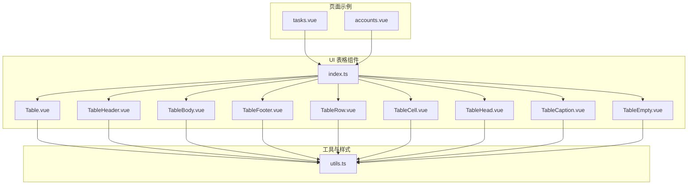
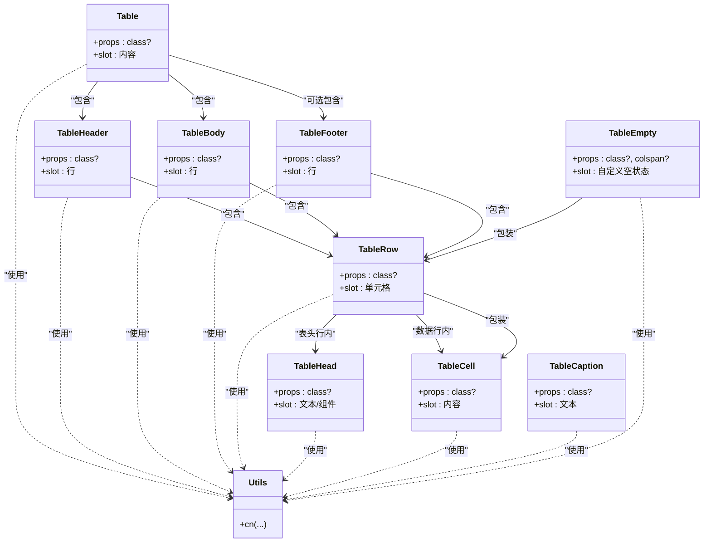
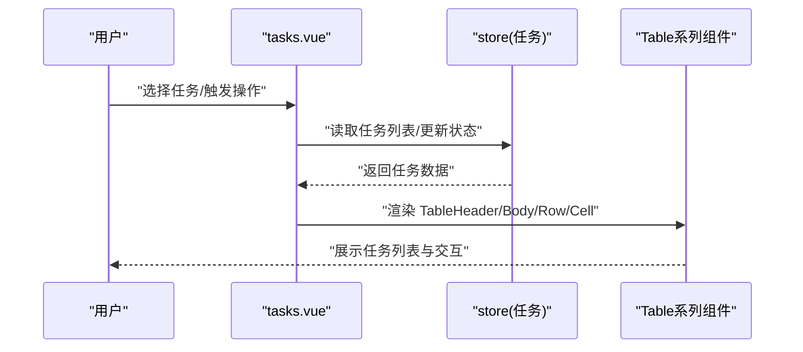
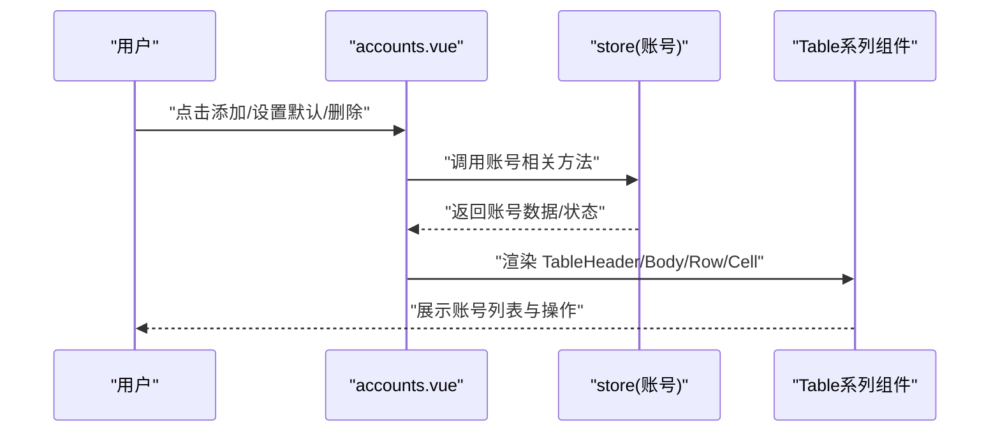
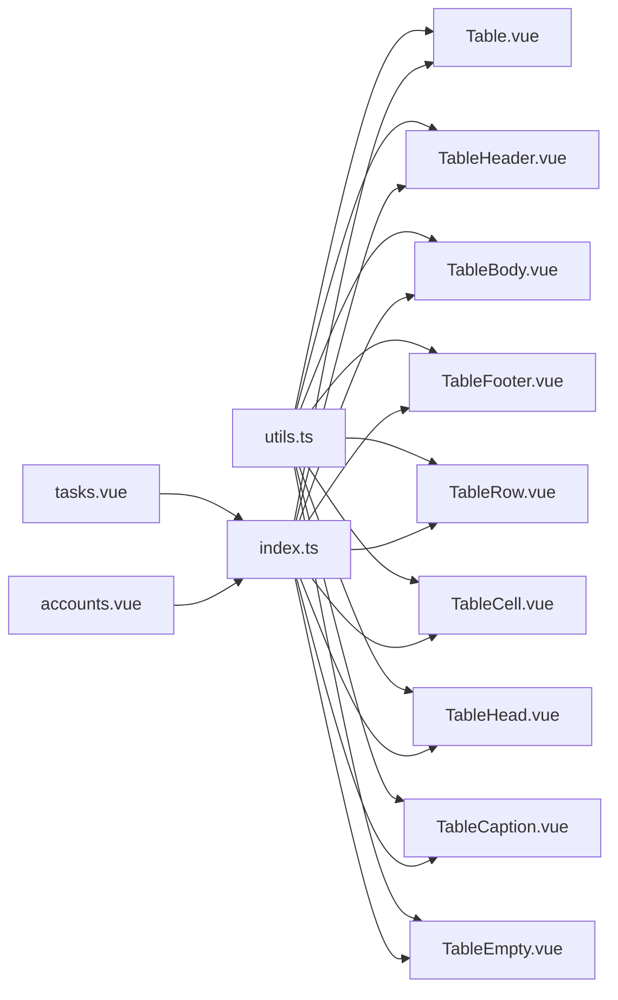

# 表格组件

<cite>
**本文引用的文件**
- [Table.vue](file://src/renderer/src/components/ui/table/Table.vue)
- [TableBody.vue](file://src/renderer/src/components/ui/table/TableBody.vue)
- [TableCaption.vue](file://src/renderer/src/components/ui/table/TableCaption.vue)
- [TableCell.vue](file://src/renderer/src/components/ui/table/TableCell.vue)
- [TableEmpty.vue](file://src/renderer/src/components/ui/table/TableEmpty.vue)
- [TableFooter.vue](file://src/renderer/src/components/ui/table/TableFooter.vue)
- [TableHead.vue](file://src/renderer/src/components/ui/table/TableHead.vue)
- [TableHeader.vue](file://src/renderer/src/components/ui/table/TableHeader.vue)
- [TableRow.vue](file://src/renderer/src/components/ui/table/TableRow.vue)
- [index.ts](file://src/renderer/src/components/ui/table/index.ts)
- [utils.ts](file://src/renderer/src/lib/utils.ts)
- [tasks.vue](file://src/renderer/src/pages/tasks.vue)
- [accounts.vue](file://src/renderer/src/pages/accounts.vue)
- [task.ts](file://src/shared/task.ts)
- [account.ts](file://src/shared/account.ts)
</cite>

## 目录
1. [简介](#简介)
2. [项目结构](#项目结构)
3. [核心组件](#核心组件)
4. [架构总览](#架构总览)
5. [详细组件分析](#详细组件分析)
6. [依赖关系分析](#依赖关系分析)
7. [性能考量](#性能考量)
8. [故障排查指南](#故障排查指南)
9. [结论](#结论)
10. [附录](#附录)

## 简介
本文件系统化梳理 AutoOps 的表格组件体系，覆盖设计理念、数据展示模式、用户交互行为、可访问性支持、空状态与加载状态处理，并结合任务列表与账号管理两大真实业务场景，给出可直接落地的使用建议与最佳实践。表格组件采用语义化 HTML 结构与 Tailwind CSS 类组合，通过轻量的 props 与插槽机制实现高扩展性与一致性。

## 项目结构
表格组件位于 UI 组件库目录下，采用按功能拆分的单文件组件组织方式；同时提供统一导出入口，便于在页面中按需引入。

**图表来源**
- [index.ts:1-10](file://src/renderer/src/components/ui/table/index.ts#L1-L10)
- [utils.ts:1-8](file://src/renderer/src/lib/utils.ts#L1-L8)
- [tasks.vue:30-36](file://src/renderer/src/pages/tasks.vue#L30-L36)
- [accounts.vue:8-15](file://src/renderer/src/pages/accounts.vue#L8-L15)

**章节来源**
- [index.ts:1-10](file://src/renderer/src/components/ui/table/index.ts#L1-L10)
- [utils.ts:1-8](file://src/renderer/src/lib/utils.ts#L1-L8)

## 核心组件
表格组件由一组语义化标签封装而成，提供容器、表头、表体、行、单元格、标题与空状态等能力。所有组件均支持通过 class 属性透传样式，内部使用工具函数进行类名合并，确保与主题一致的视觉表现。

- Table：表格容器，负责外层滚动与宽度适配，内部包裹 slot。
- TableHeader：表头区域，用于放置表头行。
- TableBody：表体区域，用于放置数据行。
- TableFooter：表尾区域，常用于统计行。
- TableRow：行元素，内置悬停与选中态样式。
- TableHead：表头单元格，内置对齐、字体与复选框适配。
- TableCell：数据单元格，内置内边距、对齐与复选框适配。
- TableCaption：表格标题，用于说明表格用途。
- TableEmpty：空状态行，支持跨列与插槽自定义内容。

**章节来源**
- [Table.vue:1-17](file://src/renderer/src/components/ui/table/Table.vue#L1-L17)
- [TableHeader.vue:1-15](file://src/renderer/src/components/ui/table/TableHeader.vue#L1-L15)
- [TableBody.vue:1-15](file://src/renderer/src/components/ui/table/TableBody.vue#L1-L15)
- [TableFooter.vue:1-15](file://src/renderer/src/components/ui/table/TableFooter.vue#L1-L15)
- [TableRow.vue:1-15](file://src/renderer/src/components/ui/table/TableRow.vue#L1-L15)
- [TableHead.vue:1-15](file://src/renderer/src/components/ui/table/TableHead.vue#L1-L15)
- [TableCell.vue:1-22](file://src/renderer/src/components/ui/table/TableCell.vue#L1-L22)
- [TableCaption.vue:1-15](file://src/renderer/src/components/ui/table/TableCaption.vue#L1-L15)
- [TableEmpty.vue:1-35](file://src/renderer/src/components/ui/table/TableEmpty.vue#L1-L35)

## 架构总览
表格组件遵循“容器-区域-行-单元格”的层级结构，通过 slot 插槽实现内容自由组合；组件间通过 props 与工具函数保持一致的样式策略与可扩展性。

**图表来源**
- [Table.vue:1-17](file://src/renderer/src/components/ui/table/Table.vue#L1-L17)
- [TableHeader.vue:1-15](file://src/renderer/src/components/ui/table/TableHeader.vue#L1-L15)
- [TableBody.vue:1-15](file://src/renderer/src/components/ui/table/TableBody.vue#L1-L15)
- [TableFooter.vue:1-15](file://src/renderer/src/components/ui/table/TableFooter.vue#L1-L15)
- [TableRow.vue:1-15](file://src/renderer/src/components/ui/table/TableRow.vue#L1-L15)
- [TableHead.vue:1-15](file://src/renderer/src/components/ui/table/TableHead.vue#L1-L15)
- [TableCell.vue:1-22](file://src/renderer/src/components/ui/table/TableCell.vue#L1-L22)
- [TableCaption.vue:1-15](file://src/renderer/src/components/ui/table/TableCaption.vue#L1-L15)
- [TableEmpty.vue:1-35](file://src/renderer/src/components/ui/table/TableEmpty.vue#L1-L35)
- [utils.ts:1-8](file://src/renderer/src/lib/utils.ts#L1-L8)

## 详细组件分析

### 组件属性与插槽规范
- 所有组件均支持可选 class 属性，用于透传额外样式。
- Table、TableHeader、TableBody、TableFooter、TableRow、TableHead、TableCell、TableCaption 均通过 slot 暴露内容插槽。
- TableEmpty 支持可选 colspan，默认为 1，内部通过行与单元格组合实现居中与留白。

**章节来源**
- [Table.vue:5-7](file://src/renderer/src/components/ui/table/Table.vue#L5-L7)
- [TableHeader.vue:5-7](file://src/renderer/src/components/ui/table/TableHeader.vue#L5-L7)
- [TableBody.vue:5-7](file://src/renderer/src/components/ui/table/TableBody.vue#L5-L7)
- [TableFooter.vue:5-7](file://src/renderer/src/components/ui/table/TableFooter.vue#L5-L7)
- [TableRow.vue:5-7](file://src/renderer/src/components/ui/table/TableRow.vue#L5-L7)
- [TableHead.vue:5-7](file://src/renderer/src/components/ui/table/TableHead.vue#L5-L7)
- [TableCell.vue:5-7](file://src/renderer/src/components/ui/table/TableCell.vue#L5-L7)
- [TableCaption.vue:5-7](file://src/renderer/src/components/ui/table/TableCaption.vue#L5-L7)
- [TableEmpty.vue:8-13](file://src/renderer/src/components/ui/table/TableEmpty.vue#L8-L13)

### 样式与可访问性
- 使用工具函数进行类名合并，保证与主题一致的视觉与间距。
- 表头单元格与包含复选框的单元格具备特定适配逻辑，确保复选框对齐与间距一致。
- 行元素提供悬停与选中态样式，便于交互反馈。

**章节来源**
- [utils.ts:5-7](file://src/renderer/src/lib/utils.ts#L5-L7)
- [TableCell.vue:11-17](file://src/renderer/src/components/ui/table/TableCell.vue#L11-L17)
- [TableHead.vue:11-11](file://src/renderer/src/components/ui/table/TableHead.vue#L11-L11)
- [TableRow.vue:11-11](file://src/renderer/src/components/ui/table/TableRow.vue#L11-L11)

### 数据绑定与动态列
- 在页面中通过计算属性或 store 数据驱动表格渲染，实现动态列与条件渲染。
- 示例中展示了根据任务状态、账号状态等字段动态渲染单元格内容与样式。

**章节来源**
- [tasks.vue:105-108](file://src/renderer/src/pages/tasks.vue#L105-L108)
- [accounts.vue:128-191](file://src/renderer/src/pages/accounts.vue#L128-L191)

### 排序、分页、选择与响应式
- 当前表格组件未内置排序与分页逻辑，推荐在页面层通过计算属性或 store 管理排序与分页状态，并将结果映射到表格组件。
- 选择操作可通过行级点击或单元格内的复选框实现，结合 store 状态更新与批量操作按钮。

**章节来源**
- [tasks.vue:440-475](file://src/renderer/src/pages/tasks.vue#L440-L475)
- [accounts.vue:128-191](file://src/renderer/src/pages/accounts.vue#L128-L191)

### 空状态与加载状态
- 空状态通过 TableEmpty 包装的行与单元格实现，支持跨列与自定义插槽内容。
- 加载状态可在页面层通过占位骨架或条件渲染控制，避免在数据未就绪时渲染空表格。

**章节来源**
- [TableEmpty.vue:18-34](file://src/renderer/src/components/ui/table/TableEmpty.vue#L18-L34)
- [accounts.vue:194-198](file://src/renderer/src/pages/accounts.vue#L194-L198)
- [tasks.vue:477-483](file://src/renderer/src/pages/tasks.vue#L477-L483)

### 可访问性支持
- 表格采用原生 table 结构，语义清晰，便于屏幕阅读器识别。
- 表头单元格与数据单元格通过语义关联，建议在复杂场景中为表头与数据建立明确的对应关系，提升可读性。

**章节来源**
- [Table.vue:10-16](file://src/renderer/src/components/ui/table/Table.vue#L10-L16)
- [TableHeader.vue:10-13](file://src/renderer/src/components/ui/table/TableHeader.vue#L10-L13)
- [TableHead.vue:10-13](file://src/renderer/src/components/ui/table/TableHead.vue#L10-L13)

### 实际应用示例

#### 任务列表场景
- 页面通过 store 获取任务集合，使用 Table、TableHeader、TableBody、TableRow、TableCell 组织数据展示。
- 支持筛选、选择、启动/停止、复制/删除等交互。
- 空状态与加载状态通过条件渲染与 TableEmpty 实现。

**图表来源**
- [tasks.vue:120-136](file://src/renderer/src/pages/tasks.vue#L120-L136)
- [tasks.vue:440-475](file://src/renderer/src/pages/tasks.vue#L440-L475)
- [tasks.vue:30-36](file://src/renderer/src/pages/tasks.vue#L30-L36)

**章节来源**
- [tasks.vue:30-36](file://src/renderer/src/pages/tasks.vue#L30-L36)
- [tasks.vue:105-108](file://src/renderer/src/pages/tasks.vue#L105-L108)
- [tasks.vue:440-475](file://src/renderer/src/pages/tasks.vue#L440-L475)
- [task.ts:12-22](file://src/shared/task.ts#L12-L22)

#### 账号管理场景
- 页面通过 store 获取账号集合，使用 Table、TableHeader、TableBody、TableRow、TableCell 展示账号信息。
- 支持设置默认账号、删除账号、登录等操作。
- 空状态通过条件渲染与 TableEmpty 实现。

**图表来源**
- [accounts.vue:118-193](file://src/renderer/src/pages/accounts.vue#L118-L193)
- [accounts.vue:128-191](file://src/renderer/src/pages/accounts.vue#L128-L191)

**章节来源**
- [accounts.vue:8-15](file://src/renderer/src/pages/accounts.vue#L8-L15)
- [accounts.vue:118-193](file://src/renderer/src/pages/accounts.vue#L118-L193)
- [account.ts:3-15](file://src/shared/account.ts#L3-L15)

## 依赖关系分析
- 组件间依赖：Table 作为根容器，包含 TableHeader/Body/Footer；各区域内部再包含 TableRow；TableRow 内部包含 TableHead/TableCell。
- 工具依赖：所有组件均依赖工具函数进行类名合并，保证样式一致性。
- 页面依赖：tasks.vue 与 accounts.vue 通过统一导出入口引入 Table 系列组件，实现数据驱动的表格渲染。

**图表来源**
- [utils.ts:5-7](file://src/renderer/src/lib/utils.ts#L5-L7)
- [index.ts:1-10](file://src/renderer/src/components/ui/table/index.ts#L1-L10)
- [tasks.vue:30-36](file://src/renderer/src/pages/tasks.vue#L30-L36)
- [accounts.vue:8-15](file://src/renderer/src/pages/accounts.vue#L8-L15)

**章节来源**
- [utils.ts:1-8](file://src/renderer/src/lib/utils.ts#L1-L8)
- [index.ts:1-10](file://src/renderer/src/components/ui/table/index.ts#L1-L10)

## 性能考量
- 渲染优化：对于大量数据，建议在页面层进行虚拟滚动或分页处理，减少一次性渲染的节点数量。
- 样式合并：统一使用工具函数进行类名合并，避免重复计算与冲突。
- 事件绑定：在行级或单元格内绑定交互事件时，注意事件冒泡与防抖，避免频繁重渲染。

## 故障排查指南
- 表格不显示：检查是否正确引入统一导出入口与组件插槽是否填充。
- 样式异常：确认工具函数是否正确合并类名，以及 Tailwind 配置是否生效。
- 空状态未出现：检查数据源是否为空，以及条件渲染逻辑是否正确。
- 交互无效：核对事件绑定与 store 更新流程，确保状态变更可被视图感知。

**章节来源**
- [TableEmpty.vue:18-34](file://src/renderer/src/components/ui/table/TableEmpty.vue#L18-L34)
- [accounts.vue:194-198](file://src/renderer/src/pages/accounts.vue#L194-L198)
- [tasks.vue:477-483](file://src/renderer/src/pages/tasks.vue#L477-L483)

## 结论
AutoOps 的表格组件以简洁的 API 与一致的样式策略，提供了良好的可扩展性与可维护性。结合页面层的数据绑定、条件渲染与交互逻辑，能够高效支撑任务列表与账号管理等复杂场景。对于排序、分页与选择等高级能力，建议在页面层实现并通过 props 传递给表格组件，从而保持组件职责清晰与复用性强。

## 附录
- 组件导出入口：统一通过 index.ts 导出，便于按需引入与 Tree Shaking。
- 共享数据模型：任务与账号的接口定义为表格渲染提供稳定的字段来源。

**章节来源**
- [index.ts:1-10](file://src/renderer/src/components/ui/table/index.ts#L1-L10)
- [task.ts:12-22](file://src/shared/task.ts#L12-L22)
- [account.ts:3-15](file://src/shared/account.ts#L3-L15)