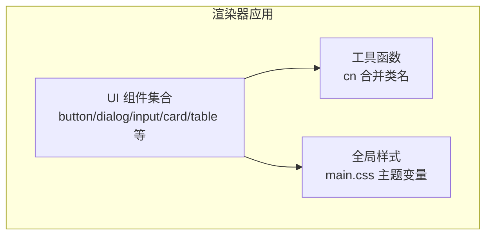
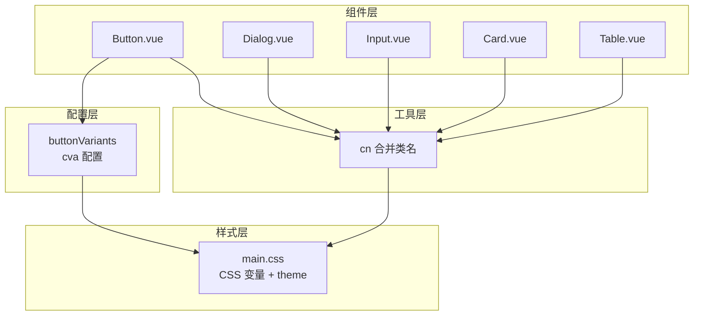
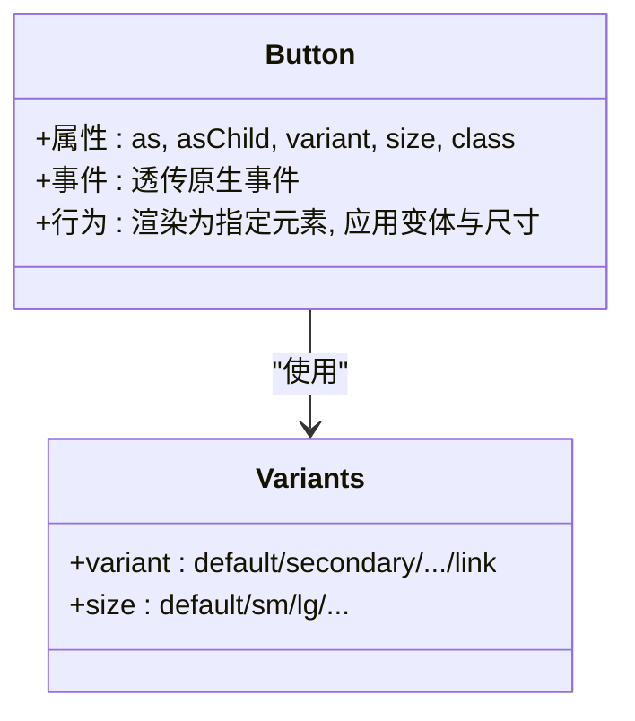
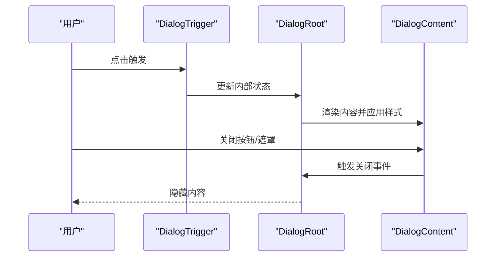
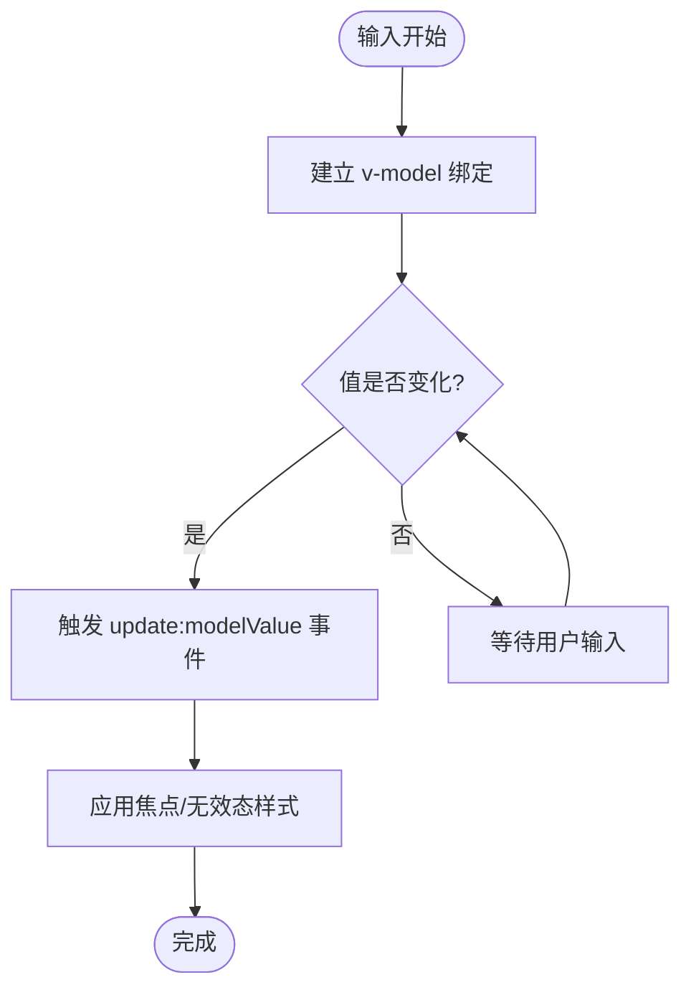
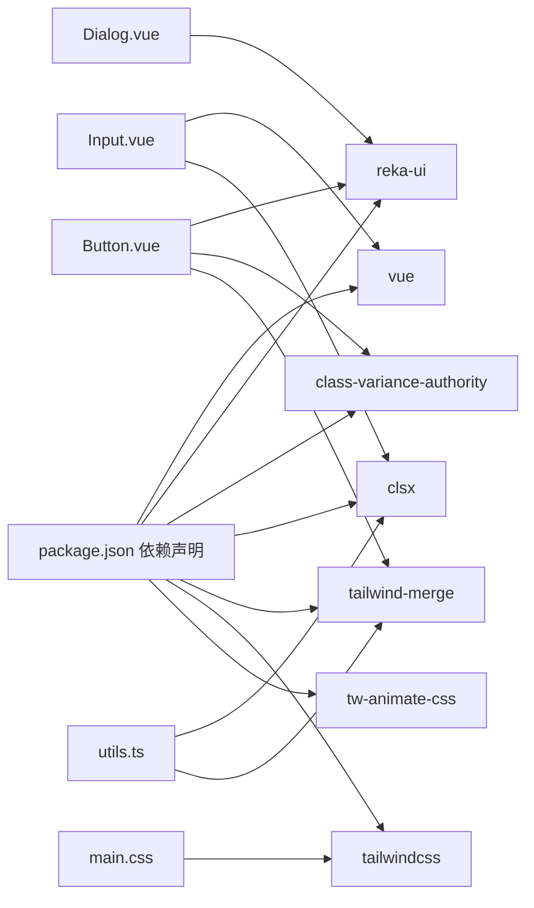

# UI组件库

<cite>
**本文引用的文件**
- [src/renderer/src/components/ui/button/Button.vue](file://src/renderer/src/components/ui/button/Button.vue)
- [src/renderer/src/components/ui/button/index.ts](file://src/renderer/src/components/ui/button/index.ts)
- [src/renderer/src/components/ui/dialog/Dialog.vue](file://src/renderer/src/components/ui/dialog/Dialog.vue)
- [src/renderer/src/components/ui/dialog/index.ts](file://src/renderer/src/components/ui/dialog/index.ts)
- [src/renderer/src/components/ui/input/Input.vue](file://src/renderer/src/components/ui/input/Input.vue)
- [src/renderer/src/components/ui/card/Card.vue](file://src/renderer/src/components/ui/card/Card.vue)
- [src/renderer/src/components/ui/table/Table.vue](file://src/renderer/src/components/ui/table/Table.vue)
- [src/renderer/src/lib/utils.ts](file://src/renderer/src/lib/utils.ts)
- [src/renderer/src/assets/main.css](file://src/renderer/src/assets/main.css)
- [package.json](file://package.json)
</cite>

## 目录
1. [简介](#简介)
2. [项目结构](#项目结构)
3. [核心组件](#核心组件)
4. [架构总览](#架构总览)
5. [组件详解](#组件详解)
6. [依赖关系分析](#依赖关系分析)
7. [性能与可访问性](#性能与可访问性)
8. [主题系统与样式定制](#主题系统与样式定制)
9. [组合使用与最佳实践](#组合使用与最佳实践)
10. [故障排查指南](#故障排查指南)
11. [结论](#结论)
12. [附录：API参考速查](#附录api参考速查)

## 简介
本文件为 AutoOps UI 组件库的使用与开发文档，聚焦于按钮、对话框、输入框、卡片、表格等核心组件的设计理念、API 规范、使用示例与扩展策略。文档同时涵盖主题系统、无障碍支持、动画与过渡、响应式设计、性能优化与浏览器兼容性建议，并提供组合使用与最佳实践指导，帮助开发者高效构建一致、可维护且可扩展的界面。

## 项目结构
UI 组件位于渲染进程的 Vue 3 应用中，采用按功能域分层组织：每个 UI 组件以目录形式存放，统一通过 index.ts 暴露默认组件与变体配置；样式通过 Tailwind CSS 与自定义 CSS 变量实现主题化；通用工具函数用于类名合并与条件样式拼接。

**图表来源**
- [src/renderer/src/components/ui/button/Button.vue:1-29](file://src/renderer/src/components/ui/button/Button.vue#L1-L29)
- [src/renderer/src/components/ui/dialog/Dialog.vue:1-16](file://src/renderer/src/components/ui/dialog/Dialog.vue#L1-L16)
- [src/renderer/src/components/ui/input/Input.vue:1-34](file://src/renderer/src/components/ui/input/Input.vue#L1-L34)
- [src/renderer/src/components/ui/card/Card.vue:1-22](file://src/renderer/src/components/ui/card/Card.vue#L1-L22)
- [src/renderer/src/components/ui/table/Table.vue:1-17](file://src/renderer/src/components/ui/table/Table.vue#L1-L17)
- [src/renderer/src/lib/utils.ts:1-8](file://src/renderer/src/lib/utils.ts#L1-L8)
- [src/renderer/src/assets/main.css:1-124](file://src/renderer/src/assets/main.css#L1-L124)

**章节来源**
- [src/renderer/src/components/ui/button/Button.vue:1-29](file://src/renderer/src/components/ui/button/Button.vue#L1-L29)
- [src/renderer/src/components/ui/dialog/Dialog.vue:1-16](file://src/renderer/src/components/ui/dialog/Dialog.vue#L1-L16)
- [src/renderer/src/components/ui/input/Input.vue:1-34](file://src/renderer/src/components/ui/input/Input.vue#L1-L34)
- [src/renderer/src/components/ui/card/Card.vue:1-22](file://src/renderer/src/components/ui/card/Card.vue#L1-L22)
- [src/renderer/src/components/ui/table/Table.vue:1-17](file://src/renderer/src/components/ui/table/Table.vue#L1-L17)
- [src/renderer/src/lib/utils.ts:1-8](file://src/renderer/src/lib/utils.ts#L1-L8)
- [src/renderer/src/assets/main.css:1-124](file://src/renderer/src/assets/main.css#L1-L124)

## 核心组件
- 按钮 Button：基于 reka-ui 的 Primitive，结合变体与尺寸配置，支持原生 button 或语义化标签渲染。
- 对话框 Dialog：对 reka-ui DialogRoot 的轻封装，负责属性与事件透传。
- 输入框 Input：基于 v-model 的受控输入，内置无障碍与焦点状态样式。
- 卡片 Card：容器型组件，承载标题、描述、内容与页脚等子块。
- 表格 Table：外层容器包裹表格，提供滚动与基础样式。

以上组件均通过统一的 cn 工具进行类名合并，确保样式一致性与可扩展性。

**章节来源**
- [src/renderer/src/components/ui/button/Button.vue:1-29](file://src/renderer/src/components/ui/button/Button.vue#L1-L29)
- [src/renderer/src/components/ui/button/index.ts:1-39](file://src/renderer/src/components/ui/button/index.ts#L1-L39)
- [src/renderer/src/components/ui/dialog/Dialog.vue:1-16](file://src/renderer/src/components/ui/dialog/Dialog.vue#L1-L16)
- [src/renderer/src/components/ui/input/Input.vue:1-34](file://src/renderer/src/components/ui/input/Input.vue#L1-L34)
- [src/renderer/src/components/ui/card/Card.vue:1-22](file://src/renderer/src/components/ui/card/Card.vue#L1-L22)
- [src/renderer/src/components/ui/table/Table.vue:1-17](file://src/renderer/src/components/ui/table/Table.vue#L1-L17)

## 架构总览
UI 组件库采用“变体配置 + 轻封装 + 工具函数”的架构模式：
- 变体配置：使用 class-variance-authority 定义组件的变体与尺寸，集中管理视觉状态。
- 轻封装：对第三方 UI 原子（如 reka-ui）进行最小必要封装，保持 API 一致性。
- 工具函数：cn 合并 Tailwind 类，保证覆盖顺序与冲突解决。
- 主题系统：CSS 自定义属性 + Tailwind theme 块，支持明暗主题切换与变量驱动。

**图表来源**
- [src/renderer/src/components/ui/button/index.ts:1-39](file://src/renderer/src/components/ui/button/index.ts#L1-L39)
- [src/renderer/src/lib/utils.ts:1-8](file://src/renderer/src/lib/utils.ts#L1-L8)
- [src/renderer/src/assets/main.css:1-124](file://src/renderer/src/assets/main.css#L1-L124)

## 组件详解

### 按钮 Button
- 设计理念
  - 以 Primitive 渲染为目标元素，支持 as/asChild 语义化渲染。
  - 通过变体与尺寸配置实现风格与尺寸的统一管理。
- API 规范
  - 属性
    - as: 渲染标签或组件，默认原生 button。
    - asChild: 是否将子节点作为目标元素渲染。
    - variant: 变体，如 default/secondary/destructive/outline/ghost/link。
    - size: 尺寸，如 default/sm/lg/icon/icon-sm/icon-lg/xs。
    - class: 额外类名。
  - 事件
    - 透传原生点击等事件（由 Primitive 与父容器决定）。
- 使用示例
  - 基础按钮：设置 variant 与 size。
  - 图标按钮：在插槽内放置图标元素。
  - 语义化按钮：通过 as="a" 渲染为链接。
- 样式定制
  - 通过 variant/size 控制主色、边框、阴影与圆角。
  - 通过 class 扩展或覆盖局部样式。
- 无障碍与交互
  - 保持原生可访问性语义，支持键盘激活与焦点可见性。
  - hover/focus/active/disabled 状态由变体与主题变量共同控制。

**图表来源**
- [src/renderer/src/components/ui/button/Button.vue:1-29](file://src/renderer/src/components/ui/button/Button.vue#L1-L29)
- [src/renderer/src/components/ui/button/index.ts:1-39](file://src/renderer/src/components/ui/button/index.ts#L1-L39)

**章节来源**
- [src/renderer/src/components/ui/button/Button.vue:1-29](file://src/renderer/src/components/ui/button/Button.vue#L1-L29)
- [src/renderer/src/components/ui/button/index.ts:1-39](file://src/renderer/src/components/ui/button/index.ts#L1-L39)

### 对话框 Dialog
- 设计理念
  - 对 reka-ui DialogRoot 进行最小封装，仅负责属性与事件透传，保持能力完整与 API 一致。
- API 规范
  - 属性
    - 透传 DialogRootProps。
  - 事件
    - 透传 DialogRootEmits。
- 子组件
  - DialogTrigger/DialogOverlay/DialogContent/DialogHeader/DialogTitle/DialogDescription/DialogFooter/DialogClose 等通过 index 导出，按需组合使用。
- 使用示例
  - 触发器 + 内容 + 关闭按钮的标准组合。
  - 滚动内容区域与描述信息的配合使用。
- 样式与主题
  - 通过全局样式与主题变量控制背景、边框与阴影。
- 无障碍与交互
  - 支持 ESC 关闭、焦点陷阱与屏幕阅读器语义。

**图表来源**
- [src/renderer/src/components/ui/dialog/Dialog.vue:1-16](file://src/renderer/src/components/ui/dialog/Dialog.vue#L1-L16)
- [src/renderer/src/components/ui/dialog/index.ts:1-10](file://src/renderer/src/components/ui/dialog/index.ts#L1-L10)

**章节来源**
- [src/renderer/src/components/ui/dialog/Dialog.vue:1-16](file://src/renderer/src/components/ui/dialog/Dialog.vue#L1-L16)
- [src/renderer/src/components/ui/dialog/index.ts:1-10](file://src/renderer/src/components/ui/dialog/index.ts#L1-L10)

### 输入框 Input
- 设计理念
  - 基于 v-model 的受控输入，内置无障碍与焦点状态样式，支持禁用与错误态。
- API 规范
  - 属性
    - modelValue/value：双向绑定值。
    - defaultValue：初始值。
    - class：额外类名。
  - 事件
    - update:modelValue：值变更事件。
- 使用示例
  - 文本输入、数字输入、带占位符与前缀图标的组合。
  - 错误态与禁用态的展示。
- 样式与主题
  - 通过 CSS 变量与主题映射控制边框、背景与文本颜色。
  - 焦点态与无效态由 aria-* 与类名组合控制。

**图表来源**
- [src/renderer/src/components/ui/input/Input.vue:1-34](file://src/renderer/src/components/ui/input/Input.vue#L1-L34)

**章节来源**
- [src/renderer/src/components/ui/input/Input.vue:1-34](file://src/renderer/src/components/ui/input/Input.vue#L1-L34)

### 卡片 Card
- 设计理念
  - 作为内容容器，提供统一的边框、背景与阴影，便于组合标题、描述、内容与页脚。
- API 规范
  - 属性
    - class：额外类名。
- 使用示例
  - 信息卡片：标题 + 描述 + 内容 + 操作区。
  - 列表项卡片：嵌套表格或列表。
- 样式与主题
  - 通过主题变量控制背景与前景色，适配明暗主题。

**章节来源**
- [src/renderer/src/components/ui/card/Card.vue:1-22](file://src/renderer/src/components/ui/card/Card.vue#L1-L22)

### 表格 Table
- 设计理念
  - 外层容器提供横向滚动与宽度自适应，内部表格遵循基础样式约定。
- API 规范
  - 属性
    - class：额外类名。
- 使用示例
  - 基础表格：表头 + 表体 + 行列数据。
  - 空状态与表尾汇总。
- 样式与主题
  - 通过主题变量与基础表格类控制边框、字体与间距。

**章节来源**
- [src/renderer/src/components/ui/table/Table.vue:1-17](file://src/renderer/src/components/ui/table/Table.vue#L1-L17)

## 依赖关系分析
- 第三方依赖
  - vue、@vueuse/core：提供响应式与组合式能力。
  - reka-ui：提供底层原子组件与状态管理。
  - class-variance-authority、clsx、tailwind-merge：提供变体配置与类名合并。
  - tailwindcss、tw-animate-css：提供样式与动画能力。
- 内部依赖
  - 组件通过 cn 工具合并类名，避免样式冲突。
  - 主题变量集中于 main.css，统一驱动明暗主题。

**图表来源**
- [package.json:16-34](file://package.json#L16-L34)
- [src/renderer/src/lib/utils.ts:1-8](file://src/renderer/src/lib/utils.ts#L1-L8)
- [src/renderer/src/assets/main.css:1-124](file://src/renderer/src/assets/main.css#L1-L124)

**章节来源**
- [package.json:16-34](file://package.json#L16-L34)

## 性能与可访问性
- 性能
  - 受控组件与 v-model：减少不必要的重渲染，避免在渲染阶段进行复杂计算。
  - 变体配置：集中管理样式，降低运行时样式拼接成本。
  - 类名合并：使用 twMerge 保证最终类名简洁，避免重复与冲突。
- 可访问性
  - 按钮与输入框保持原生可访问语义，支持键盘操作与焦点可见性。
  - 对话框组件遵循模态对话的可访问性约定（焦点陷阱、ESC 关闭、ARIA 标签）。
  - 表单控件提供 aria-invalid 与占位符提示，增强错误反馈。

[本节为通用指导，无需特定文件引用]

## 主题系统与样式定制
- 主题变量
  - 全局 CSS 变量定义背景、前景、主色、次色、危险色、边框、输入与环形光晕等。
  - 明/暗两套变量，通过 .dark 选择器切换。
- Tailwind 主题映射
  - @theme inline 将 CSS 变量映射到 Tailwind 颜色与半径变量，实现变量驱动的样式体系。
- 样式定制策略
  - 优先通过变体参数与 class 扩展，避免直接覆盖内部类名。
  - 在需要时通过额外 class 注入，利用 twMerge 的覆盖规则保证正确性。
- 动画与过渡
  - 引入 tw-animate-css，可在组件上添加过渡类实现平滑动画。

**章节来源**
- [src/renderer/src/assets/main.css:1-124](file://src/renderer/src/assets/main.css#L1-L124)
- [src/renderer/src/lib/utils.ts:1-8](file://src/renderer/src/lib/utils.ts#L1-L8)

## 组合使用与最佳实践
- 组合使用
  - 按钮 + 对话框：使用 DialogTrigger 触发 Dialog，内部放置按钮作为确认/取消。
  - 输入框 + 卡片：在卡片中放置表单输入与提交按钮，形成表单卡片。
  - 表格 + 卡片：在卡片中嵌套表格，用于展示与操作数据。
- 最佳实践
  - 保持语义化：按钮尽量使用原生 button，链接使用 a 标签。
  - 一致的尺寸与间距：通过变体与尺寸参数统一风格。
  - 可访问性优先：为交互元素提供明确的标签与状态提示。
  - 响应式设计：利用 Tailwind 断点类与容器宽度控制在不同设备上的表现。

[本节为通用指导，无需特定文件引用]

## 故障排查指南
- 样式不生效
  - 检查是否正确引入 main.css 与 Tailwind 配置。
  - 确认类名拼接顺序与覆盖规则，避免被后续样式覆盖。
- 主题未切换
  - 确认根元素是否包含 dark 类，以及 CSS 变量是否正确映射。
- 对话框无法关闭或焦点异常
  - 检查触发器与内容组件的组合是否正确，确保事件透传正常。
- 输入框状态异常
  - 检查 v-model 绑定与 update:modelValue 事件是否正确触发。
  - 确认 aria-invalid 与禁用态类名是否按预期应用。

**章节来源**
- [src/renderer/src/assets/main.css:1-124](file://src/renderer/src/assets/main.css#L1-L124)
- [src/renderer/src/components/ui/dialog/Dialog.vue:1-16](file://src/renderer/src/components/ui/dialog/Dialog.vue#L1-L16)
- [src/renderer/src/components/ui/input/Input.vue:1-34](file://src/renderer/src/components/ui/input/Input.vue#L1-L34)

## 结论
AutoOps UI 组件库通过“变体配置 + 轻封装 + 工具函数”的架构，实现了风格统一、易于扩展与高度可访问的组件体系。借助主题变量与 Tailwind 的强大力量，组件在明暗主题下保持一致体验；通过合理的 API 设计与事件透传，开发者可以灵活组合与定制。建议在实际项目中遵循本文档的最佳实践，充分利用变体与样式工具，确保组件库的长期可维护性与扩展性。

[本节为总结，无需特定文件引用]

## 附录：API参考速查
- Button
  - 属性：as, asChild, variant, size, class
  - 变体：default/secondary/destructive/outline/ghost/link
  - 尺寸：default/sm/lg/icon/icon-sm/icon-lg/xs
- Dialog
  - 属性：透传 DialogRootProps
  - 事件：透传 DialogRootEmits
  - 子组件：DialogTrigger/DialogOverlay/DialogContent/DialogHeader/DialogTitle/DialogDescription/DialogFooter/DialogClose
- Input
  - 属性：modelValue/defaultValue, class
  - 事件：update:modelValue
- Card
  - 属性：class
- Table
  - 属性：class

**章节来源**
- [src/renderer/src/components/ui/button/Button.vue:1-29](file://src/renderer/src/components/ui/button/Button.vue#L1-L29)
- [src/renderer/src/components/ui/button/index.ts:1-39](file://src/renderer/src/components/ui/button/index.ts#L1-L39)
- [src/renderer/src/components/ui/dialog/Dialog.vue:1-16](file://src/renderer/src/components/ui/dialog/Dialog.vue#L1-L16)
- [src/renderer/src/components/ui/dialog/index.ts:1-10](file://src/renderer/src/components/ui/dialog/index.ts#L1-L10)
- [src/renderer/src/components/ui/input/Input.vue:1-34](file://src/renderer/src/components/ui/input/Input.vue#L1-L34)
- [src/renderer/src/components/ui/card/Card.vue:1-22](file://src/renderer/src/components/ui/card/Card.vue#L1-L22)
- [src/renderer/src/components/ui/table/Table.vue:1-17](file://src/renderer/src/components/ui/table/Table.vue#L1-L17)