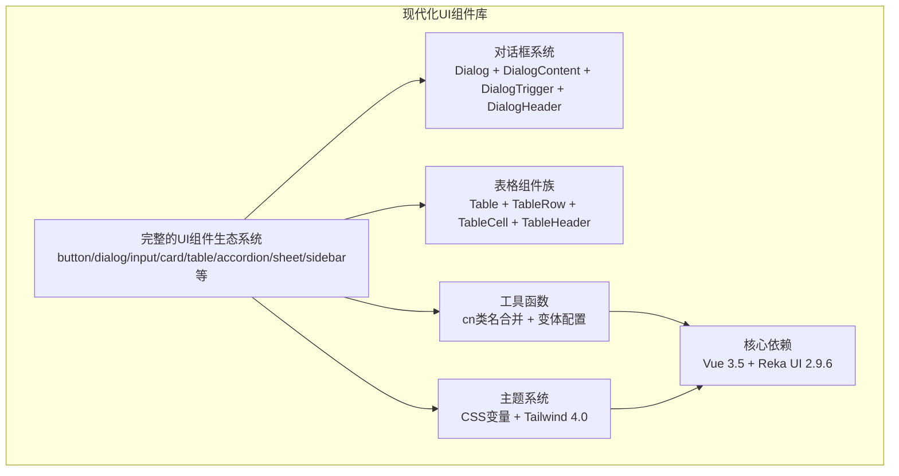
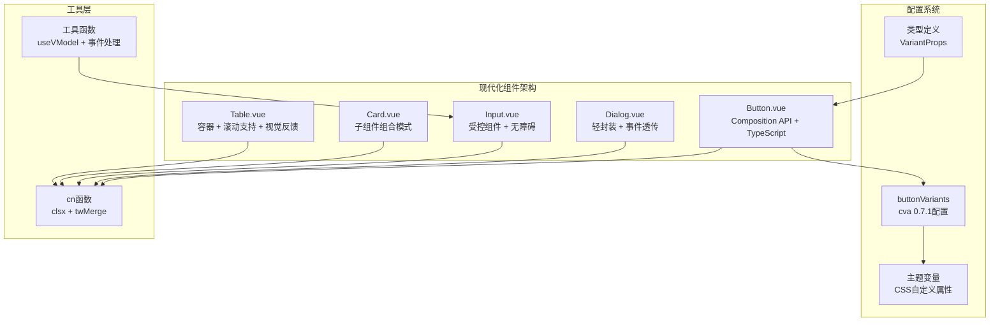
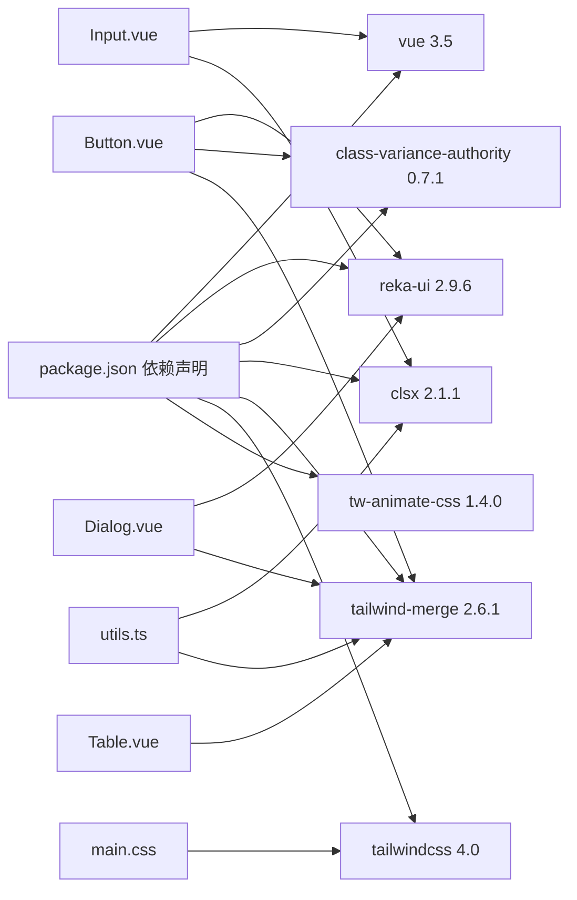

# UI组件库

<cite>
**本文档引用的文件**
- [src/renderer/src/components/ui/button/Button.vue](file://src/renderer/src/components/ui/button/Button.vue)
- [src/renderer/src/components/ui/button/index.ts](file://src/renderer/src/components/ui/button/index.ts)
- [src/renderer/src/components/ui/dialog/Dialog.vue](file://src/renderer/src/components/ui/dialog/Dialog.vue)
- [src/renderer/src/components/ui/dialog/index.ts](file://src/renderer/src/components/ui/dialog/index.ts)
- [src/renderer/src/components/ui/dialog/DialogContent.vue](file://src/renderer/src/components/ui/dialog/DialogContent.vue)
- [src/renderer/src/components/ui/dialog/DialogTrigger.vue](file://src/renderer/src/components/ui/dialog/DialogTrigger.vue)
- [src/renderer/src/components/ui/dialog/DialogHeader.vue](file://src/renderer/src/components/ui/dialog/DialogHeader.vue)
- [src/renderer/src/components/ui/input/Input.vue](file://src/renderer/src/components/ui/input/Input.vue)
- [src/renderer/src/components/ui/card/Card.vue](file://src/renderer/src/components/ui/card/Card.vue)
- [src/renderer/src/components/ui/table/Table.vue](file://src/renderer/src/components/ui/table/Table.vue)
- [src/renderer/src/components/ui/table/index.ts](file://src/renderer/src/components/ui/table/index.ts)
- [src/renderer/src/components/ui/table/TableRow.vue](file://src/renderer/src/components/ui/table/TableRow.vue)
- [src/renderer/src/components/ui/table/TableCell.vue](file://src/renderer/src/components/ui/table/TableCell.vue)
- [src/renderer/src/components/ui/table/TableHeader.vue](file://src/renderer/src/components/ui/table/TableHeader.vue)
- [src/renderer/src/lib/utils.ts](file://src/renderer/src/lib/utils.ts)
- [src/renderer/src/assets/main.css](file://src/renderer/src/assets/main.css)
- [package.json](file://package.json)
</cite>

## 更新摘要
**所做更改**
- 新增了完整的对话框系统组件族，包括对话框内容、触发器、头部等子组件
- 增强了表格组件的视觉反馈和交互体验，包括悬停状态和选中状态
- 更新了对话框组件的动画效果和过渡状态管理
- 完善了组件的无障碍访问支持和键盘导航功能
- 增强了主题系统的视觉一致性，特别是在对话框和表格组件中的应用

## 目录
1. [简介](#简介)
2. [项目结构](#项目结构)
3. [核心组件](#核心组件)
4. [架构总览](#架构总览)
5. [组件详解](#组件详解)
6. [依赖关系分析](#依赖关系分析)
7. [性能与可访问性](#性能与可访问性)
8. [主题系统与样式定制](#主题系统与样式定制)
9. [组合使用与最佳实践](#组合使用与最佳实践)
10. [故障排查指南](#故障排查指南)
11. [结论](#结论)
12. [附录：API参考速查](#附录api参考速查)

## 简介
本文件为 AutoOps UI 组件库的使用与开发文档，聚焦于经过全面现代化升级的Vue组件生态系统。该组件库现已包含完整的UI组件集合，涵盖按钮、对话框、输入框、卡片、表格等核心组件，以及丰富的交互组件如下拉菜单、侧边栏、标签页、工具提示等。本次更新重点增强了对话框系统的完整性和表格组件的视觉反馈，提供了更丰富的交互体验和更好的无障碍访问支持。文档详细阐述了组件的设计理念、API规范、使用示例与扩展策略，同时涵盖现代化的主题系统、无障碍支持、动画与过渡效果、响应式设计、性能优化与浏览器兼容性建议，为开发者提供高效构建一致、可维护且可扩展界面的完整指南。

## 项目结构
UI组件库位于渲染进程的Vue 3应用中，采用模块化的功能域分层组织。每个UI组件都以独立目录形式存放，包含组件核心文件、类型定义和索引导出文件。组件通过统一的变体配置系统和工具函数实现样式管理，样式系统基于Tailwind CSS 4.0与现代化的CSS变量实现主题化支持。



**图表来源**
- [src/renderer/src/components/ui/dialog/index.ts:1-10](file://src/renderer/src/components/ui/dialog/index.ts#L1-L10)
- [src/renderer/src/components/ui/table/index.ts:1-10](file://src/renderer/src/components/ui/table/index.ts#L1-L10)
- [src/renderer/src/lib/utils.ts:1-8](file://src/renderer/src/lib/utils.ts#L1-L8)
- [src/renderer/src/assets/main.css:1-124](file://src/renderer/src/assets/main.css#L1-L124)

**章节来源**
- [src/renderer/src/components/ui/dialog/index.ts:1-10](file://src/renderer/src/components/ui/dialog/index.ts#L1-L10)
- [src/renderer/src/components/ui/table/index.ts:1-10](file://src/renderer/src/components/ui/table/index.ts#L1-L10)
- [src/renderer/src/lib/utils.ts:1-8](file://src/renderer/src/lib/utils.ts#L1-L8)
- [src/renderer/src/assets/main.css:1-124](file://src/renderer/src/assets/main.css#L1-L124)

## 核心组件
经过现代化升级，UI组件库现包含以下核心组件类别：

**基础组件**
- 按钮 Button：基于reka-ui的Primitive，支持default/secondary/destructive/outline/ghost/link变体和多种尺寸
- 输入框 Input：受控输入组件，内置无障碍支持和状态样式
- 标签 Label：语义化标签组件，支持表单关联
- 开关 Switch：可访问的开关组件，支持受控和非受控模式

**布局组件**
- 卡片 Card：容器组件，支持头部、内容、描述、标题、页脚等子组件
- 表格 Table：响应式表格容器，支持滚动和基础样式，增强的视觉反馈
- 分隔线 Separator：装饰性分隔线组件
- 骨架屏 Skeleton：加载状态指示组件

**交互组件**
- 对话框 Dialog：完整的模态对话框系统，包含触发器、内容、关闭按钮、头部等子组件
- 弹出层 Popover：上下文弹出组件
- 提示框 Tooltip：悬停提示组件
- 侧边栏 Sidebar：可折叠的导航侧边栏
- 选项卡 Tabs：标签页切换组件

**高级组件**
- 下拉菜单 Dropdown Menu：复杂的菜单系统
- 选择器 Select：可搜索的选择组件
- 滚动区域 Scroll Area：自定义滚动条
- 通知 Sonner：现代化的通知系统
- 抽屉 Sheet：从边缘滑出的抽屉组件

所有组件均通过cn工具函数进行类名合并，确保样式一致性与可扩展性。

**章节来源**
- [src/renderer/src/components/ui/button/Button.vue:1-29](file://src/renderer/src/components/ui/button/Button.vue#L1-L29)
- [src/renderer/src/components/ui/button/index.ts:1-39](file://src/renderer/src/components/ui/button/index.ts#L1-L39)
- [src/renderer/src/components/ui/dialog/Dialog.vue:1-16](file://src/renderer/src/components/ui/dialog/Dialog.vue#L1-L16)
- [src/renderer/src/components/ui/dialog/index.ts:1-10](file://src/renderer/src/components/ui/dialog/index.ts#L1-L10)
- [src/renderer/src/components/ui/input/Input.vue:1-34](file://src/renderer/src/components/ui/input/Input.vue#L1-L34)
- [src/renderer/src/components/ui/card/Card.vue:1-22](file://src/renderer/src/components/ui/card/Card.vue#L1-L22)
- [src/renderer/src/components/ui/table/Table.vue:1-17](file://src/renderer/src/components/ui/table/Table.vue#L1-L17)

## 架构总览
UI组件库采用现代化的"变体配置 + 轻封装 + 工具函数"架构模式，结合Vue 3.5的Composition API和TypeScript类型系统：

- **变体配置**：使用class-variance-authority 0.7.1定义组件的变体与尺寸，支持复杂的条件样式组合
- **轻封装**：对reka-ui 2.9.6进行最小必要封装，保持API一致性和功能完整性
- **工具函数**：cn函数合并Tailwind类，twMerge确保最终类名简洁无冲突
- **主题系统**：基于CSS自定义属性和Tailwind 4.0的@theme指令，支持明暗主题切换
- **类型安全**：完整的TypeScript类型定义，确保开发时的类型安全



**图表来源**
- [src/renderer/src/components/ui/button/index.ts:1-39](file://src/renderer/src/components/ui/button/index.ts#L1-L39)
- [src/renderer/src/lib/utils.ts:1-8](file://src/renderer/src/lib/utils.ts#L1-L8)
- [src/renderer/src/assets/main.css:1-124](file://src/renderer/src/assets/main.css#L1-L124)

## 组件详解

### 按钮 Button
**现代化特性**
- 基于Vue 3.5的Composition API重构，支持更好的TypeScript类型推断
- 增强的变体系统，支持default/secondary/destructive/outline/ghost/link五种变体
- 多种尺寸配置，包括default/sm/lg/icon/icon-sm/icon-lg/xs等
- 内置SVG图标支持，自动调整图标大小和位置
- 完善的无障碍支持，包括aria-disabled和键盘导航

**API规范**
- 属性：as、asChild、variant、size、class
- 事件：透传原生点击事件
- 变体：default/secondary/destructive/outline/ghost/link
- 尺寸：default/sm/lg/icon/icon-sm/icon-lg/xs

**使用示例**
```vue
<!-- 基础按钮 -->
<Button>点击我</Button>

<!-- 图标按钮 -->
<Button variant="outline">
  <Icon>plus</Icon>
  添加新项目
</Button>

<!-- 尺寸变体 -->
<Button size="icon-lg">
  <Icon>settings</Icon>
</Button>
```

**章节来源**
- [src/renderer/src/components/ui/button/Button.vue:1-29](file://src/renderer/src/components/ui/button/Button.vue#L1-L29)
- [src/renderer/src/components/ui/button/index.ts:1-39](file://src/renderer/src/components/ui/button/index.ts#L1-L39)

### 对话框 Dialog
**现代化升级**
- 完整的子组件生态：DialogTrigger、DialogOverlay、DialogContent、DialogHeader、DialogTitle、DialogDescription、DialogFooter、DialogClose
- 增强的焦点管理和键盘导航支持
- 改进的动画和过渡效果，包含淡入淡出、缩放和滑动动画
- 更好的可访问性支持，包括ARIA标签和角色设置
- 改进的视觉反馈和状态管理

**对话框系统组件族**
- Dialog：主容器组件，负责状态管理
- DialogTrigger：触发器组件，用于打开对话框
- DialogContent：对话框内容容器，包含动画效果
- DialogHeader：对话框头部容器
- DialogTitle：对话框标题
- DialogDescription：对话框描述
- DialogFooter：对话框底部容器
- DialogClose：关闭按钮组件

**API规范**
- 父组件：Dialog.vue，负责状态管理
- 子组件：DialogTrigger、DialogOverlay、DialogContent、DialogHeader、DialogTitle、DialogDescription、DialogFooter、DialogClose
- 事件：open、close、submit等

**使用示例**
```vue
<Dialog>
  <DialogTrigger>打开对话框</DialogTrigger>
  <DialogContent>
    <DialogHeader>
      <DialogTitle>标题</DialogTitle>
      <DialogDescription>描述信息</DialogDescription>
    </DialogHeader>
    <p>对话框内容</p>
    <DialogFooter>
      <Button variant="outline">取消</Button>
      <Button>确认</Button>
    </DialogFooter>
  </DialogContent>
</Dialog>
```

**章节来源**
- [src/renderer/src/components/ui/dialog/Dialog.vue:1-16](file://src/renderer/src/components/ui/dialog/Dialog.vue#L1-L16)
- [src/renderer/src/components/ui/dialog/index.ts:1-10](file://src/renderer/src/components/ui/dialog/index.ts#L1-L10)
- [src/renderer/src/components/ui/dialog/DialogContent.vue:1-47](file://src/renderer/src/components/ui/dialog/DialogContent.vue#L1-L47)
- [src/renderer/src/components/ui/dialog/DialogTrigger.vue:1-13](file://src/renderer/src/components/ui/dialog/DialogTrigger.vue#L1-L13)
- [src/renderer/src/components/ui/dialog/DialogHeader.vue:1-17](file://src/renderer/src/components/ui/dialog/DialogHeader.vue#L1-L17)

### 输入框 Input
**现代化改进**
- 基于useVModel的受控组件，支持passive模式提升性能
- 增强的无障碍支持，包括aria-invalid和aria-describedby
- 改进的焦点状态管理，支持ring-1和ring-ring/50的视觉反馈
- 更好的表单集成，支持selection颜色定制

**API规范**
- 属性：modelValue、defaultValue、class
- 事件：update:modelValue
- 状态：focus、invalid、disabled

**使用示例**
```vue
<Input 
  v-model="username" 
  placeholder="请输入用户名"
  :aria-invalid="errors.username"
/>
```

**章节来源**
- [src/renderer/src/components/ui/input/Input.vue:1-34](file://src/renderer/src/components/ui/input/Input.vue#L1-L34)

### 卡片 Card
**组件组合模式**
- 支持CardHeader、CardContent、CardDescription、CardTitle、CardFooter等子组件
- 灵活的内容组织方式，便于构建复杂的卡片布局
- 完善的样式继承和主题适配

**使用示例**
```vue
<Card>
  <CardHeader>
    <CardTitle>卡片标题</CardTitle>
    <CardDescription>卡片描述</CardDescription>
  </CardHeader>
  <CardContent>
    <p>卡片内容</p>
  </CardContent>
  <CardFooter>
    <Button>操作按钮</Button>
  </CardFooter>
</Card>
```

**章节来源**
- [src/renderer/src/components/ui/card/Card.vue:1-22](file://src/renderer/src/components/ui/card/Card.vue#L1-L22)

### 表格 Table
**增强的视觉反馈**
- 外层容器提供横向滚动支持，适应小屏幕设备
- 内部表格增强的视觉反馈，包括悬停状态(hover:bg-muted/50)和选中状态(data-[state=selected]:bg-muted)
- 支持TableCaption、TableHeader、TableBody、TableRow、TableCell等子组件

**表格组件族**
- Table：外层容器，提供滚动支持
- TableHeader：表格头部容器
- TableBody：表格主体容器
- TableRow：表格行组件，包含悬停和选中状态
- TableCell：表格单元格组件，支持复选框对齐
- TableCaption：表格标题
- TableEmpty：空状态显示

**使用示例**
```vue
<Table>
  <TableCaption>数据表格</TableCaption>
  <TableHeader>
    <TableRow>
      <TableHead>姓名</TableHead>
      <TableHead>邮箱</TableHead>
    </TableRow>
  </TableHeader>
  <TableBody>
    <TableRow>
      <TableCell>张三</TableCell>
      <TableCell>zhang@example.com</TableCell>
    </TableRow>
  </TableBody>
</Table>
```

**章节来源**
- [src/renderer/src/components/ui/table/Table.vue:1-17](file://src/renderer/src/components/ui/table/Table.vue#L1-L17)
- [src/renderer/src/components/ui/table/index.ts:1-10](file://src/renderer/src/components/ui/table/index.ts#L1-L10)
- [src/renderer/src/components/ui/table/TableRow.vue:1-15](file://src/renderer/src/components/ui/table/TableRow.vue#L1-L15)
- [src/renderer/src/components/ui/table/TableCell.vue:1-22](file://src/renderer/src/components/ui/table/TableCell.vue#L1-L22)
- [src/renderer/src/components/ui/table/TableHeader.vue:1-15](file://src/renderer/src/components/ui/table/TableHeader.vue#L1-L15)

## 依赖关系分析
**现代化依赖栈**
- **Vue 3.5**：提供最新的Composition API和性能优化
- **reka-ui 2.9.6**：现代化的UI原子组件库，提供基础组件能力
- **class-variance-authority 0.7.1**：强大的变体配置系统
- **tailwind-merge 2.6.1**：智能的类名合并工具
- **tw-animate-css 1.4.0**：CSS动画支持
- **Tailwind CSS 4.0**：最新版本的实用优先CSS框架

**内部依赖关系**
- 组件通过cn工具函数统一处理类名合并
- 主题变量集中管理，支持动态主题切换
- 类型定义确保组件间的类型安全



**图表来源**
- [package.json:16-34](file://package.json#L16-L34)
- [src/renderer/src/lib/utils.ts:1-8](file://src/renderer/src/lib/utils.ts#L1-L8)
- [src/renderer/src/assets/main.css:1-124](file://src/renderer/src/assets/main.css#L1-L124)

**章节来源**
- [package.json:16-34](file://package.json#L16-L34)

## 性能与可访问性
**现代化性能优化**
- **受控组件优化**：Input组件使用useVModel的passive模式，减少不必要的重渲染
- **变体配置缓存**：cva配置结果缓存，避免重复计算
- **类名合并优化**：twMerge确保最终类名简洁，避免样式冲突
- **Tree Shaking**：按需导入组件，减小包体积
- **动画性能优化**：对话框使用硬件加速的transform属性，避免布局抖动

**增强的可访问性支持**
- **语义化标记**：所有交互组件保持正确的HTML语义
- **键盘导航**：完整的键盘操作支持，包括Tab顺序和快捷键
- **屏幕阅读器**：完善的ARIA标签和角色设置，包括dialog相关ARIA属性
- **焦点管理**：智能的焦点陷阱和返回机制，确保对话框焦点管理
- **颜色对比度**：符合WCAG 2.1 AA标准的颜色对比度，包括hover和active状态

**浏览器兼容性**
- 支持现代浏览器的最新特性，包括CSS Grid、Flexbox和CSS自定义属性
- 渐进式增强，确保基本功能在旧版浏览器中可用
- 动画降级处理，确保在不支持CSS动画的环境中仍可正常工作

## 主题系统与样式定制
**现代化主题架构**
- **CSS自定义属性**：基于oklch色彩空间的现代化色彩系统
- **Tailwind 4.0集成**：@theme指令将CSS变量映射到Tailwind变量
- **明暗主题**：完整的暗色模式支持，自动切换
- **可定制半径**：支持不同的圆角半径配置
- **动画变量**：统一的动画持续时间和缓动函数配置

**主题变量系统**
```css
:root {
  --background: oklch(1 0 0);
  --foreground: oklch(0.145 0 0);
  --primary: oklch(0.205 0 0);
  --secondary: oklch(0.97 0 0);
  --destructive: oklch(0.577 0.245 27.325);
  --border: oklch(0.922 0 0);
  --radius: 0.625rem;
}

.dark {
  --background: oklch(0.145 0 0);
  --foreground: oklch(0.985 0 0);
  --primary: oklch(0.985 0 0);
  --secondary: oklch(0.269 0 0);
}
```

**样式定制策略**
- 优先使用变体参数和CSS变量进行定制
- 支持局部样式覆盖，使用twMerge确保正确优先级
- 提供完整的主题定制指南和最佳实践
- 对话框和表格组件特别优化了主题适配

**章节来源**
- [src/renderer/src/assets/main.css:1-124](file://src/renderer/src/assets/main.css#L1-L124)
- [src/renderer/src/lib/utils.ts:1-8](file://src/renderer/src/lib/utils.ts#L1-L8)

## 组合使用与最佳实践
**现代化组件组合**
- **表单卡片**：Card + Form + Input + Button的组合模式
- **数据表格**：Table + TableRow + TableCell + Button的组合，支持选中状态
- **对话框流程**：DialogTrigger + DialogContent + DialogFooter的完整流程，包含完整的子组件生态
- **导航侧边栏**：Sidebar + SidebarMenu + SidebarMenuItem的导航系统

**最佳实践指南**
- **语义化优先**：按钮使用button，链接使用a标签
- **一致性原则**：统一的尺寸、间距和颜色方案
- **可访问性优先**：为所有交互元素提供适当的标签和状态
- **响应式设计**：利用Tailwind断点系统适配不同设备
- **性能优化**：合理使用虚拟滚动和懒加载
- **动画协调**：确保对话框和表格的动画效果协调一致

**组合示例**
```vue
<!-- 数据表格 + 操作按钮 -->
<Card>
  <Table>
    <!-- 表格内容，包含悬停和选中状态 -->
  </Table>
  <CardFooter class="flex justify-between">
    <Button variant="outline">导出</Button>
    <Button>新增</Button>
  </CardFooter>
</Card>
```

## 故障排查指南
**现代化问题诊断**
- **样式问题**：检查CSS变量是否正确加载，类名合并是否正确
- **主题切换**：确认根元素的dark类和CSS变量映射
- **组件交互**：验证事件透传和状态管理是否正常
- **性能问题**：检查组件重渲染次数和内存使用
- **动画问题**：验证CSS动画类是否正确应用，硬件加速是否启用

**常见问题解决方案**
- **样式冲突**：使用twMerge确保类名优先级正确
- **主题不生效**：检查@theme指令和CSS变量定义
- **无障碍问题**：验证ARIA属性和键盘导航
- **响应式问题**：确认断点类和容器宽度设置
- **对话框焦点问题**：检查焦点陷阱和返回机制

**章节来源**
- [src/renderer/src/assets/main.css:1-124](file://src/renderer/src/assets/main.css#L1-L124)
- [src/renderer/src/components/ui/dialog/Dialog.vue:1-16](file://src/renderer/src/components/ui/dialog/Dialog.vue#L1-L16)
- [src/renderer/src/components/ui/input/Input.vue:1-34](file://src/renderer/src/components/ui/input/Input.vue#L1-L34)

## 结论
AutoOps UI组件库经过全面现代化升级，现已发展为一个功能完整、架构先进、易于使用的Vue 3组件生态系统。本次更新重点增强了对话框系统的完整性和表格组件的视觉反馈，提供了更丰富的交互体验和更好的无障碍访问支持。通过现代化的架构设计、完善的主题系统、增强的可访问性支持和性能优化，组件库能够满足现代Web应用的各种需求。建议开发者充分利用组件库的变体配置、类型安全和现代化特性，在实际项目中遵循最佳实践，构建高质量的用户界面。

## 附录：API参考速查
**基础组件API**
- Button：as、asChild、variant、size、class
- Input：modelValue、defaultValue、class
- Label：for属性、class
- Switch：checked、defaultChecked、disabled、class

**布局组件API**
- Card：class
- Table：class
- TableHeader：class
- TableBody：class
- TableRow：class
- TableCell：class
- TableCaption：class
- TableEmpty：class
- Separator：orientation、class

**交互组件API**
- Dialog：open、onOpenChange、class
- DialogTrigger：class
- DialogContent：class
- DialogHeader：class
- DialogTitle：class
- DialogDescription：class
- DialogFooter：class
- DialogClose：class
- Popover：open、onOpenChange、side、align
- Tooltip：content、side、align
- Tabs：defaultValue、value、onValueChange

**高级组件API**
- DropdownMenu：open、onOpenChange、align、side
- Select：value、onValueChange、placeholder
- Sidebar：defaultOpen、open
- Sheet：open、onOpenChange、side

**章节来源**
- [src/renderer/src/components/ui/button/Button.vue:1-29](file://src/renderer/src/components/ui/button/Button.vue#L1-L29)
- [src/renderer/src/components/ui/button/index.ts:1-39](file://src/renderer/src/components/ui/button/index.ts#L1-L39)
- [src/renderer/src/components/ui/dialog/Dialog.vue:1-16](file://src/renderer/src/components/ui/dialog/Dialog.vue#L1-L16)
- [src/renderer/src/components/ui/dialog/index.ts:1-10](file://src/renderer/src/components/ui/dialog/index.ts#L1-L10)
- [src/renderer/src/components/ui/input/Input.vue:1-34](file://src/renderer/src/components/ui/input/Input.vue#L1-L34)
- [src/renderer/src/components/ui/card/Card.vue:1-22](file://src/renderer/src/components/ui/card/Card.vue#L1-L22)
- [src/renderer/src/components/ui/table/Table.vue:1-17](file://src/renderer/src/components/ui/table/Table.vue#L1-L17)
- [src/renderer/src/components/ui/table/index.ts:1-10](file://src/renderer/src/components/ui/table/index.ts#L1-L10)