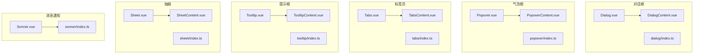
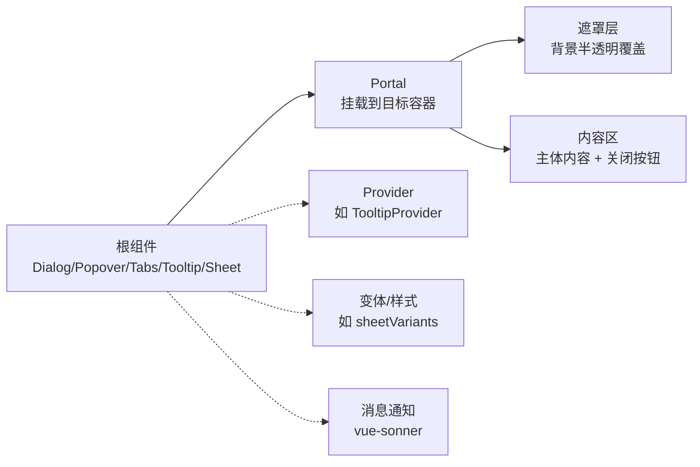
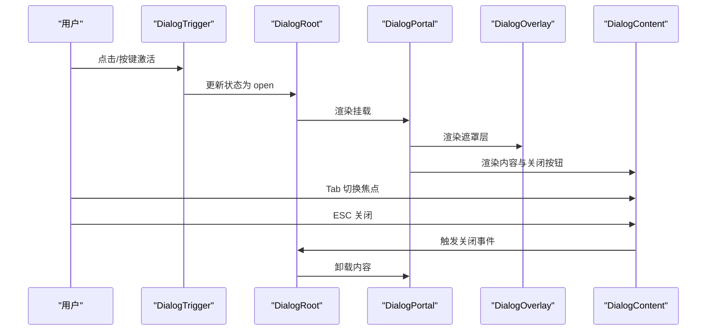
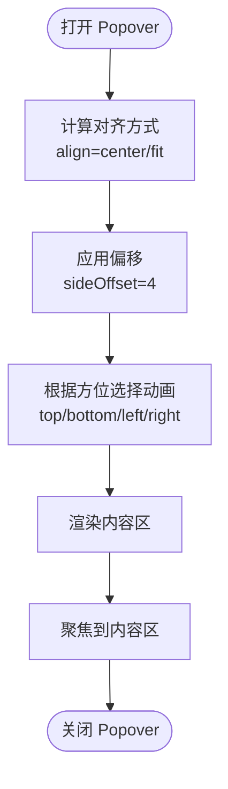
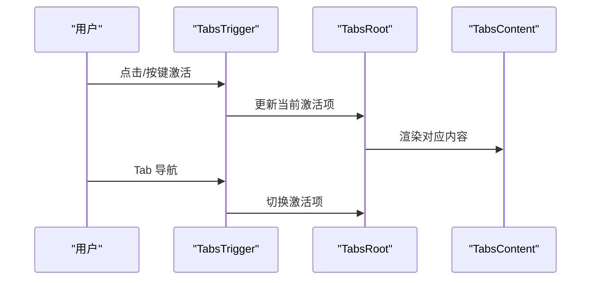
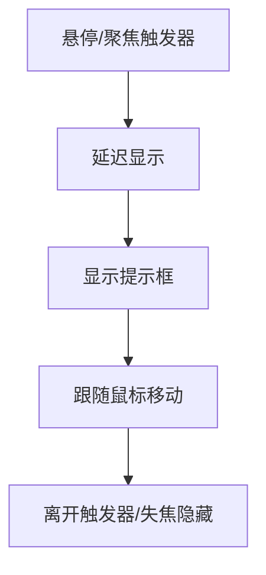
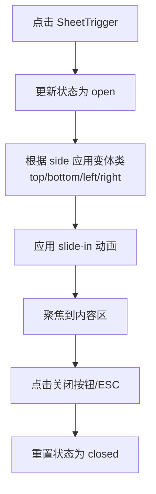
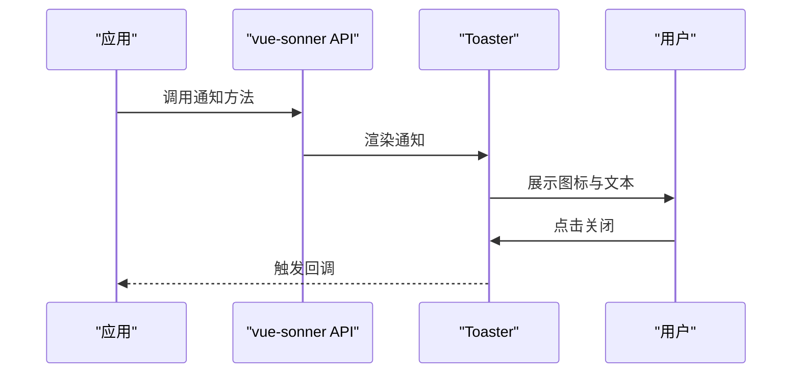
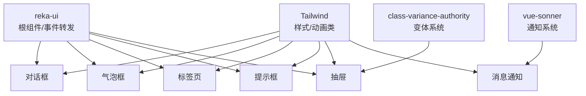

# 反馈组件

<cite>
**本文引用的文件**
- [Dialog.vue](file://src/renderer/src/components/ui/dialog/Dialog.vue)
- [DialogContent.vue](file://src/renderer/src/components/ui/dialog/DialogContent.vue)
- [Dialog/index.ts](file://src/renderer/src/components/ui/dialog/index.ts)
- [Popover.vue](file://src/renderer/src/components/ui/popover/Popover.vue)
- [PopoverContent.vue](file://src/renderer/src/components/ui/popover/PopoverContent.vue)
- [Popover/index.ts](file://src/renderer/src/components/ui/popover/index.ts)
- [Tabs.vue](file://src/renderer/src/components/ui/tabs/Tabs.vue)
- [TabsContent.vue](file://src/renderer/src/components/ui/tabs/TabsContent.vue)
- [Tabs/index.ts](file://src/renderer/src/components/ui/tabs/index.ts)
- [Tooltip.vue](file://src/renderer/src/components/ui/tooltip/Tooltip.vue)
- [TooltipContent.vue](file://src/renderer/src/components/ui/tooltip/TooltipContent.vue)
- [Tooltip/index.ts](file://src/renderer/src/components/ui/tooltip/index.ts)
- [Sheet.vue](file://src/renderer/src/components/ui/sheet/Sheet.vue)
- [SheetContent.vue](file://src/renderer/src/components/ui/sheet/SheetContent.vue)
- [Sheet/index.ts](file://src/renderer/src/components/ui/sheet/index.ts)
- [Sonner.vue](file://src/renderer/src/components/ui/sonner/Sonner.vue)
- [Sonner/index.ts](file://src/renderer/src/components/ui/sonner/index.ts)
</cite>

## 目录
1. [简介](#简介)
2. [项目结构](#项目结构)
3. [核心组件](#核心组件)
4. [架构总览](#架构总览)
5. [组件详解](#组件详解)
6. [依赖关系分析](#依赖关系分析)
7. [性能与可用性](#性能与可用性)
8. [故障排查指南](#故障排查指南)
9. [结论](#结论)
10. [附录](#附录)

## 简介
本文件聚焦于反馈类交互组件的设计与使用，涵盖对话框、气泡框、标签页、提示框、消息通知、抽屉等。内容从用户体验与交互模式出发，解释触发机制、状态管理、动画效果、定位策略、层级控制与焦点管理，并提供组合使用示例、用户引导流程与错误提示方案，同时阐述可访问性（无障碍）实现与键盘操作支持，帮助开发者构建直观、友好且符合标准的用户交互体验。

## 项目结构
这些反馈组件统一基于 reka-ui 的语义化根组件进行封装，通过轻量转发属性与事件的方式，结合 Tailwind 类名与动画类，形成一致的外观与行为风格。消息通知采用 vue-sonner 提供的 Toaster 组件并进行主题与图标定制。

图表来源
- [Dialog.vue:1-16](file://src/renderer/src/components/ui/dialog/Dialog.vue#L1-L16)
- [DialogContent.vue:1-47](file://src/renderer/src/components/ui/dialog/DialogContent.vue#L1-L47)
- [Dialog/index.ts:1-10](file://src/renderer/src/components/ui/dialog/index.ts#L1-L10)
- [Popover.vue:1-16](file://src/renderer/src/components/ui/popover/Popover.vue#L1-L16)
- [PopoverContent.vue:1-45](file://src/renderer/src/components/ui/popover/PopoverContent.vue#L1-L45)
- [Popover/index.ts:1-5](file://src/renderer/src/components/ui/popover/index.ts#L1-L5)
- [Tabs.vue:1-16](file://src/renderer/src/components/ui/tabs/Tabs.vue#L1-L16)
- [TabsContent.vue:1-21](file://src/renderer/src/components/ui/tabs/TabsContent.vue#L1-L21)
- [Tabs/index.ts:1-5](file://src/renderer/src/components/ui/tabs/index.ts#L1-L5)
- [Tooltip.vue:1-16](file://src/renderer/src/components/ui/tooltip/Tooltip.vue#L1-L16)
- [TooltipContent.vue:1-30](file://src/renderer/src/components/ui/tooltip/TooltipContent.vue#L1-L30)
- [Tooltip/index.ts:1-5](file://src/renderer/src/components/ui/tooltip/index.ts#L1-L5)
- [Sheet.vue:1-20](file://src/renderer/src/components/ui/sheet/Sheet.vue#L1-L20)
- [SheetContent.vue:1-54](file://src/renderer/src/components/ui/sheet/SheetContent.vue#L1-L54)
- [Sheet/index.ts:1-33](file://src/renderer/src/components/ui/sheet/index.ts#L1-L33)
- [Sonner.vue:1-48](file://src/renderer/src/components/ui/sonner/Sonner.vue#L1-L48)
- [Sonner/index.ts:1-2](file://src/renderer/src/components/ui/sonner/index.ts#L1-L2)

章节来源
- [Dialog.vue:1-16](file://src/renderer/src/components/ui/dialog/Dialog.vue#L1-L16)
- [Popover.vue:1-16](file://src/renderer/src/components/ui/popover/Popover.vue#L1-L16)
- [Tabs.vue:1-16](file://src/renderer/src/components/ui/tabs/Tabs.vue#L1-L16)
- [Tooltip.vue:1-16](file://src/renderer/src/components/ui/tooltip/Tooltip.vue#L1-L16)
- [Sheet.vue:1-20](file://src/renderer/src/components/ui/sheet/Sheet.vue#L1-L20)
- [Sonner.vue:1-48](file://src/renderer/src/components/ui/sonner/Sonner.vue#L1-L48)

## 核心组件
- 对话框：用于承载重要信息或关键操作确认，具备遮罩层、居中动画与关闭按钮。
- 气泡框：用于上下文菜单、设置项等轻量弹出内容，支持对齐与偏移配置。
- 标签页：用于在有限空间内切换不同视图，强调内容分组与导航一致性。
- 提示框：用于简短说明或辅助信息展示，强调即时性与无干扰性。
- 抽屉：用于侧边或顶部/底部滑入式面板，支持多方向滑动与尺寸约束。
- 消息通知：全局通知系统，支持成功、信息、警告、错误、加载等状态图标与样式。

章节来源
- [Dialog/index.ts:1-10](file://src/renderer/src/components/ui/dialog/index.ts#L1-L10)
- [Popover/index.ts:1-5](file://src/renderer/src/components/ui/popover/index.ts#L1-L5)
- [Tabs/index.ts:1-5](file://src/renderer/src/components/ui/tabs/index.ts#L1-L5)
- [Tooltip/index.ts:1-5](file://src/renderer/src/components/ui/tooltip/index.ts#L1-L5)
- [Sheet/index.ts:1-33](file://src/renderer/src/components/ui/sheet/index.ts#L1-L33)
- [Sonner/index.ts:1-2](file://src/renderer/src/components/ui/sonner/index.ts#L1-L2)

## 架构总览
所有反馈组件均采用“根组件 + 子组件”的分层设计，根组件负责状态与生命周期，子组件负责渲染与交互细节。通过转发属性与事件，确保对外接口一致；通过动画类与定位类，保证视觉与交互的一致性。

图表来源
- [Dialog.vue:1-16](file://src/renderer/src/components/ui/dialog/Dialog.vue#L1-L16)
- [DialogContent.vue:23-46](file://src/renderer/src/components/ui/dialog/DialogContent.vue#L23-L46)
- [Popover.vue:1-16](file://src/renderer/src/components/ui/popover/Popover.vue#L1-L16)
- [PopoverContent.vue:30-44](file://src/renderer/src/components/ui/popover/PopoverContent.vue#L30-L44)
- [Tabs.vue:1-16](file://src/renderer/src/components/ui/tabs/Tabs.vue#L1-L16)
- [TabsContent.vue:13-20](file://src/renderer/src/components/ui/tabs/TabsContent.vue#L13-L20)
- [Tooltip.vue:1-16](file://src/renderer/src/components/ui/tooltip/Tooltip.vue#L1-L16)
- [TooltipContent.vue:23-29](file://src/renderer/src/components/ui/tooltip/TooltipContent.vue#L23-L29)
- [Sheet.vue:11-19](file://src/renderer/src/components/ui/sheet/Sheet.vue#L11-L19)
- [SheetContent.vue:35-53](file://src/renderer/src/components/ui/sheet/SheetContent.vue#L35-L53)
- [Sonner.vue:11-47](file://src/renderer/src/components/ui/sonner/Sonner.vue#L11-L47)

## 组件详解

### 对话框（Dialog）
- 触发机制：通过 DialogTrigger 打开，内部使用 Portal 将内容挂载至目标容器，Overlay 负责背景遮罩。
- 状态管理：基于 reka-ui 的根组件状态，支持 open/closed 两种状态，配合动画类实现淡入/淡出与缩放/位移过渡。
- 动画效果：进入/退出时使用统一的动画类，确保视觉连贯性；关闭按钮带有焦点环与可访问性文本。
- 定位策略：固定居中布局，使用 translate 实现水平垂直居中；响应式调整最大宽度与圆角。
- 层级控制：z-index 固定为高值，确保覆盖页面其他元素。
- 焦点管理：打开后自动聚焦到内容区，关闭时返回触发元素；关闭按钮支持键盘访问。
- 可访问性：提供标题、描述、关闭按钮的语义化结构；关闭按钮包含仅读屏可见文本。

图表来源
- [Dialog.vue:11-15](file://src/renderer/src/components/ui/dialog/Dialog.vue#L11-L15)
- [DialogContent.vue:23-46](file://src/renderer/src/components/ui/dialog/DialogContent.vue#L23-L46)

章节来源
- [Dialog.vue:1-16](file://src/renderer/src/components/ui/dialog/Dialog.vue#L1-L16)
- [DialogContent.vue:1-47](file://src/renderer/src/components/ui/dialog/DialogContent.vue#L1-L47)
- [Dialog/index.ts:1-10](file://src/renderer/src/components/ui/dialog/index.ts#L1-L10)

### 气泡框（Popover）
- 触发机制：通过 PopoverTrigger 打开，内容区支持对齐（align）与偏移（sideOffset）配置。
- 状态管理：基于 reka-ui 的根组件状态，支持 open/closed；内容区根据方位应用不同的滑入动画。
- 动画效果：进入/退出时使用统一的动画类，方位不同带来不同的滑入方向。
- 定位策略：使用 Portal 将内容挂载到目标容器，支持多方位定位与边界自适应。
- 层级控制：z-index 高于页面元素，避免被覆盖。
- 焦点管理：打开后自动聚焦到内容区；关闭时返回触发元素。
- 可访问性：内容区具备语义化结构，支持键盘访问与读屏识别。

图表来源
- [Popover.vue:11-15](file://src/renderer/src/components/ui/popover/Popover.vue#L11-L15)
- [PopoverContent.vue:16-27](file://src/renderer/src/components/ui/popover/PopoverContent.vue#L16-L27)

章节来源
- [Popover.vue:1-16](file://src/renderer/src/components/ui/popover/Popover.vue#L1-L16)
- [PopoverContent.vue:1-45](file://src/renderer/src/components/ui/popover/PopoverContent.vue#L1-L45)
- [Popover/index.ts:1-5](file://src/renderer/src/components/ui/popover/index.ts#L1-L5)

### 标签页（Tabs）
- 触发机制：通过 TabsTrigger 切换当前激活的 TabsContent。
- 状态管理：基于 reka-ui 的根组件状态，维护当前激活项；切换时触发动画过渡。
- 动画效果：切换时使用统一的动画类，确保视觉连贯。
- 定位策略：内容区按需渲染，避免不必要的 DOM 开销。
- 层级控制：内容区 z-index 合理，避免与浮层冲突。
- 焦点管理：Tab 键在触发器间循环；激活项获得焦点环。
- 可访问性：提供标题与描述的语义化结构，支持键盘导航与读屏识别。

图表来源
- [Tabs.vue:11-15](file://src/renderer/src/components/ui/tabs/Tabs.vue#L11-L15)
- [TabsContent.vue:13-20](file://src/renderer/src/components/ui/tabs/TabsContent.vue#L13-L20)

章节来源
- [Tabs.vue:1-16](file://src/renderer/src/components/ui/tabs/Tabs.vue#L1-L16)
- [TabsContent.vue:1-21](file://src/renderer/src/components/ui/tabs/TabsContent.vue#L1-L21)
- [Tabs/index.ts:1-5](file://src/renderer/src/components/ui/tabs/index.ts#L1-L5)

### 提示框（Tooltip）
- 触发机制：通过 TooltipTrigger 显示/隐藏，支持延迟显示与隐藏。
- 状态管理：基于 reka-ui 的根组件状态，支持 open/closed；Provider 统一管理多个提示框。
- 动画效果：进入/退出时使用统一的动画类，方位不同带来不同的滑入方向。
- 定位策略：使用 Portal 将内容挂载到目标容器，支持多方位定位。
- 层级控制：z-index 高于页面元素，避免被覆盖。
- 焦点管理：不改变焦点顺序，仅在触发器上停留。
- 可访问性：内容区具备语义化结构，支持键盘访问与读屏识别。

图表来源
- [Tooltip.vue:11-15](file://src/renderer/src/components/ui/tooltip/Tooltip.vue#L11-L15)
- [TooltipContent.vue:23-29](file://src/renderer/src/components/ui/tooltip/TooltipContent.vue#L23-L29)

章节来源
- [Tooltip.vue:1-16](file://src/renderer/src/components/ui/tooltip/Tooltip.vue#L1-L16)
- [TooltipContent.vue:1-30](file://src/renderer/src/components/ui/tooltip/TooltipContent.vue#L1-L30)
- [Tooltip/index.ts:1-5](file://src/renderer/src/components/ui/tooltip/index.ts#L1-L5)

### 抽屉（Sheet）
- 触发机制：通过 SheetTrigger 打开，支持从顶部、底部、左侧、右侧滑入。
- 状态管理：基于 reka-ui 的根组件状态，支持 open/closed；通过变体类控制滑入方向与动画时长。
- 动画效果：进入/退出时使用统一的动画类，方位不同带来不同的滑入方向与持续时间。
- 定位策略：固定定位，使用 inset 与 translate 控制位置；支持最小宽度与最大宽度约束。
- 层级控制：z-index 固定为高值，确保覆盖页面其他元素。
- 焦点管理：打开后自动聚焦到内容区，关闭时返回触发元素；关闭按钮支持键盘访问。
- 可访问性：提供标题、描述、关闭按钮的语义化结构；关闭按钮包含仅读屏可见文本。

图表来源
- [Sheet.vue:11-19](file://src/renderer/src/components/ui/sheet/Sheet.vue#L11-L19)
- [SheetContent.vue:35-53](file://src/renderer/src/components/ui/sheet/SheetContent.vue#L35-L53)
- [Sheet/index.ts:13-30](file://src/renderer/src/components/ui/sheet/index.ts#L13-L30)

章节来源
- [Sheet.vue:1-20](file://src/renderer/src/components/ui/sheet/Sheet.vue#L1-L20)
- [SheetContent.vue:1-54](file://src/renderer/src/components/ui/sheet/SheetContent.vue#L1-L54)
- [Sheet/index.ts:1-33](file://src/renderer/src/components/ui/sheet/index.ts#L1-L33)

### 消息通知（Toaster）
- 触发机制：通过 vue-sonner 的 API 触发不同类型的通知（成功、信息、警告、错误、加载）。
- 状态管理：由 vue-sonner 内部管理，支持队列与去重策略。
- 动画效果：进入/退出时使用统一的动画类，支持自定义图标与样式类。
- 定位策略：全局定位，右上角优先展示，支持多条通知叠加。
- 层级控制：z-index 固定为高值，确保覆盖页面其他元素。
- 焦点管理：通知不打断当前焦点；关闭后焦点回到最近交互元素。
- 可访问性：提供图标与语义化文本，支持读屏识别；关闭按钮具备键盘访问能力。

图表来源
- [Sonner.vue:11-47](file://src/renderer/src/components/ui/sonner/Sonner.vue#L11-L47)

章节来源
- [Sonner.vue:1-48](file://src/renderer/src/components/ui/sonner/Sonner.vue#L1-L48)
- [Sonner/index.ts:1-2](file://src/renderer/src/components/ui/sonner/index.ts#L1-L2)

## 依赖关系分析
- 组件间耦合度低：各组件独立封装，通过根组件与子组件解耦。
- 外部依赖：统一依赖 reka-ui 提供的根组件与事件转发；使用 vue-sonner 提供的消息通知；使用 Tailwind 类名与动画类实现样式与过渡。
- 变体系统：抽屉通过 class-variance-authority 提供变体类，集中管理不同方位的样式与动画。
- 可扩展性：通过转发属性与事件，便于在业务层扩展与定制。

图表来源
- [Dialog.vue:2-3](file://src/renderer/src/components/ui/dialog/Dialog.vue#L2-L3)
- [Popover.vue:2-3](file://src/renderer/src/components/ui/popover/Popover.vue#L2-L3)
- [Tabs.vue:2-3](file://src/renderer/src/components/ui/tabs/Tabs.vue#L2-L3)
- [Tooltip.vue:2-3](file://src/renderer/src/components/ui/tooltip/Tooltip.vue#L2-L3)
- [Sheet.vue:2-3](file://src/renderer/src/components/ui/sheet/Sheet.vue#L2-L3)
- [Sonner.vue:2-5](file://src/renderer/src/components/ui/sonner/Sonner.vue#L2-L5)
- [Sheet/index.ts:1-2](file://src/renderer/src/components/ui/sheet/index.ts#L1-L2)

章节来源
- [Dialog/index.ts:1-10](file://src/renderer/src/components/ui/dialog/index.ts#L1-L10)
- [Popover/index.ts:1-5](file://src/renderer/src/components/ui/popover/index.ts#L1-L5)
- [Tabs/index.ts:1-5](file://src/renderer/src/components/ui/tabs/index.ts#L1-L5)
- [Tooltip/index.ts:1-5](file://src/renderer/src/components/ui/tooltip/index.ts#L1-L5)
- [Sheet/index.ts:1-33](file://src/renderer/src/components/ui/sheet/index.ts#L1-L33)
- [Sonner/index.ts:1-2](file://src/renderer/src/components/ui/sonner/index.ts#L1-L2)

## 性能与可用性
- 性能特性
  - 使用 Portal 将内容挂载到目标容器，减少 DOM 树深度，降低重排与重绘成本。
  - 动画类基于 CSS 过渡，避免 JavaScript 驱动的复杂动画，提升流畅度。
  - 抽屉通过变体类集中管理样式，减少重复计算。
- 可用性建议
  - 为所有可交互元素提供明确的焦点环与键盘可达性。
  - 在对话框与抽屉中，打开后自动聚焦到主要内容区，关闭后返回触发元素。
  - 提示框与气泡框应避免阻断用户操作，尽量使用非模态展示。
  - 消息通知应限制数量与停留时间，避免干扰用户工作流。

## 故障排查指南
- 对话框无法关闭
  - 检查是否正确使用 DialogTrigger 与 DialogRoot 的状态联动。
  - 确认 DialogContent 中的关闭按钮是否绑定正确的关闭事件。
- 气泡框位置异常
  - 检查 align 与 sideOffset 的配置是否合理。
  - 确认容器溢出与定位边界是否影响显示。
- 标签页切换无效
  - 检查 TabsTrigger 与 TabsContent 的 key 是否匹配。
  - 确认 TabsRoot 的状态是否正确更新。
- 提示框不显示
  - 检查 TooltipTrigger 的触发事件与延迟配置。
  - 确认 TooltipProvider 是否包裹相关元素。
- 抽屉滑动异常
  - 检查 sheetVariants 的 side 配置是否正确。
  - 确认动画类是否与变体类冲突。
- 消息通知未出现
  - 检查 vue-sonner 的 API 调用与 toastOptions 配置。
  - 确认 Toaster 组件是否正确引入与挂载。

章节来源
- [DialogContent.vue:35-44](file://src/renderer/src/components/ui/dialog/DialogContent.vue#L35-L44)
- [PopoverContent.vue:30-44](file://src/renderer/src/components/ui/popover/PopoverContent.vue#L30-L44)
- [TabsContent.vue:13-20](file://src/renderer/src/components/ui/tabs/TabsContent.vue#L13-L20)
- [TooltipContent.vue:23-29](file://src/renderer/src/components/ui/tooltip/TooltipContent.vue#L23-L29)
- [SheetContent.vue:35-53](file://src/renderer/src/components/ui/sheet/SheetContent.vue#L35-L53)
- [Sonner.vue:11-47](file://src/renderer/src/components/ui/sonner/Sonner.vue#L11-L47)

## 结论
本项目中的反馈组件通过统一的根组件封装与一致的动画、定位与层级策略，提供了良好的用户体验与可维护性。开发者可在遵循现有约定的基础上，结合业务场景进行扩展与定制，确保组件在功能、性能与可访问性方面达到最佳平衡。

## 附录
- 组合使用示例
  - 用户引导流程：使用 Tooltip 引导新功能，随后以 Dialog 展示详细说明，最后以 Sheet 展示设置面板。
  - 错误提示方案：在表单提交失败时，使用 Sonner 展示错误通知，并在 Dialog 中展示详细错误列表。
- 最佳实践
  - 保持动画时长与缓动函数一致，增强视觉连贯性。
  - 为所有交互元素提供键盘可达性与读屏支持。
  - 控制消息通知的数量与时长，避免干扰用户操作。