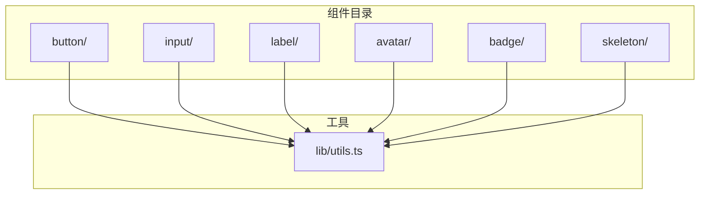
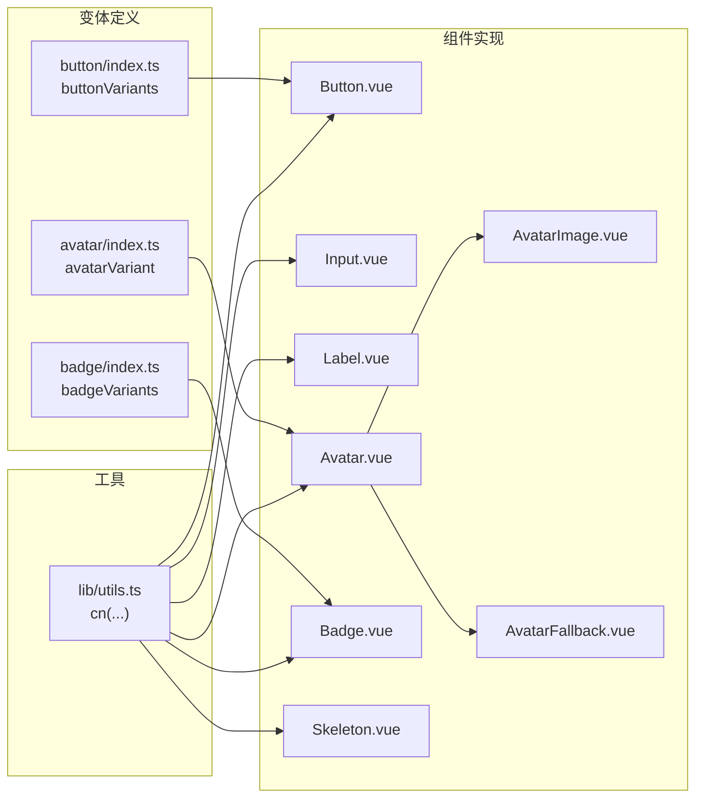
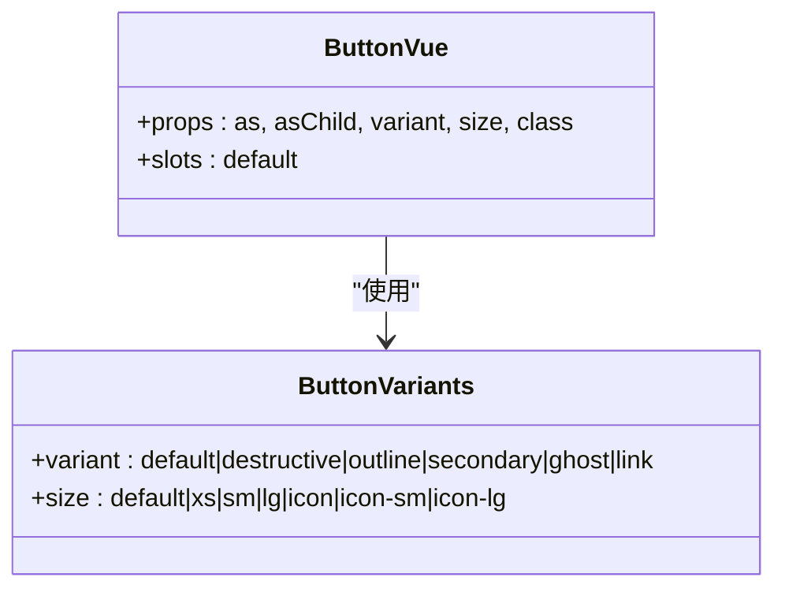
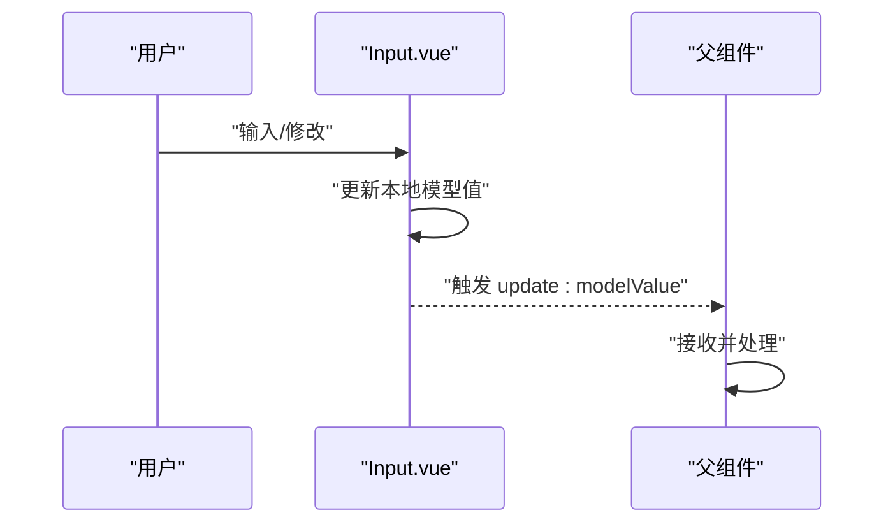
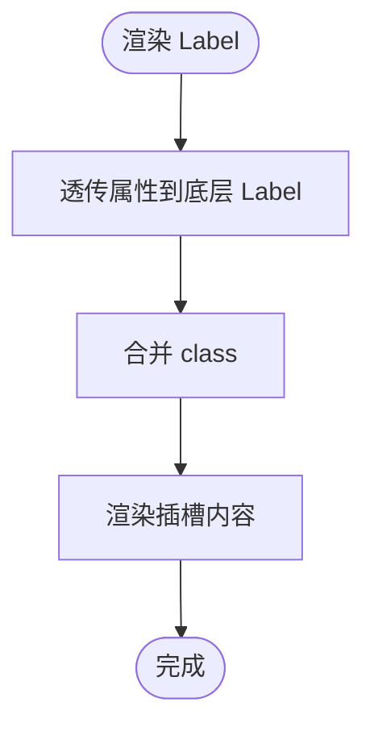
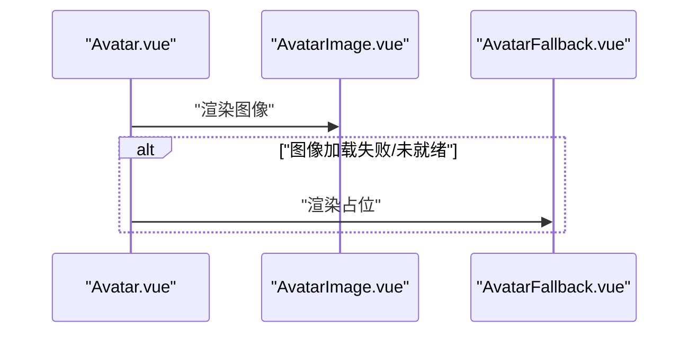
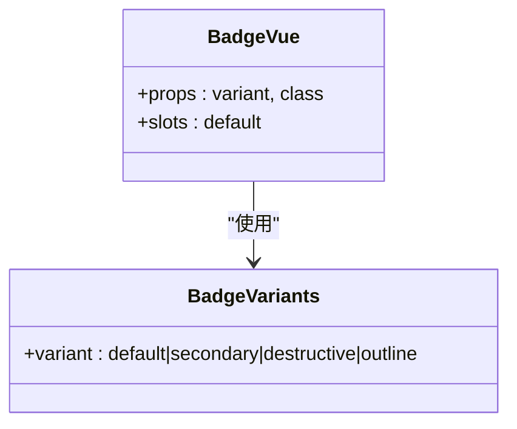
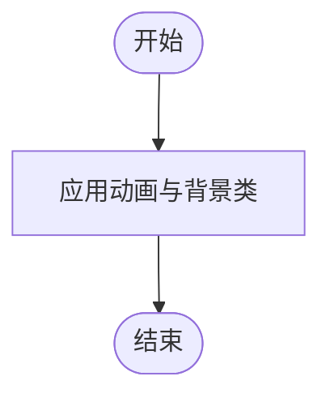
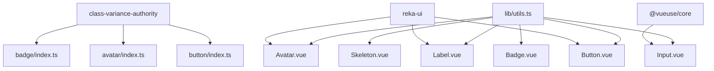

# 基础组件

<cite>
**本文引用的文件**
- [Button.vue](file://src/renderer/src/components/ui/button/Button.vue)
- [button/index.ts](file://src/renderer/src/components/ui/button/index.ts)
- [Input.vue](file://src/renderer/src/components/ui/input/Input.vue)
- [input/index.ts](file://src/renderer/src/components/ui/input/index.ts)
- [Label.vue](file://src/renderer/src/components/ui/label/Label.vue)
- [label/index.ts](file://src/renderer/src/components/ui/label/index.ts)
- [Avatar.vue](file://src/renderer/src/components/ui/avatar/Avatar.vue)
- [avatar/index.ts](file://src/renderer/src/components/ui/avatar/index.ts)
- [AvatarImage.vue](file://src/renderer/src/components/ui/avatar/AvatarImage.vue)
- [AvatarFallback.vue](file://src/renderer/src/components/ui/avatar/AvatarFallback.vue)
- [Badge.vue](file://src/renderer/src/components/ui/badge/Badge.vue)
- [badge/index.ts](file://src/renderer/src/components/ui/badge/index.ts)
- [Skeleton.vue](file://src/renderer/src/components/ui/skeleton/Skeleton.vue)
- [utils.ts](file://src/renderer/src/lib/utils.ts)
</cite>

## 目录
1. [简介](#简介)
2. [项目结构](#项目结构)
3. [核心组件](#核心组件)
4. [架构总览](#架构总览)
5. [详细组件分析](#详细组件分析)
6. [依赖分析](#依赖分析)
7. [性能考量](#性能考量)
8. [故障排查指南](#故障排查指南)
9. [结论](#结论)
10. [附录](#附录)

## 简介
本文件为该仓库基础UI组件库的使用与开发指南，聚焦以下组件：按钮、输入框、标签、头像（含图像与占位）、徽章、骨架屏。文档从设计理念、实现原理、属性配置、事件处理、插槽使用、样式定制、可访问性支持、状态管理与响应式行为等方面进行系统阐述，并提供基本用法、组合模式与样式覆盖方法，以及扩展与自定义开发建议。

## 项目结构
基础组件位于渲染端源码目录下，采用按功能域分层组织：每个组件独立目录包含组件实现与变体定义，公共工具函数集中于通用库模块。

图表来源
- [Button.vue:1-29](file://src/renderer/src/components/ui/button/Button.vue#L1-L29)
- [Input.vue:1-34](file://src/renderer/src/components/ui/input/Input.vue#L1-L34)
- [Label.vue:1-26](file://src/renderer/src/components/ui/label/Label.vue#L1-L26)
- [Avatar.vue:1-23](file://src/renderer/src/components/ui/avatar/Avatar.vue#L1-L23)
- [Badge.vue:1-18](file://src/renderer/src/components/ui/badge/Badge.vue#L1-L18)
- [Skeleton.vue:1-18](file://src/renderer/src/components/ui/skeleton/Skeleton.vue#L1-L18)
- [utils.ts:1-8](file://src/renderer/src/lib/utils.ts#L1-L8)

章节来源
- [Button.vue:1-29](file://src/renderer/src/components/ui/button/Button.vue#L1-L29)
- [Input.vue:1-34](file://src/renderer/src/components/ui/input/Input.vue#L1-L34)
- [Label.vue:1-26](file://src/renderer/src/components/ui/label/Label.vue#L1-L26)
- [Avatar.vue:1-23](file://src/renderer/src/components/ui/avatar/Avatar.vue#L1-L23)
- [Badge.vue:1-18](file://src/renderer/src/components/ui/badge/Badge.vue#L1-L18)
- [Skeleton.vue:1-18](file://src/renderer/src/components/ui/skeleton/Skeleton.vue#L1-L18)
- [utils.ts:1-8](file://src/renderer/src/lib/utils.ts#L1-L8)

## 核心组件
- 按钮 Button：基于语义化原生元素封装，支持多种外观与尺寸变体，通过变体工厂统一生成类名，支持透传原生属性与插槽。
- 输入框 Input：基于 v-model 的受控/非受控双形态，内置无障碍属性与焦点样式，支持默认值与禁用态。
- 标签 Label：对 reka-ui 的 Label 进行轻量封装，保留原生语义，提供可选的类名合并与插槽。
- 头像 Avatar：由根容器、图像与占位三部分组成，支持尺寸与形状变体，保持可访问性与可替换性。
- 徽章 Badge：用于信息标记与状态提示，支持多变体与插槽。
- 骨架屏 Skeleton：用于加载态占位，提供统一动画与背景色。

章节来源
- [Button.vue:1-29](file://src/renderer/src/components/ui/button/Button.vue#L1-L29)
- [Input.vue:1-34](file://src/renderer/src/components/ui/input/Input.vue#L1-L34)
- [Label.vue:1-26](file://src/renderer/src/components/ui/label/Label.vue#L1-L26)
- [Avatar.vue:1-23](file://src/renderer/src/components/ui/avatar/Avatar.vue#L1-L23)
- [AvatarImage.vue:1-13](file://src/renderer/src/components/ui/avatar/AvatarImage.vue#L1-L13)
- [AvatarFallback.vue:1-13](file://src/renderer/src/components/ui/avatar/AvatarFallback.vue#L1-L13)
- [Badge.vue:1-18](file://src/renderer/src/components/ui/badge/Badge.vue#L1-L18)
- [Skeleton.vue:1-18](file://src/renderer/src/components/ui/skeleton/Skeleton.vue#L1-L18)

## 架构总览
组件遵循“变体工厂 + 工具函数”的统一风格：通过 class-variance-authority 定义变体，借助工具函数合并 Tailwind 类，保证一致的外观与可维护性；组件以最小包装实现语义化与可访问性。

图表来源
- [button/index.ts:1-39](file://src/renderer/src/components/ui/button/index.ts#L1-L39)
- [avatar/index.ts:1-26](file://src/renderer/src/components/ui/avatar/index.ts#L1-L26)
- [badge/index.ts:1-27](file://src/renderer/src/components/ui/badge/index.ts#L1-L27)
- [Button.vue:1-29](file://src/renderer/src/components/ui/button/Button.vue#L1-L29)
- [Input.vue:1-34](file://src/renderer/src/components/ui/input/Input.vue#L1-L34)
- [Label.vue:1-26](file://src/renderer/src/components/ui/label/Label.vue#L1-L26)
- [Avatar.vue:1-23](file://src/renderer/src/components/ui/avatar/Avatar.vue#L1-L23)
- [AvatarImage.vue:1-13](file://src/renderer/src/components/ui/avatar/AvatarImage.vue#L1-L13)
- [AvatarFallback.vue:1-13](file://src/renderer/src/components/ui/avatar/AvatarFallback.vue#L1-L13)
- [Badge.vue:1-18](file://src/renderer/src/components/ui/badge/Badge.vue#L1-L18)
- [Skeleton.vue:1-18](file://src/renderer/src/components/ui/skeleton/Skeleton.vue#L1-L18)
- [utils.ts:1-8](file://src/renderer/src/lib/utils.ts#L1-L8)

## 详细组件分析

### 按钮 Button
- 设计理念
  - 以语义化原生元素为根节点，确保可访问性与键盘导航。
  - 通过变体工厂统一管理外观与尺寸，避免重复样式逻辑。
- 关键属性
  - as / asChild：透传到底层原语，支持替换为其他HTML标签或子元素。
  - variant：外观变体（如 default、destructive、outline、secondary、ghost、link）。
  - size：尺寸变体（如 default、xs、sm、lg、icon、icon-sm、icon-lg）。
  - class：额外类名合并。
- 事件与插槽
  - 支持原生按钮事件（点击等），插槽用于承载内容。
- 可访问性
  - 使用原生按钮语义，结合焦点环与禁用态样式，保障键盘可达性。
- 响应式与状态
  - 尺寸与外观随变体自动适配，禁用态与悬停态具备明确视觉反馈。
- 使用示例与组合
  - 基本用法：在模板中直接使用组件，传入 variant/size/class。
  - 组合模式：与图标、文本组合；在表单中作为提交按钮；与下拉菜单联动。
- 样式覆盖
  - 通过 class 覆盖；或在全局样式中调整变体对应类名。
- 扩展与自定义
  - 新增变体：在变体工厂中添加新条目；新增尺寸：在 size 变体中扩展。
  - 自定义根元素：利用 as/asChild 替换为 a、span 等。

图表来源
- [button/index.ts:6-36](file://src/renderer/src/components/ui/button/index.ts#L6-L36)
- [Button.vue:9-17](file://src/renderer/src/components/ui/button/Button.vue#L9-L17)

章节来源
- [Button.vue:1-29](file://src/renderer/src/components/ui/button/Button.vue#L1-L29)
- [button/index.ts:1-39](file://src/renderer/src/components/ui/button/index.ts#L1-L39)

### 输入框 Input
- 设计理念
  - 提供受控/非受控两种绑定方式，内置无障碍属性与焦点样式。
- 关键属性
  - modelValue / defaultValue：受控/非受控值。
  - class：额外类名合并。
- 事件
  - update:modelValue：双向绑定事件，内部已通过 v-model 管理。
- 插槽与可访问性
  - 未使用插槽；通过原生 input 元素与 aria 属性保障可访问性。
- 响应式与状态
  - 焦点态、禁用态、错误态（通过 aria-invalid）具备明确样式。
- 使用示例与组合
  - 基本用法：v-model 绑定；组合搜索框、表单字段。
- 样式覆盖
  - 通过 class 覆盖；或在全局样式中调整输入框基类。
- 扩展与自定义
  - 可新增前缀/后缀区域（通过外部容器包裹）；扩展校验与错误提示。

图表来源
- [Input.vue:12-19](file://src/renderer/src/components/ui/input/Input.vue#L12-L19)

章节来源
- [Input.vue:1-34](file://src/renderer/src/components/ui/input/Input.vue#L1-L34)
- [input/index.ts:1-2](file://src/renderer/src/components/ui/input/index.ts#L1-L2)

### 标签 Label
- 设计理念
  - 对 reka-ui 的 Label 进行轻量封装，保留原生语义与可访问性。
- 关键属性
  - class：额外类名合并。
  - 其他属性透传至底层 Label。
- 插槽与可访问性
  - 插槽承载文本；通过底层组件保障与表单控件的关联。
- 响应式与状态
  - 禁用态样式通过 peer-disabled 伪类控制。
- 使用示例与组合
  - 与输入框、选择器等表单控件配合使用。
- 样式覆盖
  - 通过 class 覆盖；或在全局样式中调整 Label 基类。
- 扩展与自定义
  - 可新增加粗/强调等变体（通过外部容器或变体工厂）。

图表来源
- [Label.vue:10-24](file://src/renderer/src/components/ui/label/Label.vue#L10-L24)

章节来源
- [Label.vue:1-26](file://src/renderer/src/components/ui/label/Label.vue#L1-L26)
- [label/index.ts:1-2](file://src/renderer/src/components/ui/label/index.ts#L1-L2)

### 头像 Avatar（含图像与占位）
- 设计理念
  - 由根容器、图像与占位三部分组成，支持尺寸与形状变体，兼顾可访问性与可替换性。
- 关键属性
  - Avatar 根容器：size（sm/base/lg）、shape（circle/square）、class。
  - AvatarImage：透传底层属性，设置图片填充策略。
  - AvatarFallback：占位内容，通常为首字母或占位图。
- 插槽与可访问性
  - 图像与占位均支持插槽；根容器负责语义化与可访问性。
- 响应式与状态
  - 尺寸与形状通过变体工厂映射；占位与图像切换由底层组件驱动。
- 使用示例与组合
  - 基本用法：根容器包裹图像与占位；组合用户信息卡片。
- 样式覆盖
  - 通过 class 覆盖；或在全局样式中调整变体对应类名。
- 扩展与自定义
  - 新增尺寸/形状：在变体工厂中扩展；新增占位策略（如 initials）。

图表来源
- [Avatar.vue:8-15](file://src/renderer/src/components/ui/avatar/Avatar.vue#L8-L15)
- [AvatarImage.vue:5-11](file://src/renderer/src/components/ui/avatar/AvatarImage.vue#L5-L11)
- [AvatarFallback.vue:5-11](file://src/renderer/src/components/ui/avatar/AvatarFallback.vue#L5-L11)
- [avatar/index.ts:8-23](file://src/renderer/src/components/ui/avatar/index.ts#L8-L23)

章节来源
- [Avatar.vue:1-23](file://src/renderer/src/components/ui/avatar/Avatar.vue#L1-L23)
- [AvatarImage.vue:1-13](file://src/renderer/src/components/ui/avatar/AvatarImage.vue#L1-L13)
- [AvatarFallback.vue:1-13](file://src/renderer/src/components/ui/avatar/AvatarFallback.vue#L1-L13)
- [avatar/index.ts:1-26](file://src/renderer/src/components/ui/avatar/index.ts#L1-L26)

### 徽章 Badge
- 设计理念
  - 用于信息标记与状态提示，支持多变体与插槽。
- 关键属性
  - variant：变体（default、secondary、destructive、outline）。
  - class：额外类名合并。
- 插槽与可访问性
  - 插槽承载徽章内容；组件为静态容器，不涉及交互。
- 响应式与状态
  - 变体映射不同边框与背景色，突出重要性。
- 使用示例与组合
  - 基本用法：在按钮/菜单项旁显示未读数；组合通知徽章。
- 样式覆盖
  - 通过 class 覆盖；或在全局样式中调整变体对应类名。
- 扩展与自定义
  - 新增变体：在变体工厂中扩展；新增尺寸/圆角策略。

图表来源
- [badge/index.ts:6-24](file://src/renderer/src/components/ui/badge/index.ts#L6-L24)
- [Badge.vue:7-10](file://src/renderer/src/components/ui/badge/Badge.vue#L7-L10)

章节来源
- [Badge.vue:1-18](file://src/renderer/src/components/ui/badge/Badge.vue#L1-L18)
- [badge/index.ts:1-27](file://src/renderer/src/components/ui/badge/index.ts#L1-L27)

### 骨架屏 Skeleton
- 设计理念
  - 用于加载态占位，提供统一动画与背景色，提升感知性能。
- 关键属性
  - class：额外类名合并。
- 插槽与可访问性
  - 未使用插槽；为静态占位元素。
- 响应式与状态
  - 通过动画类实现脉动效果；背景色与圆角由类名控制。
- 使用示例与组合
  - 基本用法：列表/卡片加载时显示骨架；组合图文块。
- 样式覆盖
  - 通过 class 覆盖；或在全局样式中调整动画与背景。
- 扩展与自定义
  - 可新增形状/尺寸变体（通过外部容器或变体工厂）。

图表来源
- [Skeleton.vue:5-9](file://src/renderer/src/components/ui/skeleton/Skeleton.vue#L5-L9)
- [Skeleton.vue:12-16](file://src/renderer/src/components/ui/skeleton/Skeleton.vue#L12-L16)

章节来源
- [Skeleton.vue:1-18](file://src/renderer/src/components/ui/skeleton/Skeleton.vue#L1-L18)

## 依赖分析
- 组件间耦合
  - 各组件相对独立，仅共享工具函数 cn。
- 外部依赖
  - reka-ui：提供语义化原语与可访问性能力。
  - class-variance-authority：提供变体工厂与类型推导。
  - @vueuse/core：提供 v-model 辅助工具。
  - tailwind-merge/clsx：合并类名，避免冲突。
- 接口契约
  - 组件通过 props 与插槽暴露能力；变体工厂统一输出类名。

图表来源
- [Button.vue:2-7](file://src/renderer/src/components/ui/button/Button.vue#L2-L7)
- [Label.vue:2-6](file://src/renderer/src/components/ui/label/Label.vue#L2-L6)
- [Avatar.vue:3-6](file://src/renderer/src/components/ui/avatar/Avatar.vue#L3-L6)
- [button/index.ts:1-2](file://src/renderer/src/components/ui/button/index.ts#L1-L2)
- [avatar/index.ts:1-2](file://src/renderer/src/components/ui/avatar/index.ts#L1-L2)
- [badge/index.ts:1-2](file://src/renderer/src/components/ui/badge/index.ts#L1-L2)
- [Input.vue:3-4](file://src/renderer/src/components/ui/input/Input.vue#L3-L4)
- [utils.ts:1-8](file://src/renderer/src/lib/utils.ts#L1-L8)

章节来源
- [Button.vue:1-29](file://src/renderer/src/components/ui/button/Button.vue#L1-L29)
- [Label.vue:1-26](file://src/renderer/src/components/ui/label/Label.vue#L1-L26)
- [Avatar.vue:1-23](file://src/renderer/src/components/ui/avatar/Avatar.vue#L1-L23)
- [button/index.ts:1-39](file://src/renderer/src/components/ui/button/index.ts#L1-L39)
- [avatar/index.ts:1-26](file://src/renderer/src/components/ui/avatar/index.ts#L1-L26)
- [badge/index.ts:1-27](file://src/renderer/src/components/ui/badge/index.ts#L1-L27)
- [Input.vue:1-34](file://src/renderer/src/components/ui/input/Input.vue#L1-L34)
- [utils.ts:1-8](file://src/renderer/src/lib/utils.ts#L1-L8)

## 性能考量
- 渲染开销
  - 组件均为轻量包装，主要成本来自类名合并与变体计算，开销极低。
- 样式体积
  - 通过变体工厂集中定义类名，避免重复样式；Tailwind 按需打包可进一步优化。
- 动画与交互
  - 骨架屏使用简单动画；按钮与输入框的过渡类名较少，影响有限。
- 建议
  - 在大型列表中谨慎使用复杂动画；优先使用原子化类名减少重排。

## 故障排查指南
- 无法获得焦点环或键盘导航异常
  - 检查是否使用原生按钮语义；确认未被外部样式覆盖关键焦点类。
- 输入框无法双向绑定
  - 确认使用 v-model；检查事件名称是否为 update:modelValue。
- 头像图像不显示
  - 检查图像加载状态；确认占位组件是否正确渲染。
- 徽章样式错乱
  - 检查传入的 variant 是否在变体工厂定义范围内。
- 骨架屏闪烁或不生效
  - 检查动画类是否被覆盖；确认容器具备合适的尺寸。

## 结论
该基础组件库以简洁、可访问、可扩展为核心目标，通过统一的变体工厂与类名合并策略，实现了高内聚、低耦合的组件体系。开发者可在不破坏一致性的情况下快速扩展与定制组件，满足多样化的界面需求。

## 附录
- 最佳实践
  - 优先使用语义化原生元素；合理使用 as/asChild 替换根元素。
  - 通过变体工厂扩展外观与尺寸，避免硬编码样式。
  - 使用 class 覆盖与全局样式相结合的方式进行主题化。
- 常见问题
  - 样式冲突：优先使用变体工厂；必要时通过更具体的类名覆盖。
  - 可访问性：确保标签与输入框关联；为交互元素提供键盘可达性。
- 扩展清单
  - 新增组件：参考现有目录结构与变体工厂模式。
  - 新增变体：在对应 index.ts 中扩展 cva；在组件中消费新变体。
  - 主题化：通过 Tailwind 配置与全局类名覆盖实现。