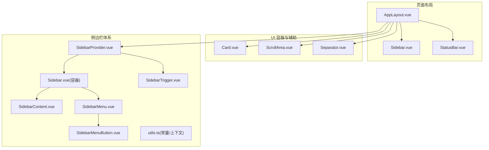
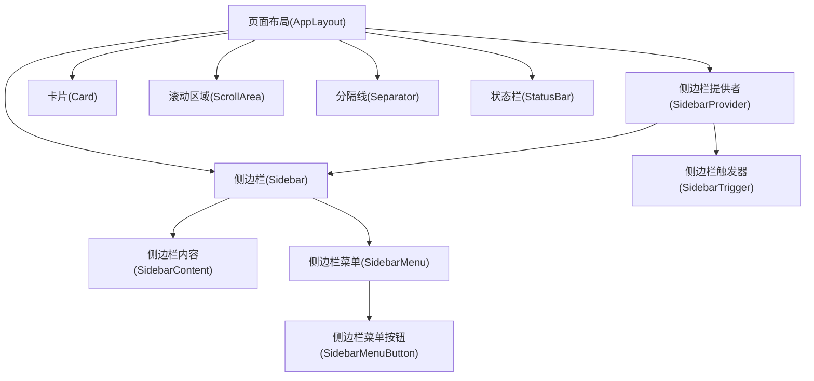
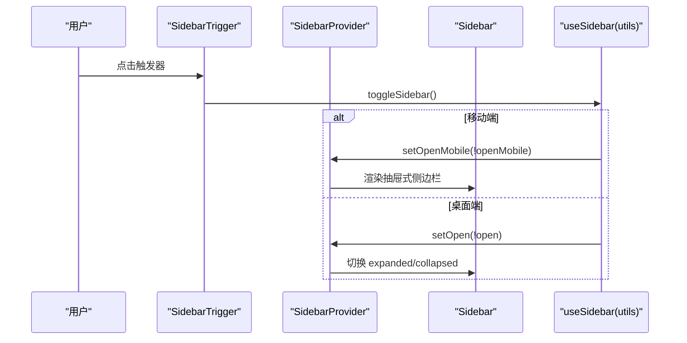
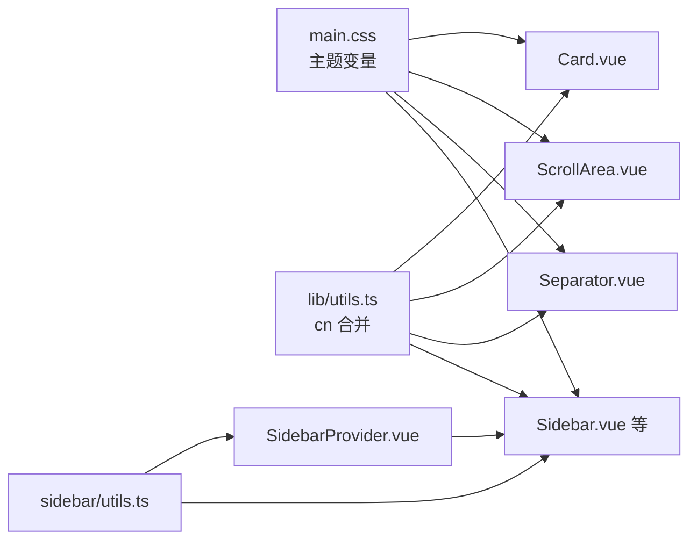

# 布局组件

<cite>
**本文引用的文件**
- [AppLayout.vue](file://src/renderer/src/components/layout/AppLayout.vue)
- [Sidebar.vue](file://src/renderer/src/components/layout/Sidebar.vue)
- [StatusBar.vue](file://src/renderer/src/components/layout/StatusBar.vue)
- [Card.vue](file://src/renderer/src/components/ui/card/Card.vue)
- [ScrollArea.vue](file://src/renderer/src/components/ui/scroll-area/ScrollArea.vue)
- [Separator.vue](file://src/renderer/src/components/ui/separator/Separator.vue)
- [index.ts（侧边栏导出）](file://src/renderer/src/components/ui/sidebar/index.ts)
- [Sidebar.vue（侧边栏容器）](file://src/renderer/src/components/ui/sidebar/Sidebar.vue)
- [SidebarContent.vue](file://src/renderer/src/components/ui/sidebar/SidebarContent.vue)
- [SidebarProvider.vue](file://src/renderer/src/components/ui/sidebar/SidebarProvider.vue)
- [SidebarMenu.vue](file://src/renderer/src/components/ui/sidebar/SidebarMenu.vue)
- [SidebarMenuButton.vue](file://src/renderer/src/components/ui/sidebar/SidebarMenuButton.vue)
- [SidebarTrigger.vue](file://src/renderer/src/components/ui/sidebar/SidebarTrigger.vue)
- [utils.ts（侧边栏上下文与常量）](file://src/renderer/src/components/ui/sidebar/utils.ts)
- [main.css（主题与CSS变量）](file://src/renderer/src/assets/main.css)
- [utils.ts（类名合并工具）](file://src/renderer/src/lib/utils.ts)
</cite>

## 目录
1. [简介](#简介)
2. [项目结构](#项目结构)
3. [核心组件](#核心组件)
4. [架构总览](#架构总览)
5. [详细组件分析](#详细组件分析)
6. [依赖关系分析](#依赖关系分析)
7. [性能考量](#性能考量)
8. [故障排查指南](#故障排查指南)
9. [结论](#结论)
10. [附录](#附录)

## 简介
本文件面向布局组件的使用与开发，聚焦以下容器与辅助组件：卡片、侧边栏、分隔线、滚动区域。文档从设计理念、空间分配、层级管理、响应式行为入手，结合嵌套使用模式、内容排版与视觉层次构建，给出组合使用示例、网格系统集成与自适应布局方案，并解释样式继承、主题变量与CSS自定义属性，帮助开发者构建结构清晰、层次分明的界面布局。

## 项目结构
布局相关组件主要位于渲染端的 UI 组件库与页面布局层：
- 页面级布局：AppLayout、Sidebar、StatusBar
- 容器与辅助：Card、ScrollArea、Separator
- 侧边栏体系：SidebarProvider、Sidebar、SidebarContent、SidebarMenu、SidebarMenuButton、SidebarTrigger、utils（含主题变量与上下文）

**图表来源**
- [AppLayout.vue:1-24](file://src/renderer/src/components/layout/AppLayout.vue#L1-L24)
- [Sidebar.vue:1-67](file://src/renderer/src/components/layout/Sidebar.vue#L1-L67)
- [StatusBar.vue:1-85](file://src/renderer/src/components/layout/StatusBar.vue#L1-L85)
- [Card.vue:1-22](file://src/renderer/src/components/ui/card/Card.vue#L1-L22)
- [ScrollArea.vue:1-27](file://src/renderer/src/components/ui/scroll-area/ScrollArea.vue#L1-L27)
- [Separator.vue:1-30](file://src/renderer/src/components/ui/separator/Separator.vue#L1-L30)
- [SidebarProvider.vue:1-82](file://src/renderer/src/components/ui/sidebar/SidebarProvider.vue#L1-L82)
- [Sidebar.vue（侧边栏容器）:1-86](file://src/renderer/src/components/ui/sidebar/Sidebar.vue#L1-L86)
- [SidebarContent.vue:1-18](file://src/renderer/src/components/ui/sidebar/SidebarContent.vue#L1-L18)
- [SidebarMenu.vue:1-18](file://src/renderer/src/components/ui/sidebar/SidebarMenu.vue#L1-L18)
- [SidebarMenuButton.vue:1-49](file://src/renderer/src/components/ui/sidebar/SidebarMenuButton.vue#L1-L49)
- [SidebarTrigger.vue:1-27](file://src/renderer/src/components/ui/sidebar/SidebarTrigger.vue#L1-L27)
- [utils.ts（侧边栏上下文与常量）:1-20](file://src/renderer/src/components/ui/sidebar/utils.ts#L1-L20)

**章节来源**
- [AppLayout.vue:1-24](file://src/renderer/src/components/layout/AppLayout.vue#L1-L24)
- [Sidebar.vue:1-67](file://src/renderer/src/components/layout/Sidebar.vue#L1-L67)
- [StatusBar.vue:1-85](file://src/renderer/src/components/layout/StatusBar.vue#L1-L85)

## 核心组件
- 卡片（Card）：用于承载独立信息区块，提供圆角、边框与阴影，适合作为内容容器或分组容器。
- 滚动区域（ScrollArea）：封装可滚动视口与滚动条，确保在不同平台与浏览器下一致的滚动体验。
- 分隔线（Separator）：水平或垂直分隔符，用于视觉分区与层级区分。
- 侧边栏（Sidebar）：支持桌面端固定/浮动/嵌入三种变体，移动端抽屉式展示；配合 Provider 管理状态与键盘快捷键。
- 侧边栏菜单（SidebarMenu、SidebarMenuButton）：提供导航项按钮与提示气泡，支持激活态与尺寸/风格变体。
- 侧边栏触发器（SidebarTrigger）：用于在移动端打开/关闭侧边栏或在桌面端切换展开/收起。

**章节来源**
- [Card.vue:1-22](file://src/renderer/src/components/ui/card/Card.vue#L1-L22)
- [ScrollArea.vue:1-27](file://src/renderer/src/components/ui/scroll-area/ScrollArea.vue#L1-L27)
- [Separator.vue:1-30](file://src/renderer/src/components/ui/separator/Separator.vue#L1-L30)
- [Sidebar.vue（侧边栏容器）:1-86](file://src/renderer/src/components/ui/sidebar/Sidebar.vue#L1-L86)
- [SidebarMenu.vue:1-18](file://src/renderer/src/components/ui/sidebar/SidebarMenu.vue#L1-L18)
- [SidebarMenuButton.vue:1-49](file://src/renderer/src/components/ui/sidebar/SidebarMenuButton.vue#L1-L49)
- [SidebarTrigger.vue:1-27](file://src/renderer/src/components/ui/sidebar/SidebarTrigger.vue#L1-L27)

## 架构总览
整体采用“页面布局 + 容器组件 + 侧边栏体系”的分层设计。页面布局通过 Provider 提供上下文，侧边栏容器根据设备与配置渲染不同形态；内容区以卡片、滚动区域、分隔线等进行组织与分层。

**图表来源**
- [AppLayout.vue:1-24](file://src/renderer/src/components/layout/AppLayout.vue#L1-L24)
- [SidebarProvider.vue:1-82](file://src/renderer/src/components/ui/sidebar/SidebarProvider.vue#L1-L82)
- [Sidebar.vue（侧边栏容器）:1-86](file://src/renderer/src/components/ui/sidebar/Sidebar.vue#L1-L86)
- [SidebarContent.vue:1-18](file://src/renderer/src/components/ui/sidebar/SidebarContent.vue#L1-L18)
- [SidebarMenu.vue:1-18](file://src/renderer/src/components/ui/sidebar/SidebarMenu.vue#L1-L18)
- [SidebarMenuButton.vue:1-49](file://src/renderer/src/components/ui/sidebar/SidebarMenuButton.vue#L1-L49)
- [SidebarTrigger.vue:1-27](file://src/renderer/src/components/ui/sidebar/SidebarTrigger.vue#L1-L27)
- [Card.vue:1-22](file://src/renderer/src/components/ui/card/Card.vue#L1-L22)
- [ScrollArea.vue:1-27](file://src/renderer/src/components/ui/scroll-area/ScrollArea.vue#L1-L27)
- [Separator.vue:1-30](file://src/renderer/src/components/ui/separator/Separator.vue#L1-L30)
- [StatusBar.vue:1-85](file://src/renderer/src/components/layout/StatusBar.vue#L1-L85)

## 详细组件分析

### 卡片（Card）
- 设计理念：作为信息区块的容器，强调视觉上的“浮层”感，适合放置表单、统计、操作面板等。
- 空间分配：默认占满父容器宽度，内部通过子组件（如 CardHeader、CardContent、CardFooter）进行垂直分区。
- 视觉层次：圆角、边框与阴影形成层级，搭配背景色变量实现明暗主题下的统一外观。
- 使用建议：在内容较多时配合滚动区域使用；在需要分组展示时用分隔线进行横向/纵向分割。

**章节来源**
- [Card.vue:1-22](file://src/renderer/src/components/ui/card/Card.vue#L1-L22)

### 滚动区域（ScrollArea）
- 设计理念：统一滚动体验，避免平台差异导致的滚动条样式不一致。
- 空间分配：根容器相对定位，视口填充剩余空间，滚动条与角落组件按需渲染。
- 行为特性：支持委托属性透传，便于与外部交互组件协作。
- 使用建议：与卡片、表格、列表等长内容场景结合；注意在移动端保持触控友好性。

**章节来源**
- [ScrollArea.vue:1-27](file://src/renderer/src/components/ui/scroll-area/ScrollArea.vue#L1-L27)

### 分隔线（Separator）
- 设计理念：用于视觉分区与层级区分，支持水平/垂直两种方向。
- 空间分配：水平分隔线占满宽度，垂直分隔线占满高度，基于边框色变量保证主题一致性。
- 使用建议：在卡片内部、导航项之间、内容块之间进行清晰的视觉分界。

**章节来源**
- [Separator.vue:1-30](file://src/renderer/src/components/ui/separator/Separator.vue#L1-L30)

### 侧边栏体系（SidebarProvider、Sidebar、SidebarContent、SidebarMenu、SidebarMenuButton、SidebarTrigger）
- 设计理念：一套完整的侧边栏解决方案，覆盖桌面端与移动端、多种变体与交互方式。
- 空间分配与层级：
  - 固定宽度由 CSS 变量控制，移动端宽度独立配置。
  - 支持 left/right 两侧，desktop/floating/inset 三种变体。
  - 通过 z-index 与定位确保层级关系清晰。
- 响应式行为：
  - 移动端使用抽屉式（SheetContent），桌面端使用固定/浮动/嵌入布局。
  - 通过媒体查询与上下文状态（expanded/collapsed）动态切换。
- 交互与快捷键：
  - 提供触发器按钮，支持键盘快捷键快速切换。
  - 状态持久化到 Cookie，提升用户体验。
- 导航与提示：
  - 菜单按钮支持 tooltip，在侧边栏收起时显示标签，增强可用性。
  - 激活态样式与尺寸/风格变体可配置。

**图表来源**
- [SidebarTrigger.vue:1-27](file://src/renderer/src/components/ui/sidebar/SidebarTrigger.vue#L1-L27)
- [SidebarProvider.vue:1-82](file://src/renderer/src/components/ui/sidebar/SidebarProvider.vue#L1-L82)
- [Sidebar.vue（侧边栏容器）:1-86](file://src/renderer/src/components/ui/sidebar/Sidebar.vue#L1-L86)
- [utils.ts（侧边栏上下文与常量）:1-20](file://src/renderer/src/components/ui/sidebar/utils.ts#L1-L20)

**章节来源**
- [SidebarProvider.vue:1-82](file://src/renderer/src/components/ui/sidebar/SidebarProvider.vue#L1-L82)
- [Sidebar.vue（侧边栏容器）:1-86](file://src/renderer/src/components/ui/sidebar/Sidebar.vue#L1-L86)
- [SidebarContent.vue:1-18](file://src/renderer/src/components/ui/sidebar/SidebarContent.vue#L1-L18)
- [SidebarMenu.vue:1-18](file://src/renderer/src/components/ui/sidebar/SidebarMenu.vue#L1-L18)
- [SidebarMenuButton.vue:1-49](file://src/renderer/src/components/ui/sidebar/SidebarMenuButton.vue#L1-L49)
- [SidebarTrigger.vue:1-27](file://src/renderer/src/components/ui/sidebar/SidebarTrigger.vue#L1-L27)
- [utils.ts（侧边栏上下文与常量）:1-20](file://src/renderer/src/components/ui/sidebar/utils.ts#L1-L20)

### 页面布局（AppLayout）
- 设计理念：作为应用主框架，协调侧边栏、内容区与状态栏的布局。
- 空间分配：主内容区使用弹性布局填满剩余空间，状态栏固定在底部。
- 嵌套关系：通过 Provider 包裹侧边栏与内容区，确保上下文一致。

**章节来源**
- [AppLayout.vue:1-24](file://src/renderer/src/components/layout/AppLayout.vue#L1-L24)

### 状态栏（StatusBar）
- 设计理念：展示应用状态、当前账号与时间等辅助信息，采用轻量提示与徽标。
- 响应式行为：在窄屏下仍保持紧凑布局，避免遮挡主要内容。
- 交互：使用 Tooltip 提供额外信息，点击区域明确。

**章节来源**
- [StatusBar.vue:1-85](file://src/renderer/src/components/layout/StatusBar.vue#L1-L85)

## 依赖关系分析
- 主题与样式继承：
  - 全局 CSS 变量集中于主题样式文件，涵盖背景、前景、卡片、弹出层、输入、环形高亮、图表以及侧边栏系列变量。
  - 组件通过 CSS 变量读取颜色值，实现明暗主题自动切换。
- 类名合并工具：
  - 通过工具函数对传入的 class 进行合并与冲突修复，保证组件样式叠加的一致性。
- 侧边栏上下文：
  - Provider 提供状态、开关方法与媒体查询判断，各子组件通过上下文共享状态，降低耦合度。

**图表来源**
- [main.css（主题与CSS变量）:1-124](file://src/renderer/src/assets/main.css#L1-L124)
- [utils.ts（类名合并工具）:1-8](file://src/renderer/src/lib/utils.ts#L1-L8)
- [SidebarProvider.vue:1-82](file://src/renderer/src/components/ui/sidebar/SidebarProvider.vue#L1-L82)
- [utils.ts（侧边栏上下文与常量）:1-20](file://src/renderer/src/components/ui/sidebar/utils.ts#L1-L20)
- [Card.vue:1-22](file://src/renderer/src/components/ui/card/Card.vue#L1-L22)
- [ScrollArea.vue:1-27](file://src/renderer/src/components/ui/scroll-area/ScrollArea.vue#L1-L27)
- [Separator.vue:1-30](file://src/renderer/src/components/ui/separator/Separator.vue#L1-L30)
- [Sidebar.vue（侧边栏容器）:1-86](file://src/renderer/src/components/ui/sidebar/Sidebar.vue#L1-L86)

**章节来源**
- [main.css（主题与CSS变量）:1-124](file://src/renderer/src/assets/main.css#L1-L124)
- [utils.ts（类名合并工具）:1-8](file://src/renderer/src/lib/utils.ts#L1-L8)
- [SidebarProvider.vue:1-82](file://src/renderer/src/components/ui/sidebar/SidebarProvider.vue#L1-L82)
- [utils.ts（侧边栏上下文与常量）:1-20](file://src/renderer/src/components/ui/sidebar/utils.ts#L1-L20)

## 性能考量
- 滚动区域：仅在内容溢出时渲染滚动条，减少不必要的 DOM 节点。
- 侧边栏：桌面端使用固定定位与 CSS 变量控制宽度，避免频繁重排；移动端抽屉式渲染，按需加载。
- 主题切换：通过 CSS 变量与 @apply 实现，避免运行时样式计算开销。
- 状态持久化：Cookie 存储侧边栏状态，减少每次进入页面的计算成本。

## 故障排查指南
- 侧边栏无法展开/收起
  - 检查 Provider 是否正确包裹侧边栏与内容区。
  - 确认触发器是否绑定到正确的上下文方法。
  - 参考路径：[SidebarTrigger.vue:1-27](file://src/renderer/src/components/ui/sidebar/SidebarTrigger.vue#L1-L27)、[SidebarProvider.vue:1-82](file://src/renderer/src/components/ui/sidebar/SidebarProvider.vue#L1-L82)
- 移动端抽屉不出现
  - 确认媒体查询条件与设备宽度匹配。
  - 检查状态开关逻辑与事件绑定。
  - 参考路径：[utils.ts（侧边栏上下文与常量）:1-20](file://src/renderer/src/components/ui/sidebar/utils.ts#L1-L20)
- 滚动条样式异常
  - 确保 ScrollArea 的视口与滚动条组件正确渲染。
  - 参考路径：[ScrollArea.vue:1-27](file://src/renderer/src/components/ui/scroll-area/ScrollArea.vue#L1-L27)
- 主题色不生效
  - 检查全局 CSS 变量是否正确注入与覆盖。
  - 参考路径：[main.css（主题与CSS变量）:1-124](file://src/renderer/src/assets/main.css#L1-L124)

**章节来源**
- [SidebarTrigger.vue:1-27](file://src/renderer/src/components/ui/sidebar/SidebarTrigger.vue#L1-L27)
- [SidebarProvider.vue:1-82](file://src/renderer/src/components/ui/sidebar/SidebarProvider.vue#L1-L82)
- [utils.ts（侧边栏上下文与常量）:1-20](file://src/renderer/src/components/ui/sidebar/utils.ts#L1-L20)
- [ScrollArea.vue:1-27](file://src/renderer/src/components/ui/scroll-area/ScrollArea.vue#L1-L27)
- [main.css（主题与CSS变量）:1-124](file://src/renderer/src/assets/main.css#L1-L124)

## 结论
该布局体系以 Provider 为核心，围绕侧边栏、卡片、滚动区域与分隔线构建了清晰的层级与响应式能力。通过 CSS 自定义属性与主题变量，实现了跨组件的主题一致性；通过上下文与工具函数，降低了组件间的耦合度。开发者可在页面布局中灵活组合这些容器与辅助组件，构建结构清晰、层次分明且具备良好可维护性的界面。

## 附录
- 组合使用示例思路
  - 页面布局：AppLayout 中放置 SidebarProvider、Sidebar、SidebarInset（内容区）、StatusBar。
  - 内容组织：卡片容器承载业务模块，内部使用分隔线进行分区；长内容区域使用滚动区域。
  - 导航与交互：侧边栏菜单按钮支持激活态与提示；触发器用于切换侧边栏。
- 网格系统集成
  - 在卡片或滚动区域内使用网格布局类（如栅格列、间距类）进行内容排列。
- 自适应布局方案
  - 依据媒体查询与侧边栏上下文状态，动态调整布局密度与元素显隐。