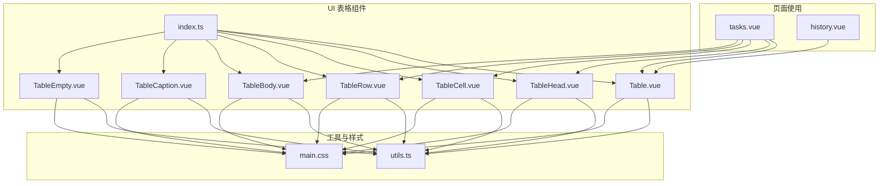
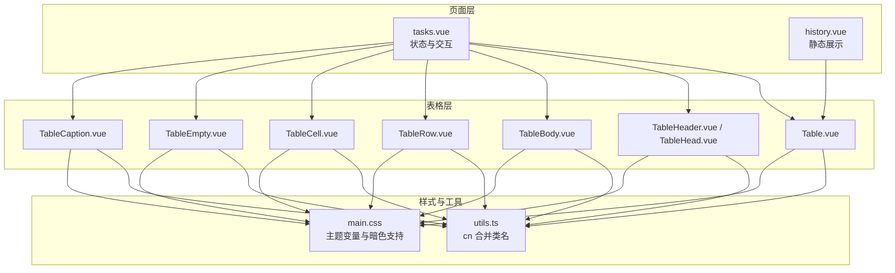
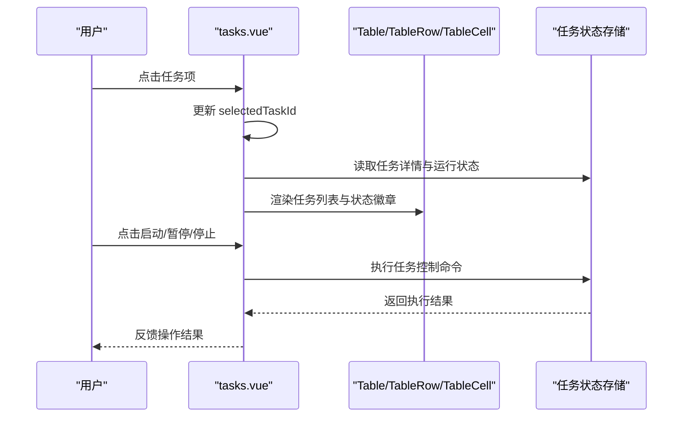
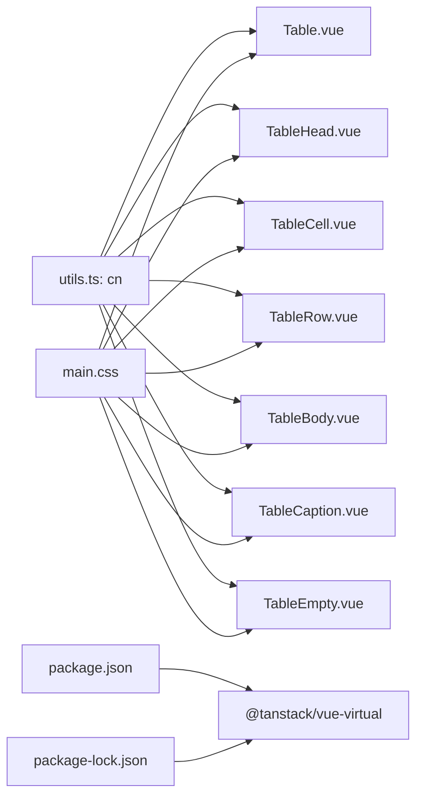

# 数据展示组件

<cite>
**本文引用的文件**
- [Table.vue](file://src/renderer/src/components/ui/table/Table.vue)
- [TableBody.vue](file://src/renderer/src/components/ui/table/TableBody.vue)
- [TableCell.vue](file://src/renderer/src/components/ui/table/TableCell.vue)
- [TableHead.vue](file://src/renderer/src/components/ui/table/TableHead.vue)
- [TableHeader.vue](file://src/renderer/src/components/ui/table/TableHeader.vue)
- [TableRow.vue](file://src/renderer/src/components/ui/table/TableRow.vue)
- [TableCaption.vue](file://src/renderer/src/components/ui/table/TableCaption.vue)
- [TableEmpty.vue](file://src/renderer/src/components/ui/table/TableEmpty.vue)
- [index.ts](file://src/renderer/src/components/ui/table/index.ts)
- [utils.ts](file://src/renderer/src/lib/utils.ts)
- [tasks.vue](file://src/renderer/src/pages/tasks.vue)
- [history.vue](file://src/renderer/src/pages/history.vue)
- [main.css](file://src/renderer/src/assets/main.css)
- [package.json](file://package.json)
- [package-lock.json](file://package-lock.json)
</cite>

## 目录
1. [简介](#简介)
2. [项目结构](#项目结构)
3. [核心组件](#核心组件)
4. [架构总览](#架构总览)
5. [组件详解](#组件详解)
6. [依赖关系分析](#依赖关系分析)
7. [性能与优化](#性能与优化)
8. [故障排查指南](#故障排查指南)
9. [结论](#结论)
10. [附录](#附录)

## 简介
本文件面向“数据展示组件”的使用与开发，聚焦于表格组件的数据渲染、排序、筛选与分页能力的实现方式与最佳实践。结合仓库中的表格子组件与实际页面使用场景，系统阐述组件的数据绑定、列配置、行操作与状态管理；并提供响应式设计、虚拟滚动与性能优化策略建议，以及样式定制、主题适配与可访问性支持方案，帮助开发者构建高效、易用的数据展示界面。

## 项目结构
表格组件位于 UI 组件库目录下，采用细粒度拆分：容器层、表头/表体、行/单元格等，通过统一导出入口集中暴露。页面层在业务页面中按需组合使用，形成完整的数据展示与交互闭环。

**图表来源**
- [index.ts:1-10](file://src/renderer/src/components/ui/table/index.ts#L1-L10)
- [Table.vue:1-17](file://src/renderer/src/components/ui/table/Table.vue#L1-L17)
- [TableHead.vue:1-15](file://src/renderer/src/components/ui/table/TableHead.vue#L1-L15)
- [TableCell.vue:1-22](file://src/renderer/src/components/ui/table/TableCell.vue#L1-L22)
- [TableRow.vue:1-15](file://src/renderer/src/components/ui/table/TableRow.vue#L1-L15)
- [TableBody.vue:1-15](file://src/renderer/src/components/ui/table/TableBody.vue#L1-L15)
- [TableCaption.vue:1-15](file://src/renderer/src/components/ui/table/TableCaption.vue#L1-L15)
- [TableEmpty.vue:1-35](file://src/renderer/src/components/ui/table/TableEmpty.vue#L1-L35)
- [tasks.vue:1-800](file://src/renderer/src/pages/tasks.vue#L1-L800)
- [history.vue:1-102](file://src/renderer/src/pages/history.vue#L1-L102)
- [utils.ts:1-8](file://src/renderer/src/lib/utils.ts#L1-L8)
- [main.css:1-124](file://src/renderer/src/assets/main.css#L1-L124)

**章节来源**
- [index.ts:1-10](file://src/renderer/src/components/ui/table/index.ts#L1-L10)
- [utils.ts:1-8](file://src/renderer/src/lib/utils.ts#L1-L8)
- [main.css:1-124](file://src/renderer/src/assets/main.css#L1-L124)

## 核心组件
- Table：表格容器，负责外层布局与滚动区域，提供类名透传能力，便于主题与样式扩展。
- TableHead / TableHeader：表头与表头组，用于声明列标题与表头样式。
- TableCell：单元格，内置对复选框与内嵌控件的对齐与间距处理。
- TableRow：行元素，内置悬停、选中态与过渡动画，便于行级交互。
- TableBody：表体容器，处理最后一行边框与行内样式。
- TableCaption：表格标题，用于说明性文字。
- TableEmpty：空数据占位行，支持跨列合并与插槽扩展。
- 工具函数 cn：基于 clsx 与 tailwind-merge 的类名合并工具，确保样式覆盖与冲突最小化。

上述组件均通过统一入口导出，便于按需引入与组合使用。

**章节来源**
- [Table.vue:1-17](file://src/renderer/src/components/ui/table/Table.vue#L1-L17)
- [TableHead.vue:1-15](file://src/renderer/src/components/ui/table/TableHead.vue#L1-L15)
- [TableCell.vue:1-22](file://src/renderer/src/components/ui/table/TableCell.vue#L1-L22)
- [TableRow.vue:1-15](file://src/renderer/src/components/ui/table/TableRow.vue#L1-L15)
- [TableBody.vue:1-15](file://src/renderer/src/components/ui/table/TableBody.vue#L1-L15)
- [TableCaption.vue:1-15](file://src/renderer/src/components/ui/table/TableCaption.vue#L1-L15)
- [TableEmpty.vue:1-35](file://src/renderer/src/components/ui/table/TableEmpty.vue#L1-L35)
- [index.ts:1-10](file://src/renderer/src/components/ui/table/index.ts#L1-L10)
- [utils.ts:1-8](file://src/renderer/src/lib/utils.ts#L1-L8)

## 架构总览
表格组件以“容器 + 列/行 + 单元格”三层结构组织，页面通过状态驱动数据渲染，并在需要时引入分页、排序与筛选逻辑。整体遵循 Vue 组合式 API 设计，强调可复用性与可扩展性。

**图表来源**
- [tasks.vue:1-800](file://src/renderer/src/pages/tasks.vue#L1-L800)
- [history.vue:1-102](file://src/renderer/src/pages/history.vue#L1-L102)
- [Table.vue:1-17](file://src/renderer/src/components/ui/table/Table.vue#L1-L17)
- [TableHeader.vue:1-15](file://src/renderer/src/components/ui/table/TableHeader.vue#L1-L15)
- [TableHead.vue:1-15](file://src/renderer/src/components/ui/table/TableHead.vue#L1-L15)
- [TableBody.vue:1-15](file://src/renderer/src/components/ui/table/TableBody.vue#L1-L15)
- [TableRow.vue:1-15](file://src/renderer/src/components/ui/table/TableRow.vue#L1-L15)
- [TableCell.vue:1-22](file://src/renderer/src/components/ui/table/TableCell.vue#L1-L22)
- [TableEmpty.vue:1-35](file://src/renderer/src/components/ui/table/TableEmpty.vue#L1-L35)
- [TableCaption.vue:1-15](file://src/renderer/src/components/ui/table/TableCaption.vue#L1-L15)
- [utils.ts:1-8](file://src/renderer/src/lib/utils.ts#L1-L8)
- [main.css:1-124](file://src/renderer/src/assets/main.css#L1-L124)

## 组件详解

### 表格容器与布局
- Table 提供相对定位与溢出滚动的容器，内部包裹原生 table 元素，支持通过 class 属性透传样式，便于主题适配与响应式控制。
- 该容器为后续的虚拟滚动、固定表头等高级特性提供基础布局环境。

**章节来源**
- [Table.vue:1-17](file://src/renderer/src/components/ui/table/Table.vue#L1-L17)

### 表头与表体
- TableHeader + TableHead：统一表头样式，包含对复选框的对齐处理，保证多交互元素在同一列内的视觉一致性。
- TableBody：为表体容器，内部通过选择器规则隐藏最后一行的底部边框，避免重复边框线。

**章节来源**
- [TableHeader.vue:1-15](file://src/renderer/src/components/ui/table/TableHeader.vue#L1-L15)
- [TableHead.vue:1-15](file://src/renderer/src/components/ui/table/TableHead.vue#L1-L15)
- [TableBody.vue:1-15](file://src/renderer/src/components/ui/table/TableBody.vue#L1-L15)

### 行与单元格
- TableRow：内置悬停与选中态的过渡效果，提供行级交互反馈；支持 data-* 状态属性，便于外部状态同步。
- TableCell：内置对复选框的间距与垂直居中处理，减少业务层重复样式。

**章节来源**
- [TableRow.vue:1-15](file://src/renderer/src/components/ui/table/TableRow.vue#L1-L15)
- [TableCell.vue:1-22](file://src/renderer/src/components/ui/table/TableCell.vue#L1-L22)

### 空数据占位
- TableEmpty：以行+单元格形式呈现空数据提示，支持跨列合并与插槽扩展，适合放置图标、文案或引导按钮。

**章节来源**
- [TableEmpty.vue:1-35](file://src/renderer/src/components/ui/table/TableEmpty.vue#L1-L35)

### 统一导出与工具
- index.ts：集中导出所有表格子组件，便于按需引入与 Tree Shaking。
- utils.ts 中的 cn：将多个类名合并并进行 Tailwind 冲突修复，确保样式叠加稳定可靠。

**章节来源**
- [index.ts:1-10](file://src/renderer/src/components/ui/table/index.ts#L1-L10)
- [utils.ts:1-8](file://src/renderer/src/lib/utils.ts#L1-L8)

### 页面中的使用示例

#### 任务列表页（tasks.vue）
- 使用 Table、TableHeader、TableBody、TableRow、TableCell 组合构建任务列表。
- 通过计算属性与状态管理实现数据筛选（按账号过滤）、选中态切换与行操作（启动、暂停、停止、复制、定时任务、删除）。
- 行内状态徽章与图标配合，直观展示任务运行状态与调度信息。

**图表来源**
- [tasks.vue:1-800](file://src/renderer/src/pages/tasks.vue#L1-L800)
- [Table.vue:1-17](file://src/renderer/src/components/ui/table/Table.vue#L1-L17)
- [TableRow.vue:1-15](file://src/renderer/src/components/ui/table/TableRow.vue#L1-L15)
- [TableCell.vue:1-22](file://src/renderer/src/components/ui/table/TableCell.vue#L1-L22)

**章节来源**
- [tasks.vue:1-800](file://src/renderer/src/pages/tasks.vue#L1-L800)

#### 任务历史页（history.vue）
- 使用 Card 与表格风格的卡片列表展示历史记录，体现静态数据的清晰呈现与可读性。
- 通过格式化函数与状态颜色映射，提升信息密度与可感知性。

**章节来源**
- [history.vue:1-102](file://src/renderer/src/pages/history.vue#L1-L102)

### 数据绑定、列配置与行操作
- 数据绑定：页面通过状态与计算属性驱动表格渲染，支持动态筛选与排序触发。
- 列配置：通过 TableHeader + TableHead 组合声明列标题，TableCell 负责单元格内容渲染与交互元素布局。
- 行操作：在 TableRow 内部或单元格中放置操作按钮，结合状态存储实现启动、暂停、停止等控制流。

**章节来源**
- [tasks.vue:1-800](file://src/renderer/src/pages/tasks.vue#L1-L800)
- [TableHeader.vue:1-15](file://src/renderer/src/components/ui/table/TableHeader.vue#L1-L15)
- [TableHead.vue:1-15](file://src/renderer/src/components/ui/table/TableHead.vue#L1-L15)
- [TableCell.vue:1-22](file://src/renderer/src/components/ui/table/TableCell.vue#L1-L22)
- [TableRow.vue:1-15](file://src/renderer/src/components/ui/table/TableRow.vue#L1-L15)

### 排序、筛选与分页
- 当前仓库中的表格子组件未直接实现排序、筛选与分页逻辑，但具备良好扩展性：
  - 排序：可在 TableHeader 中加入可点击的排序指示器与回调，结合计算属性或外部状态进行排序。
  - 筛选：通过页面层的输入控件与计算属性实现关键词、状态、时间等维度的筛选。
  - 分页：在页面层维护当前页码与每页条数，结合 TableBody 渲染当前页数据片段。
- 以上均为概念性实现建议，便于在现有组件基础上扩展。

[本节为概念性说明，不直接分析具体源码文件，故不附加“章节来源”]

## 依赖关系分析
- 组件间依赖：各子组件均依赖工具函数 cn 进行类名合并，Theme 通过 CSS 变量与暗色变体提供主题支持。
- 页面依赖：tasks.vue 与 history.vue 作为典型使用方，分别展示了动态数据与静态数据的表格化呈现。
- 外部依赖：项目中存在虚拟滚动相关依赖，可用于后续性能优化。

**图表来源**
- [utils.ts:1-8](file://src/renderer/src/lib/utils.ts#L1-L8)
- [Table.vue:1-17](file://src/renderer/src/components/ui/table/Table.vue#L1-L17)
- [TableHead.vue:1-15](file://src/renderer/src/components/ui/table/TableHead.vue#L1-L15)
- [TableCell.vue:1-22](file://src/renderer/src/components/ui/table/TableCell.vue#L1-L22)
- [TableRow.vue:1-15](file://src/renderer/src/components/ui/table/TableRow.vue#L1-L15)
- [TableBody.vue:1-15](file://src/renderer/src/components/ui/table/TableBody.vue#L1-L15)
- [TableCaption.vue:1-15](file://src/renderer/src/components/ui/table/TableCaption.vue#L1-L15)
- [TableEmpty.vue:1-35](file://src/renderer/src/components/ui/table/TableEmpty.vue#L1-L35)
- [main.css:1-124](file://src/renderer/src/assets/main.css#L1-L124)
- [package.json](file://package.json)
- [package-lock.json](file://package-lock.json)

**章节来源**
- [package.json](file://package.json)
- [package-lock.json](file://package-lock.json)

## 性能与优化
- 响应式设计：利用 Tailwind 类与 CSS 变量，结合容器层的宽度与滚动控制，实现不同屏幕下的自适应展示。
- 虚拟滚动：项目已引入虚拟滚动相关依赖，建议在大数据量场景下启用，仅渲染可视区域内的行，显著降低 DOM 节点数量与重绘成本。
- 渲染优化：通过计算属性与浅比较减少不必要的重渲染；在 TableBody 中按需渲染当前页数据，避免一次性渲染全量数据。
- 动画与交互：行悬停与选中态使用过渡动画，注意在大量行场景下适度关闭或简化动画以提升性能。

[本节为通用性能指导，不直接分析具体源码文件，故不附加“章节来源”]

## 故障排查指南
- 样式冲突：若出现类名覆盖异常，检查是否正确使用 cn 工具进行类名合并；确认 Tailwind 配置与主题变量未被意外覆盖。
- 暗色模式：确认根元素或容器上存在暗色变体类，CSS 变量已在主题文件中定义，确保组件在暗色模式下正常显示。
- 行高亮与选中态：若行选中态不生效，检查是否正确传递 data-* 状态属性并与外部状态保持一致。
- 空数据展示：TableEmpty 的跨列合并与插槽内容需与表头列数一致，避免布局错位。

**章节来源**
- [utils.ts:1-8](file://src/renderer/src/lib/utils.ts#L1-L8)
- [main.css:1-124](file://src/renderer/src/assets/main.css#L1-L124)
- [TableRow.vue:1-15](file://src/renderer/src/components/ui/table/TableRow.vue#L1-L15)
- [TableEmpty.vue:1-35](file://src/renderer/src/components/ui/table/TableEmpty.vue#L1-L35)

## 结论
本仓库的表格组件以轻量、可组合的方式提供了数据展示的基础能力。通过页面层的状态与计算属性，可以灵活实现筛选、排序与分页等高级功能；借助虚拟滚动与主题系统，可在保证体验的同时兼顾性能。建议在实际项目中结合业务需求，逐步扩展排序、筛选与分页逻辑，并充分利用组件的类名透传能力进行样式定制与主题适配。

## 附录

### 样式定制与主题适配
- 主题变量：通过 CSS 自定义属性与暗色变体，统一管理背景、前景、卡片、输入等色彩体系。
- 组件样式：各表格子组件通过 cn 合并类名，支持通过 class 属性覆盖默认样式，满足不同业务场景的视觉需求。

**章节来源**
- [main.css:1-124](file://src/renderer/src/assets/main.css#L1-L124)
- [utils.ts:1-8](file://src/renderer/src/lib/utils.ts#L1-L8)

### 可访问性支持建议
- 表格语义：使用原生 table 结构，确保屏幕阅读器可正确识别行列关系。
- 状态与提示：为状态徽章与图标提供文本描述，避免仅依赖颜色传达信息。
- 键盘导航：在可交互单元格中提供键盘可达性，确保用户可通过 Tab 键聚焦并操作。

[本节为通用可访问性建议，不直接分析具体源码文件，故不附加“章节来源”]