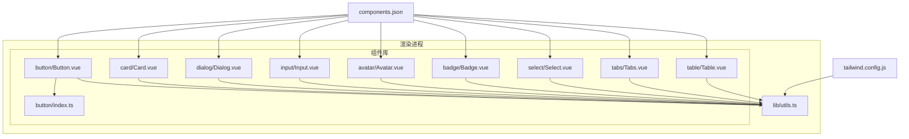
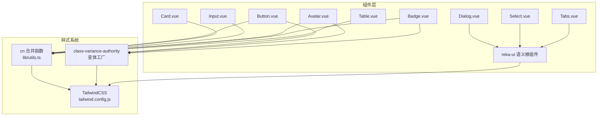
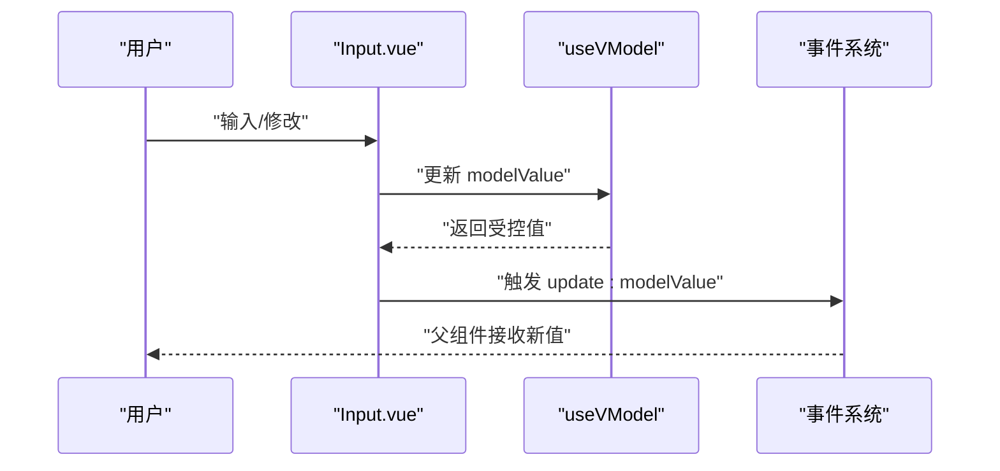
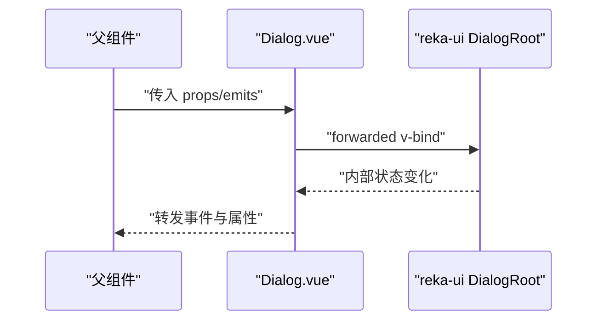
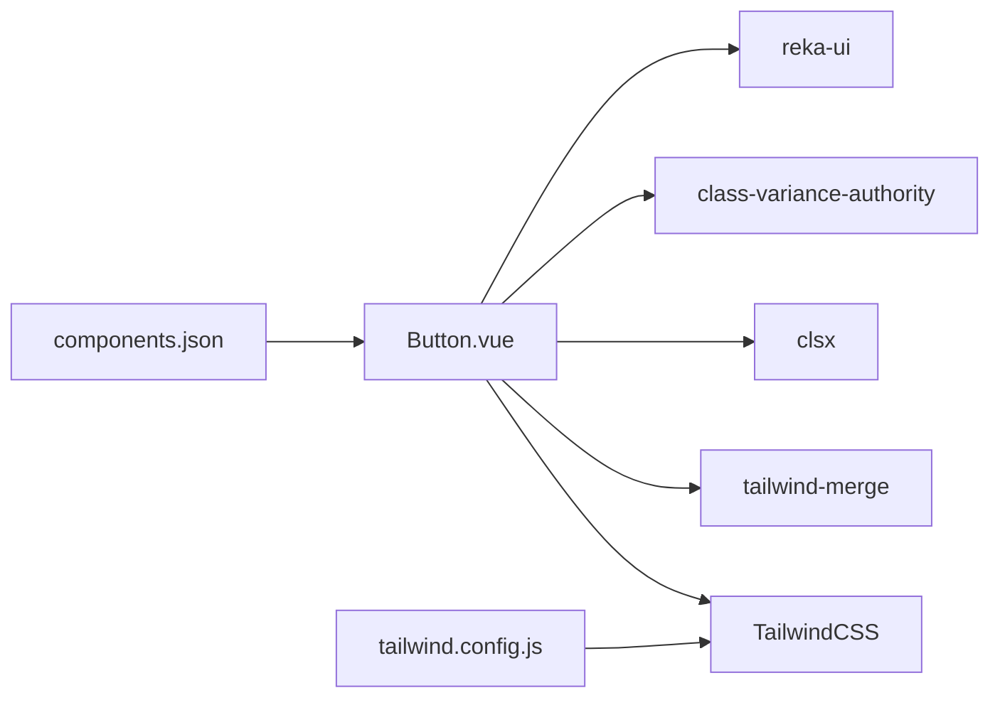

# 组件开发指南

<cite>
**本文引用的文件**
- [package.json](file://package.json)
- [tailwind.config.js](file://tailwind.config.js)
- [components.json](file://components.json)
- [utils.ts](file://src/renderer/src/lib/utils.ts)
- [Button.vue](file://src/renderer/src/components/ui/button/Button.vue)
- [button/index.ts](file://src/renderer/src/components/ui/button/index.ts)
- [Card.vue](file://src/renderer/src/components/ui/card/Card.vue)
- [Dialog.vue](file://src/renderer/src/components/ui/dialog/Dialog.vue)
- [Input.vue](file://src/renderer/src/components/ui/input/Input.vue)
- [Avatar.vue](file://src/renderer/src/components/ui/avatar/Avatar.vue)
- [Badge.vue](file://src/renderer/src/components/ui/badge/Badge.vue)
- [Select.vue](file://src/renderer/src/components/ui/select/Select.vue)
- [Table.vue](file://src/renderer/src/components/ui/table/Table.vue)
- [Tabs.vue](file://src/renderer/src/components/ui/tabs/Tabs.vue)
</cite>

## 目录
1. [简介](#简介)
2. [项目结构](#项目结构)
3. [核心组件](#核心组件)
4. [架构总览](#架构总览)
5. [详细组件分析](#详细组件分析)
6. [依赖分析](#依赖分析)
7. [性能考量](#性能考量)
8. [故障排查指南](#故障排查指南)
9. [结论](#结论)
10. [附录](#附录)

## 简介
本指南面向希望在现有UI组件库中进行组件开发与维护的工程师，系统阐述组件库的设计原则、命名规范、架构模式与开发流程；覆盖TypeScript类型定义、Props接口设计、事件系统实现；说明样式系统集成（TailwindCSS）、主题定制方法；并给出可访问性、国际化与浏览器兼容性的建议。通过并行分析Button、Card、Dialog、Input、Avatar、Badge、Select、Table、Tabs等组件，提炼出统一的组件开发范式与最佳实践。

## 项目结构
该组件库位于渲染进程的UI目录下，采用“按功能域分层”的组织方式：每个组件以文件夹形式组织，包含组件主文件与变体定义文件；公共样式合并函数位于lib/utils.ts；Tailwind配置集中于根目录；组件别名与风格由components.json统一管理。



**图表来源**
- [Button.vue:1-29](file://src/renderer/src/components/ui/button/Button.vue#L1-L29)
- [button/index.ts:1-39](file://src/renderer/src/components/ui/button/index.ts#L1-L39)
- [Card.vue:1-22](file://src/renderer/src/components/ui/card/Card.vue#L1-L22)
- [Dialog.vue:1-16](file://src/renderer/src/components/ui/dialog/Dialog.vue#L1-L16)
- [Input.vue:1-34](file://src/renderer/src/components/ui/input/Input.vue#L1-L34)
- [Avatar.vue:1-23](file://src/renderer/src/components/ui/avatar/Avatar.vue#L1-L23)
- [Badge.vue:1-18](file://src/renderer/src/components/ui/badge/Badge.vue#L1-L18)
- [Select.vue:1-16](file://src/renderer/src/components/ui/select/Select.vue#L1-L16)
- [Table.vue:1-17](file://src/renderer/src/components/ui/table/Table.vue#L1-L17)
- [Tabs.vue:1-16](file://src/renderer/src/components/ui/tabs/Tabs.vue#L1-L16)
- [utils.ts:1-8](file://src/renderer/src/lib/utils.ts#L1-L8)
- [tailwind.config.js:1-57](file://tailwind.config.js#L1-L57)
- [components.json:1-19](file://components.json#L1-L19)

**章节来源**
- [package.json:1-86](file://package.json#L1-L86)
- [tailwind.config.js:1-57](file://tailwind.config.js#L1-L57)
- [components.json:1-19](file://components.json#L1-L19)
- [utils.ts:1-8](file://src/renderer/src/lib/utils.ts#L1-L8)

## 核心组件
本节聚焦组件库中的代表性组件，总结其设计要点与实现模式，便于新组件遵循统一范式。

- Button（按钮）
  - 设计要点：通过变体工厂生成类名，支持尺寸与外观变体；使用Primitive作为语义根元素；通过cn合并变体类与用户自定义类。
  - 类型与Props：继承PrimitiveProps，扩展variant、size、class；默认值控制as标签。
  - 参考路径：[Button.vue:1-29](file://src/renderer/src/components/ui/button/Button.vue#L1-L29)，[button/index.ts:1-39](file://src/renderer/src/components/ui/button/index.ts#L1-L39)

- Card（卡片）
  - 设计要点：最小化包裹容器，统一圆角、边框、阴影与背景色；通过cn合并用户类名。
  - 类型与Props：仅接收class属性。
  - 参考路径：[Card.vue:1-22](file://src/renderer/src/components/ui/card/Card.vue#L1-L22)

- Dialog（对话框）
  - 设计要点：基于reka-ui的DialogRoot，转发props与emits，保持语义与行为一致性。
  - 类型与Props：透传DialogRootProps与DialogRootEmits。
  - 参考路径：[Dialog.vue:1-16](file://src/renderer/src/components/ui/dialog/Dialog.vue#L1-L16)

- Input（输入框）
  - 设计要点：使用useVModel建立双向绑定；内置数据槽位标识；结合Tailwind与状态类实现焦点、禁用、错误态。
  - 类型与Props：支持modelValue与defaultValue；emit update:modelValue。
  - 参考路径：[Input.vue:1-34](file://src/renderer/src/components/ui/input/Input.vue#L1-L34)

- Avatar（头像）
  - 设计要点：基于AvatarRoot，通过变体工厂控制尺寸与形状；提供默认值。
  - 类型与Props：size、shape、class；默认sm、circle。
  - 参考路径：[Avatar.vue:1-23](file://src/renderer/src/components/ui/avatar/Avatar.vue#L1-L23)

- Badge（徽标）
  - 设计要点：通过变体工厂生成不同状态样式；支持variant与class。
  - 类型与Props：variant、class。
  - 参考路径：[Badge.vue:1-18](file://src/renderer/src/components/ui/badge/Badge.vue#L1-L18)

- Select（选择器）
  - 设计要点：基于reka-ui的SelectRoot，转发props与emits。
  - 类型与Props：透传SelectRootProps与SelectRootEmits。
  - 参考路径：[Select.vue:1-16](file://src/renderer/src/components/ui/select/Select.vue#L1-L16)

- Table（表格）
  - 设计要点：外层容器提供横向滚动；表格基础样式通过cn合并。
  - 类型与Props：class。
  - 参考路径：[Table.vue:1-17](file://src/renderer/src/components/ui/table/Table.vue#L1-L17)

- Tabs（标签页）
  - 设计要点：基于reka-ui的TabsRoot，转发props与emits。
  - 类型与Props：透传TabsRootProps与TabsRootEmits。
  - 参考路径：[Tabs.vue:1-16](file://src/renderer/src/components/ui/tabs/Tabs.vue#L1-L16)

**章节来源**
- [Button.vue:1-29](file://src/renderer/src/components/ui/button/Button.vue#L1-L29)
- [button/index.ts:1-39](file://src/renderer/src/components/ui/button/index.ts#L1-L39)
- [Card.vue:1-22](file://src/renderer/src/components/ui/card/Card.vue#L1-L22)
- [Dialog.vue:1-16](file://src/renderer/src/components/ui/dialog/Dialog.vue#L1-L16)
- [Input.vue:1-34](file://src/renderer/src/components/ui/input/Input.vue#L1-L34)
- [Avatar.vue:1-23](file://src/renderer/src/components/ui/avatar/Avatar.vue#L1-L23)
- [Badge.vue:1-18](file://src/renderer/src/components/ui/badge/Badge.vue#L1-L18)
- [Select.vue:1-16](file://src/renderer/src/components/ui/select/Select.vue#L1-L16)
- [Table.vue:1-17](file://src/renderer/src/components/ui/table/Table.vue#L1-L17)
- [Tabs.vue:1-16](file://src/renderer/src/components/ui/tabs/Tabs.vue#L1-L16)

## 架构总览
组件库采用“变体工厂 + 语义根组件 + 工具函数”的架构模式：
- 变体工厂：通过class-variance-authority生成变体类名，统一管理尺寸与外观。
- 语义根组件：基于reka-ui的Primitive或Root组件，确保可访问性与行为一致。
- 工具函数：cn函数负责类名合并与冲突修复，保证样式叠加的确定性。
- 样式系统：TailwindCSS提供原子化样式，配合CSS变量与暗色模式策略；components.json统一别名与风格。



**图表来源**
- [tailwind.config.js:1-57](file://tailwind.config.js#L1-L57)
- [utils.ts:1-8](file://src/renderer/src/lib/utils.ts#L1-L8)
- [button/index.ts:1-39](file://src/renderer/src/components/ui/button/index.ts#L1-L39)
- [Button.vue:1-29](file://src/renderer/src/components/ui/button/Button.vue#L1-L29)
- [Card.vue:1-22](file://src/renderer/src/components/ui/card/Card.vue#L1-L22)
- [Dialog.vue:1-16](file://src/renderer/src/components/ui/dialog/Dialog.vue#L1-L16)
- [Input.vue:1-34](file://src/renderer/src/components/ui/input/Input.vue#L1-L34)
- [Avatar.vue:1-23](file://src/renderer/src/components/ui/avatar/Avatar.vue#L1-L23)
- [Badge.vue:1-18](file://src/renderer/src/components/ui/badge/Badge.vue#L1-L18)
- [Select.vue:1-16](file://src/renderer/src/components/ui/select/Select.vue#L1-L16)
- [Tabs.vue:1-16](file://src/renderer/src/components/ui/tabs/Tabs.vue#L1-L16)
- [Table.vue:1-17](file://src/renderer/src/components/ui/table/Table.vue#L1-L17)

## 详细组件分析

### Button 组件分析
- 设计原则
  - 使用变体工厂统一管理外观与尺寸，避免重复条件判断。
  - 通过Primitive作为根节点，确保可访问性与键盘交互。
  - 通过cn合并用户类名，允许上层覆盖。
- Props与事件
  - 继承PrimitiveProps，新增variant、size、class；默认as为button。
- 样式与主题
  - 基于Tailwind原子类与CSS变量，支持暗色模式与主题切换。
- 可访问性与国际化
  - 依赖reka-ui的语义根组件，遵循无障碍标准；文案国际化由业务层处理。

```mermaid
classDiagram
class ButtonVue {
+Props : "继承PrimitiveProps<br/>+ variant : ButtonVariants['variant']<br/>+ size : ButtonVariants['size']<br/>+ class? : HTMLAttributes['class']"
+默认值 : "as='button'"
+模板 : "Primitive(as, asChild, class=cn(buttonVariants))"
}
class Variants {
+buttonVariants : "cva(...)<br/>+ variants : { variant, size }<br/>+ defaultVariants"
}
class Utils {
+cn(...inputs) : "clsx + tailwind-merge"
}
ButtonVue --> Variants : "使用变体"
ButtonVue --> Utils : "类名合并"
```

**图表来源**
- [Button.vue:1-29](file://src/renderer/src/components/ui/button/Button.vue#L1-L29)
- [button/index.ts:1-39](file://src/renderer/src/components/ui/button/index.ts#L1-L39)
- [utils.ts:1-8](file://src/renderer/src/lib/utils.ts#L1-L8)

**章节来源**
- [Button.vue:1-29](file://src/renderer/src/components/ui/button/Button.vue#L1-L29)
- [button/index.ts:1-39](file://src/renderer/src/components/ui/button/index.ts#L1-L39)
- [utils.ts:1-8](file://src/renderer/src/lib/utils.ts#L1-L8)

### Input 组件分析
- 设计原则
  - 使用useVModel建立响应式双向绑定，passive模式减少重渲染。
  - 内置data-slot标识，便于主题与样式扫描工具识别。
  - 结合Tailwind与aria-invalid实现状态反馈。
- Props与事件
  - 支持modelValue与defaultValue；emit update:modelValue。
- 样式与主题
  - 原子类组合实现基础样式与状态类；支持暗色模式与焦点环。



**图表来源**
- [Input.vue:1-34](file://src/renderer/src/components/ui/input/Input.vue#L1-L34)

**章节来源**
- [Input.vue:1-34](file://src/renderer/src/components/ui/input/Input.vue#L1-L34)

### Dialog 组件分析
- 设计原则
  - 仅做props与emits的转发，保持与reka-ui一致的行为与可访问性。
- Props与事件
  - 透传DialogRootProps与DialogRootEmits，确保事件冒泡与属性传递完整。



**图表来源**
- [Dialog.vue:1-16](file://src/renderer/src/components/ui/dialog/Dialog.vue#L1-L16)

**章节来源**
- [Dialog.vue:1-16](file://src/renderer/src/components/ui/dialog/Dialog.vue#L1-L16)

### Avatar 组件分析
- 设计原则
  - 基于AvatarRoot，通过变体工厂控制size与shape；提供合理默认值。
- Props与事件
  - 接收class、size、shape；默认sm与circle。

```mermaid
classDiagram
class AvatarVue {
+Props : "class?, size='sm', shape='circle'"
+模板 : "AvatarRoot(class=cn(avatarVariant(...)))"
}
class AvatarVariants {
+avatarVariant : "cva(...)<br/>+ variants : { size, shape }"
}
AvatarVue --> AvatarVariants : "使用变体"
```

**图表来源**
- [Avatar.vue:1-23](file://src/renderer/src/components/ui/avatar/Avatar.vue#L1-L23)
- [Avatar.vue:1-23](file://src/renderer/src/components/ui/avatar/Avatar.vue#L1-L23)

**章节来源**
- [Avatar.vue:1-23](file://src/renderer/src/components/ui/avatar/Avatar.vue#L1-L23)

### Badge 组件分析
- 设计原则
  - 通过变体工厂生成不同状态样式，支持variant与class覆盖。
- Props与事件
  - 接收variant与class。

**章节来源**
- [Badge.vue:1-18](file://src/renderer/src/components/ui/badge/Badge.vue#L1-L18)

### Select 组件分析
- 设计原则
  - 透传reka-ui的SelectRoot，确保一致的可访问性与行为。
- Props与事件
  - 透传SelectRootProps与SelectRootEmits。

**章节来源**
- [Select.vue:1-16](file://src/renderer/src/components/ui/select/Select.vue#L1-L16)

### Table 组件分析
- 设计原则
  - 外层容器提供横向滚动；表格基础样式通过cn合并。
- Props与事件
  - 仅接收class。

**章节来源**
- [Table.vue:1-17](file://src/renderer/src/components/ui/table/Table.vue#L1-L17)

### Tabs 组件分析
- 设计原则
  - 透传reka-ui的TabsRoot，确保一致的可访问性与行为。
- Props与事件
  - 透传TabsRootProps与TabsRootEmits。

**章节来源**
- [Tabs.vue:1-16](file://src/renderer/src/components/ui/tabs/Tabs.vue#L1-L16)

## 依赖分析
- 核心依赖
  - reka-ui：提供语义根组件与可访问性能力。
  - class-variance-authority：提供变体工厂，统一管理类名。
  - clsx + tailwind-merge：提供类名合并与冲突修复。
  - TailwindCSS：提供原子化样式与暗色模式支持。
- 配置依赖
  - tailwind.config.js：定义content范围、CSS变量与暗色模式策略。
  - components.json：定义别名与风格，确保组件库一致性。



**图表来源**
- [package.json:16-34](file://package.json#L16-L34)
- [tailwind.config.js:1-57](file://tailwind.config.js#L1-L57)
- [components.json:1-19](file://components.json#L1-L19)
- [utils.ts:1-8](file://src/renderer/src/lib/utils.ts#L1-L8)
- [Button.vue:1-29](file://src/renderer/src/components/ui/button/Button.vue#L1-L29)

**章节来源**
- [package.json:16-34](file://package.json#L16-L34)
- [tailwind.config.js:1-57](file://tailwind.config.js#L1-L57)
- [components.json:1-19](file://components.json#L1-L19)
- [utils.ts:1-8](file://src/renderer/src/lib/utils.ts#L1-L8)

## 性能考量
- 变体计算与类名合并
  - 使用cva与cn，避免运行时复杂字符串拼接；在组件初始化阶段完成类名计算。
- 双向绑定优化
  - Input使用useVModel的passive模式，降低不必要的重渲染。
- 暗色模式与CSS变量
  - TailwindCSS通过CSS变量与暗色模式策略，减少重复样式定义，提升主题切换性能。
- 模板与事件
  - 尽量减少模板中的条件分支与嵌套；事件转发采用最小包装，避免额外开销。

## 故障排查指南
- 类名冲突与覆盖
  - 使用cn合并类名，确保用户传入的class优先级高于默认类名；若出现样式异常，检查组件是否正确传入class。
  - 参考路径：[utils.ts:1-8](file://src/renderer/src/lib/utils.ts#L1-L8)
- 变体未生效
  - 确认变体工厂已导出且在组件中正确调用；检查variant与size参数是否在变体定义范围内。
  - 参考路径：[button/index.ts:1-39](file://src/renderer/src/components/ui/button/index.ts#L1-L39)
- 可访问性问题
  - 对话框、选择器、标签页等复杂组件需确保透传props与emits；如出现键盘不可用或焦点异常，检查forwarded绑定。
  - 参考路径：[Dialog.vue:1-16](file://src/renderer/src/components/ui/dialog/Dialog.vue#L1-L16)，[Select.vue:1-16](file://src/renderer/src/components/ui/select/Select.vue#L1-L16)，[Tabs.vue:1-16](file://src/renderer/src/components/ui/tabs/Tabs.vue#L1-L16)
- 输入框状态异常
  - 检查update:modelValue事件是否正确触发；确认useVModel的passive与defaultValue配置。
  - 参考路径：[Input.vue:1-34](file://src/renderer/src/components/ui/input/Input.vue#L1-L34)
- Tailwind样式不生效
  - 确认tailwind.config.js的content范围包含组件文件；检查components.json的别名与CSS变量开关。
  - 参考路径：[tailwind.config.js:1-57](file://tailwind.config.js#L1-L57)，[components.json:1-19](file://components.json#L1-L19)

**章节来源**
- [utils.ts:1-8](file://src/renderer/src/lib/utils.ts#L1-L8)
- [button/index.ts:1-39](file://src/renderer/src/components/ui/button/index.ts#L1-L39)
- [Dialog.vue:1-16](file://src/renderer/src/components/ui/dialog/Dialog.vue#L1-L16)
- [Select.vue:1-16](file://src/renderer/src/components/ui/select/Select.vue#L1-L16)
- [Tabs.vue:1-16](file://src/renderer/src/components/ui/tabs/Tabs.vue#L1-L16)
- [Input.vue:1-34](file://src/renderer/src/components/ui/input/Input.vue#L1-L34)
- [tailwind.config.js:1-57](file://tailwind.config.js#L1-L57)
- [components.json:1-19](file://components.json#L1-L19)

## 结论
本组件库以reka-ui为基础，结合class-variance-authority与TailwindCSS，形成统一的变体与样式体系；通过cn合并函数确保类名确定性与可维护性。遵循本指南的类型设计、Props与事件约定、样式与主题集成方法，可高效开发高质量UI组件，并保持一致的可访问性与用户体验。

## 附录

### 开发流程与最佳实践
- 组件开发流程
  - 新建组件文件夹与主组件文件；在同目录下提供变体定义文件（如适用）。
  - 在index.ts中导出组件与变体工厂；在组件中使用cn与变体工厂。
  - 在父组件中导入并使用，确保类名与事件正确传递。
- 命名规范
  - 组件文件夹与组件名称采用帕斯卡命名；变体工厂以组件名+Variants命名。
  - Props与事件命名遵循Vue惯例，使用camelCase。
- 测试策略
  - 单元测试：验证Props与事件的正确传递；验证变体类名生成。
  - 可访问性测试：使用axe或类似工具验证键盘可达性与屏幕阅读器友好性。
  - 跨浏览器测试：在主流浏览器中验证样式与交互一致性。
- 文档编写规范
  - 为每个组件编写README，包含用途、Props说明、事件说明、示例与注意事项。
  - 在Storybook或Playground中提供交互示例，展示不同变体与状态。

### TypeScript类型定义与Props接口设计
- 统一使用withDefaults或defineProps定义Props，明确默认值与可选性。
- 对于需要透传的组件，使用对应UI库的Props类型（如DialogRootProps）。
- 事件类型定义使用defineEmits，确保事件签名清晰。

### 事件系统实现
- 使用defineEmits声明事件；对于需要透传的组件，使用useForwardPropsEmits转发。
- 确保事件回调参数与UI库约定一致，避免类型不匹配。

### 样式系统集成与主题定制
- TailwindCSS：在tailwind.config.js中扩展颜色、圆角等变量；确保content范围覆盖组件文件。
- CSS变量：通过CSS变量与暗色模式策略实现主题切换；在components.json中启用CSS Variables。
- 类名合并：使用cn函数合并默认类名与用户类名，避免冲突。

### 可访问性、国际化与浏览器兼容性
- 可访问性：优先使用语义化HTML与reka-ui提供的语义根组件；确保键盘可达与焦点管理。
- 国际化：文案由业务层处理，组件不直接依赖语言包；确保文本方向与布局在RTL场景下可用。
- 兼容性：在tailwind.config.js中配置目标浏览器；在组件中避免使用尚未广泛支持的CSS特性。