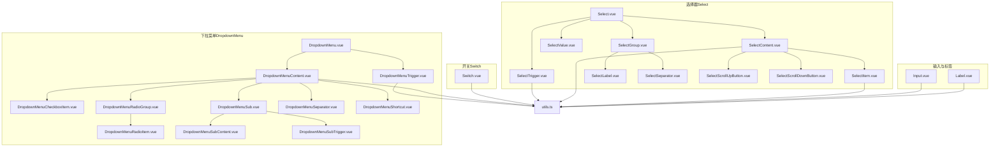
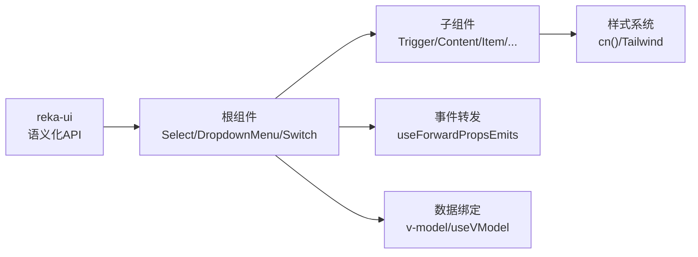
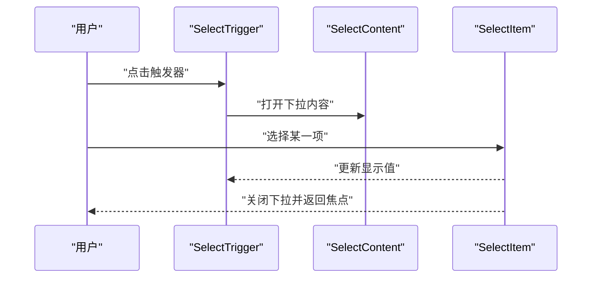
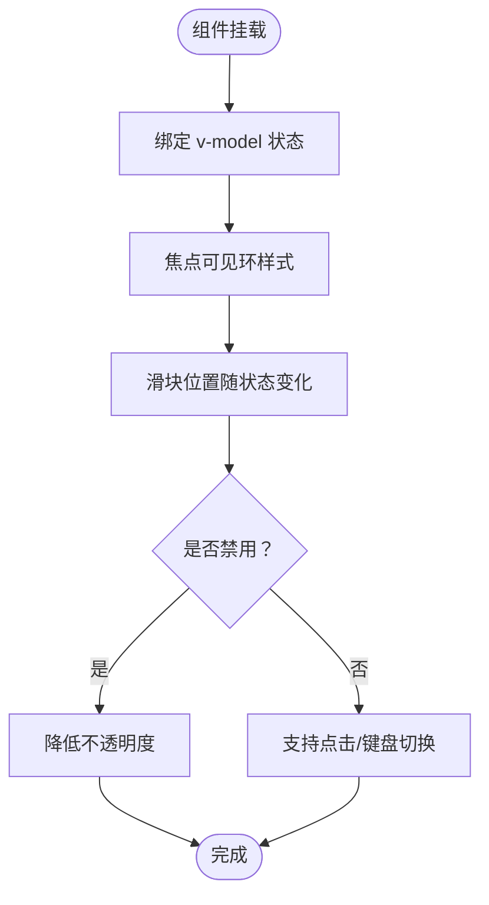
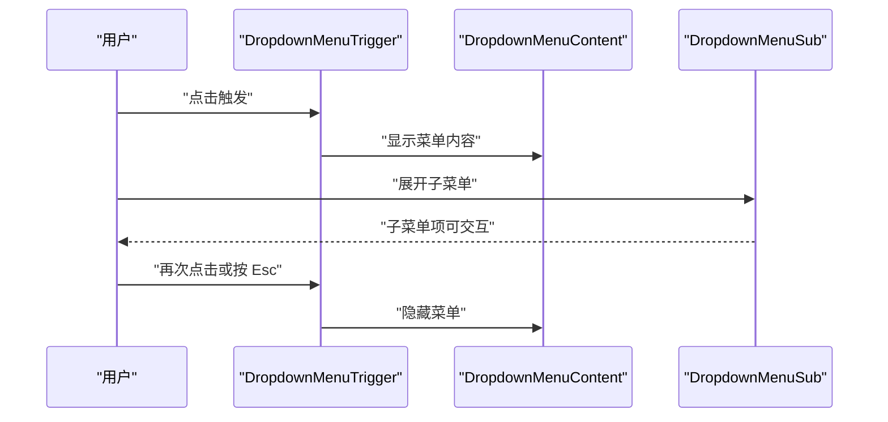
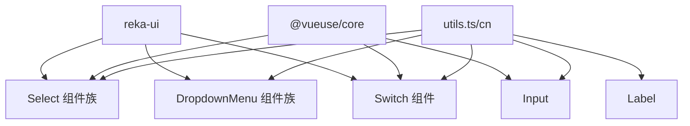

# 表单组件

<cite>
**本文引用的文件**
- [Select.vue](file://src/renderer/src/components/ui/select/Select.vue)
- [SelectContent.vue](file://src/renderer/src/components/ui/select/SelectContent.vue)
- [SelectTrigger.vue](file://src/renderer/src/components/ui/select/SelectTrigger.vue)
- [SelectItem.vue](file://src/renderer/src/components/ui/select/SelectItem.vue)
- [SelectValue.vue](file://src/renderer/src/components/ui/select/SelectValue.vue)
- [SelectGroup.vue](file://src/renderer/src/components/ui/select/SelectGroup.vue)
- [SelectLabel.vue](file://src/renderer/src/components/ui/select/SelectLabel.vue)
- [SelectSeparator.vue](file://src/renderer/src/components/ui/select/SelectSeparator.vue)
- [SelectScrollUpButton.vue](file://src/renderer/src/components/ui/select/SelectScrollUpButton.vue)
- [SelectScrollDownButton.vue](file://src/renderer/src/components/ui/select/SelectScrollDownButton.vue)
- [index.ts（Select）](file://src/renderer/src/components/ui/select/index.ts)
- [Switch.vue](file://src/renderer/src/components/ui/switch/Switch.vue)
- [index.ts（Switch）](file://src/renderer/src/components/ui/switch/index.ts)
- [DropdownMenu.vue](file://src/renderer/src/components/ui/dropdown-menu/DropdownMenu.vue)
- [DropdownMenuContent.vue](file://src/renderer/src/components/ui/dropdown-menu/DropdownMenuContent.vue)
- [DropdownMenuTrigger.vue](file://src/renderer/src/components/ui/dropdown-menu/DropdownMenuTrigger.vue)
- [DropdownMenuCheckboxItem.vue](file://src/renderer/src/components/ui/dropdown-menu/DropdownMenuCheckboxItem.vue)
- [DropdownMenuRadioGroup.vue](file://src/renderer/src/components/ui/dropdown-menu/DropdownMenuRadioGroup.vue)
- [DropdownMenuRadioItem.vue](file://src/renderer/src/components/ui/dropdown-menu/DropdownMenuRadioItem.vue)
- [DropdownMenuSub.vue](file://src/renderer/src/components/ui/dropdown-menu/DropdownMenuSub.vue)
- [DropdownMenuSubContent.vue](file://src/renderer/src/components/ui/dropdown-menu/DropdownMenuSubContent.vue)
- [DropdownMenuSubTrigger.vue](file://src/renderer/src/components/ui/dropdown-menu/DropdownMenuSubTrigger.vue)
- [DropdownMenuSeparator.vue](file://src/renderer/src/components/ui/dropdown-menu/DropdownMenuSeparator.vue)
- [DropdownMenuShortcut.vue](file://src/renderer/src/components/ui/dropdown-menu/DropdownMenuShortcut.vue)
- [index.ts（DropdownMenu）](file://src/renderer/src/components/ui/dropdown-menu/index.ts)
- [Input.vue](file://src/renderer/src/components/ui/input/Input.vue)
- [index.ts（Input）](file://src/renderer/src/components/ui/input/index.ts)
- [Label.vue](file://src/renderer/src/components/ui/label/Label.vue)
- [index.ts（Label）](file://src/renderer/src/components/ui/label/index.ts)
- [utils.ts](file://src/renderer/src/lib/utils.ts)
</cite>

## 目录
1. [简介](#简介)
2. [项目结构](#项目结构)
3. [核心组件](#核心组件)
4. [架构总览](#架构总览)
5. [组件详解](#组件详解)
6. [依赖关系分析](#依赖关系分析)
7. [性能与可用性](#性能与可用性)
8. [故障排查指南](#故障排查指南)
9. [结论](#结论)
10. [附录：组合使用与最佳实践](#附录组合使用与最佳实践)

## 简介
本文件面向开发者与产品设计人员，系统化梳理仓库中的表单组件体系，覆盖选择器、开关、下拉菜单等交互式表单组件的设计原则、状态管理、数据绑定、验证机制与事件处理，并给出可访问性、键盘导航与屏幕阅读器兼容性建议。同时提供组件组合使用范式、数据收集模式与错误处理策略，以及样式定制、主题适配与响应式布局的实践方法。

## 项目结构
表单相关组件集中于渲染端的 UI 组件库目录，采用“功能域+原子化封装”的组织方式：
- 选择器（Select）：由根容器与若干子组件（触发器、内容区、选项、分组、标签、滚动按钮等）组成，通过 reka-ui 提供的语义化 API 进行组合。
- 开关（Switch）：基于 reka-ui 的 SwitchRoot/SwitchThumb，提供可访问的切换状态与视觉反馈。
- 下拉菜单（DropdownMenu）：由根容器与若干子组件（内容、触发器、复选/单选项、子菜单、快捷键等）构成，用于承载菜单类交互。
- 输入（Input）：基于 v-model 的受控输入封装，内置通用样式与可访问性属性。
- 标签（Label）：为表单控件提供可点击关联与可访问性语义。

图表来源
- [Select.vue:1-16](file://src/renderer/src/components/ui/select/Select.vue#L1-L16)
- [SelectTrigger.vue:1-30](file://src/renderer/src/components/ui/select/SelectTrigger.vue#L1-L30)
- [SelectContent.vue:1-50](file://src/renderer/src/components/ui/select/SelectContent.vue#L1-L50)
- [SelectItem.vue:1-42](file://src/renderer/src/components/ui/select/SelectItem.vue#L1-L42)
- [Switch.vue:1-36](file://src/renderer/src/components/ui/switch/Switch.vue#L1-L36)
- [DropdownMenu.vue:1-16](file://src/renderer/src/components/ui/dropdown-menu/DropdownMenu.vue#L1-L16)
- [DropdownMenuTrigger.vue:1-15](file://src/renderer/src/components/ui/dropdown-menu/DropdownMenuTrigger.vue#L1-L15)
- [DropdownMenuContent.vue:1-35](file://src/renderer/src/components/ui/dropdown-menu/DropdownMenuContent.vue#L1-L35)
- [Input.vue:1-34](file://src/renderer/src/components/ui/input/Input.vue#L1-L34)
- [Label.vue:1-26](file://src/renderer/src/components/ui/label/Label.vue#L1-L26)
- [utils.ts:1-8](file://src/renderer/src/lib/utils.ts#L1-L8)

章节来源
- [Select.vue:1-16](file://src/renderer/src/components/ui/select/Select.vue#L1-L16)
- [Switch.vue:1-36](file://src/renderer/src/components/ui/switch/Switch.vue#L1-L36)
- [DropdownMenu.vue:1-16](file://src/renderer/src/components/ui/dropdown-menu/DropdownMenu.vue#L1-L16)
- [Input.vue:1-34](file://src/renderer/src/components/ui/input/Input.vue#L1-L34)
- [Label.vue:1-26](file://src/renderer/src/components/ui/label/Label.vue#L1-L26)
- [utils.ts:1-8](file://src/renderer/src/lib/utils.ts#L1-L8)

## 核心组件
- 选择器（Select）：提供多选项选择能力，支持分组、标签、滚动、占位符与 Portal 渲染，确保在复杂场景下的可访问性与性能。
- 开关（Switch）：提供二态切换，具备焦点可见环、禁用态与状态类名映射，便于主题与样式扩展。
- 下拉菜单（DropdownMenu）：提供菜单容器与多种菜单项类型（复选、单选、子菜单），支持侧向动画与 Portal 定位。
- 输入（Input）：基于 v-model 的受控输入，内置可访问性属性与错误态样式钩子。
- 标签（Label）：为表单控件提供语义化标签，支持禁用态与可访问性关联。

章节来源
- [Select.vue:1-16](file://src/renderer/src/components/ui/select/Select.vue#L1-L16)
- [Switch.vue:1-36](file://src/renderer/src/components/ui/switch/Switch.vue#L1-L36)
- [DropdownMenu.vue:1-16](file://src/renderer/src/components/ui/dropdown-menu/DropdownMenu.vue#L1-L16)
- [Input.vue:1-34](file://src/renderer/src/components/ui/input/Input.vue#L1-L34)
- [Label.vue:1-26](file://src/renderer/src/components/ui/label/Label.vue#L1-L26)

## 架构总览
这些组件统一通过 reka-ui 的语义化 API 实现，内部以“根组件 + 子组件”模式组合，对外暴露一致的属性与事件接口；样式通过工具函数进行合并与覆盖，保证主题一致性与可定制性。

图表来源
- [Select.vue:1-16](file://src/renderer/src/components/ui/select/Select.vue#L1-L16)
- [DropdownMenu.vue:1-16](file://src/renderer/src/components/ui/dropdown-menu/DropdownMenu.vue#L1-L16)
- [Switch.vue:1-36](file://src/renderer/src/components/ui/switch/Switch.vue#L1-L36)
- [Input.vue:1-34](file://src/renderer/src/components/ui/input/Input.vue#L1-L34)
- [utils.ts:1-8](file://src/renderer/src/lib/utils.ts#L1-L8)

## 组件详解

### 选择器（Select）
- 设计要点
  - 根组件仅负责透传属性与事件，避免侵入式封装，保持与 reka-ui 的一致性。
  - 触发器负责展示当前值与占位符，内置图标与对齐样式。
  - 内容区支持弹出定位、滚动条与视口自适应，配合 Portal 避免层级遮挡。
  - 选项项支持内建指示器与文本槽位，便于扩展图标或辅助信息。
  - 分组、标签与分隔线提升长列表的可读性。
- 状态管理
  - 使用受控模式（props + emits），父组件通过 v-model 控制选中值。
  - 支持 defaultValue，便于初始化。
- 数据绑定与事件
  - 通过 useForwardPropsEmits 将属性与事件原样传递给 reka-ui。
  - 选项项通过 SelectItem 的 value 属性参与值选择。
- 可访问性
  - 依托 reka-ui 的键盘导航与焦点管理，支持方向键、回车、空格等操作。
  - 建议为 SelectTrigger 设置 aria-expanded、aria-controls 等属性以增强屏幕阅读器体验。
- 样式与主题
  - 使用 cn 合并 Tailwind 类，支持 class 覆盖与状态类名映射（如 data-[state=checked]）。
  - 通过主题变量与颜色语义（如 primary、input、popover）适配深浅色主题。

图表来源
- [SelectTrigger.vue:1-30](file://src/renderer/src/components/ui/select/SelectTrigger.vue#L1-L30)
- [SelectContent.vue:1-50](file://src/renderer/src/components/ui/select/SelectContent.vue#L1-L50)
- [SelectItem.vue:1-42](file://src/renderer/src/components/ui/select/SelectItem.vue#L1-L42)

章节来源
- [Select.vue:1-16](file://src/renderer/src/components/ui/select/Select.vue#L1-L16)
- [SelectTrigger.vue:1-30](file://src/renderer/src/components/ui/select/SelectTrigger.vue#L1-L30)
- [SelectContent.vue:1-50](file://src/renderer/src/components/ui/select/SelectContent.vue#L1-L50)
- [SelectItem.vue:1-42](file://src/renderer/src/components/ui/select/SelectItem.vue#L1-L42)
- [SelectValue.vue](file://src/renderer/src/components/ui/select/SelectValue.vue)
- [SelectGroup.vue](file://src/renderer/src/components/ui/select/SelectGroup.vue)
- [SelectLabel.vue](file://src/renderer/src/components/ui/select/SelectLabel.vue)
- [SelectSeparator.vue](file://src/renderer/src/components/ui/select/SelectSeparator.vue)
- [SelectScrollUpButton.vue](file://src/renderer/src/components/ui/select/SelectScrollUpButton.vue)
- [SelectScrollDownButton.vue](file://src/renderer/src/components/ui/select/SelectScrollDownButton.vue)

### 开关（Switch）
- 设计要点
  - SwitchRoot 作为根容器，SwitchThumb 作为滑块，二者通过 data-state 属性反映状态。
  - 提供焦点可见环与禁用态样式，满足可访问性与可用性要求。
- 状态管理
  - 通过 v-model 受控绑定 checked 状态。
- 数据绑定与事件
  - 使用 useForwardPropsEmits 转发属性与事件，保持与 reka-ui 的一致性。
- 可访问性
  - SwitchRoot 自带 aria-pressed 语义，建议为外层容器提供 label 关联。
- 样式与主题
  - 通过 cn 合并类名，支持 class 扩展与状态类名映射（如 data-[state=checked]）。

图表来源
- [Switch.vue:1-36](file://src/renderer/src/components/ui/switch/Switch.vue#L1-L36)

章节来源
- [Switch.vue:1-36](file://src/renderer/src/components/ui/switch/Switch.vue#L1-L36)

### 下拉菜单（DropdownMenu）
- 设计要点
  - 根组件负责菜单容器，Trigger 负责触发，Content 负责弹出内容与动画。
  - 支持复选/单选组、子菜单、快捷键与分隔线，满足复杂菜单场景。
  - 通过 Portal 将内容渲染到指定挂载点，避免层级与溢出问题。
- 状态管理
  - 通过 reka-ui 的内部状态控制开合，父组件通过 Trigger 与 Content 的属性进行配置。
- 数据绑定与事件
  - 使用 useForwardProps/useForwardPropsEmits 转发属性与事件。
- 可访问性
  - 依托 reka-ui 的键盘导航与焦点管理，支持 Esc 关闭、Tab 切换等。
- 样式与主题
  - 通过 cn 合并 Tailwind 类，支持 class 覆盖与动画类名映射。

图表来源
- [DropdownMenuTrigger.vue:1-15](file://src/renderer/src/components/ui/dropdown-menu/DropdownMenuTrigger.vue#L1-L15)
- [DropdownMenuContent.vue:1-35](file://src/renderer/src/components/ui/dropdown-menu/DropdownMenuContent.vue#L1-L35)
- [DropdownMenu.vue:1-16](file://src/renderer/src/components/ui/dropdown-menu/DropdownMenu.vue#L1-L16)
- [DropdownMenuSub.vue](file://src/renderer/src/components/ui/dropdown-menu/DropdownMenuSub.vue)
- [DropdownMenuSubTrigger.vue](file://src/renderer/src/components/ui/dropdown-menu/DropdownMenuSubTrigger.vue)
- [DropdownMenuSubContent.vue](file://src/renderer/src/components/ui/dropdown-menu/DropdownMenuSubContent.vue)

章节来源
- [DropdownMenu.vue:1-16](file://src/renderer/src/components/ui/dropdown-menu/DropdownMenu.vue#L1-L16)
- [DropdownMenuTrigger.vue:1-15](file://src/renderer/src/components/ui/dropdown-menu/DropdownMenuTrigger.vue#L1-L15)
- [DropdownMenuContent.vue:1-35](file://src/renderer/src/components/ui/dropdown-menu/DropdownMenuContent.vue#L1-L35)
- [DropdownMenuCheckboxItem.vue](file://src/renderer/src/components/ui/dropdown-menu/DropdownMenuCheckboxItem.vue)
- [DropdownMenuRadioGroup.vue](file://src/renderer/src/components/ui/dropdown-menu/DropdownMenuRadioGroup.vue)
- [DropdownMenuRadioItem.vue](file://src/renderer/src/components/ui/dropdown-menu/DropdownMenuRadioItem.vue)
- [DropdownMenuSub.vue](file://src/renderer/src/components/ui/dropdown-menu/DropdownMenuSub.vue)
- [DropdownMenuSubContent.vue](file://src/renderer/src/components/ui/dropdown-menu/DropdownMenuSubContent.vue)
- [DropdownMenuSubTrigger.vue](file://src/renderer/src/components/ui/dropdown-menu/DropdownMenuSubTrigger.vue)
- [DropdownMenuSeparator.vue](file://src/renderer/src/components/ui/dropdown-menu/DropdownMenuSeparator.vue)
- [DropdownMenuShortcut.vue](file://src/renderer/src/components/ui/dropdown-menu/DropdownMenuShortcut.vue)

### 输入（Input）与标签（Label）
- 输入（Input）
  - 通过 useVModel 实现 v-model 双向绑定，支持默认值与被动模式。
  - 内置可访问性属性与错误态样式钩子（aria-invalid），便于与校验库集成。
- 标签（Label）
  - 为表单控件提供语义化标签，支持禁用态样式与 slot 插槽。
- 可访问性
  - 建议将 Label 的 for 或与控件关联，使屏幕阅读器可正确朗读。
- 样式与主题
  - 通过 cn 合并 Tailwind 类，支持 class 覆盖与状态类名映射。

章节来源
- [Input.vue:1-34](file://src/renderer/src/components/ui/input/Input.vue#L1-L34)
- [Label.vue:1-26](file://src/renderer/src/components/ui/label/Label.vue#L1-L26)

## 依赖关系分析
- 组件间耦合
  - 选择器与下拉菜单均以“根组件 + 子组件”模式组合，内部通过 reka-ui 的 API 串联，外部通过 useForwardProps/Emits 转发，耦合度低、内聚性强。
- 外部依赖
  - reka-ui：提供语义化 API 与可访问性基础能力。
  - VueUse：提供 useVModel、reactiveOmit 等工具。
  - TailwindCSS + cn：提供样式合并与主题适配。
- 潜在循环依赖
  - 当前结构为单向依赖（子组件依赖根组件），未见循环依赖迹象。

图表来源
- [Select.vue:1-16](file://src/renderer/src/components/ui/select/Select.vue#L1-L16)
- [Switch.vue:1-36](file://src/renderer/src/components/ui/switch/Switch.vue#L1-L36)
- [DropdownMenu.vue:1-16](file://src/renderer/src/components/ui/dropdown-menu/DropdownMenu.vue#L1-L16)
- [Input.vue:1-34](file://src/renderer/src/components/ui/input/Input.vue#L1-L34)
- [Label.vue:1-26](file://src/renderer/src/components/ui/label/Label.vue#L1-L26)
- [utils.ts:1-8](file://src/renderer/src/lib/utils.ts#L1-L8)

章节来源
- [Select.vue:1-16](file://src/renderer/src/components/ui/select/Select.vue#L1-L16)
- [Switch.vue:1-36](file://src/renderer/src/components/ui/switch/Switch.vue#L1-L36)
- [DropdownMenu.vue:1-16](file://src/renderer/src/components/ui/dropdown-menu/DropdownMenu.vue#L1-L16)
- [Input.vue:1-34](file://src/renderer/src/components/ui/input/Input.vue#L1-L34)
- [Label.vue:1-26](file://src/renderer/src/components/ui/label/Label.vue#L1-L26)
- [utils.ts:1-8](file://src/renderer/src/lib/utils.ts#L1-L8)

## 性能与可用性
- 性能
  - 选择器与下拉菜单的内容区通过 Portal 渲染，减少 DOM 层级与重排影响。
  - 视口自适应与滚动按钮优化长列表渲染体验。
- 可用性
  - 统一的焦点环与禁用态样式提升可访问性。
  - 错误态样式钩子（aria-invalid）便于与校验库联动。
- 主题适配
  - 通过颜色语义（primary、input、popover、muted 等）与 cn 合并类名，支持深浅色主题切换。
- 响应式布局
  - 组件尺寸与间距采用相对单位与断点前缀，适配不同屏幕尺寸。

[本节为通用指导，无需列出具体文件来源]

## 故障排查指南
- 无法接收输入值
  - 检查父组件是否正确绑定 v-model，确认 useVModel 的被动模式与默认值设置。
  - 参考路径：[Input.vue:16-19](file://src/renderer/src/components/ui/input/Input.vue#L16-L19)
- 选项不可选或无反馈
  - 确认 SelectItem 的 value 设置与 Select 的 v-model 值一致，检查 data-state 类名映射。
  - 参考路径：[SelectItem.vue:22-40](file://src/renderer/src/components/ui/select/SelectItem.vue#L22-L40)
- 下拉菜单不显示或位置异常
  - 检查 DropdownMenuContent 的 sideOffset 与 Portal 挂载点，确认 z-index 与定位上下文。
  - 参考路径：[DropdownMenuContent.vue:12-22](file://src/renderer/src/components/ui/dropdown-menu/DropdownMenuContent.vue#L12-L22)
- 开关状态不更新
  - 确认 v-model 绑定的 checked 值与 SwitchRoot 的状态同步，检查事件转发链路。
  - 参考路径：[Switch.vue:12-18](file://src/renderer/src/components/ui/switch/Switch.vue#L12-L18)
- 样式冲突或覆盖无效
  - 检查 cn 合并顺序与 Tailwind 指令优先级，确保 class 参数在末尾以获得更高优先级。
  - 参考路径：[utils.ts:5-7](file://src/renderer/src/lib/utils.ts#L5-L7)

章节来源
- [Input.vue:1-34](file://src/renderer/src/components/ui/input/Input.vue#L1-L34)
- [SelectItem.vue:1-42](file://src/renderer/src/components/ui/select/SelectItem.vue#L1-L42)
- [DropdownMenuContent.vue:1-35](file://src/renderer/src/components/ui/dropdown-menu/DropdownMenuContent.vue#L1-L35)
- [Switch.vue:1-36](file://src/renderer/src/components/ui/switch/Switch.vue#L1-L36)
- [utils.ts:1-8](file://src/renderer/src/lib/utils.ts#L1-L8)

## 结论
该表单组件体系以 reka-ui 为核心，结合 VueUse 与 Tailwind/CN 工具，实现了高可访问性、强扩展性与良好主题适配的交互组件。通过“根组件 + 子组件”的组合模式，开发者可以灵活搭建复杂表单场景；通过 v-model 与事件转发，实现稳定的数据流与可预测的行为。建议在实际项目中配合校验库与国际化方案，进一步完善表单的完整性与本地化体验。

[本节为总结性内容，无需列出具体文件来源]

## 附录：组合使用与最佳实践

### 组合使用示例
- 多选筛选（Select + 复选菜单）
  - 使用 Select 作为入口，内部嵌套 DropdownMenuCheckboxItem 实现多选过滤。
  - 参考路径：[SelectTrigger.vue:1-30](file://src/renderer/src/components/ui/select/SelectTrigger.vue#L1-L30)，[DropdownMenuCheckboxItem.vue](file://src/renderer/src/components/ui/dropdown-menu/DropdownMenuCheckboxItem.vue)
- 单选设置（Select + 单选菜单）
  - 使用 Select 作为入口，内部嵌套 DropdownMenuRadioGroup/RadioItem 实现互斥选择。
  - 参考路径：[DropdownMenuRadioGroup.vue](file://src/renderer/src/components/ui/dropdown-menu/DropdownMenuRadioGroup.vue)，[DropdownMenuRadioItem.vue](file://src/renderer/src/components/ui/dropdown-menu/DropdownMenuRadioItem.vue)
- 开关控制（Switch + Label）
  - 使用 Label 关联 Switch，实现“启用/禁用”场景的语义化与可访问性。
  - 参考路径：[Label.vue:1-26](file://src/renderer/src/components/ui/label/Label.vue#L1-L26)，[Switch.vue:1-36](file://src/renderer/src/components/ui/switch/Switch.vue#L1-L36)

### 数据收集模式
- 受控输入（Input）
  - 通过 v-model 收集用户输入，结合校验库（如 zod/vuelidate）进行实时校验。
  - 参考路径：[Input.vue:16-19](file://src/renderer/src/components/ui/input/Input.vue#L16-L19)
- 选择器（Select）
  - 通过 v-model 获取选中值，结合分组/标签实现分类筛选。
  - 参考路径：[Select.vue:1-16](file://src/renderer/src/components/ui/select/Select.vue#L1-L16)，[SelectItem.vue:1-42](file://src/renderer/src/components/ui/select/SelectItem.vue#L1-L42)
- 开关（Switch）
  - 通过 v-model 获取布尔状态，用于开关式配置。
  - 参考路径：[Switch.vue:12-18](file://src/renderer/src/components/ui/switch/Switch.vue#L12-L18)

### 错误处理策略
- 输入错误态
  - 通过 aria-invalid 与错误样式类名映射，向用户直观反馈校验失败。
  - 参考路径：[Input.vue:26-31](file://src/renderer/src/components/ui/input/Input.vue#L26-L31)
- 选项不可选
  - 对禁用选项添加 data-disabled 样式，避免用户误操作。
  - 参考路径：[SelectItem.vue:22-29](file://src/renderer/src/components/ui/select/SelectItem.vue#L22-L29)
- 菜单不可用
  - 对禁用触发器与内容区应用禁用样式，确保可访问性。
  - 参考路径：[DropdownMenuTrigger.vue:10-13](file://src/renderer/src/components/ui/dropdown-menu/DropdownMenuTrigger.vue#L10-L13)，[DropdownMenuContent.vue:26-33](file://src/renderer/src/components/ui/dropdown-menu/DropdownMenuContent.vue#L26-L33)

### 样式定制与主题适配
- 统一样式工具
  - 使用 cn 合并类名，确保 Tailwind 指令优先级与可维护性。
  - 参考路径：[utils.ts:5-7](file://src/renderer/src/lib/utils.ts#L5-L7)
- 主题变量
  - 通过颜色语义（primary、input、popover、muted 等）适配深浅色主题。
  - 参考路径：[Switch.vue:24-27](file://src/renderer/src/components/ui/switch/Switch.vue#L24-L27)，[SelectTrigger.vue:19-22](file://src/renderer/src/components/ui/select/SelectTrigger.vue#L19-L22)，[DropdownMenuContent.vue:26-33](file://src/renderer/src/components/ui/dropdown-menu/DropdownMenuContent.vue#L26-L33)

### 响应式布局
- 尺寸与间距
  - 采用相对单位与断点前缀，确保在小屏设备上的可读性与可触达性。
  - 参考路径：[Input.vue:26-31](file://src/renderer/src/components/ui/input/Input.vue#L26-L31)，[SelectContent.vue:34-40](file://src/renderer/src/components/ui/select/SelectContent.vue#L34-L40)

章节来源
- [Select.vue:1-16](file://src/renderer/src/components/ui/select/Select.vue#L1-L16)
- [SelectTrigger.vue:1-30](file://src/renderer/src/components/ui/select/SelectTrigger.vue#L1-L30)
- [SelectContent.vue:1-50](file://src/renderer/src/components/ui/select/SelectContent.vue#L1-L50)
- [SelectItem.vue:1-42](file://src/renderer/src/components/ui/select/SelectItem.vue#L1-L42)
- [DropdownMenuCheckboxItem.vue](file://src/renderer/src/components/ui/dropdown-menu/DropdownMenuCheckboxItem.vue)
- [DropdownMenuRadioGroup.vue](file://src/renderer/src/components/ui/dropdown-menu/DropdownMenuRadioGroup.vue)
- [DropdownMenuRadioItem.vue](file://src/renderer/src/components/ui/dropdown-menu/DropdownMenuRadioItem.vue)
- [DropdownMenuTrigger.vue:1-15](file://src/renderer/src/components/ui/dropdown-menu/DropdownMenuTrigger.vue#L1-L15)
- [DropdownMenuContent.vue:1-35](file://src/renderer/src/components/ui/dropdown-menu/DropdownMenuContent.vue#L1-L35)
- [Switch.vue:1-36](file://src/renderer/src/components/ui/switch/Switch.vue#L1-L36)
- [Input.vue:1-34](file://src/renderer/src/components/ui/input/Input.vue#L1-L34)
- [Label.vue:1-26](file://src/renderer/src/components/ui/label/Label.vue#L1-L26)
- [utils.ts:1-8](file://src/renderer/src/lib/utils.ts#L1-L8)