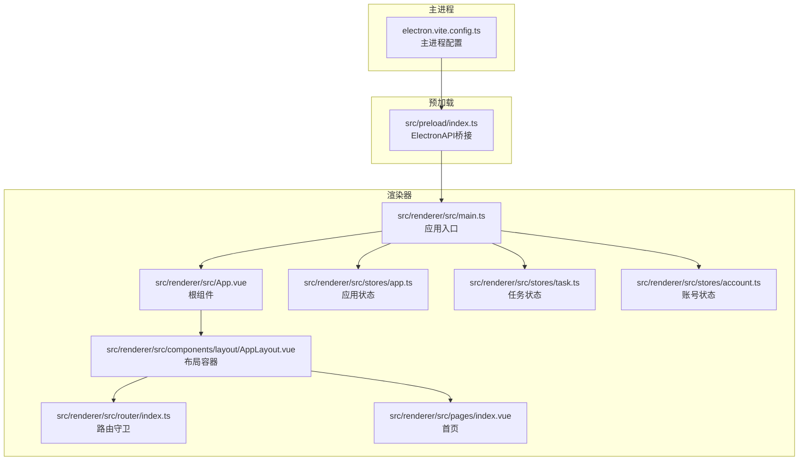
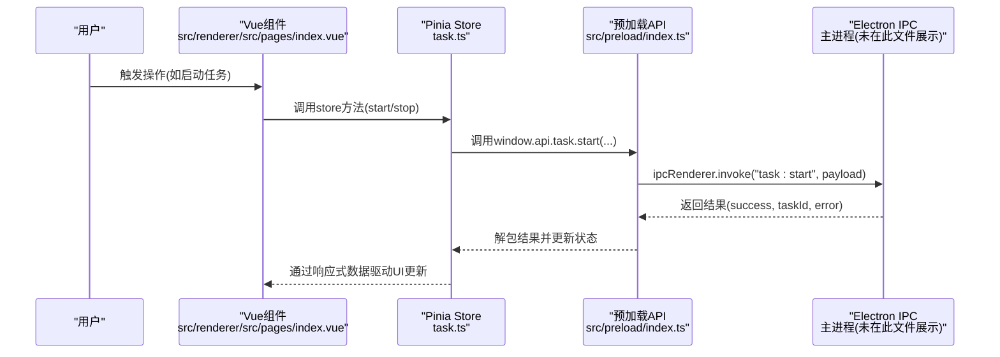
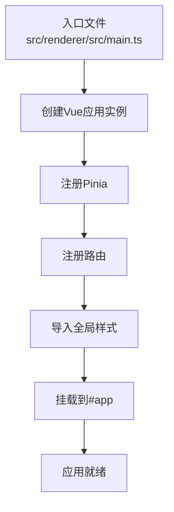
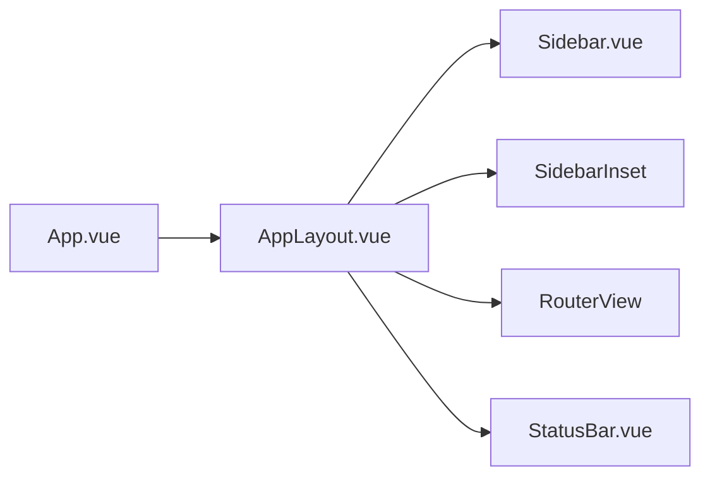
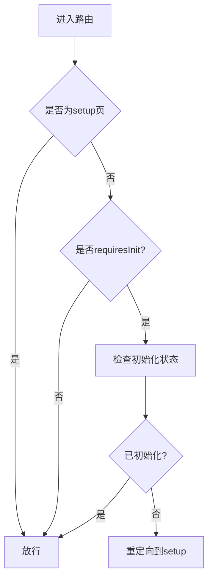
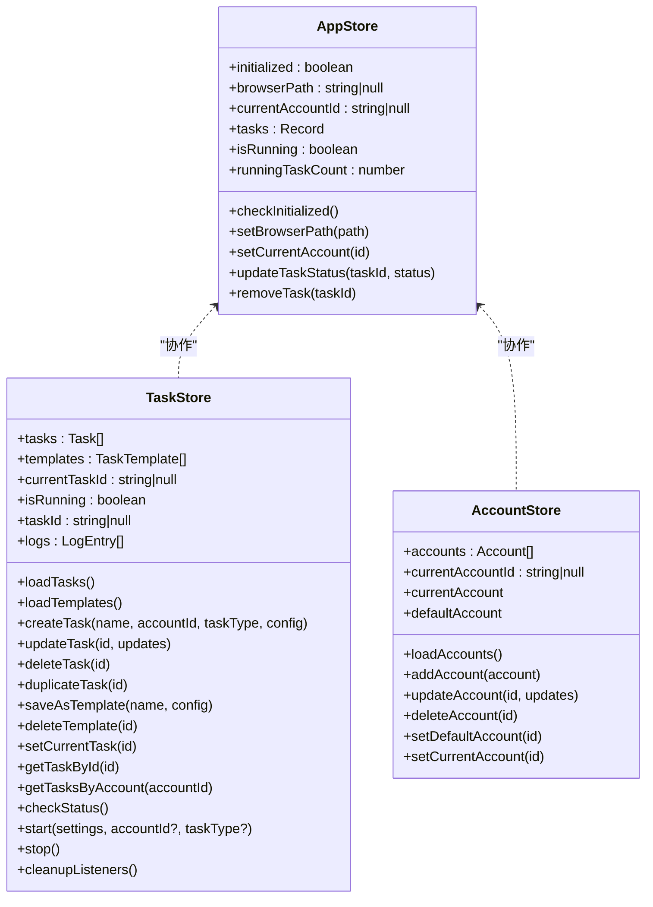
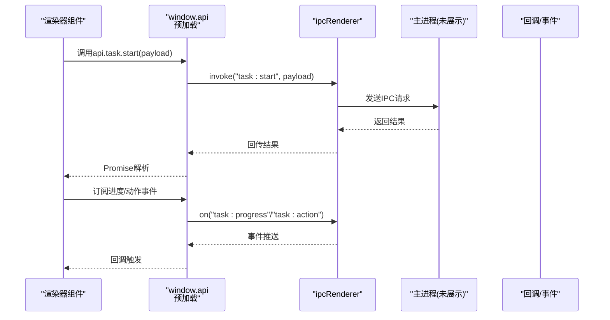
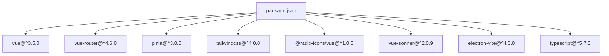

# Vue应用架构

<cite>
**本文档引用的文件**
- [package.json](file://package.json)
- [electron.vite.config.ts](file://electron.vite.config.ts)
- [src/renderer/src/main.ts](file://src/renderer/src/main.ts)
- [src/renderer/src/App.vue](file://src/renderer/src/App.vue)
- [src/renderer/src/router/index.ts](file://src/renderer/src/router/index.ts)
- [src/renderer/src/stores/app.ts](file://src/renderer/src/stores/app.ts)
- [src/renderer/src/stores/task.ts](file://src/renderer/src/stores/task.ts)
- [src/renderer/src/stores/account.ts](file://src/renderer/src/stores/account.ts)
- [src/renderer/src/components/layout/AppLayout.vue](file://src/renderer/src/components/layout/AppLayout.vue)
- [src/renderer/src/pages/index.vue](file://src/renderer/src/pages/index.vue)
- [src/preload/index.ts](file://src/preload/index.ts)
- [src/renderer/src/lib/utils.ts](file://src/renderer/src/lib/utils.ts)
- [src/renderer/src/env.d.ts](file://src/renderer/src/env.d.ts)
- [tsconfig.app.json](file://tsconfig.app.json)
- [src/shared/task.ts](file://src/shared/task.ts)
</cite>

## 目录
1. [简介](#简介)
2. [项目结构](#项目结构)
3. [核心组件](#核心组件)
4. [架构总览](#架构总览)
5. [详细组件分析](#详细组件分析)
6. [依赖关系分析](#依赖关系分析)
7. [性能考虑](#性能考虑)
8. [故障排除指南](#故障排除指南)
9. [结论](#结论)
10. [附录](#附录)

## 简介
本文件面向AutoOps Vue应用的架构与实现，围绕以下目标展开：  
- 解释Vue 3应用的整体架构设计、组件层次结构与初始化流程  
- 说明应用入口点配置、TypeScript集成与环境变量管理  
- 阐述单文件组件组织方式、模板编译过程与运行时优化  
- 梳理应用生命周期管理、错误边界处理与性能监控策略  
- 提供架构图、最佳实践与常见问题解决方案，帮助开发者理解核心设计理念与扩展方法  

## 项目结构
AutoOps采用Electron-Vite工程化方案，将主进程、预加载脚本与渲染器三部分清晰分离，并在渲染器内通过Vue 3 + Pinia + Vue Router构建单页应用。  
- 主进程与预加载：通过electron-vite配置别名与插件，隔离主进程与渲染器代码  
- 渲染器应用：以src/renderer为根目录，包含页面、组件、路由、状态管理与样式  
- 共享类型：src/shared存放跨进程共享的数据模型与工具函数  
- 构建配置：electron.vite.config.ts统一管理主/预加载/渲染器三端的构建参数与插件链

**图表来源**
- [electron.vite.config.ts:1-34](file://electron.vite.config.ts#L1-L34)
- [src/preload/index.ts:1-187](file://src/preload/index.ts#L1-L187)
- [src/renderer/src/main.ts:1-12](file://src/renderer/src/main.ts#L1-L12)
- [src/renderer/src/App.vue:1-11](file://src/renderer/src/App.vue#L1-L11)
- [src/renderer/src/components/layout/AppLayout.vue:1-24](file://src/renderer/src/components/layout/AppLayout.vue#L1-L24)
- [src/renderer/src/router/index.ts:1-60](file://src/renderer/src/router/index.ts#L1-L60)
- [src/renderer/src/stores/app.ts:1-71](file://src/renderer/src/stores/app.ts#L1-L71)
- [src/renderer/src/stores/task.ts:1-192](file://src/renderer/src/stores/task.ts#L1-L192)
- [src/renderer/src/stores/account.ts:1-82](file://src/renderer/src/stores/account.ts#L1-L82)
- [src/renderer/src/pages/index.vue:1-248](file://src/renderer/src/pages/index.vue#L1-L248)

**章节来源**
- [electron.vite.config.ts:1-34](file://electron.vite.config.ts#L1-L34)
- [package.json:1-85](file://package.json#L1-L85)

## 核心组件
- 应用入口与初始化：在渲染器入口中创建Vue应用实例，注册Pinia与路由，挂载到DOM  
- 根组件：引入全局通知组件与布局容器，作为页面渲染的根节点  
- 布局容器：提供侧边栏、内容区与状态栏的组合布局  
- 路由系统：基于哈希历史模式，配合路由守卫实现初始化检查与页面导航  
- 状态管理：Pinia Store负责应用状态、任务状态与账号状态的集中管理  
- 预加载桥接：通过contextBridge暴露ElectronAPI，封装IPC调用接口  
- 类型声明：env.d.ts声明窗口对象与Vue组件模块，确保TypeScript正确识别

**章节来源**
- [src/renderer/src/main.ts:1-12](file://src/renderer/src/main.ts#L1-L12)
- [src/renderer/src/App.vue:1-11](file://src/renderer/src/App.vue#L1-L11)
- [src/renderer/src/components/layout/AppLayout.vue:1-24](file://src/renderer/src/components/layout/AppLayout.vue#L1-L24)
- [src/renderer/src/router/index.ts:1-60](file://src/renderer/src/router/index.ts#L1-L60)
- [src/renderer/src/stores/app.ts:1-71](file://src/renderer/src/stores/app.ts#L1-L71)
- [src/renderer/src/stores/task.ts:1-192](file://src/renderer/src/stores/task.ts#L1-L192)
- [src/renderer/src/stores/account.ts:1-82](file://src/renderer/src/stores/account.ts#L1-L82)
- [src/preload/index.ts:1-187](file://src/preload/index.ts#L1-L187)
- [src/renderer/src/env.d.ts:1-11](file://src/renderer/src/env.d.ts#L1-L11)

## 架构总览
下图展示从用户交互到IPC通信再到主进程处理的完整链路，体现渲染器、预加载与主进程之间的职责划分。

**图表来源**
- [src/renderer/src/pages/index.vue:1-248](file://src/renderer/src/pages/index.vue#L1-L248)
- [src/renderer/src/stores/task.ts:1-192](file://src/renderer/src/stores/task.ts#L1-L192)
- [src/preload/index.ts:1-187](file://src/preload/index.ts#L1-L187)

## 详细组件分析

### 应用入口与初始化流程
- 创建应用实例：在入口文件中导入Vue、Pinia、路由与全局样式，创建应用实例  
- 注册插件：按序use Pinia与路由，保证后续组件可访问store与路由能力  
- 挂载应用：将应用挂载到DOM元素，完成初始化渲染

**图表来源**
- [src/renderer/src/main.ts:1-12](file://src/renderer/src/main.ts#L1-L12)

**章节来源**
- [src/renderer/src/main.ts:1-12](file://src/renderer/src/main.ts#L1-L12)

### 根组件与布局容器
- 根组件：引入全局通知组件与布局容器，作为页面渲染的根节点  
- 布局容器：提供侧边栏、内容区与状态栏的组合布局，内部使用RouterView承载路由视图

**图表来源**
- [src/renderer/src/App.vue:1-11](file://src/renderer/src/App.vue#L1-L11)
- [src/renderer/src/components/layout/AppLayout.vue:1-24](file://src/renderer/src/components/layout/AppLayout.vue#L1-L24)

**章节来源**
- [src/renderer/src/App.vue:1-11](file://src/renderer/src/App.vue#L1-L11)
- [src/renderer/src/components/layout/AppLayout.vue:1-24](file://src/renderer/src/components/layout/AppLayout.vue#L1-L24)

### 路由系统与导航守卫
- 路由定义：采用动态导入页面组件，减少首屏体积  
- 导航守卫：对需要初始化的页面进行检查，若未完成初始化则重定向至设置页  
- 历史模式：使用哈希历史模式，适配桌面应用场景

**图表来源**
- [src/renderer/src/router/index.ts:1-60](file://src/renderer/src/router/index.ts#L1-L60)

**章节来源**
- [src/renderer/src/router/index.ts:1-60](file://src/renderer/src/router/index.ts#L1-L60)

### 状态管理：应用、任务与账号
- 应用状态：维护初始化标志、浏览器路径、当前账号与任务集合，计算运行状态与计数  
- 任务状态：封装任务CRUD、模板管理、日志收集与IPC监听，支持启动/停止任务并订阅进度与动作事件  
- 账号状态：提供账号列表、默认账号、增删改查与当前账号切换

**图表来源**
- [src/renderer/src/stores/app.ts:1-71](file://src/renderer/src/stores/app.ts#L1-L71)
- [src/renderer/src/stores/task.ts:1-192](file://src/renderer/src/stores/task.ts#L1-L192)
- [src/renderer/src/stores/account.ts:1-82](file://src/renderer/src/stores/account.ts#L1-L82)

**章节来源**
- [src/renderer/src/stores/app.ts:1-71](file://src/renderer/src/stores/app.ts#L1-L71)
- [src/renderer/src/stores/task.ts:1-192](file://src/renderer/src/stores/task.ts#L1-L192)
- [src/renderer/src/stores/account.ts:1-82](file://src/renderer/src/stores/account.ts#L1-L82)

### 预加载桥接与IPC通信
- 接口定义：在预加载脚本中定义ElectronAPI接口，覆盖认证、任务、账号、设置、文件选择等能力  
- 实现桥接：通过contextBridge.exposeInMainWorld暴露window.api，将IPC调用封装为Promise接口  
- 使用约定：渲染器通过window.api.method(...)调用，预加载层转发到ipcRenderer.invoke/on

**图表来源**
- [src/preload/index.ts:1-187](file://src/preload/index.ts#L1-L187)

**章节来源**
- [src/preload/index.ts:1-187](file://src/preload/index.ts#L1-L187)

### 页面与组件组织
- 页面组件：首页等页面通过组合UI组件与状态管理实现业务逻辑  
- UI组件：采用原子化组件库，通过cn工具类合并样式，保持一致的外观与行为  
- 组件复用：布局容器与UI组件在多页面复用，降低重复开发成本

**章节来源**
- [src/renderer/src/pages/index.vue:1-248](file://src/renderer/src/pages/index.vue#L1-L248)
- [src/renderer/src/lib/utils.ts:1-8](file://src/renderer/src/lib/utils.ts#L1-L8)

### TypeScript集成与类型声明
- 类型声明：env.d.ts声明*.vue模块与window.api类型，确保IDE与TS编译器正确识别  
- 编译配置：tsconfig.app.json包含渲染器源码、共享类型与预加载声明，配置路径别名  
- 依赖版本：package.json声明Vue 3、Pinia、Vue Router与TypeScript等核心依赖

**章节来源**
- [src/renderer/src/env.d.ts:1-11](file://src/renderer/src/env.d.ts#L1-L11)
- [tsconfig.app.json:1-18](file://tsconfig.app.json#L1-L18)
- [package.json:16-49](file://package.json#L16-L49)

## 依赖关系分析
- 外部依赖：Vue 3、Pinia、Vue Router、TailwindCSS、Radix UI组件库、Sonner通知等  
- 构建工具：Vite、@vitejs/plugin-vue、@tailwindcss/vite、electron-vite  
- 打包配置：electron-builder，支持Windows、macOS与Linux多平台产物

**图表来源**
- [package.json:16-49](file://package.json#L16-L49)

**章节来源**
- [package.json:16-49](file://package.json#L16-L49)

## 性能考虑
- 代码分割与懒加载：路由页面采用动态导入，减少首屏加载体积  
- 响应式数据最小化：Store仅维护必要状态，避免不必要的响应式开销  
- 事件清理：任务监听器在启动/停止时清理，防止内存泄漏  
- 样式合并：使用clsx与tailwind-merge合并类名，减少样式冲突与冗余  
- 构建优化：Vite与electron-vite提供快速热更新与生产构建优化

**章节来源**
- [src/renderer/src/router/index.ts:1-60](file://src/renderer/src/router/index.ts#L1-L60)
- [src/renderer/src/stores/task.ts:89-98](file://src/renderer/src/stores/task.ts#L89-L98)
- [src/renderer/src/lib/utils.ts:1-8](file://src/renderer/src/lib/utils.ts#L1-L8)

## 故障排除指南
- 初始化失败或无法进入主页：检查路由守卫中的初始化检查逻辑，确认应用状态store已正确设置初始化标志  
- 任务启动无响应：查看任务store的start方法与IPC调用链路，确认window.api.task.start返回值与事件订阅是否正常  
- 进度/动作事件不触发：确认预加载层onProgress/onAction回调是否正确注册与注销，避免重复监听导致内存泄漏  
- 类型错误或模块找不到：核对env.d.ts与tsconfig.app.json的路径别名与包含范围，确保*.vue与共享类型被正确识别

**章节来源**
- [src/renderer/src/router/index.ts:44-60](file://src/renderer/src/router/index.ts#L44-L60)
- [src/renderer/src/stores/task.ts:100-144](file://src/renderer/src/stores/task.ts#L100-L144)
- [src/preload/index.ts:106-115](file://src/preload/index.ts#L106-L115)
- [src/renderer/src/env.d.ts:1-11](file://src/renderer/src/env.d.ts#L1-L11)
- [tsconfig.app.json:1-18](file://tsconfig.app.json#L1-L18)

## 结论
AutoOps采用清晰的分层架构：渲染器以Vue 3为核心，结合Pinia与Vue Router实现状态与导航；通过预加载桥接实现安全的IPC通信；借助electron-vite与Vite完成高效开发与构建。该架构具备良好的可扩展性与可维护性，适合在桌面应用中实现复杂的自动化运营功能。

## 附录
- 最佳实践
  - 使用动态导入页面组件，提升首屏性能  
  - 在store中集中管理副作用与IPC调用，保持组件简洁  
  - 合理使用路由守卫进行权限与初始化校验  
  - 使用cn工具类与TailwindCSS实现一致的样式体系  
- 扩展建议
  - 引入错误边界组件捕获渲染期异常  
  - 增加性能监控埋点，记录关键指标（首屏时间、任务启动耗时等）  
  - 对共享类型进行版本化管理，确保跨进程兼容性