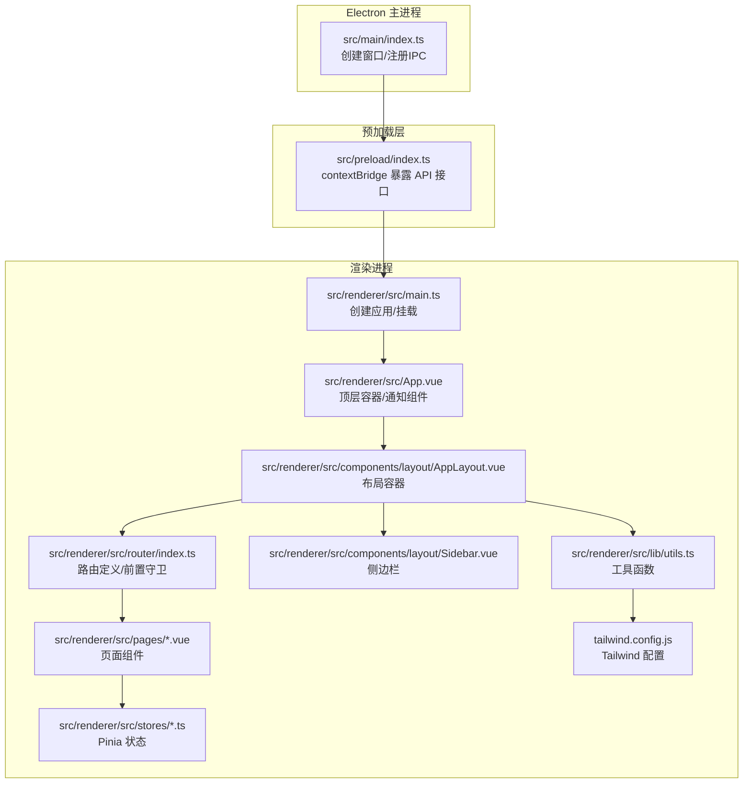
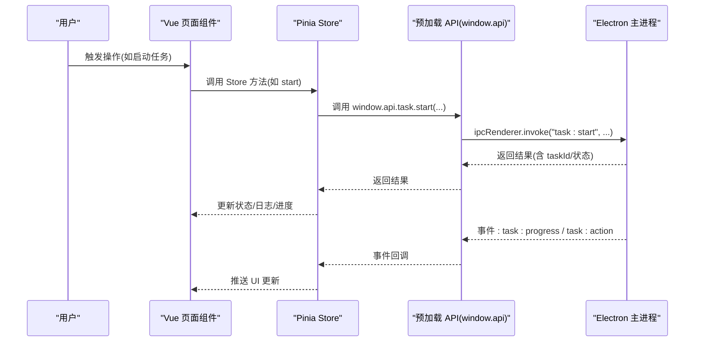
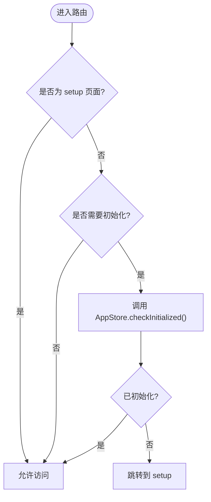
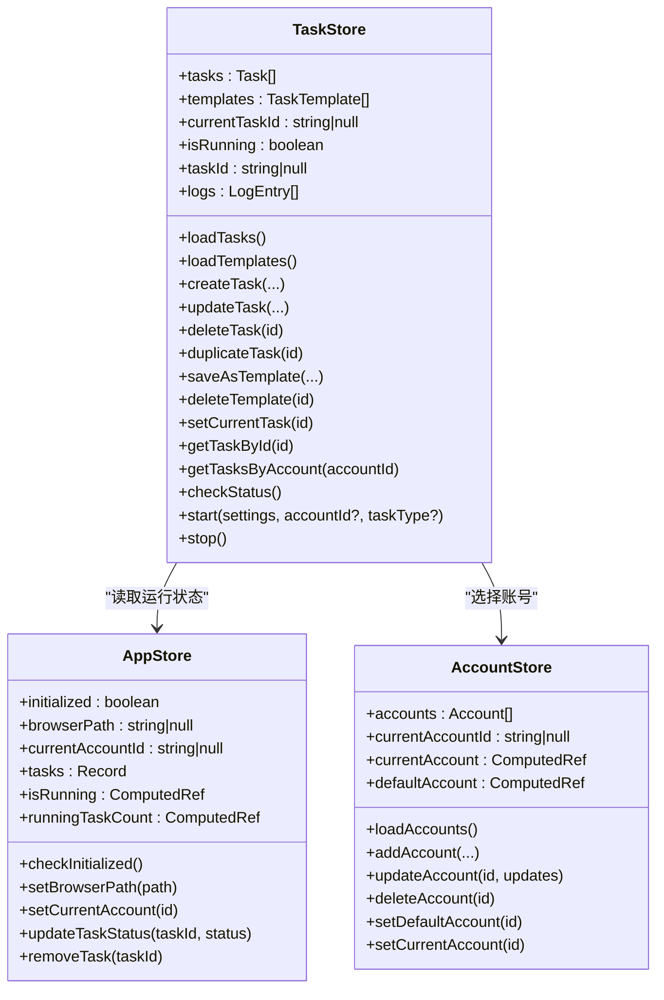
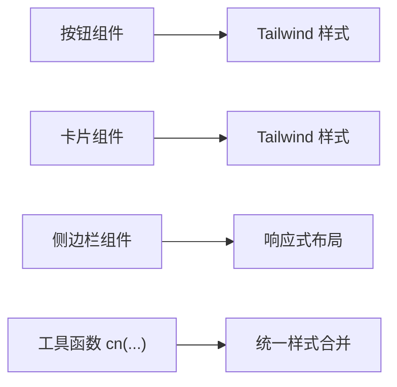
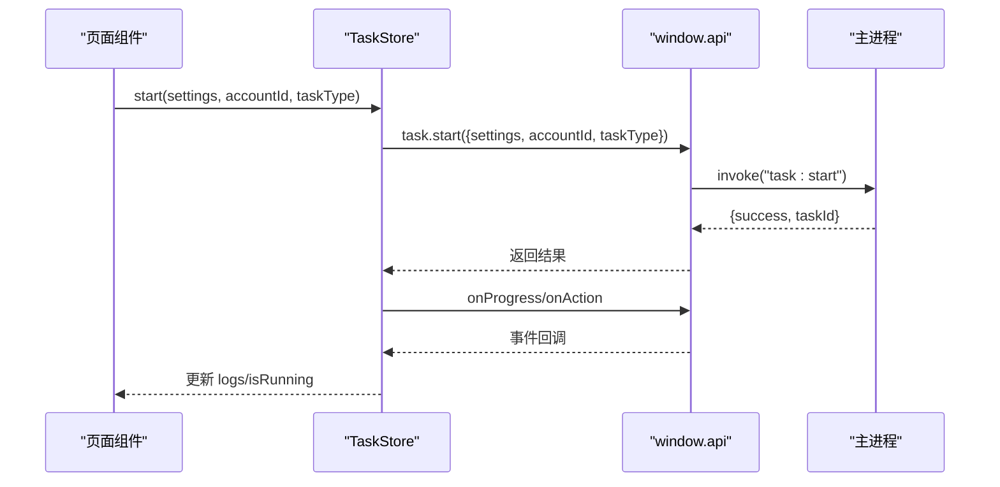
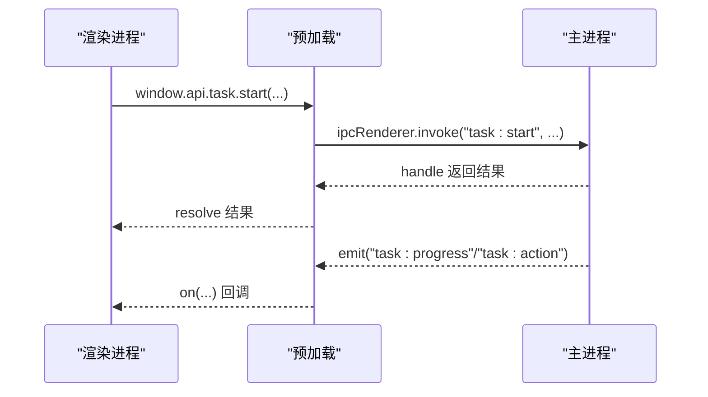
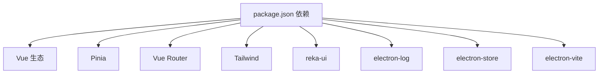

# 前端应用

<cite>
**本文引用的文件**
- [src/renderer/src/main.ts](file://src/renderer/src/main.ts)
- [src/renderer/src/App.vue](file://src/renderer/src/App.vue)
- [src/renderer/src/router/index.ts](file://src/renderer/src/router/index.ts)
- [src/renderer/src/components/layout/AppLayout.vue](file://src/renderer/src/components/layout/AppLayout.vue)
- [src/renderer/src/components/layout/Sidebar.vue](file://src/renderer/src/components/layout/Sidebar.vue)
- [src/renderer/src/lib/utils.ts](file://src/renderer/src/lib/utils.ts)
- [tailwind.config.js](file://tailwind.config.js)
- [src/renderer/src/pages/index.vue](file://src/renderer/src/pages/index.vue)
- [src/renderer/src/stores/app.ts](file://src/renderer/src/stores/app.ts)
- [src/renderer/src/stores/task.ts](file://src/renderer/src/stores/task.ts)
- [src/renderer/src/stores/account.ts](file://src/renderer/src/stores/account.ts)
- [src/preload/index.ts](file://src/preload/index.ts)
- [src/main/index.ts](file://src/main/index.ts)
- [package.json](file://package.json)
- [src/shared/platform.ts](file://src/shared/platform.ts)
</cite>

## 目录
1. [简介](#简介)
2. [项目结构](#项目结构)
3. [核心组件](#核心组件)
4. [架构总览](#架构总览)
5. [详细组件分析](#详细组件分析)
6. [依赖关系分析](#依赖关系分析)
7. [性能考量](#性能考量)
8. [故障排查指南](#故障排查指南)
9. [结论](#结论)
10. [附录](#附录)

## 简介
本文件面向前端开发者，系统性梳理 AutoOps 前端应用的架构与使用方法，覆盖 Vue 3 组件层次、路由策略、状态管理、UI 组件库、响应式布局、组件间通信、数据流、与主进程交互、安全与性能优化等主题。目标是帮助你快速理解并高效扩展应用功能。

## 项目结构
该应用采用 Electron + Vue 3 + Pinia + Vue Router 的组合：Electron 主进程负责窗口创建与 IPC 注册；渲染进程承载 Vue 应用，通过预加载脚本暴露受控 API 给页面代码调用。

**图表来源**
- [src/main/index.ts:22-52](file://src/main/index.ts#L22-L52)
- [src/preload/index.ts:1-187](file://src/preload/index.ts#L1-L187)
- [src/renderer/src/main.ts:1-12](file://src/renderer/src/main.ts#L1-L12)
- [src/renderer/src/App.vue:1-11](file://src/renderer/src/App.vue#L1-L11)
- [src/renderer/src/router/index.ts:1-60](file://src/renderer/src/router/index.ts#L1-L60)
- [src/renderer/src/components/layout/AppLayout.vue:1-24](file://src/renderer/src/components/layout/AppLayout.vue#L1-L24)
- [src/renderer/src/components/layout/Sidebar.vue:1-86](file://src/renderer/src/components/layout/Sidebar.vue#L1-L86)
- [src/renderer/src/lib/utils.ts:1-8](file://src/renderer/src/lib/utils.ts#L1-L8)
- [tailwind.config.js:1-57](file://tailwind.config.js#L1-L57)

**章节来源**
- [src/renderer/src/main.ts:1-12](file://src/renderer/src/main.ts#L1-L12)
- [src/renderer/src/App.vue:1-11](file://src/renderer/src/App.vue#L1-L11)
- [src/renderer/src/router/index.ts:1-60](file://src/renderer/src/router/index.ts#L1-L60)
- [src/renderer/src/components/layout/AppLayout.vue:1-24](file://src/renderer/src/components/layout/AppLayout.vue#L1-L24)
- [src/renderer/src/components/layout/Sidebar.vue:1-86](file://src/renderer/src/components/layout/Sidebar.vue#L1-L86)
- [src/renderer/src/lib/utils.ts:1-8](file://src/renderer/src/lib/utils.ts#L1-L8)
- [tailwind.config.js:1-57](file://tailwind.config.js#L1-L57)

## 核心组件
- 应用入口与挂载
  - 渲染进程入口创建 Vue 应用，安装 Pinia 与路由，并挂载到 DOM。
- 顶层布局与通知
  - App.vue 引入全局通知组件，包裹布局组件。
- 布局容器
  - AppLayout 提供 SidebarProvider/SidebarInset/SidebarTrigger 包裹，配合侧边栏与内容区。
- 页面组件
  - 控制台首页负责统计、最近执行记录与导航；其他页面按路由懒加载。
- 状态管理
  - Pinia Store：应用状态（初始化、浏览器路径、任务列表）、任务状态、账号信息。
- UI 组件库
  - 使用 reka-ui 组件集（按钮、卡片、对话框、表格、侧边栏等），结合 Tailwind 实现样式与响应式。
- 预加载与 IPC
  - 预加载脚本通过 contextBridge 暴露受控 API，渲染进程以 window.api.* 调用主进程能力。
- 路由策略
  - 基于哈希模式的路由；部分页面需要“初始化”检查，未完成则重定向至设置页。

**章节来源**
- [src/renderer/src/main.ts:1-12](file://src/renderer/src/main.ts#L1-L12)
- [src/renderer/src/App.vue:1-11](file://src/renderer/src/App.vue#L1-L11)
- [src/renderer/src/components/layout/AppLayout.vue:1-24](file://src/renderer/src/components/layout/AppLayout.vue#L1-L24)
- [src/renderer/src/pages/index.vue:1-248](file://src/renderer/src/pages/index.vue#L1-L248)
- [src/renderer/src/stores/app.ts:1-71](file://src/renderer/src/stores/app.ts#L1-L71)
- [src/renderer/src/stores/task.ts:1-192](file://src/renderer/src/stores/task.ts#L1-L192)
- [src/renderer/src/stores/account.ts:1-82](file://src/renderer/src/stores/account.ts#L1-L82)
- [src/preload/index.ts:1-187](file://src/preload/index.ts#L1-L187)
- [src/renderer/src/router/index.ts:1-60](file://src/renderer/src/router/index.ts#L1-L60)

## 架构总览
下图展示从用户操作到主进程处理的端到端流程，以及状态在渲染进程内的流转。

**图表来源**
- [src/renderer/src/stores/task.ts:100-144](file://src/renderer/src/stores/task.ts#L100-L144)
- [src/preload/index.ts:102-116](file://src/preload/index.ts#L102-L116)
- [src/main/index.ts:1-106](file://src/main/index.ts#L1-L106)

## 详细组件分析

### 路由与页面组件
- 路由配置
  - 使用哈希历史；部分页面（首页、任务、账号、设置）标记 requiresInit，进入前检查初始化状态。
  - setup 页面无需初始化，直接放行。
- 页面组件设计
  - 控制台首页聚合统计、最近执行记录、快捷入口；使用 UI 卡片、按钮、徽章等组件。
  - 通过计算属性汇总任务与历史数据，格式化时间与状态颜色。
  - 生命周期中并行加载任务、模板与账号数据，并拉取任务历史。

**图表来源**
- [src/renderer/src/router/index.ts:44-60](file://src/renderer/src/router/index.ts#L44-L60)
- [src/renderer/src/stores/app.ts:32-37](file://src/renderer/src/stores/app.ts#L32-L37)

**章节来源**
- [src/renderer/src/router/index.ts:1-60](file://src/renderer/src/router/index.ts#L1-L60)
- [src/renderer/src/pages/index.vue:1-248](file://src/renderer/src/pages/index.vue#L1-L248)
- [src/renderer/src/stores/app.ts:1-71](file://src/renderer/src/stores/app.ts#L1-L71)

### 状态管理（Pinia）
- 应用状态（app store）
  - 管理初始化标志、浏览器路径、当前账号、任务映射、运行状态与计数。
  - 提供检查初始化、设置浏览器路径、更新任务状态、移除任务等方法。
- 任务状态（task store）
  - 管理任务列表、模板、当前任务、运行状态、日志。
  - 提供 CRUD、复制、保存模板、启动/停止任务、订阅进度与动作事件。
  - 内部清理事件监听器，避免重复订阅。
- 账号状态（account store）
  - 管理账号列表、默认账号、当前账号。
  - 提供加载、增删改、设默认、切换当前账号等方法。

**图表来源**
- [src/renderer/src/stores/app.ts:1-71](file://src/renderer/src/stores/app.ts#L1-L71)
- [src/renderer/src/stores/task.ts:1-192](file://src/renderer/src/stores/task.ts#L1-L192)
- [src/renderer/src/stores/account.ts:1-82](file://src/renderer/src/stores/account.ts#L1-L82)

**章节来源**
- [src/renderer/src/stores/app.ts:1-71](file://src/renderer/src/stores/app.ts#L1-L71)
- [src/renderer/src/stores/task.ts:1-192](file://src/renderer/src/stores/task.ts#L1-L192)
- [src/renderer/src/stores/account.ts:1-82](file://src/renderer/src/stores/account.ts#L1-L82)

### UI 组件库与响应式布局
- 组件库
  - 使用 reka-ui 提供的按钮、卡片、对话框、侧边栏、表格、标签页、提示等组件。
- 响应式与样式
  - Tailwind 配置启用暗色模式、容器居中、自定义颜色与圆角；工具函数 cn 合并类名。
  - 侧边栏组件根据设备类型（移动端/桌面端）切换显示方式，支持折叠/展开。
- 设计思路
  - 页面采用卡片化布局，统计信息以卡片网格展示；点击卡片可导航至对应模块。
  - 通过图标与颜色区分任务状态，提升可读性。

**图表来源**
- [src/renderer/src/components/layout/Sidebar.vue:1-86](file://src/renderer/src/components/layout/Sidebar.vue#L1-L86)
- [src/renderer/src/lib/utils.ts:1-8](file://src/renderer/src/lib/utils.ts#L1-L8)
- [tailwind.config.js:1-57](file://tailwind.config.js#L1-L57)

**章节来源**
- [src/renderer/src/components/layout/Sidebar.vue:1-86](file://src/renderer/src/components/layout/Sidebar.vue#L1-L86)
- [src/renderer/src/lib/utils.ts:1-8](file://src/renderer/src/lib/utils.ts#L1-L8)
- [tailwind.config.js:1-57](file://tailwind.config.js#L1-L57)

### 组件间通信与数据流
- 组件到 Store
  - 页面组件通过 Store 方法发起业务操作（如启动任务、加载数据）。
- Store 到 IPC
  - Store 通过 window.api.* 调用主进程能力，获取结果或订阅事件。
- 事件驱动
  - 任务运行期间通过 onProgress/onAction 订阅事件，Store 内部维护日志与状态。
- 数据流向
  - 初始化检查 -> 页面渲染 -> 用户交互 -> Store 调用 API -> 主进程执行 -> 事件回传 -> Store 更新 -> UI 反馈。

**图表来源**
- [src/renderer/src/stores/task.ts:100-144](file://src/renderer/src/stores/task.ts#L100-L144)
- [src/preload/index.ts:102-116](file://src/preload/index.ts#L102-L116)
- [src/main/index.ts:1-106](file://src/main/index.ts#L1-L106)

**章节来源**
- [src/renderer/src/stores/task.ts:1-192](file://src/renderer/src/stores/task.ts#L1-L192)
- [src/preload/index.ts:1-187](file://src/preload/index.ts#L1-L187)

### 与主进程的交互方式
- 预加载桥接
  - 预加载脚本通过 contextBridge.exposeInMainWorld 暴露 window.api 对象，包含认证、任务、账号、设置、文件选择、调试等接口。
- IPC 调用
  - 渲染进程以 ipcRenderer.invoke 发起请求，主进程以 ipcMain.handle 处理；事件通过 ipcRenderer.on 推送。
- 安全与隔离
  - 启用 contextIsolation，禁用 Node 集成，限制渲染进程直接访问 Node API；仅通过受控 API 交互。

**图表来源**
- [src/preload/index.ts:95-187](file://src/preload/index.ts#L95-L187)
- [src/main/index.ts:1-106](file://src/main/index.ts#L1-L106)

**章节来源**
- [src/preload/index.ts:1-187](file://src/preload/index.ts#L1-L187)
- [src/main/index.ts:1-106](file://src/main/index.ts#L1-L106)

### 平台与任务配置
- 平台抽象
  - 定义平台枚举、任务类型、平台配置（选择器、API 端点、快捷键）与登录结果/视频/评论等数据模型。
- 任务类型
  - 支持评论、点赞、收藏、关注、观看、组合任务等类型，配合模板与账号进行执行。

**章节来源**
- [src/shared/platform.ts:1-260](file://src/shared/platform.ts#L1-L260)

## 依赖关系分析
- 运行时依赖
  - Vue 3、Vue Router、Pinia、Tailwind、reka-ui、lucide-vue-next、electron-log、electron-store 等。
- 构建与打包
  - electron-vite、tailwindcss、typescript、vue-tsc 等；构建产物输出到 dist。
- 依赖耦合
  - 渲染进程对 UI 组件库与状态管理有强依赖；路由与布局组件相互协作；Store 通过预加载 API 间接依赖主进程。

**图表来源**
- [package.json:16-49](file://package.json#L16-L49)

**章节来源**
- [package.json:1-85](file://package.json#L1-L85)

## 性能考量
- 路由懒加载
  - 页面组件使用动态导入，减少首屏体积与加载时间。
- 并行初始化
  - 首页在 mounted 中并行加载任务、模板与账号数据，缩短首屏等待。
- 日志截断
  - 任务日志最多保留一定数量，避免内存膨胀。
- 事件清理
  - 任务启动前清理旧监听，防止重复订阅导致的性能与内存问题。
- 响应式布局
  - Tailwind 自动裁剪与动画插件，确保在不同设备上保持良好体验。

**章节来源**
- [src/renderer/src/pages/index.vue:42-50](file://src/renderer/src/pages/index.vue#L42-L50)
- [src/renderer/src/stores/task.ts:89-98](file://src/renderer/src/stores/task.ts#L89-L98)
- [tailwind.config.js:1-57](file://tailwind.config.js#L1-L57)

## 故障排查指南
- 初始化未完成导致页面无法访问
  - 检查 AppStore.checkInitialized 是否返回 true；若否，引导用户前往 setup 完成浏览器路径配置。
- 任务启动失败
  - 查看 Store 日志与返回错误；确认 window.api.task.start 的参数正确；检查主进程相关 IPC 是否注册成功。
- 事件不触发
  - 确认 onProgress/onAction 已正确订阅；检查主进程是否发送事件；注意启动前需先清理旧监听。
- 预加载 API 不可用
  - 确认预加载脚本已注入；检查 contextBridge 暴露的接口名称与签名；验证主进程是否注册对应 handle。
- 日志查看
  - 渲染进程可通过 window.api.debug.getEnv 获取环境信息；主进程接收 log 事件并写入日志文件。

**章节来源**
- [src/renderer/src/stores/app.ts:32-37](file://src/renderer/src/stores/app.ts#L32-L37)
- [src/renderer/src/stores/task.ts:100-144](file://src/renderer/src/stores/task.ts#L100-L144)
- [src/preload/index.ts:95-187](file://src/preload/index.ts#L95-L187)
- [src/main/index.ts:92-106](file://src/main/index.ts#L92-L106)

## 结论
本应用以清晰的分层架构实现跨平台自动化运营：Electron 主进程负责系统集成与安全隔离，渲染进程通过受控 API 与之通信；Vue 3 + Pinia 提供简洁的状态管理与组件化 UI；路由与布局保证良好的用户体验。遵循本文的架构与最佳实践，你可以稳定地扩展新功能、优化性能并保障安全性。

## 附录

### 组件 API 参考（基于 window.api）
- 认证
  - hasAuth(), login(authData), logout(), getAuth()
- 任务
  - start({ settings, accountId?, taskType? }), stop(), status(), onProgress(cb), onAction(cb)
- 抖音号设置
  - get(), update(settings), reset(), export(), import(settings)
- AI 设置
  - get(), update(settings), reset(), test(config)
- 浏览器
  - get(), set(path), detect()
- 账号
  - list(), add(account), update(id, updates), delete(id), setDefault(id), getDefault(), getById(id), getByPlatform(platform), getActiveAccounts()
- 登录
  - douyin()
- 文件选择
  - selectFile(options?), selectDirectory()
- 任务历史
  - getAll(), getById(id), add(record), update(id, updates), delete(id), clear()
- 任务详情
  - get(id), addVideoRecord(taskId, videoRecord), updateStatus(taskId, status)
- 任务 CRUD
  - getAll(), getById(id), getByAccount(accountId), create(data), update(id, updates), delete(id), duplicate(id)
- 任务模板
  - getAll(), save(name, config), delete(id)
- 调试
  - getEnv()

**章节来源**
- [src/preload/index.ts:3-93](file://src/preload/index.ts#L3-L93)

### 使用示例与定制指南
- 在页面中使用 Store
  - 导入相应 Store 并调用其方法（如 useTaskStore().start(...)）。
- 自定义 UI 组件
  - 基于 reka-ui 组件进行二次封装，保持一致的尺寸与风格；通过 Tailwind 类名微调。
- 响应式适配
  - 使用 Tailwind 断点与容器类，确保在移动端与桌面端均具备良好体验。
- 事件订阅
  - 在组件挂载时订阅事件，在卸载时取消订阅，避免内存泄漏。
- 安全建议
  - 严格使用 window.api.* 接口；避免在渲染进程中直接调用 Node API；对用户输入进行校验。

**章节来源**
- [src/renderer/src/stores/task.ts:100-144](file://src/renderer/src/stores/task.ts#L100-L144)
- [src/renderer/src/lib/utils.ts:1-8](file://src/renderer/src/lib/utils.ts#L1-L8)
- [tailwind.config.js:1-57](file://tailwind.config.js#L1-L57)