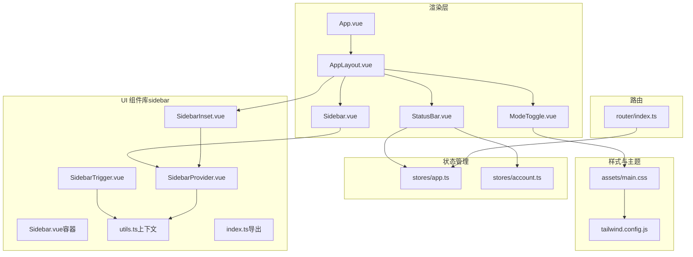
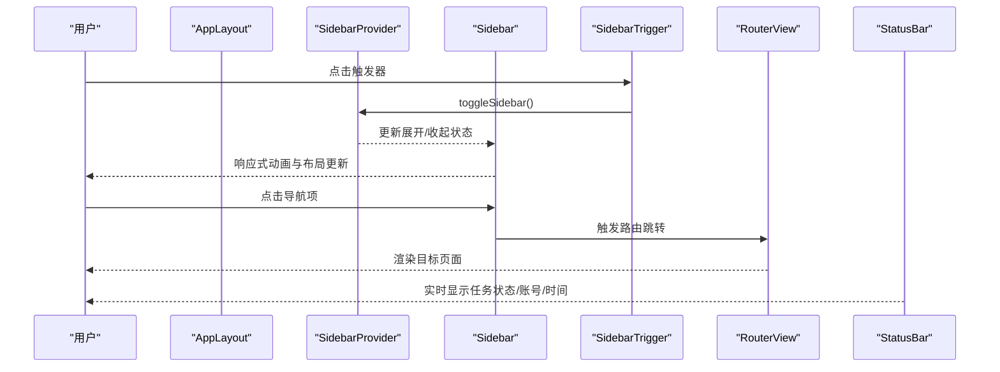
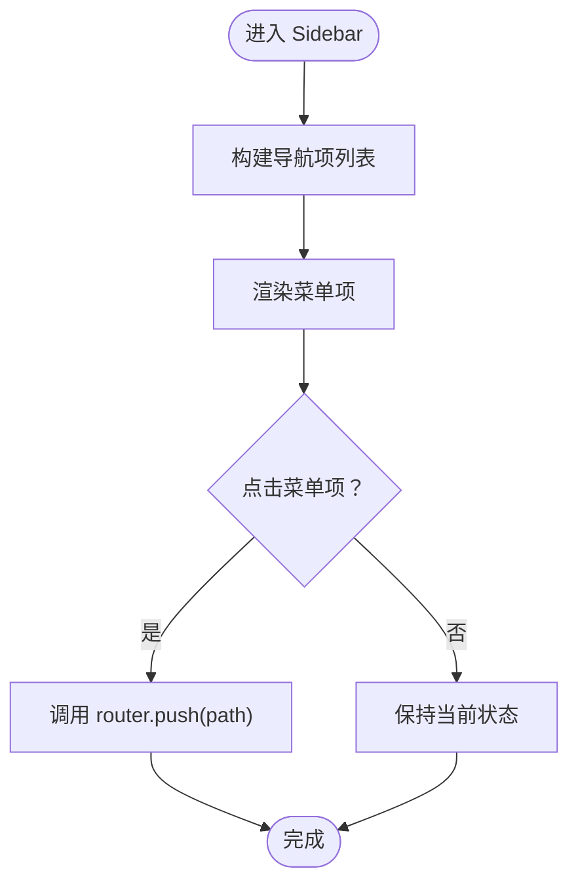
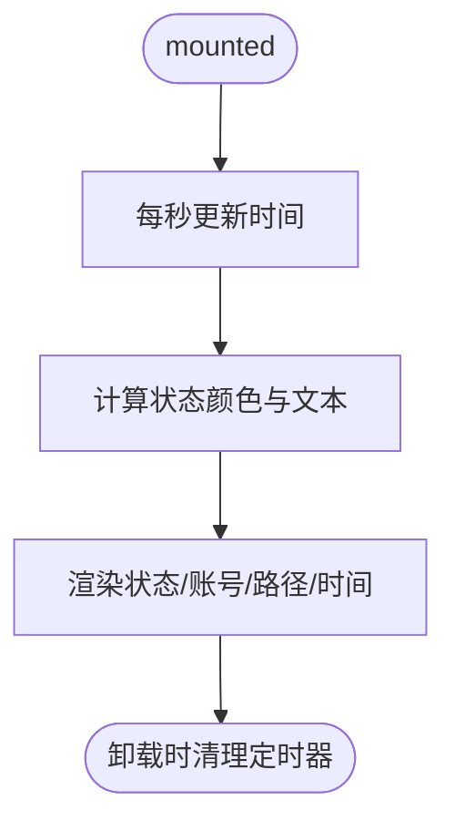
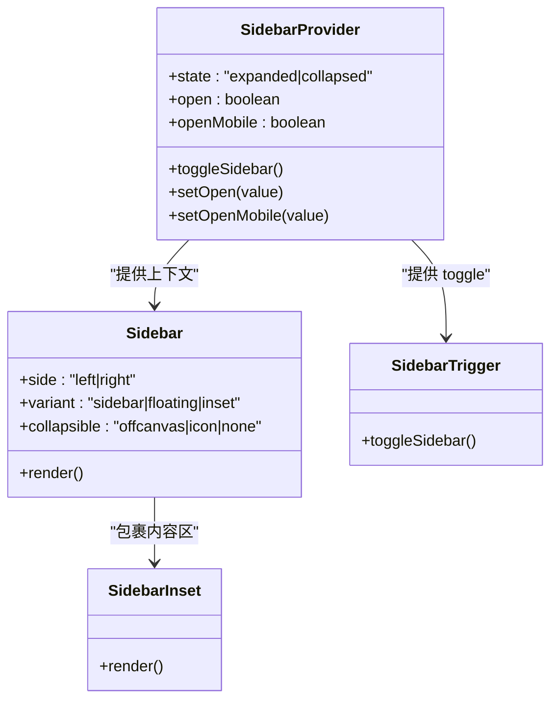
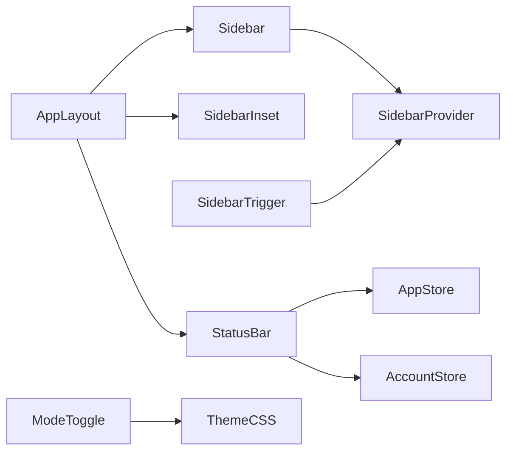

# 布局系统

<cite>
**本文引用的文件**
- [AppLayout.vue](file://src/renderer/src/components/layout/AppLayout.vue)
- [Sidebar.vue](file://src/renderer/src/components/layout/Sidebar.vue)
- [StatusBar.vue](file://src/renderer/src/components/layout/StatusBar.vue)
- [index.ts（侧边栏导出）](file://src/renderer/src/components/ui/sidebar/index.ts)
- [Sidebar.vue（侧边栏容器）](file://src/renderer/src/components/ui/sidebar/Sidebar.vue)
- [SidebarProvider.vue](file://src/renderer/src/components/ui/sidebar/SidebarProvider.vue)
- [utils.ts（侧边栏上下文）](file://src/renderer/src/components/ui/sidebar/utils.ts)
- [SidebarTrigger.vue](file://src/renderer/src/components/ui/sidebar/SidebarTrigger.vue)
- [SidebarInset.vue](file://src/renderer/src/components/ui/sidebar/SidebarInset.vue)
- [ModeToggle.vue](file://src/renderer/src/components/ModeToggle.vue)
- [app.ts（应用状态）](file://src/renderer/src/stores/app.ts)
- [account.ts（账号状态）](file://src/renderer/src/stores/account.ts)
- [utils.ts（工具函数）](file://src/renderer/src/lib/utils.ts)
- [main.css（全局样式）](file://src/renderer/src/assets/main.css)
- [App.vue](file://src/renderer/src/App.vue)
- [router/index.ts](file://src/renderer/src/router/index.ts)
- [tailwind.config.js](file://src/renderer/src/tailwind.config.js)
</cite>

## 目录
1. [简介](#简介)
2. [项目结构](#项目结构)
3. [核心组件](#核心组件)
4. [架构总览](#架构总览)
5. [组件详解](#组件详解)
6. [依赖关系分析](#依赖关系分析)
7. [性能考量](#性能考量)
8. [故障排查指南](#故障排查指南)
9. [结论](#结论)
10. [附录](#附录)

## 简介
本文件为 AutoOps 布局系统的设计与实现文档，聚焦于整体布局架构、响应式设计原则、组件化布局方案，以及 AppLayout 主布局、Sidebar 侧边栏交互逻辑、StatusBar 状态栏信息展示。文档还涵盖插槽系统、主题切换机制、移动端适配策略、布局定制与样式覆盖、动画效果、布局与页面组件协作、路由变化时的布局响应与用户体验优化等。

## 项目结构
AutoOps 的布局系统以 Vue 组合式 API 与 Pinia 状态管理为核心，采用组件化与可复用 UI 组件库（sidebar 子模块）构建。主布局 AppLayout 负责组织侧边栏、内容区与状态栏；Sidebar 提供导航菜单与触发器；StatusBar 展示应用状态、当前账号与浏览器路径；主题切换通过 ModeToggle 集成 ColorMode；全局样式基于 TailwindCSS 与 oklch 色彩空间，支持明暗主题。

图表来源
- [App.vue:1-11](file://src/renderer/src/App.vue#L1-L11)
- [AppLayout.vue:1-24](file://src/renderer/src/components/layout/AppLayout.vue#L1-L24)
- [Sidebar.vue:1-67](file://src/renderer/src/components/layout/Sidebar.vue#L1-L67)
- [StatusBar.vue:1-85](file://src/renderer/src/components/layout/StatusBar.vue#L1-L85)
- [SidebarProvider.vue:1-82](file://src/renderer/src/components/ui/sidebar/SidebarProvider.vue#L1-L82)
- [Sidebar.vue（容器）:1-86](file://src/renderer/src/components/ui/sidebar/Sidebar.vue#L1-L86)
- [SidebarInset.vue:1-21](file://src/renderer/src/components/ui/sidebar/SidebarInset.vue#L1-L21)
- [SidebarTrigger.vue:1-27](file://src/renderer/src/components/ui/sidebar/SidebarTrigger.vue#L1-L27)
- [utils.ts（侧边栏上下文）:1-20](file://src/renderer/src/components/ui/sidebar/utils.ts#L1-L20)
- [index.ts（侧边栏导出）:1-61](file://src/renderer/src/components/ui/sidebar/index.ts#L1-L61)
- [app.ts:1-71](file://src/renderer/src/stores/app.ts#L1-L71)
- [account.ts:1-82](file://src/renderer/src/stores/account.ts#L1-L82)
- [main.css:1-124](file://src/renderer/src/assets/main.css#L1-L124)
- [tailwind.config.js:1-57](file://src/renderer/src/tailwind.config.js#L1-L57)
- [router/index.ts:1-60](file://src/renderer/src/router/index.ts#L1-L60)

章节来源
- [App.vue:1-11](file://src/renderer/src/App.vue#L1-L11)
- [AppLayout.vue:1-24](file://src/renderer/src/components/layout/AppLayout.vue#L1-L24)
- [router/index.ts:1-60](file://src/renderer/src/router/index.ts#L1-L60)

## 核心组件
- AppLayout：主布局容器，负责组织侧边栏、内容区与状态栏，并通过 SidebarProvider 提供上下文能力。
- Sidebar：导航侧边栏，包含菜单项、图标、激活态判断与路由跳转。
- StatusBar：底部状态栏，显示任务运行状态、当前账号与浏览器路径、时间与时序提示。
- 侧边栏 UI 子模块：SidebarProvider、Sidebar、SidebarInset、SidebarTrigger、utils 等，提供响应式、可折叠、键盘快捷键与 Cookie 记忆等能力。
- 主题切换：ModeToggle 通过 ColorMode 切换明暗主题。
- 全局样式：main.css 定义 oklch 色彩变量与暗色变体，tailwind.config.js 扩展颜色与圆角。

章节来源
- [AppLayout.vue:1-24](file://src/renderer/src/components/layout/AppLayout.vue#L1-L24)
- [Sidebar.vue:1-67](file://src/renderer/src/components/layout/Sidebar.vue#L1-L67)
- [StatusBar.vue:1-85](file://src/renderer/src/components/layout/StatusBar.vue#L1-L85)
- [index.ts（侧边栏导出）:1-61](file://src/renderer/src/components/ui/sidebar/index.ts#L1-L61)
- [ModeToggle.vue:1-17](file://src/renderer/src/components/ModeToggle.vue#L1-L17)
- [main.css:1-124](file://src/renderer/src/assets/main.css#L1-L124)
- [tailwind.config.js:1-57](file://src/renderer/src/tailwind.config.js#L1-L57)

## 架构总览
AutoOps 布局系统采用“容器-组件”分层设计：
- 容器层：AppLayout、SidebarProvider、SidebarInset 负责布局骨架与上下文提供。
- 组件层：Sidebar、StatusBar、ModeToggle 等负责具体功能与展示。
- 状态层：Pinia stores（app、account）提供应用状态与数据。
- 样式层：TailwindCSS 变量与 oklch 色彩体系，支持主题切换与暗色模式。
- 路由层：router/index.ts 控制初始化检查与页面导航。

图表来源
- [AppLayout.vue:13-23](file://src/renderer/src/components/layout/AppLayout.vue#L13-L23)
- [SidebarTrigger.vue:12-25](file://src/renderer/src/components/ui/sidebar/SidebarTrigger.vue#L12-L25)
- [SidebarProvider.vue:42-51](file://src/renderer/src/components/ui/sidebar/SidebarProvider.vue#L42-L51)
- [Sidebar.vue:37-39](file://src/renderer/src/components/layout/Sidebar.vue#L37-L39)
- [StatusBar.vue:21-29](file://src/renderer/src/components/layout/StatusBar.vue#L21-L29)

## 组件详解

### AppLayout 主布局
- 职责：作为根布局容器，提供 SidebarProvider 上下文、挂载 AppSidebar、包裹 RouterView 与 StatusBar。
- 关键点：使用 SidebarProvider 包裹，确保子组件可访问侧边栏上下文；SidebarInset 提供内容区布局占位与背景。

章节来源
- [AppLayout.vue:1-24](file://src/renderer/src/components/layout/AppLayout.vue#L1-L24)

### Sidebar 侧边栏
- 导航项：首页、任务、账号、设置，对应不同图标与标签。
- 激活态：根据当前路由路径计算激活状态，支持前缀匹配。
- 交互：点击导航项触发路由跳转；通过 Tooltip 提示辅助信息。
- 结构：SidebarHeader、SidebarContent、SidebarGroup、SidebarMenu、SidebarMenuItem、SidebarMenuButton 等组合。

图表来源
- [Sidebar.vue:25-39](file://src/renderer/src/components/layout/Sidebar.vue#L25-L39)

章节来源
- [Sidebar.vue:1-67](file://src/renderer/src/components/layout/Sidebar.vue#L1-L67)

### StatusBar 状态栏
- 任务状态：根据 appStore.isRunning 动态显示“运行中/空闲”，并以彩色圆点标识。
- 当前账号：显示默认账号名称，若存在则展示，否则显示占位文本。
- 浏览器路径：显示已配置的浏览器路径，超长截断并在 Tooltip 中完整展示。
- 时间与时序：每秒更新本地时间字符串，提升实时性。
- 交互：TooltipProvider 包裹，统一提供 Tooltip 能力。

图表来源
- [StatusBar.vue:17-29](file://src/renderer/src/components/layout/StatusBar.vue#L17-L29)
- [StatusBar.vue:31-38](file://src/renderer/src/components/layout/StatusBar.vue#L31-L38)
- [StatusBar.vue:55-73](file://src/renderer/src/components/layout/StatusBar.vue#L55-L73)

章节来源
- [StatusBar.vue:1-85](file://src/renderer/src/components/layout/StatusBar.vue#L1-L85)
- [app.ts:24-26](file://src/renderer/src/stores/app.ts#L24-L26)
- [account.ts:22-24](file://src/renderer/src/stores/account.ts#L22-L24)

### 侧边栏 UI 子模块
- SidebarProvider：提供上下文（state、open、toggleSidebar 等），处理移动端与桌面端差异，支持键盘快捷键（Cmd/Ctrl+B）切换，Cookie 记忆展开状态。
- Sidebar：根据 collapsible、variant、side 等属性渲染不同形态（固定/浮动/嵌入、左右侧、图标折叠等），在移动端使用 Sheet 弹窗。
- SidebarInset：作为内容区容器，配合 variant/inset 产生阴影、圆角、间距等视觉效果。
- SidebarTrigger：触发器按钮，绑定 toggleSidebar。
- utils：定义常量（宽度、Cookie 名称、快捷键）与上下文提供/消费。

图表来源
- [SidebarProvider.vue:1-82](file://src/renderer/src/components/ui/sidebar/SidebarProvider.vue#L1-L82)
- [Sidebar.vue（容器）:1-86](file://src/renderer/src/components/ui/sidebar/Sidebar.vue#L1-L86)
- [SidebarTrigger.vue:1-27](file://src/renderer/src/components/ui/sidebar/SidebarTrigger.vue#L1-L27)
- [SidebarInset.vue:1-21](file://src/renderer/src/components/ui/sidebar/SidebarInset.vue#L1-L21)
- [utils.ts（侧边栏上下文）:1-20](file://src/renderer/src/components/ui/sidebar/utils.ts#L1-L20)

章节来源
- [index.ts（侧边栏导出）:1-61](file://src/renderer/src/components/ui/sidebar/index.ts#L1-L61)
- [SidebarProvider.vue:1-82](file://src/renderer/src/components/ui/sidebar/SidebarProvider.vue#L1-L82)
- [Sidebar.vue（容器）:1-86](file://src/renderer/src/components/ui/sidebar/Sidebar.vue#L1-L86)
- [SidebarTrigger.vue:1-27](file://src/renderer/src/components/ui/sidebar/SidebarTrigger.vue#L1-L27)
- [SidebarInset.vue:1-21](file://src/renderer/src/components/ui/sidebar/SidebarInset.vue#L1-L21)
- [utils.ts（侧边栏上下文）:1-20](file://src/renderer/src/components/ui/sidebar/utils.ts#L1-L20)

### 主题切换机制
- ModeToggle：通过 ColorMode 在 light/dark 之间切换，按钮显示太阳/月亮图标。
- 样式：main.css 定义 oklch 色彩变量与 .dark 变体，tailwind.config.js 将 hsl(var(--*)) 映射到主题色。
- 效果：切换后自动应用 Tailwind 变量，实现全站主题一致变更。

章节来源
- [ModeToggle.vue:1-17](file://src/renderer/src/components/ModeToggle.vue#L1-L17)
- [main.css:42-75](file://src/renderer/src/assets/main.css#L42-L75)
- [tailwind.config.js:14-54](file://src/renderer/src/tailwind.config.js#L14-L54)

### 移动端适配策略
- 媒体查询：SidebarProvider 使用媒体查询判断是否为移动端（最大宽度 768px）。
- 弹窗模式：移动端使用 Sheet 弹窗展示侧边栏，宽度与容器变量分离。
- 折叠行为：collapsible="icon" 时，仅显示图标，节省空间。
- 键盘快捷键：Cmd/Ctrl+B 快速切换侧边栏，提升移动端操作效率。

章节来源
- [SidebarProvider.vue:22-44](file://src/renderer/src/components/ui/sidebar/SidebarProvider.vue#L22-L44)
- [Sidebar.vue（容器）:29-43](file://src/renderer/src/components/ui/sidebar/Sidebar.vue#L29-L43)
- [utils.ts（侧边栏上下文）:6-9](file://src/renderer/src/components/ui/sidebar/utils.ts#L6-L9)

### 插槽系统与定制方法
- 插槽位置：AppLayout 在 SidebarInset 内部放置 RouterView 与 StatusBar，便于在不修改主布局的情况下插入自定义内容。
- 自定义样式：通过 cn 工具合并 Tailwind 类，结合 CSS 变量覆盖（如 --sidebar-*）实现主题与尺寸定制。
- 动画效果：Sidebar 容器使用过渡类与 CSS 变量控制宽度、透明度与定位动画，实现平滑展开/收起。

章节来源
- [AppLayout.vue:17-20](file://src/renderer/src/components/layout/AppLayout.vue#L17-L20)
- [utils.ts（工具函数）:5-7](file://src/renderer/src/lib/utils.ts#L5-L7)
- [main.css:32-39](file://src/renderer/src/assets/main.css#L32-L39)
- [Sidebar.vue（容器）:54-76](file://src/renderer/src/components/ui/sidebar/Sidebar.vue#L54-L76)

### 布局与页面组件协作、路由响应与用户体验
- 路由守卫：router/index.ts 对需要初始化的页面（requiresInit）进行检查，未初始化则重定向至 setup 页面。
- 页面渲染：AppLayout 内的 RouterView 动态加载各页面组件，与侧边栏导航联动。
- 用户体验：StatusBar 实时反馈任务状态与时间；Sidebar 支持键盘快捷键与记忆状态；移动端弹窗模式降低误触风险。

章节来源
- [router/index.ts:44-60](file://src/renderer/src/router/index.ts#L44-L60)
- [AppLayout.vue:18](file://src/renderer/src/components/layout/AppLayout.vue#L18)
- [StatusBar.vue:21-29](file://src/renderer/src/components/layout/StatusBar.vue#L21-L29)

## 依赖关系分析
- 组件耦合：AppLayout 低耦合地组合 Sidebar、SidebarInset、StatusBar；Sidebar 依赖路由与 UI 组件；StatusBar 依赖 Pinia stores。
- 外部依赖：Vue Router、Pinia、@vueuse/core（useColorMode、useMediaQuery）、TailwindCSS、Lucide 图标库。
- 上下文依赖：SidebarProvider 通过 provide/inject 提供上下文，Sidebar、SidebarTrigger、SidebarInset 依赖该上下文。

图表来源
- [AppLayout.vue:1-24](file://src/renderer/src/components/layout/AppLayout.vue#L1-L24)
- [Sidebar.vue:1-67](file://src/renderer/src/components/layout/Sidebar.vue#L1-L67)
- [StatusBar.vue:1-85](file://src/renderer/src/components/layout/StatusBar.vue#L1-L85)
- [SidebarProvider.vue:1-82](file://src/renderer/src/components/ui/sidebar/SidebarProvider.vue#L1-L82)
- [ModeToggle.vue:1-17](file://src/renderer/src/components/ModeToggle.vue#L1-L17)

章节来源
- [index.ts（侧边栏导出）:1-61](file://src/renderer/src/components/ui/sidebar/index.ts#L1-L61)
- [app.ts:1-71](file://src/renderer/src/stores/app.ts#L1-L71)
- [account.ts:1-82](file://src/renderer/src/stores/account.ts#L1-L82)

## 性能考量
- 渲染优化：Sidebar 使用 v-if/v-else 分支选择移动端弹窗或桌面固定布局，减少不必要的 DOM。
- 状态更新：StatusBar 的时间更新频率为 1 秒，避免高频重渲染；任务状态通过 computed 从 stores 中派生，按需更新。
- 动画性能：Sidebar 过渡使用 CSS 变量与 transform，避免强制同步布局；移动端弹窗使用原生 Sheet，减少 JS 动画开销。
- 主题切换：oklch 色彩变量与 Tailwind 变量映射，切换时仅改变 CSS 变量，避免大范围重绘。

## 故障排查指南
- 侧边栏无法展开/收起
  - 检查 SidebarProvider 是否正确包裹；确认 isMobile 判断与 Cookie 状态。
  - 参考：[SidebarProvider.vue:22-51](file://src/renderer/src/components/ui/sidebar/SidebarProvider.vue#L22-L51)
- 键盘快捷键无效
  - 确认事件监听与 Cmd/Ctrl 组合键处理；检查浏览器环境。
  - 参考：[SidebarProvider.vue:46-51](file://src/renderer/src/components/ui/sidebar/SidebarProvider.vue#L46-L51)
- 状态栏不显示时间
  - 检查 mounted 生命周期与定时器清理；确认组件未被意外卸载。
  - 参考：[StatusBar.vue:21-29](file://src/renderer/src/components/layout/StatusBar.vue#L21-L29)
- 主题切换不生效
  - 检查 .dark 类是否正确添加；确认 CSS 变量与 Tailwind 配置。
  - 参考：[main.css:42-75](file://src/renderer/src/assets/main.css#L42-L75)，[tailwind.config.js:3](file://src/renderer/src/tailwind.config.js#L3)
- 路由跳转后布局异常
  - 确认 RouterView 正确渲染；检查路由守卫与初始化流程。
  - 参考：[router/index.ts:44-60](file://src/renderer/src/router/index.ts#L44-L60)

## 结论
AutoOps 布局系统以清晰的容器-组件分层、可复用的 UI 子模块与 Pinia 状态管理为基础，实现了响应式、可定制且具有良好用户体验的布局方案。通过 SidebarProvider 的上下文能力、StatusBar 的实时信息展示、ModeToggle 的主题切换与移动端弹窗适配，系统在复杂业务场景下仍能保持一致性与可维护性。开发者可在不破坏主布局的前提下，通过插槽与样式覆盖进行扩展，并借助路由守卫与状态管理实现更丰富的交互。

## 附录
- 样式覆盖建议
  - 使用 CSS 变量覆盖（如 --sidebar-*）调整侧边栏外观。
  - 通过 cn 合并 Tailwind 类实现局部样式定制。
- 动画效果实现
  - 利用 Sidebar 容器的过渡类与 CSS 变量实现平滑动画。
- 主题扩展
  - 在 main.css 中新增色彩变量，在 tailwind.config.js 中映射，即可扩展主题色板。