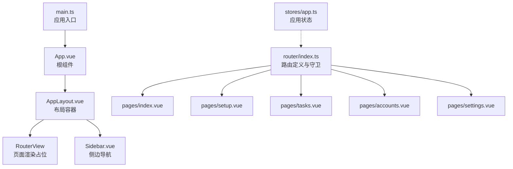
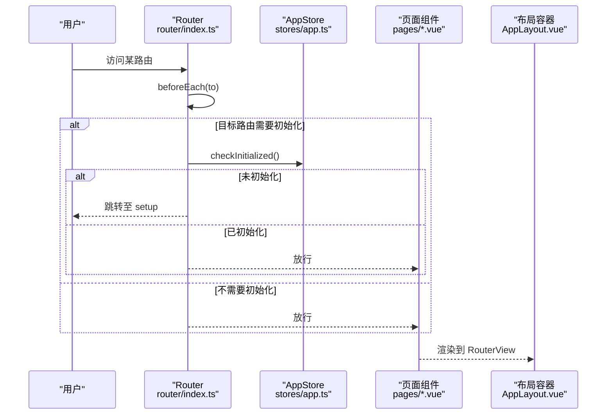
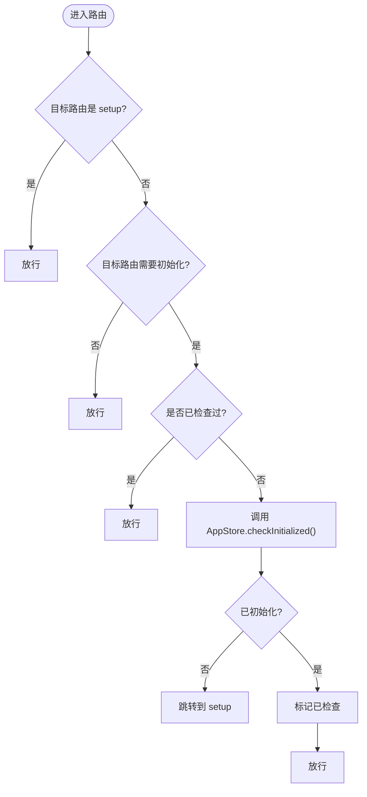
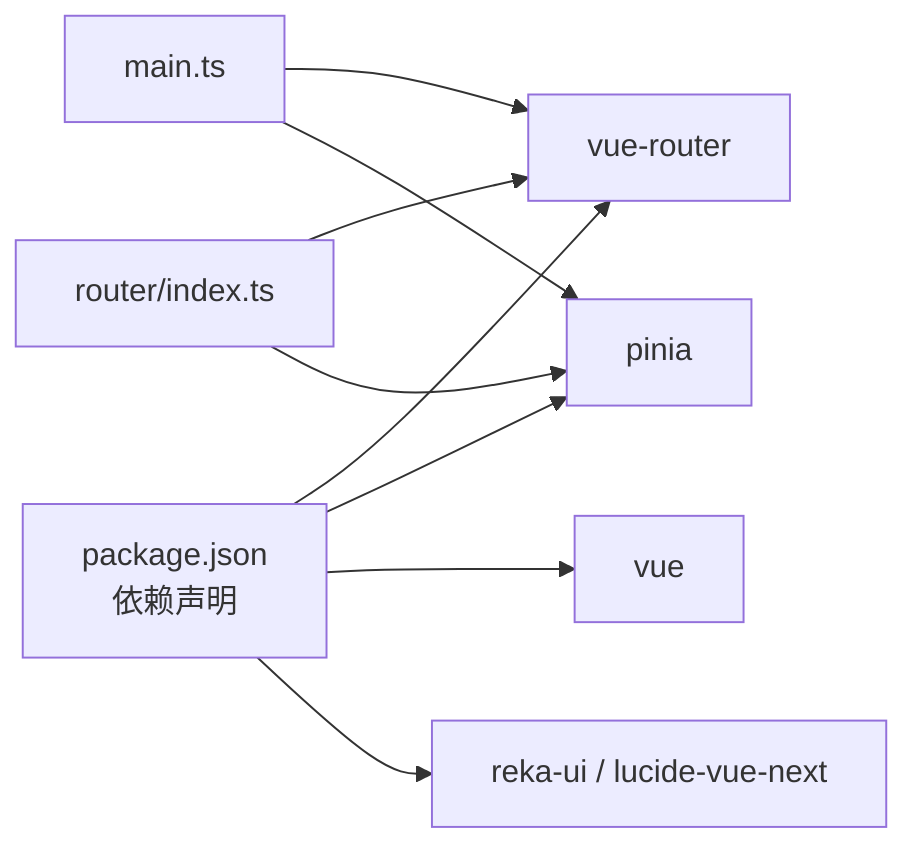

# 路由系统

<cite>
**本文引用的文件**
- [src\renderer\src\router\index.ts](file://src/renderer/src/router/index.ts)
- [src\renderer\src\main.ts](file://src/renderer/src/main.ts)
- [src\renderer\src\App.vue](file://src/renderer/src/App.vue)
- [src\renderer\src\components\layout\AppLayout.vue](file://src/renderer/src/components/layout/AppLayout.vue)
- [src\renderer\src\components\layout\Sidebar.vue](file://src/renderer/src/components/layout/Sidebar.vue)
- [src\renderer\src\stores\app.ts](file://src/renderer/src/stores/app.ts)
- [src\renderer\src\pages\index.vue](file://src/renderer/src/pages/index.vue)
- [src\renderer\src\pages\setup.vue](file://src/renderer/src/pages/setup.vue)
- [src\renderer\src\pages\tasks.vue](file://src/renderer/src/pages/tasks.vue)
- [src\renderer\src\pages\accounts.vue](file://src/renderer/src/pages/accounts.vue)
- [src\renderer\src\pages\settings.vue](file://src/renderer/src/pages/settings.vue)
- [src\renderer\src\stores\task.ts](file://src/renderer/src/stores/task.ts)
- [src\renderer\src\stores\account.ts](file://src/renderer/src/stores/account.ts)
- [package.json](file://package.json)
</cite>

## 目录
1. [简介](#简介)
2. [项目结构](#项目结构)
3. [核心组件](#核心组件)
4. [架构总览](#架构总览)
5. [详细组件分析](#详细组件分析)
6. [依赖分析](#依赖分析)
7. [性能考虑](#性能考虑)
8. [故障排除指南](#故障排除指南)
9. [结论](#结论)
10. [附录](#附录)

## 简介
本文件面向AutoOps项目的前端路由系统，基于Vue Router 4与Pinia状态管理，提供从路由配置、导航守卫、动态路由到页面组件绑定、URL参数解析与历史记录管理的完整使用指南。文档同时覆盖权限控制机制（初始化检查）、路由懒加载策略、面包屑导航思路以及与状态管理的集成方式，帮助开发者快速掌握并正确使用路由系统。

## 项目结构
AutoOps采用“页面级路由 + 布局容器 + 侧边导航”的组织方式：
- 路由定义集中在路由器入口文件，采用按需加载的异步组件形式
- 页面组件位于pages目录，每个页面独立且通过路由懒加载引入
- 布局层通过AppLayout包裹RouterView，并内置侧边栏导航
- 权限控制通过全局前置守卫结合应用状态存储实现

图表来源
- [src\renderer\src\main.ts:1-12](file://src/renderer/src/main.ts#L1-L12)
- [src\renderer\src\App.vue:1-11](file://src/renderer/src/App.vue#L1-L11)
- [src\renderer\src\components\layout\AppLayout.vue:1-24](file://src/renderer/src/components/layout/AppLayout.vue#L1-L24)
- [src\renderer\src\components\layout\Sidebar.vue:1-67](file://src/renderer/src/components/layout/Sidebar.vue#L1-L67)
- [src\renderer\src\router\index.ts:1-60](file://src/renderer/src/router/index.ts#L1-L60)

章节来源
- [src\renderer\src\router\index.ts:1-60](file://src/renderer/src/router/index.ts#L1-L60)
- [src\renderer\src\main.ts:1-12](file://src/renderer/src/main.ts#L1-L12)
- [src\renderer\src\App.vue:1-11](file://src/renderer/src/App.vue#L1-L11)
- [src\renderer\src\components\layout\AppLayout.vue:1-24](file://src/renderer/src/components/layout/AppLayout.vue#L1-L24)
- [src\renderer\src\components\layout\Sidebar.vue:1-67](file://src/renderer/src/components/layout/Sidebar.vue#L1-L67)

## 核心组件
- 路由器与路由表：定义页面级路由、懒加载组件与全局前置守卫
- 应用状态存储：提供初始化检查与全局状态，驱动权限控制
- 布局与导航：AppLayout承载RouterView，Sidebar提供导航与高亮
- 页面组件：各业务页面通过路由懒加载按需加载，减少首屏体积

章节来源
- [src\renderer\src\router\index.ts:1-60](file://src/renderer/src/router/index.ts#L1-L60)
- [src\renderer\src\stores\app.ts:1-71](file://src/renderer/src/stores/app.ts#L1-L71)
- [src\renderer\src\components\layout\AppLayout.vue:1-24](file://src/renderer/src/components/layout/AppLayout.vue#L1-L24)
- [src\renderer\src\components\layout\Sidebar.vue:1-67](file://src/renderer/src/components/layout/Sidebar.vue#L1-L67)

## 架构总览
路由系统围绕“页面路由 + 全局守卫 + 布局容器 + 状态管理”展开，形成清晰的职责边界与调用链路。

图表来源
- [src\renderer\src\router\index.ts:44-60](file://src/renderer/src/router/index.ts#L44-L60)
- [src\renderer\src\stores\app.ts:32-37](file://src/renderer/src/stores/app.ts#L32-L37)

章节来源
- [src\renderer\src\router\index.ts:44-60](file://src/renderer/src/router/index.ts#L44-L60)
- [src\renderer\src\stores\app.ts:32-37](file://src/renderer/src/stores/app.ts#L32-L37)

## 详细组件分析

### 路由器与路由表
- 路由定义：采用数组式RouteRecordRaw配置，包含路径、名称、组件与元信息
- 懒加载：组件通过函数返回动态导入，实现按需加载
- 全局前置守卫：对需要初始化的路由进行检查，未初始化则重定向至设置页
- 历史模式：使用哈希历史，适配桌面应用部署场景

章节来源
- [src\renderer\src\router\index.ts:5-35](file://src/renderer/src/router/index.ts#L5-L35)
- [src\renderer\src\router\index.ts:37-40](file://src/renderer/src/router/index.ts#L37-L40)
- [src\renderer\src\router\index.ts:44-60](file://src/renderer/src/router/index.ts#L44-L60)

### 全局导航守卫与权限控制
- 守卫逻辑：仅对带requiresInit元信息的路由生效；setup路由始终放行
- 初始化检查：调用应用状态存储的初始化检查方法，若未初始化则跳转setup
- 一次性标记：通过内部标志避免重复检查，提升性能

图表来源
- [src\renderer\src\router\index.ts:44-60](file://src/renderer/src/router/index.ts#L44-L60)
- [src\renderer\src\stores\app.ts:32-37](file://src/renderer/src/stores/app.ts#L32-L37)

章节来源
- [src\renderer\src\router\index.ts:44-60](file://src/renderer/src/router/index.ts#L44-L60)
- [src\renderer\src\stores\app.ts:32-37](file://src/renderer/src/stores/app.ts#L32-L37)

### 页面路由组织与嵌套路由
- 页面路由：根路径、设置页、任务页、账号页、设置页构成主要页面
- 嵌套路由：当前项目未显式声明子路由，但通过AppLayout与Sidebar实现视觉上的“嵌套”效果
- RouterView：作为页面渲染占位符，承载各路由对应的页面组件

章节来源
- [src\renderer\src\router\index.ts:5-35](file://src/renderer/src/router/index.ts#L5-L35)
- [src\renderer\src\components\layout\AppLayout.vue:17-18](file://src/renderer/src/components/layout/AppLayout.vue#L17-L18)

### 导航方法与路由参数传递
- 编程式导航：页面内通过useRouter获取路由实例，使用push或replace进行导航
- 查询参数：任务页通过查询参数触发创建对话框，随后移除查询参数以保持URL整洁
- 参数解析：使用useRoute访问当前路由对象，读取params与query

章节来源
- [src\renderer\src\pages\index.vue:73-87](file://src/renderer/src/pages/index.vue#L73-L87)
- [src\renderer\src\pages\tasks.vue:120-136](file://src/renderer/src/pages/tasks.vue#L120-L136)

### 路由懒加载实现
- 动态导入：组件属性为函数，返回动态import，实现按需加载
- 性能收益：减少首屏资源体积，提升初始加载速度

章节来源
- [src\renderer\src\router\index.ts:9](file://src/renderer/src/router/index.ts#L9)
- [src\renderer\src\router\index.ts:15](file://src/renderer/src/router/index.ts#L15)
- [src\renderer\src\router\index.ts:20](file://src/renderer/src/router/index.ts#L20)
- [src\renderer\src\router\index.ts:26](file://src/renderer/src/router/index.ts#L26)
- [src\renderer\src\router\index.ts:32](file://src/renderer/src/router/index.ts#L32)

### 权限控制机制
- 初始化检查：通过全局守卫拦截未完成初始化的路由
- 状态驱动：AppStore维护初始化状态，供守卫读取
- 用户引导：未初始化时强制跳转至setup流程，完成浏览器路径配置

章节来源
- [src\renderer\src\router\index.ts:44-60](file://src/renderer/src/router/index.ts#L44-L60)
- [src\renderer\src\stores\app.ts:32-37](file://src/renderer/src/stores/app.ts#L32-L37)

### 面包屑导航
- 当前实现：项目未提供专门的面包屑组件或路由元信息驱动的面包屑生成
- 实现建议：可在路由元信息中增加面包屑数据，结合RouterView监听路由变化动态生成

（本节为概念性说明，不直接分析具体文件）

### 路由与页面组件的绑定关系
- 组件绑定：路由记录的component属性指向对应页面组件的动态导入
- 布局绑定：AppLayout通过RouterView承载页面组件，Sidebar提供导航

章节来源
- [src\renderer\src\router\index.ts:9](file://src/renderer/src/router/index.ts#L9)
- [src\renderer\src\components\layout\AppLayout.vue:17-18](file://src/renderer/src/components/layout/AppLayout.vue#L17-L18)
- [src\renderer\src\components\layout\Sidebar.vue:25-30](file://src/renderer/src/components/layout/Sidebar.vue#L25-L30)

### URL参数解析与历史记录管理
- 查询参数：任务页通过route.query.action判断是否显示创建对话框
- 历史记录：使用router.replace移除查询参数，避免重复触发与历史栈污染

章节来源
- [src\renderer\src\pages\tasks.vue:120-136](file://src/renderer/src/pages/tasks.vue#L120-L136)

### 状态管理集成
- Pinia注册：在应用入口注册并挂载Pinia
- Store使用：页面组件通过useXxxStore访问状态，如任务、账号、设置等
- 与路由联动：全局守卫读取AppStore状态决定放行或重定向

章节来源
- [src\renderer\src\main.ts:9-10](file://src/renderer/src/main.ts#L9-L10)
- [src\renderer\src\stores\task.ts:1-192](file://src/renderer/src/stores/task.ts#L1-L192)
- [src\renderer\src\stores\account.ts:1-82](file://src/renderer/src/stores/account.ts#L1-L82)
- [src\renderer\src\router\index.ts:44-60](file://src/renderer/src/router/index.ts#L44-L60)

## 依赖分析
- Vue Router：负责路由定义、导航与守卫
- Pinia：提供应用状态管理，支撑权限控制
- UI组件库：Reka UI与Lucide图标库用于界面与交互
- Electron/Vite：构建与打包环境，路由历史模式适配桌面应用

图表来源
- [package.json:16-32](file://package.json#L16-L32)
- [src\renderer\src\main.ts:1-12](file://src/renderer/src/main.ts#L1-L12)
- [src\renderer\src\router\index.ts:1-3](file://src/renderer/src/router/index.ts#L1-L3)

章节来源
- [package.json:16-32](file://package.json#L16-L32)
- [src\renderer\src\main.ts:1-12](file://src/renderer/src/main.ts#L1-L12)
- [src\renderer\src\router\index.ts:1-3](file://src/renderer/src/router/index.ts#L1-L3)

## 性能考虑
- 路由懒加载：通过动态导入减少首屏体积，提升启动速度
- 全局守卫缓存：通过一次性检查标志避免重复调用初始化检查
- 组件按需渲染：RouterView仅渲染当前匹配路由的组件，降低不必要的计算

（本节提供通用指导，不直接分析具体文件）

## 故障排除指南
- 路由无法进入：确认目标路由是否带有requiresInit且已完成初始化
- 初始化循环跳转：检查AppStore初始化状态与守卫逻辑
- 页面空白：确认RouterView存在且路由记录component有效
- 导航异常：检查useRouter与useRoute的使用是否正确

章节来源
- [src\renderer\src\router\index.ts:44-60](file://src/renderer/src/router/index.ts#L44-L60)
- [src\renderer\src\stores\app.ts:32-37](file://src/renderer/src/stores/app.ts#L32-L37)
- [src\renderer\src\components\layout\AppLayout.vue:17-18](file://src/renderer/src/components/layout/AppLayout.vue#L17-L18)

## 结论
AutoOps路由系统以简洁明确的方式实现了页面路由、权限控制与懒加载，配合布局容器与状态管理，形成了清晰的职责划分与良好的扩展性。开发者可在此基础上继续完善面包屑、嵌套路由与更细粒度的权限控制，进一步提升用户体验与开发效率。

## 附录
- 路由配置示例：参考路由表定义与懒加载写法
- 导航方法：使用useRouter的push/replace进行编程式导航
- 状态管理集成：在页面中通过useXxxStore读取与更新状态

章节来源
- [src\renderer\src\router\index.ts:5-35](file://src/renderer/src/router/index.ts#L5-L35)
- [src\renderer\src\pages\index.vue:73-87](file://src/renderer/src/pages/index.vue#L73-L87)
- [src\renderer\src\stores\task.ts:169-190](file://src/renderer/src/stores/task.ts#L169-L190)
- [src\renderer\src\stores\account.ts:69-80](file://src/renderer/src/stores/account.ts#L69-L80)