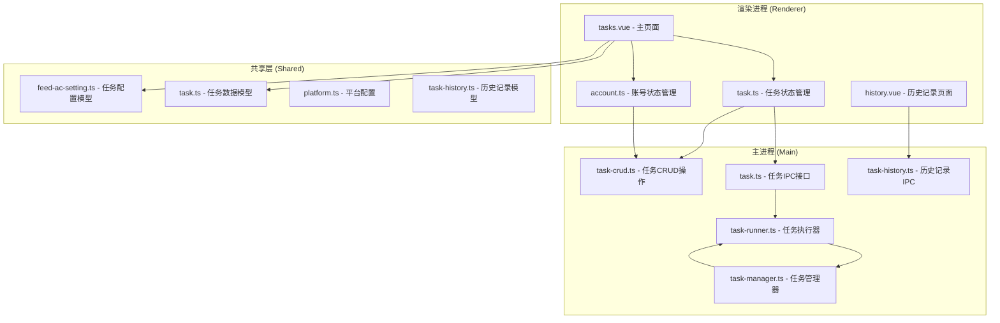
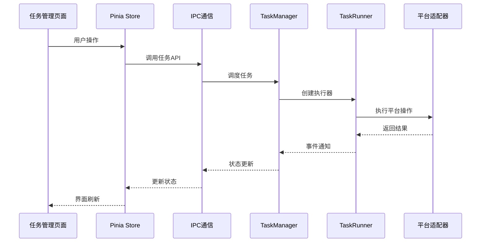
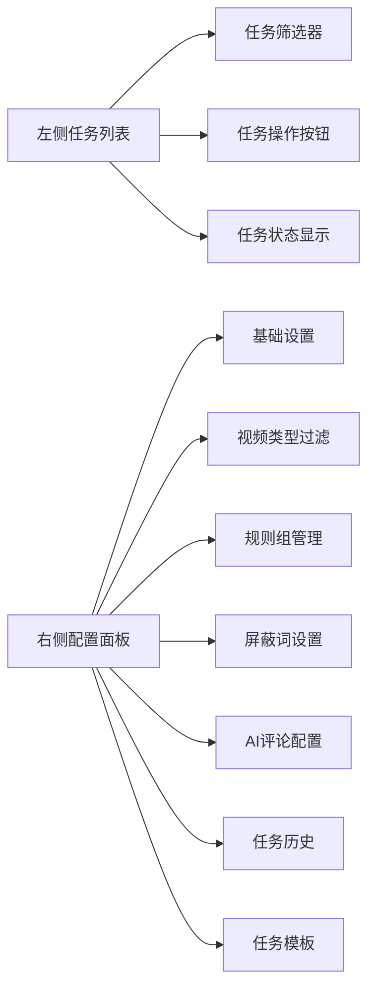
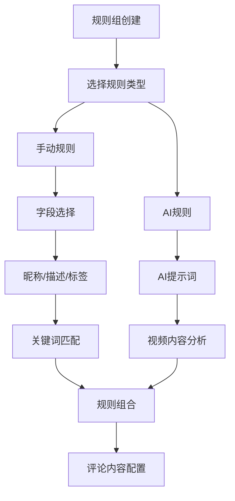

# 任务管理页面

<cite>
**本文档引用的文件**
- [tasks.vue](file://src/renderer/src/pages/tasks.vue)
- [task.ts](file://src/renderer/src/stores/task.ts)
- [feed-ac-setting.ts](file://src/shared/feed-ac-setting.ts)
- [task.ts](file://src/shared/task.ts)
- [task-crud.ts](file://src/main/ipc/task-crud.ts)
- [task.ts](file://src/main/ipc/task.ts)
- [task-runner.ts](file://src/main/service/task-runner.ts)
- [task-manager.ts](file://src/main/service/task-manager.ts)
- [history.vue](file://src/renderer/src/pages/history.vue)
- [task-history.ts](file://src/main/ipc/task-history.ts)
- [task-history.ts](file://src/shared/task-history.ts)
- [account.ts](file://src/renderer/src/stores/account.ts)
- [platform.ts](file://src/shared/platform.ts)
</cite>

## 目录
1. [简介](#简介)
2. [项目结构](#项目结构)
3. [核心组件](#核心组件)
4. [架构概览](#架构概览)
5. [详细组件分析](#详细组件分析)
6. [依赖关系分析](#依赖关系分析)
7. [性能考虑](#性能考虑)
8. [故障排除指南](#故障排除指南)
9. [结论](#结论)
10. [附录](#附录)

## 简介

AutoOps任务管理页面是一个基于Electron + Vue 3 + TypeScript构建的自动化任务管理系统，专门用于抖音等短视频平台的内容运营自动化。该页面提供了完整的任务生命周期管理，包括任务创建、配置、执行、监控和历史记录查看等功能。

系统采用前后端分离架构，前端负责用户界面交互和状态管理，后端通过IPC通信协调任务执行和数据持久化。页面支持多种任务类型（评论、点赞、收藏、关注、观看、组合任务），并提供了丰富的配置选项和AI辅助功能。

## 项目结构

任务管理页面位于Electron应用的渲染进程中，主要文件组织如下：



**图表来源**
- [tasks.vue:1-50](file://src/renderer/src/pages/tasks.vue#L1-L50)
- [task.ts:1-30](file://src/renderer/src/stores/task.ts#L1-L30)
- [feed-ac-setting.ts:1-50](file://src/shared/feed-ac-setting.ts#L1-L50)

**章节来源**
- [tasks.vue:1-150](file://src/renderer/src/pages/tasks.vue#L1-L150)
- [task.ts:1-50](file://src/renderer/src/stores/task.ts#L1-L50)

## 核心组件

### 任务管理器 (TaskManager)
任务管理器是整个系统的中枢，负责任务的调度、执行和状态管理：

- **并发控制**: 限制同时运行的任务数量，支持账号级别的并发策略
- **队列管理**: 当达到并发限制时，自动将任务放入队列等待
- **定时任务**: 支持Cron表达式的定时任务调度
- **事件转发**: 将任务执行过程中的各种事件转发给渲染进程

### 任务执行器 (TaskRunner)
任务执行器负责具体的任务执行逻辑：

- **多平台适配**: 支持抖音、快手、小红书等多个平台
- **AI集成**: 集成AI服务进行视频内容分析和评论生成
- **规则匹配**: 基于规则组对视频内容进行智能筛选
- **操作执行**: 自动执行评论、点赞、收藏、关注等操作

### 状态管理 (Pinia Store)
使用Pinia进行状态管理，提供响应式的状态更新：

- **任务状态**: 任务列表、当前选中任务、运行状态
- **模板管理**: 任务模板的保存和应用
- **日志管理**: 实时显示任务执行日志
- **并发控制**: 最大并发数的动态调整

**章节来源**
- [task-manager.ts:1-100](file://src/main/service/task-manager.ts#L1-L100)
- [task-runner.ts:1-100](file://src/main/service/task-runner.ts#L1-L100)
- [task.ts:23-100](file://src/renderer/src/stores/task.ts#L23-L100)

## 架构概览

系统采用分层架构设计，确保各层职责清晰：



**图表来源**
- [task.ts:138-201](file://src/renderer/src/stores/task.ts#L138-L201)
- [task.ts:81-136](file://src/renderer/src/stores/task.ts#L81-L136)

系统架构的关键特点：
- **前后端分离**: 渲染进程负责UI，主进程负责业务逻辑
- **事件驱动**: 通过事件系统实现松耦合的组件通信
- **可扩展性**: 支持新增平台和任务类型
- **稳定性**: 提供完善的错误处理和状态恢复机制

## 详细组件分析

### 任务管理页面 (tasks.vue)

#### 页面布局结构
页面采用左右布局设计，左侧为任务列表，右侧为配置面板：



**图表来源**
- [tasks.vue:437-620](file://src/renderer/src/pages/tasks.vue#L437-L620)

#### 数据绑定和状态管理
页面使用Vue 3的Composition API进行状态管理：

- **响应式数据**: 使用`ref`和`computed`管理页面状态
- **双向绑定**: 通过`v-model`实现表单数据的双向绑定
- **计算属性**: 使用`computed`属性实现数据的派生和转换

#### 事件处理机制
页面实现了完整的事件处理体系：

- **任务操作**: 创建、删除、复制、启动、停止等
- **配置更新**: 实时保存任务配置
- **状态监控**: 实时显示任务运行状态

**章节来源**
- [tasks.vue:1-150](file://src/renderer/src/pages/tasks.vue#L1-L150)
- [tasks.vue:177-243](file://src/renderer/src/pages/tasks.vue#L177-L243)

### 任务配置界面

#### 基础设置模块
基础设置模块提供任务的基本参数配置：

- **模拟观看**: 控制是否在评论前模拟观看视频
- **观看时长**: 设置模拟观看的时间范围
- **活跃视频**: 仅对活跃视频进行评论
- **目标数量**: 设置任务执行的目标数量
- **等待时间**: 控制视频切换的等待时间
- **跳过限制**: 设置连续跳过的最大次数

#### 视频类型过滤
系统提供多层次的视频过滤机制：

- **广告视频**: 自动跳过广告内容
- **直播视频**: 跳过直播内容
- **图集内容**: 跳过图片集合

#### 规则组管理
规则组是系统的核心功能模块，支持复杂的视频筛选逻辑：



**图表来源**
- [feed-ac-setting.ts:9-20](file://src/shared/feed-ac-setting.ts#L9-L20)
- [tasks.vue:814-862](file://src/renderer/src/pages/tasks.vue#L814-L862)

#### 屏蔽词设置
屏蔽词功能允许用户阻止特定内容的处理：

- **视频描述屏蔽**: 基于视频描述关键词的屏蔽
- **作者名屏蔽**: 基于作者昵称的屏蔽
- **实时生效**: 屏蔽词变更立即生效

#### AI评论配置
AI评论功能提供智能化的评论生成：

- **评论风格**: 支持多种评论风格（幽默、严肃、提问等）
- **字数控制**: 限制评论的最大长度
- **热门评论参考**: 基于热门评论生成相似风格的评论
- **AI服务集成**: 支持多种AI平台的服务

**章节来源**
- [tasks.vue:864-942](file://src/renderer/src/pages/tasks.vue#L864-L942)
- [feed-ac-setting.ts:62-97](file://src/shared/feed-ac-setting.ts#L62-L97)

### 任务状态管理

#### 运行状态跟踪
系统提供全面的任务状态跟踪机制：

- **实时状态**: 显示任务的当前运行状态
- **进度监控**: 实时显示任务执行进度
- **日志记录**: 记录任务执行过程中的所有重要事件

#### 并发控制
系统实现了智能的并发控制机制：

- **全局并发限制**: 控制同时运行的任务总数
- **账号级并发策略**: 支持不同账号的独立并发控制
- **队列管理**: 当达到并发限制时自动排队等待

#### 定时任务管理
支持基于Cron表达式的定时任务：

- **Cron表达式验证**: 确保定时表达式的正确性
- **下次执行时间**: 显示定时任务的下次执行时间
- **任务恢复**: 应用重启后自动恢复定时任务

**章节来源**
- [task.ts:138-201](file://src/renderer/src/stores/task.ts#L138-L201)
- [task-manager.ts:407-455](file://src/main/service/task-manager.ts#L407-L455)

### 任务历史记录

#### 历史记录展示
历史记录页面提供完整的历史数据查看：

- **任务摘要**: 显示每次任务的基本信息和结果
- **详细记录**: 展示每个任务处理的具体视频记录
- **状态分类**: 按状态对历史记录进行分类显示

#### 数据持久化
历史记录采用本地存储方案：

- **数据结构**: 标准化的历史记录数据结构
- **存储策略**: 使用Electron的存储机制
- **清理功能**: 支持批量清理历史记录

**章节来源**
- [history.vue:1-102](file://src/renderer/src/pages/history.vue#L1-L102)
- [task-history.ts:14-22](file://src/shared/task-history.ts#L14-L22)

### 任务模板功能

#### 模板管理
任务模板功能允许用户保存和复用配置：

- **模板保存**: 将当前任务配置保存为模板
- **模板应用**: 一键应用模板到新任务
- **模板管理**: 支持模板的查看、删除和批量管理

#### 模板结构
模板采用标准化的数据结构：

- **配置继承**: 模板包含完整的任务配置
- **平台兼容**: 支持跨平台的模板使用
- **版本管理**: 支持模板的版本控制和更新

**章节来源**
- [tasks.vue:980-1035](file://src/renderer/src/pages/tasks.vue#L980-L1035)
- [task.ts:79-88](file://src/renderer/src/stores/task.ts#L79-L88)

## 依赖关系分析

### 组件间依赖关系

```mermaid
graph TB
subgraph "UI层"
A[tasks.vue]
B[history.vue]
end
subgraph "状态管理层"
C[task.ts (Pinia Store)]
D[account.ts (Pinia Store)]
end
subgraph "数据模型层"
E[feed-ac-setting.ts]
F[task.ts (共享)]
G[platform.ts]
H[task-history.ts]
end
subgraph "IPC层"
I[task-crud.ts]
J[task.ts (IPC)]
K[task-history.ts (IPC)]
end
subgraph "业务逻辑层"
L[task-manager.ts]
M[task-runner.ts]
end
A --> C
A --> D
A --> E
A --> F
C --> I
C --> J
D --> I
B --> K
J --> L
L --> M
```

**图表来源**
- [tasks.vue:63-74](file://src/renderer/src/pages/tasks.vue#L63-L74)
- [task.ts:1-6](file://src/renderer/src/stores/task.ts#L1-L6)

### 数据流分析

系统采用单向数据流设计，确保数据的一致性和可预测性：

1. **用户操作** → **UI组件** → **Pinia Store** → **IPC通信** → **主进程**
2. **主进程处理** → **事件触发** → **IPC回调** → **Pinia Store更新** → **UI重新渲染**

这种设计确保了：
- **状态集中管理**: 所有状态都集中在Pinia Store中
- **数据一致性**: 单向数据流避免了状态冲突
- **调试友好**: 清晰的数据流向便于问题定位

**章节来源**
- [task.ts:280-315](file://src/renderer/src/stores/task.ts#L280-L315)
- [task-crud.ts:8-108](file://src/main/ipc/task-crud.ts#L8-L108)

## 性能考虑

### 并发优化
系统在并发控制方面采用了多项优化措施：

- **智能队列管理**: 当达到并发限制时，自动将任务放入队列等待
- **账号级策略**: 不同账号可以设置不同的并发策略
- **资源回收**: 任务完成后及时释放浏览器资源

### 内存管理
针对长时间运行的任务，系统实现了内存优化：

- **日志轮转**: 限制日志数量，避免内存泄漏
- **缓存管理**: 合理使用视频数据缓存
- **事件清理**: 及时清理不再使用的事件监听器

### 网络优化
系统在网络请求方面进行了优化：

- **请求去重**: 避免重复的网络请求
- **超时处理**: 合理设置请求超时时间
- **错误重试**: 对临时性错误进行自动重试

## 故障排除指南

### 常见问题及解决方案

#### 任务无法启动
**可能原因**:
- 浏览器路径未配置
- 账号登录状态失效
- 并发限制导致排队

**解决步骤**:
1. 检查设置页面中的浏览器配置
2. 重新登录相关平台账号
3. 调整最大并发数设置
4. 查看实时日志获取详细错误信息

#### 任务执行异常
**可能原因**:
- 网络连接不稳定
- 平台反爬虫机制
- AI服务配置错误

**解决步骤**:
1. 检查网络连接状态
2. 更新平台适配器配置
3. 验证AI服务配置
4. 查看任务历史记录中的错误详情

#### 性能问题
**可能原因**:
- 并发数设置过高
- 日志过多影响性能
- 缓存数据过大

**解决步骤**:
1. 降低最大并发数
2. 清理历史日志
3. 重启应用以清理缓存
4. 检查系统资源使用情况

### 调试工具
系统提供了完善的调试工具：

- **实时日志**: 显示任务执行的详细过程
- **状态监控**: 实时显示系统运行状态
- **错误报告**: 生成详细的错误报告
- **性能分析**: 分析任务执行的性能指标

**章节来源**
- [task-runner.ts:746-758](file://src/main/service/task-runner.ts#L746-L758)
- [task.ts:264-278](file://src/renderer/src/stores/task.ts#L264-L278)

## 结论

AutoOps任务管理页面是一个功能完整、架构清晰的自动化任务管理系统。系统通过合理的分层设计和组件化架构，实现了高度的可维护性和可扩展性。

### 主要优势
- **功能完整性**: 提供了任务管理所需的所有核心功能
- **用户体验**: 界面友好，操作简便
- **技术先进**: 采用最新的Web技术和最佳实践
- **可扩展性**: 支持新平台和新功能的快速集成

### 技术亮点
- **事件驱动架构**: 通过事件系统实现松耦合的组件通信
- **智能并发控制**: 支持灵活的并发策略和队列管理
- **AI集成**: 深度集成AI服务，提供智能化的功能
- **状态管理**: 使用Pinia实现响应式状态管理

### 发展方向
未来可以在以下方面进一步改进：
- 增加更多的平台支持
- 优化AI服务的集成体验
- 提供更丰富的数据分析功能
- 增强任务调度的灵活性

## 附录

### API参考

#### 任务管理API
| 方法 | 参数 | 返回值 | 描述 |
|------|------|--------|------|
| createTask | name, accountId, taskType, config | Task | 创建新任务 |
| updateTask | id, updates | Task | 更新任务配置 |
| deleteTask | id | void | 删除任务 |
| duplicateTask | id | Task | 复制任务 |
| start | settings, accountId, taskType, taskName | Result | 启动任务 |
| stop | taskId | Result | 停止任务 |
| pauseTask | taskId | Result | 暂停任务 |
| resumeTask | taskId | Result | 恢复任务 |

#### 任务模板API
| 方法 | 参数 | 返回值 | 描述 |
|------|------|--------|------|
| saveAsTemplate | name, config | Template | 保存为模板 |
| deleteTemplate | id | void | 删除模板 |
| getAllTemplates | - | Template[] | 获取所有模板 |

### 配置选项

#### 基础配置
- **最大并发数**: 默认3，推荐2-3
- **视频切换等待**: 默认2000ms
- **连续跳过限制**: 默认20次
- **目标操作数**: 默认10次

#### AI配置
- **评论风格**: mixed, humorous, serious, question, praise
- **最大字数**: 默认50字符
- **参考评论数**: 默认5条
- **AI服务**: 支持多种AI平台

### 最佳实践

#### 任务配置建议
1. **合理设置并发数**: 根据系统资源和网络状况调整
2. **使用规则组**: 通过规则组实现精确的内容筛选
3. **配置屏蔽词**: 及时添加屏蔽词避免不相关内容
4. **启用AI功能**: 在合适的情况下使用AI增强功能

#### 性能优化建议
1. **监控系统资源**: 定期检查CPU和内存使用情况
2. **清理历史数据**: 定期清理不需要的历史记录
3. **优化网络环境**: 确保稳定的网络连接
4. **合理安排时间**: 避免在高峰期执行大量任务

#### 错误处理建议
1. **及时查看日志**: 定期检查任务执行日志
2. **设置告警机制**: 对异常情况进行及时告警
3. **备份重要数据**: 定期备份任务配置和历史记录
4. **制定应急预案**: 准备应对突发情况的方案