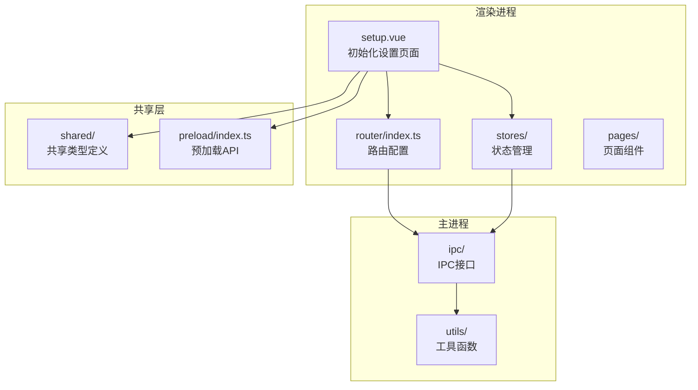
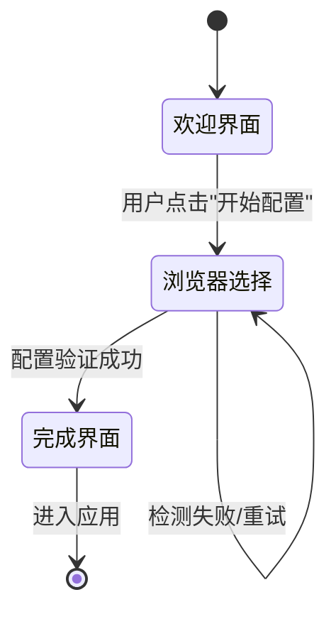
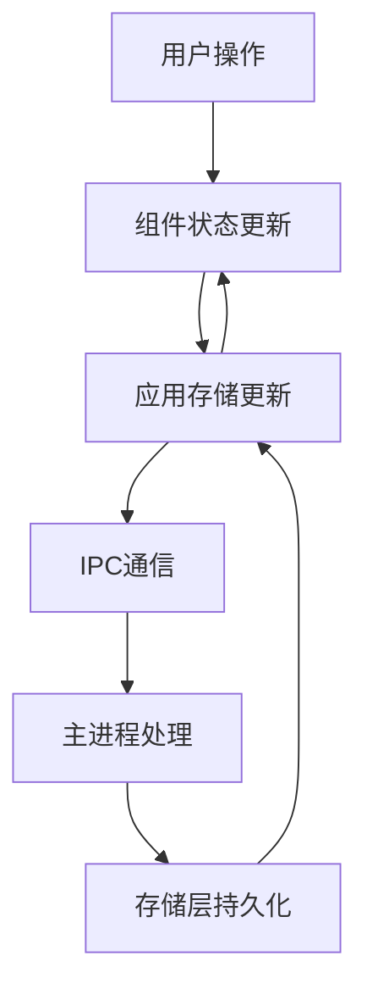
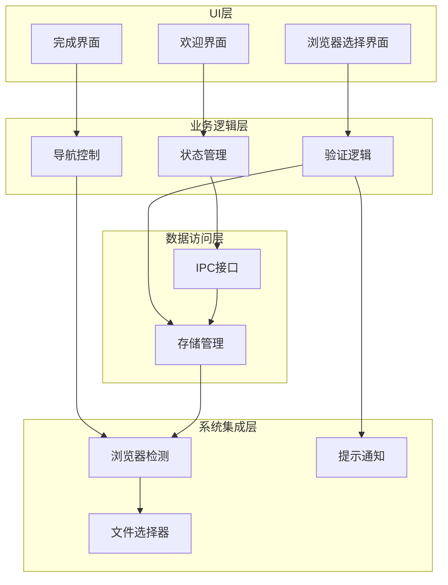
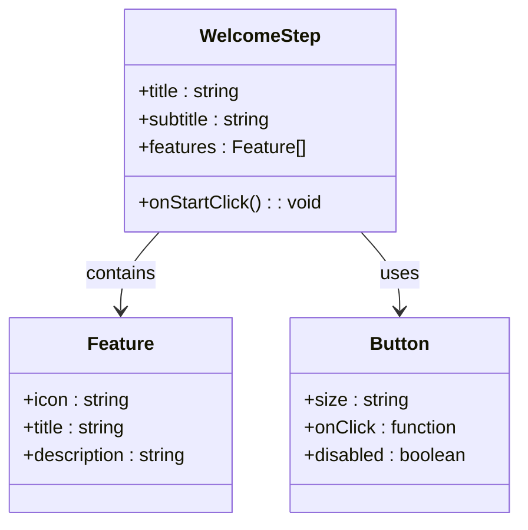
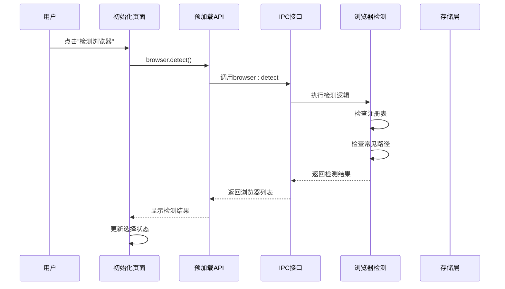
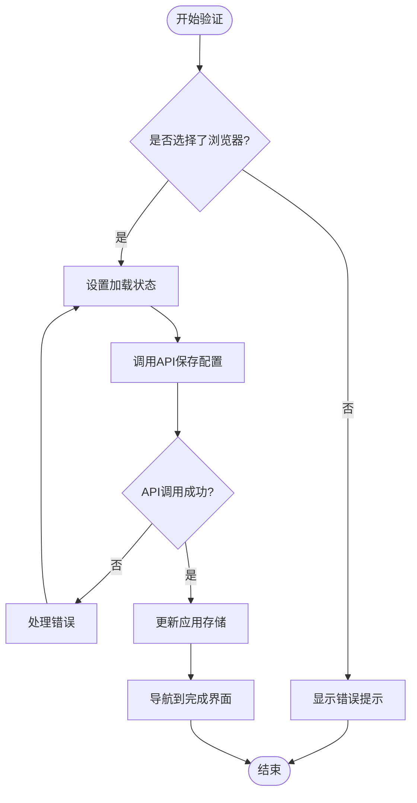
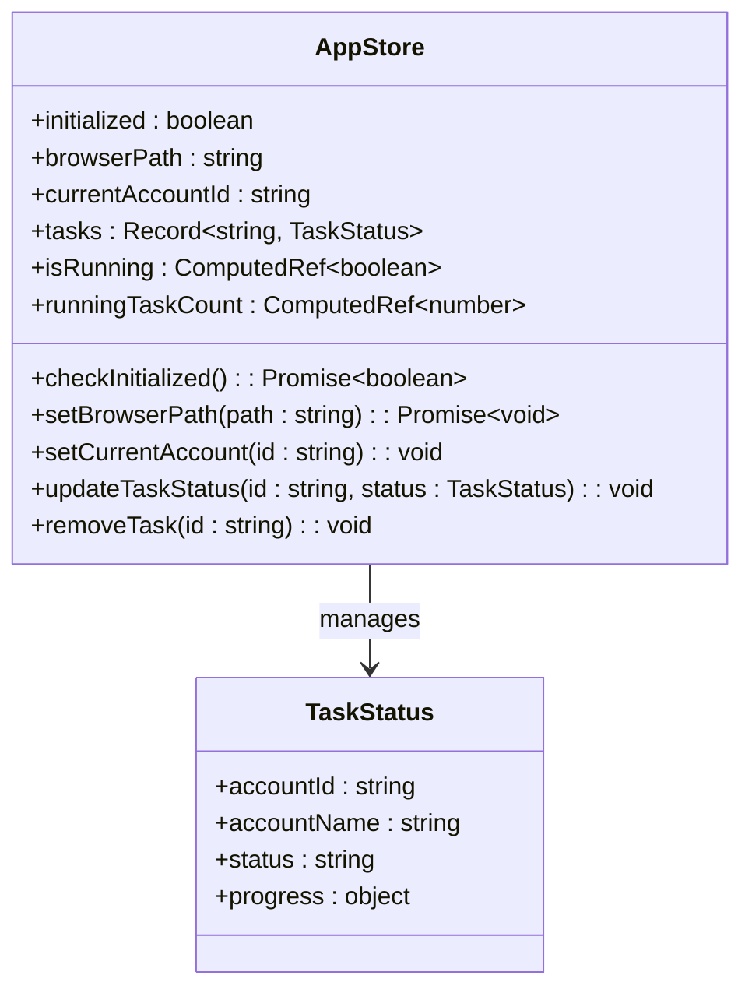
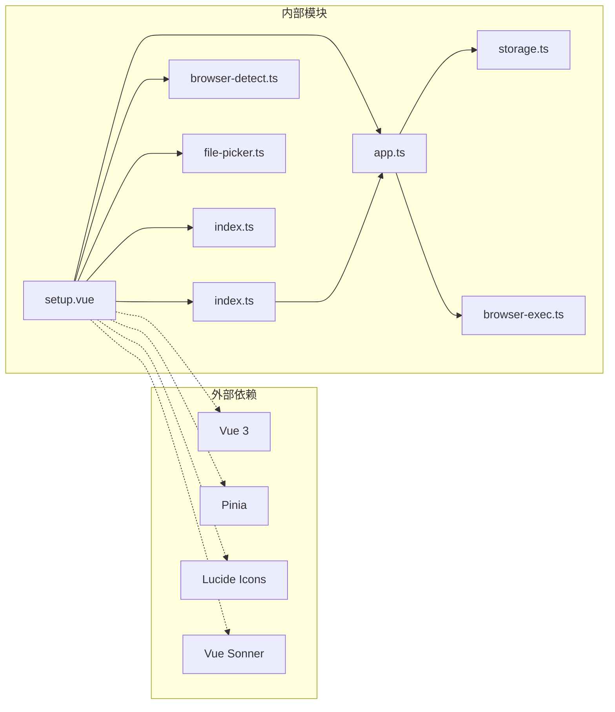
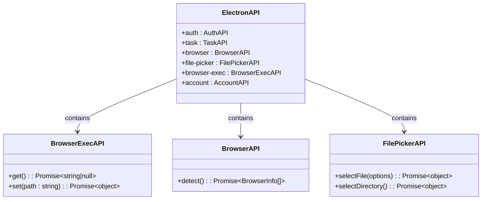

# 初始化设置页面

<cite>
**本文档引用的文件**
- [setup.vue](file://src/renderer/src/pages/setup.vue)
- [app.ts](file://src/renderer/src/stores/app.ts)
- [storage.ts](file://src/main/utils/storage.ts)
- [browser-exec.ts](file://src/main/ipc/browser-exec.ts)
- [browser-detect.ts](file://src/main/ipc/browser-detect.ts)
- [file-picker.ts](file://src/main/ipc/file-picker.ts)
- [index.ts](file://src/preload/index.ts)
- [index.ts](file://src/renderer/src/router/index.ts)
- [index.vue](file://src/renderer/src/pages/index.vue)
- [feed-ac-setting.ts](file://src/shared/feed-ac-setting.ts)
- [settings.ts](file://src/renderer/src/stores/settings.ts)
</cite>

## 目录
1. [简介](#简介)
2. [项目结构](#项目结构)
3. [核心组件](#核心组件)
4. [架构概览](#架构概览)
5. [详细组件分析](#详细组件分析)
6. [依赖关系分析](#依赖关系分析)
7. [性能考虑](#性能考虑)
8. [故障排除指南](#故障排除指南)
9. [结论](#结论)
10. [附录](#附录)

## 简介

初始化设置页面是AutoOps应用中的关键组件，负责首次启动引导和基础配置。该页面实现了完整的初始化流程，包括欢迎介绍、浏览器检测与选择、配置验证和状态管理等功能。通过精心设计的用户界面和流畅的交互体验，确保用户能够顺利完成应用的初始配置。

初始化设置页面的主要目标是：
- 提供清晰的首次启动引导体验
- 自动检测系统中可用的浏览器
- 允许用户手动指定浏览器路径
- 验证浏览器配置的有效性
- 管理初始化流程的状态转换
- 为后续的正式设置页面提供基础

## 项目结构

初始化设置页面位于Electron应用的渲染进程部分，采用Vue 3 Composition API进行开发。整个项目遵循模块化架构，将功能按层次组织：

**图表来源**
- [setup.vue:1-245](file://src/renderer/src/pages/setup.vue#L1-L245)
- [index.ts:1-60](file://src/renderer/src/router/index.ts#L1-L60)

**章节来源**
- [setup.vue:1-245](file://src/renderer/src/pages/setup.vue#L1-L245)
- [index.ts:1-60](file://src/renderer/src/router/index.ts#L1-L60)

## 核心组件

初始化设置页面由三个主要步骤组成，每个步骤都有明确的功能和用户交互：

### 步骤状态管理

页面使用响应式状态管理来控制初始化流程的不同阶段：

**图表来源**
- [setup.vue:20-30](file://src/renderer/src/pages/setup.vue#L20-L30)

### 数据流架构

初始化设置页面的数据流遵循单向数据流原则：

**图表来源**
- [app.ts:32-43](file://src/renderer/src/stores/app.ts#L32-L43)
- [browser-exec.ts:4-13](file://src/main/ipc/browser-exec.ts#L4-L13)

**章节来源**
- [setup.vue:20-85](file://src/renderer/src/pages/setup.vue#L20-L85)
- [app.ts:18-71](file://src/renderer/src/stores/app.ts#L18-L71)

## 架构概览

初始化设置页面采用了分层架构设计，确保了良好的代码组织和可维护性：

**图表来源**
- [setup.vue:8-85](file://src/renderer/src/pages/setup.vue#L8-L85)
- [index.ts:14-123](file://src/preload/index.ts#L14-L123)

## 详细组件分析

### 欢迎界面组件

欢迎界面作为初始化流程的第一步，提供了清晰的应用介绍和功能概述：

**图表来源**
- [setup.vue:92-128](file://src/renderer/src/pages/setup.vue#L92-L128)

欢迎界面的核心特性包括：
- 清晰的应用标题和副标题
- 功能亮点展示卡片
- 直观的开始按钮
- 响应式布局设计

### 浏览器检测与选择组件

浏览器检测组件实现了自动检测和手动选择两种模式：

**图表来源**
- [setup.vue:32-45](file://src/renderer/src/pages/setup.vue#L32-L45)
- [browser-detect.ts:105-117](file://src/main/ipc/browser-detect.ts#L105-L117)

浏览器检测功能支持的操作系统：
- Windows: Chrome、Edge、Chromium
- macOS: Chrome、Edge、Chromium
- Linux: Chrome、Chromium

### 配置验证与保存组件

配置验证组件负责确保所选浏览器的有效性和可用性：

**图表来源**
- [setup.vue:62-75](file://src/renderer/src/pages/setup.vue#L62-L75)
- [app.ts:39-43](file://src/renderer/src/stores/app.ts#L39-L43)

**章节来源**
- [setup.vue:32-75](file://src/renderer/src/pages/setup.vue#L32-L75)
- [browser-detect.ts:12-117](file://src/main/ipc/browser-detect.ts#L12-L117)
- [browser-exec.ts:4-13](file://src/main/ipc/browser-exec.ts#L4-L13)

### 状态管理与生命周期

应用状态管理通过Pinia实现，提供了全局状态的集中管理：

**图表来源**
- [app.ts:18-71](file://src/renderer/src/stores/app.ts#L18-L71)

状态管理的关键特性：
- 初始化状态检查
- 浏览器路径持久化
- 任务状态跟踪
- 计算属性优化

**章节来源**
- [app.ts:18-71](file://src/renderer/src/stores/app.ts#L18-L71)

## 依赖关系分析

初始化设置页面的依赖关系体现了清晰的分层架构：

**图表来源**
- [setup.vue:1-10](file://src/renderer/src/pages/setup.vue#L1-L10)
- [app.ts:1-3](file://src/renderer/src/stores/app.ts#L1-L3)

### IPC接口依赖

预加载API提供了安全的IPC接口封装：

**图表来源**
- [index.ts:14-123](file://src/preload/index.ts#L14-L123)

**章节来源**
- [index.ts:14-123](file://src/preload/index.ts#L14-L123)
- [browser-exec.ts:4-13](file://src/main/ipc/browser-exec.ts#L4-L13)

## 性能考虑

初始化设置页面在性能方面采用了多项优化策略：

### 异步操作优化
- 浏览器检测采用异步处理，避免阻塞UI线程
- 加载状态指示器提升用户体验
- 错误处理机制确保操作的健壮性

### 内存管理
- 组件卸载时清理事件监听器
- 及时释放大对象引用
- 避免内存泄漏的闭包陷阱

### 网络请求优化
- IPC调用最小化
- 缓存检测结果
- 防抖处理重复请求

## 故障排除指南

### 常见问题及解决方案

#### 浏览器检测失败
**症状**: 点击"检测浏览器"按钮后无响应或显示错误
**原因**: 
- 系统权限不足
- 浏览器未正确安装
- 注册表访问被阻止

**解决方案**:
1. 手动选择浏览器路径
2. 确认浏览器可执行文件存在
3. 以管理员权限运行应用

#### 配置保存失败
**症状**: 点击"验证并保存"后显示错误消息
**原因**:
- 浏览器路径无效
- 文件权限问题
- 存储空间不足

**解决方案**:
1. 验证浏览器路径的正确性
2. 检查文件权限设置
3. 确保有足够的磁盘空间

#### 应用无法进入主界面
**症状**: 配置完成后无法跳转到应用主界面
**原因**:
- 初始化状态未正确设置
- 存储数据损坏
- 路由配置错误

**解决方案**:
1. 重启应用重新初始化
2. 检查存储文件完整性
3. 验证路由配置正确性

### 调试技巧

#### 开发者工具使用
- 使用Vue DevTools监控组件状态
- 检查网络面板中的IPC调用
- 监控存储层的数据变化

#### 日志记录
- 在关键操作点添加日志输出
- 记录错误堆栈信息
- 监控性能指标

**章节来源**
- [setup.vue:40-42](file://src/renderer/src/pages/setup.vue#L40-L42)
- [setup.vue:70-72](file://src/renderer/src/pages/setup.vue#L70-L72)

## 结论

初始化设置页面作为AutoOps应用的重要组成部分，通过精心设计的用户界面和可靠的后台逻辑，为用户提供了流畅的首次启动体验。该页面不仅实现了基础的配置功能，还为后续的正式设置页面奠定了坚实的基础。

### 主要优势
- **用户友好**: 清晰的步骤指导和直观的界面设计
- **功能完整**: 支持自动检测和手动选择两种配置方式
- **可靠性高**: 完善的错误处理和状态管理机制
- **扩展性强**: 模块化的架构便于功能扩展和维护

### 技术亮点
- 采用现代前端技术栈(Vue 3 + TypeScript)
- 实现了完整的状态管理模式
- 提供了丰富的用户体验反馈
- 确保了跨平台的兼容性

## 附录

### 最佳实践建议

#### 用户体验优化
1. **渐进式披露**: 将复杂配置分解为简单步骤
2. **即时反馈**: 提供实时的状态更新和进度指示
3. **容错设计**: 允许用户撤销操作并提供恢复机制
4. **帮助系统**: 集成上下文相关的帮助信息

#### 开发规范
1. **代码组织**: 遵循单一职责原则和模块化设计
2. **类型安全**: 充分利用TypeScript的类型系统
3. **错误处理**: 实现统一的错误处理和用户提示机制
4. **性能监控**: 建立性能指标和监控体系

#### 安全考虑
1. **权限控制**: 最小权限原则和权限验证
2. **数据保护**: 敏感信息的安全存储和传输
3. **输入验证**: 严格的输入验证和过滤
4. **审计日志**: 关键操作的记录和追踪

### 版本兼容性

初始化设置页面支持以下版本要求：
- **操作系统**: Windows 10+, macOS 10.15+, Linux
- **浏览器**: Chrome 90+, Edge 90+, Firefox 90+
- **Node.js**: 16.0+
- **Electron**: 20.0+

### 维护建议

1. **定期更新**: 跟踪浏览器版本更新和兼容性变化
2. **测试覆盖**: 建立全面的自动化测试体系
3. **文档维护**: 保持技术文档与代码同步更新
4. **社区反馈**: 积极收集用户反馈并持续改进