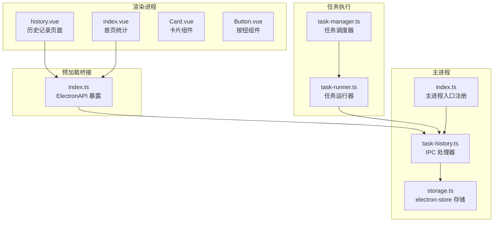
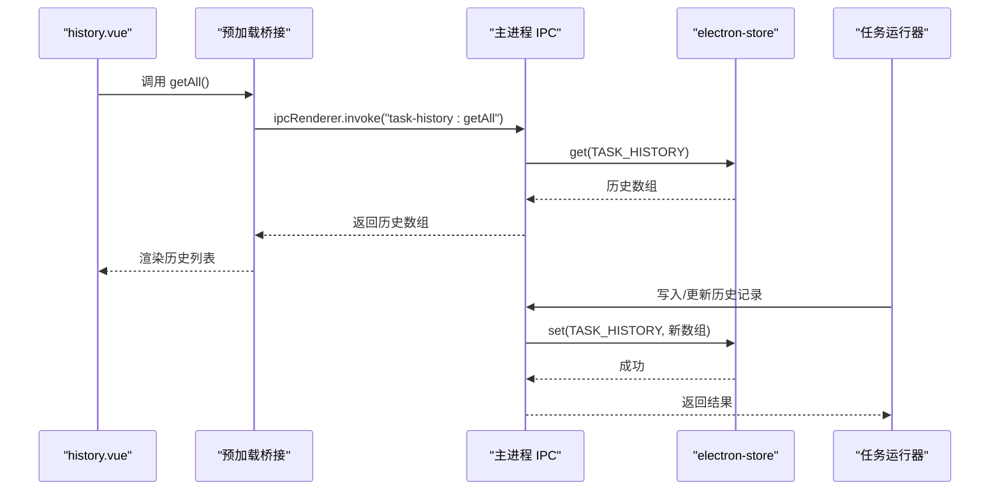
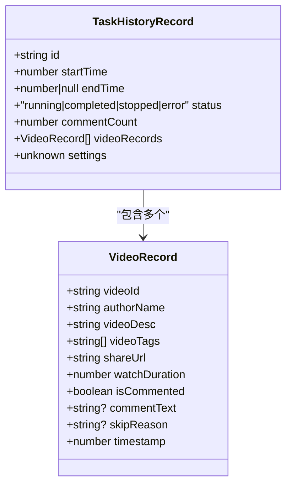
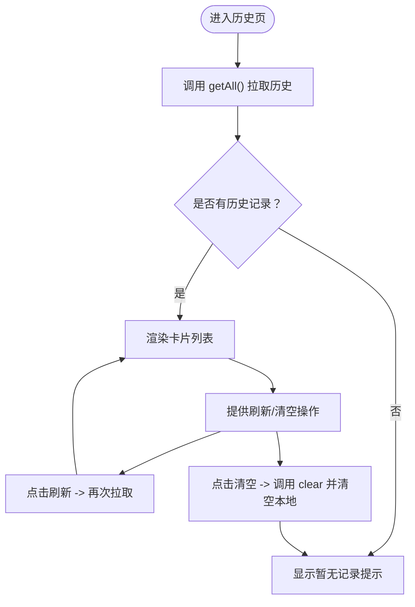
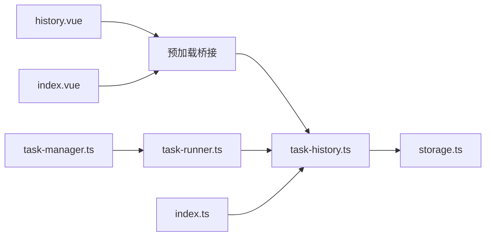

# 历史记录页面

<cite>
**本文引用的文件**
- [history.vue](file://src/renderer/src/pages/history.vue)
- [task-history.ts（共享类型）](file://src/shared/task-history.ts)
- [task-history.ts（主进程IPC）](file://src/main/ipc/task-history.ts)
- [storage.ts](file://src/main/utils/storage.ts)
- [index.ts（预加载桥接）](file://src/preload/index.ts)
- [index.ts（主进程入口）](file://src/main/index.ts)
- [task-runner.ts](file://src/main/service/task-runner.ts)
- [task-manager.ts](file://src/main/service/task-manager.ts)
- [index.vue（首页统计）](file://src/renderer/src/pages/index.vue)
- [Card.vue](file://src/renderer/src/components/ui/card/Card.vue)
- [Button.vue](file://src/renderer/src/components/ui/button/Button.vue)
</cite>

## 目录
1. [简介](#简介)
2. [项目结构](#项目结构)
3. [核心组件](#核心组件)
4. [架构总览](#架构总览)
5. [详细组件分析](#详细组件分析)
6. [依赖关系分析](#依赖关系分析)
7. [性能考量](#性能考量)
8. [故障排查指南](#故障排查指南)
9. [结论](#结论)
10. [附录](#附录)

## 简介
本文件为 AutoOps 历史记录页面的开发与使用文档，围绕任务执行历史展示、历史数据查询、统计分析、数据结构设计、分页加载机制、搜索过滤、存储策略、清理机制、数据导出以及可视化展示与性能指标统计等方面进行系统化说明。目标是帮助开发者快速理解历史记录子系统的实现原理，并提供在大数据量场景下的最佳实践与优化建议。

## 项目结构
历史记录页面位于渲染进程，通过预加载桥接暴露的 API 与主进程交互；主进程通过 IPC 将请求转发至存储模块，最终落盘于本地配置存储。任务运行器在任务生命周期关键节点产生历史记录并写入存储。

**图示来源**
- [history.vue:1-102](file://src/renderer/src/pages/history.vue#L1-L102)
- [index.vue（首页统计）:1-45](file://src/renderer/src/pages/index.vue#L1-L45)
- [index.ts（预加载桥接）:1-234](file://src/preload/index.ts#L1-L234)
- [task-history.ts（主进程IPC）:1-45](file://src/main/ipc/task-history.ts#L1-L45)
- [storage.ts:1-53](file://src/main/utils/storage.ts#L1-L53)
- [index.ts（主进程入口）:1-20](file://src/main/index.ts#L1-L20)
- [task-runner.ts:1-200](file://src/main/service/task-runner.ts#L1-L200)
- [task-manager.ts:382-429](file://src/main/service/task-manager.ts#L382-L429)

**章节来源**
- [history.vue:1-102](file://src/renderer/src/pages/history.vue#L1-L102)
- [index.vue（首页统计）:1-45](file://src/renderer/src/pages/index.vue#L1-L45)
- [index.ts（预加载桥接）:1-234](file://src/preload/index.ts#L1-L234)
- [task-history.ts（主进程IPC）:1-45](file://src/main/ipc/task-history.ts#L1-L45)
- [storage.ts:1-53](file://src/main/utils/storage.ts#L1-L53)
- [index.ts（主进程入口）:1-20](file://src/main/index.ts#L1-L20)
- [task-runner.ts:1-200](file://src/main/service/task-runner.ts#L1-L200)
- [task-manager.ts:382-429](file://src/main/service/task-manager.ts#L382-L429)

## 核心组件
- 历史记录页面：负责拉取、展示与清空历史记录，提供基础的筛选与统计能力。
- 共享类型定义：统一前后端的历史记录数据模型，确保类型安全。
- 主进程 IPC：提供历史记录的增删改查与清空接口，封装存储访问。
- 存储层：基于 electron-store 的键值存储，维护任务历史数组。
- 预加载桥接：在渲染进程中暴露稳定的 API 接口，屏蔽 IPC 细节。
- 任务运行器与调度器：在任务生命周期关键节点生成或更新历史记录。

**章节来源**
- [history.vue:1-102](file://src/renderer/src/pages/history.vue#L1-L102)
- [task-history.ts（共享类型）:1-26](file://src/shared/task-history.ts#L1-L26)
- [task-history.ts（主进程IPC）:1-45](file://src/main/ipc/task-history.ts#L1-L45)
- [storage.ts:1-53](file://src/main/utils/storage.ts#L1-L53)
- [index.ts（预加载桥接）:1-234](file://src/preload/index.ts#L1-L234)
- [task-runner.ts:1-200](file://src/main/service/task-runner.ts#L1-L200)
- [task-manager.ts:382-429](file://src/main/service/task-manager.ts#L382-L429)

## 架构总览
历史记录从“任务执行”到“数据持久化”的完整链路如下：

**图示来源**
- [history.vue:15-17](file://src/renderer/src/pages/history.vue#L15-L17)
- [index.ts（预加载桥接）:201-208](file://src/preload/index.ts#L201-L208)
- [task-history.ts（主进程IPC）:6-9](file://src/main/ipc/task-history.ts#L6-L9)
- [storage.ts:16-29](file://src/main/utils/storage.ts#L16-L29)
- [task-runner.ts:1-200](file://src/main/service/task-runner.ts#L1-L200)

## 详细组件分析

### 历史记录数据模型
历史记录由两层结构组成：
- 任务历史记录：包含任务标识、起止时间、状态、评论数、操作视频记录集合、设置快照等。
- 视频记录：包含视频标识、作者名、标题、标签、分享链接、观看时长、是否评论、评论内容、跳过原因、时间戳等。

**图示来源**
- [task-history.ts（共享类型）:1-26](file://src/shared/task-history.ts#L1-L26)

**章节来源**
- [task-history.ts（共享类型）:1-26](file://src/shared/task-history.ts#L1-L26)

### 历史记录页面（history.vue）
- 页面职责
  - 首次挂载时拉取全部历史记录并渲染。
  - 提供“刷新”按钮手动重新拉取。
  - 提供“清空历史”按钮一键清空。
  - 展示每条历史记录的基本信息、状态颜色、评论数量、处理视频数量与最近处理的视频摘要。
- 数据绑定与格式化
  - 使用响应式 ref 绑定历史数组。
  - 时间格式化为本地化字符串。
  - 状态映射为不同颜色，便于视觉识别。
- 交互行为
  - 刷新：调用预加载桥接的 getAll。
  - 清空：调用预加载桥接的 clear，并重置本地状态。

**图示来源**
- [history.vue:11-41](file://src/renderer/src/pages/history.vue#L11-L41)

**章节来源**
- [history.vue:1-102](file://src/renderer/src/pages/history.vue#L1-L102)
- [Card.vue:1-22](file://src/renderer/src/components/ui/card/Card.vue#L1-L22)
- [Button.vue:1-29](file://src/renderer/src/components/ui/button/Button.vue#L1-L29)

### 预加载桥接（ElectronAPI）
- 暴露的 API
  - getAll/getById/add/update/delete/clear：对应历史记录的查询、新增、更新、删除与清空。
- 设计要点
  - 通过 ipcRenderer.invoke 与主进程通信，返回 Promise。
  - 类型安全：接口签名与主进程 IPC 处理器一一对应。

**章节来源**
- [index.ts（预加载桥接）:92-99](file://src/preload/index.ts#L92-L99)
- [index.ts（预加载桥接）:201-208](file://src/preload/index.ts#L201-L208)

### 主进程 IPC（task-history.ts）
- 功能
  - 获取全部历史记录、按 ID 查询、新增、更新、删除、清空。
  - 新增时采用头插法，保证最新记录在前。
- 错误处理
  - 更新不存在的记录时返回失败信息。
- 扩展点
  - 可在此增加分页、排序、过滤等扩展。

**章节来源**
- [task-history.ts（主进程IPC）:1-45](file://src/main/ipc/task-history.ts#L1-L45)

### 存储策略（electron-store）
- 存储键
  - TASK_HISTORY：任务历史数组，默认为空数组。
- 默认值与类型
  - 通过 StoreSchema 与默认值定义，确保首次使用时有稳定初始状态。
- 访问方式
  - 通过封装的 get/set 方法读写，避免直接操作 Store 实例。

**章节来源**
- [storage.ts:3-29](file://src/main/utils/storage.ts#L3-L29)
- [storage.ts:46-53](file://src/main/utils/storage.ts#L46-L53)

### 任务运行器与历史记录写入
- 生命周期事件
  - 任务开始、暂停、恢复、停止、完成等事件会触发历史记录的更新或新增。
- 写入时机
  - 在任务结束或状态变更时，将当前任务的最终状态、评论数、视频记录等写入历史。
- 与 IPC 的关系
  - 通过主进程 IPC 将历史记录写入存储，保证渲染进程可即时读取。

**章节来源**
- [task-runner.ts:1-200](file://src/main/service/task-runner.ts#L1-L200)
- [task-manager.ts:382-429](file://src/main/service/task-manager.ts#L382-L429)
- [task-history.ts（主进程IPC）:16-21](file://src/main/ipc/task-history.ts#L16-L21)

### 首页统计与历史联动（index.vue）
- 统计维度
  - 总任务数、今日执行次数、今日评论总数、运行中的任务数。
- 数据来源
  - 基于历史记录数组与任务数组计算，体现历史与实时状态的结合。

**章节来源**
- [index.vue（首页统计）:25-40](file://src/renderer/src/pages/index.vue#L25-L40)

## 依赖关系分析
- 渲染进程依赖
  - history.vue 依赖预加载桥接提供的 API。
  - 首页统计依赖历史记录与任务状态。
- 主进程依赖
  - IPC 处理器依赖存储模块。
  - 任务运行器与调度器依赖 IPC 与存储，形成闭环。
- 外部依赖
  - electron-store 提供本地持久化。
  - electron 的 ipcRenderer/ipcMain 提供跨进程通信。

**图示来源**
- [history.vue:1-102](file://src/renderer/src/pages/history.vue#L1-L102)
- [index.vue（首页统计）:1-45](file://src/renderer/src/pages/index.vue#L1-L45)
- [index.ts（预加载桥接）:1-234](file://src/preload/index.ts#L1-L234)
- [task-history.ts（主进程IPC）:1-45](file://src/main/ipc/task-history.ts#L1-L45)
- [storage.ts:1-53](file://src/main/utils/storage.ts#L1-L53)
- [index.ts（主进程入口）:1-20](file://src/main/index.ts#L1-L20)
- [task-runner.ts:1-200](file://src/main/service/task-runner.ts#L1-L200)
- [task-manager.ts:382-429](file://src/main/service/task-manager.ts#L382-L429)

**章节来源**
- [history.vue:1-102](file://src/renderer/src/pages/history.vue#L1-L102)
- [index.vue（首页统计）:1-45](file://src/renderer/src/pages/index.vue#L1-L45)
- [index.ts（预加载桥接）:1-234](file://src/preload/index.ts#L1-L234)
- [task-history.ts（主进程IPC）:1-45](file://src/main/ipc/task-history.ts#L1-L45)
- [storage.ts:1-53](file://src/main/utils/storage.ts#L1-L53)
- [index.ts（主进程入口）:1-20](file://src/main/index.ts#L1-L20)
- [task-runner.ts:1-200](file://src/main/service/task-runner.ts#L1-L200)
- [task-manager.ts:382-429](file://src/main/service/task-manager.ts#L382-L429)

## 性能考量
- 当前实现
  - 历史记录以数组形式存储，读写复杂度为 O(n)（n 为历史条目数）。
  - 新增采用头插法，保证最新记录在前。
- 大数据量优化建议
  - 分页加载：在 IPC 层增加分页参数，按需拉取历史记录。
  - 前端虚拟滚动：对长列表使用虚拟滚动组件，降低 DOM 压力。
  - 后端索引与过滤：按时间、状态、账号等字段建立索引，支持高效查询。
  - 增量更新：仅在状态变化时更新，避免全量刷新。
  - 存储压缩：对历史记录进行压缩存储，减少磁盘占用。
  - 缓存策略：在渲染进程缓存最近 N 条记录，减少 IPC 调用频率。
- 可视化与统计
  - 建议在首页或历史页增加趋势图、状态分布饼图、评论增长折线图等。
  - 统计指标：日均执行次数、成功率、平均耗时、评论数分布等。

[本节为通用性能指导，不直接分析具体文件，故无“章节来源”]

## 故障排查指南
- 无法加载历史记录
  - 检查预加载桥接是否正确暴露 API。
  - 检查主进程 IPC 是否注册成功。
  - 检查存储键是否存在且非空。
- 清空历史无效
  - 确认清空 IPC 调用是否成功返回。
  - 确认前端是否及时重置本地状态。
- 历史记录未更新
  - 确认任务运行器在关键节点是否正确写入历史。
  - 检查主进程 IPC 的写入流程是否被调用。
- 性能问题
  - 大量历史记录导致页面卡顿：启用分页与虚拟滚动。
  - 频繁 IPC 导致阻塞：合并请求或引入缓存。

**章节来源**
- [index.ts（预加载桥接）:201-208](file://src/preload/index.ts#L201-L208)
- [task-history.ts（主进程IPC）:41-44](file://src/main/ipc/task-history.ts#L41-L44)
- [storage.ts:16-29](file://src/main/utils/storage.ts#L16-L29)
- [task-runner.ts:1-200](file://src/main/service/task-runner.ts#L1-L200)

## 结论
历史记录页面通过清晰的分层架构实现了从任务执行到数据持久化的闭环：渲染进程负责展示与交互，预加载桥接屏蔽 IPC 细节，主进程 IPC 负责与存储交互，任务运行器与调度器在生命周期关键节点生成与更新历史记录。当前实现简洁可靠，适合中小规模使用；对于大规模场景，建议引入分页、索引、缓存与可视化等优化手段，以提升用户体验与系统稳定性。

[本节为总结性内容，不直接分析具体文件，故无“章节来源”]

## 附录

### 数据导出（建议实现路径）
- 渲染进程：提供“导出历史”按钮，调用预加载桥接的 getAll。
- 预加载桥接：返回历史数组。
- 主进程：将数组序列化为 CSV/JSON 文件，调用系统对话框保存。
- 注意事项：大体量导出时应异步处理并提示进度。

[本节为概念性建议，不直接分析具体文件，故无“章节来源”]

### 搜索与过滤（建议实现路径）
- 前端：在历史页增加搜索框，支持按状态、时间范围、账号等条件过滤。
- IPC：在主进程新增按条件查询接口，必要时引入索引。
- 存储：若历史量级较大，建议在存储层增加二级索引或分表策略。

[本节为概念性建议，不直接分析具体文件，故无“章节来源”]